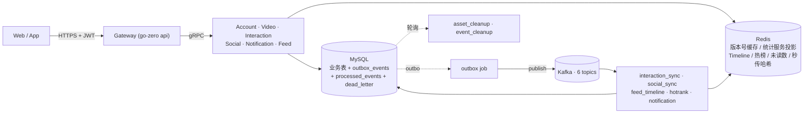

# feedsystem-zero

> 从零重建的**短视频信息流后端**，参考抖音/B 站的读写分离架构。用 Go 单仓多服务的方式，把"账号 / 视频 / 互动 / 社交 / 通知 / Feed"六个业务域拆成独立 RPC，配套 8 个 Job Worker 处理派生数据的最终一致性。

<p align="left">
  
  
  
  
  
  
</p>

---

## 一、项目亮点

- 🧱 **单仓多服务**：`apps/{gateway, account, video, interaction, social, notification, feed}` + `apps/job/*`，同一个 Go module 内共享 `common/*` 与 `model/*`，避免多仓依赖同步的痛苦。
- 🔗 **强一致写路径**：业务写入与派生事件在同一 MySQL 事务中落 `outbox_events`；outbox job 使用 `READ COMMITTED + SKIP LOCKED` 短事务认领、租约超时接管和指数退避后发布到 Kafka，**禁止在业务代码里直接生产消息**。
- 🌊 **最终一致派生数据**：Timeline / 未读数 / 视频计数 / 热榜等全部走 Kafka 事件驱动，消费者用 `processed_events` 唯一键保证幂等，失败进 `dead_letter_events` 旁路，不阻塞 partition。
- ⚙️ **互动事件批量同步**：`interaction_sync` 按 topic+partition 组内保序、组间并发，每 500 条一个幂等事务；事件按视频聚合后升序更新 MySQL 持久快照和 `stats_version`，再用 Lua CAS 批量投影 Redis。投影失败由 Kafka 重放自动修复，DB 不会重复计数。
- 🔁 **热点写事务可恢复**：互动和关注写事务只对 MySQL `1213/1205` 做有限指数退避重试；事件 ID 在事务外固定，重试不会制造重复事件。Social 在固定顺序锁住双账户后，用一条 CASE UPDATE 维护双方计数、一次批量 INSERT 写两条 Outbox，缩短锁持有时间。
- 🚀 **Feed 推拉分离**：小 V 走 fanout 写扩散到粉丝 inbox，大 V（`is_big_v` 只升不降）只写自己的 outbox，读侧懒加载合并 inbox 与关注的大 V outbox。
- 🧠 **可控降级**：Redis 作为高性能服务投影，Profile / Timeline / 未读数 / 评论首页均采用"版本号 + 惰性重算"；互动统计额外使用 MySQL `stats_version` 防旧快照覆盖，Redis 故障时可降级到 MySQL 持久快照。
- 🔥 **Gateway 聚合加速**：视频卡片的 Account 与 Interaction 批量 RPC 并发执行；匿名热榜使用 2 秒完整响应缓存，并以本地 SingleFlight + Redis 分布式锁合并回源。登录用户绕过成品缓存，保证 `is_liked` 实时准确。
- 📦 **文件秒传 + 一致性巡检**：分片上传 + 全局 file_hash 秒传；发布前批量校验唯一物理文件，事务内通过条件原子更新维护 `ref_count`，asset_cleanup 负责延迟物理删除、引用复活和 Active 资产对账。
- 🧹 **事件数据生命周期治理**：独立 `event_cleanup` Job 通过覆盖索引先选 ID、再按主键小批删除 sent Outbox 和过期消费幂等记录；带批间节流、单轮预算和单批超时，死信默认永久保留。
- 📊 **可复现压测**：内置造数、HTTP 压测和 E2E 工具，已完成 10000 用户、5000 视频规模验证，并对 Outbox、Kafka lag、Redis 版本投影和 MySQL 聚合做最终一致性验收。
- 🎨 **配套前端**：`web/` 目录内是 Vite + React 18 + TS + Tailwind + TanStack Query 实现的完整前端，覆盖登录、上传、播放、点赞、评论、关注、通知全流程。

---

## 二、总体架构



> 完整版架构图、ER 图、每个模块的时序图（共 17 张 Mermaid）见 [`docs/PROJECT_OVERVIEW.md`](./docs/PROJECT_OVERVIEW.md)。

---

## 三、模块一览

### 3.1 RPC 服务

| 模块 | 主要能力 |
|---|---|
| **account** | 注册 / 登录 / 登出 / 刷新 token / GetProfile / BatchGetProfiles / UpdateProfile |
| **video** | 分片上传 / PublishVideo / GetVideo / BatchGetVideos / ListUserVideos / DeleteVideo / 文件秒传去重 |
| **interaction** | LikeVideo / UnlikeVideo / PublishComment / DeleteComment / ListComments / BatchGetVideoStats |
| **social** | Follow / Unfollow / IsFollowing / BatchIsFollowing / ListFollowers / ListFollowings |
| **notification** | ListNotifications / GetUnreadCount / MarkNotificationRead / MarkAllNotificationsRead |
| **feed** | GetFollowingFeed / GetHotFeed / GetRecommendFeed |

### 3.2 Job 后台

| Job | 消费 topic | 主要动作 |
|---|---|---|
| **outbox** | — | `READ COMMITTED + SKIP LOCKED` 短事务认领，租约保护并发投递、失败退避重试 |
| **interaction_sync** | `interaction.like.events` / `interaction.comment.events` | topic+partition 并发；500 条批量幂等更新 MySQL + `stats_version` → Redis 版本 CAS 投影 |
| **social_sync** | `social.follow.events` | 关注状态缓存 & Profile 版本号 bump |
| **feed_timeline** | `feed.video.events` / `social.follow.events` | 推拉分离扇出，ready 丢失时主动 bootstrap |
| **hotrank** | `interaction.like.events` / `interaction.comment.events` | 独立维护 UTC 分钟窗口，Feed 按需构建衰减快照 |
| **notification** | `notification.events` | 通知落库、未读数 version bump、死信旁路 |
| **asset_cleanup** | 无（轮询扫库） | 延迟物理清理 file_assets，校准 ref_count，巡检磁盘缺失资产 |
| **event_cleanup** | 无（轮询扫库） | 带批间节流和单轮时间预算地清理已发送 Outbox、过期消费幂等记录；死信默认保留 |

---

## 四、快速开始

> 建议环境：Windows / macOS / Linux + Go 1.25 + Docker Desktop + Node 18+（跑前端时）。

### 4.1 起中间件

```bash
cd deploy
docker-compose up -d
# MySQL localhost:3308 (root/123456, db=feedsystem_zero)
# Redis localhost:6380 (password=123456)
# etcd  localhost:23790
# Kafka localhost:9094
```

建表 SQL 通过 `docker-entrypoint-initdb.d` 首次启动自动执行 `deploy/sql/001_*.sql ~ 017_*.sql`。已有数据库升级时需单独执行：

```bash
sudo docker exec -i feedsystem-zero-mysql \
  mysql -uroot -p123456 feedsystem_zero \
  < deploy/sql/017_stats_projection_and_event_cleanup.sql
```

### 4.2 建 Kafka Topic

```bash
bash deploy/kafka/create_topics.sh
```

### 4.3 起后端

RPC 与 Job 都是独立的 `main.go`，各起一个终端即可：

也可以使用统一启动脚本（默认不重置数据；压测前首次运行可增加 `--seed`）：

```bash
./scripts/start_all.sh --seed

# 基础容器已运行时，仅重新构建并重启后端，不触发 Docker/Sudo
./scripts/start_all.sh restart --no-deps
```

```bash
# RPC
go run apps/account/account.go             -f apps/account/etc/account.yaml
go run apps/video/video.go                 -f apps/video/etc/video.yaml
go run apps/interaction/interaction.go     -f apps/interaction/etc/interaction.yaml
go run apps/social/social.go               -f apps/social/etc/social.yaml
go run apps/notification/notification.go   -f apps/notification/etc/notification.yaml
go run apps/feed/feed.go                   -f apps/feed/etc/feed.yaml

# Gateway
go run apps/gateway/gateway.go             -f apps/gateway/etc/gateway.yaml

# Jobs
go run apps/job/outbox/outbox.go                     -f apps/job/outbox/etc/outbox.yaml
go run apps/job/interaction_sync/interaction_sync.go -f apps/job/interaction_sync/etc/interaction_sync.yaml
go run apps/job/social_sync/social_sync.go           -f apps/job/social_sync/etc/social_sync.yaml
go run apps/job/feed_timeline/feed_timeline.go       -f apps/job/feed_timeline/etc/feed_timeline.yaml
go run apps/job/hotrank/hotrank.go                   -f apps/job/hotrank/etc/hotrank.yaml
go run apps/job/notification/notification.go        -f apps/job/notification/etc/notification.yaml
go run apps/job/asset_cleanup/asset_cleanup.go       -f apps/job/asset_cleanup/etc/asset_cleanup.yaml
go run apps/job/event_cleanup/event_cleanup.go       -f apps/job/event_cleanup/etc/event_cleanup.yaml
```

### 4.4 起前端

```bash
cd web
pnpm install       # 或 npm install / yarn
pnpm dev           # http://127.0.0.1:5173
```

Vite dev server 会把 `/account`、`/video`、`/interaction`、`/social`、`/feed`、`/notification`、`/uploads` 反向代理到 gateway `127.0.0.1:8888`，因此**前端跑之前 gateway 必须先起**。前端详情见 [`web/README.md`](./web/README.md)。

### 4.5 配置说明

- 所有 `apps/**/etc/*.yaml` 内置的 MySQL / Redis 密码统一为 `123456`，与 `deploy/docker-compose.yml` 匹配，**仅用于本地开发**。部署到线上前请务必修改为强密码并从环境变量或密钥管理系统读取。
- `apps/account/etc/account.yaml` 里的邮件配置是**注册验证码专用**，仓库中已改为占位符：

  ```yaml
  Email:
    Host: smtp.163.com
    Port: 465
    Username: your-email@163.com
    Password: "YOUR_SMTP_AUTH_CODE"    # 邮箱服务商生成的 SMTP 授权码
    From: your-email@163.com
    FromName: FeedSystem 验证码
  ```

  想启用注册邮件验证码时，请填入你自己的邮箱 + 授权码；不填也不影响其他功能。
- JWT `AccessSecret` 默认是 `feedsystem-zero-dev-secret`，**上线前必须替换**。


---

## 五、目录结构

```
feedsystem-zero/
├── apps/
│   ├── gateway/            # HTTP 网关（go-zero api）
│   ├── account/            # 账号 RPC
│   ├── video/              # 视频 RPC
│   ├── interaction/        # 互动 RPC
│   ├── social/             # 社交 RPC
│   ├── notification/       # 通知 RPC
│   ├── feed/               # Feed RPC
│   └── job/
│       ├── outbox/                 # outbox → Kafka 投递
│       ├── interaction_sync/       # 点赞 / 评论落库消费者
│       ├── social_sync/            # 关注缓存 & 版本号维护
│       ├── feed_timeline/          # 推拉分离 Timeline 扇出
│       ├── hotrank/                # 热榜聚合
│       ├── notification/           # 通知落库 & 未读数 bump
│       ├── asset_cleanup/          # 文件资产延迟物理清理
│       └── event_cleanup/          # Outbox / 消费幂等 / 死信分批清理
├── common/
│   ├── eventx/             # Kafka topic、envelope、payload schema
│   ├── feedx/              # Timeline member 编码 & 大 V 判定
│   ├── gormx/              # GORM 初始化
│   ├── jwtx/               # JWT 签发 / 解析
│   ├── kafkax/             # Kafka producer / consumer 封装
│   ├── rediskey/           # 按业务拆分的 Redis key 常量
│   ├── notificationcache/  # 未读数版本号缓存
│   └── emailx/             # 邮件（注册验证码）
├── deploy/
│   ├── docker-compose.yml  # MySQL / Redis / etcd / Kafka 一键起
│   ├── sql/                # 001 ~ 017 建表、索引与迁移脚本
│   └── kafka/              # topic 创建脚本
├── model/                  # 事件与 GORM 表共享模型
├── docs/                   # 项目文档
│   └── PROJECT_OVERVIEW.md # ⭐ 完整设计说明（架构 / ER / 流程图 / API 汇总）
├── tests/                  # 造数、HTTP 压测、E2E 冒烟与并发测试
├── web/                    # React 前端
└── README.md               # 就是本文件
```

---

## 六、测试与验证

仓库内置 `seed` 和 `loadtest`，可直接通过 Gateway 压测完整后端链路。本轮使用 **10000 用户 + 5000 视频**，所有依赖与服务均运行在同一台本地开发机。seed 会在 `uploads/seed` 创建真实稀疏占位文件，使发布压测同样经过资产行锁和磁盘存在性校验；启动目录不同时可用 `-upload-dir` 指定与 gateway 相同的上传目录。

```bash
# 重置压测数据并生成正式规模数据
go run ./tests/cmd/seed -reset -reset-redis -users 10000 -videos 5000 -file-buckets 100

# 点赞/取消点赞正式压测
go run ./tests/cmd/loadtest \
  -scenario like -c 50 -d 60s -warmup 5s \
  -login-pool 500 -target-pool 2000 -v
```

| 场景 | 参数 | 成功率 | QPS | P99 |
|---|---|---:|---:|---:|
| 发布视频（3 轮中位数） | 5 并发 / 10s | 100% | 294.2 | 26ms |
| 发布视频（并发回归） | 20 并发 / 30s | 100% | 543.8 | 62ms |
| 发布视频（饱和压力） | 50 并发 / 60s | 100% | 572.9 | 182ms |
| 关注（3 轮中位数） | 10 并发 / 10s | 100% | 316.4 | 54ms |
| 关注流（3 轮中位数） | 20 并发 / 30s | 100% | 1160.8 | 28ms |
| 非空匿名热榜缓存命中（3 轮中位数） | 50 并发 / 30s | 100% | 8468.8 | 15ms |
| 点赞正式规模 | 50 并发 / 60s | 100% | 318.0 次循环/s | 325ms |

热榜冷快照使用单请求口径测试：显式删除当前分钟的 merge 快照、ready 标记和 Gateway 成品缓存后连续重建 3 次，均返回 20 条数据，耗时分别为 `15.856ms / 8.799ms / 10.646ms`，平均 **11.77ms**、最大 **15.86ms**。

> 点赞场景一次循环包含 Like + Unlike 两个写请求，`318.0 次循环/s` 约等于 `636 HTTP 写请求/s`。压测后的 Outbox 与 Kafka lag 均收敛为 0，旧 delta/pending key 无残留，Redis 版本投影、视频互动聚合、社交计数和文件资产引用对账差异也均为 0。

> 发布视频链路包含真实文件存在性校验、资产引用条件原子更新和 Outbox 写入。最终 `c=5` 三轮 QPS 为 `293.4 / 294.2 / 296.6`，中位数 294.2；`c=50` 压力下仍保持 100% 成功率，P99 由上一轮强一致实现的 286ms 降至 182ms。排空后未投递 Outbox、Feed Kafka lag 和资产引用差异均为 0。

关键包已通过 `go test -race`，`go vet` 无输出。完整命令、三轮原始结果、测试口径和一致性 SQL 见 [完整测试记录](./docs/PROJECT_OVERVIEW.md#146-测试压测与一致性验收2026-08-13-最终回归)。E2E 冒烟目前唯一的环境限制是 `@loadtest.local` 虚构邮箱无法通过真实 163 SMTP 接收验证码。

---

## 七、几个必须知道的约定

1. **身份识别**：所有需要 `user_id` 的 RPC 入参**必须**由 Gateway 从 JWT 中解析后填入，**不接收前端传值**。
2. **幂等键**：视频发布 `(author_id, request_id)`；评论 `(user_id, request_id)`；事件处理 `(event_id, consumer_name)`；通知去重 `business_key`。
3. **软删除**：`videos` / `likes` / `comments` / `follows` / `notifications` 全部软删，配合 `status` + `deleted_at` 字段做状态机。
4. **游标分页**：列表接口一律用 "排序字段 + 主键" 双游标（例如 `(occurred_at, id)`），**禁止 offset 分页**。
5. **批量接口**：Gateway 聚合层禁止 N+1，统一走 `BatchGetProfiles` / `BatchGetVideos` / `BatchGetVideoStats` / `BatchIsFollowing`。
6. **Redis Key**：一律通过 `common/rediskey/*.go` 中的函数生成，禁止业务代码里手写字符串拼接。
7. **写路径闭环**：业务写入 + `outbox_events` 必须同事务，**禁止直接调用 Kafka 生产者**。

---

## 八、深入阅读

- 📘 **一次读懂整个系统** → [`docs/PROJECT_OVERVIEW.md`](./docs/PROJECT_OVERVIEW.md)
  - 总体架构 / ER 图 / 事件契约 / Outbox 模式 / 各模块时序图（共 17 张 Mermaid）
  - Redis Key 命名空间 / 一致性 · 并发 · 幂等设计原则
  - Gateway HTTP API 汇总 / 常见问题排查
- 🎨 **前端指南** → [`web/README.md`](./web/README.md)
- 🗄️ **数据库迁移** → [`deploy/sql/`](./deploy/sql/)
- ✉️ **事件契约** → [`common/eventx/`](./common/eventx/) 与 [`model/event.go`](./model/event.go)

---

## 九、常用命令

```bash
go build ./...       # 全量编译
go vet ./...         # 静态检查
go test ./...        # 单元测试

# 改 proto 后重新生成 RPC
cd apps/account
goctl rpc protoc account.proto --go_out=. --go-grpc_out=. --zrpc_out=. --style=goZero

# 改 gateway.api 后重新生成 API
cd apps/gateway
goctl api go -api gateway.api -dir . --style=goZero
```

---

## License

本项目仅用于个人学习目的，暂未指定开源协议。
