# feedsystem-zero 项目说明文档

> 生成时间：2026-07-30  
> 适用版本：main 分支（含 015_account_big_v_flag.sql；对应 commit 687d0ab 完善后端一致性与文件资产清理）  
> 说明：本文档基于当前仓库真实代码生成，作为项目结构、数据模型、事件流转、一致性策略、缓存闭环、并发保护的完整索引。**外部读者读完这一份文档即可理解整个系统**。

---

## 目录

1. [项目定位](#一项目定位)
2. [总体架构](#二总体架构)
3. [目录结构](#三目录结构)
4. [微服务与职责总览](#四微服务与职责总览)
5. [数据模型（MySQL）](#五数据模型mysql)
6. [事件契约（Kafka）](#六事件契约kafka)
7. [Outbox 事务发件箱模式](#七outbox-事务发件箱模式)
8. [各模块详解与流程图](#八各模块详解与流程图)
   - 8.1 [Account 账号模块](#81-account-账号模块)
   - 8.2 [Video 视频模块](#82-video-视频模块)
   - 8.3 [Interaction 互动模块](#83-interaction-互动模块)
   - 8.4 [Social 社交模块](#84-social-社交模块)
   - 8.5 [Notification 通知模块](#85-notification-通知模块)
   - 8.6 [Feed 推拉分离模块](#86-feed-推拉分离模块)
   - 8.7 [HotRank 热榜模块](#87-hotrank-热榜模块)
   - 8.8 [Gateway 网关](#88-gateway-网关)
9. [关键异步 Job 详解](#九关键异步-job-详解)
10. [跨模块端到端流程图](#十跨模块端到端流程图)
11. [Redis Key 命名空间](#十一redis-key-命名空间)
12. [一致性 / 并发 / 幂等设计原则](#十二一致性--并发--幂等设计原则)
13. [Gateway HTTP API 汇总](#十三gateway-http-api-汇总)
14. [开发与部署](#十四开发与部署)
15. [约定与最佳实践](#十五约定与最佳实践)
16. [附录：核心代码文件索引](#十六附录核心代码文件索引)
17. [最近更新（Changelog）](#十七最近更新changelog)

---

## 一、项目定位

`feedsystem-zero` 是一个**从零重建的短视频信息流后端**，参考抖音/B 站的读写分离架构：

- **同步侧**：账号、视频、社交、互动、通知、Feed 六个 RPC，负责用户可感知的写操作与读操作。
- **异步侧**：Kafka + 七个 Job Worker，负责派生数据（Timeline、计数、通知、热榜、文件资产清理）的最终一致维护。
- **网关侧**：go-zero API 网关承担鉴权、参数校验、跨模块聚合，前端不直连 RPC。

技术栈：`Go 1.25` + `go-zero (api+rpc)` + `GORM` + `MySQL 8.0` + `Redis 7` + `Kafka` + `etcd`。

**核心设计目标**：

1. **强一致的写路径**：用户可感知的写操作与其派生事件在同一个 MySQL 事务里落地（outbox 发件箱）。
2. **最终一致的派生数据**：Timeline、通知、计数缓存通过 Kafka 事件驱动，允许秒级延迟但保证不丢、幂等。
3. **可控降级**：Redis 是加速层，任何时刻挂掉都必须能降级到 MySQL 直查。
4. **横向扩展**：outbox dispatcher 支持多实例并发（SKIP LOCKED），消费者按 partition 顺序处理。

---

## 二、总体架构

```mermaid
flowchart LR
    Client["Web / App<br/>(前端)"] -->|HTTPS + JWT| Gateway["Gateway<br/>(go-zero api)"]

    Gateway -->|gRPC| Account["Account RPC<br/>账号 / Profile"]
    Gateway -->|gRPC| Video["Video RPC<br/>视频元数据 / 文件资产"]
    Gateway -->|gRPC| Interaction["Interaction RPC<br/>点赞 / 评论"]
    Gateway -->|gRPC| Social["Social RPC<br/>关注 / 粉丝"]
    Gateway -->|gRPC| Notification["Notification RPC<br/>通知列表 / 未读数"]
    Gateway -->|gRPC| Feed["Feed RPC<br/>关注流 / 热榜 / 推荐"]

    Account --> MySQL[("MySQL<br/>accounts / videos / follows<br/>likes / comments / notifications<br/>file_assets / outbox / processed / dead_letter")]
    Video --> MySQL
    Interaction --> MySQL
    Social --> MySQL
    Notification --> MySQL

    Account --> Redis[("Redis<br/>Profile 版本号缓存<br/>点赞计数 / delta pending·acked<br/>Timeline ZSet / 热榜快照<br/>未读数 version / 秒传全局哈希"]
    Video --> Redis
    Interaction --> Redis
    Social --> Redis
    Notification --> Redis
    Feed --> Redis
    Feed --> MySQL

    Gateway --> Disk[("本地磁盘<br/>uploads/{yyyy/mm/dd}/<br/>file_hash.ext")]
    Video --> Disk

    MySQL -.outbox_events.-> Outbox["Outbox Job<br/>扫描 & 投递"]
    Outbox -->|Publish| Kafka[("Kafka<br/>6 topics")]

    Kafka --> InteractionSync["interaction_sync Job<br/>点赞/评论落库 + eventID ack"]
    Kafka --> SocialSync["social_sync Job<br/>关注缓存 & 版本号"]
    Kafka --> FeedTimeline["feed_timeline Job<br/>推拉分离扇出 + global ready 自愈"]
    Kafka --> HotRank["hotrank Job<br/>热度增量聚合"]
    Kafka --> NotifJob["notification Job<br/>写通知 & bump 未读数"]

    MySQL -.轮询扫库.-> AssetCleanup["asset_cleanup Job<br/>延迟物理清理 file_assets"]
    AssetCleanup -->|os.Remove| Disk
    AssetCleanup -->|DEL fsz:chunkupload:hash:global| Redis
    AssetCleanup --> MySQL

    InteractionSync --> Redis
    SocialSync --> Redis
    FeedTimeline --> Redis
    HotRank --> Redis
    NotifJob --> MySQL
    NotifJob --> Redis
```

**核心约束**：

- 所有写操作走 "MySQL 事务 + `outbox_events`"，**禁止在业务代码里直接生产 Kafka 消息**。
- 所有跨模块的用户身份必须来自 Gateway 从 JWT 解析出的 `user_id`，**不信任前端传的 user_id**。
- 所有 Redis key 通过 `common/rediskey/*.go` 集中生成，统一 `fsz:` 前缀。
- 消费者用 `processed_events` 唯一键做幂等，失败进 `dead_letter_events`，绝不阻塞 partition。

---

## 三、目录结构

```
feedsystem-zero/
├── apps/
│   ├── gateway/              # API 网关（go-zero api）
│   │   ├── gateway.api       # 对外 HTTP 契约
│   │   └── internal/{handler, logic, middleware, svc, types, config}
│   ├── account/              # 账号 RPC
│   ├── video/                # 视频 RPC
│   ├── interaction/          # 互动 RPC
│   ├── social/               # 社交 RPC
│   ├── notification/         # 通知 RPC
│   ├── feed/                 # Feed RPC
│   └── job/
│       ├── outbox/           # Outbox → Kafka 投递
│       ├── interaction_sync/ # 点赞/评论 Kafka 消费者
│       ├── social_sync/      # 关注 Kafka 消费者
│       ├── feed_timeline/    # 推拉分离 Timeline 扇出
│       ├── hotrank/          # 热榜聚合 Job
│       ├── notification/     # 通知落库 Job
│       └── asset_cleanup/    # 文件资产物理清理 Job（延迟删除 + 复活兜底）
├── common/
│   ├── eventx/               # 事件 topic、envelope、payload schema
│   ├── feedx/                # Timeline member 编码 & 大 V 判定
│   ├── gormx/                # GORM 初始化
│   ├── jwtx/                 # JWT 签发/解析
│   ├── kafkax/               # Kafka producer/consumer 封装
│   ├── rediskey/             # 按模块拆分的 8 个 Redis key 文件
│   ├── notificationcache/    # 未读数版本号缓存
│   └── emailx/               # 邮件（注册验证码）
├── deploy/
│   ├── docker-compose.yml    # MySQL/Redis/etcd/Kafka 一键起
│   ├── sql/001~015_*.sql     # 建表 & 迁移
│   └── kafka/create_topics.sh
├── model/                    # 事件模型和 GORM 共享表模型
├── docs/                     # 本文档所在目录
└── web/                      # React 前端（Vite + TS + Tailwind）
```

---

## 四、微服务与职责总览

### 4.1 RPC 服务（6 个）

| 模块 | 端口位 | 主要能力 | 状态 |
|---|---|---|---|
| **account** | rpc | 注册 / 登录 / 登出 / 刷新 token / GetProfile / BatchGetProfiles / UpdateProfile | ✅ 已实现 |
| **video** | rpc | 分片上传 / PublishVideo / GetVideo / BatchGetVideos / ListUserVideos / DeleteVideo / 文件秒传去重 | ✅ 已实现 |
| **interaction** | rpc | LikeVideo / UnlikeVideo / PublishComment / DeleteComment / ListComments / BatchGetVideoStats | ✅ 已实现 |
| **social** | rpc | Follow / Unfollow / IsFollowing / BatchIsFollowing / ListFollowers / ListFollowings | ✅ 已实现 |
| **notification** | rpc | ListNotifications / GetUnreadCount / MarkNotificationRead / MarkAllNotificationsRead | ✅ 已实现 |
| **feed** | rpc | GetFollowingFeed / GetHotFeed / GetRecommendFeed | ✅ 已实现 |

### 4.2 Job 后台（7 个）

| Job | 消费 topic | 主要动作 | 状态 |
|---|---|---|---|
| **outbox** | — | 扫描 `outbox_events`，SKIP LOCKED 抢占，投递到 Kafka | ✅ |
| **interaction_sync** | `interaction.like.events` / `interaction.comment.events` | 消费 → 落库 → 按 event_id 对 Redis 增量 ack；生产 `video.stat.delta.events` | ✅ |
| **social_sync** | `social.follow.events` | 关注状态缓存 & Profile 版本号 bump | ✅ |
| **feed_timeline** | `feed.video.events` / `social.follow.events` | 推拉分离：小 V 写扩散、大 V author outbox；ready 丢失时主动 bootstrap | ✅ |
| **hotrank** | `video.stat.delta.events` | 分钟级窗口滚动、生成 hot ZSet | ✅ |
| **notification** | `notification.events` | 通知落库、未读数 version bump、死信旁路 | ✅ |
| **asset_cleanup** | 无（轮询扫库） | 延迟物理清理 `file_assets`；抢占超时兜底 + 引用复活；DEL 秒传全局缓存 | ✅ |

---

## 五、数据模型（MySQL）

```mermaid
erDiagram
    accounts ||--o{ videos : "author_id"
    accounts ||--o{ likes : "user_id"
    accounts ||--o{ comments : "user_id"
    accounts ||--o{ follows : "follower_id / following_id"
    accounts ||--o{ notifications : "receiver_id"
    videos ||--o{ likes : "video_id"
    videos ||--o{ comments : "video_id"
    videos }o--|| file_assets : "play_url / cover_url"
    videos ||--o{ video_tags : "video_id"
    tags ||--o{ video_tags : "tag_id"

    accounts {
        BIGINT id PK
        VARCHAR username UK
        VARCHAR email UK
        VARCHAR password_hash
        VARCHAR avatar_url
        VARCHAR bio
        BIGINT follower_count "冗余,social维护"
        BIGINT following_count "冗余,social维护"
        TINYINT is_big_v "大V标志,只升不降"
        DATETIME created_at
    }
    videos {
        BIGINT id PK
        BIGINT author_id
        VARCHAR title
        VARCHAR play_url
        VARCHAR cover_url
        VARCHAR request_id "幂等键"
        BIGINT likes_count
        BIGINT comments_count
        BIGINT popularity "热度"
        TINYINT status "1正常 2作者删 3审核下架"
        DATETIME deleted_at
    }
    file_assets {
        BIGINT id PK
        VARCHAR file_hash UK "秒传去重键"
        VARCHAR url UK
        BIGINT ref_count "引用计数"
        TINYINT status
    }
    follows {
        BIGINT id PK
        BIGINT follower_id
        BIGINT following_id
        TINYINT status "软删除"
        DATETIME updated_at
    }
    likes {
        BIGINT id PK
        BIGINT video_id
        BIGINT user_id
        TINYINT status
    }
    comments {
        BIGINT id PK
        BIGINT video_id
        BIGINT user_id
        TEXT content
        VARCHAR request_id
    }
    notifications {
        BIGINT id PK
        BIGINT receiver_id
        VARCHAR business_key UK "去重键"
        VARCHAR type "like/comment/follow"
        BIGINT actor_id
        JSON payload
        TINYINT status "1未读 2已读 3已撤回"
        DATETIME occurred_at
        DATETIME deleted_at
    }
    outbox_events {
        BIGINT id PK
        VARCHAR event_id UK
        VARCHAR topic
        JSON payload
        TINYINT status
        INT retry_count
        VARCHAR lock_token
        DATETIME next_retry_at
    }
    processed_events {
        BIGINT id PK
        VARCHAR event_id
        VARCHAR consumer_name
        UK event_consumer "幂等键"
    }
    dead_letter_events {
        BIGINT id PK
        VARCHAR consumer_name
        VARCHAR topic
        MEDIUMTEXT payload
        TEXT last_error
    }
```

### 5.1 SQL 迁移文件时间线

| 文件 | 内容摘要 |
|---|---|
| `001_schema.sql` | accounts / videos / file_assets / tags / video_tags / likes / comments / interaction_events / outbox_events / processed_events / dead_letter_events |
| `002_file_assets.sql` | 文件资产索引 |
| `003_video_asset_indexes.sql` | 视频 play_url/cover_url 索引 |
| `004_interaction_job_infra.sql` | 互动 job 基础设施 |
| `005~006` | 点赞/评论列表索引 |
| `007_outbox_dispatcher_final.sql` | Outbox 分发锁字段 `lock_token` / `next_retry_at` |
| `008_interaction_sync_dead_letters.sql` | 死信表 |
| `009_video_request_id.sql` | 视频发布幂等键 |
| `010_follows.sql` | follows 关注表 |
| `011_social_final_indexes.sql` | 社交最终索引 |
| `012_feed_timeline_indexes.sql` | Feed 冷启动索引 |
| `013_account_follow_counters.sql` | accounts 增加 follower_count / following_count 冗余字段 |
| `014_notifications.sql` | `notifications` 表（含 `uk_notification_business` 唯一键 + `(receiver_id, occurred_at, id)` 复合索引） |
| `015_account_big_v_flag.sql` | accounts.is_big_v 大 V 标志位 + 存量数据回填 |

---

## 六、事件契约（Kafka）

### 6.1 Topic 一览

来自 `common/eventx/topics.go`：

| Topic | Producer | Consumer | 用途 |
|---|---|---|---|
| `interaction.like.events` | interaction rpc (outbox) | interaction_sync | 点赞/取消点赞落 Redis 计数 |
| `interaction.comment.events` | interaction rpc (outbox) | interaction_sync | 评论创建/删除计数 |
| `video.stat.delta.events` | interaction_sync | **hotrank** | 视频热度增量聚合 |
| `feed.video.events` | video rpc (outbox) | feed_timeline | 视频发布/删除 → Timeline 扇出 |
| `social.follow.events` | social rpc (outbox) | social_sync + feed_timeline | 关注/取关缓存 & Timeline 回填 |
| `notification.events` | 多方 rpc (outbox) | **notification** | 系统通知（关注/点赞/评论） |

### 6.2 事件类型

来自 `common/eventx/events.go`：

```
video.published / video.deleted        → FeedVideoEvent
like.created / like.deleted            → LikeEvent
comment.created / comment.deleted      → CommentEvent
video.stat.delta                       → VideoStatDeltaEvent
follow.created / follow.deleted        → FollowEvent
notification.create / notification.delete → NotificationEvent
```

统一封装为 `Envelope`：`{event_id, event_type, aggregate_type, aggregate_id, occurred_at, payload}`。

---

## 七、Outbox 事务发件箱模式

这是本项目**跨服务一致性的基石**。业务写操作与事件发布必须原子，否则会出现"MySQL 写成功但事件丢了"或"事件发了但 MySQL 回滚了"。

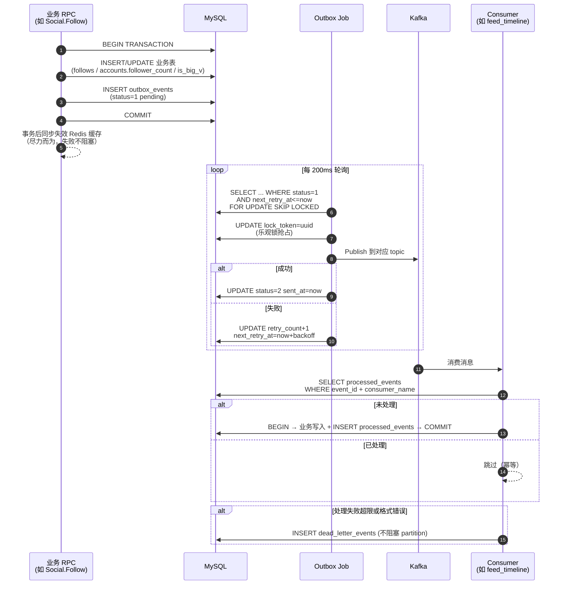

**关键点**：

- `outbox_events` 使用 `SELECT ... FOR UPDATE SKIP LOCKED` + `lock_token` 双保险，支持多实例并发调度。
- `processed_events` 的唯一键 `(event_id, consumer_name)` 保证每个消费者对同一事件只处理一次。
- 死信隔离：失败事件不阻塞主流程，进 `dead_letter_events` 供人工介入。
- 阶梯退避：`next_retry_at = now + backoff(retry_count)`。

---

## 八、各模块详解与流程图

### 8.1 Account 账号模块

**职责**：用户身份、Profile 数据、JWT 签发、邮箱验证码。

**核心 RPC**：

| Rpc | 说明 |
|---|---|
| `Register` | 邮箱 + 用户名 + 密码；先校验邮箱验证码 |
| `Login` | 邮箱 + 密码；签发 access token + refresh token |
| `Logout` | DEL `fsz:token:{userID}`，使 access token 立刻失效 |
| `RefreshToken` | 用 refresh token 换新的 access token |
| `GetProfile` | 版本号缓存：读 version → 组合 key 读 profile JSON → miss 回源 |
| `BatchGetProfiles` | Feed / 评论列表批量拉作者信息 |
| `UpdateProfile` | 更新头像 / bio；事务内 INCR profile version |

**Profile 版本号缓存流程**：

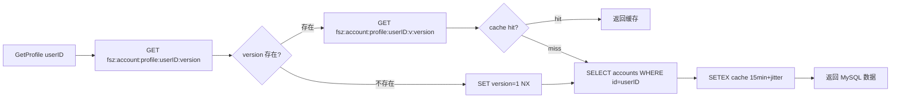

**关键点**：
- 更新时 `INCR version`（原子），旧版本 key 无需删除，TTL 到期自动淘汰。
- **粉丝数变化时也要 INCR 两侧的 version**（follower 和 following），否则 BatchGetProfiles 会读到旧的 follower_count。

---

### 8.2 Video 视频模块

**职责**：视频元数据管理、分片上传、文件秒传去重、软删除。

**核心 RPC**：

| Rpc | 说明 |
|---|---|
| `PublishVideo` | 事务：INSERT videos + INSERT video_tags + INSERT outbox_events(video.published)；`(author_id, request_id)` 幂等 |
| `GetVideo` | Redis entity cache + MySQL 回源 |
| `BatchGetVideos` | Feed 拉视频卡片时用 |
| `ListUserVideos` | 用户主页视频列表，游标分页 |
| `DeleteVideo` | 软删除：`status=2, deleted_at=now`，file_assets.ref_count-1，发 outbox(video.deleted) |

**文件秒传方案 B**：

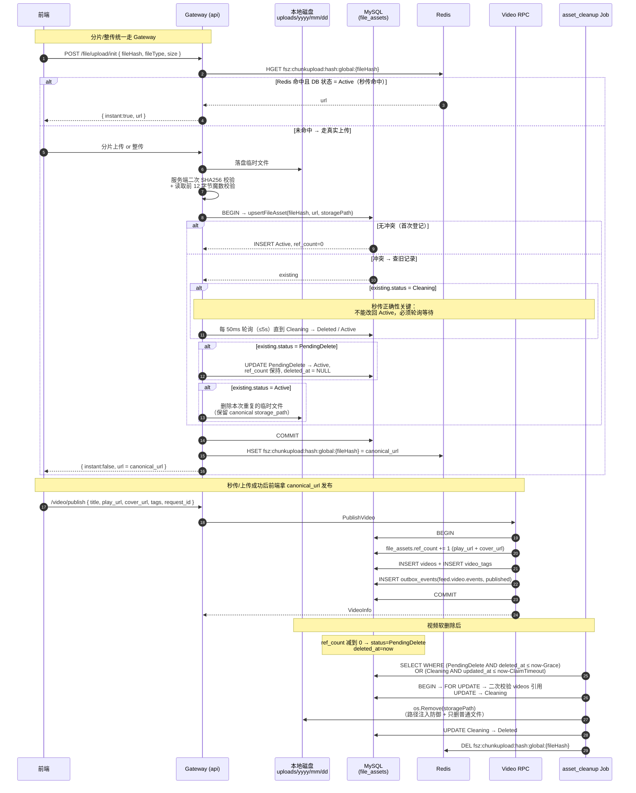

**关键点**：`ref_count` 调整与 `videos` 创建/软删除必须在 **video-rpc 同一事务内**。这样 file_assets 永远不会出现“孤儿引用”（视频删了但资产还在）或“悬空视频”（视频存在但资产没引用）。

**file_assets 四状态机（commit 687d0ab 完善）**：

| 状态 | 含义 | 可秒传 | 可被 asset_cleanup 抢占 |
|---|---|---|---|
| `Active(1)` | 正常引用中（ref_count 可为 0 但仍在 grace 期） | ✅ | ref_count=0 且过了 GraceSeconds |
| `PendingDelete(2)` | 最后一个引用删除后标记待删 | ❌ | ✅ |
| `Cleaning(4)` | 已被 asset_cleanup 临时抢占，即将物理删除 | ❌（轮询等待） | 只能同一抢占者推进 |
| `Deleted(3)` | 已物理删除 | ❌ | ❌ |


**秒传正确性保护**：`upsertFileAsset` 发现已存在相同 hash 的记录时，如果处于 `Cleaning` 则必须轮询等待（默认 5s），**绝不能直接将 Cleaning 改回 Active**——否则 asset_cleanup 可能在激活后删除新上传文件。若已处于 `PendingDelete/Deleted`，则以本次上传文件为准将其 UPDATE 回到 `Active`。

**文件魔数二次校验**：`saveMultipartUpload` 和分片合并时都会调用 `validateUploadedFileSignature`，根据扩展名预期校验前 12 字节魔数（jpg/png/webp/mp4/webm），防止伪造后缀或传输损坏。

**上传接口统一返回 canonical URL**：`upsertFileAsset` 返回数据库中的规范副本 URL，`UploadVideo` / `UploadCover` / `CompleteVideoUpload` 均使用 `canonicalAsset.URL` 返回，避免同一 hash 因建议路径不同导致视频 play_url 不一致。
---

### 8.3 Interaction 互动模块

**职责**：点赞、评论、点赞状态查询、批量计数。

**核心 RPC**：

| Rpc | 说明 |
|---|---|
| `LikeVideo` / `UnlikeVideo` | 事务：INSERT/UPDATE likes + INSERT outbox_events(like.created/deleted) |
| `PublishComment` | `(user_id, request_id)` 幂等；事务写 comments + outbox |
| `DeleteComment` | 软删除，事务写 outbox |
| `ListComments` | 游标分页（`created_at DESC, id DESC`） |
| `BatchGetVideoStats` | Feed 卡片拉齐 likes_count / is_liked / comments_count |

**点赞/取消点赞写路径（eventID 驱动的 pending/ack 双标记）**：

1. RPC 事务：INSERT/UPDATE `likes` + INSERT `outbox_events(like.created/deleted)` + 生成 `eventID`。
2. 事务提交后，调用 `applyRedisLikeState(eventID, ...)`：
   - Lua 脚本 `applyInteractionDeltaScript` 一次性 SET `fsz:interaction:delta:pending:{eventID} NX EX`；若已存在 pending / ack 则跳过（自然幂等）。
   - 同一个 Lua 内 HINCRBY `video.like_delta / comment_delta / popularity_delta`，并 DEL `VideoStatsCacheKey`。
3. Kafka Consumer 消费到同一 eventID：先 UPSERT MySQL 基准计数。
4. `FlushLikeEvents` / `FlushCommentEvents` 在 MySQL COMMIT 后按 eventID 批量 ack：
   - Lua 脚本 `acknowledgeInteractionDeltaScript` ：若 ack 已存在→不重复；否则→若 pending 存在则 HINCRBY 回写 delta、DEL pending；SET ack EX、DEL `VideoStatsCacheKey`、INCR `LikeUserVideosListVersionKey` 或 `CommentListVersionKey`。

**为什么需要 pending/ack**？旧方案采用 “Job 参照 processed_events 判算重复，只对首次成功事件 ‘减回’ Redis delta”，一旦遇到 “DB 提交了但 Redis 减回失败” 的小概率中断窗口，重试时会因 processed_events 已存在而直接跳过 Redis，造成 delta 永久多算。pending/ack 双标记把“写进实时增量”与“确认实时增量已入库”拆成两步，无论在线请求与 Consumer 谁先 谁后、重试多少次，都能在 Lua 层自然幂等。

**pending/ack 双标记时序（三场景对照）**：

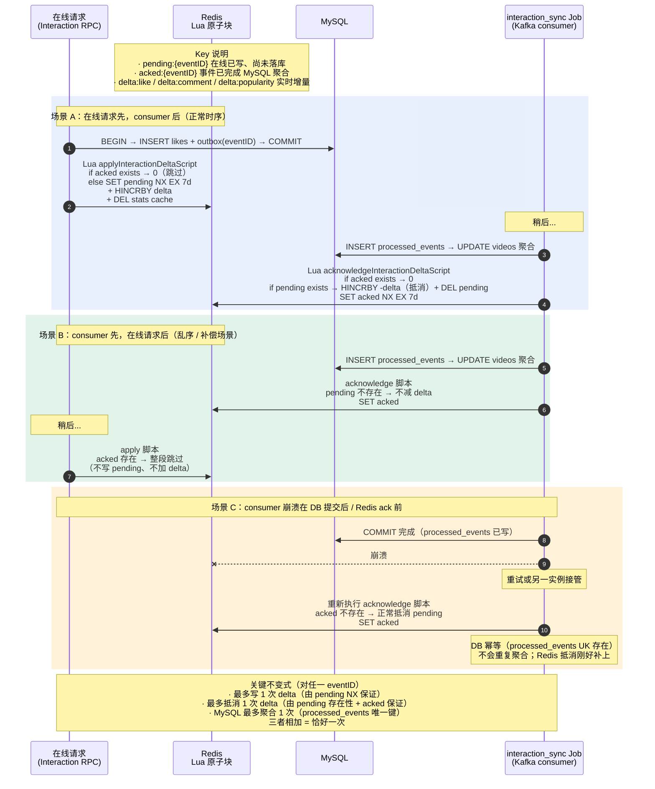

**点赞流程**：

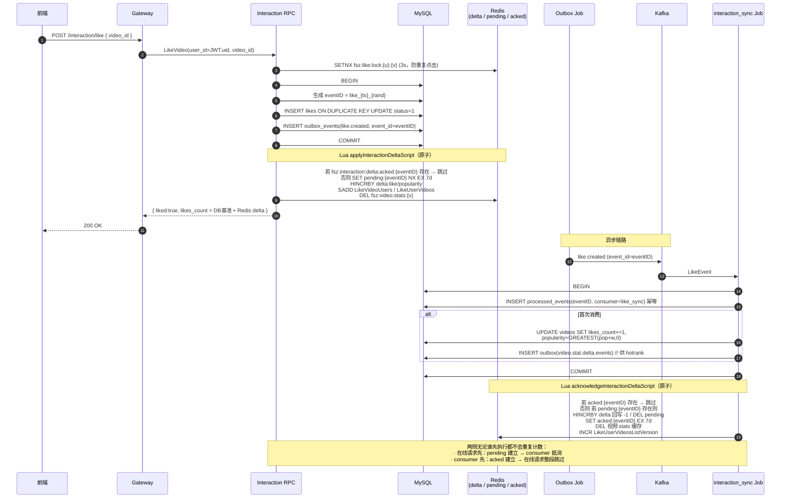

---

### 8.4 Social 社交模块

**职责**：关注关系、粉丝/关注列表、粉丝数维护、大 V 升级。

**核心 RPC**：

| Rpc | 说明 |
|---|---|
| `Follow` | 事务：`INSERT follows ON DUPLICATE KEY UPDATE` + accounts 双向计数 +1 + **大 V 升级判定** + 双 outbox 事件（业务 + 通知） |
| `Unfollow` | 事务：软删 follows + accounts 双向计数 -1（GREATEST 防负）+ 双 outbox |
| `IsFollowing` | Redis `fsz:social:following:{f}:{t}` |
| `BatchIsFollowing` | 视频列表页批量查关注状态 |
| `ListFollowers` / `ListFollowings` | 首页 Redis 缓存 + 构建锁 + 分页兜底 MySQL |

**Follow 关键事务**（包含防死锁双侧行锁）：

为防止 A↔B 同时互相关注时两个事务分别先锁对方行形成锁序反转，事务开始先按 `MIN(followerID, followingID)` → `MAX(followerID, followingID)` 顺序对 accounts 表双行 `SELECT FOR UPDATE`（见 `lockFollowAccounts`），再读写 follows / 计数字段。

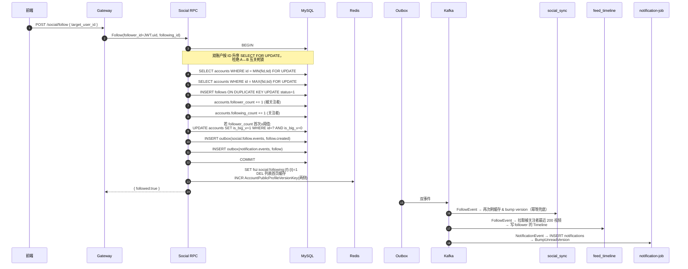

**大 V 判定详解**：见 [8.6 Feed 推拉分离](#86-feed-推拉分离模块)。

---

### 8.5 Notification 通知模块

**职责**：接收 `notification.events`（关注/点赞/评论触发），维护 `notifications` 表，提供未读数 & 通知列表。

**核心 RPC**（`apps/notification/internal/logic/`）：

| Rpc | 说明 |
|---|---|
| `ListNotifications` | `(occurred_at DESC, id DESC)` 复合游标分页；`receiver_id` 兜底校验 |
| `GetUnreadCount` | 走 `notificationcache.LoadUnreadCount` 版本号缓存，miss 时 `SELECT COUNT(*) WHERE status=1`，Redis 挂了直接回源 |
| `MarkNotificationRead` | UPDATE 单条为已读；`rowsAffected>0` 时 `BumpUnreadVersion` |
| `MarkAllNotificationsRead` | 批量 UPDATE 所有未读为已读；`changed>0` 时 `BumpUnreadVersion` |

**未读数缓存方案 B（版本号 + 惰性重算）**：

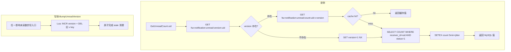

**Notification Job 6 种情况判定**：

Job 消费 `notification.events` 时，需要精确判断"这次事件是否真的影响未读数"，只在影响时 `BumpUnreadVersion`：

| # | 场景 | MySQL 动作 | 未读数变化 | bump? |
|---|---|---|---|---|
| 1 | 全新通知 (business_key 不存在) + create | INSERT (status=1) | +1 | ✅ |
| 2 | 已撤回通知 (status=3) + create（复活） | UPDATE 3→1 | +1 | ✅ |
| 3 | 旧事件（OccurredAt < 现有 record） | 什么都不做 | 不变 | ❌ |
| 4 | 未读通知 + delete | UPDATE 1→3 | -1 | ✅ |
| 5 | 已读通知 + delete | UPDATE 2→3 | 不变 | ❌ |
| 6 | 已撤回通知 + 重复 delete | UPDATE 3→3 (无变化) | 不变 | ❌ |

`applyNotificationEvent` 返回 `bumpReceiverID uint64`（0 表示不需要 bump），事务 COMMIT 成功后再统一调 `BumpUnreadVersion`。

**通知流程**：

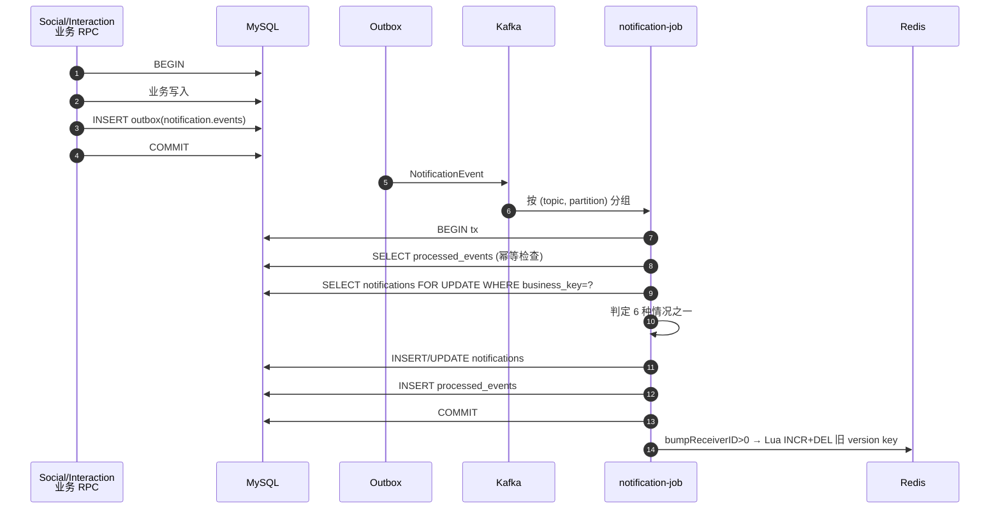

---

### 8.6 Feed 推拉分离模块

**职责**：关注流（GetFollowingFeed）、热榜（GetHotFeed）、推荐流（GetRecommendFeed）。

Feed RPC **只返回 video_id 和排序信息**，具体视频详情、作者昵称、点赞数由 Gateway 分别通过三个 Batch 接口聚合，避免 Feed 服务越权访问其他领域数据。

#### 8.6.1 推拉分离核心思想

|  | 小 V (is_big_v=0) | 大 V (is_big_v=1) |
|---|---|---|
| 写路径 | 发视频时 fanout 到所有粉丝的 inbox ZSet | 只写自己的 author outbox ZSet |
| 读路径 | 直接读 inbox | 拉取关注列表中的大 V outbox 合并 |
| 优点 | 读快 | 写快，不放大 |
| 缺点 | 写放大 | 读时多几次 ZRANGE |

**大 V 判定采用 `is_big_v` 标志位而非实时 `follower_count`**：

- 一旦升为大 V 就永久保留（`WHERE is_big_v=0` 幂等升级）。
- 避免大 V 掉粉后再涨粉的"反向穿越"：如果按粉丝数实时判定，掉粉那一瞬间历史视频从粉丝的 inbox 里 fanout 走了，反向穿越时再涨回来也拿不回来。

#### 8.6.2 GetFollowingFeed 流程

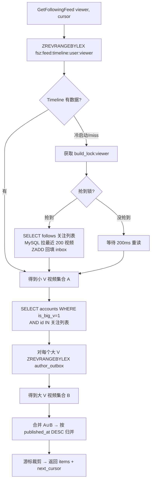

#### 8.6.3 feed_timeline Job 事件驱动

- **video.published**：查作者 `is_big_v`。小 V → fanout 到所有活跃粉丝 inbox；大 V → 只 ZADD 作者 outbox。
- **video.deleted**：从相应 ZSet 中移除（回读 MySQL 事实状态兜底）。
- **follow.created**：拉取被关注者最近 200 视频，写 follower inbox（如果被关注者是大 V，跳过，直接依赖读侧合并 outbox）。
- **follow.deleted**：从 follower inbox 中移除被关注者的所有视频。

**Global Timeline ready 禁不可丢**：全局最新流 ZSet `fsz:feed:global_timeline` 需要配套一个 `ready` 标记才可以接受写入，防止尚未初始化时写了一半的数据。一旦指标丢失（例如 Redis flush），writer 会返回 `errGlobalTimelineNotReady`；旧方案靠 Kafka 无限重试无人恢复。新方案：**consumer 层捕获该错误后调用 `BootstrapGlobalTimeline`（带分布式锁）完成一次重建，再重试当前事件**，避免 Kafka 原地重试风暴。

**Timeline 冷启动保护**：
- `fsz:feed:timeline:build_lock:{viewer}` 5-10s 锁，避免同一用户多个请求并发触发 MySQL 全量回填。
- `fsz:feed:timeline:user:{viewer}` 使用 `EXPIRE 7d`，长期不活跃用户自动淘汰。
#### 8.6.4 Timeline ZSet 编码

来自 `common/feedx/timeline.go`：

- 所有元素 `score=0`，实际顺序由 member 字典序决定。
- Member 格式：`{publishedAt:19位}:{videoID:20位}`，前 0 补齐，保证 lex 排序等价于数值排序。
- 使用 `ZREVRANGEBYLEX` 分页，游标格式 `(member` 实现排他上界，无重复无遗漏。

---

### 8.7 HotRank 热榜模块

**职责**：消费 `video.stat.delta.events`（点赞增量、评论增量、播放增量），维护滚动窗口的热度 ZSet。

**核心机制**：

- **多窗口**：60min / 6h / 24h 三个滑动窗口的 ZSet（不同 key）。
- **原子操作**：`ZINCRBY hot:window:60m {videoID} delta_score`。
- **窗口滚动**：定时删除窗口外的数据（Redis 惰性淘汰 + Job 兜底扫描）。
- **热度公式**：`score = w1*likes + w2*comments + w3*plays + time_decay`。

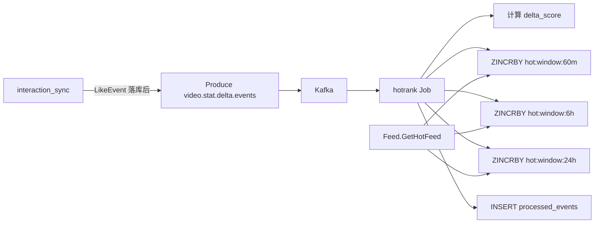

Feed.GetHotFeed 直接 `ZREVRANGE hot:window:{scope}` 获取 top 视频，Gateway 再聚合 video / account 信息。

---

### 8.8 Gateway 网关

**职责**：HTTP → gRPC 转换、JWT 鉴权、请求参数校验、**跨模块 Batch 聚合**。

**核心中间件**：

- `TokenAuth`：解析 `Authorization: Bearer <jwt>` → 校验 → 把 `user_id` 放进 `context`。
- `OptionalTokenAuth`：有 token 就解析，没有就放行（用于游客可见的 `/feed/hot`、`/video/{id}` 等接口）。

**聚合层职责**：

Feed / 通知列表 / 评论列表等场景，Gateway logic 层负责：
1. 从 RPC 拿到 ID 列表。
2. 并发调用 `BatchGetVideos` / `BatchGetProfiles` / `BatchGetVideoStats` / `BatchIsFollowing`。
3. 组装成前端友好的 DTO。

**作者昵称/评论作者回填**（commit 687d0ab 强化）：`GetVideo` / `ListUserVideos` / `ListComments` 三个页面另外调用一次 `enrichHTTPVideoAuthors` 或 `loadSocialUserInfoMap`，把 Video / Comment 表内冗余的旧“作者快照用户名”替换为 Account RPC 里的最新昵称；RPC 失败时降级返回快照，保证列表仍可用。

**禁止 N+1**：所有 RPC 的批量接口存在就是为了这一点。

---

## 九、关键异步 Job 详解

### 9.1 Outbox Dispatcher

- **抢占策略**：`SELECT ... FOR UPDATE SKIP LOCKED` + `lock_token=uuid` 双保险，支持多实例并发。
- **退避策略**：阶梯 backoff（1s → 5s → 30s → 5min → 1h），`retry_count` 超上限进死信。
- **批处理**：每次抓 100 条，按 topic 分组批量 Produce。

### 9.2 Consumer 通用模式

所有消费者都遵循：

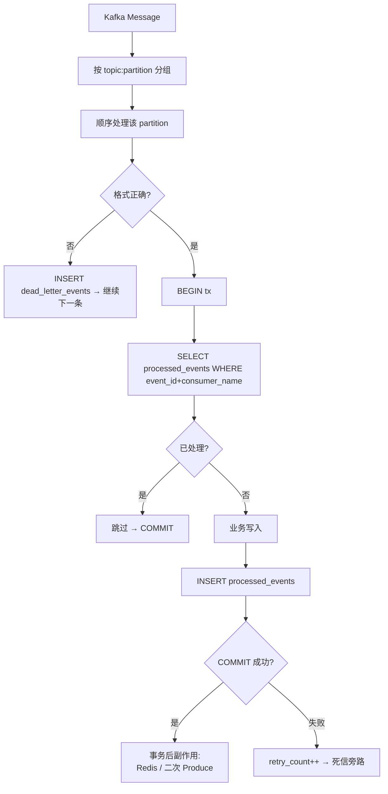

### 9.3 feed_timeline Job 特殊设计

**旧事件保护**：不采用 `OccurredAt.Before` 跳过旧事件，而是**回读 MySQL 事实状态**：

- `applyVideoEvent`：`loadVideoFinalState` 从 MySQL 拿 status/deleted_at 决定 add/remove。
- `applyFollowEvent`：`loadFollowFinalState` 从 MySQL 拿 status 决定 add/remove。
- `dispatchAuthorTimeline`：`loadAuthorBigVFlag` 拿 is_big_v（只升不降）。

这样即使消费到 stale 事件也能正确重放到最新状态，天然幂等。

**Global Timeline ready 丢失自愈**：`errGlobalTimelineNotReady` 不再靠 Kafka 无限重试；`HandleBatch` 层包裹 `applyEventWithTimelineRecovery`，捕获后主动调用 `BootstrapGlobalTimeline`（内部带分布式锁，避免多实例重复重建）后重试当前事件。

### 9.4 notification Job 特殊设计

- 采用 `OccurredAt.Before` 跳过旧事件（简单场景足够）。
- 精准的 6 种情况 bump 判定（见 8.5）。
- 事务 COMMIT 后才 `BumpUnreadVersion`，Redis 失败只 log 不重试（下次读时回源兜底）。

### 9.5 asset_cleanup Job（文件资产物理清理）

**定位**：一个单进程、无 Kafka 依赖的定时扫库 Job（默认 30s 一轮），把 video-rpc/gateway 已标记 `PendingDelete` 的 file_assets **延迟物理删除**，同时避免误删控制在中台上传一台删除的秒传竞争窗口。

**流程**：

```
1. 每 30s 扫描：选中
     status = PendingDelete AND ref_count = 0 AND deleted_at <= now - GraceSeconds
   或 status = Cleaning   AND ref_count = 0 AND updated_at <= now - ClaimTimeoutSeconds（超时重抢）
2. 逐条 claimAsset（事务内先 SELECT FOR UPDATE）：
     • 若发现 videos 仍有 play_url/cover_url = asset.URL 的 status=1 记录 → activeRefs>0 →
       ref_count 回填真实值、状态→ Active、deleted_at → NULL（引用复活兜底）；
     • 否则 UPDATE → Cleaning、抢到物理清理权。
3. removeAssetFile：严格限定在 Upload.Dir 子目录内，拒绝删除非普通文件/目录，
   删除失败 → 将状态回退 PendingDelete 供下一轮重试。
4. 成功后：UPDATE Cleaning → Deleted + DEL `fsz:chunkupload:hash:global:{fileHash}`
   （使 gateway 秒传全局缓存失效，数据库才是权威来源）。
```

**一致性保障**：
- `GraceSeconds`（默认 300s）：避免刚刚软删、尚未成功返回的写路径与清理时长上碰撞。
- `ClaimTimeoutSeconds`（默认 300s）：旧 Cleaning 抢占者崩溃后自动释放。
- Gateway 秒传 `upsertFileAsset` 遇到 Cleaning 必须轮询等待，**绝不会同时存在“Gateway 把 Cleaning 改回 Active” + “Job 正在 Cleaning 删除”的双写**。
- Redis 删除失败不回滚已完成的物理删除，Gateway 秒传会以 DB 状态二次校验（`lookupInstantUploadedFile` 发现 asset 不存在会主动清 Redis）。

新增配置项 `AssetCleanupConf`（`apps/job/asset_cleanup/etc/asset_cleanup.yaml`）：BatchSize / PollIntervalSeconds / GraceSeconds / ClaimTimeoutSeconds / DeleteTimeoutMs。

---

## 十、跨模块端到端流程图

以"用户发布视频 → 粉丝在关注流看到 → 点赞 → 视频作者收到通知 → 视频进入热榜"为例：

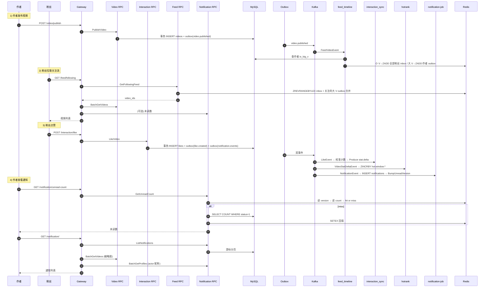

---

## 十一、Redis Key 命名空间

统一 `fsz:` 前缀，按模块拆分在 `common/rediskey/*.go`：

| 文件 | 模块 |
|---|---|
| `rediskey.go` | 通用原语 |
| `account.go` | Account 相关 |
| `video.go` | Video 相关 |
| `social.go` | Social 相关 |
| `feed.go` | Feed / Timeline 相关 |
| `hotrank.go` | 热榜相关 |
| `notification.go` | 通知未读数相关 |
| `chunkupload.go` | 分片上传相关 |

**关键 key 一览**：

| 类别 | Key 格式 | 用途 | TTL |
|---|---|---|---|
| **Account** | `fsz:account:profile:{userID}:version` | 公开资料缓存版本号 | 永久 |
| | `fsz:account:profile:{userID}:v:{version}` | 公开资料 JSON | 15 分钟±抖动 |
| | `fsz:token:{userID}` | 当前 access token | JWT 过期时间 |
| | `fsz:verify:{email}` | 邮箱验证码 | 5 分钟 |
| **Social** | `fsz:social:following:{follower}:{following}` | 单条关注状态 `1/0` | 10 分钟 |
| | `fsz:social:followers:list:{user}:page1` | 粉丝列表首页缓存 | 1 分钟 |
| | `fsz:social:followers:build_lock:{user}` | 首页构建锁 | 5 秒 |
| **Video** | `fsz:video:entity:{videoID}` | 视频实体缓存 | 10 分钟±抖动 |
| | `fsz:video:entity:{videoID}:version` | 视频实体缓存版本号（发布/删除成功后递增） | 永久 |
| | `fsz:video:stats:{videoID}` | 视频互动统计缓存 HASH | 短 |
| **Interaction** | `fsz:like:video:{videoID}:users` / `fsz:like:user:{userID}:videos` | 点赞双向带集合 | 长期 |
| | `fsz:like:state:{videoID}:{userID}` | 点赞状态覆盖缓存 `1/0` | 7 天 |
| | `fsz:like:user:{userID}:videos:list:version` | “我的喜欢”列表版本号 | 永久 |
| | `fsz:video:like_delta` / `comment_delta` / `popularity_delta` | 互动增量 HASH，field=videoID | 长期 |
| | `fsz:interaction:delta:pending:{eventID}` | 实时增量已写 Redis、尚未确认落库 | 7 天 |
| | `fsz:interaction:delta:acked:{eventID}` | 事件已完成 MySQL 聚合并处理过 delta | 7 天 |
| | `fsz:comment:list:version:{videoID}` | 评论列表版本号 | 长期 |
| | `fsz:comment:first:{videoID}:{version}` | 评论首页固定窗口缓存 | 短 |
| | `fsz:comment:idempotency:{userID}:{requestID}` | 评论发布幂等键，value=commentID | 24 小时 |
| **Feed** | `fsz:feed:timeline:user:{userID}` | 用户 inbox ZSet | 7 天 |
| | `fsz:feed:author_outbox:{authorID}` | 大 V outbox ZSet | 30 天 |
| | `fsz:feed:global_timeline` | 全局最新视频 ZSet | 长期 |
| | `fsz:feed:timeline:build_lock:{userID}` | 冷启动构建锁 | 10 秒 |
| **HotRank** | `fsz:hot:video:realtime` | 实时热榜 ZSet | 长期 |
| | `fsz:hotrank:window:60m` / `6h` / `24h` | 三个滚动窗口 ZSet | 各自窗口长 |
| **Notification** | `fsz:notification:unread:version:{userID}` | 未读数缓存版本号 | 永久 |
| | `fsz:notification:unread:count:{userID}:v:{version}` | 未读数值缓存 | 5 分钟±抖动 |
| **ChunkUpload** | `fsz:chunkupload:meta:{uploadID}` / `set:{uploadID}` | 分片会话元数据/已上传分片集合 | 24 小时 |
| | `fsz:chunkupload:hash:global:{fileHash}` | 全局秒传缓存（asset_cleanup 删除后会主动 DEL） | 7 天 |

---

## 十二、一致性 / 并发 / 幂等设计原则

### 12.1 三种缓存策略

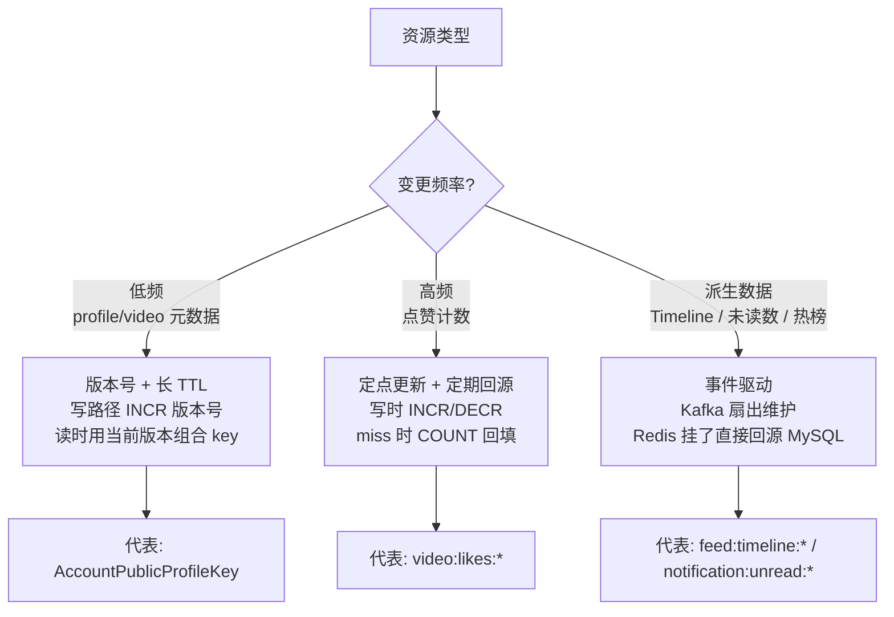

### 12.2 幂等的三层防护

| 层 | 手段 |
|---|---|
| RPC 层 | `request_id` 幂等键：视频发布 `(author_id, request_id)`、评论 `(user_id, request_id)` |
| Outbox 层 | `event_id` 唯一键 |
| Consumer 层 | `processed_events (event_id, consumer_name)` 唯一键 |

### 12.3 并发保护

| 场景 | 手段 |
|---|---|
| 并发关注同一目标 | 事务内 `SELECT ... FOR UPDATE` 锁被关注者行 |
| 并发 A↔B 互相关注 | `lockFollowAccounts` 按 `MIN(a,b), MAX(a,b)` 顺序双行锁，防锁序反转死锁 |
| 并发写同一 notification business_key | `notifications.uk_notification_business` 唯一索引兜底，冲突时事务回滚重试 |
| 并发大 V 升级 | `UPDATE ... WHERE is_big_v=0` 天然幂等 |
| 并发 outbox dispatch | `SELECT ... FOR UPDATE SKIP LOCKED` + `lock_token` |
| 并发 Timeline 冷启动 | `fsz:feed:timeline:build_lock:{viewer}` 分布式锁 |
| 并发 profile 更新 | `INCR version` 原子 |
| 并发未读数 bump | Lua 脚本 `INCR + DEL 旧 v key` 原子 |
| 并发互动 delta 与 Job 同时写 | Lua `applyInteractionDeltaScript` 判 pending/ack，同一 eventID 只入算一次 |
| 并发 asset_cleanup 与秒传 | `Cleaning` 状态 + 行锁、Gateway 遇 Cleaning 必须等待，不允许直接回改 |
| 并发 asset_cleanup 实例运行 | `ClaimTimeoutSeconds` + 事务内 `SELECT FOR UPDATE`，旧抢占者崩溃后自动释放 |
| MySQL 连接风暴 | `common/gormx` 默认 `MaxIdle=5 / MaxOpen=10`，可通过 `FSZ_MYSQL_*` 环境变量覆盖 |

### 12.4 计数字段防负

所有减一场景使用 `GREATEST(x-1, 0)` 保护，避免竞态导致负值：

```sql
UPDATE accounts SET follower_count = GREATEST(follower_count - 1, 0) WHERE id = ?
```

---

## 十三、Gateway HTTP API 汇总

来自 `apps/gateway/gateway.api`：

| 分组 | 路径 | 方法 | 需要鉴权 | 目标 RPC |
|---|---|---|---|---|
| **账号** | `/account/register` | POST | ❌ | Account.Register |
| | `/account/login` | POST | ❌ | Account.Login |
| | `/account/logout` | POST | ✅ | Account.Logout |
| | `/account/refresh` | POST | ❌ | Account.RefreshToken |
| | `/account/verify-code` | POST | ❌ | Account.SendVerifyCode |
| | `/account/profile` | GET | ✅ | Account.GetProfile |
| | `/account/profile` | PUT | ✅ | Account.UpdateProfile |
| **视频** | `/video/upload/init` | POST | ✅ | (Gateway 逻辑) |
| | `/video/upload/complete` | POST | ✅ | (Gateway 逻辑) |
| | `/video/publish` | POST | ✅ | Video.PublishVideo |
| | `/video/{id}` | GET | 🟡可选 | Video.GetVideo |
| | `/video/{id}` | DELETE | ✅ | Video.DeleteVideo |
| | `/video/user/{userID}` | GET | 🟡可选 | Video.ListUserVideos |
| **互动** | `/interaction/like` | POST | ✅ | Interaction.LikeVideo |
| | `/interaction/unlike` | POST | ✅ | Interaction.UnlikeVideo |
| | `/interaction/comment` | POST | ✅ | Interaction.PublishComment |
| | `/interaction/comment/{id}` | DELETE | ✅ | Interaction.DeleteComment |
| | `/interaction/comment/list` | GET | 🟡可选 | Interaction.ListComments |
| **社交** | `/social/follow` | POST | ✅ | Social.Follow |
| | `/social/unfollow` | POST | ✅ | Social.Unfollow |
| | `/social/is-following` | GET | ✅ | Social.IsFollowing |
| | `/social/users/following/batch` | POST | ✅ | Social.BatchIsFollowing |
| | `/social/followers` | GET | ✅ | Social.ListFollowers |
| | `/social/followings` | GET | ✅ | Social.ListFollowings |
| **通知** | `/notification/` | GET | ✅ | Notification.ListNotifications |
| | `/notification/unread-count` | GET | ✅ | Notification.GetUnreadCount |
| | `/notification/{id}/read` | POST | ✅ | Notification.MarkNotificationRead |
| | `/notification/read-all` | POST | ✅ | Notification.MarkAllNotificationsRead |
| **Feed** | `/feed/following` | GET | ✅ | Feed.GetFollowingFeed |
| | `/feed/recommend` | GET | 🟡可选 | Feed.GetRecommendFeed |
| | `/feed/hot` | GET | 🟡可选 | Feed.GetHotFeed |

**Handler 命名规则**：每个接口对应 `apps/gateway/internal/handler/{name}handler.go` + `apps/gateway/internal/logic/{name}logic.go`。

---

## 十四、开发与部署

### 14.1 本地一键启动依赖

```bash
cd deploy
docker-compose up -d
# MySQL: localhost:3308  (root/123456, db=feedsystem_zero, TZ=Asia/Shanghai)
# Redis: localhost:6380  (password=123456)
# etcd:  localhost:23790
# Kafka: localhost:9094
```

### 14.2 建库与建表

```bash
# SQL 通过 docker-entrypoint-initdb.d 首次启动自动执行 001~015
# 手动重跑单条：
docker exec -i feedsystem-zero-mysql mysql -uroot -p123456 feedsystem_zero < deploy/sql/015_account_big_v_flag.sql
```

### 14.3 建 Kafka Topic

```bash
bash deploy/kafka/create_topics.sh
```

### 14.4 启动所有服务

```bash
# RPC
go run apps/account/account.go             -f apps/account/etc/account.yaml
go run apps/video/video.go                 -f apps/video/etc/video.yaml
go run apps/interaction/interaction.go     -f apps/interaction/etc/interaction.yaml
go run apps/social/social.go               -f apps/social/etc/social.yaml
go run apps/notification/notification.go   -f apps/notification/etc/notification.yaml
go run apps/feed/feed.go                   -f apps/feed/etc/feed.yaml

# Gateway
go run apps/gateway/gateway.go             -f apps/gateway/etc/gateway.yaml

# Jobs
go run apps/job/outbox/outbox.go                     -f apps/job/outbox/etc/outbox.yaml
go run apps/job/interaction_sync/interaction_sync.go -f apps/job/interaction_sync/etc/interaction_sync.yaml
go run apps/job/social_sync/social_sync.go           -f apps/job/social_sync/etc/social_sync.yaml
go run apps/job/feed_timeline/feed_timeline.go       -f apps/job/feed_timeline/etc/feed_timeline.yaml
go run apps/job/hotrank/hotrank.go                   -f apps/job/hotrank/etc/hotrank.yaml
go run apps/job/notification/notification.go        -f apps/job/notification/etc/notification.yaml
go run apps/job/asset_cleanup/asset_cleanup.go       -f apps/job/asset_cleanup/etc/asset_cleanup.yaml
```

### 14.5 常用命令

```bash
go build ./...       # 全量编译
go vet ./...         # 静态检查
go test ./...        # 单元测试

# 重新生成 RPC 代码（改了 proto 后）
cd apps/account
goctl rpc protoc account.proto --go_out=. --go-grpc_out=. --zrpc_out=. --style=goZero
# 注意：goctl 1.10.1 生成的 client 包名会是驼峰，
# 需手动改 accountclient/account.go 的 package 为全小写

# 重新生成 API 代码（改了 gateway.api 后）
cd apps/gateway
goctl api go -api gateway.api -dir . --style=goZero
```

---

## 十五、约定与最佳实践

1. **身份识别**：所有需要 `user_id` 的 RPC 参数**必须**由 Gateway 从 JWT 提取后填入，不接收前端传值。
2. **幂等键**：视频发布用 `(author_id, request_id)`；评论用 `(user_id, request_id)`；事件处理用 `(event_id, consumer_name)`；通知去重用 `business_key`。
3. **软删除**：`videos`、`likes`、`comments`、`follows`、`notifications` 全部软删除，配合 `status` + `deleted_at` 字段做状态机。
4. **游标分页**：所有列表接口用"排序字段 + 主键"双游标（如 `(occurred_at, id)`），永不重复不遗漏，**禁止 offset 分页**。
5. **批量接口**：Gateway 聚合层禁止 N+1，必须使用 `BatchGetProfiles` / `BatchGetVideos` / `BatchGetVideoStats` / `BatchIsFollowing`。
6. **Redis Key**：一律通过 `rediskey.*Key(...)` 生成，禁止在业务代码里手写字符串拼接。
7. **Kafka 消息**：一律通过 outbox 发布，禁止业务代码直接调 `kafkax.Producer`。
8. **事务边界**：跨服务不共享事务；单服务内业务表 + outbox_events 必须同一事务。
9. **时区一致**：MySQL 用 `Asia/Shanghai`，Go 用 `time.Local`，写入时 UTC→Local，读取时 Local→UTC 只在必要时转换。
10. **大 V 判定**：只能读 `is_big_v` 标志位，禁止在读路径实时判断 `follower_count > threshold`。
11. **失败即降级**：Redis 报错继续走 MySQL 回源，不 return error；死信隔离，绝不阻塞 partition。
12. **禁止在 consumer 事务外做副作用**：所有 Redis 写入必须在 MySQL COMMIT 之后。

---

## 十六、附录：核心代码文件索引

| 主题 | 关键文件 |
|---|---|
| **Timeline 编码** | `common/feedx/timeline.go` |
| **大 V 判定** | `common/feedx/bigv.go` |
| **Redis Key & TTL** | `common/rediskey/{rediskey,account,video,social,feed,hotrank,notification,chunkupload}.go` |
| **未读数缓存** | `common/notificationcache/unread.go` |
| **Kafka Topics** | `common/eventx/topics.go` |
| **Event Envelope** | `common/eventx/events.go` |
| **JWT 签发/解析** | `common/jwtx/jwtx.go` |
| **关注事务** | `apps/social/internal/logic/followlogic.go` |
| **取关事务** | `apps/social/internal/logic/unfollowlogic.go` |
| **社交缓存辅助** | `apps/social/internal/logic/socialhelper.go` |
| **Profile 批量查** | `apps/account/internal/logic/batchgetprofileslogic.go` |
| **视频发布** | `apps/video/internal/logic/publishvideologic.go` |
| **点赞** | `apps/interaction/internal/logic/likevideologic.go` |
| **通知列表** | `apps/notification/internal/logic/listnotificationslogic.go` |
| **未读数** | `apps/notification/internal/logic/getunreadcountlogic.go` |
| **标记已读** | `apps/notification/internal/logic/marknotificationreadlogic.go` / `markallnotificationsreadlogic.go` |
| **Feed 冷启动 & 大 V 合并** | `apps/feed/internal/logic/feedhelper.go` |
| **Feed 三个 Rpc** | `apps/feed/internal/logic/{getfollowingfeed,gethotfeed,getrecommendfeed}logic.go` |
| **Outbox Dispatcher** | `apps/job/outbox/internal/logic/dispatcher.go` |
| **推拉分离扇出** | `apps/job/feed_timeline/internal/logic/timelinewriter.go` |
| **feed_timeline Consumer** | `apps/job/feed_timeline/internal/logic/consumer.go` |
| **互动同步 Consumer** | `apps/job/interaction_sync/internal/logic/syncconsumer.go` |
| **互动 delta pending/ack** | `apps/interaction/internal/logic/interactionhelper.go`、`apps/interaction/internal/logic/jobhelper.go`（`applyInteractionDeltaScript` / `acknowledgeInteractionDeltaScript`） |
| **关注同步 Consumer** | `apps/job/social_sync/internal/logic/syncconsumer.go` |
| **热榜 Consumer** | `apps/job/hotrank/internal/logic/consumer.go` |
| **通知 Consumer** | `apps/job/notification/internal/logic/consumer.go` |
| **文件资产清理 Job** | `apps/job/asset_cleanup/internal/logic/cleaner.go` |
| **秒传与资产登记** | `apps/gateway/internal/logic/fileassethelper.go`（`upsertFileAsset`）、`apps/gateway/internal/logic/videohelper.go`（`lookupInstantUploadedFile`） |
| **Gateway 路由契约** | `apps/gateway/gateway.api` |
| **Gateway JWT 中间件** | `apps/gateway/internal/middleware/tokenauthmiddleware.go` |
| **Gateway 通知聚合** | `apps/gateway/internal/logic/notificationhelper.go` |

---

---

## 十七、最近更新（Changelog）

### 2026-07-30（commit 687d0ab · 完善后端一致性与文件资产清理）

**新增模块**：

- 新增第 7 个 Job **asset_cleanup**：延迟物理清理 `file_assets`。四状态机 `Active(1)/PendingDelete(2)/Cleaning(4)/Deleted(3)`，Grace 期 + 抢占超时兜底 + 引用复活兜底 + 上传目录路径注入防御。详情见 §9.5。

**一致性与并发**：

- **互动 delta pending/ack 双标记**：`fsz:interaction:delta:pending/acked:{eventID}` + Lua `applyInteractionDeltaScript` / `acknowledgeInteractionDeltaScript`。彻底根除"在线路径写 Redis delta"与"Job 消费后再扣一次"的重复计数窗口。详情见 §8.3、§11。
- **Social Follow/Unfollow 账户行双锁**：`lockFollowAccounts` 按 `MIN(a,b), MAX(a,b)` 顺序 `SELECT FOR UPDATE`，杜绝 A↔B 互相关注的锁顺序反转死锁。详情见 §8.4、§12.3。
- **feed_timeline global ready 自愈**：`errGlobalTimelineNotReady` 由 consumer 层主动调 `BootstrapGlobalTimeline` 恢复后重试，不再靠 Kafka 无限重试。详情见 §9.3。
- **视频秒传状态机对齐**：`upsertFileAsset` 遇 `Cleaning` 必须轮询等待，禁止直接改回 `Active`；成功后返回 canonical URL；上传接口统一使用 canonical URL。详情见 §8.2。
- **文件魔数二次校验**：`validateUploadedFilePathSignature` 对整传与分片合并结果双重校验，防伪造扩展名/传输损坏。

**Gateway 强化**：

- `GetVideo` / `ListUserVideos` / `ListComments` 增加作者昵称回填，用最新 Account RPC 数据替换视频/评论表内的旧快照，RPC 失败降级返回快照。

**基础设施**：

- `common/gormx` 加入 MaxIdle=5 / MaxOpen=10 默认连接池配置，可通过 `FSZ_MYSQL_*` 环境变量覆盖，避免多进程耗尽 MySQL 全局连接。
- 修正 `social_sync` / `notification` Job 的 Redis 端口和密码（`127.0.0.1:6380` / `123456`）。

**新增 Redis Key**：

- `fsz:interaction:delta:pending:{eventID}` / `fsz:interaction:delta:acked:{eventID}`
- `fsz:video:entity:{videoID}:version`
- `fsz:like:user:{userID}:videos:list:version`
- `fsz:comment:list:version:{videoID}` / `fsz:comment:first:{videoID}:{version}` / `fsz:comment:idempotency:{userID}:{requestID}`

---

**文档结束**。这份文档反映的是当前 main 分支的真实状态。修改代码后如果关键流程发生变化，请同步更新对应章节的 Mermaid 图、Changelog 和索引表。
