# feedsystem-zero 项目说明文档

> 更新时间：2026-08-04
> 适用版本：main 分支当前工作区（基于 commit `04095cc`，含 outbox 分片并发投递 + `NOT EXISTS` 聚合保序、Social/Notification 事务级 1213/1205 死锁重试、Video 发布多资产 URL 升序加锁）
> 说明：本文档基于当前仓库真实代码生成，作为项目结构、数据模型、事件流转、一致性策略、缓存闭环、并发保护的完整索引。**外部读者读完这一份文档即可理解整个系统**。

---

## 目录

1. [项目定位](#一项目定位)
2. [总体架构](#二总体架构)
3. [目录结构](#三目录结构)
4. [微服务与职责总览](#四微服务与职责总览)
5. [数据模型（MySQL）](#五数据模型mysql)
6. [事件契约（Kafka）](#六事件契约kafka)
7. [Outbox 事务发件箱模式](#七outbox-事务发件箱模式)
8. [各模块详解与流程图](#八各模块详解与流程图)
   - 8.1 [Account 账号模块](#81-account-账号模块)
   - 8.2 [Video 视频模块](#82-video-视频模块)
   - 8.3 [Interaction 互动模块](#83-interaction-互动模块)
   - 8.4 [Social 社交模块](#84-social-社交模块)
   - 8.5 [Notification 通知模块](#85-notification-通知模块)
   - 8.6 [Feed 推拉分离模块](#86-feed-推拉分离模块)
   - 8.7 [HotRank 热榜模块](#87-hotrank-热榜模块)
   - 8.8 [Gateway 网关](#88-gateway-网关)
9. [关键异步 Job 详解](#九关键异步-job-详解)
10. [跨模块端到端流程图](#十跨模块端到端流程图)
11. [Redis Key 命名空间](#十一redis-key-命名空间)
12. [一致性 / 并发 / 幂等设计原则](#十二一致性--并发--幂等设计原则)
13. [Gateway HTTP API 汇总](#十三gateway-http-api-汇总)
14. [开发与部署](#十四开发与部署)
   - 14.6 [测试、压测与一致性验收](#146-测试压测与一致性验收2026-08-03)
15. [约定与最佳实践](#十五约定与最佳实践)
16. [附录：核心代码文件索引](#十六附录核心代码文件索引)
17. [最近更新（Changelog）](#十七最近更新changelog)

---

## 一、项目定位

`feedsystem-zero` 是一个**从零重建的短视频信息流后端**，参考抖音/B 站的读写分离架构：

- **同步侧**：账号、视频、社交、互动、通知、Feed 六个 RPC，负责用户可感知的写操作与读操作。
- **异步侧**：Kafka + 七个 Job Worker，负责派生数据（Timeline、计数、通知、热榜、文件资产清理）的最终一致维护。
- **网关侧**：go-zero API 网关承担鉴权、参数校验、跨模块聚合，前端不直连 RPC。

技术栈：`Go 1.25` + `go-zero 1.10.2 (api+rpc)` + `gRPC 1.82.0` + `GORM 1.31.2` + `MySQL 8.0` + `Redis 7` + `Kafka` + `etcd`。

**核心设计目标**：

1. **强一致的写路径**：用户可感知的写操作与其派生事件在同一个 MySQL 事务里落地（outbox 发件箱）。
2. **最终一致的派生数据**：Timeline、通知、计数缓存通过 Kafka 事件驱动，允许秒级延迟但保证不丢、幂等。
3. **可控降级**：Redis 是加速层，任何时刻挂掉都必须能降级到 MySQL 直查。
4. **横向扩展**：outbox dispatcher 支持多实例并发（SKIP LOCKED），消费者按 partition 顺序处理。

---

## 二、总体架构

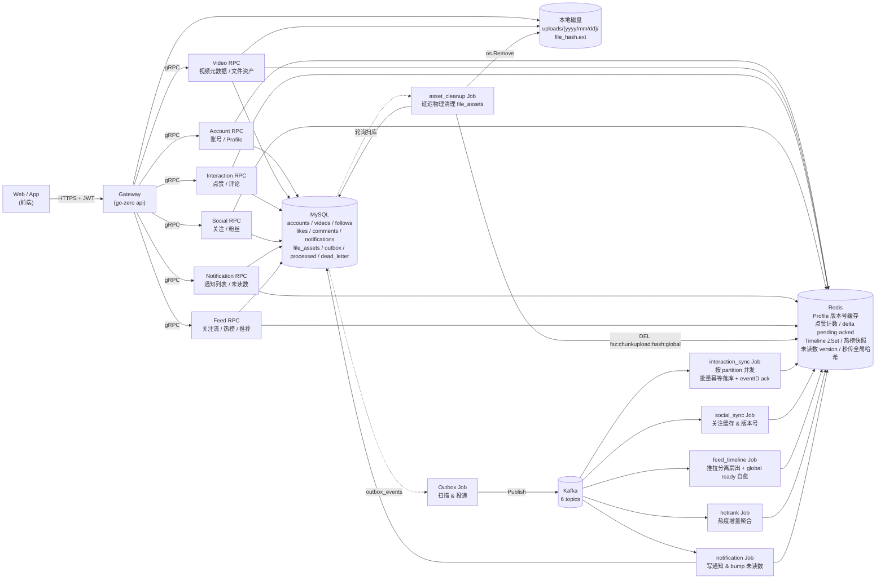

**核心约束**：

- 所有写操作走 "MySQL 事务 + `outbox_events`"，**禁止在业务代码里直接生产 Kafka 消息**。
- 所有跨模块的用户身份必须来自 Gateway 从 JWT 解析出的 `user_id`，**不信任前端传的 user_id**。
- 所有 Redis key 通过 `common/rediskey/*.go` 集中生成，统一 `fsz:` 前缀。
- 消费者用 `processed_events` 唯一键做幂等，失败进 `dead_letter_events`，绝不阻塞 partition。

---

## 三、目录结构

```
feedsystem-zero/
├── apps/
│   ├── gateway/              # API 网关（go-zero api）
│   │   ├── gateway.api       # 对外 HTTP 契约
│   │   └── internal/{handler, logic, middleware, svc, types, config}
│   ├── account/              # 账号 RPC
│   ├── video/                # 视频 RPC
│   ├── interaction/          # 互动 RPC
│   ├── social/               # 社交 RPC
│   ├── notification/         # 通知 RPC
│   ├── feed/                 # Feed RPC
│   └── job/
│       ├── outbox/           # Outbox → Kafka 投递
│       ├── interaction_sync/ # 点赞/评论 Kafka 消费者
│       ├── social_sync/      # 关注 Kafka 消费者
│       ├── feed_timeline/    # 推拉分离 Timeline 扇出
│       ├── hotrank/          # 热榜聚合 Job
│       ├── notification/     # 通知落库 Job
│       └── asset_cleanup/    # 文件资产物理清理 Job（延迟删除 + 复活兜底）
├── common/
│   ├── eventx/               # 事件 topic、envelope、payload schema
│   ├── feedx/                # Timeline member 编码 & 大 V 判定
│   ├── gormx/                # GORM 初始化
│   ├── jwtx/                 # JWT 签发/解析
│   ├── kafkax/               # Kafka producer/consumer 封装
│   ├── rediskey/             # 按模块拆分的 8 个 Redis key 文件
│   ├── notificationcache/    # 未读数版本号缓存
│   └── emailx/               # 邮件（注册验证码）
├── deploy/
│   ├── docker-compose.yml    # MySQL/Redis/etcd/Kafka 一键起
│   ├── sql/001~016_*.sql     # 建表、索引与增量迁移
│   └── kafka/create_topics.sh
├── model/                    # 事件模型和 GORM 共享表模型
├── docs/                     # 本文档所在目录
├── tests/                    # 造数、HTTP 压测、E2E 冒烟与并发测试
└── web/                      # React 前端（Vite + TS + Tailwind）
```

---

## 四、微服务与职责总览

### 4.1 RPC 服务（6 个）

| 模块 | 端口位 | 主要能力 | 状态 |
|---|---|---|---|
| **account** | rpc | 注册 / 登录 / 登出 / 刷新 token / GetProfile / BatchGetProfiles / UpdateProfile | ✅ 已实现 |
| **video** | rpc | 分片上传 / PublishVideo / GetVideo / BatchGetVideos / ListUserVideos / DeleteVideo / 文件秒传去重 | ✅ 已实现 |
| **interaction** | rpc | LikeVideo / UnlikeVideo / PublishComment / DeleteComment / ListComments / BatchGetVideoStats | ✅ 已实现 |
| **social** | rpc | Follow / Unfollow / IsFollowing / BatchIsFollowing / ListFollowers / ListFollowings | ✅ 已实现 |
| **notification** | rpc | ListNotifications / GetUnreadCount / MarkNotificationRead / MarkAllNotificationsRead | ✅ 已实现 |
| **feed** | rpc | GetFollowingFeed / GetHotFeed / GetRecommendFeed | ✅ 已实现 |

### 4.2 Job 后台（7 个）

| Job | 消费 topic | 主要动作 | 状态 |
|---|---|---|---|
| **outbox** | — | 扫描 `outbox_events`，SKIP LOCKED 抢占，投递到 Kafka | ✅ |
| **interaction_sync** | `interaction.like.events` / `interaction.comment.events` | topic+partition 分组并发；500 条批量幂等事务 → 按 event_id 对 Redis 增量 ack | ✅ |
| **social_sync** | `social.follow.events` | 关注状态缓存 & Profile 版本号 bump | ✅ |
| **feed_timeline** | `feed.video.events` / `social.follow.events` | 推拉分离：小 V 写扩散、大 V author outbox；ready 丢失时主动 bootstrap | ✅ |
| **hotrank** | `interaction.like.events` / `interaction.comment.events` | 独立消费互动事件，维护 UTC 分钟窗口；Feed 按需构建衰减快照 | ✅ |
| **notification** | `notification.events` | 通知落库、未读数 version bump、死信旁路 | ✅ |
| **asset_cleanup** | 无（轮询扫库） | 延迟物理清理 `file_assets`；抢占超时兜底 + 引用复活；DEL 秒传全局缓存 | ✅ |

---

## 五、数据模型（MySQL）

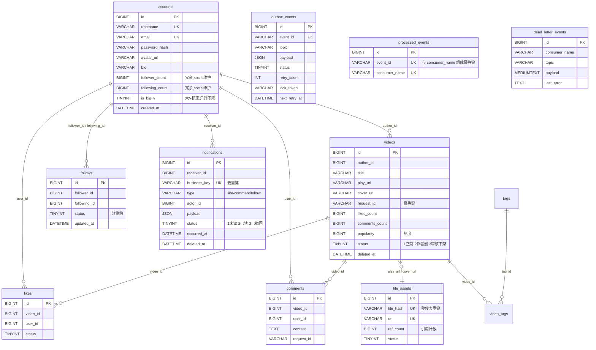

### 5.1 SQL 迁移文件时间线

| 文件 | 内容摘要 |
|---|---|
| `001_schema.sql` | accounts / videos / file_assets / tags / video_tags / likes / comments / interaction_events / outbox_events / processed_events / dead_letter_events |
| `002_file_assets.sql` | 文件资产索引 |
| `003_video_asset_indexes.sql` | 视频 play_url/cover_url 索引 |
| `004_interaction_job_infra.sql` | 互动 job 基础设施 |
| `005~006` | 点赞/评论列表索引 |
| `007_outbox_dispatcher_final.sql` | Outbox 分发锁字段 `lock_token` / `next_retry_at` |
| `008_interaction_sync_dead_letters.sql` | 死信表 |
| `009_video_request_id.sql` | 视频发布幂等键 |
| `010_follows.sql` | follows 关注表 |
| `011_social_final_indexes.sql` | 社交最终索引 |
| `012_feed_timeline_indexes.sql` | Feed 冷启动索引 |
| `013_account_follow_counters.sql` | accounts 增加 follower_count / following_count 冗余字段 |
| `014_notifications.sql` | `notifications` 表（含 `uk_notification_business` 唯一键 + `(receiver_id, occurred_at, id)` 复合索引） |
| `015_account_big_v_flag.sql` | accounts.is_big_v 大 V 标志位 + 存量数据回填 |
| `016_outbox_aggregate_status_index.sql` | Outbox 按 topic/status 聚合检查与待投递扫描索引 |

---

## 六、事件契约（Kafka）

### 6.1 Topic 一览

来自 `common/eventx/topics.go`：

| Topic | Producer | Consumer | 用途 |
|---|---|---|---|
| `interaction.like.events` | interaction rpc (outbox) | interaction_sync + hotrank | 点赞/取消点赞聚合落库；独立热榜窗口计分 |
| `interaction.comment.events` | interaction rpc (outbox) | interaction_sync + hotrank | 评论创建/删除聚合落库；独立热榜窗口计分 |
| `video.stat.delta.events` | 当前仅保留契约 | 当前无在线 Producer/Consumer | 预留的视频统计增量 Topic，不属于当前运行主链路 |
| `feed.video.events` | video rpc (outbox) | feed_timeline | 视频发布/删除 → Timeline 扇出 |
| `social.follow.events` | social rpc (outbox) | social_sync + feed_timeline | 关注/取关缓存 & Timeline 回填 |
| `notification.events` | 多方 rpc (outbox) | **notification** | 系统通知（关注/点赞/评论） |

### 6.2 事件类型

来自 `common/eventx/events.go`：

```
video.published / video.deleted        → FeedVideoEvent
like.created / like.deleted            → LikeEvent
comment.created / comment.deleted      → CommentEvent
video.stat.delta                       → VideoStatDeltaEvent
follow.created / follow.deleted        → FollowEvent
notification.create / notification.delete → NotificationEvent
```

统一封装为 `Envelope`：`{event_id, event_type, aggregate_type, aggregate_id, occurred_at, payload}`。

---

## 七、Outbox 事务发件箱模式

这是本项目**跨服务一致性的基石**。业务写操作与事件发布必须原子，否则会出现"MySQL 写成功但事件丢了"或"事件发了但 MySQL 回滚了"。

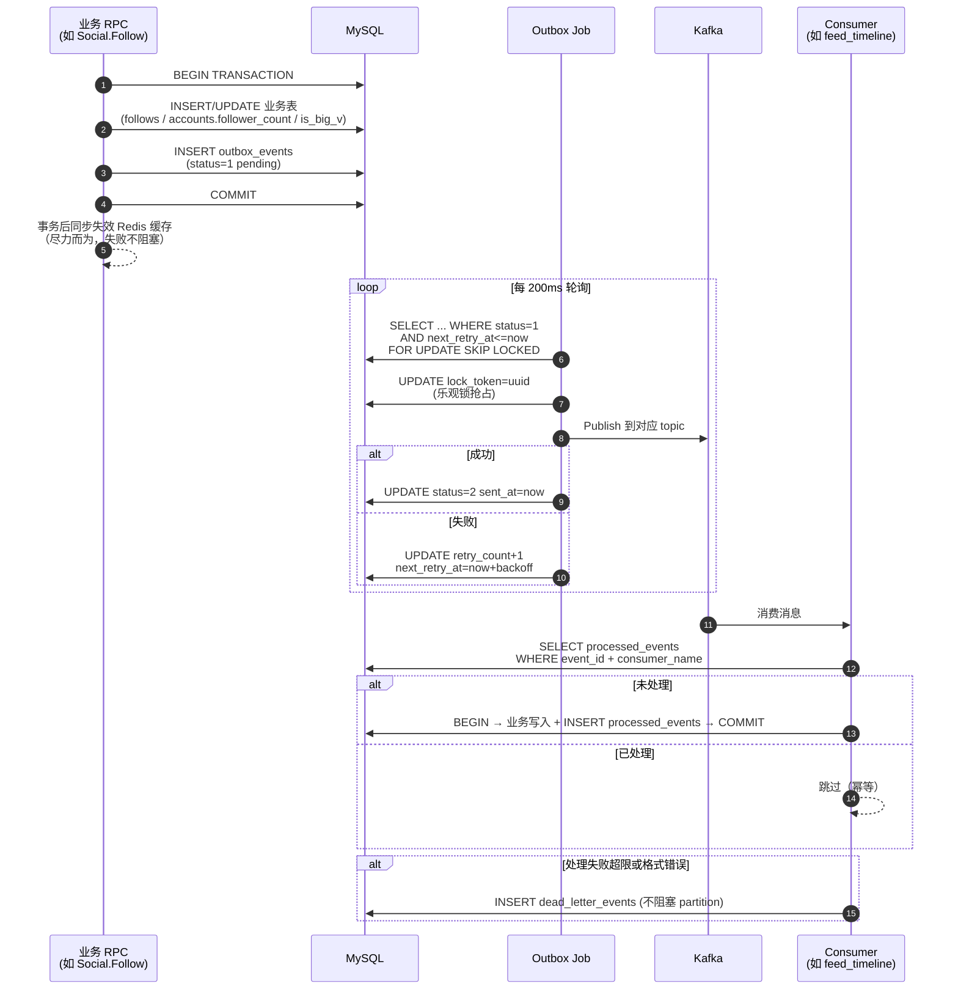

**关键点**：

- `outbox_events` 使用 `SELECT ... FOR UPDATE SKIP LOCKED` + `lock_token` 双保险，支持多实例并发调度。
- `processed_events` 的唯一键 `(event_id, consumer_name)` 保证每个消费者对同一事件只处理一次。
- 死信隔离：失败事件不阻塞主流程，进 `dead_letter_events` 供人工介入。
- 阶梯退避：`next_retry_at = now + backoff(retry_count)`。

---

## 八、各模块详解与流程图

### 8.1 Account 账号模块

**职责**：用户身份、Profile 数据、JWT 签发、邮箱验证码。

**核心 RPC**：

| Rpc | 说明 |
|---|---|
| `Register` | 邮箱 + 用户名 + 密码；先校验邮箱验证码 |
| `Login` | 邮箱 + 密码；签发 access token + refresh token |
| `Logout` | DEL `fsz:token:{userID}`，使 access token 立刻失效 |
| `RefreshToken` | 用 refresh token 换新的 access token |
| `GetProfile` | 版本号缓存：读 version → 组合 key 读 profile JSON → miss 回源 |
| `BatchGetProfiles` | Feed / 评论列表批量拉作者信息 |
| `UpdateProfile` | 更新头像 / bio；事务内 INCR profile version |

**双 Token 机制（access token + refresh token）**：

在"安全性"与"用户体验"之间做折中，两个 token 各司其职：

| 维度 | `access_token` | `refresh_token` |
|---|---|---|
| 本质 | JWT，自签名可自验证 | 随机字符串，本身不含信息 |
| 有效期 | 短（`AccessExpire=900s`，15 分钟） | 长（可配 7~30 天） |
| 用途 | 每个业务 API 请求都带，Gateway 层校验 | **仅** `/account/refresh` 时使用 |
| 存放位置 | Redis `fsz:token:{userID}`（白名单，支持强制登出） | MySQL `accounts.refresh_token`（有状态） |
| 服务端校验 | secret 本地验签 + Redis 白名单比对，不查 MySQL | 必须 `SELECT ... WHERE refresh_token=?` 查 MySQL |
| 主动作废 | Logout 时 `DEL fsz:token:{userID}` | Logout 时 `UPDATE refresh_token=NULL`；每次刷新自动轮换 |

**设计目标**：
- **降低泄漏风险**：access token 每次请求都带，暴露面大，用 15 分钟短有效期把破坏窗口压到最小；refresh token 只在续期接口出现，暴露面小。
- **用户体验无感续期**：前端拦 401 → 用 refresh token 悄悄换新 access token → 重放业务请求，用户不需要重新输账号密码。
- **服务端可控**：改密码 / 风控 / 多端下线时，DB 清空 `refresh_token` + Redis DEL 白名单，即可让用户在 15 分钟内被强制打回登录页。这补齐了纯无状态 JWT "无法主动踢人"的短板。
- **Refresh Token Rotation（轮换）防重放**：`RefreshToken` RPC 每次都同时下发**新的** refresh token 并作废旧的，DB 更新用 `WHERE id=? AND refresh_token=旧值` 的 CAS 语义，保证同一份 refresh token 只能被消费一次。一旦被盗，真用户和攻击者必有一方在下次刷新时被 401 踢出，账号盗用可被及时发现。

---

**Profile 版本号缓存流程**：

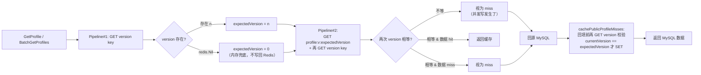

**关键点**：
- **写侧独占 INCR**：`UpdateProfile`、`social` 关注/取关、`social_sync` 消费者是**唯二可以修改 version key 的地方**，全部用 `INCR`（原子递增）。旧版本 key 无需扫描删除，等 TTL 自然淘汰。
- **粉丝数变化时也要 INCR 两侧的 version**（follower 和 following），否则 `BatchGetProfiles` 会读到旧的 follower_count。
- **读侧永远只 GET，从不 SET version key**——这是版本化缓存能保证一致性的核心约束，下面单独展开。

#### 8.1.1 为什么读侧不"重写"缺失的 version key

`batchgetprofileslogic.go` 里读取 version key 用的是 `publicProfileVersionResult`，遇到 `redis.Nil` 会**直接返回 `(0, nil)` 兜底**，而**没有**任何 `SET version=0` 或 `SETNX` 的回填分支。这是刻意为之：

1. **version key 是权威时钟，不是缓存**。它的语义是"这个用户资料迄今为止一共被写过多少次"，只能由**写路径**通过 `INCR` 单调递增。读侧一旦 SET，就相当于用一个"猜测值"覆盖时钟——任何和这次 SET 并发的写入都可能被"退回"，破坏 CAS 校验（`currentVersion == expectedVersion` 才回填）的正确性，甚至让旧数据长期钉死在新版本槽位里。
2. **`redis.Nil → 0` 只在内存里生效**：读侧把 miss 当作"版本 0"来构造数据 key `profile:{uid}:v:0` 并走后续 CAS 流程，Redis 上 version key 该不存在就继续不存在。
3. **和 Redis `INCR` 原生语义天然衔接**：Redis 对**不存在的 key 执行 `INCR` 会自动当作 0 递增**，第一次 `INCR` 完就是 1。所以：
   - 读侧内存里假设"当前是版本 0" → 数据 key 用 `v:0`；
   - 一旦写侧首次 `UpdateProfile`/关注写入，`INCR` 把 version 从"不存在"直接刷到 1，数据 key 切到 `v:1`，`v:0` 里的旧快照自然作废（等 TTL 淘汰）。
   - 读、写两侧对"没写过的用户 = 版本 0"这个约定完全自洽，无需任何显式初始化。
4. **version key 因此设计成永久 key（无 TTL）**：如果给它设 TTL，就会出现"版本 key 先过期、数据 key 还没过期"的窗口——那时读侧把 miss 归一为 0，可能撞上一份还没被淘汰的旧版本数据 key，读到脏数据。永久 version key + 有 TTL 的数据 key，是这套方案能自愈的前提。

**权限总结**：

| Key | 写侧 | 读侧 | TTL |
|---|---|---|---|
| `fsz:account:profile:{uid}:version` | 只允许 `INCR` | **只允许 `GET`**；miss 时**内存里当 0，不回写** | 永久 |
| `fsz:account:profile:{uid}:v:{n}` | 一般不写（由读侧回填） | `GET` + CAS 校验后 `SET`（含正/负缓存） | 15min + 抖动 / 负缓存 1min |

#### 8.1.2 BatchGetProfiles 的"两段 Pipeline + 二次校验"读路径

`loadPublicProfilesFromCache` 和 `cachePublicProfileMisses` 一起构成完整的读-回填链路：

- **读侧**：先一次 Pipeline 拿所有 version → 再一次 Pipeline 同时拿 `profile:v:{version}` 和"当前 version"；两次 version 不等 → 视为 miss（说明期间被并发写掉了）。
- **回源**：miss 列表统一走一次 `WHERE id IN (...)` 主键 IN 查询，配合 `syncx.SingleFlight` 合并同一实例上相同 ID 集合的并发回源，降低热点资料刚过期时的 MySQL 瞬时压力。
- **回填**：`cachePublicProfileMisses` 写入前**再 GET 一次 version**，只有 `currentVersion == expectedVersion` 才 SET `profile:v:{expectedVersion}`。任何一步版本不匹配都放弃回填，等下一次读请求用新版本号自然重新回源。
- **负缓存防穿透**：MySQL 查不到的 userID 会写 `{Missing:true}` 短 TTL（`AccountPublicProfileMissingTTL=1min`）；读侧命中 `Missing:true` 直接跳过，不回源、不放进响应，避免无效 ID 反复打穿 MySQL。
- **失败静默**：所有 Redis 错误只记日志、不返回错误——回填缓存是尽力而为，最坏后果只是下一次请求再走一次 DB。

#### 8.1.3 Key 结构详解：多版本 Key 共存 & 与 Video 方案的对比

`BatchGetProfiles` 的读一致性保障根本上建立在 **"版本号嵌入 Key 名"** 这一设计上。Key 语义（见 `common/rediskey/account.go`）：

| Key | 数据结构 | 值 | 用途 |
|---|---|---|---|
| `fsz:account:profile:{uid}:version` | STRING(int64) | 单调递增版本号 | 权威时钟，写侧 `INCR`；旧版本无需扫描删除，等 TTL 自然淘汰 |
| `fsz:account:profile:{uid}:v:{n}` | STRING(JSON) | `{user_id, username, avatar_url, bio, follower_count, following_count}` | 版本 n 的资料快照；读侧回填、写侧不主动删除 |

**核心特征**：`AccountPublicProfileKey(userID, version)` 生成的 Key **不同版本对应完全不同的 Redis Key**（`profile:100:v:5` 和 `profile:100:v:6` 是两个独立 Key）——**新版本不覆盖旧版本，旧版本 Key 无人访问、TTL 到期自动消失**。

**这个设计带来 3 个直接后果**：

1. **写侧极简**：`UpdateProfile` / `social` 关注、取关、`social_sync` 消费者**只需要一条 `INCR`**——不用协调 `DEL` 旧 Key、不用担心竞态；
2. **读侧必须先拿版本号**：因为要用 `version` 拼出正确的数据 Key `profile:{uid}:v:{version}`，**必须先 GET 版本号**——所以设计成 "**两段 Pipeline**"（第一段拿版本、第二段用版本读实体+二次校验）；
3. **两次版本读之间需要收敛点**：读侧从第一次读到 `version=5`、到第二次读到 `version` 用来校验，中间任何并发写产生的 `INCR → 6` 都会被 **`currentVersion != expectedVersion`** 识破放弃——这也是 8.1.2 提到的"两次 Pipeline + 二次校验"的物理基础。

**读路径 3 步命令时序（`loadPublicProfilesFromCache`）**：

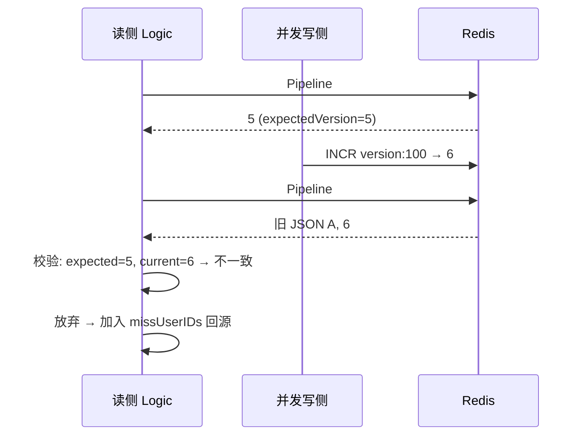

**"先读实体再读版本"次序在这里也成立**：Pipeline#2 里 `GET profile:v:5` 排在 `GET version` 之前，保证读到的版本 ≥ 实体的版本，任何在两条命令之间的写入都会被识别为不一致（和 Video 方案思路一致）。

**回填的三次校验链条（`cachePublicProfileMisses`）**：

回填时又走了一遍 CAS，避免"回源期间发生并发写、把旧 DB 快照写到新版本槽位"：

```
读侧看到 expectedVersion=5 → 回源 MySQL 拿数据 A
    ↓ 中间可能并发发生 INCR → 6 + 更新 MySQL 为 B
回填前: cachePublicProfileMisses 再 GET version → 6
    ↓ currentVersion=6 != expectedVersion=5
放弃 SET profile:v:5=A    ← 关键：不把 A 写到 v:5 槽位
```

如果**没有**这道校验：读侧会把 A 写到 `profile:100:v:5`；下一次读版本还是 6，去读 `profile:v:6` 是 miss 无害；**但** 如果在两次 `INCR` 之间读侧又读到 5 并回填 A，就可能污染刚被激活的 v:5 槽位——所以这一层 CAS 是必需的。

**与 Video `BatchGetVideos` 的对比总览**：

| 维度 | Account `BatchGetProfiles` | Video `BatchGetVideos` |
|---|---|---|
| Key 里是否含版本号 | ✅ 含（`profile:{uid}:v:{n}`） | ❌ 不含（`entity:{vid}`） |
| 不同版本关系 | 多版本共存（独立 Key） | 单版本覆盖（同一 Key） |
| 读侧 RTT 数 | **2 次 Pipeline** | 1 次 Pipeline |
| 读侧命令 | Pipeline1: GET version;<br/>Pipeline2: GET data + GET version(校验) | Pipeline: GET entity + GET version |
| 写侧动作 | 仅 `INCR` | `INCR` + `DEL` + Lua CAS |
| 旧缓存清理 | 无人访问 + TTL 自然淘汰 | 写侧 `DEL` 主动清理 |
| 脏数据窗口 | 双重版本校验，几乎无窗口 | 一次请求内可能返回旧值（~10ms） |
| 单体缓存开销 | 高（多版本共存，最长 15min） | 低（同一 Key 覆盖） |
| 单条数据大小 | 小（几百字节） | 大（含 title/description/tags，可达几 KB） |
| 业务更新频率 | 极低（用户几周才改一次） | 较高（点赞/评论/状态频繁变） |
| 一致性容忍度 | 更严格（用户改了立刻要看到） | 允许毫秒级最终一致 |

**权衡本质**：两者是同一套 [[memory:9l16e7mx]] 版本号+惰性重算方案 B 的**两种落地形态**——Account 用**多版本 Key + 两段 Pipeline** 换严格一致（多用旧 Key 内存换 RTT 上的两次校验、写侧简化），Video 用**单版本 Key + Lua CAS** 换低内存和更少 RTT（接受一次请求内的毫秒级窗口、复杂化写侧）。**没有优劣，只有场景匹配**。

**SingleFlight 合并并发回源机制详解**：

`BatchGetProfiles` 和 `BatchGetVideos` 缓存 miss 时并**不是**每个请求都直接打到 MySQL——两者都用 `github.com/zeromicro/go-zero/core/syncx.SingleFlight` 把**同一实例内、同一批 ID 集合的并发回源合并成一次 DB 查询**、防止"缓存击穿"打垮 MySQL。

**代码结构（两者完全对称）**：

```go
// 包级单例，进程共享
var publicProfileDBLoadGroup = syncx.NewSingleFlight()          // account
var videoEntityDBLoadGroup   = syncx.NewSingleFlight()          // video

// 回源函数用 Do(key, fn) 包一层
value, err := publicProfileDBLoadGroup.Do(
    publicProfileDBLoadKey(userIDs),                             // flight key
    func() (any, error) {                                        // 真正的 DB 查询
        var users []model.Account
        err := gormDB.Select(...).Where("id IN ?", userIDs).Find(&users).Error
        // ... 组装成 map[uint64]*PublicProfile 返回
        return profiles, nil
    },
)
```

**`Do(key, fn)` 的语义**：
- 如果 `key` 上已经有一个 `fn` 正在执行 → **当前 goroutine 阻塞等待**、不启动新的 `fn`；
- 否则 → 启动 `fn` 执行、执行期间所有 `Do(相同 key)` 都挂在同一个等待队列上；
- `fn` 返回后 → **所有等待者共享同一份 `(value, error)`**；
- 立刻从内部 map 中删除 `key`——**下一次 `Do(同 key)` 会重新启动 `fn`**（不做长期结果缓存、真正的缓存交给上游 Redis）。

**flight key 为什么必须排序拼字符串**（`publicProfileDBLoadKey` / `videoEntityDBLoadKey`）：

```go
func publicProfileDBLoadKey(userIDs []uint64) string {
    sortedUserIDs := append([]uint64(nil), userIDs...)           // ① 拷贝副本，不改调用方切片
    sort.Slice(sortedUserIDs, func(i, j int) bool {              // ② 稳定排序
        return sortedUserIDs[i] < sortedUserIDs[j]
    })

    var builder strings.Builder                                  // ③ 拼接 "1,2,3,"
    for _, userID := range sortedUserIDs {
        builder.WriteString(strconv.FormatUint(userID, 10))
        builder.WriteByte(',')
    }
    return builder.String()
}
```

三步做的事情：

1. **`append([]uint64(nil), ids...)` 拷贝副本**——绝对不能就地 `sort.Slice(userIDs)`，否则会打乱调用方期望的响应顺序（`BatchGetProfiles` 最后按输入顺序组装响应，一旦就地排序响应就会乱掉）；
2. **`sort.Slice` 排序**——让 `[1,2,3]` / `[2,3,1]` / `[3,1,2]` 三个并发请求**识别为同一 flight**、共享一次 DB 查询；否则纯字面拼接会当作三次独立回源；
3. **`strings.Builder` 拼接**——O(N) 生成一个可比较的字符串（比 `fmt.Sprintf` 少一次反射开销），末尾多一个 `,` 无害。

（`batchgetvideoslogic_test.go:TestVideoEntityDBLoadKeyOrderIndependent` 专门测了 `[9,2,7]` 和 `[7,9,2]` 生成同一个 flight key——是这条不变式的回归保护。）

**"防缓存击穿"典型场景**：

假设某热门用户资料的 15min 缓存刚过期、瞬时有 500 个请求都来查同一批用户 ID：

| 无 SingleFlight | 有 SingleFlight |
|---|---|
| 500 个 goroutine 各自看到 miss → 500 次 `WHERE id IN (...)` DB 查询 → MySQL CPU 瞬时打满、慢查询积压 | 500 个 goroutine 竞争同一个 flight key → **只有 1 个执行 DB 查询**、其余 499 个阻塞等待 → 一次查询返回后 499 个 goroutine 立刻拿到同一份结果 |

——这就是 Redis 章节里常说的**"缓存击穿保护"**（cache stampede protection）。

**关键边界与约束**：

| 边界 | 说明 |
|---|---|
| **进程内单例** | `syncx.NewSingleFlight()` 是**进程内**的合并，跨实例（不同 Pod）的并发回源**不合并**——但配合上游 Redis 缓存已经足够抗住热点；跨实例并发合并需要分布式锁，代价大且非必要。 |
| **flight key 精确匹配** | key 是字符串精确匹配、必须完全相同才合并；`[1,2]` 和 `[1,2,3]` 是**两个 flight**、不合并 —— 这是正确的（两次查的数据不同，不能共享结果）。 |
| **错误也会共享** | `fn` 返回 error 时、所有等待者拿到**同一个 error**——如果 DB 抖动导致 fn 报错，499 个请求会同时失败；但因为每次 `Do` 完立即从 map 删除 key，下一次请求会立刻重试。 |
| **不缓存结果** | SingleFlight 只在"并发窗口内"合并、不做结果缓存 —— fn 返回后 key 立即失效，第 501 个请求（若晚到）会重新启动一次 fn。这是刻意设计——真正的缓存交给 Redis，SingleFlight 只解决"击穿瞬间"的并发放大问题。 |
| **同一实例内的顺序副作用** | 若 `fn` 有副作用（如触发写操作），499 个等待者不会各自触发一次副作用——**副作用只发生一次**。BatchGet* 场景纯读、无副作用，天然安全。 |
| **不阻塞跨 flight 请求** | 不同 flight key 之间完全独立、互不阻塞。 |
| **返回值必须做类型断言** | `Do` 签名是 `func() (any, error)`、调用方要 `value.(map[uint64]*PublicProfile)`——两边都加了 `if !ok { return errors.New("...结果类型异常") }` 兜底防止类型漂移。 |

**为什么放在缓存 miss 之后、而不是入口就 Do 一层**：

看 `BatchGetProfiles` 的调用位置——`loadPublicProfilesFromDB` 只在 `missUserIDs` 非空时被调用、且传入的是**已经过缓存过滤的 miss 子集**。这样的设计意味着：

- **Redis 命中的请求根本不进入 SingleFlight**——它们各自走各自的 Pipeline、不会互相阻塞；
- **只有缓存 miss 的少数请求**才会争抢 flight —— 击穿瞬间才需要合并；
- **flight key 是排序后的 miss ID 子集**——两个请求即使原始 ID 不同、只要经过缓存过滤后 miss 集合相同，仍可合并（例如请求 A 查 [1,2,3]、请求 B 查 [3,4,5]，若 1,2,4,5 都命中缓存、只剩 3 miss，两者会合到同一个 flight 的 "3," key 上）。

**项目内其他 SingleFlight 落点（供参考）**：

同一套模式在项目多个模块被复用、都用于**"批量/分页查询 + 缓存 miss 时合并回源"**：

| 位置 | 用途 | flight key 组成 |
|---|---|---|
| `apps/account/internal/logic/batchgetprofileslogic.go` | 批量用户资料回源 | 排序后的 userID 集合 |
| `apps/video/internal/logic/batchgetvideoslogic.go` | 批量视频实体回源 | 排序后的 videoID 集合 |
| `apps/interaction/internal/logic/listcommentslogic.go` | 视频评论列表回源 | `videoID + cursorCreatedAt + cursorCommentID + pageSize` |
| `apps/interaction/internal/logic/listmylikedvideoslogic.go` | "我点赞的视频" 列表回源 | `userID + cursor + pageSize` |
| `apps/social/internal/logic/listfollowerslogic.go` | 粉丝列表回源 | `userID + cursor + pageSize` |
| `apps/social/internal/logic/listfollowingslogic.go` | 关注列表回源 | `userID + cursor + pageSize` |
| `apps/feed/internal/logic/feedhelper.go` | Timeline 构建 / 热榜快照构建 | 独立两个 group |

——**"进程内合并 + 上游 Redis 抗量 + 下游 MySQL 兜底"** 已成为该项目 batch/list 类接口的**通用模板**。

**共通的通用最佳实践**（两者都用）：

1. **`SingleFlight` 合并回源**（`publicProfileDBLoadGroup` / `videoEntityDBLoadGroup`）——防击穿，同实例内相同 ID 集合合并一次 DB 查询；
2. **flight key 排序拼字符串**——让 `[1,2,3]` 和 `[3,1,2]` 识别为同一 flight；
3. **`Missing:true` 负缓存 + 短 TTL** —— 防穿透；
4. **TTL 抖动 `userID % 300s`** —— 防雪崩，且同一 ID TTL 可预测；
5. **Redis 挂了 `cacheAvailable=false` 全走 DB** —— 降级保可用；
6. **列裁剪**：`Select` 只取公开字段——最小化 DB 传输；
7. **`normalize*IDs`** 输入归一化：限批 100、过滤 0、去重保序；
8. **响应按输入顺序对齐**：`for _, id := range ids` 拼装、Missing/不存在直接跳过；
9. **失败静默**：所有 Redis 错误只记日志、不影响给客户端的响应。

---

### 8.2 Video 视频模块

**职责**：视频元数据管理、分片上传、文件秒传去重、软删除。

**核心 RPC**：

| Rpc | 说明 |
|---|---|
| `PublishVideo` | 事务：INSERT videos + INSERT video_tags + INSERT outbox_events(video.published)；`(author_id, request_id)` 幂等 |
| `GetVideo` | Redis entity cache + MySQL 回源 |
| `BatchGetVideos` | Feed 拉视频卡片时用 |
| `ListUserVideos` | 用户主页视频列表，游标分页 |
| `DeleteVideo` | 软删除：`status=2, deleted_at=now`，file_assets.ref_count-1，发 outbox(video.deleted) |

#### 8.2.0 客户端上传三条路径：真秒传 / 小文件直传 / 分片上传

同样是"发一条视频"，客户端实际会根据文件大小、以及服务端是否已存在同 hash 记录，走**三条完全不同的路径**。三条路最终都拿到同一个 canonical `play_url`，交给 `/video/publish` 完成发布；但代价差别巨大。

**决策流程（客户端视角）**：

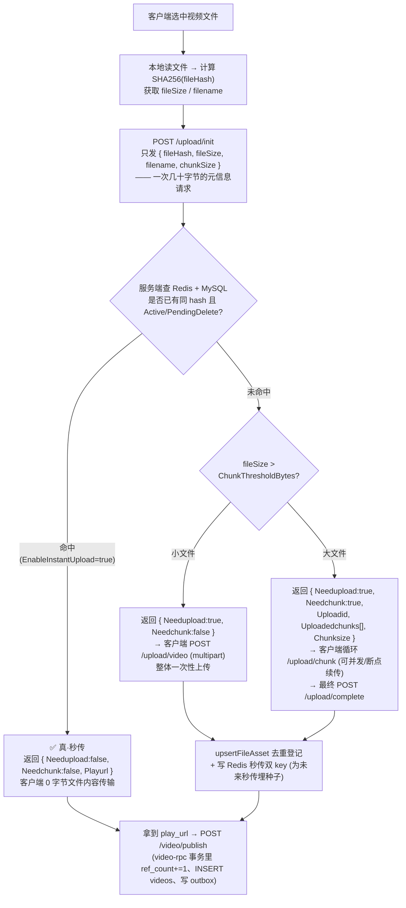

**三条路径的对比**：

| 路径 | 入口接口 | 客户端实际传输 | 触发条件 | 服务端关键动作 |
|---|---|---|---|---|
| **① 真·秒传** | `/upload/init` 内联返回 | ~几十字节（只有 fileHash + 元信息） | `EnableInstantUpload=true` 且 MySQL `file_assets` 存在同 hash 且 `status=Active`，且磁盘文件 `os.Stat` 通过 | `lookupInstantUploadedFile` 直查 MySQL + `os.Stat` 双重确认 → 返回该 asset 的 canonical `play_url`（并顺手把两把 Redis 秒传 key 刷新到最新 URL） |
| **② 小文件直传** | `/upload/video` (`UploadVideoLogic`) | 整个文件一次 HTTP multipart | 秒传未命中 且 `fileSize ≤ ChunkThresholdBytes` | `saveVideoUpload` 落盘 + 边写边算 SHA256 → `upsertFileAsset` 去重登记 → Redis 写秒传双 key |
| **③ 分片上传** | `/upload/init` → `/upload/chunk`×N → `/upload/complete` | 整个文件（分片可并发、可断点续传） | 秒传未命中 且 `fileSize > ChunkThresholdBytes` | init 建会话 → 每片落到 `chunkTempDir` → complete 合并、二次校验 hash、`upsertFileAsset` → 写秒传双 key |

**关键澄清（很容易误解的点）**：

1. **只有路径 ①（真·秒传）对本次上传的用户来说是"零传输"**。它的前提是客户端必须**先在本地把整个文件读一遍算出 SHA256**，然后只把 hash 发过来。服务器一次查询命中就直接返回 URL，客户端**不用再传文件内容**。这才配叫"秒传"。
2. **路径 ②/③ 的 `upsertFileAsset` 也会做去重**，但那时候客户端已经把整个文件传上来了。这一步节省的是 **服务端的物理存储和 `file_assets` 的冗余行**（如果 MySQL 里 hash 已存在，就把本次刚落盘的重复文件删掉，返回旧 canonical URL），**并不能节省本次的网络带宽和落盘 IO**。
3. **`UploadVideoLogic`（`/upload/video`）结尾那两条 `TxPipeline.SET`（写 `ChunkUploadHashKey` + `ChunkUploadGlobalHashKey`）不是"帮本次用户秒传"**，而是**为下一次同 hash 的上传埋种子**——下次别的用户（或自己）传相同文件时，`/upload/init` 就能在 Redis 里命中走路径 ①。这是一次"缓存预热"。
4. **秒传决策的权威源是 MySQL `file_assets` + 磁盘 `os.Stat`，不是 Redis**。这是最容易被误解的地方：
   - `lookupInstantUploadedFile` 的**读路径直接 `SELECT file_assets WHERE file_hash=? AND status=Active`**，然后 `os.Stat(storage_path)` 校验磁盘文件真实存在——**完全没有 `GET fsz:chunkupload:hash:*` 的动作**；
   - 之所以不读 Redis，是为了规避"MySQL 已经 `PendingDelete` 但 Redis 还缓存着旧 URL"这种短暂不一致——**永远以 MySQL 状态和磁盘现实为准**，秒传决策就不会返回一个即将被 asset_cleanup 清理的死文件；
   - Redis 双 key `ChunkUploadHashKey`（用户维度）和 `ChunkUploadGlobalHashKey`（全局）目前在**读路径上是"预留位"**，只做三件事：① 直传/合并成功后 `SET` 写入、② `lookupInstantUploadedFile` 命中 DB 后 `SET` 刷新、③ 各种"发现不一致"时的 `DEL` 清理；
   - 保留写路径的价值是"**缓存已经热着**"——未来如果想启用 Redis 加速（在函数开头加 `GET` 短路 MySQL 查询），不需要冷启动预热，改动只有几行；也方便运维/外部系统旁路查询 hash → URL 映射。
5. **秒传 TTL（默认 7 天）过期后不影响秒传能力**。因为读路径本来就直接查 MySQL，Redis 有没有、准不准都不影响判定结果。TTL 的作用只是限制**写入 Redis 后的最长驻留时间**，避免 asset_cleanup 之外的意外场景（比如运维手改 DB）留下过久的脏缓存。这个 TTL 从来不是秒传能否命中的门槛。
6. **分片路径的断点续传**：`/upload/init` 内 `reuseUploadSession` 会查 `fsz:chunkupload:session:{userID}:{fileHash}`，如果存在同一会话且元数据（fileHash/fileSize/finalExt/chunkSize）**强一致校验**通过，就返回已存在的 `uploadID` + 已上传的分片编号数组，客户端只需补传缺失分片。任一元数据不一致则视为新会话。
7. **上传路径与 `ref_count` 的边界**：无论走哪条路，`file_assets.ref_count` 的 `+=1` 都**不在上传时发生**，而是在后续 `/video/publish` 调用 video-rpc `PublishVideo` 的事务里完成。这样"上传成功但没发布"的孤立资产会在 Grace 期后被 asset_cleanup 回收，不会长期占存储。

**举个连贯的例子**（用户 A 首发、用户 B 秒传）：

1. 用户 A 选中一个 500MB 视频 → 客户端算 SHA256 → `/upload/init` 拿到 `Needupload=true, Needchunk=true`（大文件走分片）；
2. A 循环 `/upload/chunk` 传完所有分片 → `/upload/complete`：服务端合并 + 二次 hash 校验 + `upsertFileAsset` **首次登记** `Active, ref_count=0` + **`SET fsz:chunkupload:hash:global:{hash} = canonical_url, EX 7d`**；
3. A 拿到 `play_url` → `/video/publish` → video-rpc 事务内 `ref_count=1` + INSERT videos + 写 outbox；
4. 几小时后用户 B 拿到同一份视频（可能是转发保存的）→ 客户端算出**同一个 SHA256** → `/upload/init` → 服务端 `lookupInstantUploadedFile` 查 MySQL 命中 A 之前的 `file_assets` 行、`os.Stat` 确认磁盘文件仍在 → 直接返回 A 之前的 `canonical_url`，**B 一个字节文件都没传**；
5. B 再 `/video/publish` → video-rpc 事务内对同一 `file_assets` 行 `ref_count=2` + INSERT B 自己的 `videos` 行。

此时磁盘上只有**一份物理文件**，`file_assets` 只有**一行 `Active, ref_count=2`**，两条 `videos`（A 和 B）通过 `play_url` 共同引用它——这就是"秒传 + 引用计数"体系的最终形态。

**分片路径细节：分片是怎么切的、怎么传的、怎么合并的**

分片上传（路径 ③）不是一次请求就完成的动作，而是**三段式协议**：`/upload/init`（协商会话）→ `/upload/chunk`×N（逐片投递）→ `/upload/complete`（合并成品）。下面把每一步用到的元数据、判定逻辑、以及"分片到底怎么切"讲清楚。

**Step 1：`/upload/init` 协商——决定要不要分片、怎么分片**

客户端读文件、算完 SHA256 之后，先发一个**只包含元信息**的 init 请求：

```
POST /upload/init
{
  "filename":     "vacation.mp4",   // 用于提取扩展名 final_ext，白名单校验
  "file_hash":    "<SHA256 64 hex>", // 完整文件的哈希，秒传/续传/合并校验的锚点
  "file_size":    524288000,        // 500MB，字节数
  "chunk_size":   0,                // 可选，客户端不指定则由服务端给默认值
  "total_chunks": 0                 // 可选，仅用于交叉校验，不指定也行
}
```

服务端在 [`InitVideoUploadLogic`](d:\feedsystem-zero-main-git\apps\gateway\internal\logic\initvideouploadlogic.go) 里按以下顺序做**六层判定**：

| 顺序 | 判定项 | 依据的配置 / 常量 | 不满足时的动作 |
|---|---|---|---|
| 1 | JWT 是否合法、能拿到 `user_id` | JWT 中间件 | 401 |
| 2 | 文件名合法（非空 + 扩展名在视频白名单） | `validateVideoFilename` | 400 |
| 3 | `file_hash` 是 64 位小写 hex | `normalizeUploadHash` | 400 |
| 4 | `file_size` 未超上限 | `MaxVideoBytes` = 100MB | 400 |
| 5 | `chunk_size` 合法：>0 且 ≤ `MaxChunkBytes`；客户端不填则用 `DefaultChunkBytes` | `DefaultChunkBytes` = 8MB，`MaxChunkBytes` = 10MB | 400 |
| 6 | `total_chunks = ceil(file_size / chunk_size)`；若客户端也传了则必须一致 | `math.Ceil(float64(fileSize) / float64(chunkSize))` | 400 |

**判定通过后才进入"三条路径分流"**：

```
if EnableInstantUpload && lookupInstantUploadedFile 命中:
    → 路径 ①（真·秒传）：直接返回 canonical play_url
elif !shouldUseChunkUpload(upload, fileSize):   // fileSize ≤ ChunkThresholdBytes(20MB)
    → 路径 ②（小文件直传）：返回 { Needchunk:false }，前端换用 /upload/video 一次性传
else:                                            // fileSize > 20MB
    → 路径 ③（分片上传）：
        reuseUploadSession(userID, fileHash, fileSize, finalExt)
        ├─ 命中且强一致 → 复用旧 uploadID、返回已传编号
        └─ 未命中     → randomUploadID() 生成新 uploadID、HSET meta、SET session
        统一 mkdir chunkTempDir(uploadID)
        返回 { Uploadid, Needchunk:true, Uploadedchunks[], Chunksize }
```

`shouldUseChunkUpload` 的判定只有一行：

```go
return fileSize > chunkThresholdBytes(upload)   // ChunkThresholdBytes 默认 20MB
```

**恰好等于阈值走直传**（`>` 不是 `>=`），边界包含在"小文件"这侧。

**分片如何切分**：客户端拿到 init 响应里的 `Chunksize` 后，按下述规则切文件：

| 分片编号 | 起始偏移 | 大小 |
|---|---|---|
| 1 | `0` | `chunkSize` |
| 2 | `chunkSize` | `chunkSize` |
| ... | ... | `chunkSize` |
| `totalChunks - 1` | `(totalChunks-2) * chunkSize` | `chunkSize` |
| `totalChunks`（末片） | `(totalChunks-1) * chunkSize` | `fileSize - chunkSize*(totalChunks-1)` |

**只有末片可能小于 `chunkSize`**，其他片必须精确等于 `chunkSize`。编号从 **1** 开始（不是 0），且末片编号等于 `totalChunks`。举例：`fileSize=500MB, chunkSize=8MB` → `totalChunks = ceil(500/8) = 63`，前 62 片各 8MB，第 63 片 = `500*1024*1024 - 8*1024*1024*62 = 4MB`。

**Step 1 结束时的元数据落地**（新会话才写，续传只刷 TTL）：

```
Redis:
  fsz:chunkupload:meta:{uploadID}          Hash    { user_id, file_name, file_hash,
                                                     file_size, chunk_size, total_chunks,
                                                     final_ext, created_at, updated_at }
  fsz:chunkupload:session:{userID}:{fileHash}  String  uploadID    (反向索引)
  fsz:chunkupload:set:{uploadID}           Set     (空集合，等分片进来 SADD)

磁盘:
  {uploadRoot}/chunks/{uploadID}/          目录    (mkdir 幂等，续传不重建)
```

**Step 2：`/upload/chunk` 逐片投递——分片编号由前端生成、后端严格校验**

前端拿到 `uploadID` 和 `chunkSize` 后，对每一个待传的分片（跳过 `Uploadedchunks` 里已有的编号）发一个 `multipart/form-data` 请求：

```
POST /upload/chunk
Content-Type: multipart/form-data

form fields:
  upload_id     = "xxx"          // 定位会话
  chunk_index   = 1..totalChunks // 前端自己算的编号（1 起）
  chunk_hash    = "<SHA256>"     // 可选，仅 EnableChunkHashValidate=true 时必填
  file / chunk  = <binary>       // 分片二进制
```

服务端 [`UploadVideoChunkLogic`](d:\feedsystem-zero-main-git\apps\gateway\internal\logic\uploadvideochunklogic.go) 对前端传来的 `chunk_index` **不信任**，用 Redis 里的 `meta` 做三重校验：

| 校验项 | 具体判断 | 失败时 |
|---|---|---|
| **归属** | `meta.user_id == JWT.userID` | 403 |
| **会话有效** | `meta` 存在（未过期） | 404 |
| **编号范围** | `1 ≤ chunk_index ≤ meta.total_chunks` | 400 |
| **期望大小** | 非末片：`written == meta.chunk_size`；末片：`written == fileSize - chunk_size*(total_chunks-1)` | 400，删掉临时文件 |
| **单片上限** | `written ≤ meta.chunk_size` 且 `≤ MaxChunkBytes`（10MB） | 400 |
| **分片 hash**（可选） | `EnableChunkHashValidate=true` 时 `sha256(chunk) == chunk_hash` | 400，删掉临时文件 |

**这里最巧妙的一点是"期望大小"**——服务端**根据前端报的 `chunk_index` 反推这片应该有多大**，前端就算敢瞎报编号也没用，因为字节数对不上就会被拒。想欺骗后端就必须把"编号 + 分片大小"两个变量同时构造正确，成本极高。

**分片落盘用"tmp 文件 + 原子 rename"保证不留半吊子**：

```
1. 写到 {tempDir}/chunk_{index}.{randomToken}.tmp   // 边写边算 SHA256
2. 校验大小、校验 hash（如启用）
3. 全部通过 → os.Rename → chunk_{index}             // 原子替换
4. 任一步失败 → os.Remove(tmp) → 400
```

**幂等语义**：同一个 `chunk_index` 重复上传（比如客户端网络抖动导致的重试）会**覆盖**上一次的正式文件，Redis `SADD` 天然去重也不会因为重复而报错——所以客户端可以放心重试。

**并发上传能力**：分片上传**支持前端多 goroutine / 多 XHR 并发投递不同分片**，这是分片上传相对小文件直传"提速"的核心场景。并发安全性从三个粒度分别得到保障：

| 并发粒度 | 场景 | 保护机制 | 结果 |
|---|---|---|---|
| **① 同 `upload_id` + 不同 `chunk_index`** | 前端并行发 6 个 goroutine 同时传分片 1~6 | **每片写到 `chunk_index` 唯一决定的独立文件路径**（`chunk_1` / `chunk_2` / ...），文件系统层面天然不相交 + **Redis `SADD` 原子命令**（单线程执行、集合天然去重） | ✅ 完全并发，零冲突 |
| **② 同 `upload_id` + 同 `chunk_index`** | 网络抖动导致同一片被重复投递 | `randomHex(8)` 生成随机 `tmpToken` 写入 `chunk_{i}.{token}.tmp`，多 goroutine 各写各的 tmp 互不干扰，最终 `os.Rename` **原子提交**；分片 hash 校验保证两个成功写入的内容完全一致，谁覆盖谁都幂等 | ✅ 最终一致，不产生"半 A 半 B"损坏文件 |
| **③ 不同 `upload_id` + 同 `file_hash`** | 多用户并发上传同一份视频 | 每个 `upload_id` 拥有独立的 `chunkTempDir(uploadID)` 目录，物理隔离；最终 `CompleteVideoUpload` 阶段按 `file_hash` 命名的产物走**内容寻址存储**（`{uploadRoot}/yyyy/mm/dd/{fileHash}.{ext}`）+ `upsertFileAsset` 秒传去重，天然收敛到同一个物理文件 | ✅ 各自独立，最终去重 |

**complete 阶段的并发保护**：`CompleteVideoUploadLogic` 通过 `SetNX fsz:chunkupload:lock:{uploadID} = randomToken, EX 5min` 加**分布式合并锁**——防止前端超时重试或用户重复点击"完成"按钮同时触发两个合并流程；释放锁用 Lua `if get==token then del` 保证不会误删别人的锁。

**部署侧约束（多副本 gateway 场景）**：**如果 gateway 是多副本部署，且分片存储用的是节点本地磁盘（非 NFS / CephFS / 共享卷）**，前端必须保证**同一个 `upload_id` 的所有分片请求打到同一个 gateway 节点**——推荐在负载均衡层（Nginx / K8s Ingress / 网关）按 `upload_id` 做**一致性哈希路由**。否则不同节点会各自持有部分 `chunk_{i}` 文件、`CompleteVideoUpload` 合并阶段会读不到全部分片而报错。**如果分片目录挂在共享存储上**（NFS / CephFS / 对象存储挂载），分片请求可以任意打到任何节点，并发能力最大化。

**响应体**：

```json
{
  "msg": "上传分片成功",
  "upload_id": "xxx",
  "chunk_index": 5,
  "uploaded_chunks": [1, 2, 3, 4, 5]    // 截至此刻服务端已确认收到的所有编号
}
```

每次响应都会带上最新的 `uploaded_chunks`，客户端据此维护本地进度条、判断是否所有分片都传完了。

**Step 3：`/upload/complete` 合并——分布式锁 + 全量二次校验**

当前端确认 `uploaded_chunks.length == total_chunks` 后，发起合并请求：

```
POST /upload/complete
{
  "upload_id": "xxx"
}
```

服务端 [`CompleteVideoUploadLogic`](d:\feedsystem-zero-main-git\apps\gateway\internal\logic\completevideouploadlogic.go) 在这一步做的事情比前两步加起来还多，因为它是**上传流程的"最后一公里"**，一旦落地就是不可逆的资产登记：

1. **归属 + 会话校验**：`meta.user_id == JWT.userID`，防止越权触发合并；
2. **分布式合并锁**：`SETNX fsz:chunkupload:lock:{uploadID} = randomToken, EX 5min`——防止两个 tab 同时点"完成上传"或客户端超时重试导致并发合并同一文件；释放锁用 Lua `if get==token then del` 保证不会误删别人的锁；
3. **完整性校验**：`len(uploadedChunks) != totalChunks` 或缺任一 1..N 编号 → `FailedPrecondition`；
4. **秒传兜底（幂等）**：如果发现 `finalVideoFilePath(fileHash)` 已经存在（比如上次合并成功但响应丢了、客户端重试），直接校验它的 hash 是不是等于本次 `meta.file_hash`，一致就跳过合并、直接进入 `finishCompletedUpload`；
5. **按编号顺序合并 + 全量 hash 校验**：`for i := 1; i <= totalChunks; i++` 读 `chunk_{i}` 一边写入 `finalPath.tmp` 一边算 SHA256，最终 `written != fileSize` 或 `actualHash != meta.file_hash` **立刻失败**并删除 tmp 文件——**决不让一份哪怕字节数对但内容错的文件进入 `file_assets`**；
6. **原子 rename 到正式路径**：`finalPath.tmp → finalPath`（`uploads/yyyy/mm/dd/{fileHash}.{ext}`）；
7. **`upsertFileAsset` 去重登记**：查 MySQL `file_assets`——若同 hash 已存在则删掉本次刚落盘的重复文件、返回 canonical URL；若不存在则 INSERT `Active, ref_count=0`；
8. **一次性收尾**：`TxPipeline` 里 `SET fsz:chunkupload:hash:global:{fileHash} = canonical_url, EX 7d`（为未来秒传埋种子）+ `DEL meta / set / session`（清理会话数据）；
9. **物理清理**：`os.RemoveAll(chunkTempDir(uploadID))`——临时分片目录整体删掉；
10. **返回 canonical `play_url`** 给前端 → 前端调 `/video/publish` 完成整个"发视频"流程。

**上传三步涉及的所有元数据（一图看全）**：

```
┌─────────────────────────────────────────────────────────────────────────┐
│  Redis                                                                    │
├──────────────────────────────────────────────┬──────────┬────────────────┤
│ Key                                          │ 类型     │ TTL / 生存期   │
├──────────────────────────────────────────────┼──────────┼────────────────┤
│ fsz:chunkupload:session:{userID}:{fileHash}  │ String   │ 24h，滑动刷新  │
│ fsz:chunkupload:meta:{uploadID}              │ Hash     │ 24h，滑动刷新  │
│ fsz:chunkupload:set:{uploadID}               │ Set      │ 24h，滑动刷新  │
│ fsz:chunkupload:lock:{uploadID}              │ String   │ 5min（合并锁）│
│ fsz:chunkupload:hash:global:{fileHash}       │ String   │ 7d（秒传缓存）│
│ fsz:chunkupload:hash:{userID}:{fileHash}     │ String   │ 7d（用户级）  │
├──────────────────────────────────────────────┴──────────┴────────────────┤
│  meta Hash 字段清单                                                       │
├─────────────────────────────────────────────────────────────────────────┤
│  user_id       归属校验                                                   │
│  file_name     原文件名（提取 final_ext 用）                              │
│  file_hash     完整文件 SHA256 —— 续传强一致校验、合并二次校验的锚点      │
│  file_size     文件字节数 —— 分片数换算、末片大小推算、合并大小校验       │
│  chunk_size    单片字节数 —— 分片切分、非末片大小校验                     │
│  total_chunks  分片总数 —— 编号范围校验、完整性校验                       │
│  final_ext     .mp4 / .mov 等，白名单校验后落库                           │
│  created_at    会话创建时间                                               │
│  updated_at    每次操作后刷新                                             │
└─────────────────────────────────────────────────────────────────────────┘

┌─────────────────────────────────────────────────────────────────────────┐
│  磁盘                                                                     │
├─────────────────────────────────────────────────────────────────────────┤
│  {uploadRoot}/chunks/{uploadID}/chunk_{i}          第 i 片的正式文件      │
│  {uploadRoot}/chunks/{uploadID}/chunk_{i}.{r}.tmp  第 i 片的临时文件      │
│  {uploadRoot}/yyyy/mm/dd/{fileHash}.{ext}          合并后的正式文件       │
│  {uploadRoot}/yyyy/mm/dd/{fileHash}.{ext}.tmp      合并中的临时文件       │
└─────────────────────────────────────────────────────────────────────────┘

┌─────────────────────────────────────────────────────────────────────────┐
│  MySQL file_assets（合并完成后才登记，上传过程中完全不碰）                 │
├─────────────────────────────────────────────────────────────────────────┤
│  id / type / file_hash / storage_path / url / size /                     │
│  status (Active/PendingDelete/Cleaning/Deleted) / ref_count /             │
│  created_at / updated_at / deleted_at                                     │
└─────────────────────────────────────────────────────────────────────────┘
```

**关键配置项一览**（[`gateway.yaml`](d:\feedsystem-zero-main-git\apps\gateway\etc\gateway.yaml)）：

| 配置项 | 默认值 | 作用 |
|---|---|---|
| `MaxVideoBytes` | `104857600`（100MB） | 单个视频文件总大小上限 |
| `ChunkThresholdBytes` | `20971520`（20MB） | ≤ 该值走小文件直传，> 该值走分片 |
| `DefaultChunkBytes` | `8388608`（8MB） | 客户端不指定 chunk_size 时的默认单片大小 |
| `MaxChunkBytes` | `10485760`（10MB） | 单片大小上限（防止客户端把 chunk_size 拉太大导致大内存 buffer） |
| `ChunkSessionTTLSeconds` | `86400`（24 小时） | meta / session / set 三把 key 的存活时长（每次操作刷新） |
| `EnableInstantUpload` | `true` | 是否启用秒传（关掉则每次都走真实上传） |
| `EnableChunkHashValidate` | 由配置控制 | 是否强制前端为每片附带 `chunk_hash` 并做逐片校验 |

**分片 hash 校验的两种模式**：

| | `EnableChunkHashValidate = false` | `EnableChunkHashValidate = true` |
|---|---|---|
| **前端** | 只切片、传 `chunk_index` + 二进制，**不算 hash** | 每片切完先算 SHA256，随 `chunk_hash` 一起 POST |
| **后端** | 边写边用 `sha256.New()` 算 hash，**但不比对**（只做大小校验） | 边写边算，落盘前用 `actualHash != chunk_hash` 严格比对，不一致就删掉临时文件返回 400 |
| **失败发现时机** | 只能在 `/upload/complete` 合并时全量 hash 校验发现坏片 | 传坏的当片立即失败，客户端可立即重传该片 |
| **性能代价** | 前端零开销 | 前端每片多一次 SHA256（几十 MB 分片 CPU 上几十毫秒） |

**不管是否启用逐片校验，`/upload/complete` 都会对合并后的完整文件再算一次 SHA256 与 `meta.file_hash` 比对——这是强制兜底防线，保证最终落盘文件字节级正确。**

**分片路径细节：断点续传是怎么实现的**

分片上传（路径 ③）之所以对用户友好，核心在于**可以从任意分片断点续传**——网络断了、浏览器崩了、用户手滑刷新页面，重新打开都能从上次停下的地方继续，而不用从头再传 500MB。这一切都靠"上传会话"（upload session）在 Redis 里的三把 key 支撑：

**上传会话在 Redis 里的三把 key**（都在 `common/rediskey/chunkupload.go`）：

| Key | 类型 | 用途 |
|---|---|---|
| `fsz:chunkupload:meta:{uploadID}` | Hash | 上传会话元数据：`user_id / file_name / file_hash / file_size / chunk_size / total_chunks / final_ext / created_at / updated_at`。**强一致的锚点**——续传时必须每一项都匹配才认这个会话 |
| `fsz:chunkupload:set:{uploadID}` | Set | 已经成功上传的分片编号集合。每上传成功一片 `SADD chunk_index`，续传时 `SMEMBERS` 拿到"已传"列表，客户端只补传"未传"部分 |
| `fsz:chunkupload:session:{userID}:{fileHash}` | String | `(userID, fileHash) → uploadID` 的反向索引。让客户端只用 hash 就能找回自己上一次的 uploadID，不用记住 uploadID |

TTL 都是 `chunkSessionTTL`（默认 24 小时），且**每次 init/chunk 操作都会 `pipe.Expire` 刷新三把 key 的 TTL**——只要用户还在活跃上传，会话就不会过期；一旦超过 24h 没动作，Redis 自动过期回收，磁盘上残留的分片临时目录也会在下一次同 hash init 时被覆盖（或由运维定时清理）。

**续传决策全流程**（[`initvideouploadlogic.go` 的 `reuseUploadSession`](d:\feedsystem-zero-main-git\apps\gateway\internal\logic\initvideouploadlogic.go) 第 175-233 行）：

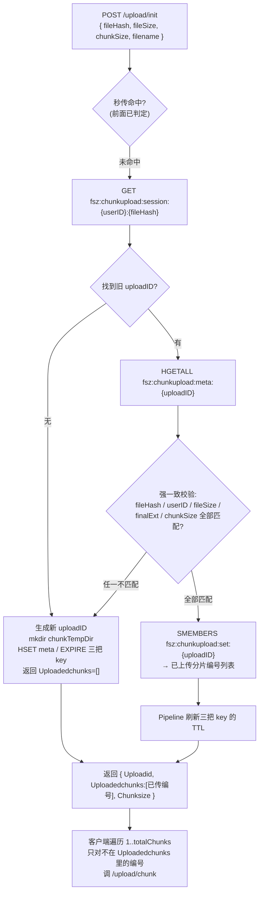

**为什么必须做"强一致校验"？** 想象一下反例：用户先用 500MB 视频 A 开了一个会话传了 3 片，然后又选了另一个 200MB 视频 B（碰巧 SHA256 已经变了但客户端 bug 传错 hash），如果不校验 `file_size / chunk_size / total_chunks`，就会把 B 的分片写到 A 的临时目录里、`SADD` 到同一个 set 里，最终合并出来的是**混合文件**、hash 校验通不过，前面传的 3 片全废。

`reuseUploadSession` 里的这段就是保护：
```go
if len(meta) == 0 ||
    meta["file_hash"] != fileHash ||
    meta["user_id"] != strconv.FormatUint(userID, 10) ||
    meta["file_size"] != strconv.FormatInt(fileSize, 10) ||
    meta["final_ext"] != finalExt {
    return "", nil, 0, nil // 视为新会话
}
```
任一字段不一致就**放弃复用、开新会话**，绝不复用一个可能被污染的会话。

**分片上传时的关键防御**（[`uploadvideochunklogic.go`](d:\feedsystem-zero-main-git\apps\gateway\internal\logic\uploadvideochunklogic.go)）：

1. **归属校验**：`meta["user_id"] != userID` → 403，防止 A 用户拿到 B 的 uploadID 越权上传；
2. **分片大小精确校验**：非末片必须等于 `chunkSize`、末片必须等于 `fileSize - chunkSize*(totalChunks-1)`——`written != expectedChunkBytes` 立刻拒绝，防止传半片污染合并结果；
3. **边写边算 SHA256**：`io.MultiWriter(dst, hasher)` 落盘的同时算 hash，若 `EnableChunkHashValidate=true` 就与前端传来的 `chunkHash` 比对，不一致直接删除临时文件返回 400；
4. **原子落盘**：先写 `chunk_{idx}.{rand}.tmp`，全部写完、校验通过后才 `os.Rename` 成 `chunk_{idx}`——**任何一步失败都不会留下半吊子的正式分片**，续传时下一次上传同一个 index 会覆盖，`SADD` 幂等；
5. **响应体带上最新的 `Uploadedchunks`**：客户端每次收到 chunk 响应都拿到"截至现在服务端已确认收到的所有分片编号"，网络重传时客户端可以对齐重试。

**合并阶段的防重入 + 二次校验**（[`completevideouploadlogic.go`](d:\feedsystem-zero-main-git\apps\gateway\internal\logic\completevideouploadlogic.go)）：

1. **分布式合并锁**：`SETNX fsz:chunkupload:lock:{uploadID} = randomToken, EX 5min`——防止两个 tab 同时点"完成上传"或客户端超时重试导致并发合并同一文件；释放锁用 Lua `if get==token then del` 保证不会误删别人的锁；
2. **完整性校验**：`len(uploadedChunks) != totalChunks` 或缺任一编号 → `FailedPrecondition`；
3. **秒传兜底**：如果发现 `finalVideoFilePath(fileHash)` 已经存在（比如上次合并成功但响应丢了、客户端重试），直接校验它的 hash 是不是等于本次 `fileHash`，一致就跳过合并、直接进入 `finishCompletedUpload`——**天然幂等**；
4. **合并全量校验**：按 index 顺序读取 `chunk_1..N` 一边写入 `finalPath.tmp` 一边算 SHA256，最终 `written != fileSize` 或 `actualHash != fileHash` 立刻失败并删除 tmp 文件——**决不让一份哪怕字节数对但内容错的文件进入 `file_assets`**；
5. **登记 + 清理原子化**：`finishCompletedUpload` 里用 `TxPipeline` 一次性 `SET 秒传双 key + DEL meta / set / session`，然后 `RemoveAll(chunkTempDir)`——会话数据、临时分片、秒传缓存三者最终态强一致。

**一句话总结断点续传**：

> **`(userID, fileHash) → uploadID` 反向索引** + **`meta` 强一致校验** + **`set` 已传编号集合** + **临时分片"tmp 落盘 → 原子 rename"** + **合并阶段分布式锁 + 全量 hash 校验** —— 五重保障共同实现了"任意时刻中断都能从下一个未传分片继续、绝不会因为续传而合并出错误文件"的分片上传语义。客户端要做的仅仅是"每次 init 都发 fileHash，然后跳过响应里 `Uploadedchunks` 已有的编号"这么简单。

**服务端资产登记时序（三条路径未命中秒传后的公共合流点）**：

以下时序图展开的是**路径 ②/③ 落盘后到 `file_assets` 登记完成**的服务端细节，以及后续 `PublishVideo` 事务如何 `ref_count+=1`、`asset_cleanup` Job 如何延迟物理清理——路径 ①（真秒传）直接从 MySQL 拿到 URL 后跳到最下方 `/video/publish` 环节，中间的落盘和 `upsertFileAsset` 都不经过。

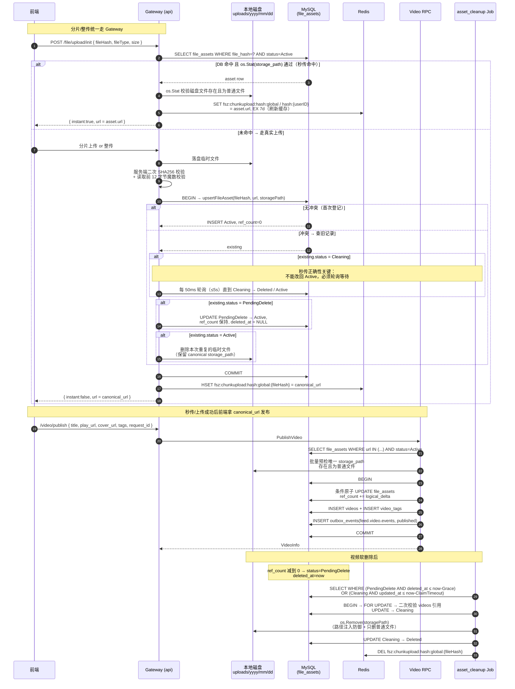

**关键点**：`ref_count` 调整与 `videos` 创建/软删除必须在 **video-rpc 同一事务内**。发布前，`preparePublishFileAssets` 用一条 `WHERE url IN (...)` 查询批量加载视频与封面资产，并在事务外检查每个唯一 `storage_path` 是否为真实普通文件；事务内再以 `id + url + storage_path + status=Active` 为条件原子增加引用。任一条件失效都会使 `RowsAffected=0` 并回滚整个发布事务，要求客户端重新上传。

#### 8.2.1 PublishVideo 多资产条件更新保序（防死锁）

一条视频最多涉及两个 `file_assets` 行：`play_url` 与 `cover_url`。条件 `UPDATE` 本身会获取排他行锁；若两个并发事务分别以 `A→B` 和 `B→A` 更新同两个资产，仍会形成经典锁序反转死锁。

`aggregateFileAssetRefs` 会对 URL **去重、统计逻辑引用数并升序排列**，事务体统一按该顺序调用 `reservePreparedPublishFileAsset`。任何发布或删除事务的资产更新顺序都相同；当 `play_url == cover_url` 时，只执行一次 `ref_count = ref_count + 2`，无需重复查询、校验和更新。

- 单元测试：`fileassethelper_test.go` 覆盖 URL 聚合保序、重复 URL 的 `Delta=2`、缺失文件以及条件原子 UPDATE 的 SQL 约束。
- 显式 `SELECT FOR UPDATE` 已被移除，但条件 `UPDATE` 自身仍会持有行锁，并通过 `status=Active` 阻止 `Cleaning/PendingDelete` 资产被重新引用。

#### 8.2.2 `preparePublishFileAssets` / `buildPreparedPublishFileAssets` 双函数拆解

发布视频的"资产预检两步曲"位于 [`apps/video/internal/logic/fileassethelper.go`](../apps/video/internal/logic/fileassethelper.go)，在真正进入事务、抢行锁之前一次性完成"批量拉取 + 磁盘校验 + 打包 CAS 素材"。

**核心设计理念**：**磁盘 `os.Stat` 是慢 I/O、事务持有行锁是稀缺资源**——两者绝不能捆绑。所以把批量 SELECT 和 `os.Stat` 全部**前置到事务外**做（失败尽早、行锁持有时间毫秒级），事务里只留一件事——按字典序、按 asset 逐个跑条件 UPDATE `ref_count += Delta`。

##### 数据流全景

```
输入：urls = ["videoURL", "coverURL"]
   │
   ▼
【preparePublishFileAssets】负责 I/O
   ├─ ① aggregateFileAssetRefs：去空 + 计数聚合 + 字典序排序
   │    ├─ 常规：{"videoURL":1, "coverURL":1}
   │    └─ 特殊：playURL == coverURL → {"sameURL":2}   ← Delta=2
   │    输出：[]fileAssetRef（按 URL 字典序）
   ├─ ② orderedURLs = ["coverURL","videoURL"]
   └─ ③ 一条 SQL 批量查：
        SELECT id, url, storage_path
        FROM file_assets
        WHERE url IN (?) AND status = ACTIVE
        ↑ 非 ACTIVE 直接在 SQL 层被过滤掉、不会带回 Go 侧
   │
   ▼
【buildPreparedPublishFileAssets】纯内存配对与校验（无 I/O、无 ctx / db，天然可单测）
   ├─ ① 建 assetsByURL map（slice → map，O(1) 查找）
   └─ ② 按 refs 字典序遍历：
        ├─ map 里没有该 URL → 报 publishFileAssetError 包 ErrRecordNotFound
        │  （URL 伪造 / 资产被 clean job 降级为 PendingDelete）
        ├─ validatePublishAssetFile(storagePath) 磁盘三重校验：
        │    ├─ path 非空
        │    ├─ os.Stat 成功、且不是 os.ErrNotExist
        │    └─ info.Mode().IsRegular()（拒绝目录/软链/设备文件）
        │  失败 → 报 publishFileAssetError 包 errFileAssetStorageUnavailable
        └─ 通过 → 拼装 preparedPublishFileAsset{ ID, URL, StoragePath, RefDelta }
   │
   ▼
输出：[]preparedPublishFileAsset（按字典序、CAS 素材包）
```

##### `preparePublishFileAssets`——负责 I/O

1. **`aggregateFileAssetRefs(urls...)` 去空 + 计数聚合 + 字典序排序**：
   - `strings.TrimSpace` 过滤空 URL；`counts[url]++` 计数——**同 URL 的引用被合并成一个 Delta**。
   - `play_url == cover_url` 时 `Delta = 2`——**必须 +2 而不是 +1**，因为软删时 `videos` 记录会同时释放 playURL 和 coverURL 两次（`-2`），若 reserve 只 +1，release -2 会把 `ref_count` 打到 -1 造成漂移。
   - `sort.Strings(orderedURLs)` 按字典序排序——**这是消灭死锁的关键**（详见 8.2.1）。
2. **`len(refs) == 0` 短路**：所有 URL 都是空字符串（被 `TrimSpace` 洗掉）时直接返回 `nil, nil`，不报错。
3. **一条 SQL 批量查**：
   - `Select("id","url","storage_path")` 显式列裁剪——只取事务内 CAS 所需的三个字段，减少 MySQL→Go 传输和 gorm 反射赋值开销。
   - `WHERE url IN (?) AND status = ACTIVE`——**在 SQL 层就过滤掉非 ACTIVE 状态**（`PendingDelete/Cleaning/Deleted` 都不会带回 Go 侧）。
   - `Find(&assets)` 而不是 `First`——`Find` 不把"找不到全部"当错误、把"哪些 URL 缺失"的判定下沉给 `buildPreparedPublishFileAssets`。
4. **把 refs（期望）和 assets（实际）交给下游做配对**——**职责分离**：本函数只管 I/O、下游是纯函数便于单测。

##### `buildPreparedPublishFileAssets`——纯内存配对与校验

1. **`assetsByURL` map 索引**：把 `[]FileAsset` slice 索引成 `map[url]FileAsset`，让后续按 URL 查找从 O(N×M) 降到 O(N+M)。
2. **按 refs 的字典序遍历**（不是遍历 assets）——保证返回的 `prepared` slice 也是字典序，供下游事务按序抢行锁。
3. **两重校验**：
   - **map 里没有该 URL** → 返回 `&publishFileAssetError{URL, Err: gorm.ErrRecordNotFound}`；触发场景：URL 伪造、上传后没在有效期内发布被 clean job 扫成 `PendingDelete`、上传流程异常导致 `file_assets` 没落成 ACTIVE。
   - **`validatePublishAssetFile(storagePath)` 磁盘三重校验**：
     - `strings.TrimSpace(path) == ""` → 拒绝（DB 脏数据）；
     - `os.Stat` + `errors.Is(err, os.ErrNotExist)` → 拒绝（**防止"DB 记录还在但磁盘文件被误删"的数据漂移，让用户不会发布出永远播放失败的视频**）；
     - `info.Mode().IsRegular()` → 拒绝目录/软链接/设备文件（防御性检查、防止路径被换成攻击路径）。
     - 失败 → 返回 `&publishFileAssetError{URL, Err: fmt.Errorf("validate asset_id:%d: %w", asset.ID, errFileAssetStorageUnavailable)}`——`%w` 保留 sentinel 供 `errors.Is` 判类型，同时追加 `asset_id` 便于日志排查。
4. **拼装 CAS 素材包 `preparedPublishFileAsset{ID, URL, StoragePath, RefDelta}`**——四个字段在下游事务里各有精确用途：

| 字段 | 事务内用途 |
|------|-----------|
| `ID` | UPDATE WHERE 主键定位 |
| `URL` | **CAS 条件字段**——预检快照 vs 事务时实际值 |
| `StoragePath` | **CAS 条件字段**——防止 URL 被重命名或路径迁移 |
| `RefDelta` | UPDATE SET `ref_count = ref_count + RefDelta` |

##### 错误链设计（Go 1.13+ error wrapping）

`publishFileAssetError` 实现了 `Unwrap()`，且携带 `URL` 字段——外层可以：

- 用 `errors.Is(err, gorm.ErrRecordNotFound)` 或 `errors.Is(err, errFileAssetStorageUnavailable)` 判断**具体不可用原因**；
- 用 `errors.As(err, &assetErr)` 提取 `URL` 定位到出问题的具体资产；
- `unavailablePublishFileAssetURL` 就是这样把 URL 提取出来，让顶层 `PublishVideo` 里 `invalidPublishAssetError` 精确区分是 playURL 还是 coverURL 出问题，返回不同的中文错误给客户端。

##### 与事务内 CAS 的联动（`reservePreparedPublishFileAsset`）

下游事务里的 `updatePreparedPublishFileAssetRef` 用的 WHERE 条件：

```go
Where("id = ? AND url = ? AND storage_path = ? AND status = ?",
      asset.ID, asset.URL, asset.StoragePath, model.FileAssetStatusActive)
```

**四个条件字段全都是预检时拍下来的快照**——如果事务开始后任何一个字段被并发改动（状态被降级为 `PendingDelete`、URL 被重命名、storage_path 被迁移），UPDATE 命中 0 行 → `RowsAffected == 0` → `reservePreparedPublishFileAsset` 返回 `publishFileAssetError{Err: ErrRecordNotFound}` → 整个发布事务回滚。**这就是"事务外乐观预检 + 事务内条件写"组合成的 CAS**，避免了"预检 OK 但入库时资产已被删"的漏洞。

##### 精心设计的 4 个关键点总结

| # | 设计 | 解决的问题 |
|---|------|-----------|
| ① | **聚合同 URL 的 Delta** | `play_url == cover_url` 时 `ref_count += 2`、防止软删漂移 |
| ② | **`sort.Strings` 字典序排序** | 所有并发事务按同一顺序抢行锁——从根本上消灭死锁 |
| ③ | **批量 SELECT + 事务外 `os.Stat`** | 磁盘 I/O 不占用行锁、事务持锁时间毫秒级 |
| ④ | **返回 `{id, url, storage_path, refDelta}`** | 供事务内 CAS UPDATE 使用、防止预检-写入之间的并发状态漂移 |

#### 8.2.3 PublishVideo 端到端流程七阶段总览

`PublishVideo` 位于 [`apps/video/internal/logic/publishvideologic.go`](../apps/video/internal/logic/publishvideologic.go)，是整个视频模块最复杂的写路径。它把参数校验、幂等预检、资产预检、事务写入、缓存失效串成一条完整链路，可以拆分成 **"三前置 + 一事务 + 三分流"** 七大阶段：

##### 阶段全景

```
① 参数校验 + 标签两级降级
        ↓
② 事务外幂等预检 #1（loadVideoByAuthorRequestID）
   命中 → idempotentPublishResponse 直接返回
        ↓
③ 事务外资产预检（preparePublishFileAssets：聚合 + 排序 + 批量 SELECT + 磁盘校验）
        ↓
④ 预生成 outbox eventID（事务外做、避免占用行锁）
        ↓
⑤ 开启事务
   ├─ 5.1 for CAS UPDATE file_assets.ref_count += Delta（按字典序）
   ├─ 5.2 INSERT videos（撞 uk_video_request 唯一键 → errDuplicateVideoRequest）
   ├─ 5.3 INSERT tags ON CONFLICT(name) DO NOTHING
   ├─ 5.4 SELECT tags WHERE name IN (?) 回读 tag.ID
   ├─ 5.5 INSERT video_tags ON CONFLICT(video_id, tag_id) DO NOTHING
   └─ 5.6 INSERT outbox_events(video.published, status=Pending)
        ↓
⑥ 事务失败三分流 / 事务成功 invalidateVideoEntityCache
        ↓
⑦ 返回 VideoInfo + "发布成功"
```

##### 阶段 ① 参数校验 + 标签两级降级

- **必填字段全校验**：`authorID / authorUsername / title / playURL / coverURL / requestID` 缺一不可。
- **`requestID` 是幂等三道防线的核心**：非空校验 + 长度上限 128（防注入）；gateway 层会为老客户端兜底生成、这里再兜一层强制要求，防止直接跨服务调用绕过 gateway。
- **标签两级降级**：`normalizeTags(in.GetTags())` 先规范化前端传入 → 若为空则 `extractTags(title + " " + description)` 从标题描述里抽 `#xxx` 兜底 → `maxVideoTags=20` 硬上限。

##### 阶段 ② 事务外幂等预检 #1 —— `loadVideoByAuthorRequestID`

用**独立的 DB 连接**按 `(author_id, request_id)` 查 `videos` 表——**这是三道幂等防线的第一道**，专门处理"客户端网络超时后正常重试"这类**大概率会命中**的场景：

- 命中 → `idempotentPublishResponse` 直接返回原视频，**并额外校验 PlayURL/CoverURL 是否一致**（防止同一 requestID 被复用发不同内容 → 返回 `AlreadyExists`）。
- 未命中 → 继续走首次发布流程。

**为什么不放事务里做**：这个 SELECT 只是幂等预判、和后续写入没有原子性绑定；放事务外能避免大量重试请求空占 DB 事务/行锁资源。真并发首发时会走第三道防线（唯一键 + 事务后回读）兜底。

##### 阶段 ③ 事务外资产预检 —— `preparePublishFileAssets`

详见 8.2.2。核心产出是 **CAS 素材包 `[]preparedPublishFileAsset{ID, URL, StoragePath, RefDelta}`**——每一个字段都会作为事务内 UPDATE 的 WHERE 条件。**磁盘 `os.Stat` 三重校验和批量 SELECT 全部前置到事务外**，让事务持锁时间压缩到毫秒级。

##### 阶段 ④ 预生成 outbox eventID

`newEventID("video_published")` 在事务外生成——**任何可以事务外做的事都不占用行锁**是本项目一贯的设计哲学。事务里只需要把 `eventID + createdVideo.ID + payload` 组装成 envelope 后 INSERT outbox_events 即可。

##### 阶段 ⑤ 事务体六步原子操作

`gormDB.Transaction(func(tx) error { ... })` 内**六个原子步骤**任何一步失败都会自动 ROLLBACK：

| 步骤 | 操作 | 关键设计 |
|------|------|---------|
| **5.1** | `for _, asset := range preparedAssets { reservePreparedPublishFileAsset(tx, asset) }` | 按字典序、CAS UPDATE 四字段快照（见 8.2.4） |
| **5.2** | `tx.Create(&createdVideo)` | 撞 `uk_video_request(author_id, request_id)` 唯一键 → `isDuplicateKeyError` → 返回 `errDuplicateVideoRequest`（幂等第二道防线）|
| **5.3** | `tx.Clauses(OnConflict{Columns:name, DoNothing:true}).Create(&tagRows)` | 标签表按 `name` 唯一键幂等 INSERT |
| **5.4** | `tx.Where("name IN ?", tags).Find(&savedTags)` | **必须回读**：DoNothing 冲突时 `tagRows[i].ID=0`、无法建关联，必须再 SELECT 一次拿真实 ID |
| **5.5** | `tx.Clauses(OnConflict{Columns:video_id+tag_id, DoNothing:true}).Create(&videoTags)` | 一条 SQL 批量建关联、冲突忽略 |
| **5.6** | 序列化 `eventx.FeedVideoEvent + Envelope` → `tx.Create(&OutboxEvent{Status:Pending})` | 与 videos 同事务，杜绝"视频已发布但下游无感知" |

**关键不变式**：`file_assets.ref_count +=1`、`INSERT videos`、`INSERT outbox_events` **必须在同一本地事务内**——任一步失败全部回滚，从根本上杜绝以下三类漂移：

- ❌ "视频存在但 ref_count 被回滚" → CDN 播放但资产 ref_count=0 被 Job 误清理；
- ❌ "ref_count 已加但视频未创建" → 资产孤儿引用、永远不会被清理；
- ❌ "视频已发布但下游无感知" → feed/推荐/通知模块永远收不到事件。

##### 阶段 ⑥ 事务失败的三分流精准返回

事务返回的 error 会被外层用 `errors.Is / errors.As` 精确分流成**三种完全不同的用户响应**：

| 分流 | 触发条件 | 用户响应 | HTTP 语义 |
|------|---------|---------|----------|
| **A. CAS 失败** | `errors.As(err, &publishFileAssetError)` + `errors.Is(err, ErrRecordNotFound / errFileAssetStorageUnavailable)` | 区分 playURL/coverURL → "视频/封面资源不存在或已失效，请重新上传" | 400 InvalidArgument |
| **B. 撞唯一键**（幂等第三道防线） | `errors.Is(err, errDuplicateVideoRequest)` | 独立连接 `loadVideoByAuthorRequestID` 拿"胜出者" → `idempotentPublishResponse` | **200 成功**（幂等语义）|
| **C. 其他 DB 错误** | 兜底 | "发布视频失败" | 500 Internal |

**最漂亮的地方**：分流 B 的 `errDuplicateVideoRequest` 虽然是 Go 层的 error、但**用户视角是成功**——意味着"你的另一个请求（或另一个协程）已经赢了、我把结果给你"。这就是**幂等语义的精确表达**：**同一 `request_id` 下无论重放多少次、返回的都是同一条视频、且视频只被真正创建一次**。

##### 阶段 ⑦ 缓存失效 + 返回

事务成功后 `invalidateVideoEntityCache(RedisCli, videoID)`——失败仅记日志、**不影响给客户端的响应**（缓存最终一致性、下次读时会回源）。最后 `toVideoInfo` 序列化后返回 `VideoInfo + "发布成功"`。

##### 三道幂等防线全景

| 防线 | 位置 | 处理场景 | 处理方式 |
|------|------|---------|---------|
| **第一道** | 阶段 ② 事务外 `loadVideoByAuthorRequestID` | 客户端正常网络重试（大概率命中）| 直接返回原视频、不进事务 |
| **第二道** | 阶段 ⑤.2 DB 唯一键 `uk_video_request(author_id, request_id)` | 毫秒级真并发首发（预检漏网） | INSERT 撞键、事务整体 ROLLBACK（含已 reserve 的 ref_count）|
| **第三道** | 阶段 ⑥.B 事务后独立连接再查 | 兜底：确保撞唯一键的请求也能拿到胜出者结果 | `idempotentPublishResponse` 返回胜出者、用户无感 |

---

#### 8.2.4 file_assets UPDATE 并发安全的四层机制协同

`reservePreparedPublishFileAsset` 里对 `file_assets` 的 UPDATE 是整个项目最典型的**并发控制样板**。它的并发安全性**不是靠单一机制**、而是**四层机制协同**的结果——**每一层单独用都有致命漏洞、缺一不可**：

```go
db.WithContext(ctx).
    Model(&model.FileAsset{}).
    Where(
        "id = ? AND url = ? AND storage_path = ? AND status = ?",  // ← 第 3 层：CAS 快照
        asset.ID, asset.URL, asset.StoragePath, model.FileAssetStatusActive,
    ).
    Updates(map[string]any{
        "ref_count":  gorm.Expr("ref_count + ?", asset.RefDelta),   // ← 第 2 层：原子表达式
        "deleted_at": nil,
    })
// ← 第 1 层：MySQL 自动持 X 锁；第 4 层：调用前 sort.Strings 保序
```

##### 四层机制的分工矩阵

| 层次 | 手段 | 防的具体并发问题 | 单独用够不够 |
|------|------|-----------------|-------------|
| **① MySQL 行锁** | InnoDB `UPDATE` 自动持 X 锁至事务提交 | 同一时刻两条 UPDATE 冲突（SQL 层串行化）| ❌ 防不住丢失更新 |
| **② 原子 SQL 表达式** | `gorm.Expr("ref_count + ?", Delta)` | Lost Update（读旧值再覆盖）| ❌ 防不住状态漂移 |
| **③ 乐观锁 CAS 快照** | `WHERE id=? AND url=? AND storage_path=? AND status=ACTIVE` | 预检-写入间隙的并发状态漂移（用户 vs Job / DBA）| ❌ 防不住多行死锁 |
| **④ 字典序抢锁** | `sort.Strings(orderedURLs)` | 多行 UPDATE 的循环等待死锁 | ❌ 单用不完整 |
| **① + ② + ③ + ④ 协同** | 四位一体 | 全部并发问题 | ✅ 完美 |

##### 第 1 层：MySQL 行锁 —— 保证 SQL 层串行化

InnoDB 下 `UPDATE ... WHERE ...` 会**自动对目标行加排他锁（X 锁）**，直到当前事务 COMMIT / ROLLBACK 才释放。它保证两条并发 UPDATE 不会同时进入执行、后到者阻塞等待。

**它防的是**：两条 UPDATE 同时执行产生的原子性冲突。
**它防不住**：读-算-写间隙的 Lost Update、预检快照失效、跨行死锁。

##### 第 2 层：原子 SQL 表达式 —— 消灭 Lost Update

**反例（错误写法）**：

```go
// ❌ 先 SELECT 读出、应用层 +1、再 UPDATE 写回
var asset model.FileAsset
tx.Where("id = ?", id).First(&asset)              // 读到 ref_count = 5
tx.Model(&asset).Update("ref_count", asset.RefCount+1)  // 写回 6
```

并发下：A 读 5、B 读 5、A 写 6、B 写 6——**丢了一次引用**、后续 cleanup Job 会提前误删还在用的文件。

**正例（项目写法）**：

```go
"ref_count": gorm.Expr("ref_count + ?", asset.RefDelta)
```

**渲染成 SQL 是 `SET ref_count = ref_count + 1`**——MySQL 在持有行锁的**同一个原子操作**内完成"读 + 算 + 写"，永远不会出现"读到旧值再覆盖"的漏洞。

**类比 Java `AtomicInteger.incrementAndGet()`**：它的线程安全**不是**因为方法加了 `synchronized`、**而是**因为用 CPU CAS 指令做原子的读-改-写；MySQL 里 `SET x = x + 1` 完全同理——**真正的原子性来自 SQL 表达式本身、行锁只是配合**。

##### 第 3 层：乐观锁 CAS 快照 —— 防状态漂移

WHERE 四字段：`id` 是定位字段，`url / storage_path / status = ACTIVE` **全部是预检时拍下来的快照**。触发 CAS 失败（`RowsAffected == 0`）的三大场景：

| 场景 | 谁改动了字段 | 后果 |
|------|-------------|------|
| **`status` 被 Job 抢先降级** | `asset_cleanup` Job 把 ACTIVE 改成 Cleaning/PendingDelete | 磁盘文件可能已被删、拒绝写入 |
| **`url` 被并发改动** | 运维脚本重命名 CDN URL | 快照失效、拒绝写入 |
| **`storage_path` 被并发改动** | 磁盘迁移工具改路径 | 快照失效、拒绝写入 |

**共同本质**：预检时看到的世界 vs 事务写入时的世界发生了变化——**行锁只锁"同一时刻的行"、锁不住"预检和 UPDATE 之间的间隙"**。CAS 快照就是 SQL 层的 Compare-And-Swap，专门补这个洞。

##### 第 4 层：字典序抢锁 —— 消灭死锁

如果不排序、两个用户同时发布并引用同两个资产：

```
用户 A：锁 URL_x → 想锁 URL_y（等待 B）
用户 B：锁 URL_y → 想锁 URL_x（等待 A）
→ 循环等待、MySQL 死锁检测器强制回滚一个事务
```

`aggregateFileAssetRefs` 里的 `sort.Strings(orderedURLs)` 保证**所有并发事务按同一顺序抢多行的锁**——永远只有"后到者等前到者"、**从根本上消灭循环等待**。这是**资源排序法**在 DB 场景的经典应用。

##### 单独用任一层会翻车的反例场景

**只有行锁没有 CAS 快照**：

```
T0：preparePublishFileAssets 读 status=ACTIVE
T1：asset_cleanup Job：UPDATE status=PendingDelete → COMMIT、行锁释放
T2：Job 继续 UPDATE status=Cleaning → 物理 os.Remove(disk) → status=Deleted → COMMIT
T3：发布事务：UPDATE ref_count += 1 WHERE id=?（没检查 status！）
     ↑ 行锁没人持、正常拿到、原子 +1 也没问题
     ↑ 但 status 已经是 Deleted、磁盘文件已经被删！
T4：用户点开视频 → 404 事故
```

**行锁救不了这个场景**——T3 时刻的资产行锁根本没人持有、UPDATE 顺利执行——**必须有 `AND status = ACTIVE` 的 CAS 快照检查**才能在 T3 时刻发现"世界已经变了、拒绝写入"、触发事务回滚、返回客户端 400 让用户重传。

##### 核心心智模型

**行锁只锁"同一时刻的行"、锁不住"预检和 UPDATE 之间的间隙"、也解决不了"读出来再写回去"的丢失更新**——**并发安全 = 行锁 + 原子表达式 + CAS 快照 + 字典序**、四位一体、缺一不可，这才是"事务外乐观预检 + 事务内 CAS 条件写"能真正 work 的底层数学基础。

---

**file_assets 四状态机（commit 687d0ab 完善）**：

| 状态 | 含义 | 可秒传 | 可被 asset_cleanup 抢占 |
|---|---|---|---|
| `Active(1)` | 正常引用中（ref_count 可为 0 但仍在 grace 期） | ✅ | ref_count=0 且过了 GraceSeconds |
| `PendingDelete(2)` | 最后一个引用删除后标记待删 | ❌ | ✅ |
| `Cleaning(4)` | 已被 asset_cleanup 临时抢占，即将物理删除 | ❌（轮询等待） | 只能同一抢占者推进 |
| `Deleted(3)` | 已物理删除（**软删除标记，DB 行仍存在**） | ❌（但可被复活） | ❌ |

**四状态在"上传路径 `upsertFileAsset`"视角下的判定与差异**：

DB 中"记录存在与否"和"status 字段值"是**两件完全不同的事**——尤其是 `Deleted` 状态（DB 行还在、只是 status 字段值为 3）与"行被 asset_cleanup Job 从表里 `DELETE` 掉"（行彻底不存在）**必须严格区分**，这直接决定了 `upsertFileAsset` 的 SELECT 循环里走 `break` 还是 `return`：

| 情况 | DB 行 | 磁盘文件 | SELECT 结果 | upsertFileAsset 行为 |
|---|---|---|---|---|
| **状态 = Active** | 存在（status=1） | 存在 | ✅ 拿到行 | `break` 出循环 → 走"路径调节"分支（同路径直接复用；不同路径删多余副本或修复丢失文件） |
| **状态 = PendingDelete** | 存在（status=2） | 存在 | ✅ 拿到行 | `break` 出循环 → 走"复活"分支：`os.Stat` 校验磁盘文件 + CAS `WHERE id=? AND status=?` 改回 Active |
| **状态 = Cleaning** | 存在（status=4） | 即将被 os.Remove | ✅ 拿到行 | **不 break**，进入 `select { ctx.Done, time.After(50ms) }` 轮询等待，直到状态变化或 5s 超时 |
| **状态 = Deleted** | 存在（status=3） | 已被物理删除，但 DB 行仍作为"墓碑"保留 | ✅ 拿到行 | `break` 出循环 → 走"复活"分支：`os.Stat(storagePath)` 校验**本次刚落盘的新副本**在磁盘上，然后 CAS `Deleted → Active` |
| **行被物理 DELETE** | ❌ 不存在（asset_cleanup 在极少数场景下会硬删行；或行还没被创建） | ❌ 不存在 | ❌ `record not found` | `return err` **退出整个函数**——调用方拿到错误后重试整个 `upsertFileAsset`，重试时段落 2 的 `INSERT ... ON CONFLICT DO NOTHING` 会成功走"全新插入"分支 |

**关键区别（回答"为什么 Deleted 是 break、record not found 是 return"）**：

- **`Deleted` 状态是"软删除标记"**：DB 行还在表里，只是 `status` 字段值改成了 3、`deleted_at` 打了时间戳。此时 `existing` 有完整数据（`id/file_hash/file_type` 全都能读到），完全可以通过 CAS `UPDATE WHERE id=? AND status=Deleted` **原子复活**——`break` 出循环让复活路径继续处理。
- **"行被物理 DELETE"是"硬删除"**：整行从表里消失，SELECT 返回 `gorm.ErrRecordNotFound`，`existing` 是零值结构体、没有任何有效字段可用来做后续决策——**必须 return** 让调用方从头重试。重试时 `file_hash` 唯一键约束已消失，段落 2 的幂等 INSERT 会插入全新行，走情况 A 完成登记。
- **`Cleaning` 之所以既不 break 也不 return，而是"等"**：Job 的 `os.Remove` 已在飞行途中且不可撤销，上传路径贸然把 status 改回 Active 会导致"DB 说资产活着但磁盘文件被 Job 顺手删了"的错乱——唯一安全的选择是让 Job 先干完，等 status 稳定到 `Deleted`（或整行被 DELETE）后再决策。

**上传路径决策一览（配合 `upsertFileAsset` for 循环阅读）**：

```
                          段落 2: INSERT ... ON CONFLICT DO NOTHING
                                     │
                    ┌────────────────┴────────────────┐
             RowsAffected==1                    RowsAffected==0
             （全新插入成功）                    （hash 已存在）
                    │                                 │
                 return                       段落 3: for { SELECT }
                                                      │
                    ┌─────────┬──────────┬────────────┼────────────┐
                    ▼         ▼          ▼            ▼            ▼
              record       类型冲突   Cleaning     Active       Deleted /
              not found                                        PendingDelete
                    │         │          │            │            │
                 return    return   等 50ms         break         break
                                    继续循环          │            │
                                                     ▼            ▼
                                              段落 5:         段落 4:
                                              路径调节         复活 (CAS)
                                              return          return
```


**完整状态转换表（每条边的触发者、前置条件、代码位置）**：

| # | From → To | 触发者 | 前置条件 | 代码位置 |
|---|---|---|---|---|
| ① | ∅ → Active | Gateway 上传路径 | 该 hash 从未在 `file_assets` 存在 | `upsertFileAsset` 段落 2：`INSERT ... ON CONFLICT DO NOTHING`，`RowsAffected==1` |
| ② | Active → PendingDelete | video-rpc 软删除 | 视频软删除后该资产 `ref_count` 减到 0 | `SoftDeleteVideo` 事务内 `UPDATE status=PendingDelete, deleted_at=NOW()` |
| ③ | **Active → Deleted**（异常跳过） | asset_cleanup 巡检 | `reconcileActiveAsset` 发现磁盘文件已丢失 **且** 真实 `videos` 引用=0 | `cleaner.go` `reconcileActiveAsset`：`fileExists==false && actualRefs==0` |
| ④ | Deleted → Active | Gateway 上传路径 | 用户上传同 hash，本次副本 `os.Stat` 通过 | `upsertFileAsset` 段落 4：CAS `UPDATE ... WHERE id=? AND status=Deleted SET status=Active` |
| ⑤ | PendingDelete → Cleaning | asset_cleanup 抢占 | `deleted_at ≤ now - GraceSeconds(300s)` **且** 事务内 `SELECT FOR UPDATE` 二次校验 `ref_count=0` 且真实引用=0 | `cleaner.go` `claimAsset`：`UPDATE status=Cleaning` |
| ⑥ | PendingDelete → Active（Job 自纠错） | asset_cleanup 抢占 | `claimAsset` 二次校验发现真实 `videos` 引用>0（Grace 期内被新视频复用） | `cleaner.go` `claimAsset`：`activeRefs>0` 分支 `UPDATE status=Active, ref_count=activeRefs, deleted_at=NULL` |
| ⑦ | Cleaning → Deleted | asset_cleanup 清理 | `removeAssetFile` 成功 `os.Remove` | `cleaner.go` `cleanOne`：`UPDATE ... WHERE status=Cleaning AND ref_count=0 SET status=Deleted`，并 `DEL fsz:chunkupload:hash:global:{hash}` |
| ⑧ | Cleaning → PendingDelete（回退） | asset_cleanup 清理失败 | `removeAssetFile` 报错（I/O、权限、context 超时） | `cleanOne` 失败分支：`UPDATE ... SET status=PendingDelete`，等下一轮重试 |
| ⑨ | Deleted → Active | 同 ④ | 说明这条边可以被上传路径反复触发（每次同 hash 上传都能复活） | 同 ④ |
| ⑩ | Deleted → ∅ | GC 兜底 | 长时间无复活的 Deleted 行被硬删除 | 兜底 GC（`DELETE FROM file_assets WHERE ...`） |

**五类边分类速览**：

| 类别 | 边 | 语义 |
|---|---|---|
| **主干路径** | ① → ② → ⑤ → ⑦ | 新登记 → 引用归零 → 抢占清理 → 物理删除完成，正常生命周期 |
| **复活边** | ④/⑨ Deleted→Active、⑥ PendingDelete→Active | 上传复活 & Job 自纠错——**资产可反复复用**是软删除+内容寻址的核心 |
| **回退边** | ⑧ Cleaning→PendingDelete | 清理失败不卡死在 Cleaning，回退等待下轮 |
| **异常跳过** | ③ Active→Deleted | 磁盘已丢失+无引用，无需走 PendingDelete 宽限期，直接标 Deleted |
| **终点边** | ⑩ Deleted→∅ | 兜底 GC，让墓碑最终消失，回到"下次新登记"的初始状态 |

**关键洞察**：
- **不是** `Active → PendingDelete → Cleaning → Deleted` 单线路径，而是**多入口、多出口、多回退、多复活**的有向图。
- **Cleaning 是极短过渡态**（只有 `os.Remove` 一次系统调用的耗时），存在的意义是**告诉其他路径"我正在删物理文件，请等我"**。
- **PendingDelete 是最长的"等待态"**（默认 300s Grace），故意留 5 分钟给"反悔"的机会（用户重传同 hash → 走边 ④；新视频引用 → 走边 ⑥）。
- **Deleted 是可复活的"墓碑"，不是终点**——只要还没被 GC 硬删除，任何时候用户上传同 hash 都能通过边 ④ 复活。这就是为什么 `file_assets` 用**软删除 + 内容寻址**，而不是每次都物理 DELETE 再重新 INSERT。
- **边 ③（Active→Deleted）是唯一跳过 PendingDelete 的边**：磁盘文件已经丢失、真实引用又是 0，说明这份资产已经彻底"不可用"，没必要再走 Grace 期宽限，直接进 Deleted 让下次上传走复活/新登记。

**秒传正确性保护**：`upsertFileAsset` 发现已存在相同 hash 的记录时，如果处于 `Cleaning` 则必须轮询等待（默认 5s），**绝不能直接将 Cleaning 改回 Active**——否则 asset_cleanup 可能在激活后删除新上传文件。若已处于 `PendingDelete/Deleted`，则以本次上传文件为准将其 UPDATE 回到 `Active`（边 ④/⑨，含 `os.Stat` 兜底防止登记死链接）。

**文件魔数二次校验**：`saveMultipartUpload` 和分片合并时都会调用 `validateUploadedFileSignature`，根据扩展名预期校验前 12 字节魔数（jpg/png/webp/mp4/webm），防止伪造后缀或传输损坏。

**上传接口统一返回 canonical URL**：`upsertFileAsset` 返回数据库中的规范副本 URL，`UploadVideo` / `UploadCover` / `CompleteVideoUpload` 均使用 `canonicalAsset.URL` 返回，避免同一 hash 因建议路径不同导致视频 play_url 不一致。

#### 8.2.5 BatchGetVideos 单版本 Key + Lua CAS 读路径

`apps/video/internal/logic/batchgetvideoslogic.go` 是 Feed / 视频卡片批量拉取的核心接口，和 `BatchGetProfiles` **底层同属"版本号+惰性重算方案 B"**，但因业务特点不同、**Key 结构与读写方案完全不同**——Video 选的是"**单版本 Key 覆盖 + JSON 内嵌版本 + Lua CAS 回写**"。

**Key 结构（见 `common/rediskey/video.go`）**：

| Key | 数据结构 | 说明 |
|---|---|---|
| `fsz:video:entity:{videoID}` | STRING(JSON) | 视频实体缓存，JSON 内**内嵌 `version` 字段**，所有版本共用同一个 key（新版本覆盖旧版本） |
| `fsz:video:entity:{videoID}:version` | STRING(int64) | 视频实体缓存版本号，`invalidateVideoEntityCache` INCR |

**与 Account 方案的核心差异对照**：

| 维度 | Account（`profile:{uid}:v:{n}`） | Video（`entity:{vid}`） |
|---|---|---|
| Key 里是否含版本号 | ✅ 含 —— 多版本共存 | ❌ 不含 —— 单版本覆盖 |
| 不同版本关系 | 不同 key 独立存在 | 同一 key 反复覆盖 |
| 旧版本清理 | 无人访问 + TTL 自然淘汰 | 写侧 `DEL` 主动清理 |
| 读侧 RTT 数 | 2 次 Pipeline（先拿版本再读实体+验证） | 1 次 Pipeline（同时读实体+版本） |
| 写侧动作 | 仅 `INCR` | `INCR` + `DEL` + Lua CAS 保护 |
| 脏数据窗口 | 双重版本校验，几乎无窗口 | 一次请求内可能返回旧值（~10ms 毫秒级） |

**读路径 5 步（`BatchGetVideos → loadVideoEntitiesFromCache → loadVideoEntitiesFromDB → cacheVideoEntityMisses`）**：

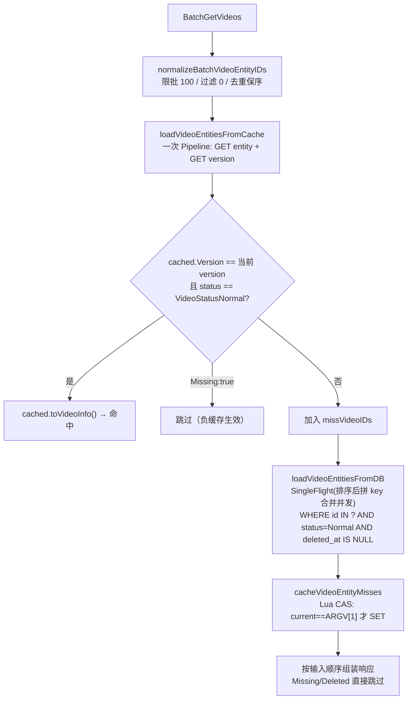

**"先读实体再读版本"命令顺序的关键性**：

`loadVideoEntitiesFromCache` 里 Pipeline 命令顺序是 `GET Entity` 后 `GET Version`——**必须是这个顺序**，反过来会导致误判为命中而返回脏数据：

| 时序 | 我方读命令 | 并发删除 |
|---|---|---|
| T1 | `GET Entity`（读到 v=5 的旧实体） | |
| T2 | | `INCR Version → 6` + `DEL Entity` |
| T3 | `GET Version`（读到 6） | |

结果：`cached.Version=5 ≠ version=6` → **不一致 → 强制回源**。若顺序反过来（先 Version 后 Entity），T1 拿到 v=5、T2 bump 到 v=6、T3 读到旧实体，`cached.Version=5 == 我方记住的 version=5`，会**误判为一致返回脏数据**。**这是 Video 单版本 Key 方案的一致性基础**。

**Lua CAS 回写（`setVideoEntityCacheIfMatch`）**：

```lua
local current = redis.call("GET", KEYS[1])   -- 当前 version
if not current then current = "0" end
if current ~= ARGV[1] then                    -- 与我方读到的 version 比较
    return 0                                   -- 版本已变 → 放弃写入
end
redis.call("SET", KEYS[2], ARGV[2], "PX", ARGV[3])
return 1
```

- **防"回源期间被删除"竞态**：T1 读缓存 miss、拿 DB 快照（版本 v=5）；T2 并发删除视频、`INCR Version → 6`；T1 若直接 `SET` 会把已删除视频的旧快照写回。用 Lua 原子比对——`current=6 ≠ ARGV[1]=5` → 放弃写入。
- **KEYS[1]** 是 version key、**KEYS[2]** 是 entity key（**两个 key 同一 Redis 槽位**才能保证 Lua 原子性——通过 hashtag 一致性设计天然满足）。
- **注释里明确写道**："Lua 在写缓存时原子比较版本，防止并发删除后旧数据库快照重新写回缓存"。

**写侧 `invalidateVideoEntityCache`（`videohelper.go:160`）**：

```go
func invalidateVideoEntityCache(ctx, redisCli, videoID) error {
    pipe := redisCli.TxPipeline()      // TxPipeline: MULTI/EXEC 原子
    pipe.Incr(ctx, VideoEntityVersionKey(videoID))
    pipe.Del(ctx, VideoEntityKey(videoID),
        VideoDetailKey(videoID), VideoStatsCacheKey(videoID))
    _, err := pipe.Exec(ctx)
    return err
}
```

- **调用点**：`PublishVideoLogic`（发布成功后、幂等分支后）、`DeleteVideoLogic`（软删除事务提交后）——**全部在 MySQL 事务提交后**、遵循"先写 DB 再作废缓存"原则。
- **失败静默**：所有调用点都是 `if err != nil { l.Errorf(...) }`——只记日志、不重试、不阻塞给客户端的响应。
- **失败可容忍的三重兜底**：① 版本号漂移（`INCR` 幂等、任何后续成功写入都能修复）；② TTL 到期（`VideoEntityMissingTTL=30s` / `VideoEntityCacheTTL=10min`）；③ Redis 全挂时 `cacheAvailable=false` 全走 DB 降级。

**Missing 负缓存与命中过滤**：

- MySQL 查不到的 videoID 会写 `{Version, Missing:true, VideoID}`、TTL=`VideoEntityMissingTTL=30s`，读侧命中 `Missing:true` 直接跳过、不加入响应；
- **额外的"状态漂移守护"**：即使命中的正缓存 `cached.Status != VideoStatusNormal`（说明视频已被下架/删除，但缓存 JSON 里存了旧的正常状态），也会**强制回源 + `DEL Entity`**，避免旧状态被反复读到。

**SingleFlight 合并回源（防击穿）**：

`videoEntityDBLoadGroup = syncx.NewSingleFlight()` 是 `batchgetvideoslogic.go` 的包级单例，`loadVideoEntitiesFromDB` 用 `videoEntityDBLoadKey(videoIDs)` 作为 flight key 包裹回源函数——**合并同一实例内、同一批 videoID 集合的并发回源请求**，防止热点视频缓存刚过期时 MySQL 被击穿。（**完整机制与语义详见 [8.1.3 → SingleFlight 合并并发回源机制详解](#813-key-结构详解多版本-key-共存--与-video-方案的对比)**，此处只列 Video 特有的部分。）

**flight key 构造（`videoEntityDBLoadKey`）**：

```go
func videoEntityDBLoadKey(videoIDs []uint64) string {
    sortedVideoIDs := append([]uint64(nil), videoIDs...)   // 拷贝副本，不影响调用方响应顺序
    sort.Slice(sortedVideoIDs, func(i, j int) bool {
        return sortedVideoIDs[i] < sortedVideoIDs[j]
    })
    var builder strings.Builder
    for _, videoID := range sortedVideoIDs {
        builder.WriteString(strconv.FormatUint(videoID, 10))
        builder.WriteByte(',')
    }
    return builder.String()
}
```

- **必须先拷贝再排序**：`BatchGetVideos` 最后按输入顺序组装响应、就地排序会把响应顺序打乱；
- **必须排序**：让 `[9,2,7]` / `[2,7,9]` / `[7,9,2]` 三个并发请求识别为同一 flight（有回归测试 `batchgetvideoslogic_test.go:TestVideoEntityDBLoadKeyOrderIndependent` 守护这条不变式）；
- **不用 map 或 hash**：拼接字符串比 map 更轻量、比 hash 更直观（碰撞不可能）。

**Video 场景为什么特别需要 SingleFlight**：

对比 Account 场景（用户资料几周才改一次），Video 场景**热点更集中、更凶险**：

| 触发场景 | 现象 | 无 SingleFlight 后果 | 有 SingleFlight 效果 |
|---|---|---|---|
| **热门视频刚发布/刚下架** | `invalidateVideoEntityCache` 触发 `INCR + DEL` → 所有已缓存客户端下次读都 miss | Feed / 推荐流瞬时几千 QPS 都打到 `videos` 表主键 IN 查询 | 单实例内合并为 1 次 DB 查询 |
| **TTL 到期同时刻雪崩** | 大批同批次发布的视频过期时刻接近 | 每条视频的每个查询者独立回源 | 同一批 videoID 集合合并；同时依赖 TTL 抖动 `videoID%300s` 打散 |
| **热榜/推荐 Feed 突发访问** | 冷启动或热点事件瞬时大量新访问者请求同一批视频 | N 个客户端 × 每人查 100 条 = N 次 IN 查询 | 每个实例最多 1 次 IN 查询（若 miss 集合完全相同） |

**回源函数内还额外做了两件事**（超出 SingleFlight 本身范围，但由它保护）：

```go
value, err := videoEntityDBLoadGroup.Do(videoEntityDBLoadKey(videoIDs), func() (any, error) {
    var videos []model.Video
    // ① 列裁剪：只 SELECT 公开字段，最小化传输
    if err := gormDB.
        Select("id","author_id","author_username","title","description",
               "play_url","cover_url","likes_count","comments_count",
               "popularity","status","created_at","updated_at").
        Where("id IN ? AND status = ? AND deleted_at IS NULL",
              videoIDs, model.VideoStatusNormal).
        Find(&videos).Error; err != nil {
        return nil, err
    }
    // ② 一次 IN 查询批量拿 tags，防止 N+1
    foundVideoIDs := ...
    tagsMap, err := loadTagsByVideoIDs(ctx, gormDB, foundVideoIDs)
    // ...
})
```

**核心价值**：SingleFlight 把 "N 个并发请求 × 2 次 DB 查询（videos + video_tags）" 压缩为 "**1 次 videos IN 查询 + 1 次 video_tags IN 查询**"——**总 DB 负载与并发数完全解耦**、只与 miss 集合的数量线性相关。这也是为什么 Video 服务能在热榜/推荐 Feed 场景下扛住突发流量的底层保护。

**边界重申**：SingleFlight 是**进程内**合并，多个 Pod 之间不合并——但配合 Redis 缓存（10min 正常 + 30s Missing）+ TTL 抖动 + Missing 负缓存，**跨实例的击穿风险已经足够小**、不需要引入分布式锁。

**TTL 抖动防雪崩**：

```go
func videoEntityCacheTTL(videoID uint64) time.Duration {
    jitterRange := uint64(videoEntityCacheTTLJitter/time.Second) + 1
    return VideoEntityCacheTTL + time.Duration(videoID%jitterRange)*time.Second
}
```

用 `videoID % 300s` 而非纯随机——**同一 videoID 的 TTL 可预测**、避免不同实例回填给同一视频不同 TTL 导致的过期时刻错乱；同时把大批同批次发布的视频过期时刻打散到 5 分钟窗口内。

**响应组装边界**：`BatchGetVideos` 只负责 Video 服务自有字段——`likes_count/comments_count/popularity` 是 Video 服务从 `interaction` 服务异步同步来的**滞后快照**（通过 outbox + kafka + `interaction_sync` job）；Gateway 拿到 `BatchGetVideos` 结果后**必须再调 `InteractionRpc.BatchGetVideoStats` 用实时统计覆盖**——这是 CQRS 边界的强制约定，注释里明确写道："互动统计可能随后变化，Gateway 必须再用 InteractionRpc.BatchGetVideoStats 覆盖"。

**读侧一致性总结**：

| 场景 | Video 方案表现 |
|---|---|
| 视频从未被访问过 | Pipeline 两个 GET 都 `redis.Nil`，视为 miss、回源 DB、Lua CAS 写入 v=0 快照 |
| 缓存命中、无并发写 | 一次 RTT 返回 |
| 缓存命中、期间发生并发写 | `cached.Version` 与新 version 不一致 → 强制回源；**但本次请求已读到的旧值可能已返回给客户端**（毫秒窗口） |
| 回源期间发生并发删除 | Lua CAS `current != ARGV[1]` → 放弃写入，避免旧快照覆盖新版本 |
| Redis 全挂 | `cacheAvailable=false` → 全部 miss、走一次 DB IN 查询、跳过回填 |
| 视频不存在 / 已下架 | 负缓存 `{Missing:true}` 30s，防穿透 |

#### 8.2.6 Video / Account 读写路径统一视角：读侧永不写脏数据 + 短暂脏窗口 + TTL 兜底

前面 8.1.3 和 8.2.5 分别铺开了 `BatchGetProfiles` 和 `BatchGetVideos` 的实现细节，两套方案落地形态迥异——**Account 用"多版本 Key 短暂共存 + 两段 Pipeline 二次校验"**、**Video 用"单版本 Key 覆盖 + Lua CAS 原子回写"**。表面上看差别巨大、写侧逻辑一简一繁、读侧 RTT 一少一多、Key 数量一多一少，但**从"一致性契约"的角度看它们共享同一条不变式**——这是理解整个项目缓存架构的核心。

**共享不变式：读侧永不写脏数据（Read Never Persists Stale）**

无论 Account 走的是"多版本 Key + Pipeline 双读版本对比"，还是 Video 走的"单版本 Key + Lua 内原子比对当前版本"，两条读路径的**唯一写动作都是回填缓存**（`cachePublicProfileMisses` / `cacheVideoEntityMisses`），并且在真正 `SET` 之前**都要再确认一次'我刚才从 DB 读到的这份数据、对应的版本号至今没被 INCR 过'**——只要发现版本号已经漂移就**立刻放弃写入**、把这一次的 DB 数据用完就丢、绝不把可能已经过期的快照写回 Redis 污染后续读者。

这条不变式是"读侧安全"的**最本质保证**——任何时候只要写侧执行了 `INCR version`，之前所有正在回源途中的读侧回填动作**都会自动作废**，等下一次读请求用新版本号自然重新回源。**"写侧只往前走（版本号单调递增）、读侧永远追赶（拿到旧版本号写不进新槽位）"** 就是版本化缓存能提供强一致性的底层机制。

**两套方案对同一不变式的两种实现**：

| 维度 | Account 的实现 | Video 的实现 |
|---|---|---|
| 读侧 CAS 校验发生在哪里 | **Go 代码层**：`cachePublicProfileMisses` 里显式再 `GET version` 与 `expectedVersion` 比较，Go 代码判断相等才 `SET`；判断和 SET 之间**再加一次 WATCH/MULTI 事务**才能保原子（当前实现用的是"再 GET 一次"的乐观判断） | **Redis Lua 层**：`setVideoEntityCacheIfMatch` 把 `GET version → 比较 → SET entity` **打包成一条 Lua 脚本**在 Redis 单线程内原子执行，从判断到写入无任何间隙可被抢占 |
| 数据 Key 命名 | `profile:{uid}:v:{n}` —— **版本号编入 Key 名**、不同版本是完全独立的 Redis Key、彼此不覆盖 | `entity:{vid}` —— **版本号编入 JSON 值内**（`{version:5, ...}`）、所有版本共用同一个 Key、新版本直接覆盖旧版本 |
| 读到旧数据的判定手段 | 读侧拿到实体后**再读一次 version**、与之前拿到的 `expectedVersion` 比较不等即视为 miss | 读侧一次 Pipeline 同时拿实体和 version、比较**实体 JSON 内嵌 version** 与 **version key 当前值**是否相等 |
| 旧版本 Key 清理方式 | **没人主动清理**——`profile:100:v:5` 被 `v:6` 取代后无人再访问、**靠 TTL（15min ± 抖动）自然淘汰** | **写侧主动 `DEL`**——`invalidateVideoEntityCache` 在 `INCR version` 的同一个 `TxPipeline` 里 `DEL entity`、旧数据立刻消失 |
| 读侧回填是否可能"晚到" | 可能。读侧 A 从 DB 拿到 v=5 快照、期间写侧 INCR 到 6，A 想写 `profile:v:5` 时二次校验发现 version 已经是 6 → 放弃写入。**新的 v=6 槽位由 A 之后的读请求补上** | 可能。读侧 A 从 DB 拿到 v=5 快照、期间写侧 INCR 到 6 + DEL entity，A 想 SET entity 时 Lua 里 `current=6 ≠ ARGV[1]=5` → 放弃写入。**新的 entity 快照由 A 之后的读请求补上** |
| 短暂"脏窗口"发生在哪 | 读侧从 Pipeline#1 拿到 version=5、到 Pipeline#2 拿到实体 & 二次 version 之间的**几毫秒**——但这个窗口被 Pipeline#2 里"二次读 version"直接兜住、发现不等就视为 miss、**不会真的返回脏数据** | 读侧从 `GET entity` 到 `GET version` 之间的**几微秒**——由于命令顺序是"**先实体后版本**"、任何在中间发生的 `INCR + DEL` 都会让"实体 JSON 里的 version" 小于 "version key"、被识破为不一致、也**不会真的返回脏数据** |
| **真正会返回给客户端的"脏数据"窗口** | **几乎为零**——两次版本校验 + SingleFlight 合并回源，正常情况下每次都能识破并回源到 DB | **一次请求内可能返回"命中缓存但已过时"的旧值 ~10ms**——见下面详细说明 |

**Video 方案的"短暂脏窗口"具体是什么**：

前面 8.2.5 "读侧一致性总结"里有一行 `缓存命中、期间发生并发写 | ... 但本次请求已读到的旧值可能已返回给客户端（毫秒窗口）`——让我们把这个窗口精确说清：

```
T0: Redis 上 entity_v5 存在，version key = 5
T1: 读侧 R1 发起 BatchGetVideos → Pipeline: GET entity(=v5 快照), GET version(=5)
T2: R1 校验：cached.Version=5 == version=5 → 命中 → 返回给客户端 v=5 数据
T3: 写侧 W1 完成 PublishVideo/DeleteVideo 事务 → invalidateVideoEntityCache:
    TxPipeline{ INCR version → 6, DEL entity }
T4: 客户端拿到了 R1 返回的 v=5 数据（此时 Redis 已经是 version=6 + entity 空）
```

**T1~T3 之间那份被 R1 返回的 v=5 数据，站在 T4 客户端视角看确实是"脏的"（它没反映最新写入）**——这就是 Video 方案的"短暂脏窗口"。**Account 方案则不会出现这种情况**、因为它每次读都要"两段 Pipeline"、第二段 Pipeline 里的二次 version 读取会兜住这个窗口。

**关键澄清——这个"脏窗口"是最终一致性、不是不一致**：

- 窗口的**大小取决于写侧 `INCR + DEL` 相对读侧 Pipeline 完成时刻的先后**——通常只有几毫秒到几十毫秒；
- 窗口关闭后（下一次读请求）：R2 发起 Pipeline → `GET entity` 拿到 nil（因为被 DEL 了）→ 视为 miss → 走 SingleFlight 回源 DB → Lua CAS 写入 v=6 快照 → 后续所有读都拿到最新数据；
- **绝不会出现"客户端切到另一个接口拿到更旧数据"的场景**——因为 Video 服务内所有点位（`GetVideo`、`BatchGetVideos`、`ListUserVideos`）都读同一份 `entity:{vid}` 缓存、拿到的 view 是全局单调递进的；
- Feed / 视频卡片场景**天然容忍毫秒级最终一致**——用户不会敏感到"我发布的视频要立刻在别人的 Feed 上出现"这种秒级实时性。

**Account 方案为什么能做到"几乎零脏窗口"？** 因为它多花了一次 RTT——Pipeline#2 里"再读一次 version"就是专门为这个窗口设置的兜底。**代价**是每次读多一次 Pipeline（多几百微秒）、多存 N 份旧版本 Key（每份几百字节）。**收益**是即使在极端并发下也几乎不会返回旧数据。**这是 Account 场景（用户资料修改后要立刻看到）的一致性需求所决定的。**

**Video 方案为什么可以接受这个脏窗口？** 因为如果也要做"两段 Pipeline"、每个 batch 100 条视频就要多一次 100 条实体的读取 + 一次 100 条 version 的校验读取——**读放大代价太大**、而 Feed 场景本来就是"最终一致优先"、几毫秒延迟无感知。所以 Video 选择"单次 Pipeline + 内嵌版本比对 + Lua CAS 回填"——**接受几毫秒脏窗口换取一半的 Redis RTT 和 10 倍以下的存储开销**。

**发布视频 / 删除视频的写侧动作：INCR + DEL 一体化**

这个"短暂脏窗口"的核心触发者、也是 Video 缓存写路径的**唯一入口**，就是 [`invalidateVideoEntityCache`](d:\feedsystem-zero-main-git\apps\video\internal\logic\videohelper.go)（`videohelper.go:160`）——**发布视频**（`PublishVideoLogic:257,293`）和**删除视频**（`DeleteVideoLogic:175`）都**必须、只在 MySQL 事务提交成功之后**调用它。

```go
func invalidateVideoEntityCache(ctx context.Context, redisCli *redis.Client, videoID uint64) error {
    pipe := redisCli.TxPipeline()                                  // ← MULTI/EXEC 原子块
    pipe.Incr(ctx, rediskey.VideoEntityVersionKey(videoID))        // ① 版本号 +1
    pipe.Del(
        ctx,
        rediskey.VideoEntityKey(videoID),                          // ② 实体缓存清空
        rediskey.VideoDetailKey(videoID),                          // ③ 详情快照清空
        rediskey.VideoStatsCacheKey(videoID),                      // ④ 统计快照清空
    )
    _, err := pipe.Exec(ctx)
    return err
}
```

**这个函数的 4 条命令必须放在同一个 `TxPipeline`（Redis MULTI/EXEC 事务）里执行**、原因是：

- **只 INCR 不 DEL**：新读请求会先拿到 version=6、再 `GET entity` 拿到的仍是 v=5 的旧 JSON、发现 `cached.Version=5 ≠ 6` → 视为 miss、走回源——正确性没问题、**但** 读者会白白多一次 miss 判断（本来通过 DEL 可以让下一次读直接 nil、更快识别）；
- **只 DEL 不 INCR**：`entity` 被删空、下一次读会 miss 走回源、走 Lua CAS 写入——**但** Lua CAS 里比较的是 `current == expectedVersion`、如果 version 没 INCR、任何回源途中的读者写回的都是"合法版本" → **完全无法防御"并发删除期间的旧快照回填"**；
- **INCR 和 DEL 之间被切断**：若 INCR 完瞬间 Redis 挂了 DEL 没执行，下次读拿到旧 `entity`（version=5）+ 新 version=6 → `cached.Version=5 ≠ 6` → 视为 miss → 回源 → 正确性还是没问题（**这就是"INCR 是主一致性保障、DEL 只是清理加速"的深层原因**）。

**发布/删除视频两个调用点的时序**（皆遵循"先写 DB 再作废缓存"的经典模式）：

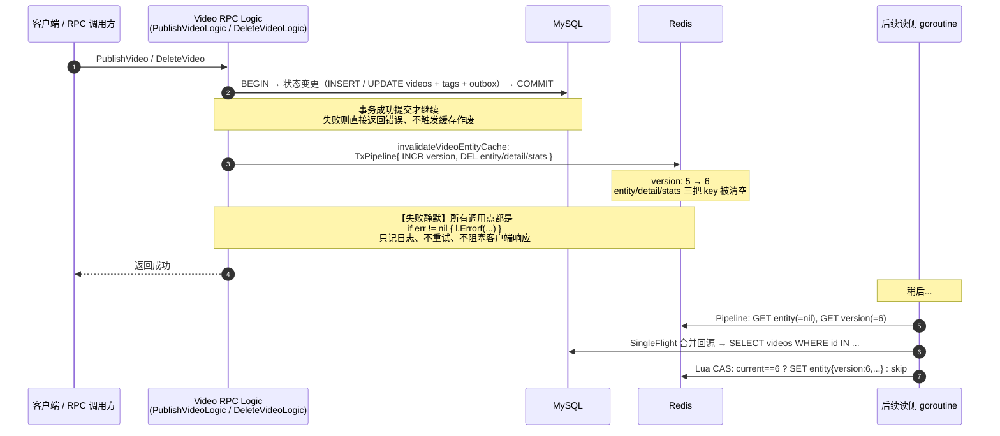

**"失败静默"设计的三重兜底**：

`PublishVideoLogic:257,293` 和 `DeleteVideoLogic:175` 都是同一种写法——`if err := invalidateVideoEntityCache(...); err != nil { l.Errorf(...) }`——**只打日志、不返回错误给客户端**。这在别处看起来像是"偷懒"、但在这里是**刻意的架构设计**、因为缓存作废失败不影响正确性：

| 兜底层 | 保护什么 | 具体机制 |
|---|---|---|
| **① 版本号本身是幂等的** | 即使这次 `INCR` 失败、下一次任何写操作（发布/删除/关注/取关）成功执行 `INCR` 都能修复 —— 版本号只单调递增、不需要精确对应每个业务事件 | Redis `INCR` 命令语义天然幂等（对不存在的 key = 从 0 递增到 1） |
| **② 缓存 TTL 到期自然一致** | 即使 `INCR + DEL` 完全失败、Redis 里留着旧 `entity`（v=5）+ 旧 version（=5）——**最坏后果只是持续读到 v=5 直到 TTL 过期**（`VideoEntityCacheTTL=10min + videoID%300s` 抖动） | `entity` key 有 10min ± 5min TTL、`Missing` 有 30s TTL |
| **③ Redis 全挂时降级** | 若 Redis 直接不可用、读侧的 `redisCli.Ping` 会失败、`cacheAvailable=false`——**所有读请求跳过缓存直接查 MySQL**、写侧的 `INCR + DEL` 无处可写但也不影响 DB 主流程 | `loadVideoEntitiesFromCache` 开头就检查 `cacheAvailable`、`cacheVideoEntityMisses` 里所有 Redis 错误只记日志 |

**这就是版本化缓存"轻量、鲁棒、自愈"的关键——把缓存视为"可以随时全丢"的加速层、任何单点失败都能通过 TTL 或下次写入自愈。**

**统一视角：一句话总结**

**Account 和 Video 两个模块用完全不同的落地形态实现了完全相同的一致性契约**：

- **相同点**：① 读侧永不写脏数据（回填前二次校验版本、不匹配即放弃写入）；② 版本号只由写侧 `INCR` 单调递增（读侧永远只 GET）；③ 发布/删除类事件在 MySQL 事务提交后作废对应缓存；④ 短暂窗口内可能读到过时数据、但绝不会读到"版本不一致的混合数据"；⑤ Redis 全挂时统一走 DB 降级、TTL 到期自然一致；⑥ 缓存作废失败仅记日志不重试、依靠版本号幂等和 TTL 兜底自愈。
- **不同点**：Account 侧重**读多写极少**（用户资料几周才改一次）+ 对一致性要求较高（改完立刻可见），所以选**多版本 Key 短暂共存 + 两段 Pipeline 二次校验**——用旧 Key 的临时内存和一次多余 Pipeline 换严格一致；Video 侧重**读多写较多**（点赞/评论/发布/删除都要 bump version）+ 允许毫秒最终一致，所以选**单版本 Key 覆盖 + Lua CAS 原子回写**——用写侧 Lua 复杂度和一次可能的脏窗口换低内存和一半的读侧 RTT。**没有优劣，只是场景匹配。**

**这两套方案共同构成了 [[memory:9l16e7mx]] 项目"版本号 + 惰性重算方案 B"的完整实践模板**——后续任何需要"高读并发、允许最终一致"的模块（如 `notification` 未读数走的也是这条路）都可以按需选择"Account 型"或"Video 型"的落地形态、无需重新设计一致性协议。

---

### 8.3 Interaction 互动模块

**职责**：点赞、评论、点赞状态查询、批量计数。

**核心 RPC**：

| Rpc | 说明 |
|---|---|
| `LikeVideo` / `UnlikeVideo` | 事务：INSERT/UPDATE likes + INSERT outbox_events(like.created/deleted) |
| `PublishComment` | `(user_id, request_id)` 幂等；事务写 comments + outbox |
| `DeleteComment` | 软删除，事务写 outbox |
| `ListComments` | 游标分页（`created_at DESC, id DESC`） |
| `BatchGetVideoStats` | Feed 卡片拉齐 likes_count / is_liked / comments_count |

**点赞数读侧公式（前端看到的是什么）**：

所有返回给前端的 `likes_count`（点赞、取消点赞、批量查询、详情）都走同一个函数 `realtimeLikesCount`：

```
likes_count = MySQL videos.likes_count（基准值） + HGET fsz:video:like_delta {video_id}（Redis 未落库增量）
```

即**基准值 + 全局实时增量**，`pending / acked / pending_count` 不直接参与读侧求和，作用是让 Redis 里的 `like_delta` 无论乱序 / 重试都最终等于“已在 Redis 记账、还没被 MySQL 聚合走”的净增量。

**⚠️ 前端点完赞返回的是"当前视频总点赞数"，不是"旧值 + 1"**。举例：

| 时刻 | 事件 | DB 基准 | Redis delta | 请求返回 likes_count |
|---|---|---|---|---|
| t0 | 初始 | 100 | 0 | — |
| t1 | 用户 A 点赞（同一秒无其他人操作） | 100 | 1 | **101** |
| t2 | 同一瞬间 B、C 也点了赞（A 请求还没返回） | 100 | 3 | A 返回 **103** |
| t3 | A 刷新详情页（BatchGetVideoStats） | 100 | 3 | **103** |
| t4 | interaction_sync 把这批 event 聚合落库 | 103 | 0 | **103** |

这样做的原因：
- 如果只做"前端本地 +1"，A 看到 101，下次刷新突然跳到 103，会出现**闪跳/回退**；
- 直接返回全局实时值，虽然可能一次跳过 +1（因为同时有其他互动），但它和后续详情/列表接口使用同一套“基准 + delta”公式，不会因切换接口而重复加算。

**兜底**：若 MySQL 事务已提交但 Redis 写 delta 失败（Redis 抖动），走 `fallbackLikesCount = 提交前读到的值 + 1`，保证**永远不会返回一个比操作前更小的数字**（见 `LikeVideo` 第 120、244 行）。

**点赞/取消点赞写路径（eventID 驱动的 pending/ack 双标记）**：

1. RPC 事务：INSERT/UPDATE `likes` + INSERT `outbox_events(like.created/deleted)` + 生成 `eventID`。
2. 事务提交后，调用 `applyRedisLikeState(eventID, ...)`：
   - Lua 脚本 `applyInteractionDeltaScript` 一次性 SET `fsz:interaction:delta:pending:{eventID} NX EX`；若已存在 pending / ack 则跳过（自然幂等）。
   - 同一个 Lua 内 HINCRBY `video.like_delta / comment_delta / popularity_delta`，并 DEL `VideoStatsCacheKey`。
3. Kafka Consumer 按 `topic+partition` 分组，组内保序、组间最多 4 个 worker 并发；默认每 500 条调用一次 Flush RPC。
4. `FlushLikeEvents` / `FlushCommentEvents` 把一个 RPC 批次放进同一个 MySQL 事务：
   - 按 `event_id` 排序写 `processed_events`，唯一键保证 at-least-once 消费幂等；
   - 只累计首次插入的事件，按 `video_id` 合并净增量；
   - 按 `video_id` 升序更新 `videos`，减少多事务锁序反转和死锁；
   - 视频已经删除时仍提交 `processed_events`，避免无意义历史消息永久重试。
5. MySQL COMMIT 后按 eventID 批量 ack Redis：
   - Lua 脚本 `acknowledgeInteractionDeltaScript` ：若 ack 已存在→不重复；否则→若 pending 存在则 HINCRBY 回写 delta、DEL pending；SET ack EX、DEL `VideoStatsCacheKey`、INCR `LikeUserVideosListVersionKey` 或 `CommentListVersionKey`。

**Flush 与统计重建的并发关系**：普通在线互动写入和多个 Flush 批次使用 Redis ZSET 共享租约，可以并发执行；`RebuildVideoInteractionStats` 先取得独占重建锁，阻止新租约进入，再等待已有租约排空后重建。这样既消除了旧版 Flush 全局串行锁，又避免重建快照覆盖并发增量。

**为什么需要 pending/ack**？旧方案采用 “Job 参照 processed_events 判算重复，只对首次成功事件 ‘减回’ Redis delta”，一旦遇到 “DB 提交了但 Redis 减回失败” 的小概率中断窗口，重试时会因 processed_events 已存在而直接跳过 Redis，造成 delta 永久多算。pending/ack 双标记把“写进实时增量”与“确认实时增量已入库”拆成两步，无论在线请求与 Consumer 谁先 谁后、重试多少次，都能在 Lua 层自然幂等。

**pending/ack 双标记时序（三场景对照）**：

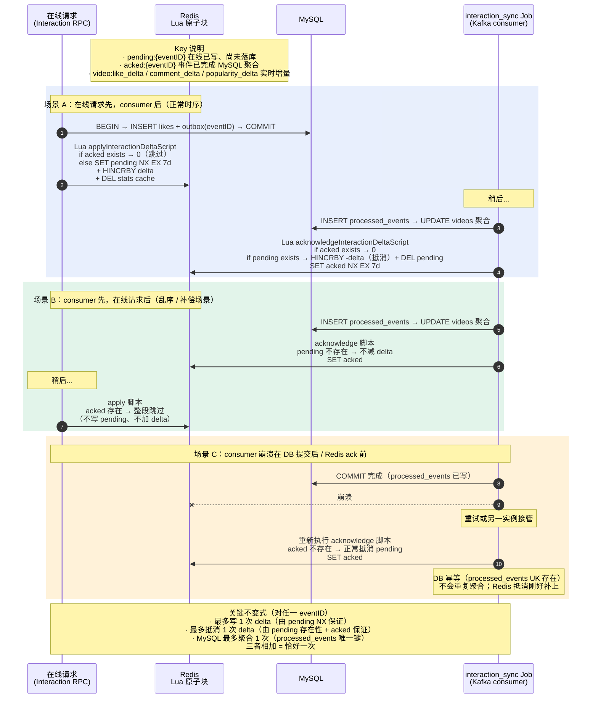

**点赞流程**：

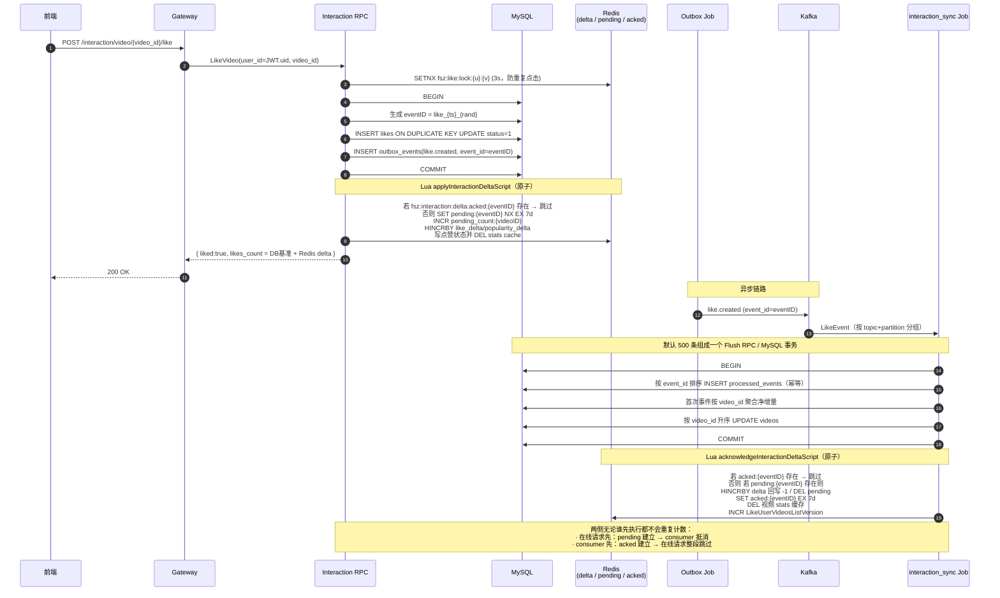

#### 8.3.1 点赞抗压分析：削峰、批量聚合与可持续吞吐

朴素方案在每次点赞请求中直接更新 `videos.likes_count`，热门视频会形成单行锁热点。当前实现把用户关系事实与派生计数拆开：在线事务只完成 `likes / interaction_events / outbox_events` 等事实写入，Redis 立即维护用户可见增量；Kafka 消费端再批量更新 `videos` 聚合字段。

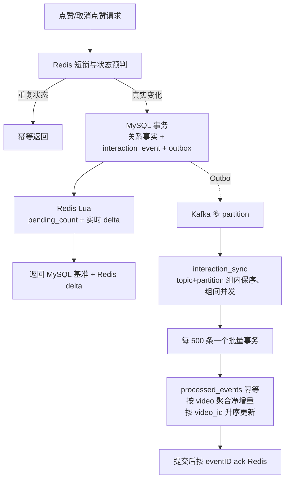

| 层次 | 机制 | 解决的问题 |
|---|---|---|
| 请求入口 | 用户+视频短锁、Redis 状态缓存 | 连点与重复状态不进入 MySQL |
| 在线事务 | 关系事实与 Outbox 同事务 | 不丢事件，避免直接争抢视频计数行 |
| 实时读侧 | MySQL 基准 + Redis 未落库净增量 | Consumer 有延迟时计数仍实时 |
| Kafka | 6 partition、at-least-once | 削峰、重放、横向扩展 |
| Consumer | partition 内保序、最多 4 worker 并发 | 保序与吞吐兼顾 |
| Flush RPC | 500 事件/事务、按视频聚合 | 显著减少事务提交和热点行 UPDATE 次数 |
| 幂等与恢复 | `processed_events` + pending/acked/pending_count | 重复消费与 DB 提交后 Redis ack 中断可恢复 |

**不要宣称“单机已经支持万级 QPS”**。本项目的可信结论来自 §14.6 的本机压测：正式数据集为 10000 用户、5000 视频；点赞场景最终达到约 `260.4 次业务循环/s`，每个循环包含 Like+Unlike 两个写请求，即约 `520.8 HTTP 写请求/s`，并在压测结束约 7 秒后把 Kafka lag 完全排空。该结果证明的是当前单机开发环境下约 500 事件/s 的可持续闭环，而不是生产集群上限。

#### 8.3.2 批量聚合详解：从 N 条点赞事件到 M 条 UPDATE

用户经常担心的问题：**“是不是每一次点赞都要单独 UPDATE 一次 MySQL？”**

答：**不是**。如果真是每点赞都单独 `UPDATE videos SET likes_count = likes_count + 1 WHERE id = ?`，同一个热门视频的所有点赞会串行争抢同一行的 InnoDB 行锁，单行 QPS 上限只有几百，高并发场景直接崩溃。

本项目采用业界标准的 **write-behind + batch aggregation（写回缓存 + 批量聚合）** 方案，将 N 条点赞事件压缩为 M 条 UPDATE（M ≤ 去重后的视频数，通常 M ≪ N），下面把整条数据通路完整讲清楚。

##### 一、整体数据流

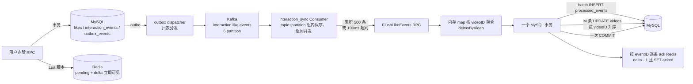

##### 二、关键参数与代码位置

| 参数 / 常量 | 值 | 位置 | 作用 |
|---|---|---|---|
| `FlushMs` | 100 | `apps/interaction/etc/interaction.yaml` | Consumer 累积多久强制 Flush 一次 |
| `maxFlushInteractionEvents` | 500 | `apps/interaction/internal/logic/jobhelper.go` | 单个 RPC 批次最多多少条事件 |
| Kafka partition 数 | 6 | `deploy/kafka/` | Consumer 端并发上限 |
| `deltasByVideo` map | — | `applyInteractionFlushBatch` in `jobhelper.go` | 按 videoID 在内存里合并 delta |
| `sortedVideoStatDeltaIDs` | — | 同上 | UPDATE 前按 videoID 升序，防止死锁 |

##### 三、聚合核心代码（`applyInteractionFlushBatch`）

```go
return db.WithContext(ctx).Transaction(func(tx *gorm.DB) error {
    deltasByVideo := make(map[uint64]videoStatDelta)      // ★ 按 videoID 聚合
    for _, event := range orderedEvents {
        inserted, err := insertProcessedEvent(ctx, tx, event.EventID, ...)
        if err != nil { return err }
        if !inserted { continue }                          // 幂等：已处理过则跳过
        deltasByVideo[event.VideoID] = mergeVideoStatDelta( // ★ 内存合并
            deltasByVideo[event.VideoID], event.Delta)
    }
    for _, videoID := range sortedVideoStatDeltaIDs(deltasByVideo) {
        delta := deltasByVideo[videoID]
        if delta == (videoStatDelta{}) { continue }
        // ★ 每个视频只发一条 UPDATE：likes/comments/popularity 合并到一条
        if err := applyVideoStatDelta(ctx, tx, videoID, delta); err != nil {
            if errors.Is(err, gorm.ErrRecordNotFound) { continue } // 视频已删除也提交 processed_events，防永久重试
            return err
        }
    }
    return nil
})
```

##### 四、对比示例：热门视频 1 秒 1000 次点赞

**❌ 假想的糟糕方案：每条单独 UPDATE**

```text
1000 次 UPDATE videos SET likes_count = likes_count + 1 WHERE id = V1

后果：
- 1000 次网络往返、1000 次事务提交、1000 次 fsync
- 全部串行化在同一行行锁上，单行 QPS 上限 ≈ 几百
- 主从复制延迟激增
```

**✅ 当前实际方案：Consumer 累积 + 内存聚合**

```text
Consumer 累积 100ms 或 500 条事件（先到者触发），假设一批全是 V1：

FlushLikeEvents(batch=500):
  ├─ deltasByVideo[V1] = { LikeDelta: 500, PopularityDelta: 500 }
  └─ 事务内：
       INSERT INTO processed_events VALUES (...500 条 ...) -- batch INSERT
       UPDATE videos SET likes_count      = likes_count      + 500,
                         popularity_score = popularity_score + 500
             WHERE id = V1  ← ★ 只有一条 UPDATE ★
       COMMIT

结果：
- 1 次网络往返、1 次事务提交、1 次 fsync
- 行锁只 acquire 一次，持有时间毫秒级
- 500 条事件的行锁竞争压缩为 1 次
```

##### 五、多视频批次的聚合示例

一批 500 条事件如果覆盖 3 个不同视频：

```text
V1: 300 次点赞
V2: 150 次点赞
V3:  50 次点赞

事务内按 videoID 升序执行：
  UPDATE videos SET likes_count = likes_count + 300 WHERE id = V1
  UPDATE videos SET likes_count = likes_count + 150 WHERE id = V2
  UPDATE videos SET likes_count = likes_count + 50  WHERE id = V3
  COMMIT
```

**为什么必须升序**：任何两个 Consumer worker 同时处理时，都按同一顺序 acquire 行锁，绝不会形成 A 等 B、B 等 A 的循环等待，从根源杜绝死锁。

##### 六、聚合放大倍数与吞吐估算

| 环节 | 单次开销 | 相对原始事件的压缩比 |
|---|---|---|
| 用户点赞 RPC 事务 | MySQL 事务 + 3 次 Redis Lua（O(1)） | 无聚合（1:1） |
| Kafka 消费 | 一次 poll 拉 500 条 | 500:1 |
| MySQL 事务提交 | 1 次 batch INSERT + M 次 UPDATE（M ≤ 视频数） | 视频重复率越高压缩比越大 |
| MySQL 行锁持有时间 | 毫秒级 | 同一热点视频的锁竞争几乎消失 |

**在热点视频场景下，压缩比几乎等于批次里同一视频的重复次数**。爆款视频每秒 10 万点赞，可以被压缩成"每 100ms 一条 UPDATE"，MySQL 完全扛得住。

##### 七、读写分离带来的高并发保护

用户读点赞数的路径**完全不打 MySQL**：

```text
realtimeLikesCount(videoID)
  = MySQL基准值(缓存 VideoStatsCacheKey) + Redis 实时 delta

  ├─ VideoStatsCacheKey 命中 → Redis O(1) 返回
  ├─ VideoStatsCacheKey miss  → 回源 MySQL 一次，再回填缓存
  └─ Redis delta hash HGET    → Redis O(1)
```

**MySQL 写路径**：每秒最多几百次（500 条一批 × 每批几十毫秒事务）。
**Redis 读路径**：每秒可以到数万次（走 §8.3 描述的 `MySQL 基准 + Redis delta` 合成）。

这就是"读写分离 + 写回缓存"的性能保证：**在线路径不打 MySQL，MySQL 只承担最终一致性事实源角色**。

##### 八、这套架构在业界的对应位置

- **抖音**："互动流水异步聚合"
- **B 站 / 微博**："计数器服务 / stat 服务"
- **通用名称**：Write-Behind Caching + Event Sourcing + Batch Aggregation

**共同特征**（本项目全部具备）：

1. **写入**：先写 Redis（实时可见）+ 事务性事件流水（`outbox_events` → Kafka）
2. **异步聚合**：Consumer 批量拉取事件，按业务主键（`videoID`）内存聚合
3. **批量落库**：一个事务处理 500 条事件，只发 M 条 UPDATE（M = 去重后的视频数）
4. **幂等**：`processed_events` 唯一索引兜底重复消费（同一 event_id + consumer_name 只落一次）
5. **降级**：Redis 挂了回源 MySQL；MySQL 挂了 Consumer 停下来等，Kafka 兜住事件不丢

##### 九、总结要点

- ❌ **不是**每个点赞单独 UPDATE MySQL
- ✅ Kafka Consumer 每 `FlushMs=100` 毫秒或每 `maxFlushInteractionEvents=500` 条触发一次批处理（先到者为准）
- ✅ 一个事务内通过 `deltasByVideo` map **按 videoID 内存聚合**，每个视频只发一条 UPDATE
- ✅ UPDATE 按 **videoID 升序**执行，杜绝多 worker 死锁
- ✅ 事务内先 `INSERT processed_events` 做幂等，冲突则跳过对应 delta，防止重复消费
- ✅ 读路径走 Redis（`MySQL 基准 + Redis delta`），MySQL 仅承担最终一致性事实源
- ✅ 这是业界标准的 write-behind + batch aggregation，热门视频的高并发点赞可以被高效吞下

---

### 8.4 Social 社交模块

**职责**：关注关系、粉丝/关注列表、粉丝数维护、大 V 升级。

**核心 RPC**：

| Rpc | 说明 |
|---|---|
| `Follow` | 事务：`INSERT follows ON DUPLICATE KEY UPDATE` + accounts 双向计数 +1 + **大 V 升级判定** + 双 outbox 事件（业务 + 通知） |
| `Unfollow` | 事务：软删 follows + accounts 双向计数 -1（GREATEST 防负）+ 双 outbox |
| `IsFollowing` | Redis `fsz:social:following:{f}:{t}` |
| `BatchIsFollowing` | 视频列表页批量查关注状态 |
| `ListFollowers` / `ListFollowings` | 首页 Redis 缓存 + 构建锁 + 分页兜底 MySQL |

**Follow 关键事务**（包含防死锁双侧行锁）：

为防止 A↔B 同时互相关注时两个事务分别先锁对方行形成锁序反转，事务开始先按 `MIN(followerID, followingID)` → `MAX(followerID, followingID)` 顺序对 accounts 表双行 `SELECT FOR UPDATE`（见 `lockFollowAccounts`），再读写 follows / 计数字段。

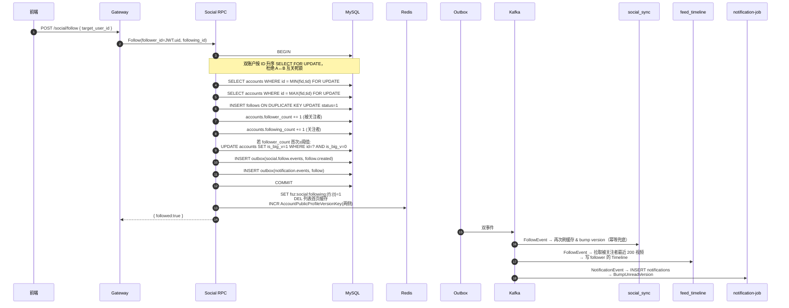

**大 V 判定详解**：见 [8.6 Feed 推拉分离](#86-feed-推拉分离模块)。

#### 8.4.1 设计取舍与并发保护

**为什么 accounts 双行 `FOR UPDATE` 要按 ID 升序？**

经典死锁场景：A 关注 B 的同时 B 关注 A：
- 事务 X（A→B）：先锁 A 行，再锁 B 行
- 事务 Y（B→A）：先锁 B 行，再锁 A 行
- 两个事务互等对方持有的锁 → **死锁**

`lockFollowAccounts` 强制按 `MIN(followerID, followingID) → MAX(...)` 顺序上锁，任何两个并发事务的加锁序列都相同，从根本上消除锁序反转。

**为什么 `is_big_v` 是"只升不降"的标志位，而不是按实时 follower_count 判断？**

如果按实时粉丝数判断大 V：
- 大 V 掉粉一瞬间被判为小 V → feed_timeline 会把他的新视频**写扩散到所有粉丝 inbox**
- 粉丝一多，一次写扩散几百万条 ZADD → **瞬间打爆 Redis**
- 而且此时如果他又涨粉回到大 V，历史视频依然留在粉丝 inbox 里，读侧再去 outbox 合并会**重复出现**

采用 `WHERE is_big_v=0 → SET is_big_v=1` 的幂等升级，且**永不回退**，从根源消除"抖动型写扩散"。

**为什么 Follow 事务里同时写"业务 outbox"+"通知 outbox"？**

同一次 Follow 触发的下游包括：
- 关注关系缓存 `social_sync`
- 关注流写扩散 `feed_timeline`
- 关注通知落库 `notification`

如果只发一条通用事件让所有消费者共享，每个消费者都要判断"这条事件跟我有没有关系"，**耦合度高、演进困难**。

拆成两条 outbox 之后：
- `social.follow.events` → social_sync + feed_timeline 消费（业务事件）
- `notification.events` → notification-job 消费（通知事件）
- 两条 outbox 都在**同一个 MySQL 事务里**写入，天然一致

**Follow 抗压分析**：

| 环节 | 是否是瓶颈 | 说明 |
|---|---|---|
| accounts 双行 FOR UPDATE | ⚠️ **关注同一大 V 时会抢同一被关注者行** | 头部大 V（千万粉级）新增关注每秒上百可能会有排队，但 MySQL 行锁的等待/唤醒非常快，通常不构成问题 |
| follows INSERT ON DUPLICATE KEY | 不是 | 唯一键 `(follower, following)` 每对都不同 |
| outbox_events INSERT × 2 | 不是 | 自增主键 |
| 双向 profile 版本号 INCR | 不是 | Redis 原子操作 |

**为什么 ListFollowers/ListFollowings 首页缓存需要构建锁？**

粉丝/关注列表首页缓存 miss 时要 `SELECT` 拉一批（几百条）+ 组装 JSON，如果一位大 V 首页缓存刚失效，几百个粉丝同时刷新会**并发触发几百次 MySQL 查询** → 缓存击穿。

`fsz:social:followers:build_lock:{user}` SETNX 5s 保证同一时刻**只有一个请求去回源 MySQL**，其他请求短暂等待并重读缓存。

#### 8.4.2 Follow/Unfollow 事务级死锁重试与预检移除

即便 accounts 双行 `FOR UPDATE` 已经消除了一部分锁序反转风险，在正式规模压测时仍发现 InnoDB 会在多个并发关注同一大 V 时偶发 1213 死锁（例如两个事务同时碰 outbox 自增主键末页上的插入意向锁）。针对这一点：

- `runSocialWriteTransaction`（见 `apps/social/internal/logic/socialhelper.go`）将整个 Follow/Unfollow 事务包裹在重试循环里，仅对 `mysql.MySQLError.Number` 为 `1213 / 1205` 的错误进行有限重试，其余错误（包括唯一键、外键、业务参数错误）直接向上抛。
- 默认重试 3 次（`socialDBMaxRetries`），退避基准 20ms，封顶 200ms，**附加最多 50% 拖抽**（`socialDBRetryDelay`），避免同一批被回滚事务同时重试再次同步争锁。
- **重试安全前提**：事务体内部的局部变量（如 `now`、`stateChanged`）在每一轮重试开头重新赋值，**不使用上一轮已回滚的局部状态**。写入 accounts 双向计数、follows、业务 outbox、通知 outbox 的全部上下文都在同一事务内重新构造，保证重试不会遗留半状态。

**同时移除了两个不必要的预检锁**：

- 旧实现在事务中先调 `AccountRpc.GetProfile` 预检目标用户是否存在，既多一次 RPC 往返，又在事务完成前可能造成长时间持锁。当前实现已删除预检，直接在 INSERT 命中外键/唯一键错误时把错误归一到 `codes.NotFound`。
- 旧实现一开始就 `SELECT ... FOR UPDATE` 拉 follows 行，对不存在的唯一键会产生 **gap lock**，后续 `INSERT` 又升级为插入意向锁，导致高并发下频发 1213。当前实现改为**普通 `Take`**（不加锁）预读已存在关系，依靠 accounts 双行 FOR UPDATE 充当构件互斥。若不存在，使用 `INSERT ... ON DUPLICATE KEY DO NOTHING`，并在并发冲突的反馈（`RowsAffected == 0`）后才回读加锁处理。

**关于“目标用户不存在”的错误反馈**：尽管写事务不再预检 `GetProfile`，Follow 接口末端仍然能识别目标不存在——INSERT 时会命中 follows 表的外键约束（`follows.following_id → accounts.id`）而直接报错，`Follow` 把它归一为 `codes.NotFound` “目标用户不存在”返回给上游。

---

### 8.5 Notification 通知模块

**职责**：接收 `notification.events`（关注/点赞/评论触发），维护 `notifications` 表，提供未读数 & 通知列表。

**核心 RPC**（`apps/notification/internal/logic/`）：

| Rpc | 说明 |
|---|---|
| `ListNotifications` | `(occurred_at DESC, id DESC)` 复合游标分页；`receiver_id` 兜底校验 |
| `GetUnreadCount` | 走 `notificationcache.LoadUnreadCount` 版本号缓存，miss 时 `SELECT COUNT(*) WHERE status=1`，Redis 挂了直接回源 |
| `MarkNotificationRead` | UPDATE 单条为已读；`rowsAffected>0` 时 `BumpUnreadVersion` |
| `MarkAllNotificationsRead` | 批量 UPDATE 所有未读为已读；`changed>0` 时 `BumpUnreadVersion` |

**未读数缓存（版本号 + 惰性重算）**：

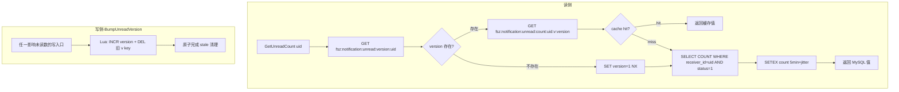

**Notification Job 6 种情况判定**：

Job 消费 `notification.events` 时，需要精确判断"这次事件是否真的影响未读数"，只在影响时 `BumpUnreadVersion`：

| # | 场景 | MySQL 动作 | 未读数变化 | bump? |
|---|---|---|---|---|
| 1 | 全新通知 (business_key 不存在) + create | INSERT (status=1) | +1 | ✅ |
| 2 | 已撤回通知 (status=3) + create（复活） | UPDATE 3→1 | +1 | ✅ |
| 3 | 旧事件（OccurredAt < 现有 record） | 什么都不做 | 不变 | ❌ |
| 4 | 未读通知 + delete | UPDATE 1→3 | -1 | ✅ |
| 5 | 已读通知 + delete | UPDATE 2→3 | 不变 | ❌ |
| 6 | 已撤回通知 + 重复 delete | UPDATE 3→3 (无变化) | 不变 | ❌ |

`applyNotificationEvent` 返回 `bumpReceiverID uint64`（0 表示不需要 bump），事务 COMMIT 成功后再统一调 `BumpUnreadVersion`。

**通知流程**：

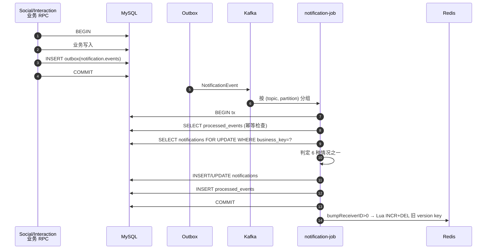

#### 8.5.1 设计取舍：为什么用"版本号 + 惰性重算"？

最直觉的做法是 **"读一次 → SETEX 缓存，写一次 → DEL 缓存"**，但它有三个问题——本项目正是为了绕开这三个问题才最终选择"版本号 + 惰性重算"：

- 问题 1：**并发写导致缓存穿透** —— 大量写事件同时 DEL 后，读会集中回源到 MySQL COUNT
- 问题 2：**缓存与 MySQL 之间的不一致窗口** —— DEL 之后、下一次读回填之前，会短暂读到旧值
- 问题 3：**Redis 宕机重启后所有缓存丢失** —— 大量用户同时 miss → 打爆 MySQL

**本项目采用的做法（版本号 + 惰性重算）如何解决这三个问题**：

- 写路径不 DEL 缓存，只 **INCR version + 一次性 DEL 旧版本 key**（Lua 原子）
- 读路径 `GET version → GET count:v:{version}` 组合 key，miss 时 SELECT COUNT
- **Redis 挂了**：`LoadUnreadCount` 直接降级 `SELECT COUNT WHERE status=1`，业务不中断
- **写扩散**：只写一个 version key，一次 INCR 是原子的，即使 1000 个并发 bump 也只是最后 version 变化，**不会产生缓存击穿**

**核心不变式**：
- 任一次 `MarkRead` / `INSERT notifications` 之后，version 必然递增
- 下一次读用最新 version 组合 key，一定是 miss → **强制回源** MySQL，读到最新值
- 旧 version 的 count key 用 5 分钟 TTL + Lua DEL 兜底，不会长期占内存

**bump 时机的自愈机制（`attemptBumpReceivers` 每轮独立）**：

`notification-job` 的事务体 `applyNotificationEvent` 会返回本条事件是否需要 bump 未读版本号。在 `apps/job/notification/internal/logic/consumer.go` 中，事务重试循环为**每一次尝试都新建一个 `attemptBumpReceivers` 局部集合**：

```
for attempt := 0; ; attempt++ {
    attemptBumpReceivers := make(map[uint64]struct{})
    txErr := c.svcCtx.GormDB.Transaction(func(tx *gorm.DB) error {
        // ...accumulate bumpReceiverID into attemptBumpReceivers...
    })
    if txErr == nil { bumpReceivers = attemptBumpReceivers; break }
    if !isRetryableNotificationDBError(txErr) { return txErr }
    ...
}
```

这样即使前一轮事务因 1213/1205 被完整回滚，也**不会**把已回滚事务里收集的 receiver 带到后续成功提交后去 bump——避免“数据库回滚了但未读版本号却乱 bump”的脏数据。`isRetryableNotificationDBError` 只对 MySQL 1213（死锁）/ 1205（锁等待超时）返回 true，其他错误直接上抛不重试，避免把约束错误伪装成瞬时故障。

**重试参数可配置**（`Notification.DBMaxRetries / DBRetryBaseMs / DBRetryMaxMs`，默认 3/20/200 ms，上限 8），重试间隔指数退避 + 抵抗0.5 倍拖抽（`c.dbRetryDelay`），避免同一批被回滚事务同时重试再次撞锁。

#### 8.5.2 为什么 6 种情况的 bump 判定要精确？

如果无脑 bump（不管事件是否真影响未读数），会导致：
- 幂等重放的旧事件 → 缓存 miss → 触发 SELECT COUNT → **性能浪费**
- "已撤回通知的重复 delete"这种无效事件也 bump → 频繁失效缓存

`applyNotificationEvent` 返回 `bumpReceiverID uint64`（0 表示不 bump），配合 6 种情况精确判定，只在**真的可能影响 status=1 计数**时才 INCR version，最大化缓存命中率。

**为什么 `BumpUnreadVersion` 在事务 COMMIT 后调用而不是事务内？**

- **在事务内调用 Redis 违反了"事务边界内不应有外部副作用"** —— 事务回滚时 Redis 已经改了，回不去
- **事务 COMMIT 失败** → 事件会重试 → 重试成功时才 bump，Redis 状态和 MySQL 一致
- **Redis bump 失败** → 只 log 不重试；下一次读会因为**版本号不匹配（读到的还是旧版本 key）** miss 回源，天然自愈

---

### 8.6 Feed 推拉分离模块

**职责**：关注流（GetFollowingFeed）、热榜（GetHotFeed）、推荐流（GetRecommendFeed）。

Feed RPC **只返回 video_id 和排序信息**，具体视频详情、作者昵称、点赞数由 Gateway 分别通过三个 Batch 接口聚合，避免 Feed 服务越权访问其他领域数据。

#### 8.6.1 推拉分离核心思想

|  | 小 V (is_big_v=0) | 大 V (is_big_v=1) |
|---|---|---|
| 写路径 | 发视频时 fanout 到所有粉丝的 inbox ZSet | 只写自己的 author outbox ZSet |
| 读路径 | 直接读 inbox | 拉取关注列表中的大 V outbox 合并 |
| 优点 | 读快 | 写快，不放大 |
| 缺点 | 写放大 | 读时多几次 ZRANGE |

**大 V 判定采用 `is_big_v` 标志位而非实时 `follower_count`**：

- 一旦升为大 V 就永久保留（`WHERE is_big_v=0` 幂等升级）。
- 避免大 V 掉粉后再涨粉的"反向穿越"：如果按粉丝数实时判定，掉粉那一瞬间历史视频从粉丝的 inbox 里 fanout 走了，反向穿越时再涨回来也拿不回来。

#### 8.6.2 GetFollowingFeed 流程

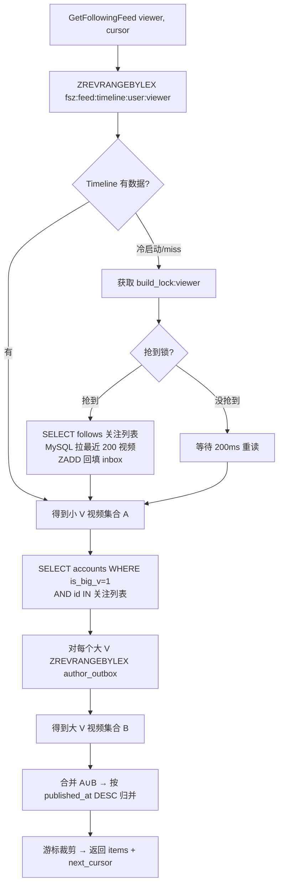

#### 8.6.3 feed_timeline Job 事件驱动

- **video.published**：查作者 `is_big_v`。小 V → fanout 到所有活跃粉丝 inbox；大 V → 只 ZADD 作者 outbox。
- **video.deleted**：从相应 ZSet 中移除（回读 MySQL 事实状态兜底）。
- **follow.created**：拉取被关注者最近 200 视频，写 follower inbox（如果被关注者是大 V，跳过，直接依赖读侧合并 outbox）。
- **follow.deleted**：从 follower inbox 中移除被关注者的所有视频。

**Global Timeline ready 禁不可丢**：全局最新流 ZSet `fsz:feed:global_timeline` 需要配套一个 `ready` 标记才可以接受写入，防止尚未初始化时写了一半的数据。一旦指标丢失（例如 Redis flush），writer 会返回 `errGlobalTimelineNotReady`；旧方案靠 Kafka 无限重试无人恢复。新方案：**consumer 层捕获该错误后调用 `BootstrapGlobalTimeline`（带分布式锁）完成一次重建，再重试当前事件**，避免 Kafka 原地重试风暴。

**Timeline 冷启动保护**：
- `fsz:feed:timeline:build_lock:{viewer}` 5-10s 锁，避免同一用户多个请求并发触发 MySQL 全量回填。
- `fsz:feed:timeline:user:{viewer}` 使用 `EXPIRE 7d`，长期不活跃用户自动淘汰。
#### 8.6.4 Timeline ZSet 编码

来自 `common/feedx/timeline.go`：

- 所有元素 `score=0`，实际顺序由 member 字典序决定。
- Member 格式：`{publishedAt:19位}:{videoID:20位}`，前 0 补齐，保证 lex 排序等价于数值排序。
- 使用 `ZREVRANGEBYLEX` 分页，游标格式 `(member` 实现排他上界，无重复无遗漏。

#### 8.6.5 设计取舍与抗压分析

**为什么用推拉分离而不是纯推 / 纯拉？**

| 方案 | 写路径 | 读路径 | 致命缺陷 |
|---|---|---|---|
| **纯推（写扩散）** | 发视频 → 写到所有粉丝 inbox | 直接 ZREVRANGE | 大 V 一次写扩散上千万条 ZADD → **打爆 Redis** |
| **纯拉（读扩散）** | 发视频 → 只写作者 outbox | 拉关注列表 N 个 outbox 归并 | 关注了几千人的用户每次拉 Feed 都要拉几千个 ZSet → **读放大灾难** |
| **推拉分离**（当前） | 小 V 写扩散 / 大 V 只写自己 outbox | inbox（小 V 已扇入）+ 关注的大 V outbox 合并 | 兼顾读写，大 V 数量有限 → 读侧合并可控 |

**读侧成本估算**：假设用户关注 500 人，其中大 V 20 人（`is_big_v=1`）：
- 480 个小 V 的最近视频**已经在 inbox**里（feed_timeline 写扩散过） → 1 次 ZREVRANGEBYLEX
- 20 个大 V 分别拉 outbox → 20 次 ZREVRANGEBYLEX（可以 pipeline 并发）
- 合并归并 → O(K log K)，K 是 pagesize 200

**写侧成本估算**：
- 小 V 发视频（假设 1000 粉丝）→ 1000 次 ZADD，几十毫秒，可接受
- 大 V 发视频（假设 100 万粉丝）→ **1 次 ZADD**（只写自己 outbox） → 常数时间

**Timeline 冷启动的三层保护**：

1. **build_lock 分布式锁**：`fsz:feed:timeline:build_lock:{viewer}` SETNX 10s，同一用户多个并发请求只让**一个**去回源 MySQL
2. **7 天 TTL**：不活跃用户的 inbox 自动淘汰，避免亿级用户全量常驻 Redis
3. **懒加载**：冷用户第一次拉 Feed 才触发构建（`SELECT follows` + 拉每个关注对象最近 200 视频）

**Global Timeline ready 自愈**：`fsz:feed:global_timeline` 需要 `ready` 标记才允许写入，防止半初始化状态。旧方案在 `errGlobalTimelineNotReady` 时靠 Kafka 无限重试等人恢复。新方案：consumer 层捕获后调用 `BootstrapGlobalTimeline`（内部分布式锁，避免多实例重复重建）完成一次重建，再重试当前事件，**自愈无人工介入**。

**为什么 feed_timeline job 用回读 MySQL 事实状态而不是靠事件 OccurredAt 排序？**

事件流可能存在：
- Kafka 重试导致乱序（例如先收到 delete 再收到 create）
- 消费者宕机重启后重放（重复处理旧事件）

如果单纯靠 `OccurredAt.Before(existing)` 跳过旧事件，任何一次 ZSet 数据丢失都无法通过重放恢复。改成**每次都回读 MySQL 的 status/is_big_v 事实状态**决定 add/remove，**天然幂等**、天然自愈。代价是每个事件多一次 SELECT，但比数据错乱强得多。

---

### 8.7 HotRank 热榜模块

**职责**：以独立 Consumer Group 直接消费 `interaction.like.events` 和 `interaction.comment.events`，将每条互动按发生时间写入 UTC 单分钟热度窗口；Feed 读侧把最近 N 个窗口按时间衰减合并成稳定分页快照。

**核心机制**：

- 点赞权重为 `3`，评论权重为 `5`；取消点赞/删除评论写入对应负分。
- 每分钟一个 ZSET：`fsz:hot:window:{yyyyMMddHHmm}`，member=videoID，score=该分钟净热度。
- Redis Lua 在同一原子块中写 `ProcessedEventKey(eventID, hotrank)` 与 `ZINCRBY`，Kafka 重放不会重复计分。
- 消息按 `topic+partition` 分组，组内保序、组间默认 4 worker 并发；坏消息进入 `dead_letter_events`。
- 分钟窗口默认保留 2 小时；超过保留期的旧消息只写幂等标记，不复活过期窗口。
- `GetHotFeed` 默认聚合最近 60 个分钟窗口，按 30 分钟半衰期加权，通过临时 ZSET + Lua 校验锁 + `RENAME` 原子发布快照。
- 快照 key 为 `fsz:hot:merge:{asOf}`，`ready` key 即使值为 0 也表示“已成功构建空榜”，避免缓存穿透。

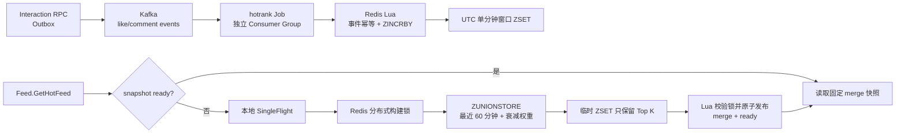

#### 8.7.1 为什么使用分钟窗口 + 固定快照

直接按 `videos.popularity` 全表排序无法表达时间窗口，而且数据量增长后排序成本高。分钟窗口让写入只做一次 `ZINCRBY`，读侧再通过 `ZUNIONSTORE` 合并有限窗口；同一个 `snapshot_at` 只构建一次并缓存 30 分钟，后续分页始终读取同一份榜单，不会因新互动导致翻页重复或遗漏。

缓存命中与冷构建的本机实测见 §14.6：50 并发下，已构建快照约 7503.4 QPS；删除 merge 快照后触发构建约 1428.1 QPS，构建结束 `ready=50` 且 `ZCARD=50`。这说明热榜读性能来自预聚合快照，同时冷启动路径也能正确闭环。

---

### 8.8 Gateway 网关

**职责**：HTTP → gRPC 转换、JWT 鉴权、请求参数校验、**跨模块 Batch 聚合**。

**核心中间件**：

- `TokenAuth`：解析 `Authorization: Bearer <jwt>` → 校验 → 把 `user_id` 放进 `context`。
- `OptionalTokenAuth`：有 token 就解析，没有就放行（用于游客可见的 `/feed/hot`、`/video/{id}` 等接口）。

**聚合层职责**：

Feed / 通知列表 / 评论列表等场景，Gateway logic 层负责：
1. 从 RPC 拿到 ID 列表。
2. 并发调用 `BatchGetVideos` / `BatchGetProfiles` / `BatchGetVideoStats` / `BatchIsFollowing`。
3. 组装成前端友好的 DTO。

**作者昵称/评论作者回填**（commit 687d0ab 强化）：`GetVideo` / `ListUserVideos` / `ListComments` 三个页面另外调用一次 `enrichHTTPVideoAuthors` 或 `loadSocialUserInfoMap`，把 Video / Comment 表内冗余的旧“作者快照用户名”替换为 Account RPC 里的最新昵称；RPC 失败时降级返回快照，保证列表仍可用。

**禁止 N+1**：所有 RPC 的批量接口存在就是为了这一点。

---

## 九、关键异步 Job 详解

### 9.1 Outbox Dispatcher

#### 9.1.0 通俗版：Outbox 到底在做什么？

先抛开代码看**业务问题**。以点赞为例，一次成功的点赞要做两件事：

1. 在 MySQL 的 `likes` 表插入一条记录（这是权威事实）。
2. 通知下游：更新 `videos.likes_count`、刷新 Redis 缓存、给作者发通知、推热榜、进个人页流水……（这些是派生状态）

如果直接在 RPC 里"先写 MySQL 再发 Kafka"，就会出现 4 类不一致：

- MySQL 写成功、Kafka 发失败 → 派生状态永远追不上。
- Kafka 发成功、MySQL 事务回滚 → 下游算了一次不存在的点赞。
- Kafka 发成功、RPC 返回超时给客户端，客户端重试一次 → 下游算了两次。
- 网络抖动导致 Kafka 消息发出去了但业务不知道 → 无法排障。

**Outbox 事务发件箱模式**把"通知下游"变成"往同一个 MySQL 事务里插一行事件"。业务 RPC 只需保证 `likes 表 INSERT` 和 `outbox_events INSERT` 在**同一个本地事务**里成功，事务提交 = 消息一定会被投递（哪怕现在 Kafka 宕机也没关系，事件躺在 MySQL 里等着，稍后重投）。真正把消息发到 Kafka 的活儿，交给一个独立的后台任务 —— 也就是 `outbox-job` 的 `Dispatcher`：

1. **定时轮询**：每 1 秒扫 `outbox_events` 表，捞出到期未投递的事件。
2. **认领**：把这批事件从 `pending` 改成 `processing`，打上"我在处理"的标记。
3. **投递**：把消息 `PublishBatch` 到对应 topic。
4. **回写**：如果 Kafka 确认收到就改成 `sent`；如果失败就 `retry_count+1` 并安排下次重试；重试到上限就转 `dead` 等人工处理。

Outbox Dispatcher 是非阻塞的定时拉取 + 分片并发投递。完整实现在 `apps/job/outbox/internal/logic/dispatcher.go`，涉及三个关键机制：**同业务聚合保序**、**分片并发投递**、**批量回写 lock_token 验证**。

**主循环与并发限制**：

- `Run` 按 `Outbox.PollIntervalMs`（默认 1s）制造 tick；每个 tick 尝试启动一轮 `DispatchOnce`。
- 使用 `inFlight := make(chan struct{}, 1)` 令牌：**同时只会有 1 轮 `DispatchOnce` 运行**，上一轮未完时后续 tick 直接 skip 并记录 warn，避免堆积时无限创建 goroutine。
- 单轮任何失败只记录日志，下一轮自然重试（后台常驻任务不能因一时错误退出）。

**Claim 阶段（`claimDueOutboxEvents`）**：

一个短事务内完成“拉一批 + 标记 processing + 写入 lock_token”：

```sql
-- 当前时间为 now，staleBefore = now - Outbox.ClaimTimeoutSeconds (默认 60s)
SELECT * FROM outbox_events
WHERE (
    (status IN (pending, failed) AND (next_retry_at IS NULL OR next_retry_at <= now))
    OR (status = processing AND locked_at IS NOT NULL AND locked_at <= staleBefore)
) AND NOT EXISTS (
    -- 关键保序约束：同聚合同时仅允许最早一条未完成事件被 claim
    SELECT 1 FROM outbox_events AS predecessor
    WHERE predecessor.aggregate_type = outbox_events.aggregate_type
      AND predecessor.aggregate_id   = outbox_events.aggregate_id
      AND predecessor.id             < outbox_events.id
      AND predecessor.status IN (pending, failed, dead, processing)
)
ORDER BY id ASC LIMIT :batch
FOR UPDATE SKIP LOCKED;
```

紧接着在**同一事务内**把选中行 UPDATE 为 `status=processing, lock_token=<本轮随机 32bit>, locked_by=<实例 ID>, locked_at=now`。

关键设计：

- **`FOR UPDATE SKIP LOCKED`**：多实例并发 claim 时互不阻塞，已被其他实例锁住的行直接跳过。

  > **SKIP LOCKED 到底是什么锁？** 它**不是**一种"新的锁类型"，而是 InnoDB `SELECT ... FOR UPDATE` 语句的一个**修饰符**，控制"遇到已被别人锁住的行时的行为"。
  >
  > 三种可选行为对比（想象 outbox 表里有 100 条待投递事件，两个 dispatcher 实例同时来 claim）：
  >
  > | 修饰符 | 行为 | 用在 outbox 会怎么样 |
  > |---|---|---|
  > | 默认（不加） | 等待前面的锁释放，最多等 `innodb_lock_wait_timeout`（50s） | 实例 B 会阻塞 50 秒直到实例 A 提交，吞吐掉到冰点 |
  > | `NOWAIT` | 立刻报错 `ER_LOCK_NOWAIT` | 实例 B 直接崩，需要业务层重试 |
  > | **`SKIP LOCKED`** | **跳过已锁行，只返回没被锁的行** | 实例 A 拿走前 50 条并锁定，实例 B **一次查询就直接拿到剩下的 50 条**，两边完全并行 |
  >
  > 换句话说，`SKIP LOCKED` = "别人在处理的我不碰，我只拿空闲的"。这正好匹配"多个 dispatcher 实例并发消费队列"这种典型的**任务队列**场景：MySQL 从 8.0 开始原生支持，配合 `SELECT ... FOR UPDATE SKIP LOCKED` 可以把关系表当轻量级消息队列用，不需要引入 Redis Stream 或专门的 MQ 就能做到多实例安全并发。
  >
  > 此外，为什么 outbox 需要 FOR UPDATE 加锁而不是普通 SELECT？—— 因为紧接着还要在**同一事务里** UPDATE 这批行的 `status/lock_token/locked_by`；如果不加锁，另一个实例可能在中间也 SELECT 到同一批行然后一起 UPDATE，就会出现两个实例都以为自己"独占"了这批消息，从而重复投递。加了 `FOR UPDATE`，行级 X 锁会一直持有到事务提交，其他事务想读同一行时只能选择等待或 `SKIP LOCKED` 跳过。

- **`NOT EXISTS` 前序子句**：同一 aggregate 必须等前序事件 `sent` 之后才能进入下一轮 claim，"同一视频先删后投递 create"、"同一用户先 unlike 后投递 like" 这类反序从根源不会发生。`dead` 事件也会阻塞后续，强迫人工补偿，不静默跨过。
- **专用索引 `idx_aggregate_status_id(aggregate_type, aggregate_id, status, id)`**（`016_outbox_aggregate_status_index.sql`）让 NOT EXISTS 只扫四种未完成状态，不会回扫同聚合已 sent 的历史事件。
- **本轮 `lock_token`**：同一批 claim 共享一个随机 token，后续投递失败 / 成功回写时都带 `WHERE id IN ... AND status = processing AND lock_token = :token`，因此“旧实例 claim 了一批 → 卡死→ 新实例 claim 同一批’’ 不会互相覆盖彼此的投递结果。

**Dispatch 阶段（`dispatchClaimedEvents` + `dispatchClaimedBatch`）**：

1. 认领到的一批事件通过 `splitOutboxBatches(events, workerCount)` 均匀分片；worker 上限默认 4（`normalizeOutboxWorkerCount`），上限 32，并且 worker 数不会超过事件总数。
2. **同一批 claim 内同一 aggregate 最多只有 1 条事件**（NOT EXISTS 保证），因此不同分片内部无需保序，可以安全地并发发包。
3. 每个分片一次性构造 `[]kafkax.Message` 调用 `Producer.PublishBatch`，只产生一次 Kafka 同步写往返（避免旧实现里“逐条发送”持续受到 `BatchTimeout` 影响）。消息 Header 携带 `event_id / event_type / aggregate_type / aggregate_id`，供 consumer 直接读取而不必反序列化 payload。

**投递后回写（`markSentBatch` / `markFailed`）—— Kafka Publish 失败会发生什么？**

先看正常路径：

- **全部成功**：一条 UPDATE 把本分片 `id IN (…)` 同时改为 `status=sent, sent_at=now, lock_token=""`，并卡 `WHERE status=processing AND lock_token=:token`；影响行数不等于分片大小会以 `claim_lost` 日志报错（意味着锁超时后被其他实例重抢，无事无失）。事件到此彻底"离开发件箱"。

再看失败路径。发布 Kafka 时可能出现：网络抖动 / broker 拒绝 / 请求超时 / broker 收到但 ack 丢失 / topic partition 不可用……代码统一走 `markFailed`：

1. **`retry_count + 1`**：直接用 `gorm.Expr("retry_count + 1")` 累加，事务外并发场景也不会丢计数。
2. **阶梯退避**：`nextRetryDelay(retryCount)` 走**指数退避**——第一次失败 `RetryBaseMs`（默认 1s），之后每失败一次翻倍，封顶 `RetryMaxMs`（默认 60s）。即 1s → 2s → 4s → 8s → 16s → 32s → 60s → 60s…… 避免瞬时抖动打满 Kafka；退避期间事件 `next_retry_at` 落在未来，`dueOutboxScope` 会自动跳过它。
3. **`last_error` 写入原因**：截断到 1024 rune，防止某些 Kafka 客户端错误消息动辄几 KB 把 `last_error` 撑爆导致 `Row size too large`。这条错误信息可以直接 `SELECT` 出来排障，不需要翻日志。
4. **`status = failed`**：让下一轮 `dueOutboxScope` 依然能扫到它（`status IN (pending, failed)`）。
5. **`lock_token / locked_by / locked_at` 全部清空**：这批 claim 的租约已经释放，任何实例都能重新认领它。
6. **超过 `MaxRetry` → `dead`**：默认最多重试到某个上限（配置项 `MaxRetry`）后，`status` 改为 `dead` 且 `next_retry_at=NULL`。**dead 事件不会再被自动重试**，需要人工干预（改代码修复 bug、清理坏数据、手动改回 `pending` 让它重投）——这是**故意的设计**，避免"坏事件"无限占用 Dispatcher 资源，同时因为 §9.1 里 `NOT EXISTS` 子查询把 `dead` 也算作"前序未完成"，它会**阻塞同一 aggregate 的后续事件**，逼迫运维必须处理，绝不静默跨越。

一个容易被忽略的边界：**Kafka 已经收到消息，但 DB 回写失败**（比如网络分区、DB 短暂 unavailable）。这时事件仍是 `processing`，`locked_at` 超时后会被下一轮 `dueOutboxScope` 重新捞出——**会导致同一条消息被投递第二次**。这不是 bug，而是 Outbox 模式的**天然属性**：at-least-once。因此下游 consumer **必须**用 `processed_events` 做业务幂等，见下面 §9.1.5。

**可观测性与配置**（`OutboxConf`）：`PollIntervalMs / BatchSize (上限 500) / WorkerCount (上限 32) / MaxRetry / RetryBaseMs / RetryMaxMs / PublishTimeoutMs / EventTimeoutMs / ClaimTimeoutSeconds`，均在 `dispatcher.go` 有默认值归一化。运维排障最常用的 SQL：

```sql
-- 卡在 pending/failed 太久的事件（可能上游一直失败）
SELECT id, topic, event_type, retry_count, last_error, next_retry_at
FROM outbox_events
WHERE status IN (1, 2)  -- pending, failed
  AND created_at < NOW() - INTERVAL 5 MINUTE
ORDER BY id ASC LIMIT 50;

-- 已经进入死信、等人工处理的事件
SELECT id, topic, event_type, aggregate_type, aggregate_id, retry_count, last_error, updated_at
FROM outbox_events WHERE status = 4  -- dead
ORDER BY updated_at DESC LIMIT 50;

-- 修复完 bug 后把 dead 事件复活重投
UPDATE outbox_events
SET status = 1, retry_count = 0, next_retry_at = NULL, last_error = ''
WHERE id IN (:id_list);
```

#### 9.1.1 三层并发单位模型：集群 / 进程 / 单轮

Outbox Dispatcher 在生产环境里其实存在**三层不同粒度的并发**，理解它们的边界是读懂 `dispatcher.go` 的前提：

```text
Kubernetes 集群
  ├─ 实例 A (Pod / 进程)          ← 第 ① 层：多实例
  │    └─ Run 主循环
  │         └─ inFlight(cap=1)     ← 第 ② 层：进程内串行
  │              └─ DispatchOnce
  │                   └─ worker × N ← 第 ③ 层：单轮内并发发 Kafka
  ├─ 实例 B ...同上...
  └─ 实例 C ...同上...
```

| 层级 | 并发单位 | 数量控制 | 隔离机制 | 目的 |
|---|---|---|---|---|
| ① 集群层 | dispatcher 实例（Pod） | K8s 副本数 | MySQL `SELECT ... FOR UPDATE SKIP LOCKED` + `lock_token` | 横向扩展 + 高可用；一个实例挂了 60s 后其他实例接管 |
| ② 进程层 | 单进程内的 `DispatchOnce` | `inFlight := make(chan struct{}, 1)`（信号量容量 1） | Go channel + `select default` 非阻塞尝试 | 避免同进程自我惊群、tick 堆积无限起 goroutine |
| ③ 单轮层 | 发 Kafka 的 worker goroutine | `WorkerCount`（默认 4，上限 32） | `splitOutboxBatches` 按 aggregate 分片 | 利用 Kafka Producer 的 IO 并发提升吞吐 |

**为什么第 ② 层限制为 1，第 ③ 层却允许多个？** 因为二者要解决的问题不同：

- 第 ② 层"每个进程同时只跑一轮 DispatchOnce"：如果允许并发 DispatchOnce，两个 DispatchOnce 都会去 `SELECT ... FOR UPDATE SKIP LOCKED` 同一张表，虽然 SKIP LOCKED 不会真的冲突（会跳过对方锁住的行），但空转扫描完全没必要，还会让日志、指标、错误处理复杂化。加上 `inFlight` 容量 1，上一轮没跑完时 tick 直接 skip 记录 warn（"dispatch 跑不动了"），运维一眼能看出问题。
- 第 ③ 层"单轮内多 worker 并发发 Kafka"：Kafka `PublishBatch` 的网络往返有几十毫秒延迟，如果串行发 100 条要几秒钟；用 4~8 个 worker 并发发就把耗时压到 1/N。**并发发不会乱序**，因为同一批 claim 内**每个 aggregate 最多只有 1 条事件**（`NOT EXISTS` 保证），任意分片方式都不会把同 aggregate 的多个事件拆到并发 worker 里。

**为什么第 ① 层允许多实例？** 因为业务量增长时单机 Producer 会成瓶颈，加机器就能线性扩展；同时一台机器崩溃后其他机器 60s 内自动接管它留下的 `processing` 事件（详见 9.1.3），比"只有一个实例、崩了业务就阻塞"要健壮得多。

**"skip" 日志的观测意义**：第 ② 层 skip 日志不是"丢消息"的表现——事件本身还静静躺在表里，下一轮 tick 依然会扫到。它的价值是**金丝雀信号**：一旦看到 skip 频繁出现，就说明 DispatchOnce 跑得比 `PollIntervalMs`（默认 1s）还慢，需要看是不是 Kafka broker 抖动、DB 变慢或者 batch 突然爆增。`time.Ticker` 天然会丢弃积压 tick 不排队，加上 `inFlight` 容量 1，两层防抖同时指向同一理念：**恢复期不惊群、跑不动就报警**。

#### 9.1.2 生命周期同步：`inFlight` 与 `WaitGroup` 的分工

`Run` 主循环里同时用了 `inFlight`（channel）和 `wg`（`sync.WaitGroup`），这两个东西**职责完全不同**：

```go
inFlight := make(chan struct{}, 1)   // 决定"能不能启动"
var wg sync.WaitGroup                // 决定"能不能安全退出"
startDispatch := func() {
    select {
    case inFlight <- struct{}{}:
        wg.Add(1)                    // 只有真的启动 goroutine 才 Add
        go func() {
            defer wg.Done()           // goroutine 结束才 Done
            defer func() { <-inFlight }()   // 释放令牌
            _ = d.DispatchOnce(ctx)
        }()
    default:
        d.Errorf("skip outbox dispatch tick: previous dispatch is still running")
    }
}
for {
    select {
    case <-ctx.Done():
        wg.Wait()                    // 等最后那 1 个 DispatchOnce 收尾
        return ctx.Err()
    case <-ticker.C:
        startDispatch()
    }
}
```

| 组件 | 职责 | 何时增加 | 何时减少 |
|---|---|---|---|
| `inFlight`（cap=1） | 并发限制 —— 同一时刻最多允许 1 个 DispatchOnce | 每次成功启动 goroutine | goroutine 结束时（`defer <-inFlight`） |
| `wg` | 生命周期同步 —— 确保关机时等 goroutine 收尾 | `wg.Add(1)` 与令牌配对 | goroutine 完全结束时 `wg.Done()` |

**为什么最多只有 1 个 goroutine 还需要 `sync.WaitGroup`？** 因为 `DispatchOnce` 是 `go func(){...}()` 派生出的**子 goroutine**，跟 `Run` 主循环不是同一个 goroutine。当 K8s 发 SIGTERM 让 `ctx.Done()` 触发时，如果不 `wg.Wait()`：

1. 主循环立刻 `return ctx.Err()`
2. `Run` 函数返回，上层调用者关闭 GORM 连接池、Kafka Producer
3. 那个 DispatchOnce 子 goroutine 可能正卡在"Kafka 发到一半"或"markSentBatch 回写到一半"，被强杀

后果：
- Kafka 已发但 DB 未回写 → 事件保留 `processing`，60s 后 `staleBefore` 重投（可容忍，靠 consumer 幂等去重）
- DB 连接被拉走一半 → GORM 错误日志刷屏
- 半开状态的 socket 让 Kafka broker 端出现"发了一半的消息"

加上 `wg.Wait()` 后是**优雅关闭**：
1. `ctx.Done()` 触发，主循环停派新一轮
2. `wg.Wait()` 阻塞直到当前那一轮 DispatchOnce 内部所有 `WithContext(ctx)` 调用都返回（Kafka 请求会被 ctx 打断，DB 语句会被 ctx 打断）
3. 该轮 goroutine `defer wg.Done()` 触发，主循环解除阻塞，正常返回 `ctx.Err()` 让上层放心回收连接池

**关键区分**：`inFlight` 管"进程内不允许并发"，`wg` 管"关机时不允许强杀"。哪怕 wg 计数最多只到 1，"等 1 个"和"不等"仍然是**优雅收尾**与**强制中断**的本质区别。同一个进程里另一个 `wg` 是 `dispatchClaimedEvents` 内部的—— 等待 N 个 Kafka worker 全部发完，这两个 wg 变量同名但作用范围截然不同。

#### 9.1.3 X 锁 vs 业务层租约：outbox 里的两种"独占"

这是理解 Outbox 自愈机制的**最容易被混淆点**。`outbox_events` 表里的一行事件实际上被**两种完全独立的"锁"**保护：

| | ① MySQL 行锁（X 锁） | ② 业务层租约 |
|---|---|---|
| 载体 | InnoDB 内存里的锁结构 | 表字段 `status / lock_token / locked_by / locked_at` |
| 加锁时机 | `SELECT ... FOR UPDATE` 语句执行 | UPDATE 写入 `status=processing, lock_token=xxx` |
| 释放时机 | **事务 COMMIT / ROLLBACK 那一瞬间**（几毫秒） | 直到 `markSent` / `markFailed` 改写，或 `locked_at` 超过 `staleBefore` 被其他实例覆盖 |
| 谁能观察到 | 只有 MySQL 自己（通过 `performance_schema.data_locks`） | 任何进程 SELECT 出来都能看到这几个字段值 |
| 谁能绕过 | 别的事务 `SELECT ... FOR UPDATE SKIP LOCKED` 能跳过 | 靠 `dueOutboxScope` 的 WHERE 条件识别与覆盖 |

**时间轴还原**（一条事件从被 claim 到崩溃再到被其他实例接管）：

```text
时间 →

t=0ms     ┌ claim 事务 BEGIN
          │  SELECT ... FOR UPDATE SKIP LOCKED   ← 加 X 锁到 InnoDB 内存
          │  UPDATE status=processing, lock_token=AAA, locked_at=t0
t=5ms     └ COMMIT                                ← X 锁立刻释放！！

          （此后行上没有任何 MySQL 锁保护）

t=5ms     ┌ dispatchClaimedEvents 开始
          │  Kafka PublishBatch 中……
          │  💥 t=200ms 时进程 A 崩溃 / 断网 / 卡死
          │  行的字段值凝固在：status=processing, lock_token=AAA, locked_at=t0

t=60s     ┌ 实例 B tick，跑 claimDueOutboxEvents
          │  now = t0+60s, staleBefore = t0
          │  dueOutboxScope 第 2 个 OR 分支命中：
          │    status=processing AND locked_at <= staleBefore
          │  B 直接对这一行加 X 锁（此时没别人锁着，SKIP LOCKED 无需跳）
          │  UPDATE lock_token=BBB, locked_at=t0+60s
          └ COMMIT
```

**核心事实**：从 t=5ms 到 t=60s 这**整整一分钟**里，事件行**根本没有任何 MySQL 行锁**在保护。X 锁只在 claim 事务的几毫秒里存在，事务 COMMIT 后立刻消失。保护"这批事件不被其他实例乱抢"的，是 `dueOutboxScope` 里的 WHERE 条件 —— 只要 `status=processing` 且 `locked_at > staleBefore`（还在租约期内），别的实例的 `SELECT` 就压根不会把它选出来。

**`lock_token` 到底防谁？** 它防的是"A 崩而未死"的诡异中间态。假设：

```text
t=0s     A claim 事件 42 → lock_token=AAA, locked_at=0s
t=1s     A 发 Kafka 卡住（网络卡顿，但进程没死）
t=60s    B 发现 locked_at 过期，抢过来 → lock_token=BBB, locked_at=60s
t=61s    B 发 Kafka 成功，markSent：
         UPDATE ... SET status=sent
                    WHERE id=42 AND status=processing AND lock_token='BBB'
         → RowsAffected=1 ✅
t=62s    A 突然恢复了（网络通了、GC 停顿结束了）
         A 以为自己还持有事件 42，尝试 markSent：
         UPDATE ... SET status=sent
                    WHERE id=42 AND status=processing AND lock_token='AAA'
         → RowsAffected=0（status 已经是 sent，lock_token 也变了）
         → A 日志打 "claim_lost"，放弃这条事件，不覆写 B 的成果
```

`lock_token` **不是锁，是"防伪印章"**：A 手里的章号 AAA，B 手里的 BBB，事件表里现在盖着 BBB 的章。A 想在事件上盖章，SQL WHERE 会说"这里已经不是你的章了"，A 就放弃。有了 `lock_token`，"实例 A 卡死复活 + 实例 B 已经接管"这种中间态里 A 绝不会覆写 B 的正确结果。

**术语澄清**：outbox 里所谓的"独占"其实是**租约模型（lease）** 而不是**锁模型（lock）**。租约有明确的到期时间（`ClaimTimeoutSeconds`，默认 60s），到期后自动流转给下一个愿意接手的实例；锁则要求持有者显式释放，持有者崩溃后需要外部干预。租约是**为分布式系统里"节点可能随时挂"这个现实**而生的设计——你永远不能相信另一台机器一定还活着，只能相信它答应的租约到期时间。

#### 9.1.4 两阶段独立 ctx 与失败路径的原子处理

`dispatchClaimedBatch` 是单个 batch 的完整处理单元。它有两处精细设计值得记录：

**设计 1：Kafka 阶段和 DB 回写阶段各自独立 timeout**

```go
// 第一段 ctx：只给 Kafka 用，10s 超时
eventCtx, cancel := context.WithTimeout(ctx, outboxEventTimeout(...))
publishErr := d.publishEvents(eventCtx, events)
cancel()   // 用完立即回收，不用 defer

// 第二段 ctx：只给 DB 回写用，10s 超时
markCtx, markCancel := context.WithTimeout(ctx, outboxEventTimeout(...))
defer markCancel()
```

如果两个阶段共用一个 ctx，Kafka 慢用掉 9.9s 后 markSent 只剩 0.1s → 大概率超时失败，事件白发了还得再重投。**独立预算**保证 Kafka 慢不吃 DB 的预算。同时第一段用 `cancel()` 而非 `defer cancel()`——Kafka 阶段结束立刻回收 eventCtx，避免它跟 markCtx 一起活到函数结束浪费 goroutine。父 ctx 被上层取消时（K8s SIGTERM），两个子 ctx 都会立刻被打断。

**设计 2：Kafka 失败时"整批重试 + 逐条 markFailed + 只记首错"**

```go
if publishErr != nil {
    var firstMarkErr error
    for _, event := range events {
        if err := d.markFailed(markCtx, event, publishErr, now); err != nil && firstMarkErr == nil {
            firstMarkErr = err   // 只记第一个
        }
    }
    if firstMarkErr != nil {
        return fmt.Errorf("publish outbox batch failed: %v; mark failed: %w", publishErr, firstMarkErr)
    }
    d.Errorf("publish outbox batch failed and scheduled retry, size: %d, first_id: %d, error: %v",
             len(events), events[0].ID, publishErr)
    return nil   // 预期内失败，返回 nil 不打扰上层
}
```

三个细节：

- **为什么整批重试？** kafka-go 的批量写在超时或部分失败时**可能已经写入了一部分消息**（比如 13 条里前 7 条 broker 收下、后 6 条超时），但返回的 error 不告诉你哪些成了。保守做法：全部重试。会造成 7 条重复投递，但 consumer 用 `processed_events` 幂等去重能兜住 —— **宁可重投不可漏投**是 at-least-once 的底线。
- **为什么逐条 `markFailed` 而不是批量？** 因为每条事件的 `retry_count` 可能不同，进而 `next_retry_at` 的退避时间也不同（1s / 2s / 4s / 8s…），甚至有些达到 `MaxRetry` 要转 `dead`。批量 UPDATE 无法表达"每行不同处理"。而成功路径 `markSentBatch` 所有字段值都一样（`sent + sent_at=now + lock_token=""`），才能一条 SQL 批量搞定。
- **为什么错误只记第一个？** 循环不 break 是为了让能回写的都回写（最大化容错），但 13 条同时失败多半是同根因（DB 挂了/连接池爆了），列出 13 条错误纯属日志噪音。用 `firstMarkErr` 标志保证记的是**第一个**（更接近事发时刻）而不是最后一个。返回值也讲究：Kafka 失败 + 全部 markFailed 成功 = 返回 nil（预期内的重试，运转正常）；Kafka 失败 + markFailed 也失败 = 返回 wrapped error（双重故障，需要 Errorf 报警，事件靠 `staleBefore` 60s 后重领兜底自愈）。

**设计 3：`dispatchClaimedEvents` 里无缓冲 channel + 双 case select**

```go
jobs := make(chan []model.OutboxEvent)   // 无缓冲
// … 启 N 个 worker: for batch := range jobs { … } …
for _, batch := range batches {
    select {
    case <-ctx.Done():
        close(jobs)         // 通知 worker 立刻停止取新活
        wg.Wait()           // 等已经拿到 batch 的 worker 收尾
        return ctx.Err()
    case jobs <- batch:     // 无缓冲 → 只有 worker 空闲时才能塞进去，天然背压
    }
}
close(jobs)
wg.Wait()
```

无缓冲 channel 是"天然背压"—— 主 goroutine 塞不进去时说明所有 worker 都在忙，主 goroutine 就阻塞，绝不会预分发一堆积压任务。ctx 取消时 `close(jobs)` 立刻通知所有 worker 停止取新 batch，剩余没塞进去的 batch **直接丢弃** —— 这些事件仍在 DB 里 `status=processing`，60s 后其他实例（或本实例重启后）通过 `staleBefore` 兜底重领，**不丢消息**。

#### 9.1.5 消费者侧失败处理：消息消费不下去了怎么办？

Outbox 只解决"上游一定发出去"，消息成功进入 Kafka 之后就归下游 consumer 管。所有 job（`interaction_sync / social_sync / notification / feed_timeline / hotrank`）都遵循**同一套失败处理骨架**，实现分散在各自的 `internal/logic/*consumer.go`：

**第一层：解码失败 → 直接进死信，不重试**

消息拉下来先做 `eventx.DecodeEnvelope + json.Unmarshal(payload)`。如果 envelope 缺字段、payload JSON 语法错、`aggregate_id` 不是合法数字，说明**这条消息本身是坏消息**，重试 100 次也是坏消息。代码路径是 `decodeGroupMessages → decodeMessage → 返回 (event, deadLetter, ok=false)`，然后累进 `deadLetters` 切片，一批结束后统一走 `recordDeadLetters` 落到 `dead_letter_events` 表（携带 `consumer_name / topic / partition / offset / payload / headers / reason` 全量证据），Kafka offset 正常前移，**不会卡分区**。

**第二层：处理失败 → 有限重试**

解码成功但业务处理失败（比如下游 RPC 短暂 unavailable、数据库死锁、CAS 冲突）分两种：

- **临时基础设施错误**（grpc `Aborted / Unavailable / DeadlineExceeded / ResourceExhausted`）：这类错误重试就能恢复，代码用 `callFlushRPCWithRetry`（`interaction_sync/logic/syncconsumer.go`）在**当前 partition worker 内**做指数退避重试，`shouldLogFlushRPCRetry` 只在第 1 次和每第 10 次打日志避免刷屏。**关键**：这层重试是"进程内 goroutine sleep"，不涉及 Kafka offset，其他 partition 的 worker 不受影响；如果直接把错误抛给 `RunBatch`，已经成功的分区就会跟着整批被 Kafka 重发一遍，offset 永远无法前推。
- **业务级失败**（比如 FlushRPC 返回 `FailedEventIds` 列表）：说明部分事件确实有问题（比如 CAS 版本号冲突、乐观锁失败）。走"有限重试子集"策略——在 `flushLikeEvents / flushCommentEvents` 里循环 `flushLikeEventsOnce`，成功的从下一轮剔除，失败子集再退避重试，最多重试 `Sync.MaxEventRetry` 次。

**第三层：重试到上限 → 死信 + 继续推进 offset**

处理若达到最大重试次数，代码走 `c.recordDeadLetters(ctx, c.deadLettersFromDecodedEvents(failed, reason))` 把仍然失败的事件写入 `dead_letter_events`，然后**当前批次视为处理完成**，Kafka offset 前移。这样做的原因是：**同一个 partition 里绝不能被一条坏事件卡死**，否则整个分区的所有后续消息都会积压，比"少处理一条"的代价大得多。死信表 `uk_consumer_message(consumer_name, topic, partition_no, offset_no)` 保证同一条 Kafka 消息即便被消费多次也只落一条死信记录。

**第四层：业务幂等 → 兜住 at-least-once 的重复**

即便前三层完全顺利，Kafka 本身也是 at-least-once（比如上面提到的 "Outbox 已投递但 DB 回写失败" 会重投）。因此每个 consumer 在**副作用完成的同一事务里**插入 `processed_events(event_id, consumer_name)` 唯一键：

```sql
UNIQUE KEY uk_event_consumer (event_id, consumer_name)
```

- 第一次消费成功：副作用 + INSERT processed_events 一起提交。
- 第二次重复投递到同一个 consumer：INSERT 命中唯一键冲突 → 事务回滚 → 副作用相当于**天然幂等**。
- 不同 consumer 消费同一个 event_id 互不影响（`consumer_name` 区分），点赞事件既可以进 `interaction_sync` 也可以进 `notification`。

`processed_events` 会设置 `expire_at` 用来定期清理超过保留期的历史记录，避免表无限增长。

**总结一句话**：Outbox 保证消息一定进 Kafka（可能重复），consumer 用 `processed_events` 兜住重复，遇到永远失败的坏消息用 `dead_letter_events` 隔离，任何分区都不会被单条消息卡死。整套机制之所以能做到高吞吐同时不丢不重，前提就是本节开头那一条：**RPC 里的业务写入和 outbox 事件写入必须在同一个本地事务内**。

### 9.2 Consumer 通用模式

所有消费者都遵循：

```mermaid
flowchart TD
    A[Kafka Message] --> B[按 topic:partition 分组]
    B --> C[顺序处理该 partition]
    C --> D{格式正确?}
    D -->|否| E[INSERT dead_letter_events → 继续下一条]
    D -->|是| F[BEGIN tx]
    F --> G[SELECT processed_events WHERE event_id+consumer_name]
    G --> H{已处理?}
    H -->|是| I[跳过 → COMMIT]
    H -->|否| J[业务写入]
    J --> K[INSERT processed_events]
    K --> L{COMMIT 成功?}
    L -->|是| M[事务后副作用:<br/>Redis / 二次 Produce]
    L -->|失败| N[retry_count++ → 死信旁路]
```

`interaction_sync` 在此通用模型上做了专门的吞吐优化：

1. 一批 Kafka 消息先按 `topic+partition` 分组；同一组内严格顺序执行，不同组最多由 4 个 worker 并发。
2. 默认收集 500 条事件后调用 Flush RPC；Flush RPC 不是逐事件开事务，而是一个批次一个事务。
3. 事务内按 `event_id` 固定幂等表加锁顺序，再按 `video_id` 聚合净增量并升序更新视频行。
4. `Aborted / Unavailable / DeadlineExceeded / ResourceExhausted` 属于基础设施临时错误，在当前 partition worker 内退避重试；格式错误和业务坏消息有限重试后进入死信。
5. Flush RPC 的批量请求体不写入普通访问日志，避免数百条事件反复序列化并占满日志磁盘；统计、慢调用和错误日志仍保留。

### 9.3 feed_timeline Job 特殊设计

**旧事件保护**：不采用 `OccurredAt.Before` 跳过旧事件，而是**回读 MySQL 事实状态**：

- `applyVideoEvent`：`loadVideoFinalState` 从 MySQL 拿 status/deleted_at 决定 add/remove。
- `applyFollowEvent`：`loadFollowFinalState` 从 MySQL 拿 status 决定 add/remove。
- `dispatchAuthorTimeline`：`loadAuthorBigVFlag` 拿 is_big_v（只升不降）。

这样即使消费到 stale 事件也能正确重放到最新状态，天然幂等。

**Global Timeline ready 丢失自愈**：`errGlobalTimelineNotReady` 不再靠 Kafka 无限重试；`HandleBatch` 层包裹 `applyEventWithTimelineRecovery`，捕获后主动调用 `BootstrapGlobalTimeline`（内部带分布式锁，避免多实例重复重建）后重试当前事件。

### 9.4 notification Job 特殊设计

- 采用 `OccurredAt.Before` 跳过旧事件（简单场景足够）。
- 精准的 6 种情况 bump 判定（见 8.5）。
- 事务 COMMIT 后才 `BumpUnreadVersion`，Redis 失败只 log 不重试（下次读时回源兜底）。

### 9.5 asset_cleanup Job（文件资产物理清理）

**定位**：一个无 Kafka 依赖的定时扫库 Job。它一方面默认每 30s 处理 `PendingDelete/Cleaning` 资产的延迟物理删除，另一方面按主键游标默认每 60s 巡检一批 Active 资产，持续校准 MySQL 引用计数与磁盘状态。

**流程**：

```
1. 每 30s 扫描：选中
     status = PendingDelete AND ref_count = 0 AND deleted_at <= now - GraceSeconds
   或 status = Cleaning   AND ref_count = 0 AND updated_at <= now - ClaimTimeoutSeconds（超时重抢）
2. 逐条 claimAsset（事务内先 SELECT FOR UPDATE）：
     • 若发现 videos 仍有 play_url/cover_url = asset.URL 的 status=1 记录 → activeRefs>0 →
       ref_count 回填真实值、状态→ Active、deleted_at → NULL（引用复活兜底）；
     • 否则 UPDATE → Cleaning、抢到物理清理权。
3. removeAssetFile：严格限定在 Upload.Dir 子目录内，拒绝删除非普通文件/目录，
   删除失败 → 将状态回退 PendingDelete 供下一轮重试。
4. 成功后：UPDATE Cleaning → Deleted + DEL `fsz:chunkupload:hash:global:{fileHash}`
   （使 gateway 秒传全局缓存失效，数据库才是权威来源）。
```

**Active 资产巡检**：

```
1. 按 id 游标读取一批 Active 资产（默认 200，最大 500），避免反复扫描表头。
2. 逐条在 SELECT FOR UPDATE 行锁内统计正常 videos 的 play_url + cover_url 真实逻辑引用数。
3. ref_count 不一致 → 原子回填真实值。
4. 磁盘文件缺失且真实引用为 0 → 标记 Deleted，并删除全局秒传缓存。
5. 磁盘文件缺失但仍有真实引用 → 保留 Active 元数据、删除全局秒传缓存并记录高优先级错误，
   防止继续秒传或发布，同时保留故障证据供人工/存储修复。
```

**一致性保障**：
- `GraceSeconds`（默认 300s）：避免刚刚软删、尚未成功返回的写路径与清理时长上碰撞。
- `ClaimTimeoutSeconds`（默认 300s）：旧 Cleaning 抢占者崩溃后自动释放。
- 发布、删除、引用复活和 Active 巡检都锁定同一 `file_assets` 行，避免巡检用旧计数覆盖刚提交的新引用。
- Gateway 秒传 `upsertFileAsset` 遇到 Cleaning 必须轮询等待，**绝不会同时存在“Gateway 把 Cleaning 改回 Active” + “Job 正在 Cleaning 删除”的双写**。
- Redis 删除失败不回滚已完成的物理删除，Gateway 秒传会以 DB 状态二次校验（`lookupInstantUploadedFile` 发现 asset 不存在会主动清 Redis）。

配置项 `AssetCleanupConf`（`apps/job/asset_cleanup/etc/asset_cleanup.yaml`）：BatchSize / PollIntervalSeconds / GraceSeconds / ClaimTimeoutSeconds / DeleteTimeoutMs / ReconcileBatchSize / ReconcileIntervalSeconds。

---

## 十、跨模块端到端流程图

以"用户发布视频 → 粉丝在关注流看到 → 点赞 → 视频作者收到通知 → 视频进入热榜"为例：

```mermaid
sequenceDiagram
    autonumber
    participant U1 as 作者
    participant U2 as 粉丝
    participant G as Gateway
    participant V as Video RPC
    participant I as Interaction RPC
    participant F as Feed RPC
    participant N as Notification RPC
    participant DB as MySQL
    participant OB as Outbox
    participant K as Kafka
    participant JT as feed_timeline
    participant JI as interaction_sync
    participant JH as hotrank
    participant JN as notification-job
    participant R as Redis

    Note over U1: 1) 作者发布视频
    U1->>G: POST /video/publish
    G->>V: PublishVideo
    V->>DB: 事务:INSERT videos + outbox(video.published)
    OB->>K: video.published
    K->>JT: FeedVideoEvent
    JT->>DB: 查作者 is_big_v
    JT->>R: 小 V→ZADD 全部粉丝 inbox / 大 V→ZADD 作者 outbox

    Note over U2: 2) 粉丝拉取关注流
    U2->>G: GET /feed/following
    G->>F: GetFollowingFeed
    F->>R: ZREVRANGEBYLEX inbox + 关注的大 V outbox 合并
    F-->>G: video_ids
    G->>V: BatchGetVideos
    G->>N: (可选) 未读数
    G-->>U2: 视频列表

    Note over U2: 3) 粉丝点赞
    U2->>G: POST /interaction/like
    G->>I: LikeVideo
    I->>DB: 事务:INSERT likes + outbox(like.created) + outbox(notification.events)
    OB->>K: 双事件
    K->>JI: LikeEvent → 校准计数 → Produce stat.delta
    K->>JH: VideoStatDeltaEvent → ZINCRBY hot:window:*
    K->>JN: NotificationEvent → INSERT notifications → BumpUnreadVersion

    Note over U1: 4) 作者查看通知
    U1->>G: GET /notification/unread-count
    G->>N: GetUnreadCount
    N->>R: 读 version → 读 count → hit or miss
    alt miss
        N->>DB: SELECT COUNT WHERE status=1
        N->>R: SETEX 回填
    end
    N-->>U1: 未读数

    U1->>G: GET /notification/
    G->>N: ListNotifications
    N->>DB: 游标分页
    G->>V: BatchGetVideos (缩略图)
    G->>N: BatchGetProfiles (actor 昵称)
    G-->>U1: 通知列表
```

---

## 十一、Redis Key 命名空间

统一 `fsz:` 前缀，按模块拆分在 `common/rediskey/*.go`：

| 文件 | 模块 |
|---|---|
| `rediskey.go` | 通用原语 |
| `account.go` | Account 相关 |
| `video.go` | Video 相关 |
| `social.go` | Social 相关 |
| `feed.go` | Feed / Timeline 相关 |
| `hotrank.go` | 热榜相关 |
| `notification.go` | 通知未读数相关 |
| `chunkupload.go` | 分片上传相关 |

**关键 key 一览**：

| 类别 | Key 格式 | 用途 | TTL |
|---|---|---|---|
| **Account** | `fsz:account:profile:{userID}:version` | 公开资料缓存版本号 | 永久 |
| | `fsz:account:profile:{userID}:v:{version}` | 公开资料 JSON | 15 分钟±抖动 |
| | `fsz:token:{userID}` | 当前 access token | JWT 过期时间 |
| | `fsz:verify:{email}` | 邮箱验证码 | 5 分钟 |
| **Social** | `fsz:social:following:{follower}:{following}` | 单条关注状态 `1/0` | 10 分钟 |
| | `fsz:social:followers:list:{user}:page1` | 粉丝列表首页缓存 | 1 分钟 |
| | `fsz:social:followers:build_lock:{user}` | 首页构建锁 | 5 秒 |
| **Video** | `fsz:video:entity:{videoID}` | 视频实体缓存 | 10 分钟±抖动 |
| | `fsz:video:entity:{videoID}:version` | 视频实体缓存版本号（发布/删除成功后递增） | 永久 |
| | `fsz:video:stats:{videoID}` | 视频互动统计缓存 HASH | 短 |
| **Interaction** | `fsz:like:video:{videoID}:users` / `fsz:like:user:{userID}:videos` | 点赞双向带集合 | 长期 |
| | `fsz:like:state:{videoID}:{userID}` | 点赞状态覆盖缓存 `1/0` | 7 天 |
| | `fsz:like:user:{userID}:videos:list:version` | “我的喜欢”列表版本号 | 永久 |
| | `fsz:video:like_delta` / `comment_delta` / `popularity_delta` | 互动增量 HASH，field=videoID | 长期 |
| | `fsz:interaction:delta:pending:{eventID}` | 实时增量已写 Redis、尚未确认落库 | 7 天 |
| | `fsz:interaction:delta:acked:{eventID}` | 事件已完成 MySQL 聚合并处理过 delta | 7 天 |
| | `fsz:interaction:delta:pending_count:{videoID}` | 该视频尚未被 Consumer ack 的事件数；归零时清理残留 delta | 随 pending 收敛删除 |
| | `fsz:job:leases:interaction:stats_mutations` | 在线互动与 Flush 的共享租约 ZSET，和统计重建独占锁互斥 | 单租约 30 秒 |
| | `fsz:comment:list:version:{videoID}` | 评论列表版本号 | 长期 |
| | `fsz:comment:first:{videoID}:{version}` | 评论首页固定窗口缓存 | 短 |
| | `fsz:comment:idempotency:{userID}:{requestID}` | 评论发布幂等键，value=commentID | 24 小时 |
| **Feed** | `fsz:feed:timeline:user:{userID}` | 用户 inbox ZSet | 7 天 |
| | `fsz:feed:author_outbox:{authorID}` | 大 V outbox ZSet | 30 天 |
| | `fsz:feed:global_timeline` | 全局最新视频 ZSet | 长期 |
| | `fsz:feed:timeline:build_lock:{userID}` | 冷启动构建锁 | 10 秒 |
| **HotRank** | `fsz:hot:video:realtime` | Interaction 在线路径维护的累计实时热度 | 长期 |
| | `fsz:hot:window:{yyyyMMddHHmm}` | HotRank Consumer 维护的 UTC 单分钟净热度 ZSet | 默认 2 小时 |
| | `fsz:hot:merge:{asOf}` / `:ready` | Feed 合并最近窗口得到的固定分页快照及完成标记 | 默认 30 分钟 |
| **Notification** | `fsz:notification:unread:version:{userID}` | 未读数缓存版本号 | 永久 |
| | `fsz:notification:unread:count:{userID}:v:{version}` | 未读数值缓存 | 5 分钟±抖动 |
| **ChunkUpload** | `fsz:chunkupload:meta:{uploadID}` / `set:{uploadID}` | 分片会话元数据/已上传分片集合 | 24 小时 |
| | `fsz:chunkupload:hash:global:{fileHash}` | 全局秒传缓存（asset_cleanup 删除后会主动 DEL） | 7 天 |

---

## 十二、一致性 / 并发 / 幂等设计原则

### 12.1 三种缓存策略

```mermaid
flowchart TD
    A[资源类型] --> B{变更频率?}
    B -->|低频<br/>profile/video 元数据| C[版本号 + 长 TTL<br/>写路径 INCR 版本号<br/>读时用当前版本组合 key]
    B -->|高频<br/>点赞计数| D[定点更新 + 定期回源<br/>写时 INCR/DECR<br/>miss 时 COUNT 回填]
    B -->|派生数据<br/>Timeline / 未读数 / 热榜| E[事件驱动<br/>Kafka 扇出维护<br/>Redis 挂了直接回源 MySQL]

    C --> F[代表: AccountPublicProfileKey]
    D --> G[代表: video:likes:*]
    E --> H[代表: feed:timeline:* / notification:unread:*]
```

### 12.2 幂等的三层防护

| 层 | 手段 |
|---|---|
| RPC 层 | `request_id` 幂等键：视频发布 `(author_id, request_id)`、评论 `(user_id, request_id)` |
| Outbox 层 | `event_id` 唯一键 |
| Consumer 层 | `processed_events (event_id, consumer_name)` 唯一键 |

### 12.3 并发保护

| 场景 | 手段 |
|---|---|
| 并发关注同一目标 | 事务内 `SELECT ... FOR UPDATE` 锁被关注者行 |
| 并发 A↔B 互相关注 | `lockFollowAccounts` 按 `MIN(a,b), MAX(a,b)` 顺序双行锁，防锁序反转死锁 |
| 并发写同一 notification business_key | `notifications.uk_notification_business` 唯一索引兜底，冲突时事务回滚重试 |
| 并发大 V 升级 | `UPDATE ... WHERE is_big_v=0` 天然幂等 |
| 并发 outbox dispatch | `SELECT ... FOR UPDATE SKIP LOCKED` + `lock_token` |
| 并发 Timeline 冷启动 | `fsz:feed:timeline:build_lock:{viewer}` 分布式锁 |
| 并发 profile 更新 | `INCR version` 原子 |
| 并发未读数 bump | Lua 脚本 `INCR + DEL 旧 v key` 原子 |
| 并发互动 delta 与 Job 同时写 | Lua `applyInteractionDeltaScript` 判 pending/ack，同一 eventID 只入算一次 |
| 在线互动 / 多 Flush 与统计重建 | 普通写入登记共享 ZSET 租约；重建先关闭入口再等待租约排空，避免全局串行和快照覆盖 |
| 并发 asset_cleanup 与秒传 | `Cleaning` 状态 + 行锁、Gateway 遇 Cleaning 必须等待，不允许直接回改 |
| 并发 asset_cleanup 实例运行 | `ClaimTimeoutSeconds` + 事务内 `SELECT FOR UPDATE`，旧抢占者崩溃后自动释放 |
| MySQL 连接风暴 | `common/gormx` 默认 `MaxIdle=5 / MaxOpen=10`，可通过 `FSZ_MYSQL_*` 环境变量覆盖 |

### 12.4 计数更新与非负展示

- 关注数等强同步计数仍使用 `GREATEST(x-1, 0)`，避免重复取关把字段减成负数。
- 点赞数、评论数、热度的 Kafka 聚合必须保留**有符号增量**，使用普通 `column + delta`。原因是不同 partition、重试或人工重放可能让 `-1` 先于 `+1` 到达；若每一步都截断为 0，最终会错误收敛到 1。
- 用户读侧统一通过 `nonNegative` 截断展示值；定期/人工 `RebuildVideoInteractionStats` 从 `likes/comments` 事实表重建聚合字段，作为最终校准手段。

### 12.5 事务后 Redis 失败的兜底路径

写路径普遍采用「MySQL 事务 COMMIT → 事务后同步失效 Redis 缓存（尽力而为，失败不阻塞）」模式。这里必须理清：**"Redis 写失败会不会导致用户长期看到旧缓存？"** 答案是——**不会**，且原因取决于失败的是哪一类 Redis 操作。事务后要动的 Redis 分为三类，各有不同兜底：

#### 12.5.1 三类 Redis 操作与失败后果

| 类别 | 代表操作 | 失败后果 | 自愈路径 |
|---|---|---|---|
| **增量维护类** | 点赞/评论 `applyInteractionDelta`：SET pending + HINCRBY delta + DEL VideoStatsCacheKey | 短时读到**旧但一致**的值（`MySQL 100 + Redis 0 = 100`），不会算错 | Kafka Consumer ack 阶段发现 pending 不存在，走"不减 delta"分支，MySQL 涨到 101 后自动收敛 |
| **版本号 INCR 类** | `INCR LikeUserVideosListVersionKey / CommentListVersionKey` | 短时看到旧列表（版本号没涨，旧 key 仍命中） | ① 版本号 key 本身有 TTL 自动过期；② Consumer 侧 ack 脚本再 INCR 一次（双保险） |
| **状态 SET 类** | `SET LikeStateKey`、`SAdd LikeUserVideosKey` | 用户本人看到的"是否点赞过"短时不同步；点了赞的视频没进"我的点赞列表" | ① 各 key 有 `likeStateTTL` 过期后回源 MySQL 事实表；② 重复点赞时事务开头 `SELECT likes` 走幂等分支，不会导致重复计数 |

#### 12.5.2 为什么"Redis 失败不阻塞"是安全的？

**四层安全网**，一层比一层慢，一层比一层可靠：

```mermaid
flowchart TD
    A[MySQL 事务 COMMIT<br/>权威事实已落地] --> B{事务后 Redis 操作}
    B -->|成功| C[用户立刻看到最新值]
    B -->|失败, 只 log 不阻塞| D[核心业务已成功<br/>返回 fallback 值给客户端]
    D --> E1[路径①: Kafka Consumer ack<br/>秒级再写一次 Redis]
    D --> E2[路径②: Redis key TTL 过期<br/>分钟级回源 MySQL 重建]
    D --> E3[路径③: 版本号 INCR<br/>使旧 key 自然作废]
    D --> E4[路径④: RebuildVideoInteractionStats<br/>定期从事实表重建]
    E1 & E2 & E3 & E4 --> F[✅ 最终收敛到 MySQL 权威值]
```

1. **MySQL 是唯一权威源**：事务已 COMMIT，事实（likes 行、outbox_events 行）已经落地，任何 Redis 失败**不影响真相**；
2. **Kafka Consumer 是"第二次机会"**：Outbox 保证 at-least-once 投递，Consumer 在 Flush 后再走一次 `acknowledgeInteractionDeltaScript`，会**再一次** DEL stats cache、INCR 版本号——事务后失败的 Redis 动作在这里被补偿；
3. **所有业务 key 都有 TTL**：`LikeStateKey`（分钟级）、`ListVersionKey`（小时级）、`VideoStatsCacheKey`（短 TTL）——**没有永生的坏缓存**，最坏窗口就是 TTL；
4. **读路径普遍支持"回源 MySQL"降级**：`realtimeLikesCount`、`batchGetVideoStats` 等在 Redis miss / 报错时会退到 MySQL 事实表，性能变慢但**逻辑绝对正确**。

#### 12.5.3 写侧 `fallbackLikesCount` 兜底

对**用户本人这一次请求**的返回值，也做了单独兜底。看 `LikeVideo`：

```go
// 事务前先读一次 MySQL 得到基准 likes_count，算出"操作后应该显示的最小值"
fallbackLikesCount = nonNegative(video.LikesCount) + 1

// 事务 COMMIT 后尝试写 Redis
likesCount := fallbackLikesCount
if err := applyRedisLikeState(...); err != nil {
    l.Errorf("apply redis like state failed after mysql committed, ...")
    // Redis 失败：返回 fallbackLikesCount = 事务前值 + 1
} else {
    likesCount = realtimeLikesCount(...)   // Redis 成功：返回 MySQL 基准 + Redis delta
}
return &LikeVideoResp{Liked: true, LikesCount: likesCount}
```

**保证**：客户端收到的点赞数**永远不小于"我点赞前看到的数 + 1"**，杜绝"点了赞但显示的数还变小了"这种反直觉体验。

#### 12.5.4 Redis 集群整体宕机的极端场景

- ✅ 点赞、评论、发布等**写操作全部正常**（MySQL 事务和 Kafka 消息不依赖 Redis）；
- ⚠️ 所有列表、计数接口**性能大幅下降**（每次读回源 MySQL），QPS 掉到 MySQL 上限；
- ⚠️ 用户看到"我刚点赞的视频没进我的点赞列表"——最长几分钟，Consumer 侧版本号 INCR 会把它救回来；
- ⚠️ 点赞数**滞后 1~2 秒**（因为 Redis delta 拿不到，只能读 MySQL 基准值）——但 Kafka Consumer 秒级会把值刷进 videos 表；
- ❌ **绝对不会**：点赞数长期错误、点了赞但 MySQL 没记录、点了赞作者永远收不到通知。

### 12.6 pending/ack 双标记：Redis 失败为什么不会污染 MySQL 权威值

`applyInteractionDeltaScript` / `acknowledgeInteractionDeltaScript` 这两段 Lua 脚本是整套架构的"化学键"——它让**在线 RPC 写 delta** 与 **Job ack 减 delta** 无论谁先谁后、失败多少次、重试多少次，同一个 `eventID` 对 delta 的净贡献都是 **0**。

#### 12.6.1 两个标记 Key 的角色

| Key | 生命周期 |
|---|---|
| `fsz:interaction:delta:pending:{eventID}` | 在线路径 SET 建立；Consumer ack 时 DEL（或 TTL 7 天过期） |
| `fsz:interaction:delta:acked:{eventID}` | Consumer ack 时 SET；TTL 7 天过期 |
| `fsz:interaction:delta:pending_count:{videoID}` | 每次 SET pending 时 INCR；每次 DEL pending 时 DECR；归零时强制 HDEL 三个 delta hash（收敛不变量） |

`eventID` 的状态机只有三种合法路径：
- `(无) → pending → acked`（**场景 A**：正常时序）
- `(无) → acked`（**场景 B**：在线写 Redis 失败，或 **场景 C**：Consumer 抢先执行）

#### 12.6.2 在线路径 Lua：`applyInteractionDeltaScript`

```lua
-- 关卡①: 如果 acked 已存在（Consumer 走在了 RPC 前面），直接放弃
if redis.call("EXISTS", acked_key) == 1 then return 0 end

-- 关卡②: SET pending NX，若已存在（重复调用）则不重复写
local inserted = redis.call("SET", pending_key, "1", "NX", "EX", 7d)
if not inserted then return 0 end

-- 走到这里才是"首次真正写入"：SET pending 和 HINCRBY delta 在同一 Lua 原子块
HINCRBY like_delta / comment_delta / popularity_delta
INCR pending_count:{videoID}
DEL VideoStatsCacheKey:{videoID}
return 1
```

**Redis 保证 Lua 脚本单线程原子执行**——SET pending 与 HINCRBY delta **要么一起成功，要么都没发生**。不存在"写了 pending 但没写 delta"或"写了 delta 但没写 pending"的中间态。

#### 12.6.3 离线路径 Lua：`acknowledgeInteractionDeltaScript`——**"没 SET 过 pending 就不减 delta"** 就在这里

```lua
-- ①: 已 ack 过（Consumer 重试到达），跳过
if redis.call("EXISTS", acked_key) == 1 then return 0 end

-- ★ 核心分支 ★
if redis.call("EXISTS", pending_key) == 1 then
    -- 只有 pending 存在时，才减 delta
    subtract(like_delta_hash,       field, ARGV.like_delta)
    subtract(comment_delta_hash,    field, ARGV.comment_delta)
    subtract(popularity_delta_hash, field, ARGV.popularity_delta)
    DEL pending_key
    
    -- pending_count 收敛不变量：视频最后一个 pending 归零时，
    -- 强制清除 delta hash 中可能残留的字段（高并发交错、进程切换的兜底）
    local remaining = DECR pending_count_key
    if remaining <= 0 then
        DEL pending_count_key
        HDEL 三个 delta hash 的对应字段
    end
end
-- 无论有没有 pending，都要 SET acked + DEL stats cache + INCR 版本号
SET acked_key "1" EX 7d
DEL VideoStatsCacheKey
INCR ListVersionKey
```

**关键就在 `if EXISTS pending then subtract` 这个判断**：

- **有 pending**（正常）：在线路径确实写过 `+1` 到 delta，此刻减 `-1` 抵消 → delta 归零 ✅
- **无 pending**（在线 Redis 失败 / 消费者抢先 / 消息重放）：**跳过整个 subtract 分支**，delta 保持 0 → 加上 MySQL 已经更新到的 101，读侧算 `101 + 0 = 101` ✅

#### 12.6.4 反例：如果没有这个 `if EXISTS pending` 判断会怎样？

假设 ack 阶段无脑执行 `HINCRBY delta -1`，遇到"在线路径 Redis 写失败"的场景：

```text
在线写：Redis 完全失败，delta 还是 0
Consumer：无脑 HINCRBY -1 → delta = -1
MySQL：涨到 101
读侧：101 + (-1) = 100 ❌ 永久少 1！
```

这就是**永久数据偏差 bug**——每一次"在线 Redis 失败"都会让计数少 1，累积下去越来越离谱。而 `if EXISTS pending` 这一行就是彻底拦住这个 bug 的关键——**pending 是在线路径留下的"我确实 +1 过"的凭证，没有凭证就不能减**。

#### 12.6.5 四场景收敛值总结

| 场景 | 在线路径 | Consumer ack | 最终 `MySQL + Redis delta` |
|---|---|---|---|
| **A 正常** | SET pending + delta+1 | pending 存在 → delta-1；SET acked | 101 + 0 = **101** ✅ |
| **B 在线 Redis 失败** | 无 pending、无 delta 变化 | **pending 不存在 → 跳过 subtract**；SET acked | 101 + 0 = **101** ✅ |
| **C Consumer 抢先** | 后到时发现 acked 已存在 → 拒写 | 先执行时 pending 不存在 → 跳过 subtract；SET acked | 101 + 0 = **101** ✅ |
| **E ack 失败** | SET pending + delta+1 | ack Lua 执行失败，pending / delta 都没清 | 101 + 1 = 102 ⚠️ 短时偏差 |

**注意**：场景 E 是唯一会造成偏差的场景，且**只会多算、不会少算**——`realtimeLikesCount = MySQL权威值 + Redis残留delta ≥ MySQL权威值`，用户**永远不会**看到少于真实值的点赞数。自愈路径有三条，作用范围与时间尺度**各不相同**：

| 兜底路径 | 触发条件 | 时间尺度 | 能否清 delta 残留 |
|---|---|---|---|
| ① `pending_count` 归零 HDEL | 该视频**所有** pending 事件都被清完时（含 TTL 过期与 ack 抵消），下一次 ack 走到 `DECR pending_count → remaining <= 0` 分支 | 分钟到 7 天 | ✅ 能，但需等 pending TTL 过期后配合后续事件才触发 |
| ② `pending:{E1}` TTL 7 天过期 | Redis 自动过期 | 7 天 | ❌ 只清 pending key 本身，不清对应的 delta hash 字段 |
| ③ `RebuildVideoInteractionStats` 全量重建 | 定时或人工触发 | 分钟/小时/天（按运维配置） | ✅ 从 `likes/comments` 事实表 COUNT 权威重算，UPDATE `videos` + **清空 Redis 三个 delta hash** |

**真正意义上的"delta 残留彻底清零"依赖兜底 ③——`RebuildVideoInteractionStats`**。兜底 ① 存在但触发条件苛刻（需要该视频完全"排空"pending 才能归零 HDEL），兜底 ② 只是防止 pending 表无限增长。

**关键不变量**（无论处于哪个自愈阶段都成立）：
- Redis delta 残留 ≥ 0（对 +1 事件），或残留成"pending 未清"的孤立记账；
- MySQL 权威值绝对正确（Consumer Flush 事务已成功）；
- 读侧 `realtimeLikesCount = MySQL权威 + Redis残留 ≥ MySQL权威`——**只多不少**；
- 最终一定收敛到 MySQL 权威值（靠 `RebuildVideoInteractionStats`）。

这是工业界处理"缓存与权威源不一致"的标准取舍：**用"轻微、短暂、方向可预测的偏差"换取"MySQL 永远权威 + Redis 只做加速"的架构清晰性**。

### 12.6.6 追加原子性保证：Lua 脚本执行期间不可能被打断

理解 pending/ack 双标记的**幂等前提**，是理解 Redis 单线程 Lua 执行模型：

- **Redis 主线程单线程执行命令**（Redis 6+ 的多 I/O 线程只并行处理网络读写，命令执行仍是单线程串行）；
- **Lua 脚本被 Redis 视为一个原子命令**——一旦 `EVAL` 开始执行，直到 `return` 之前，Redis 主线程**不会处理任何其他命令**，包括其他客户端的 `EVAL / SET / GET`；
- 其他并发到达的命令即使物理上已经到达 Redis 服务器，也只能躺在 TCP receive buffer 里排队，直到当前 Lua 脚本结束后才会被主线程逐个取出处理。

**推论：不存在"acknowledge 脚本执行到 SET acked 之前，applyInteractionDelta 插进来读到 acked 不存在"的时序**。真实时序只能是二选一：

- 情况 ①：apply 的 EVAL 在 acknowledge **整体开始前**到达 Redis → apply 先执行完整走完（SET pending + HINCRBY delta），随后 acknowledge 才执行（读到 pending 存在，走 subtract 归零，SET acked）——这就是**场景 A（正常）**；
- 情况 ②：apply 的 EVAL 在 acknowledge **整体结束后**才被主线程处理 → apply 读到 acked 已存在，第一行 `EXISTS acked_key == 1` 直接 `return 0` 拒绝——这就是**场景 C（Consumer 抢先）**。

**注意**：`applyInteractionDeltaScript` 内部的 `EXISTS acked → SET pending NX → HINCRBY delta` 三步同样在**同一个 Lua 脚本**里执行，因此也不存在"检查完 acked 不存在、还没写 pending，此时 ack 脚本插进来 SET acked"的中间态。

这就是为什么 pending/ack 双标记能做到"天然幂等"——**不是靠代码层面的 mutex 或分布式锁，而是靠 Redis 主线程物理上就无法并发执行两段 Lua**。

---

## 十三、Gateway HTTP API 汇总

来自 `apps/gateway/gateway.api`：

| 分组 | 路径 | 方法 | 需要鉴权 | 目标 RPC |
|---|---|---|---|---|
| **账号** | `/account/register` | POST | ❌ | Account.Register |
| | `/account/login` | POST | ❌ | Account.Login |
| | `/account/logout` | POST | ✅ | Account.Logout |
| | `/account/refresh` | POST | ❌ | Account.RefreshToken |
| | `/account/verify-code` | POST | ❌ | Account.SendVerifyCode |
| | `/account/profile` | GET | ✅ | Account.GetProfile |
| | `/account/profile` | PUT | ✅ | Account.UpdateProfile |
| **视频** | `/video/upload/init` | POST | ✅ | (Gateway 逻辑) |
| | `/video/upload/complete` | POST | ✅ | (Gateway 逻辑) |
| | `/video/publish` | POST | ✅ | Video.PublishVideo |
| | `/video/{id}` | GET | 🟡可选 | Video.GetVideo |
| | `/video/{id}` | DELETE | ✅ | Video.DeleteVideo |
| | `/video/user/{userID}` | GET | 🟡可选 | Video.ListUserVideos |
| **互动** | `/interaction/like` | POST | ✅ | Interaction.LikeVideo |
| | `/interaction/unlike` | POST | ✅ | Interaction.UnlikeVideo |
| | `/interaction/comment` | POST | ✅ | Interaction.PublishComment |
| | `/interaction/comment/{id}` | DELETE | ✅ | Interaction.DeleteComment |
| | `/interaction/comment/list` | GET | 🟡可选 | Interaction.ListComments |
| **社交** | `/social/follow` | POST | ✅ | Social.Follow |
| | `/social/unfollow` | POST | ✅ | Social.Unfollow |
| | `/social/is-following` | GET | ✅ | Social.IsFollowing |
| | `/social/users/following/batch` | POST | ✅ | Social.BatchIsFollowing |
| | `/social/followers` | GET | ✅ | Social.ListFollowers |
| | `/social/followings` | GET | ✅ | Social.ListFollowings |
| **通知** | `/notification/` | GET | ✅ | Notification.ListNotifications |
| | `/notification/unread-count` | GET | ✅ | Notification.GetUnreadCount |
| | `/notification/{id}/read` | POST | ✅ | Notification.MarkNotificationRead |
| | `/notification/read-all` | POST | ✅ | Notification.MarkAllNotificationsRead |
| **Feed** | `/feed/following` | GET | ✅ | Feed.GetFollowingFeed |
| | `/feed/recommend` | GET | 🟡可选 | Feed.GetRecommendFeed |
| | `/feed/hot` | GET | 🟡可选 | Feed.GetHotFeed |

**Handler 命名规则**：每个接口对应 `apps/gateway/internal/handler/{name}handler.go` + `apps/gateway/internal/logic/{name}logic.go`。

---

## 十四、开发与部署

### 14.1 本地一键启动依赖

```bash
cd deploy
docker-compose up -d
# MySQL: localhost:3308  (root/123456, db=feedsystem_zero, TZ=Asia/Shanghai)
# Redis: localhost:6380  (password=123456)
# etcd:  localhost:23790
# Kafka: localhost:9094
```

### 14.2 建库与建表

```bash
# SQL 通过 docker-entrypoint-initdb.d 首次启动自动执行 001~016
# 手动重跑单条：
docker exec -i feedsystem-zero-mysql mysql -uroot -p123456 feedsystem_zero < deploy/sql/016_outbox_aggregate_status_index.sql
```

### 14.3 建 Kafka Topic

```bash
bash deploy/kafka/create_topics.sh
```

### 14.4 启动所有服务

```bash
# RPC
go run apps/account/account.go             -f apps/account/etc/account.yaml
go run apps/video/video.go                 -f apps/video/etc/video.yaml
go run apps/interaction/interaction.go     -f apps/interaction/etc/interaction.yaml
go run apps/social/social.go               -f apps/social/etc/social.yaml
go run apps/notification/notification.go   -f apps/notification/etc/notification.yaml
go run apps/feed/feed.go                   -f apps/feed/etc/feed.yaml

# Gateway
go run apps/gateway/gateway.go             -f apps/gateway/etc/gateway.yaml

# Jobs
go run apps/job/outbox/outbox.go                     -f apps/job/outbox/etc/outbox.yaml
go run apps/job/interaction_sync/interaction_sync.go -f apps/job/interaction_sync/etc/interaction_sync.yaml
go run apps/job/social_sync/social_sync.go           -f apps/job/social_sync/etc/social_sync.yaml
go run apps/job/feed_timeline/feed_timeline.go       -f apps/job/feed_timeline/etc/feed_timeline.yaml
go run apps/job/hotrank/hotrank.go                   -f apps/job/hotrank/etc/hotrank.yaml
go run apps/job/notification/notification.go        -f apps/job/notification/etc/notification.yaml
go run apps/job/asset_cleanup/asset_cleanup.go       -f apps/job/asset_cleanup/etc/asset_cleanup.yaml
```

### 14.5 常用命令

```bash
go build ./...       # 全量编译
go vet ./...         # 静态检查
go test ./...        # 单元测试

# 重新生成 RPC 代码（改了 proto 后）
cd apps/account
goctl rpc protoc account.proto --go_out=. --go-grpc_out=. --zrpc_out=. --style=goZero
# 注意：goctl 1.10.1 生成的 client 包名会是驼峰，
# 需手动改 accountclient/account.go 的 package 为全小写

# 重新生成 API 代码（改了 gateway.api 后）
cd apps/gateway
goctl api go -api gateway.api -dir . --style=goZero
```

### 14.6 测试、压测与一致性验收（2026-08-03，发布链路回归于 2026-08-07）

#### 14.6.1 验证范围与结论

本轮验证覆盖 Gateway → RPC → MySQL/Redis → Outbox → Kafka → Job → MySQL/Redis 的后端闭环，包括：

- 发布视频、点赞/取消点赞、关注、关注流、热榜五个 HTTP 压测场景；
- Outbox 全部投递、四类 Kafka Consumer Group lag、互动 Redis 增量收敛；
- 视频互动聚合、社交冗余计数、文件资产引用计数三类 MySQL 对账；
- 互动同步批量事务、并发租约和临时 RPC 重试的单元测试、`-race` 与 `go vet`。

**结论**：本次互动同步优化和现有后端压测集已经完成，最终没有未投递 Outbox、互动死信、Kafka lag、Redis 残留增量或 MySQL 聚合差异。严格意义上的全项目 E2E 尚有一个环境型例外：`tests/e2e/TestSmoke` 使用 `@loadtest.local` 虚构邮箱，真实 163 SMTP 会拒绝发送验证码；业务包测试不受影响。要让该用例全绿，需要给测试环境注入假邮件发送器，或使用可接收邮件的测试账号。

#### 14.6.2 构造正式规模数据

```bash
# 只清理 seed/loadtest 数据和 fsz:* 派生缓存，不删除真实用户上传文件
go run ./tests/cmd/seed \
  -reset \
  -reset-redis \
  -users 10000 \
  -videos 5000 \
  -file-buckets 100
```

正式测试数据为 **10000 个用户 + 5000 个视频**。seed 还会在 gateway 的 `Upload.Dir` 下创建 `uploads/seed` 稀疏占位文件，并把绝对路径写入 `file_assets.storage_path`，因此 `publish_video` 不会绕过 video-rpc 的磁盘存在性校验；若不是从仓库根目录启动，可用 `-upload-dir` 指向 gateway 实际上传目录。压测工具从这些数据中抽取登录池和目标池，不把造数耗时计入请求指标。

#### 14.6.3 功能与读场景压测结果

以下结果来自同一台本地开发机，所有依赖和服务都运行在单机，数据用于版本内回归和架构瓶颈分析，不能直接等同于生产集群容量。

| 场景 | 参数 | 成功率 | QPS | P50 | P95 | P99 | Max |
|---|---|---:|---:|---:|---:|---:|---:|
| 发布视频（当前优化，3 轮中位数） | `c=5,d=10s,login=20` | 100% | 302.2 | 15ms | 21ms | 25ms | 38ms* |
| 发布视频（当前优化，并发回归） | `c=20,d=30s,login=100` | 100% | 542.1 | 35ms | 51ms | 60ms | 92ms |
| 发布视频（强一致初版饱和压力） | `c=50,d=60s,login=500` | 100% | 568.2 | 71ms | 197ms | 286ms | 665ms |
| 点赞冒烟 | `c=10,d=10s,login=20,target=100` | 100% | 327.7 | 29ms | 40ms | 47ms | 60ms |
| 关注 | `c=10,d=10s,login=20,target=100` | 100% | 354.7 | 26ms | 43ms | 54ms | 101ms |
| 关注流 | `c=20,d=30s,login=50` | 100% | 1076.8 | 17ms | 25ms | 30ms | 49ms |
| 热榜（缓存命中） | `c=50,d=30s` | 100% | 7503.4 | 5ms | 13ms | 16ms | 32ms |
| 热榜（删除 merge 后重建） | `c=50,d=30s` | 100% | 1428.1 | 34ms | 46ms | 54ms | 82ms |

\* `c=5` 当前优化结果取三轮 QPS 和各延迟分位的中位数；Max 使用中位 QPS 对应轮次，不对三轮极值取平均。

**发布链路一致性与性能优化对比**（相同参数：`c=5,d=10s,warmup=2s,login=20`）：

| 阶段 | 资产处理方式 | QPS | P99 | 相对无校验基线 |
|---|---|---:|---:|---:|
| 无物理文件校验基线 | 事务内条件更新引用 | 318.7 | 24ms | 基线 |
| 强一致初版 | `SELECT FOR UPDATE` 后锁内 `os.Stat` | 288.2 | 25ms | **-9.6%** |
| 当前优化 | 事务外批量预检 + 事务内条件原子更新 | **302.2** | 25ms | **-5.2%** |

当前最终代码还把正常的幂等预检 miss 从 GORM `Take` 改为 `Find + RowsAffected`，避免每次首次发布都写入 `record not found` 错误日志。最终三轮 QPS 分别为 `302.2 / 304.8 / 299.9`，取中位数 302.2。相比强一致初版提升 `(302.2-288.2)/288.2 = 4.86%`；最初损失为 `318.7-288.2=30.5` QPS，当前收回 `302.2-288.2=14.0` QPS，即约 **46%**。剩余约 5.2% 的成本来自真实文件校验、资产元数据读取及测试波动，是当前一致性保障的可接受代价。

`c=20` 当前代码回归为 542.1 QPS、P99 60ms、成功率 100%。该轮执行前数据库已经累计多轮发布数据，与早期 559.3 QPS 不是严格同一快照，因此只用于确认并发路径无功能和尾延迟回退，不作为优化收益计算依据。回归排空后 `outbox_non_sent=0`、`asset_ref_mismatches=0`，video/outbox/asset_cleanup 日志未出现死锁、锁等待超时或发布失败。

强一致初版的历史饱和测试中，并发从 20 提升到 50 时，QPS 仅由 559.3 增至 568.2，而 P99 从 59ms 增至 286ms，说明单机写链路的性能拐点约在 20～30 并发。该轮饱和压力下 34134 次发布仍全部成功；异步排空后未投递 Outbox 为 0、`feed-timeline-job` 全 partition lag 为 0、`asset_ref_mismatches=0`。

热榜冷构建压测结束后，`fsz:hot:merge:{minute}:ready=50` 且对应 ZSET `ZCARD=50`，证明低 QPS 不是空缓存错误，而是请求触发聚合构建后的真实成本。

#### 14.6.4 点赞链路正式规模优化前后对比

复现命令：

```bash
go run ./tests/cmd/loadtest \
  -scenario like \
  -c 50 \
  -d 60s \
  -warmup 5s \
  -login-pool 500 \
  -target-pool 2000 \
  -v
```

`like` 场景的一次统计循环包含一次 Like 和一次 Unlike，因此 `循环 QPS × 2` 才接近 HTTP 写请求数和互动事件生产速率。

| 指标 | 优化前：逐事件事务 + Flush 全局串行 | 优化后：500 条批量事务 + partition 并发 |
|---|---:|---:|
| 总循环数 | 19955 | 15663 |
| 成功率 | 100% | 100% |
| 业务循环 QPS | 332.0 | 260.4 |
| 约合 HTTP 写请求/事件生产速率 | 约 664/s | 约 520.8/s |
| P50 / P95 / P99 | 143 / 236 / 291ms | 182 / 307 / 374ms |
| Max | 443ms | 570ms |
| 压测结束时 Kafka 表现 | 积压超过 3 万，需数分钟排空 | 约 7 秒排空 |
| 最终 Kafka lag | 0 | 0 |

不能只看“优化前 332 QPS 高于优化后 260.4 QPS”就判断退化。优化前的在线接口把大量未完成工作堆进 Kafka，属于**不可持续的生产速度**；优化后 Consumer 在压测期间同时争用本机 MySQL/Redis 并持续完成约 470～500 事件/s，尾部仅约 7 秒。后者反映的是更真实的端到端可持续吞吐。

这次优化的关键点：

1. 从每事件一个事务改为每 500 事件一个事务，大幅减少事务提交次数。
2. `processed_events` 按 eventID 固定顺序写入，视频计数按 videoID 聚合并升序更新，降低死锁概率。
3. 移除 Flush 全局串行锁，改为普通写共享租约 + 统计重建独占锁。
4. Consumer 按 topic+partition 分组，组内保序、组间最多 4 worker 并发。
5. DB 失败让整个 Kafka 批次重试；格式/业务坏消息有限重试后进死信；DB COMMIT 后才 ack Redis。

#### 14.6.5 最终一致性检查

压测停止并等待 Consumer 排空后，验收结果如下：

| 检查项 | 最终值 | 判定 |
|---|---:|---|
| `outbox_events WHERE status <> 2` | 0 | 全部投递成功 |
| interaction `dead_letter_events` | 0 | 无互动坏消息/永久失败 |
| `interaction-sync-job` Kafka lag | 0 | 点赞事件全部消费 |
| `feed-timeline-job` Kafka lag | 0 | Feed 事件全部消费 |
| `hotrank-job` Kafka lag | 0 | 热榜事件全部消费 |
| `notification-job` Kafka lag | 0 | 通知事件全部消费 |
| Redis like/comment/popularity delta HLEN | 0 / 0 / 0 | 实时增量已全部落库并抵消 |
| Redis pending / pending_count key 数 | 0 / 0 | 无未确认事件 |
| `video_stats_mismatches` | 0 | videos 聚合值与 likes/comments 事实表一致 |
| `social_counter_mismatches` | 0 | accounts 粉丝/关注冗余计数一致 |
| `asset_ref_mismatches` | 0 | file_assets 引用计数一致 |
| 活跃互动统计租约 | 0 | 无泄漏的并发租约 |

常用运行态检查：

```bash
# Outbox 是否仍有未投递记录；无输出即通过
sudo docker exec feedsystem-zero-mysql \
  mysql -uroot -p123456 feedsystem_zero \
  -e "SELECT topic,status,COUNT(*) count FROM outbox_events WHERE status<>2 GROUP BY topic,status;"

# interaction_sync 各 partition 的 CURRENT-OFFSET 应等于 LOG-END-OFFSET，LAG=0
sudo docker exec feedsystem-zero-kafka kafka-consumer-groups \
  --bootstrap-server 127.0.0.1:9092 \
  --group interaction-sync-job --describe

# 三个 HLEN 和两类 SCAN 计数最终都应为 0
sudo docker exec feedsystem-zero-redis redis-cli -a 123456 HLEN fsz:video:like_delta
sudo docker exec feedsystem-zero-redis redis-cli -a 123456 HLEN fsz:video:comment_delta
sudo docker exec feedsystem-zero-redis redis-cli -a 123456 HLEN fsz:video:popularity_delta
```

#### 14.6.6 代码质量验证

```bash
go test -race -count=1 \
  ./apps/interaction/internal/logic \
  ./apps/job/outbox/internal/logic \
  ./apps/job/interaction_sync/internal/logic \
  ./apps/job/hotrank/internal/logic \
  ./apps/job/notification/internal/logic \
  ./apps/job/feed_timeline/internal/logic \
  ./apps/social/internal/logic \
  ./apps/video/internal/logic \
  ./apps/feed/internal/logic \
  ./tests/internal/loadgen

go vet ./apps/... ./common/... ./tests/...
```

上述 `-race` 包全部通过，静态检查无输出。针对本次改动的 interaction / interaction_sync / rediskey 测试也已单独重复执行并通过。

---

## 十五、约定与最佳实践

1. **身份识别**：所有需要 `user_id` 的 RPC 参数**必须**由 Gateway 从 JWT 提取后填入，不接收前端传值。
2. **幂等键**：视频发布用 `(author_id, request_id)`；评论用 `(user_id, request_id)`；事件处理用 `(event_id, consumer_name)`；通知去重用 `business_key`。
3. **软删除**：`videos`、`likes`、`comments`、`follows`、`notifications` 全部软删除，配合 `status` + `deleted_at` 字段做状态机。
4. **游标分页**：所有列表接口用"排序字段 + 主键"双游标（如 `(occurred_at, id)`），永不重复不遗漏，**禁止 offset 分页**。
5. **批量接口**：Gateway 聚合层禁止 N+1，必须使用 `BatchGetProfiles` / `BatchGetVideos` / `BatchGetVideoStats` / `BatchIsFollowing`。
6. **Redis Key**：一律通过 `rediskey.*Key(...)` 生成，禁止在业务代码里手写字符串拼接。
7. **Kafka 消息**：一律通过 outbox 发布，禁止业务代码直接调 `kafkax.Producer`。
8. **事务边界**：跨服务不共享事务；单服务内业务表 + outbox_events 必须同一事务。
9. **时区一致**：MySQL 用 `Asia/Shanghai`，Go 用 `time.Local`，写入时 UTC→Local，读取时 Local→UTC 只在必要时转换。
10. **大 V 判定**：只能读 `is_big_v` 标志位，禁止在读路径实时判断 `follower_count > threshold`。
11. **失败即降级**：Redis 报错继续走 MySQL 回源，不 return error；死信隔离，绝不阻塞 partition。
12. **禁止在 consumer 事务外做副作用**：所有 Redis 写入必须在 MySQL COMMIT 之后。

---

## 十六、附录：核心代码文件索引

| 主题 | 关键文件 |
|---|---|
| **Timeline 编码** | `common/feedx/timeline.go` |
| **大 V 判定** | `common/feedx/bigv.go` |
| **Redis Key & TTL** | `common/rediskey/{rediskey,account,video,social,feed,hotrank,notification,chunkupload}.go` |
| **未读数缓存** | `common/notificationcache/unread.go` |
| **Kafka Topics** | `common/eventx/topics.go` |
| **Event Envelope** | `common/eventx/events.go` |
| **JWT 签发/解析** | `common/jwtx/jwtx.go` |
| **关注事务** | `apps/social/internal/logic/followlogic.go` |
| **取关事务** | `apps/social/internal/logic/unfollowlogic.go` |
| **社交缓存辅助** | `apps/social/internal/logic/socialhelper.go` |
| **Profile 批量查** | `apps/account/internal/logic/batchgetprofileslogic.go` |
| **视频发布** | `apps/video/internal/logic/publishvideologic.go` |
| **点赞** | `apps/interaction/internal/logic/likevideologic.go` |
| **通知列表** | `apps/notification/internal/logic/listnotificationslogic.go` |
| **未读数** | `apps/notification/internal/logic/getunreadcountlogic.go` |
| **标记已读** | `apps/notification/internal/logic/marknotificationreadlogic.go` / `markallnotificationsreadlogic.go` |
| **Feed 冷启动 & 大 V 合并** | `apps/feed/internal/logic/feedhelper.go` |
| **Feed 三个 Rpc** | `apps/feed/internal/logic/{getfollowingfeed,gethotfeed,getrecommendfeed}logic.go` |
| **Outbox Dispatcher** | `apps/job/outbox/internal/logic/dispatcher.go` |
| **推拉分离扇出** | `apps/job/feed_timeline/internal/logic/timelinewriter.go` |
| **feed_timeline Consumer** | `apps/job/feed_timeline/internal/logic/consumer.go` |
| **互动同步 Consumer** | `apps/job/interaction_sync/internal/logic/syncconsumer.go` |
| **互动批量刷库与并发租约** | `apps/interaction/internal/logic/jobhelper.go`、`flushlikeeventslogic.go`、`flushcommenteventslogic.go`、`rebuildvideointeractionstatslogic.go` |
| **互动 delta pending/ack** | `apps/interaction/internal/logic/interactionhelper.go`、`apps/interaction/internal/logic/jobhelper.go`（`applyInteractionDeltaScript` / `acknowledgeInteractionDeltaScript`） |
| **关注同步 Consumer** | `apps/job/social_sync/internal/logic/syncconsumer.go` |
| **热榜 Consumer** | `apps/job/hotrank/internal/logic/consumer.go` |
| **通知 Consumer** | `apps/job/notification/internal/logic/consumer.go` |
| **文件资产清理 Job** | `apps/job/asset_cleanup/internal/logic/cleaner.go` |
| **秒传与资产登记** | `apps/gateway/internal/logic/fileassethelper.go`（`upsertFileAsset`）、`apps/gateway/internal/logic/videohelper.go`（`lookupInstantUploadedFile`） |
| **Gateway 路由契约** | `apps/gateway/gateway.api` |
| **Gateway JWT 中间件** | `apps/gateway/internal/middleware/tokenauthmiddleware.go` |
| **Gateway 通知聚合** | `apps/gateway/internal/logic/notificationhelper.go` |
| **造数与 HTTP 压测** | `tests/cmd/seed/main.go`、`tests/cmd/loadtest/main.go`、`tests/internal/{seed,scenario,loadgen}` |

---

## 十七、最近更新（Changelog）

### 2026-08-05（文档：批量聚合详解补充）

**PROJECT_OVERVIEW §8.3.2 新增章节「批量聚合详解：从 N 条点赞事件到 M 条 UPDATE」**：

- 澄清"是不是每次点赞都单独 UPDATE MySQL"这个高频疑问，明确本项目采用业界标准的 write-behind + batch aggregation 方案。
- 给出完整数据流图（用户 RPC → Redis 立即可见 → outbox → Kafka → interaction_sync Consumer → 100ms/500 条触发 Flush → 内存 `deltasByVideo` 聚合 → 单事务 M 条 UPDATE → 按 eventID ack Redis）。
- 列出关键参数与代码位置：`FlushMs=100`、`maxFlushInteractionEvents=500`、`applyInteractionFlushBatch`、`sortedVideoStatDeltaIDs`（升序 UPDATE 防死锁）。
- 用对比示例说明"1000 次单条 UPDATE" vs "1 次聚合 UPDATE" 的性能差异，量化聚合放大倍数与吞吐估算。
- 说明读写分离带来的高并发保护：读路径完全走 Redis（`MySQL 基准 + Redis delta`），MySQL 只承担最终一致性事实源角色。
- 补充业界对标（抖音/B 站/微博的计数器服务）与本项目在此模式上的具体落地要点。

### 2026-08-04（Outbox 保序 + 全链路死锁加固）

**Outbox Dispatcher（`apps/job/outbox/internal/logic/dispatcher.go` + `deploy/sql/016_outbox_aggregate_status_index.sql`）**：

- 认领 SQL 增加 `NOT EXISTS ... predecessor.status IN (pending, failed, dead, processing)` 子句：同一 aggregate 必须等前序事件 `sent` 后才允许下一条投递，从源头杜绝 `create/delete`、`like/unlike`、`follow/unfollow` 反序。
- 认领改为短事务一次性拉一批 + 共享 `lock_token`；投递阶段用 `splitOutboxBatches` 按 worker 数（默认 4，上限 32）均匀分片，每分片一次性调用 `Producer.PublishBatch` 避免逐条投递耢同 BatchTimeout。
- 主循环使用 `inFlight` 1-位令牌旺，匆匆 tick 时自动 skip 并报 warn，防止堆积时无限创建 goroutine。
- 成功路径一条 `UPDATE ... WHERE id IN (...) AND status=processing AND lock_token=:token` 批量回写 `sent`，失败路径逐条 `markFailed` 阶梯退避，超 `MaxRetry` 后转 `dead` 需人工干预。日志错误文本上限 1024 rune 防止日志盘爆盘。

**Social 事务（`apps/social/internal/logic/{followlogic,unfollowlogic,socialhelper}.go`）**：

- Follow/Unfollow 整个事务包裹在 `runSocialWriteTransaction` 里，对 MySQL 1213/1205 有限重试（默认 3 次，指数退避 20ms→200ms 上限，附 50% 拖抽），其余错误不重试。
- 移除 Follow 事务里的 `AccountRpc.GetProfile` 预检，直接依靠 follows 外键在 INSERT 时失败并映射为 `codes.NotFound`，减少一次 RPC + 一段长持锁时间。
- 移除 follows 开头对不存在唯一键的 `SELECT ... FOR UPDATE`（旧实现会产生 gap lock 以至于 INSERT 时升级为插入意向锁并引发死锁），改为普通 `Take` 预读 + `ON DUPLICATE KEY DO NOTHING` + 冲突后回读加锁。

**Notification Job（`apps/job/notification/internal/logic/consumer.go`）**：

- 事务重试循环对 1213/1205 有限重试（默认 3，上限 8，依 `DBRetryBase/MaxMs` 退避）。
- 每轮重试**新建 `attemptBumpReceivers` 局部集合**，已回滚事务里的 receiver 不会被带到后续成功提交后交 bump，涻除“MySQL 回滚但未读版本号已递增”的脏数据。

**Video PublishVideo（`apps/video/internal/logic/{publishvideologic,fileassethelper}.go`）**：

- `aggregateFileAssetRefs` 对 `play_url / cover_url` **去重、聚合引用增量并升序**排列；事务外一条 `IN` 查询完成元数据预检和唯一文件校验，事务内按相同顺序执行带 `id/url/storage_path/status` 条件的原子 `UPDATE`。发布与删除使用同一锁序，避免资产行锁顺序反转。
- 幂等预检移出事务，普通重试直接返回原视频，并发首发继续由 `(author_id, request_id)` 唯一键兜底；查询使用 `Find + RowsAffected` 表达正常 miss，避免 GORM 高频输出 `record not found` 错误日志。

**Interaction Sync（`apps/job/interaction_sync/internal/logic/syncconsumer.go`）**：

- 提取 `callFlushRPCWithRetry` 泛型包裹 Flush RPC，对 `Aborted/Unavailable/DeadlineExceeded/ResourceExhausted` 在当前 partition worker 内退避重试。成功分区不会因其他分区报错而被重新消费，offset 仍可前推。
- `shouldLogFlushRPCRetry` 只在首次与每 10 次重试时写 error 日志，避免长时下游故障后日志洪水。
- 默认 batch 与 flush 均为 **500**（`syncconsumer.go` 常量 + `interaction_sync.yaml`），上限 500；`Kafka.BatchSize` 先于 `Sync.BatchSize` 只在 Sync 未配时作为兑底。

**Interaction 域内**：

- `videoStatDeltaUpdates` 不再以 `GREATEST(..., 0)` 封顶（防止 Kafka 乱序下“先处理 -1 再处理 +1”错误收敛为 0），仅在读路径 `realtimeLikesCount / batchGetVideoStats` 完成回带 delta 后才用 `nonNegative` 兑底。
- `InteractionDeltaPendingCountKey(videoID)` 作为独立收敛不变量：最后一个 pending 事件 ack 后强制删除该视频三类增量字段，消除并发交错遗留的“孤立 delta”。

**测试**：

- 新增/更新单元测试：`dispatcher_test.go`（claim SQL 包含 NOT EXISTS 与 splitOutboxBatches）、`syncconsumer_test.go`（callFlushRPCWithRetry / shouldLogFlushRPCRetry / normalizeSyncBatchSize）、`consumer_test.go`（isRetryableNotificationDBError 覆盖 1213/1205 与 wrapped error）、`fileassethelper_test.go`（资产聚合保序、文件异常和条件原子更新）、`jobhelper_test.go`（videoStatDeltaUpdates 去 GREATEST）。`go test ./...` / `go vet ./...` 均零告警零失败。

**文档补充**（`docs/PROJECT_OVERVIEW.md` §9.1）：新增 4 个小节沉淀 Outbox 深度概念——`9.1.1 三层并发单位模型`（集群 / 进程 / 单轮）、`9.1.2 生命周期同步：inFlight 与 WaitGroup 的分工`（并发限制 vs 优雅关闭）、`9.1.3 X 锁 vs 业务层租约`（区分 MySQL 行锁 & lock_token 印章，明确 outbox 是租约模型）、`9.1.4 两阶段独立 ctx 与失败路径的原子处理`（Kafka/DB 各自超时预算、整批重试逐条 markFailed 首错记录、无缓冲 channel + 双 case select 优雅退出）。原 9.1.5 消费者失败处理小节保持不变。

### 2026-08-03（互动同步吞吐优化与正式规模验收）

**Interaction / interaction_sync**：

- Flush 从“每事件一个事务”改为“最多 500 事件一个批量事务”；`processed_events` 按 eventID 排序，首次事件按 videoID 聚合净增量并升序更新。
- Consumer 按 `topic+partition` 分组，组内保序、组间 4 worker 并发；临时 RPC 错误在分区 worker 内退避重试，避免成功分区被整批重复消费。
- 删除点赞/评论 Flush 的全局串行锁，增加 `fsz:job:leases:interaction:stats_mutations` 共享租约；统计重建采用独占入口锁并等待已有租约排空。
- `pending_count:{videoID}` 成为独立收敛不变量：最后一个事件 ack 后清理对应视频残留 delta，修复高并发交错或历史中断遗留字段。
- Flush 批量 RPC 忽略普通请求体访问日志，保留指标、慢调用和错误日志，避免大批次日志放大。

**测试与文档**：

- 完成 10000 用户、5000 视频正式规模压测；优化后点赞链路 100% 成功，约 520.8 HTTP 写请求/s，Kafka 在压测结束约 7 秒后排空。
- Outbox 未投递、互动死信、Kafka lag、Redis delta/pending、视频统计差异、社交计数差异、文件引用差异最终全部为 0。
- 关键包通过 `go test -race`，静态检查无输出；新增批量边界、重试、租约脚本和 Redis 收敛不变量测试。
- §8.3、§9.2、§11、§12、§14.6 已同步当前代码与实测结果，删除“单消费者逐条更新”和“单机万级 QPS”等无法由实测支持的旧结论。

### 2026-07-30（commit 687d0ab · 完善后端一致性与文件资产清理）

**新增模块**：

- 新增第 7 个 Job **asset_cleanup**：延迟物理清理 `file_assets`。四状态机 `Active(1)/PendingDelete(2)/Cleaning(4)/Deleted(3)`，Grace 期 + 抢占超时兜底 + 引用复活兜底 + 上传目录路径注入防御。详情见 §9.5。

**一致性与并发**：

- **互动 delta pending/ack 双标记**：`fsz:interaction:delta:pending/acked:{eventID}` + Lua `applyInteractionDeltaScript` / `acknowledgeInteractionDeltaScript`。彻底根除"在线路径写 Redis delta"与"Job 消费后再扣一次"的重复计数窗口。详情见 §8.3、§11。
- **Social Follow/Unfollow 账户行双锁**：`lockFollowAccounts` 按 `MIN(a,b), MAX(a,b)` 顺序 `SELECT FOR UPDATE`，杜绝 A↔B 互相关注的锁顺序反转死锁。详情见 §8.4、§12.3。
- **feed_timeline global ready 自愈**：`errGlobalTimelineNotReady` 由 consumer 层主动调 `BootstrapGlobalTimeline` 恢复后重试，不再靠 Kafka 无限重试。详情见 §9.3。
- **视频秒传状态机对齐**：`upsertFileAsset` 遇 `Cleaning` 必须轮询等待，禁止直接改回 `Active`；成功后返回 canonical URL；上传接口统一使用 canonical URL。详情见 §8.2。
- **文件魔数二次校验**：`validateUploadedFilePathSignature` 对整传与分片合并结果双重校验，防伪造扩展名/传输损坏。

**Gateway 强化**：

- `GetVideo` / `ListUserVideos` / `ListComments` 增加作者昵称回填，用最新 Account RPC 数据替换视频/评论表内的旧快照，RPC 失败降级返回快照。

**基础设施**：

- `common/gormx` 加入 MaxIdle=5 / MaxOpen=10 默认连接池配置，可通过 `FSZ_MYSQL_*` 环境变量覆盖，避免多进程耗尽 MySQL 全局连接。
- 修正 `social_sync` / `notification` Job 的 Redis 端口和密码（`127.0.0.1:6380` / `123456`）。

**新增 Redis Key**：

- `fsz:interaction:delta:pending:{eventID}` / `fsz:interaction:delta:acked:{eventID}`
- `fsz:video:entity:{videoID}:version`
- `fsz:like:user:{userID}:videos:list:version`
- `fsz:comment:list:version:{videoID}` / `fsz:comment:first:{videoID}:{version}` / `fsz:comment:idempotency:{userID}:{requestID}`

---

**文档结束**。这份文档反映的是当前 main 分支的真实状态。修改代码后如果关键流程发生变化，请同步更新对应章节的 Mermaid 图、Changelog 和索引表。
