# feedsystem-zero 项目说明文档

> 更新时间：2026-08-13
> 适用版本：main 分支当前工作区（基于 commit `fb67e4d`，含互动统计 Redis 版本化投影 + 失写恢复、Gateway 匿名热榜成品缓存、Social 事务级死锁重试、event_cleanup 生命周期治理）
> 说明：本文档基于当前仓库真实代码生成，作为项目结构、数据模型、事件流转、一致性策略、缓存闭环、并发保护的完整索引。**外部读者读完这一份文档即可理解整个系统**。
> 导读：本文档约 290KB，建议直接使用上方目录的锚点链接跳转阅读；想先建立整体认知可从 一、二、四 章入手，想排查具体问题可直奔 十一（Redis Key）、十二（一致性原则）或 十七（Changelog）。

---

## 目录

1. [项目定位](#一项目定位)
2. [总体架构](#二总体架构)
3. [目录结构](#三目录结构)
4. [微服务与职责总览](#四微服务与职责总览)
5. [数据模型（MySQL）](#五数据模型mysql)
6. [事件契约（Kafka）](#六事件契约kafka)
7. [Outbox 事务发件箱模式](#七outbox-事务发件箱模式)
8. [各模块详解与流程图](#八各模块详解与流程图)
   - 8.1 [Account 账号模块](#81-account-账号模块)
   - 8.2 [Video 视频模块](#82-video-视频模块)
   - 8.3 [Interaction 互动模块](#83-interaction-互动模块)
   - 8.4 [Social 社交模块](#84-social-社交模块)
   - 8.5 [Notification 通知模块](#85-notification-通知模块)
   - 8.6 [Feed 推拉分离模块](#86-feed-推拉分离模块)
   - 8.7 [HotRank 热榜模块](#87-hotrank-热榜模块)
   - 8.8 [Gateway 网关](#88-gateway-网关)
9. [关键异步 Job 详解](#九关键异步-job-详解)
10. [跨模块端到端流程图](#十跨模块端到端流程图)
11. [Redis Key 命名空间](#十一redis-key-命名空间)
12. [一致性 / 并发 / 幂等设计原则](#十二一致性--并发--幂等设计原则)
13. [Gateway HTTP API 汇总](#十三gateway-http-api-汇总)
14. [开发与部署](#十四开发与部署)
   - 14.1 [本地一键启动依赖](#141-本地一键启动依赖)
   - 14.2 [建库与建表](#142-建库与建表)
   - 14.3 [建 Kafka Topic](#143-建-kafka-topic)
   - 14.4 [启动所有服务](#144-启动所有服务)
   - 14.5 [常用命令](#145-常用命令)
   - 14.6 [测试、压测与一致性验收](#146-测试压测与一致性验收2026-08-13-最终回归)
15. [约定与最佳实践](#十五约定与最佳实践)
16. [附录：核心代码文件索引](#十六附录核心代码文件索引)
17. [最近更新（Changelog）](#十七最近更新changelog)

---

## 一、项目定位

`feedsystem-zero` 是一个**从零重建的短视频信息流后端**，参考抖音/B 站的读写分离架构：

- **同步侧**：账号、视频、社交、互动、通知、Feed 六个 RPC，负责用户可感知的写操作与读操作。
- **异步侧**：Kafka + 8 个 Job Worker（outbox、interaction_sync、social_sync、feed_timeline、hotrank、notification、asset_cleanup、event_cleanup），负责派生数据（Timeline、计数、通知、热榜、文件资产、事件表清理）的最终一致维护。
- **网关侧**：go-zero API 网关承担鉴权、参数校验、跨模块聚合，前端不直连 RPC。

技术栈：`Go 1.25` + `go-zero 1.10.2 (api+rpc)` + `gRPC 1.82.0` + `GORM 1.31.2` + `MySQL 8.0` + `Redis 7` + `Kafka` + `etcd`。

**核心设计目标**：

1. **强一致的写路径**：用户可感知的写操作与其派生事件在同一个 MySQL 事务里落地（outbox 发件箱）。
2. **最终一致的派生数据**：Timeline、通知、计数缓存通过 Kafka 事件驱动，允许秒级延迟但保证不丢、幂等。
3. **可控降级**：Redis 是加速层，任何时刻挂掉都必须能降级到 MySQL 直查。
4. **横向扩展**：outbox dispatcher 支持多实例并发（SKIP LOCKED），消费者按 partition 顺序处理。

---

## 二、总体架构

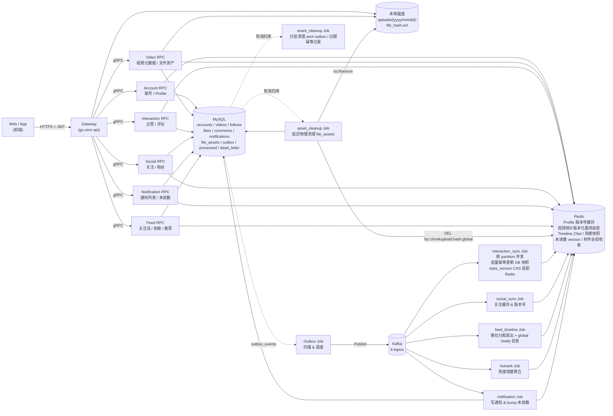

**核心约束**：

- 所有写操作走 "MySQL 事务 + `outbox_events`"，**禁止在业务代码里直接生产 Kafka 消息**。
- 所有跨模块的用户身份必须来自 Gateway 从 JWT 解析出的 `user_id`，**不信任前端传的 user_id**。
- 所有 Redis key 通过 `common/rediskey/*.go` 集中生成，统一 `fsz:` 前缀。
- 消费者用 `processed_events` 唯一键做幂等，失败进 `dead_letter_events`，绝不阻塞 partition。

---

## 三、目录结构

```
feedsystem-zero/
├── apps/
│   ├── gateway/              # API 网关（go-zero api）
│   │   ├── gateway.api       # 对外 HTTP 契约
│   │   └── internal/{handler, logic, middleware, svc, types, config}
│   ├── account/              # 账号 RPC
│   ├── video/                # 视频 RPC
│   ├── interaction/          # 互动 RPC
│   ├── social/               # 社交 RPC
│   ├── notification/         # 通知 RPC
│   ├── feed/                 # Feed RPC
│   └── job/
│       ├── outbox/           # Outbox → Kafka 投递
│       ├── interaction_sync/ # 点赞/评论 Kafka 消费者
│       ├── social_sync/      # 关注 Kafka 消费者
│       ├── feed_timeline/    # 推拉分离 Timeline 扇出
│       ├── hotrank/          # 热榜聚合 Job
│       ├── notification/     # 通知落库 Job
│       ├── asset_cleanup/    # 文件资产物理清理 Job（延迟删除 + 复活兜底）
│       └── event_cleanup/    # Outbox / 消费幂等 / 死信分批清理 Job
├── common/
│   ├── eventx/               # 事件 topic、envelope、payload schema
│   ├── feedx/                # Timeline member 编码 & 大 V 判定
│   ├── gormx/                # GORM 初始化
│   ├── jwtx/                 # JWT 签发/解析
│   ├── kafkax/               # Kafka producer/consumer 封装
│   ├── rediskey/             # 按模块拆分的 8 个 Redis key 文件
│   ├── notificationcache/    # 未读数版本号缓存
│   └── emailx/               # 邮件（注册验证码）
├── deploy/
│   ├── docker-compose.yml    # MySQL/Redis/etcd/Kafka 一键起
│   ├── sql/001~017_*.sql     # 建表、索引与增量迁移
│   └── kafka/create_topics.sh
├── model/                    # 事件模型和 GORM 共享表模型
├── docs/                     # 本文档所在目录
├── tests/                    # 造数、HTTP 压测、E2E 冒烟与并发测试
└── web/                      # React 前端（Vite + TS + Tailwind）
```

---

## 四、微服务与职责总览

### 4.1 RPC 服务（6 个）

| 模块 | 端口位 | 主要能力 | 状态 |
|---|---|---|---|
| **account** | rpc | 注册 / 登录 / 登出 / 刷新 token / GetProfile / BatchGetProfiles / UpdateProfile | ✅ 已实现 |
| **video** | rpc | 分片上传 / PublishVideo / GetVideo / BatchGetVideos / ListUserVideos / DeleteVideo / 文件秒传去重 | ✅ 已实现 |
| **interaction** | rpc | LikeVideo / UnlikeVideo / PublishComment / DeleteComment / ListComments / BatchGetVideoStats | ✅ 已实现 |
| **social** | rpc | Follow / Unfollow / IsFollowing / BatchIsFollowing / ListFollowers / ListFollowings | ✅ 已实现 |
| **notification** | rpc | ListNotifications / GetUnreadCount / MarkNotificationRead / MarkAllNotificationsRead | ✅ 已实现 |
| **feed** | rpc | GetFollowingFeed / GetHotFeed / GetRecommendFeed | ✅ 已实现 |

### 4.2 Job 后台（8 个）

| Job | 消费 topic | 主要动作 | 状态 |
|---|---|---|---|
| **outbox** | — | `READ COMMITTED + SKIP LOCKED` 短事务认领，租约保护并发投递与失败退避 | ✅ |
| **interaction_sync** | `interaction.like.events` / `interaction.comment.events` | topic+partition 分组并发；500 条批量幂等更新 videos 持久快照与 `stats_version`，再以 Lua CAS 投影 Redis | ✅ |
| **social_sync** | `social.follow.events` | 关注状态缓存 & Profile 版本号 bump | ✅ |
| **feed_timeline** | `feed.video.events` / `social.follow.events` | 推拉分离：小 V 写扩散、大 V author outbox；ready 丢失时主动 bootstrap | ✅ |
| **hotrank** | `interaction.like.events` / `interaction.comment.events` | 独立消费互动事件，维护 UTC 分钟窗口；Feed 按需构建衰减快照 | ✅ |
| **notification** | `notification.events` | 通知落库、未读数 version bump、死信旁路 | ✅ |
| **asset_cleanup** | 无（轮询扫库） | 延迟物理清理 `file_assets`；抢占超时兜底 + 引用复活；DEL 秒传全局缓存 | ✅ |
| **event_cleanup** | 无（轮询扫库） | 小批次清理已发送 Outbox 和过期 `processed_events`；死信默认保留、可配置归档后清理 | ✅ |

---

## 五、数据模型（MySQL）

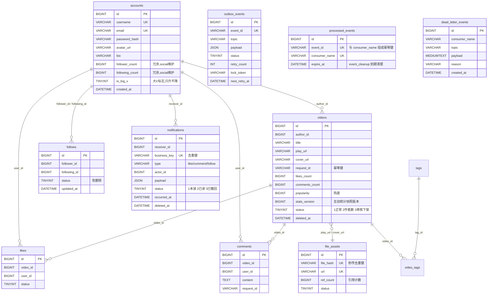

### 5.1 SQL 迁移文件时间线

| 文件 | 内容摘要 |
|---|---|
| `001_schema.sql` | accounts / videos / file_assets / tags / video_tags / likes / comments / interaction_events / outbox_events / processed_events / dead_letter_events |
| `002_file_assets.sql` | 文件资产索引 |
| `003_video_asset_indexes.sql` | 视频 play_url/cover_url 索引 |
| `004_interaction_job_infra.sql` | 互动 job 基础设施 |
| `005~006` | 点赞/评论列表索引 |
| `007_outbox_dispatcher_final.sql` | Outbox 分发锁字段 `lock_token` / `next_retry_at` |
| `008_interaction_sync_dead_letters.sql` | 死信表 |
| `009_video_request_id.sql` | 视频发布幂等键 |
| `010_follows.sql` | follows 关注表 |
| `011_social_final_indexes.sql` | 社交最终索引 |
| `012_feed_timeline_indexes.sql` | Feed 冷启动索引 |
| `013_account_follow_counters.sql` | accounts 增加 follower_count / following_count 冗余字段 |
| `014_notifications.sql` | `notifications` 表（含 `uk_notification_business` 唯一键 + `(receiver_id, occurred_at, id)` 复合索引） |
| `015_account_big_v_flag.sql` | accounts.is_big_v 大 V 标志位 + 存量数据回填 |
| `016_outbox_aggregate_status_index.sql` | Outbox 按 topic/status 聚合检查与待投递扫描索引 |
| `017_stats_projection_and_event_cleanup.sql` | videos.stats_version；Outbox / processed / dead-letter 分批清理索引 |

---

## 六、事件契约（Kafka）

### 6.1 Topic 一览

来自 `common/eventx/topics.go`：

| Topic | Producer | Consumer | 用途 |
|---|---|---|---|
| `interaction.like.events` | interaction rpc (outbox) | interaction_sync + hotrank | 点赞/取消点赞聚合落库；独立热榜窗口计分 |
| `interaction.comment.events` | interaction rpc (outbox) | interaction_sync + hotrank | 评论创建/删除聚合落库；独立热榜窗口计分 |
| `video.stat.delta.events` | 当前仅保留契约 | 当前无在线 Producer/Consumer | 预留的视频统计增量 Topic，不属于当前运行主链路 |
| `feed.video.events` | video rpc (outbox) | feed_timeline | 视频发布/删除 → Timeline 扇出 |
| `social.follow.events` | social rpc (outbox) | social_sync + feed_timeline | 关注/取关缓存 & Timeline 回填 |
| `notification.events` | 多方 rpc (outbox) | **notification** | 系统通知（关注/点赞/评论） |

### 6.2 事件类型

来自 `common/eventx/events.go`：

```
video.published / video.deleted        → FeedVideoEvent
like.created / like.deleted            → LikeEvent
comment.created / comment.deleted      → CommentEvent
video.stat.delta                       → VideoStatDeltaEvent
follow.created / follow.deleted        → FollowEvent
notification.create / notification.delete → NotificationEvent
```

统一封装为 `Envelope`：`{event_id, event_type, aggregate_type, aggregate_id, occurred_at, payload}`。

---

## 七、Outbox 事务发件箱模式

这是本项目**跨服务一致性的基石**。业务写操作与事件发布必须原子，否则会出现"MySQL 写成功但事件丢了"或"事件发了但 MySQL 回滚了"。

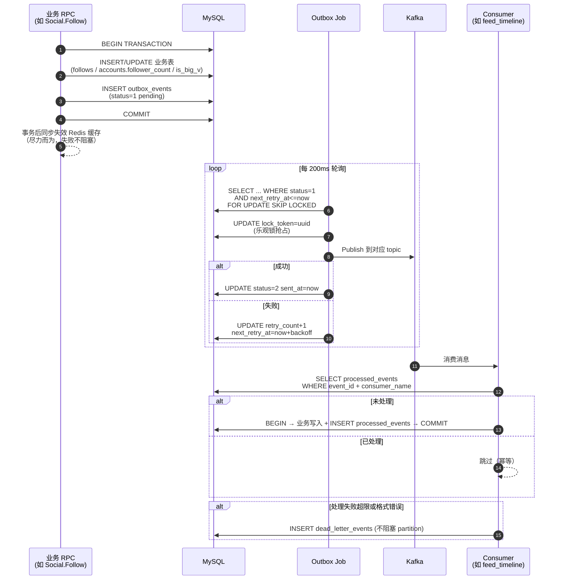

**关键点**：

- `outbox_events` 使用 `SELECT ... FOR UPDATE SKIP LOCKED` + `lock_token` 双保险，支持多实例并发调度。
- `processed_events` 的唯一键 `(event_id, consumer_name)` 保证每个消费者对同一事件只处理一次。
- 死信隔离：失败事件不阻塞主流程，进 `dead_letter_events` 供人工介入。
- 阶梯退避：`next_retry_at = now + backoff(retry_count)`。

---

## 八、各模块详解与流程图

### 8.1 Account 账号模块

**职责**：用户身份、Profile 数据、JWT 签发、邮箱验证码。

**核心 RPC**：

| Rpc | 说明 |
|---|---|
| `Register` | 邮箱 + 用户名 + 密码；先校验邮箱验证码 |
| `Login` | 邮箱 + 密码；签发 access token + refresh token |
| `Logout` | DEL `fsz:token:{userID}`，使 access token 立刻失效 |
| `RefreshToken` | 用 refresh token 换新的 access token |
| `GetProfile` | 版本号缓存：读 version → 组合 key 读 profile JSON → miss 回源 |
| `BatchGetProfiles` | Feed / 评论列表批量拉作者信息 |
| `UpdateProfile` | 更新头像 / bio；事务内 INCR profile version |

**双 Token 机制（access token + refresh token）**：

在"安全性"与"用户体验"之间做折中，两个 token 各司其职：

| 维度 | `access_token` | `refresh_token` |
|---|---|---|
| 本质 | JWT，自签名可自验证 | 随机字符串，本身不含信息 |
| 有效期 | 短（`AccessExpire=900s`，15 分钟） | 长（可配 7~30 天） |
| 用途 | 每个业务 API 请求都带，Gateway 层校验 | **仅** `/account/refresh` 时使用 |
| 存放位置 | Redis `fsz:token:{userID}`（白名单，支持强制登出） | MySQL `accounts.refresh_token`（有状态） |
| 服务端校验 | secret 本地验签 + Redis 白名单比对，不查 MySQL | 必须 `SELECT ... WHERE refresh_token=?` 查 MySQL |
| 主动作废 | Logout 时 `DEL fsz:token:{userID}` | Logout 时 `UPDATE refresh_token=NULL`；每次刷新自动轮换 |

**设计目标**：
- **降低泄漏风险**：access token 每次请求都带，暴露面大，用 15 分钟短有效期把破坏窗口压到最小；refresh token 只在续期接口出现，暴露面小。
- **用户体验无感续期**：前端拦 401 → 用 refresh token 悄悄换新 access token → 重放业务请求，用户不需要重新输账号密码。
- **服务端可控**：改密码 / 风控 / 多端下线时，DB 清空 `refresh_token` + Redis DEL 白名单，即可让用户在 15 分钟内被强制打回登录页。这补齐了纯无状态 JWT "无法主动踢人"的短板。
- **Refresh Token Rotation（轮换）防重放**：`RefreshToken` RPC 每次都同时下发**新的** refresh token 并作废旧的，DB 更新用 `WHERE id=? AND refresh_token=旧值` 的 CAS 语义，保证同一份 refresh token 只能被消费一次。一旦被盗，真用户和攻击者必有一方在下次刷新时被 401 踢出，账号盗用可被及时发现。

---

**Profile 版本号缓存流程**：

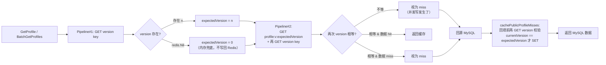

**关键点**：
- **写侧独占 INCR**：`UpdateProfile`、`social` 关注/取关、`social_sync` 消费者是**唯二可以修改 version key 的地方**，全部用 `INCR`（原子递增）。旧版本 key 无需扫描删除，等 TTL 自然淘汰。
- **粉丝数变化时也要 INCR 两侧的 version**（follower 和 following），否则 `BatchGetProfiles` 会读到旧的 follower_count。
- **读侧永远只 GET，从不 SET version key**——这是版本化缓存能保证一致性的核心约束，下面单独展开。

#### 8.1.1 为什么读侧不"重写"缺失的 version key

`batchgetprofileslogic.go` 里读取 version key 用的是 `publicProfileVersionResult`，遇到 `redis.Nil` 会**直接返回 `(0, nil)` 兜底**，而**没有**任何 `SET version=0` 或 `SETNX` 的回填分支。这是刻意为之：

1. **version key 是权威时钟，不是缓存**。它的语义是"这个用户资料迄今为止一共被写过多少次"，只能由**写路径**通过 `INCR` 单调递增。读侧一旦 SET，就相当于用一个"猜测值"覆盖时钟——任何和这次 SET 并发的写入都可能被"退回"，破坏 CAS 校验（`currentVersion == expectedVersion` 才回填）的正确性，甚至让旧数据长期钉死在新版本槽位里。
2. **`redis.Nil → 0` 只在内存里生效**：读侧把 miss 当作"版本 0"来构造数据 key `profile:{uid}:v:0` 并走后续 CAS 流程，Redis 上 version key 该不存在就继续不存在。
3. **和 Redis `INCR` 原生语义天然衔接**：Redis 对**不存在的 key 执行 `INCR` 会自动当作 0 递增**，第一次 `INCR` 完就是 1。所以：
   - 读侧内存里假设"当前是版本 0" → 数据 key 用 `v:0`；
   - 一旦写侧首次 `UpdateProfile`/关注写入，`INCR` 把 version 从"不存在"直接刷到 1，数据 key 切到 `v:1`，`v:0` 里的旧快照自然作废（等 TTL 淘汰）。
   - 读、写两侧对"没写过的用户 = 版本 0"这个约定完全自洽，无需任何显式初始化。
4. **version key 因此设计成永久 key（无 TTL）**：如果给它设 TTL，就会出现"版本 key 先过期、数据 key 还没过期"的窗口——那时读侧把 miss 归一为 0，可能撞上一份还没被淘汰的旧版本数据 key，读到脏数据。永久 version key + 有 TTL 的数据 key，是这套方案能自愈的前提。

**权限总结**：

| Key | 写侧 | 读侧 | TTL |
|---|---|---|---|
| `fsz:account:profile:{uid}:version` | 只允许 `INCR` | **只允许 `GET`**；miss 时**内存里当 0，不回写** | 永久 |
| `fsz:account:profile:{uid}:v:{n}` | 一般不写（由读侧回填） | `GET` + CAS 校验后 `SET`（含正/负缓存） | 15min + 抖动 / 负缓存 1min |

#### 8.1.2 BatchGetProfiles 的"两段 Pipeline + 二次校验"读路径

`loadPublicProfilesFromCache` 和 `cachePublicProfileMisses` 一起构成完整的读-回填链路：

- **读侧**：先一次 Pipeline 拿所有 version → 再一次 Pipeline 同时拿 `profile:v:{version}` 和"当前 version"；两次 version 不等 → 视为 miss（说明期间被并发写掉了）。
- **回源**：miss 列表统一走一次 `WHERE id IN (...)` 主键 IN 查询，配合 `syncx.SingleFlight` 合并同一实例上相同 ID 集合的并发回源，降低热点资料刚过期时的 MySQL 瞬时压力。
- **回填**：`cachePublicProfileMisses` 写入前**再 GET 一次 version**，只有 `currentVersion == expectedVersion` 才 SET `profile:v:{expectedVersion}`。任何一步版本不匹配都放弃回填，等下一次读请求用新版本号自然重新回源。
- **负缓存防穿透**：MySQL 查不到的 userID 会写 `{Missing:true}` 短 TTL（`AccountPublicProfileMissingTTL=1min`）；读侧命中 `Missing:true` 直接跳过，不回源、不放进响应，避免无效 ID 反复打穿 MySQL。
- **失败静默**：所有 Redis 错误只记日志、不返回错误——回填缓存是尽力而为，最坏后果只是下一次请求再走一次 DB。

#### 8.1.3 Key 结构详解：多版本 Key 共存 & 与 Video 方案的对比

`BatchGetProfiles` 的读一致性保障根本上建立在 **"版本号嵌入 Key 名"** 这一设计上。Key 语义（见 `common/rediskey/account.go`）：

| Key | 数据结构 | 值 | 用途 |
|---|---|---|---|
| `fsz:account:profile:{uid}:version` | STRING(int64) | 单调递增版本号 | 权威时钟，写侧 `INCR`；旧版本无需扫描删除，等 TTL 自然淘汰 |
| `fsz:account:profile:{uid}:v:{n}` | STRING(JSON) | `{user_id, username, avatar_url, bio, follower_count, following_count}` | 版本 n 的资料快照；读侧回填、写侧不主动删除 |

**核心特征**：`AccountPublicProfileKey(userID, version)` 生成的 Key **不同版本对应完全不同的 Redis Key**（`profile:100:v:5` 和 `profile:100:v:6` 是两个独立 Key）——**新版本不覆盖旧版本，旧版本 Key 无人访问、TTL 到期自动消失**。

**这个设计带来 3 个直接后果**：

1. **写侧极简**：`UpdateProfile` / `social` 关注、取关、`social_sync` 消费者**只需要一条 `INCR`**——不用协调 `DEL` 旧 Key、不用担心竞态；
2. **读侧必须先拿版本号**：因为要用 `version` 拼出正确的数据 Key `profile:{uid}:v:{version}`，**必须先 GET 版本号**——所以设计成 "**两段 Pipeline**"（第一段拿版本、第二段用版本读实体+二次校验）；
3. **两次版本读之间需要收敛点**：读侧从第一次读到 `version=5`、到第二次读到 `version` 用来校验，中间任何并发写产生的 `INCR → 6` 都会被 **`currentVersion != expectedVersion`** 识破放弃——这也是 8.1.2 提到的"两次 Pipeline + 二次校验"的物理基础。

**读路径 3 步命令时序（`loadPublicProfilesFromCache`）**：

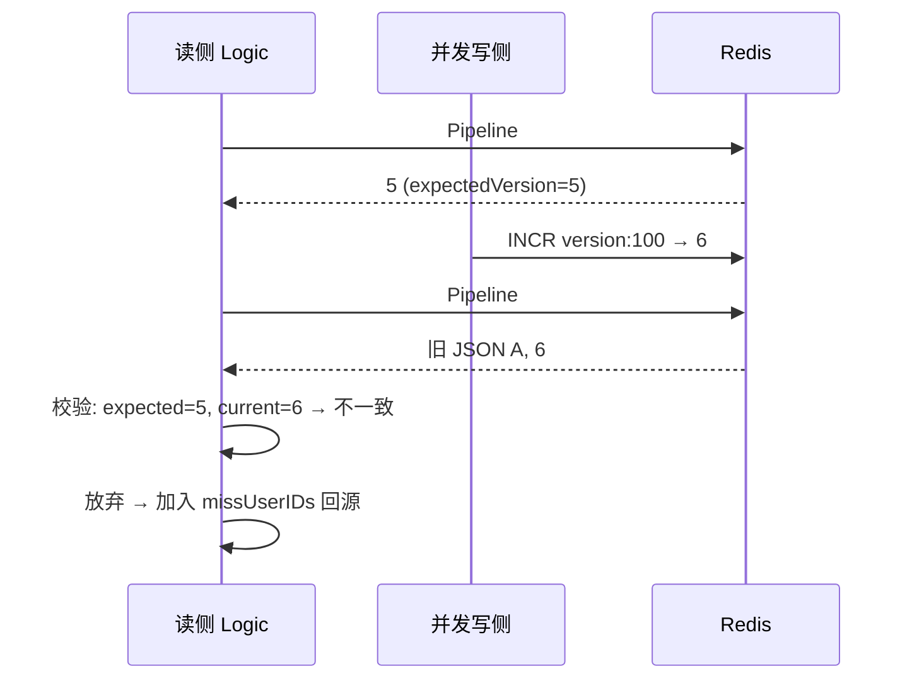

**"先读实体再读版本"次序在这里也成立**：Pipeline#2 里 `GET profile:v:5` 排在 `GET version` 之前，保证读到的版本 ≥ 实体的版本，任何在两条命令之间的写入都会被识别为不一致（和 Video 方案思路一致）。

**回填的三次校验链条（`cachePublicProfileMisses`）**：

回填时又走了一遍 CAS，避免"回源期间发生并发写、把旧 DB 快照写到新版本槽位"：

```
读侧看到 expectedVersion=5 → 回源 MySQL 拿数据 A
    ↓ 中间可能并发发生 INCR → 6 + 更新 MySQL 为 B
回填前: cachePublicProfileMisses 再 GET version → 6
    ↓ currentVersion=6 != expectedVersion=5
放弃 SET profile:v:5=A    ← 关键：不把 A 写到 v:5 槽位
```

如果**没有**这道校验：读侧会把 A 写到 `profile:100:v:5`；下一次读版本还是 6，去读 `profile:v:6` 是 miss 无害；**但** 如果在两次 `INCR` 之间读侧又读到 5 并回填 A，就可能污染刚被激活的 v:5 槽位——所以这一层 CAS 是必需的。

**读侧回填了什么？—— 只写实体 Key、绝不写 version Key**：

这是整个方案里最容易被忽视但**极其关键**的分工约定。看 `cachePublicProfileMisses` 里唯一的 SET 命令：

```go
cachePipe.Set(l.ctx,
    rediskey.AccountPublicProfileKey(userID, expectedVersion), // ← 只写实体 Key: profile:{uid}:v:{n}
    data, ttl)
// 全函数中对 AccountPublicProfileVersionKey 只有 GET、没有任何 SET/INCR
```

全项目对 `AccountPublicProfileVersionKey` 的操作只有 **4 处 GET + 1 处 INCR**：

| 位置 | 操作 | 归属 |
|---|---|---|
| `batchgetprofileslogic.go:178`（Pipeline#1 拿版本） | GET | 读侧 |
| `batchgetprofileslogic.go:209`（Pipeline#2 二次校验） | GET | 读侧 |
| `batchgetprofileslogic.go:287`（回填前三次校验） | GET | 读侧 |
| `updateprofilelogic.go:98`（资料更新后 bump） | **INCR** | **写侧独占** |
| `social_sync` job / social 关注取关（follower_count 变化后 bump） | **INCR** | **写侧独占** |

**核心不变式：version Key 的写入权由写侧独占、读侧永远只 GET 不写**。这是“版本号 + 惰性重算”方案的底层保障。

**为什么读侧绝对不能回填 version Key？** 一个反例说明——假设允许读侧在 `GET version` 得到 `redis.Nil` 时 `SETNX version=0`：

```
T0: 用户 100 从未被更新过 → version key 不存在
T1: 写侧 UpdateProfile → INCR version → 变成 1
    Redis: version=1, profile:100:v:1={真实资料 A}
T2: version key 因 Redis 内存压力被 evict
    Redis: version 消失，profile:100:v:1={A} 还在
T3: 【假想的错误读侧】GET version → nil → SETNX version=0
    Redis: version=0 ← 错误地"回退"了！
T4: 后续写侧 UpdateProfile → INCR version 从 0 → 1、2、3...
    某一刻 version 又回到 1 时
T5: 读侧拿 expectedVersion=1、命中 profile:100:v:1={A}
    ⚠️ 返回的其实是 T1 时代的古老快照、被误判为当前版本 → 脏数据
```

**根因**：`INCR` 的语义是"当前值 +1"，一旦读侧把 version 误设为一个较小值，后续写侧 INCR 会**重演历史值序列**——旧的多版本 Key 里的历史快照会被误判为"当前版本快照"。**只有让 version Key 全时间轴单调递增（永远只由写侧 INCR、读侧永远只 GET、不存在时兜底为 0）**，才能保证"版本号 == 数据时代"这条不变式。

**读侧敢回填实体 Key、不敢回填 version Key 的物理基础**：

实体 Key 之所以能安全地由读侧回填、正是因为它的名字里**已经嵌入了版本号**（`profile:{uid}:v:{n}`）——读侧写进去的 `v:5` 快照**只会被"手里也拿着 expectedVersion=5"的读者读到**、后续任何拿到 `v:6/v:7` 的读者根本不会去访问 `v:5`、那个孤立的旧 Key 只会被 TTL（15min ± 抖动）自然淘汰——**多版本 Key 短暂共存**在物理层面把"读侧回填"隔离到了对当前版本无害的独立槽位。

**当 version Key 不存在时怎么办？** `publicProfileVersionResult` 的兜底：

```go
if errors.Is(err, redis.Nil) {
    return 0, nil                        // 从未被更新过 or version 被 evict → 都兜底为 0
}
```

把"从未被更新过的用户"和"version Key 丢失的用户"统一走 `expectedVersion=0` 分支——**读侧不介入 version 的写入**、等下一次任何 `UpdateProfile` 的 `INCR` 从 0 → 1 自然重建 version Key。**读侧唯一的责任是识别版本、不承担维护版本的责任**。

（对比看 Video 方案：写侧对 version Key 也是**INCR 独占**、Lua CAS 脚本里对 version Key 也只有 `GET` 没有 `SET/INCR`——**这条"version Key 写侧独占"的铁律两边完全一致**，详见 8.2.5。）

**与 Video `BatchGetVideos` 的对比总览**：

| 维度 | Account `BatchGetProfiles` | Video `BatchGetVideos` |
|---|---|---|
| Key 里是否含版本号 | ✅ 含（`profile:{uid}:v:{n}`） | ❌ 不含（`entity:{vid}`） |
| 不同版本关系 | 多版本共存（独立 Key） | 单版本覆盖（同一 Key） |
| 读侧 RTT 数 | **2 次 Pipeline** | 1 次 Pipeline |
| 读侧命令 | Pipeline1: GET version;<br/>Pipeline2: GET data + GET version(校验) | Pipeline: GET entity + GET version |
| 写侧动作 | 仅 `INCR` | `INCR` + `DEL` + Lua CAS |
| 旧缓存清理 | 无人访问 + TTL 自然淘汰 | 写侧 `DEL` 主动清理 |
| 脏数据窗口 | 双重版本校验，几乎无窗口 | 一次请求内可能返回旧值（~10ms） |
| 单体缓存开销 | 高（多版本共存，最长 15min） | 低（同一 Key 覆盖） |
| 单条数据大小 | 小（几百字节） | 大（含 title/description/tags，可达几 KB） |
| 业务更新频率 | 极低（用户几周才改一次） | 较高（点赞/评论/状态频繁变） |
| 一致性容忍度 | 更严格（用户改了立刻要看到） | 允许毫秒级最终一致 |

**权衡本质**：两者是“版本号 + 惰性重算”的**两种落地形态**——Account 用**多版本 Key + 两段 Pipeline** 换严格一致（多用旧 Key 内存换 RTT 上的两次校验、写侧简化），Video 用**单版本 Key + Lua CAS** 换低内存和更少 RTT（接受一次请求内的毫秒级窗口、复杂化写侧）。**没有优劣，只有场景匹配**。

**SingleFlight 合并并发回源机制详解**：

`BatchGetProfiles` 和 `BatchGetVideos` 缓存 miss 时并**不是**每个请求都直接打到 MySQL——两者都用 `github.com/zeromicro/go-zero/core/syncx.SingleFlight` 把**同一实例内、同一批 ID 集合的并发回源合并成一次 DB 查询**、防止"缓存击穿"打垮 MySQL。

**代码结构（两者完全对称）**：

```go
// 包级单例，进程共享
var publicProfileDBLoadGroup = syncx.NewSingleFlight()          // account
var videoEntityDBLoadGroup   = syncx.NewSingleFlight()          // video

// 回源函数用 Do(key, fn) 包一层
value, err := publicProfileDBLoadGroup.Do(
    publicProfileDBLoadKey(userIDs),                             // flight key
    func() (any, error) {                                        // 真正的 DB 查询
        var users []model.Account
        err := gormDB.Select(...).Where("id IN ?", userIDs).Find(&users).Error
        // ... 组装成 map[uint64]*PublicProfile 返回
        return profiles, nil
    },
)
```

**`Do(key, fn)` 的语义**：
- 如果 `key` 上已经有一个 `fn` 正在执行 → **当前 goroutine 阻塞等待**、不启动新的 `fn`；
- 否则 → 启动 `fn` 执行、执行期间所有 `Do(相同 key)` 都挂在同一个等待队列上；
- `fn` 返回后 → **所有等待者共享同一份 `(value, error)`**；
- 立刻从内部 map 中删除 `key`——**下一次 `Do(同 key)` 会重新启动 `fn`**（不做长期结果缓存、真正的缓存交给上游 Redis）。

**flight key 为什么必须排序拼字符串**（`publicProfileDBLoadKey` / `videoEntityDBLoadKey`）：

```go
func publicProfileDBLoadKey(userIDs []uint64) string {
    sortedUserIDs := append([]uint64(nil), userIDs...)           // ① 拷贝副本，不改调用方切片
    sort.Slice(sortedUserIDs, func(i, j int) bool {              // ② 稳定排序
        return sortedUserIDs[i] < sortedUserIDs[j]
    })

    var builder strings.Builder                                  // ③ 拼接 "1,2,3,"
    for _, userID := range sortedUserIDs {
        builder.WriteString(strconv.FormatUint(userID, 10))
        builder.WriteByte(',')
    }
    return builder.String()
}
```

三步做的事情：

1. **`append([]uint64(nil), ids...)` 拷贝副本**——绝对不能就地 `sort.Slice(userIDs)`，否则会打乱调用方期望的响应顺序（`BatchGetProfiles` 最后按输入顺序组装响应，一旦就地排序响应就会乱掉）；
2. **`sort.Slice` 排序**——让 `[1,2,3]` / `[2,3,1]` / `[3,1,2]` 三个并发请求**识别为同一 flight**、共享一次 DB 查询；否则纯字面拼接会当作三次独立回源；
3. **`strings.Builder` 拼接**——O(N) 生成一个可比较的字符串（比 `fmt.Sprintf` 少一次反射开销），末尾多一个 `,` 无害。

（`batchgetvideoslogic_test.go:TestVideoEntityDBLoadKeyOrderIndependent` 专门测了 `[9,2,7]` 和 `[7,9,2]` 生成同一个 flight key——是这条不变式的回归保护。）

**"防缓存击穿"典型场景**：

假设某热门用户资料的 15min 缓存刚过期、瞬时有 500 个请求都来查同一批用户 ID：

| 无 SingleFlight | 有 SingleFlight |
|---|---|
| 500 个 goroutine 各自看到 miss → 500 次 `WHERE id IN (...)` DB 查询 → MySQL CPU 瞬时打满、慢查询积压 | 500 个 goroutine 竞争同一个 flight key → **只有 1 个执行 DB 查询**、其余 499 个阻塞等待 → 一次查询返回后 499 个 goroutine 立刻拿到同一份结果 |

——这就是 Redis 章节里常说的**"缓存击穿保护"**（cache stampede protection）。

**关键边界与约束**：

| 边界 | 说明 |
|---|---|
| **进程内单例** | `syncx.NewSingleFlight()` 是**进程内**的合并，跨实例（不同 Pod）的并发回源**不合并**——但配合上游 Redis 缓存已经足够抗住热点；跨实例并发合并需要分布式锁，代价大且非必要。 |
| **flight key 精确匹配** | key 是字符串精确匹配、必须完全相同才合并；`[1,2]` 和 `[1,2,3]` 是**两个 flight**、不合并 —— 这是正确的（两次查的数据不同，不能共享结果）。 |
| **错误也会共享** | `fn` 返回 error 时、所有等待者拿到**同一个 error**——如果 DB 抖动导致 fn 报错，499 个请求会同时失败；但因为每次 `Do` 完立即从 map 删除 key，下一次请求会立刻重试。 |
| **不缓存结果** | SingleFlight 只在"并发窗口内"合并、不做结果缓存 —— fn 返回后 key 立即失效，第 501 个请求（若晚到）会重新启动一次 fn。这是刻意设计——真正的缓存交给 Redis，SingleFlight 只解决"击穿瞬间"的并发放大问题。 |
| **同一实例内的顺序副作用** | 若 `fn` 有副作用（如触发写操作），499 个等待者不会各自触发一次副作用——**副作用只发生一次**。BatchGet* 场景纯读、无副作用，天然安全。 |
| **不阻塞跨 flight 请求** | 不同 flight key 之间完全独立、互不阻塞。 |
| **返回值必须做类型断言** | `Do` 签名是 `func() (any, error)`、调用方要 `value.(map[uint64]*PublicProfile)`——两边都加了 `if !ok { return errors.New("...结果类型异常") }` 兜底防止类型漂移。 |

**为什么放在缓存 miss 之后、而不是入口就 Do 一层**：

看 `BatchGetProfiles` 的调用位置——`loadPublicProfilesFromDB` 只在 `missUserIDs` 非空时被调用、且传入的是**已经过缓存过滤的 miss 子集**。这样的设计意味着：

- **Redis 命中的请求根本不进入 SingleFlight**——它们各自走各自的 Pipeline、不会互相阻塞；
- **只有缓存 miss 的少数请求**才会争抢 flight —— 击穿瞬间才需要合并；
- **flight key 是排序后的 miss ID 子集**——两个请求即使原始 ID 不同、只要经过缓存过滤后 miss 集合相同，仍可合并（例如请求 A 查 [1,2,3]、请求 B 查 [3,4,5]，若 1,2,4,5 都命中缓存、只剩 3 miss，两者会合到同一个 flight 的 "3," key 上）。

**项目内其他 SingleFlight 落点（供参考）**：

同一套模式在项目多个模块被复用、都用于**"批量/分页查询 + 缓存 miss 时合并回源"**：

| 位置 | 用途 | flight key 组成 |
|---|---|---|
| `apps/account/internal/logic/batchgetprofileslogic.go` | 批量用户资料回源 | 排序后的 userID 集合 |
| `apps/video/internal/logic/batchgetvideoslogic.go` | 批量视频实体回源 | 排序后的 videoID 集合 |
| `apps/interaction/internal/logic/listcommentslogic.go` | 视频评论列表回源 | `videoID + cursorCreatedAt + cursorCommentID + pageSize` |
| `apps/interaction/internal/logic/listmylikedvideoslogic.go` | "我点赞的视频" 列表回源 | `userID + cursor + pageSize` |
| `apps/social/internal/logic/listfollowerslogic.go` | 粉丝列表回源 | `userID + cursor + pageSize` |
| `apps/social/internal/logic/listfollowingslogic.go` | 关注列表回源 | `userID + cursor + pageSize` |
| `apps/feed/internal/logic/feedhelper.go` | Timeline 构建 / 热榜快照构建 | 独立两个 group |

——**"进程内合并 + 上游 Redis 抗量 + 下游 MySQL 兜底"** 已成为该项目 batch/list 类接口的**通用模板**。

**共通的通用最佳实践**（两者都用）：

1. **`SingleFlight` 合并回源**（`publicProfileDBLoadGroup` / `videoEntityDBLoadGroup`）——防击穿，同实例内相同 ID 集合合并一次 DB 查询；
2. **flight key 排序拼字符串**——让 `[1,2,3]` 和 `[3,1,2]` 识别为同一 flight；
3. **`Missing:true` 负缓存 + 短 TTL** —— 防穿透；
4. **TTL 抖动 `userID % 300s`** —— 防雪崩，且同一 ID TTL 可预测；
5. **Redis 挂了 `cacheAvailable=false` 全走 DB** —— 降级保可用；
6. **列裁剪**：`Select` 只取公开字段——最小化 DB 传输；
7. **`normalize*IDs`** 输入归一化：限批 100、过滤 0、去重保序；
8. **响应按输入顺序对齐**：`for _, id := range ids` 拼装、Missing/不存在直接跳过；
9. **失败静默**：所有 Redis 错误只记日志、不影响给客户端的响应。

---

### 8.2 Video 视频模块

**职责**：视频元数据管理、分片上传、文件秒传去重、软删除。

**核心 RPC**：

| Rpc | 说明 |
|---|---|
| `PublishVideo` | 事务：INSERT videos + INSERT video_tags + INSERT outbox_events(video.published)；`(author_id, request_id)` 幂等 |
| `GetVideo` | Redis entity cache + MySQL 回源 |
| `BatchGetVideos` | Feed 拉视频卡片时用 |
| `ListUserVideos` | 用户主页视频列表，游标分页 |
| `DeleteVideo` | 软删除：`status=2, deleted_at=now`，file_assets.ref_count-1，发 outbox(video.deleted) |

#### 8.2.0 客户端上传三条路径：真秒传 / 小文件直传 / 分片上传

同样是"发一条视频"，客户端实际会根据文件大小、以及服务端是否已存在同 hash 记录，走**三条完全不同的路径**。三条路最终都拿到同一个 canonical `play_url`，交给 `/video/publish` 完成发布；但代价差别巨大。

**决策流程（客户端视角）**：

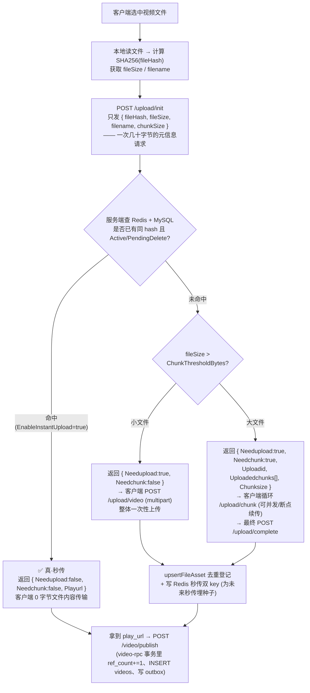

**三条路径的对比**：

| 路径 | 入口接口 | 客户端实际传输 | 触发条件 | 服务端关键动作 |
|---|---|---|---|---|
| **① 真·秒传** | `/upload/init` 内联返回 | ~几十字节（只有 fileHash + 元信息） | `EnableInstantUpload=true` 且 MySQL `file_assets` 存在同 hash 且 `status=Active`，且磁盘文件 `os.Stat` 通过 | `lookupInstantUploadedFile` 直查 MySQL + `os.Stat` 双重确认 → 返回该 asset 的 canonical `play_url`（并顺手把两把 Redis 秒传 key 刷新到最新 URL） |
| **② 小文件直传** | `/upload/video` (`UploadVideoLogic`) | 整个文件一次 HTTP multipart | 秒传未命中 且 `fileSize ≤ ChunkThresholdBytes` | `saveVideoUpload` 落盘 + 边写边算 SHA256 → `upsertFileAsset` 去重登记 → Redis 写秒传双 key |
| **③ 分片上传** | `/upload/init` → `/upload/chunk`×N → `/upload/complete` | 整个文件（分片可并发、可断点续传） | 秒传未命中 且 `fileSize > ChunkThresholdBytes` | init 建会话 → 每片落到 `chunkTempDir` → complete 合并、二次校验 hash、`upsertFileAsset` → 写秒传双 key |

**关键澄清（很容易误解的点）**：

1. **只有路径 ①（真·秒传）对本次上传的用户来说是"零传输"**。它的前提是客户端必须**先在本地把整个文件读一遍算出 SHA256**，然后只把 hash 发过来。服务器一次查询命中就直接返回 URL，客户端**不用再传文件内容**。这才配叫"秒传"。
2. **路径 ②/③ 的 `upsertFileAsset` 也会做去重**，但那时候客户端已经把整个文件传上来了。这一步节省的是 **服务端的物理存储和 `file_assets` 的冗余行**（如果 MySQL 里 hash 已存在，就把本次刚落盘的重复文件删掉，返回旧 canonical URL），**并不能节省本次的网络带宽和落盘 IO**。
3. **`UploadVideoLogic`（`/upload/video`）结尾那两条 `TxPipeline.SET`（写 `ChunkUploadHashKey` + `ChunkUploadGlobalHashKey`）不是"帮本次用户秒传"**，而是**为下一次同 hash 的上传埋种子**——下次别的用户（或自己）传相同文件时，`/upload/init` 就能在 Redis 里命中走路径 ①。这是一次"缓存预热"。
4. **秒传决策的权威源是 MySQL `file_assets` + 磁盘 `os.Stat`，不是 Redis**。这是最容易被误解的地方：
   - `lookupInstantUploadedFile` 的**读路径直接 `SELECT file_assets WHERE file_hash=? AND status=Active`**，然后 `os.Stat(storage_path)` 校验磁盘文件真实存在——**完全没有 `GET fsz:chunkupload:hash:*` 的动作**；
   - 之所以不读 Redis，是为了规避"MySQL 已经 `PendingDelete` 但 Redis 还缓存着旧 URL"这种短暂不一致——**永远以 MySQL 状态和磁盘现实为准**，秒传决策就不会返回一个即将被 asset_cleanup 清理的死文件；
   - Redis 双 key `ChunkUploadHashKey`（用户维度）和 `ChunkUploadGlobalHashKey`（全局）目前在**读路径上是"预留位"**，只做三件事：① 直传/合并成功后 `SET` 写入、② `lookupInstantUploadedFile` 命中 DB 后 `SET` 刷新、③ 各种"发现不一致"时的 `DEL` 清理；
   - 保留写路径的价值是"**缓存已经热着**"——未来如果想启用 Redis 加速（在函数开头加 `GET` 短路 MySQL 查询），不需要冷启动预热，改动只有几行；也方便运维/外部系统旁路查询 hash → URL 映射。
5. **秒传 TTL（默认 7 天）过期后不影响秒传能力**。因为读路径本来就直接查 MySQL，Redis 有没有、准不准都不影响判定结果。TTL 的作用只是限制**写入 Redis 后的最长驻留时间**，避免 asset_cleanup 之外的意外场景（比如运维手改 DB）留下过久的脏缓存。这个 TTL 从来不是秒传能否命中的门槛。
6. **分片路径的断点续传**：`/upload/init` 内 `reuseUploadSession` 会查 `fsz:chunkupload:session:{userID}:{fileHash}`，如果存在同一会话且元数据（fileHash/fileSize/finalExt/chunkSize）**强一致校验**通过，就返回已存在的 `uploadID` + 已上传的分片编号数组，客户端只需补传缺失分片。任一元数据不一致则视为新会话。
7. **上传路径与 `ref_count` 的边界**：无论走哪条路，`file_assets.ref_count` 的 `+=1` 都**不在上传时发生**，而是在后续 `/video/publish` 调用 video-rpc `PublishVideo` 的事务里完成。这样"上传成功但没发布"的孤立资产会在 Grace 期后被 asset_cleanup 回收，不会长期占存储。

**举个连贯的例子**（用户 A 首发、用户 B 秒传）：

1. 用户 A 选中一个 500MB 视频 → 客户端算 SHA256 → `/upload/init` 拿到 `Needupload=true, Needchunk=true`（大文件走分片）；
2. A 循环 `/upload/chunk` 传完所有分片 → `/upload/complete`：服务端合并 + 二次 hash 校验 + `upsertFileAsset` **首次登记** `Active, ref_count=0` + **`SET fsz:chunkupload:hash:global:{hash} = canonical_url, EX 7d`**；
3. A 拿到 `play_url` → `/video/publish` → video-rpc 事务内 `ref_count=1` + INSERT videos + 写 outbox；
4. 几小时后用户 B 拿到同一份视频（可能是转发保存的）→ 客户端算出**同一个 SHA256** → `/upload/init` → 服务端 `lookupInstantUploadedFile` 查 MySQL 命中 A 之前的 `file_assets` 行、`os.Stat` 确认磁盘文件仍在 → 直接返回 A 之前的 `canonical_url`，**B 一个字节文件都没传**；
5. B 再 `/video/publish` → video-rpc 事务内对同一 `file_assets` 行 `ref_count=2` + INSERT B 自己的 `videos` 行。

此时磁盘上只有**一份物理文件**，`file_assets` 只有**一行 `Active, ref_count=2`**，两条 `videos`（A 和 B）通过 `play_url` 共同引用它——这就是"秒传 + 引用计数"体系的最终形态。

**分片路径细节：分片是怎么切的、怎么传的、怎么合并的**

分片上传（路径 ③）不是一次请求就完成的动作，而是**三段式协议**：`/upload/init`（协商会话）→ `/upload/chunk`×N（逐片投递）→ `/upload/complete`（合并成品）。下面把每一步用到的元数据、判定逻辑、以及"分片到底怎么切"讲清楚。

**Step 1：`/upload/init` 协商——决定要不要分片、怎么分片**

客户端读文件、算完 SHA256 之后，先发一个**只包含元信息**的 init 请求：

```
POST /upload/init
{
  "filename":     "vacation.mp4",   // 用于提取扩展名 final_ext，白名单校验
  "file_hash":    "<SHA256 64 hex>", // 完整文件的哈希，秒传/续传/合并校验的锚点
  "file_size":    524288000,        // 500MB，字节数
  "chunk_size":   0,                // 可选，客户端不指定则由服务端给默认值
  "total_chunks": 0                 // 可选，仅用于交叉校验，不指定也行
}
```

服务端在 [`InitVideoUploadLogic`](d:\feedsystem-zero-main-git\apps\gateway\internal\logic\initvideouploadlogic.go) 里按以下顺序做**六层判定**：

| 顺序 | 判定项 | 依据的配置 / 常量 | 不满足时的动作 |
|---|---|---|---|
| 1 | JWT 是否合法、能拿到 `user_id` | JWT 中间件 | 401 |
| 2 | 文件名合法（非空 + 扩展名在视频白名单） | `validateVideoFilename` | 400 |
| 3 | `file_hash` 是 64 位小写 hex | `normalizeUploadHash` | 400 |
| 4 | `file_size` 未超上限 | `MaxVideoBytes` = 100MB | 400 |
| 5 | `chunk_size` 合法：>0 且 ≤ `MaxChunkBytes`；客户端不填则用 `DefaultChunkBytes` | `DefaultChunkBytes` = 8MB，`MaxChunkBytes` = 10MB | 400 |
| 6 | `total_chunks = ceil(file_size / chunk_size)`；若客户端也传了则必须一致 | `math.Ceil(float64(fileSize) / float64(chunkSize))` | 400 |

**判定通过后才进入"三条路径分流"**：

```
if EnableInstantUpload && lookupInstantUploadedFile 命中:
    → 路径 ①（真·秒传）：直接返回 canonical play_url
elif !shouldUseChunkUpload(upload, fileSize):   // fileSize ≤ ChunkThresholdBytes(20MB)
    → 路径 ②（小文件直传）：返回 { Needchunk:false }，前端换用 /upload/video 一次性传
else:                                            // fileSize > 20MB
    → 路径 ③（分片上传）：
        reuseUploadSession(userID, fileHash, fileSize, finalExt)
        ├─ 命中且强一致 → 复用旧 uploadID、返回已传编号
        └─ 未命中     → randomUploadID() 生成新 uploadID、HSET meta、SET session
        统一 mkdir chunkTempDir(uploadID)
        返回 { Uploadid, Needchunk:true, Uploadedchunks[], Chunksize }
```

`shouldUseChunkUpload` 的判定只有一行：

```go
return fileSize > chunkThresholdBytes(upload)   // ChunkThresholdBytes 默认 20MB
```

**恰好等于阈值走直传**（`>` 不是 `>=`），边界包含在"小文件"这侧。

**分片如何切分**：客户端拿到 init 响应里的 `Chunksize` 后，按下述规则切文件：

| 分片编号 | 起始偏移 | 大小 |
|---|---|---|
| 1 | `0` | `chunkSize` |
| 2 | `chunkSize` | `chunkSize` |
| ... | ... | `chunkSize` |
| `totalChunks - 1` | `(totalChunks-2) * chunkSize` | `chunkSize` |
| `totalChunks`（末片） | `(totalChunks-1) * chunkSize` | `fileSize - chunkSize*(totalChunks-1)` |

**只有末片可能小于 `chunkSize`**，其他片必须精确等于 `chunkSize`。编号从 **1** 开始（不是 0），且末片编号等于 `totalChunks`。举例：`fileSize=500MB, chunkSize=8MB` → `totalChunks = ceil(500/8) = 63`，前 62 片各 8MB，第 63 片 = `500*1024*1024 - 8*1024*1024*62 = 4MB`。

**Step 1 结束时的元数据落地**（新会话才写，续传只刷 TTL）：

```
Redis:
  fsz:chunkupload:meta:{uploadID}          Hash    { user_id, file_name, file_hash,
                                                     file_size, chunk_size, total_chunks,
                                                     final_ext, created_at, updated_at }
  fsz:chunkupload:session:{userID}:{fileHash}  String  uploadID    (反向索引)
  fsz:chunkupload:set:{uploadID}           Set     (空集合，等分片进来 SADD)

磁盘:
  {uploadRoot}/chunks/{uploadID}/          目录    (mkdir 幂等，续传不重建)
```

**Step 2：`/upload/chunk` 逐片投递——分片编号由前端生成、后端严格校验**

前端拿到 `uploadID` 和 `chunkSize` 后，对每一个待传的分片（跳过 `Uploadedchunks` 里已有的编号）发一个 `multipart/form-data` 请求：

```
POST /upload/chunk
Content-Type: multipart/form-data

form fields:
  upload_id     = "xxx"          // 定位会话
  chunk_index   = 1..totalChunks // 前端自己算的编号（1 起）
  chunk_hash    = "<SHA256>"     // 可选，仅 EnableChunkHashValidate=true 时必填
  file / chunk  = <binary>       // 分片二进制
```

服务端 [`UploadVideoChunkLogic`](d:\feedsystem-zero-main-git\apps\gateway\internal\logic\uploadvideochunklogic.go) 对前端传来的 `chunk_index` **不信任**，用 Redis 里的 `meta` 做三重校验：

| 校验项 | 具体判断 | 失败时 |
|---|---|---|
| **归属** | `meta.user_id == JWT.userID` | 403 |
| **会话有效** | `meta` 存在（未过期） | 404 |
| **编号范围** | `1 ≤ chunk_index ≤ meta.total_chunks` | 400 |
| **期望大小** | 非末片：`written == meta.chunk_size`；末片：`written == fileSize - chunk_size*(total_chunks-1)` | 400，删掉临时文件 |
| **单片上限** | `written ≤ meta.chunk_size` 且 `≤ MaxChunkBytes`（10MB） | 400 |
| **分片 hash**（可选） | `EnableChunkHashValidate=true` 时 `sha256(chunk) == chunk_hash` | 400，删掉临时文件 |

**这里最巧妙的一点是"期望大小"**——服务端**根据前端报的 `chunk_index` 反推这片应该有多大**，前端就算敢瞎报编号也没用，因为字节数对不上就会被拒。想欺骗后端就必须把"编号 + 分片大小"两个变量同时构造正确，成本极高。

**分片落盘用"tmp 文件 + 原子 rename"保证不留半吊子**：

```
1. 写到 {tempDir}/chunk_{index}.{randomToken}.tmp   // 边写边算 SHA256
2. 校验大小、校验 hash（如启用）
3. 全部通过 → os.Rename → chunk_{index}             // 原子替换
4. 任一步失败 → os.Remove(tmp) → 400
```

**幂等语义**：同一个 `chunk_index` 重复上传（比如客户端网络抖动导致的重试）会**覆盖**上一次的正式文件，Redis `SADD` 天然去重也不会因为重复而报错——所以客户端可以放心重试。

**并发上传能力**：分片上传**支持前端多 goroutine / 多 XHR 并发投递不同分片**，这是分片上传相对小文件直传"提速"的核心场景。并发安全性从三个粒度分别得到保障：

| 并发粒度 | 场景 | 保护机制 | 结果 |
|---|---|---|---|
| **① 同 `upload_id` + 不同 `chunk_index`** | 前端并行发 6 个 goroutine 同时传分片 1~6 | **每片写到 `chunk_index` 唯一决定的独立文件路径**（`chunk_1` / `chunk_2` / ...），文件系统层面天然不相交 + **Redis `SADD` 原子命令**（单线程执行、集合天然去重） | ✅ 完全并发，零冲突 |
| **② 同 `upload_id` + 同 `chunk_index`** | 网络抖动导致同一片被重复投递 | `randomHex(8)` 生成随机 `tmpToken` 写入 `chunk_{i}.{token}.tmp`，多 goroutine 各写各的 tmp 互不干扰，最终 `os.Rename` **原子提交**；分片 hash 校验保证两个成功写入的内容完全一致，谁覆盖谁都幂等 | ✅ 最终一致，不产生"半 A 半 B"损坏文件 |
| **③ 不同 `upload_id` + 同 `file_hash`** | 多用户并发上传同一份视频 | 每个 `upload_id` 拥有独立的 `chunkTempDir(uploadID)` 目录，物理隔离；最终 `CompleteVideoUpload` 阶段按 `file_hash` 命名的产物走**内容寻址存储**（`{uploadRoot}/yyyy/mm/dd/{fileHash}.{ext}`）+ `upsertFileAsset` 秒传去重，天然收敛到同一个物理文件 | ✅ 各自独立，最终去重 |

**complete 阶段的并发保护**：`CompleteVideoUploadLogic` 通过 `SetNX fsz:chunkupload:lock:{uploadID} = randomToken, EX 5min` 加**分布式合并锁**——防止前端超时重试或用户重复点击"完成"按钮同时触发两个合并流程；释放锁用 Lua `if get==token then del` 保证不会误删别人的锁。

**部署侧约束（多副本 gateway 场景）**：**如果 gateway 是多副本部署，且分片存储用的是节点本地磁盘（非 NFS / CephFS / 共享卷）**，前端必须保证**同一个 `upload_id` 的所有分片请求打到同一个 gateway 节点**——推荐在负载均衡层（Nginx / K8s Ingress / 网关）按 `upload_id` 做**一致性哈希路由**。否则不同节点会各自持有部分 `chunk_{i}` 文件、`CompleteVideoUpload` 合并阶段会读不到全部分片而报错。**如果分片目录挂在共享存储上**（NFS / CephFS / 对象存储挂载），分片请求可以任意打到任何节点，并发能力最大化。

**响应体**：

```json
{
  "msg": "上传分片成功",
  "upload_id": "xxx",
  "chunk_index": 5,
  "uploaded_chunks": [1, 2, 3, 4, 5]    // 截至此刻服务端已确认收到的所有编号
}
```

每次响应都会带上最新的 `uploaded_chunks`，客户端据此维护本地进度条、判断是否所有分片都传完了。

**Step 3：`/upload/complete` 合并——分布式锁 + 全量二次校验**

当前端确认 `uploaded_chunks.length == total_chunks` 后，发起合并请求：

```
POST /upload/complete
{
  "upload_id": "xxx"
}
```

服务端 [`CompleteVideoUploadLogic`](d:\feedsystem-zero-main-git\apps\gateway\internal\logic\completevideouploadlogic.go) 在这一步做的事情比前两步加起来还多，因为它是**上传流程的"最后一公里"**，一旦落地就是不可逆的资产登记：

1. **归属 + 会话校验**：`meta.user_id == JWT.userID`，防止越权触发合并；
2. **分布式合并锁**：`SETNX fsz:chunkupload:lock:{uploadID} = randomToken, EX 5min`——防止两个 tab 同时点"完成上传"或客户端超时重试导致并发合并同一文件；释放锁用 Lua `if get==token then del` 保证不会误删别人的锁；
3. **完整性校验**：`len(uploadedChunks) != totalChunks` 或缺任一 1..N 编号 → `FailedPrecondition`；
4. **秒传兜底（幂等）**：如果发现 `finalVideoFilePath(fileHash)` 已经存在（比如上次合并成功但响应丢了、客户端重试），直接校验它的 hash 是不是等于本次 `meta.file_hash`，一致就跳过合并、直接进入 `finishCompletedUpload`；
5. **按编号顺序合并 + 全量 hash 校验**：`for i := 1; i <= totalChunks; i++` 读 `chunk_{i}` 一边写入 `finalPath.tmp` 一边算 SHA256，最终 `written != fileSize` 或 `actualHash != meta.file_hash` **立刻失败**并删除 tmp 文件——**决不让一份哪怕字节数对但内容错的文件进入 `file_assets`**；
6. **原子 rename 到正式路径**：`finalPath.tmp → finalPath`（`uploads/yyyy/mm/dd/{fileHash}.{ext}`）；
7. **`upsertFileAsset` 去重登记**：查 MySQL `file_assets`——若同 hash 已存在则删掉本次刚落盘的重复文件、返回 canonical URL；若不存在则 INSERT `Active, ref_count=0`；
8. **一次性收尾**：`TxPipeline` 里 `SET fsz:chunkupload:hash:global:{fileHash} = canonical_url, EX 7d`（为未来秒传埋种子）+ `DEL meta / set / session`（清理会话数据）；
9. **物理清理**：`os.RemoveAll(chunkTempDir(uploadID))`——临时分片目录整体删掉；
10. **返回 canonical `play_url`** 给前端 → 前端调 `/video/publish` 完成整个"发视频"流程。

**上传三步涉及的所有元数据（一图看全）**：

```
┌─────────────────────────────────────────────────────────────────────────┐
│  Redis                                                                    │
├──────────────────────────────────────────────┬──────────┬────────────────┤
│ Key                                          │ 类型     │ TTL / 生存期   │
├──────────────────────────────────────────────┼──────────┼────────────────┤
│ fsz:chunkupload:session:{userID}:{fileHash}  │ String   │ 24h，滑动刷新  │
│ fsz:chunkupload:meta:{uploadID}              │ Hash     │ 24h，滑动刷新  │
│ fsz:chunkupload:set:{uploadID}               │ Set      │ 24h，滑动刷新  │
│ fsz:chunkupload:lock:{uploadID}              │ String   │ 5min（合并锁）│
│ fsz:chunkupload:hash:global:{fileHash}       │ String   │ 7d（秒传缓存）│
│ fsz:chunkupload:hash:{userID}:{fileHash}     │ String   │ 7d（用户级）  │
├──────────────────────────────────────────────┴──────────┴────────────────┤
│  meta Hash 字段清单                                                       │
├─────────────────────────────────────────────────────────────────────────┤
│  user_id       归属校验                                                   │
│  file_name     原文件名（提取 final_ext 用）                              │
│  file_hash     完整文件 SHA256 —— 续传强一致校验、合并二次校验的锚点      │
│  file_size     文件字节数 —— 分片数换算、末片大小推算、合并大小校验       │
│  chunk_size    单片字节数 —— 分片切分、非末片大小校验                     │
│  total_chunks  分片总数 —— 编号范围校验、完整性校验                       │
│  final_ext     .mp4 / .mov 等，白名单校验后落库                           │
│  created_at    会话创建时间                                               │
│  updated_at    每次操作后刷新                                             │
└─────────────────────────────────────────────────────────────────────────┘

┌─────────────────────────────────────────────────────────────────────────┐
│  磁盘                                                                     │
├─────────────────────────────────────────────────────────────────────────┤
│  {uploadRoot}/chunks/{uploadID}/chunk_{i}          第 i 片的正式文件      │
│  {uploadRoot}/chunks/{uploadID}/chunk_{i}.{r}.tmp  第 i 片的临时文件      │
│  {uploadRoot}/yyyy/mm/dd/{fileHash}.{ext}          合并后的正式文件       │
│  {uploadRoot}/yyyy/mm/dd/{fileHash}.{ext}.tmp      合并中的临时文件       │
└─────────────────────────────────────────────────────────────────────────┘

┌─────────────────────────────────────────────────────────────────────────┐
│  MySQL file_assets（合并完成后才登记，上传过程中完全不碰）                 │
├─────────────────────────────────────────────────────────────────────────┤
│  id / type / file_hash / storage_path / url / size /                     │
│  status (Active/PendingDelete/Cleaning/Deleted) / ref_count /             │
│  created_at / updated_at / deleted_at                                     │
└─────────────────────────────────────────────────────────────────────────┘
```

**关键配置项一览**（[`gateway.yaml`](d:\feedsystem-zero-main-git\apps\gateway\etc\gateway.yaml)）：

| 配置项 | 默认值 | 作用 |
|---|---|---|
| `MaxVideoBytes` | `104857600`（100MB） | 单个视频文件总大小上限 |
| `ChunkThresholdBytes` | `20971520`（20MB） | ≤ 该值走小文件直传，> 该值走分片 |
| `DefaultChunkBytes` | `8388608`（8MB） | 客户端不指定 chunk_size 时的默认单片大小 |
| `MaxChunkBytes` | `10485760`（10MB） | 单片大小上限（防止客户端把 chunk_size 拉太大导致大内存 buffer） |
| `ChunkSessionTTLSeconds` | `86400`（24 小时） | meta / session / set 三把 key 的存活时长（每次操作刷新） |
| `EnableInstantUpload` | `true` | 是否启用秒传（关掉则每次都走真实上传） |
| `EnableChunkHashValidate` | 由配置控制 | 是否强制前端为每片附带 `chunk_hash` 并做逐片校验 |

**分片 hash 校验的两种模式**：

| | `EnableChunkHashValidate = false` | `EnableChunkHashValidate = true` |
|---|---|---|
| **前端** | 只切片、传 `chunk_index` + 二进制，**不算 hash** | 每片切完先算 SHA256，随 `chunk_hash` 一起 POST |
| **后端** | 边写边用 `sha256.New()` 算 hash，**但不比对**（只做大小校验） | 边写边算，落盘前用 `actualHash != chunk_hash` 严格比对，不一致就删掉临时文件返回 400 |
| **失败发现时机** | 只能在 `/upload/complete` 合并时全量 hash 校验发现坏片 | 传坏的当片立即失败，客户端可立即重传该片 |
| **性能代价** | 前端零开销 | 前端每片多一次 SHA256（几十 MB 分片 CPU 上几十毫秒） |

**不管是否启用逐片校验，`/upload/complete` 都会对合并后的完整文件再算一次 SHA256 与 `meta.file_hash` 比对——这是强制兜底防线，保证最终落盘文件字节级正确。**

**分片路径细节：断点续传是怎么实现的**

分片上传（路径 ③）之所以对用户友好，核心在于**可以从任意分片断点续传**——网络断了、浏览器崩了、用户手滑刷新页面，重新打开都能从上次停下的地方继续，而不用从头再传 500MB。这一切都靠"上传会话"（upload session）在 Redis 里的三把 key 支撑：

**上传会话在 Redis 里的三把 key**（都在 `common/rediskey/chunkupload.go`）：

| Key | 类型 | 用途 |
|---|---|---|
| `fsz:chunkupload:meta:{uploadID}` | Hash | 上传会话元数据：`user_id / file_name / file_hash / file_size / chunk_size / total_chunks / final_ext / created_at / updated_at`。**强一致的锚点**——续传时必须每一项都匹配才认这个会话 |
| `fsz:chunkupload:set:{uploadID}` | Set | 已经成功上传的分片编号集合。每上传成功一片 `SADD chunk_index`，续传时 `SMEMBERS` 拿到"已传"列表，客户端只补传"未传"部分 |
| `fsz:chunkupload:session:{userID}:{fileHash}` | String | `(userID, fileHash) → uploadID` 的反向索引。让客户端只用 hash 就能找回自己上一次的 uploadID，不用记住 uploadID |

TTL 都是 `chunkSessionTTL`（默认 24 小时），且**每次 init/chunk 操作都会 `pipe.Expire` 刷新三把 key 的 TTL**——只要用户还在活跃上传，会话就不会过期；一旦超过 24h 没动作，Redis 自动过期回收，磁盘上残留的分片临时目录也会在下一次同 hash init 时被覆盖（或由运维定时清理）。

**续传决策全流程**（[`initvideouploadlogic.go` 的 `reuseUploadSession`](d:\feedsystem-zero-main-git\apps\gateway\internal\logic\initvideouploadlogic.go) 第 175-233 行）：

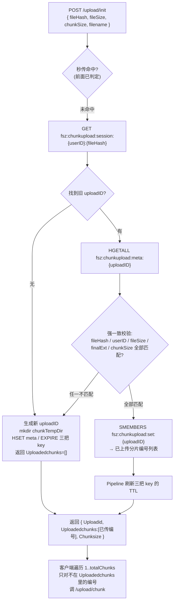

**为什么必须做"强一致校验"？** 想象一下反例：用户先用 500MB 视频 A 开了一个会话传了 3 片，然后又选了另一个 200MB 视频 B（碰巧 SHA256 已经变了但客户端 bug 传错 hash），如果不校验 `file_size / chunk_size / total_chunks`，就会把 B 的分片写到 A 的临时目录里、`SADD` 到同一个 set 里，最终合并出来的是**混合文件**、hash 校验通不过，前面传的 3 片全废。

`reuseUploadSession` 里的这段就是保护：
```go
if len(meta) == 0 ||
    meta["file_hash"] != fileHash ||
    meta["user_id"] != strconv.FormatUint(userID, 10) ||
    meta["file_size"] != strconv.FormatInt(fileSize, 10) ||
    meta["final_ext"] != finalExt {
    return "", nil, 0, nil // 视为新会话
}
```
任一字段不一致就**放弃复用、开新会话**，绝不复用一个可能被污染的会话。

**分片上传时的关键防御**（[`uploadvideochunklogic.go`](d:\feedsystem-zero-main-git\apps\gateway\internal\logic\uploadvideochunklogic.go)）：

1. **归属校验**：`meta["user_id"] != userID` → 403，防止 A 用户拿到 B 的 uploadID 越权上传；
2. **分片大小精确校验**：非末片必须等于 `chunkSize`、末片必须等于 `fileSize - chunkSize*(totalChunks-1)`——`written != expectedChunkBytes` 立刻拒绝，防止传半片污染合并结果；
3. **边写边算 SHA256**：`io.MultiWriter(dst, hasher)` 落盘的同时算 hash，若 `EnableChunkHashValidate=true` 就与前端传来的 `chunkHash` 比对，不一致直接删除临时文件返回 400；
4. **原子落盘**：先写 `chunk_{idx}.{rand}.tmp`，全部写完、校验通过后才 `os.Rename` 成 `chunk_{idx}`——**任何一步失败都不会留下半吊子的正式分片**，续传时下一次上传同一个 index 会覆盖，`SADD` 幂等；
5. **响应体带上最新的 `Uploadedchunks`**：客户端每次收到 chunk 响应都拿到"截至现在服务端已确认收到的所有分片编号"，网络重传时客户端可以对齐重试。

**合并阶段的防重入 + 二次校验**（[`completevideouploadlogic.go`](d:\feedsystem-zero-main-git\apps\gateway\internal\logic\completevideouploadlogic.go)）：

1. **分布式合并锁**：`SETNX fsz:chunkupload:lock:{uploadID} = randomToken, EX 5min`——防止两个 tab 同时点"完成上传"或客户端超时重试导致并发合并同一文件；释放锁用 Lua `if get==token then del` 保证不会误删别人的锁；
2. **完整性校验**：`len(uploadedChunks) != totalChunks` 或缺任一编号 → `FailedPrecondition`；
3. **秒传兜底**：如果发现 `finalVideoFilePath(fileHash)` 已经存在（比如上次合并成功但响应丢了、客户端重试），直接校验它的 hash 是不是等于本次 `fileHash`，一致就跳过合并、直接进入 `finishCompletedUpload`——**天然幂等**；
4. **合并全量校验**：按 index 顺序读取 `chunk_1..N` 一边写入 `finalPath.tmp` 一边算 SHA256，最终 `written != fileSize` 或 `actualHash != fileHash` 立刻失败并删除 tmp 文件——**决不让一份哪怕字节数对但内容错的文件进入 `file_assets`**；
5. **登记 + 清理原子化**：`finishCompletedUpload` 里用 `TxPipeline` 一次性 `SET 秒传双 key + DEL meta / set / session`，然后 `RemoveAll(chunkTempDir)`——会话数据、临时分片、秒传缓存三者最终态强一致。

**一句话总结断点续传**：

> **`(userID, fileHash) → uploadID` 反向索引** + **`meta` 强一致校验** + **`set` 已传编号集合** + **临时分片"tmp 落盘 → 原子 rename"** + **合并阶段分布式锁 + 全量 hash 校验** —— 五重保障共同实现了"任意时刻中断都能从下一个未传分片继续、绝不会因为续传而合并出错误文件"的分片上传语义。客户端要做的仅仅是"每次 init 都发 fileHash，然后跳过响应里 `Uploadedchunks` 已有的编号"这么简单。

**服务端资产登记时序（三条路径未命中秒传后的公共合流点）**：

以下时序图展开的是**路径 ②/③ 落盘后到 `file_assets` 登记完成**的服务端细节，以及后续 `PublishVideo` 事务如何 `ref_count+=1`、`asset_cleanup` Job 如何延迟物理清理——路径 ①（真秒传）直接从 MySQL 拿到 URL 后跳到最下方 `/video/publish` 环节，中间的落盘和 `upsertFileAsset` 都不经过。

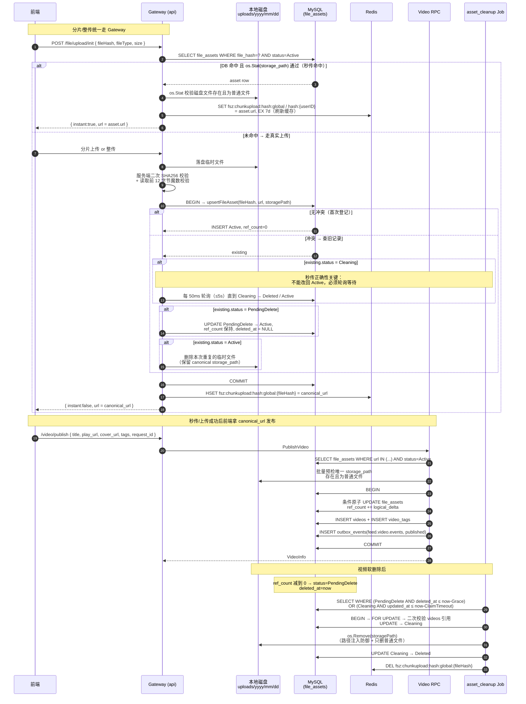

**关键点**：`ref_count` 调整与 `videos` 创建/软删除必须在 **video-rpc 同一事务内**。发布前，`preparePublishFileAssets` 用一条 `WHERE url IN (...)` 查询批量加载视频与封面资产，并在事务外检查每个唯一 `storage_path` 是否为真实普通文件；事务内再以 `id + url + storage_path + status=Active` 为条件原子增加引用。任一条件失效都会使 `RowsAffected=0` 并回滚整个发布事务，要求客户端重新上传。

#### 8.2.1 PublishVideo 多资产条件更新保序（防死锁）

一条视频最多涉及两个 `file_assets` 行：`play_url` 与 `cover_url`。条件 `UPDATE` 本身会获取排他行锁；若两个并发事务分别以 `A→B` 和 `B→A` 更新同两个资产，仍会形成经典锁序反转死锁。

`aggregateFileAssetRefs` 会对 URL **去重、统计逻辑引用数并升序排列**，事务体统一按该顺序调用 `reservePreparedPublishFileAsset`。任何发布或删除事务的资产更新顺序都相同；当 `play_url == cover_url` 时，只执行一次 `ref_count = ref_count + 2`，无需重复查询、校验和更新。

- 单元测试：`fileassethelper_test.go` 覆盖 URL 聚合保序、重复 URL 的 `Delta=2`、缺失文件以及条件原子 UPDATE 的 SQL 约束。
- 显式 `SELECT FOR UPDATE` 已被移除，但条件 `UPDATE` 自身仍会持有行锁，并通过 `status=Active` 阻止 `Cleaning/PendingDelete` 资产被重新引用。

#### 8.2.2 `preparePublishFileAssets` / `buildPreparedPublishFileAssets` 双函数拆解

发布视频的"资产预检两步曲"位于 [`apps/video/internal/logic/fileassethelper.go`](../apps/video/internal/logic/fileassethelper.go)，在真正进入事务、抢行锁之前一次性完成"批量拉取 + 磁盘校验 + 打包 CAS 素材"。

**核心设计理念**：**磁盘 `os.Stat` 是慢 I/O、事务持有行锁是稀缺资源**——两者绝不能捆绑。所以把批量 SELECT 和 `os.Stat` 全部**前置到事务外**做（失败尽早、行锁持有时间毫秒级），事务里只留一件事——按字典序、按 asset 逐个跑条件 UPDATE `ref_count += Delta`。

##### 数据流全景

```
输入：urls = ["videoURL", "coverURL"]
   │
   ▼
【preparePublishFileAssets】负责 I/O
   ├─ ① aggregateFileAssetRefs：去空 + 计数聚合 + 字典序排序
   │    ├─ 常规：{"videoURL":1, "coverURL":1}
   │    └─ 特殊：playURL == coverURL → {"sameURL":2}   ← Delta=2
   │    输出：[]fileAssetRef（按 URL 字典序）
   ├─ ② orderedURLs = ["coverURL","videoURL"]
   └─ ③ 一条 SQL 批量查：
        SELECT id, url, storage_path
        FROM file_assets
        WHERE url IN (?) AND status = ACTIVE
        ↑ 非 ACTIVE 直接在 SQL 层被过滤掉、不会带回 Go 侧
   │
   ▼
【buildPreparedPublishFileAssets】纯内存配对与校验（无 I/O、无 ctx / db，天然可单测）
   ├─ ① 建 assetsByURL map（slice → map，O(1) 查找）
   └─ ② 按 refs 字典序遍历：
        ├─ map 里没有该 URL → 报 publishFileAssetError 包 ErrRecordNotFound
        │  （URL 伪造 / 资产被 clean job 降级为 PendingDelete）
        ├─ validatePublishAssetFile(storagePath) 磁盘三重校验：
        │    ├─ path 非空
        │    ├─ os.Stat 成功、且不是 os.ErrNotExist
        │    └─ info.Mode().IsRegular()（拒绝目录/软链/设备文件）
        │  失败 → 报 publishFileAssetError 包 errFileAssetStorageUnavailable
        └─ 通过 → 拼装 preparedPublishFileAsset{ ID, URL, StoragePath, RefDelta }
   │
   ▼
输出：[]preparedPublishFileAsset（按字典序、CAS 素材包）
```

##### `preparePublishFileAssets`——负责 I/O

1. **`aggregateFileAssetRefs(urls...)` 去空 + 计数聚合 + 字典序排序**：
   - `strings.TrimSpace` 过滤空 URL；`counts[url]++` 计数——**同 URL 的引用被合并成一个 Delta**。
   - `play_url == cover_url` 时 `Delta = 2`——**必须 +2 而不是 +1**，因为软删时 `videos` 记录会同时释放 playURL 和 coverURL 两次（`-2`），若 reserve 只 +1，release -2 会把 `ref_count` 打到 -1 造成漂移。
   - `sort.Strings(orderedURLs)` 按字典序排序——**这是消灭死锁的关键**（详见 8.2.1）。
2. **`len(refs) == 0` 短路**：所有 URL 都是空字符串（被 `TrimSpace` 洗掉）时直接返回 `nil, nil`，不报错。
3. **一条 SQL 批量查**：
   - `Select("id","url","storage_path")` 显式列裁剪——只取事务内 CAS 所需的三个字段，减少 MySQL→Go 传输和 gorm 反射赋值开销。
   - `WHERE url IN (?) AND status = ACTIVE`——**在 SQL 层就过滤掉非 ACTIVE 状态**（`PendingDelete/Cleaning/Deleted` 都不会带回 Go 侧）。
   - `Find(&assets)` 而不是 `First`——`Find` 不把"找不到全部"当错误、把"哪些 URL 缺失"的判定下沉给 `buildPreparedPublishFileAssets`。
4. **把 refs（期望）和 assets（实际）交给下游做配对**——**职责分离**：本函数只管 I/O、下游是纯函数便于单测。

##### `buildPreparedPublishFileAssets`——纯内存配对与校验

1. **`assetsByURL` map 索引**：把 `[]FileAsset` slice 索引成 `map[url]FileAsset`，让后续按 URL 查找从 O(N×M) 降到 O(N+M)。
2. **按 refs 的字典序遍历**（不是遍历 assets）——保证返回的 `prepared` slice 也是字典序，供下游事务按序抢行锁。
3. **两重校验**：
   - **map 里没有该 URL** → 返回 `&publishFileAssetError{URL, Err: gorm.ErrRecordNotFound}`；触发场景：URL 伪造、上传后没在有效期内发布被 clean job 扫成 `PendingDelete`、上传流程异常导致 `file_assets` 没落成 ACTIVE。
   - **`validatePublishAssetFile(storagePath)` 磁盘三重校验**：
     - `strings.TrimSpace(path) == ""` → 拒绝（DB 脏数据）；
     - `os.Stat` + `errors.Is(err, os.ErrNotExist)` → 拒绝（**防止"DB 记录还在但磁盘文件被误删"的数据漂移，让用户不会发布出永远播放失败的视频**）；
     - `info.Mode().IsRegular()` → 拒绝目录/软链接/设备文件（防御性检查、防止路径被换成攻击路径）。
     - 失败 → 返回 `&publishFileAssetError{URL, Err: fmt.Errorf("validate asset_id:%d: %w", asset.ID, errFileAssetStorageUnavailable)}`——`%w` 保留 sentinel 供 `errors.Is` 判类型，同时追加 `asset_id` 便于日志排查。
4. **拼装 CAS 素材包 `preparedPublishFileAsset{ID, URL, StoragePath, RefDelta}`**——四个字段在下游事务里各有精确用途：

| 字段 | 事务内用途 |
|------|-----------|
| `ID` | UPDATE WHERE 主键定位 |
| `URL` | **CAS 条件字段**——预检快照 vs 事务时实际值 |
| `StoragePath` | **CAS 条件字段**——防止 URL 被重命名或路径迁移 |
| `RefDelta` | UPDATE SET `ref_count = ref_count + RefDelta` |

##### 错误链设计（Go 1.13+ error wrapping）

`publishFileAssetError` 实现了 `Unwrap()`，且携带 `URL` 字段——外层可以：

- 用 `errors.Is(err, gorm.ErrRecordNotFound)` 或 `errors.Is(err, errFileAssetStorageUnavailable)` 判断**具体不可用原因**；
- 用 `errors.As(err, &assetErr)` 提取 `URL` 定位到出问题的具体资产；
- `unavailablePublishFileAssetURL` 就是这样把 URL 提取出来，让顶层 `PublishVideo` 里 `invalidPublishAssetError` 精确区分是 playURL 还是 coverURL 出问题，返回不同的中文错误给客户端。

##### 与事务内 CAS 的联动（`reservePreparedPublishFileAsset`）

下游事务里的 `updatePreparedPublishFileAssetRef` 用的 WHERE 条件：

```go
Where("id = ? AND url = ? AND storage_path = ? AND status = ?",
      asset.ID, asset.URL, asset.StoragePath, model.FileAssetStatusActive)
```

**四个条件字段全都是预检时拍下来的快照**——如果事务开始后任何一个字段被并发改动（状态被降级为 `PendingDelete`、URL 被重命名、storage_path 被迁移），UPDATE 命中 0 行 → `RowsAffected == 0` → `reservePreparedPublishFileAsset` 返回 `publishFileAssetError{Err: ErrRecordNotFound}` → 整个发布事务回滚。**这就是"事务外乐观预检 + 事务内条件写"组合成的 CAS**，避免了"预检 OK 但入库时资产已被删"的漏洞。

##### 精心设计的 4 个关键点总结

| # | 设计 | 解决的问题 |
|---|------|-----------|
| ① | **聚合同 URL 的 Delta** | `play_url == cover_url` 时 `ref_count += 2`、防止软删漂移 |
| ② | **`sort.Strings` 字典序排序** | 所有并发事务按同一顺序抢行锁——从根本上消灭死锁 |
| ③ | **批量 SELECT + 事务外 `os.Stat`** | 磁盘 I/O 不占用行锁、事务持锁时间毫秒级 |
| ④ | **返回 `{id, url, storage_path, refDelta}`** | 供事务内 CAS UPDATE 使用、防止预检-写入之间的并发状态漂移 |

#### 8.2.3 PublishVideo 端到端流程七阶段总览

`PublishVideo` 位于 [`apps/video/internal/logic/publishvideologic.go`](../apps/video/internal/logic/publishvideologic.go)，是整个视频模块最复杂的写路径。它把参数校验、幂等预检、资产预检、事务写入、缓存失效串成一条完整链路，可以拆分成 **"三前置 + 一事务 + 三分流"** 七大阶段：

##### 阶段全景

```
① 参数校验 + 标签两级降级
        ↓
② 事务外幂等预检 #1（loadVideoByAuthorRequestID）
   命中 → idempotentPublishResponse 直接返回
        ↓
③ 事务外资产预检（preparePublishFileAssets：聚合 + 排序 + 批量 SELECT + 磁盘校验）
        ↓
④ 预生成 outbox eventID（事务外做、避免占用行锁）
        ↓
⑤ 开启事务
   ├─ 5.1 for CAS UPDATE file_assets.ref_count += Delta（按字典序）
   ├─ 5.2 INSERT videos（撞 uk_video_request 唯一键 → errDuplicateVideoRequest）
   ├─ 5.3 INSERT tags ON CONFLICT(name) DO NOTHING
   ├─ 5.4 SELECT tags WHERE name IN (?) 回读 tag.ID
   ├─ 5.5 INSERT video_tags ON CONFLICT(video_id, tag_id) DO NOTHING
   └─ 5.6 INSERT outbox_events(video.published, status=Pending)
        ↓
⑥ 事务失败三分流 / 事务成功 invalidateVideoEntityCache
        ↓
⑦ 返回 VideoInfo + "发布成功"
```

##### 阶段 ① 参数校验 + 标签两级降级

- **必填字段全校验**：`authorID / authorUsername / title / playURL / coverURL / requestID` 缺一不可。
- **`requestID` 是幂等三道防线的核心**：非空校验 + 长度上限 128（防注入）；gateway 层会为老客户端兜底生成、这里再兜一层强制要求，防止直接跨服务调用绕过 gateway。
- **标签两级降级**：`normalizeTags(in.GetTags())` 先规范化前端传入 → 若为空则 `extractTags(title + " " + description)` 从标题描述里抽 `#xxx` 兜底 → `maxVideoTags=20` 硬上限。

##### 阶段 ② 事务外幂等预检 #1 —— `loadVideoByAuthorRequestID`

用**独立的 DB 连接**按 `(author_id, request_id)` 查 `videos` 表——**这是三道幂等防线的第一道**，专门处理"客户端网络超时后正常重试"这类**大概率会命中**的场景：

- 命中 → `idempotentPublishResponse` 直接返回原视频，**并额外校验 PlayURL/CoverURL 是否一致**（防止同一 requestID 被复用发不同内容 → 返回 `AlreadyExists`）。
- 未命中 → 继续走首次发布流程。

**为什么不放事务里做**：这个 SELECT 只是幂等预判、和后续写入没有原子性绑定；放事务外能避免大量重试请求空占 DB 事务/行锁资源。真并发首发时会走第三道防线（唯一键 + 事务后回读）兜底。

##### 阶段 ③ 事务外资产预检 —— `preparePublishFileAssets`

详见 8.2.2。核心产出是 **CAS 素材包 `[]preparedPublishFileAsset{ID, URL, StoragePath, RefDelta}`**——每一个字段都会作为事务内 UPDATE 的 WHERE 条件。**磁盘 `os.Stat` 三重校验和批量 SELECT 全部前置到事务外**，让事务持锁时间压缩到毫秒级。

##### 阶段 ④ 预生成 outbox eventID

`newEventID("video_published")` 在事务外生成——**任何可以事务外做的事都不占用行锁**是本项目一贯的设计哲学。事务里只需要把 `eventID + createdVideo.ID + payload` 组装成 envelope 后 INSERT outbox_events 即可。

##### 阶段 ⑤ 事务体六步原子操作

`gormDB.Transaction(func(tx) error { ... })` 内**六个原子步骤**任何一步失败都会自动 ROLLBACK：

| 步骤 | 操作 | 关键设计 |
|------|------|---------|
| **5.1** | `for _, asset := range preparedAssets { reservePreparedPublishFileAsset(tx, asset) }` | 按字典序、CAS UPDATE 四字段快照（见 8.2.4） |
| **5.2** | `tx.Create(&createdVideo)` | 撞 `uk_video_request(author_id, request_id)` 唯一键 → `isDuplicateKeyError` → 返回 `errDuplicateVideoRequest`（幂等第二道防线）|
| **5.3** | `tx.Clauses(OnConflict{Columns:name, DoNothing:true}).Create(&tagRows)` | 标签表按 `name` 唯一键幂等 INSERT |
| **5.4** | `tx.Where("name IN ?", tags).Find(&savedTags)` | **必须回读**：DoNothing 冲突时 `tagRows[i].ID=0`、无法建关联，必须再 SELECT 一次拿真实 ID |
| **5.5** | `tx.Clauses(OnConflict{Columns:video_id+tag_id, DoNothing:true}).Create(&videoTags)` | 一条 SQL 批量建关联、冲突忽略 |
| **5.6** | 序列化 `eventx.FeedVideoEvent + Envelope` → `tx.Create(&OutboxEvent{Status:Pending})` | 与 videos 同事务，杜绝"视频已发布但下游无感知" |

**关键不变式**：`file_assets.ref_count +=1`、`INSERT videos`、`INSERT outbox_events` **必须在同一本地事务内**——任一步失败全部回滚，从根本上杜绝以下三类漂移：

- ❌ "视频存在但 ref_count 被回滚" → CDN 播放但资产 ref_count=0 被 Job 误清理；
- ❌ "ref_count 已加但视频未创建" → 资产孤儿引用、永远不会被清理；
- ❌ "视频已发布但下游无感知" → feed/推荐/通知模块永远收不到事件。

##### 阶段 ⑥ 事务失败的三分流精准返回

事务返回的 error 会被外层用 `errors.Is / errors.As` 精确分流成**三种完全不同的用户响应**：

| 分流 | 触发条件 | 用户响应 | HTTP 语义 |
|------|---------|---------|----------|
| **A. CAS 失败** | `errors.As(err, &publishFileAssetError)` + `errors.Is(err, ErrRecordNotFound / errFileAssetStorageUnavailable)` | 区分 playURL/coverURL → "视频/封面资源不存在或已失效，请重新上传" | 400 InvalidArgument |
| **B. 撞唯一键**（幂等第三道防线） | `errors.Is(err, errDuplicateVideoRequest)` | 独立连接 `loadVideoByAuthorRequestID` 拿"胜出者" → `idempotentPublishResponse` | **200 成功**（幂等语义）|
| **C. 其他 DB 错误** | 兜底 | "发布视频失败" | 500 Internal |

**最漂亮的地方**：分流 B 的 `errDuplicateVideoRequest` 虽然是 Go 层的 error、但**用户视角是成功**——意味着"你的另一个请求（或另一个协程）已经赢了、我把结果给你"。这就是**幂等语义的精确表达**：**同一 `request_id` 下无论重放多少次、返回的都是同一条视频、且视频只被真正创建一次**。

##### 阶段 ⑦ 缓存失效 + 返回

事务成功后 `invalidateVideoEntityCache(RedisCli, videoID)`——失败仅记日志、**不影响给客户端的响应**（缓存最终一致性、下次读时会回源）。最后 `toVideoInfo` 序列化后返回 `VideoInfo + "发布成功"`。

##### 三道幂等防线全景

| 防线 | 位置 | 处理场景 | 处理方式 |
|------|------|---------|---------|
| **第一道** | 阶段 ② 事务外 `loadVideoByAuthorRequestID` | 客户端正常网络重试（大概率命中）| 直接返回原视频、不进事务 |
| **第二道** | 阶段 ⑤.2 DB 唯一键 `uk_video_request(author_id, request_id)` | 毫秒级真并发首发（预检漏网） | INSERT 撞键、事务整体 ROLLBACK（含已 reserve 的 ref_count）|
| **第三道** | 阶段 ⑥.B 事务后独立连接再查 | 兜底：确保撞唯一键的请求也能拿到胜出者结果 | `idempotentPublishResponse` 返回胜出者、用户无感 |

---

#### 8.2.4 file_assets UPDATE 并发安全的四层机制协同

`reservePreparedPublishFileAsset` 里对 `file_assets` 的 UPDATE 是整个项目最典型的**并发控制样板**。它的并发安全性**不是靠单一机制**、而是**四层机制协同**的结果——**每一层单独用都有致命漏洞、缺一不可**：

```go
db.WithContext(ctx).
    Model(&model.FileAsset{}).
    Where(
        "id = ? AND url = ? AND storage_path = ? AND status = ?",  // ← 第 3 层：CAS 快照
        asset.ID, asset.URL, asset.StoragePath, model.FileAssetStatusActive,
    ).
    Updates(map[string]any{
        "ref_count":  gorm.Expr("ref_count + ?", asset.RefDelta),   // ← 第 2 层：原子表达式
        "deleted_at": nil,
    })
// ← 第 1 层：MySQL 自动持 X 锁；第 4 层：调用前 sort.Strings 保序
```

##### 四层机制的分工矩阵

| 层次 | 手段 | 防的具体并发问题 | 单独用够不够 |
|------|------|-----------------|-------------|
| **① MySQL 行锁** | InnoDB `UPDATE` 自动持 X 锁至事务提交 | 同一时刻两条 UPDATE 冲突（SQL 层串行化）| ❌ 防不住丢失更新 |
| **② 原子 SQL 表达式** | `gorm.Expr("ref_count + ?", Delta)` | Lost Update（读旧值再覆盖）| ❌ 防不住状态漂移 |
| **③ 乐观锁 CAS 快照** | `WHERE id=? AND url=? AND storage_path=? AND status=ACTIVE` | 预检-写入间隙的并发状态漂移（用户 vs Job / DBA）| ❌ 防不住多行死锁 |
| **④ 字典序抢锁** | `sort.Strings(orderedURLs)` | 多行 UPDATE 的循环等待死锁 | ❌ 单用不完整 |
| **① + ② + ③ + ④ 协同** | 四位一体 | 全部并发问题 | ✅ 完美 |

##### 第 1 层：MySQL 行锁 —— 保证 SQL 层串行化

InnoDB 下 `UPDATE ... WHERE ...` 会**自动对目标行加排他锁（X 锁）**，直到当前事务 COMMIT / ROLLBACK 才释放。它保证两条并发 UPDATE 不会同时进入执行、后到者阻塞等待。

**它防的是**：两条 UPDATE 同时执行产生的原子性冲突。
**它防不住**：读-算-写间隙的 Lost Update、预检快照失效、跨行死锁。

##### 第 2 层：原子 SQL 表达式 —— 消灭 Lost Update

**反例（错误写法）**：

```go
// ❌ 先 SELECT 读出、应用层 +1、再 UPDATE 写回
var asset model.FileAsset
tx.Where("id = ?", id).First(&asset)              // 读到 ref_count = 5
tx.Model(&asset).Update("ref_count", asset.RefCount+1)  // 写回 6
```

并发下：A 读 5、B 读 5、A 写 6、B 写 6——**丢了一次引用**、后续 cleanup Job 会提前误删还在用的文件。

**正例（项目写法）**：

```go
"ref_count": gorm.Expr("ref_count + ?", asset.RefDelta)
```

**渲染成 SQL 是 `SET ref_count = ref_count + 1`**——MySQL 在持有行锁的**同一个原子操作**内完成"读 + 算 + 写"，永远不会出现"读到旧值再覆盖"的漏洞。

**类比 Java `AtomicInteger.incrementAndGet()`**：它的线程安全**不是**因为方法加了 `synchronized`、**而是**因为用 CPU CAS 指令做原子的读-改-写；MySQL 里 `SET x = x + 1` 完全同理——**真正的原子性来自 SQL 表达式本身、行锁只是配合**。

##### 第 3 层：乐观锁 CAS 快照 —— 防状态漂移

WHERE 四字段：`id` 是定位字段，`url / storage_path / status = ACTIVE` **全部是预检时拍下来的快照**。触发 CAS 失败（`RowsAffected == 0`）的三大场景：

| 场景 | 谁改动了字段 | 后果 |
|------|-------------|------|
| **`status` 被 Job 抢先降级** | `asset_cleanup` Job 把 ACTIVE 改成 Cleaning/PendingDelete | 磁盘文件可能已被删、拒绝写入 |
| **`url` 被并发改动** | 运维脚本重命名 CDN URL | 快照失效、拒绝写入 |
| **`storage_path` 被并发改动** | 磁盘迁移工具改路径 | 快照失效、拒绝写入 |

**共同本质**：预检时看到的世界 vs 事务写入时的世界发生了变化——**行锁只锁"同一时刻的行"、锁不住"预检和 UPDATE 之间的间隙"**。CAS 快照就是 SQL 层的 Compare-And-Swap，专门补这个洞。

##### 第 4 层：字典序抢锁 —— 消灭死锁

如果不排序、两个用户同时发布并引用同两个资产：

```
用户 A：锁 URL_x → 想锁 URL_y（等待 B）
用户 B：锁 URL_y → 想锁 URL_x（等待 A）
→ 循环等待、MySQL 死锁检测器强制回滚一个事务
```

`aggregateFileAssetRefs` 里的 `sort.Strings(orderedURLs)` 保证**所有并发事务按同一顺序抢多行的锁**——永远只有"后到者等前到者"、**从根本上消灭循环等待**。这是**资源排序法**在 DB 场景的经典应用。

##### 单独用任一层会翻车的反例场景

**只有行锁没有 CAS 快照**：

```
T0：preparePublishFileAssets 读 status=ACTIVE
T1：asset_cleanup Job：UPDATE status=PendingDelete → COMMIT、行锁释放
T2：Job 继续 UPDATE status=Cleaning → 物理 os.Remove(disk) → status=Deleted → COMMIT
T3：发布事务：UPDATE ref_count += 1 WHERE id=?（没检查 status！）
     ↑ 行锁没人持、正常拿到、原子 +1 也没问题
     ↑ 但 status 已经是 Deleted、磁盘文件已经被删！
T4：用户点开视频 → 404 事故
```

**行锁救不了这个场景**——T3 时刻的资产行锁根本没人持有、UPDATE 顺利执行——**必须有 `AND status = ACTIVE` 的 CAS 快照检查**才能在 T3 时刻发现"世界已经变了、拒绝写入"、触发事务回滚、返回客户端 400 让用户重传。

##### 核心心智模型

**行锁只锁"同一时刻的行"、锁不住"预检和 UPDATE 之间的间隙"、也解决不了"读出来再写回去"的丢失更新**——**并发安全 = 行锁 + 原子表达式 + CAS 快照 + 字典序**、四位一体、缺一不可，这才是"事务外乐观预检 + 事务内 CAS 条件写"能真正 work 的底层数学基础。

---

**file_assets 四状态机（commit 687d0ab 完善）**：

| 状态 | 含义 | 可秒传 | 可被 asset_cleanup 抢占 |
|---|---|---|---|
| `Active(1)` | 正常引用中（ref_count 可为 0 但仍在 grace 期） | ✅ | ref_count=0 且过了 GraceSeconds |
| `PendingDelete(2)` | 最后一个引用删除后标记待删 | ❌ | ✅ |
| `Cleaning(4)` | 已被 asset_cleanup 临时抢占，即将物理删除 | ❌（轮询等待） | 只能同一抢占者推进 |
| `Deleted(3)` | 已物理删除（**软删除标记，DB 行仍存在**） | ❌（但可被复活） | ❌ |

**四状态在"上传路径 `upsertFileAsset`"视角下的判定与差异**：

DB 中"记录存在与否"和"status 字段值"是**两件完全不同的事**——尤其是 `Deleted` 状态（DB 行还在、只是 status 字段值为 3）与"行被 asset_cleanup Job 从表里 `DELETE` 掉"（行彻底不存在）**必须严格区分**，这直接决定了 `upsertFileAsset` 的 SELECT 循环里走 `break` 还是 `return`：

| 情况 | DB 行 | 磁盘文件 | SELECT 结果 | upsertFileAsset 行为 |
|---|---|---|---|---|
| **状态 = Active** | 存在（status=1） | 存在 | ✅ 拿到行 | `break` 出循环 → 走"路径调节"分支（同路径直接复用；不同路径删多余副本或修复丢失文件） |
| **状态 = PendingDelete** | 存在（status=2） | 存在 | ✅ 拿到行 | `break` 出循环 → 走"复活"分支：`os.Stat` 校验磁盘文件 + CAS `WHERE id=? AND status=?` 改回 Active |
| **状态 = Cleaning** | 存在（status=4） | 即将被 os.Remove | ✅ 拿到行 | **不 break**，进入 `select { ctx.Done, time.After(50ms) }` 轮询等待，直到状态变化或 5s 超时 |
| **状态 = Deleted** | 存在（status=3） | 已被物理删除，但 DB 行仍作为"墓碑"保留 | ✅ 拿到行 | `break` 出循环 → 走"复活"分支：`os.Stat(storagePath)` 校验**本次刚落盘的新副本**在磁盘上，然后 CAS `Deleted → Active` |
| **行被物理 DELETE** | ❌ 不存在（asset_cleanup 在极少数场景下会硬删行；或行还没被创建） | ❌ 不存在 | ❌ `record not found` | `return err` **退出整个函数**——调用方拿到错误后重试整个 `upsertFileAsset`，重试时段落 2 的 `INSERT ... ON CONFLICT DO NOTHING` 会成功走"全新插入"分支 |

**关键区别（回答"为什么 Deleted 是 break、record not found 是 return"）**：

- **`Deleted` 状态是"软删除标记"**：DB 行还在表里，只是 `status` 字段值改成了 3、`deleted_at` 打了时间戳。此时 `existing` 有完整数据（`id/file_hash/file_type` 全都能读到），完全可以通过 CAS `UPDATE WHERE id=? AND status=Deleted` **原子复活**——`break` 出循环让复活路径继续处理。
- **"行被物理 DELETE"是"硬删除"**：整行从表里消失，SELECT 返回 `gorm.ErrRecordNotFound`，`existing` 是零值结构体、没有任何有效字段可用来做后续决策——**必须 return** 让调用方从头重试。重试时 `file_hash` 唯一键约束已消失，段落 2 的幂等 INSERT 会插入全新行，走情况 A 完成登记。
- **`Cleaning` 之所以既不 break 也不 return，而是"等"**：Job 的 `os.Remove` 已在飞行途中且不可撤销，上传路径贸然把 status 改回 Active 会导致"DB 说资产活着但磁盘文件被 Job 顺手删了"的错乱——唯一安全的选择是让 Job 先干完，等 status 稳定到 `Deleted`（或整行被 DELETE）后再决策。

**上传路径决策一览（配合 `upsertFileAsset` for 循环阅读）**：

```
                          段落 2: INSERT ... ON CONFLICT DO NOTHING
                                     │
                    ┌────────────────┴────────────────┐
             RowsAffected==1                    RowsAffected==0
             （全新插入成功）                    （hash 已存在）
                    │                                 │
                 return                       段落 3: for { SELECT }
                                                      │
                    ┌─────────┬──────────┬────────────┼────────────┐
                    ▼         ▼          ▼            ▼            ▼
              record       类型冲突   Cleaning     Active       Deleted /
              not found                                        PendingDelete
                    │         │          │            │            │
                 return    return   等 50ms         break         break
                                    继续循环          │            │
                                                     ▼            ▼
                                              段落 5:         段落 4:
                                              路径调节         复活 (CAS)
                                              return          return
```

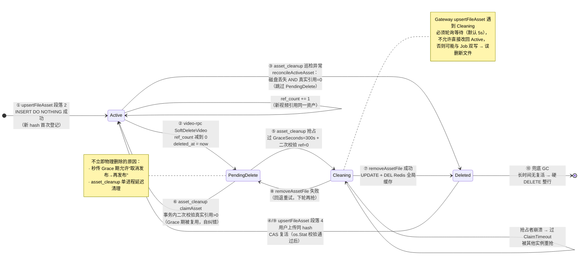

**完整状态转换表（每条边的触发者、前置条件、代码位置）**：

| # | From → To | 触发者 | 前置条件 | 代码位置 |
|---|---|---|---|---|
| ① | ∅ → Active | Gateway 上传路径 | 该 hash 从未在 `file_assets` 存在 | `upsertFileAsset` 段落 2：`INSERT ... ON CONFLICT DO NOTHING`，`RowsAffected==1` |
| ② | Active → PendingDelete | video-rpc 软删除 | 视频软删除后该资产 `ref_count` 减到 0 | `SoftDeleteVideo` 事务内 `UPDATE status=PendingDelete, deleted_at=NOW()` |
| ③ | **Active → Deleted**（异常跳过） | asset_cleanup 巡检 | `reconcileActiveAsset` 发现磁盘文件已丢失 **且** 真实 `videos` 引用=0 | `cleaner.go` `reconcileActiveAsset`：`fileExists==false && actualRefs==0` |
| ④ | Deleted → Active | Gateway 上传路径 | 用户上传同 hash，本次副本 `os.Stat` 通过 | `upsertFileAsset` 段落 4：CAS `UPDATE ... WHERE id=? AND status=Deleted SET status=Active` |
| ⑤ | PendingDelete → Cleaning | asset_cleanup 抢占 | `deleted_at ≤ now - GraceSeconds(300s)` **且** 事务内 `SELECT FOR UPDATE` 二次校验 `ref_count=0` 且真实引用=0 | `cleaner.go` `claimAsset`：`UPDATE status=Cleaning` |
| ⑥ | PendingDelete → Active（Job 自纠错） | asset_cleanup 抢占 | `claimAsset` 二次校验发现真实 `videos` 引用>0（Grace 期内被新视频复用） | `cleaner.go` `claimAsset`：`activeRefs>0` 分支 `UPDATE status=Active, ref_count=activeRefs, deleted_at=NULL` |
| ⑦ | Cleaning → Deleted | asset_cleanup 清理 | `removeAssetFile` 成功 `os.Remove` | `cleaner.go` `cleanOne`：`UPDATE ... WHERE status=Cleaning AND ref_count=0 SET status=Deleted`，并 `DEL fsz:chunkupload:hash:global:{hash}` |
| ⑧ | Cleaning → PendingDelete（回退） | asset_cleanup 清理失败 | `removeAssetFile` 报错（I/O、权限、context 超时） | `cleanOne` 失败分支：`UPDATE ... SET status=PendingDelete`，等下一轮重试 |
| ⑨ | Deleted → Active | 同 ④ | 说明这条边可以被上传路径反复触发（每次同 hash 上传都能复活） | 同 ④ |
| ⑩ | Deleted → ∅ | GC 兜底 | 长时间无复活的 Deleted 行被硬删除 | 兜底 GC（`DELETE FROM file_assets WHERE ...`） |

**五类边分类速览**：

| 类别 | 边 | 语义 |
|---|---|---|
| **主干路径** | ① → ② → ⑤ → ⑦ | 新登记 → 引用归零 → 抢占清理 → 物理删除完成，正常生命周期 |
| **复活边** | ④/⑨ Deleted→Active、⑥ PendingDelete→Active | 上传复活 & Job 自纠错——**资产可反复复用**是软删除+内容寻址的核心 |
| **回退边** | ⑧ Cleaning→PendingDelete | 清理失败不卡死在 Cleaning，回退等待下轮 |
| **异常跳过** | ③ Active→Deleted | 磁盘已丢失+无引用，无需走 PendingDelete 宽限期，直接标 Deleted |
| **终点边** | ⑩ Deleted→∅ | 兜底 GC，让墓碑最终消失，回到"下次新登记"的初始状态 |

**关键洞察**：
- **不是** `Active → PendingDelete → Cleaning → Deleted` 单线路径，而是**多入口、多出口、多回退、多复活**的有向图。
- **Cleaning 是极短过渡态**（只有 `os.Remove` 一次系统调用的耗时），存在的意义是**告诉其他路径"我正在删物理文件，请等我"**。
- **PendingDelete 是最长的"等待态"**（默认 300s Grace），故意留 5 分钟给"反悔"的机会（用户重传同 hash → 走边 ④；新视频引用 → 走边 ⑥）。
- **Deleted 是可复活的"墓碑"，不是终点**——只要还没被 GC 硬删除，任何时候用户上传同 hash 都能通过边 ④ 复活。这就是为什么 `file_assets` 用**软删除 + 内容寻址**，而不是每次都物理 DELETE 再重新 INSERT。
- **边 ③（Active→Deleted）是唯一跳过 PendingDelete 的边**：磁盘文件已经丢失、真实引用又是 0，说明这份资产已经彻底"不可用"，没必要再走 Grace 期宽限，直接进 Deleted 让下次上传走复活/新登记。

**秒传正确性保护**：`upsertFileAsset` 发现已存在相同 hash 的记录时，如果处于 `Cleaning` 则必须轮询等待（默认 5s），**绝不能直接将 Cleaning 改回 Active**——否则 asset_cleanup 可能在激活后删除新上传文件。若已处于 `PendingDelete/Deleted`，则以本次上传文件为准将其 UPDATE 回到 `Active`（边 ④/⑨，含 `os.Stat` 兜底防止登记死链接）。

**文件魔数二次校验**：`saveMultipartUpload` 和分片合并时都会调用 `validateUploadedFileSignature`，根据扩展名预期校验前 12 字节魔数（jpg/png/webp/mp4/webm），防止伪造后缀或传输损坏。

**上传接口统一返回 canonical URL**：`upsertFileAsset` 返回数据库中的规范副本 URL，`UploadVideo` / `UploadCover` / `CompleteVideoUpload` 均使用 `canonicalAsset.URL` 返回，避免同一 hash 因建议路径不同导致视频 play_url 不一致。

#### 8.2.5 BatchGetVideos 单版本 Key + Lua CAS 读路径

`apps/video/internal/logic/batchgetvideoslogic.go` 是 Feed / 视频卡片批量拉取的核心接口，和 `BatchGetProfiles` **底层同属"版本号+惰性重算方案 B"**，但因业务特点不同、**Key 结构与读写方案完全不同**——Video 选的是"**单版本 Key 覆盖 + JSON 内嵌版本 + Lua CAS 回写**"。

**Key 结构（见 `common/rediskey/video.go`）**：

| Key | 数据结构 | 说明 |
|---|---|---|
| `fsz:video:entity:{videoID}` | STRING(JSON) | 视频实体缓存，JSON 内**内嵌 `version` 字段**，所有版本共用同一个 key（新版本覆盖旧版本） |
| `fsz:video:entity:{videoID}:version` | STRING(int64) | 视频实体缓存版本号，`invalidateVideoEntityCache` INCR |

**与 Account 方案的核心差异对照**：

| 维度 | Account（`profile:{uid}:v:{n}`） | Video（`entity:{vid}`） |
|---|---|---|
| Key 里是否含版本号 | ✅ 含 —— 多版本共存 | ❌ 不含 —— 单版本覆盖 |
| 不同版本关系 | 不同 key 独立存在 | 同一 key 反复覆盖 |
| 旧版本清理 | 无人访问 + TTL 自然淘汰 | 写侧 `DEL` 主动清理 |
| 读侧 RTT 数 | 2 次 Pipeline（先拿版本再读实体+验证） | 1 次 Pipeline（同时读实体+版本） |
| 写侧动作 | 仅 `INCR` | `INCR` + `DEL` + Lua CAS 保护 |
| 脏数据窗口 | 双重版本校验，几乎无窗口 | 一次请求内可能返回旧值（~10ms 毫秒级） |

**读路径 5 步（`BatchGetVideos → loadVideoEntitiesFromCache → loadVideoEntitiesFromDB → cacheVideoEntityMisses`）**：

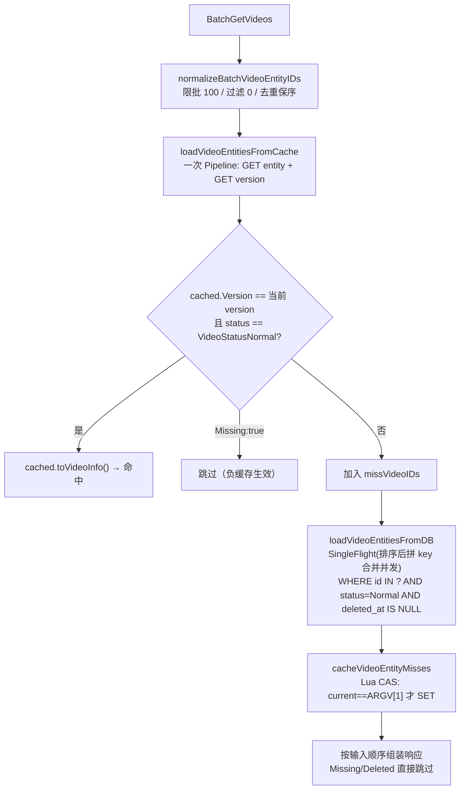

**"先读实体再读版本"命令顺序的关键性**：

`loadVideoEntitiesFromCache` 里 Pipeline 命令顺序是 `GET Entity` 后 `GET Version`——**必须是这个顺序**，反过来会导致误判为命中而返回脏数据：

| 时序 | 我方读命令 | 并发删除 |
|---|---|---|
| T1 | `GET Entity`（读到 v=5 的旧实体） | |
| T2 | | `INCR Version → 6` + `DEL Entity` |
| T3 | `GET Version`（读到 6） | |

结果：`cached.Version=5 ≠ version=6` → **不一致 → 强制回源**。若顺序反过来（先 Version 后 Entity），T1 拿到 v=5、T2 bump 到 v=6、T3 读到旧实体，`cached.Version=5 == 我方记住的 version=5`，会**误判为一致返回脏数据**。**这是 Video 单版本 Key 方案的一致性基础**。

**Lua CAS 回写（`setVideoEntityCacheIfMatch`）**：

```lua
local current = redis.call("GET", KEYS[1])   -- 当前 version
if not current then current = "0" end
if current ~= ARGV[1] then                    -- 与我方读到的 version 比较
    return 0                                   -- 版本已变 → 放弃写入
end
redis.call("SET", KEYS[2], ARGV[2], "PX", ARGV[3])
return 1
```

- **防"回源期间被删除"竞态**：T1 读缓存 miss、拿 DB 快照（版本 v=5）；T2 并发删除视频、`INCR Version → 6`；T1 若直接 `SET` 会把已删除视频的旧快照写回。用 Lua 原子比对——`current=6 ≠ ARGV[1]=5` → 放弃写入。
- **KEYS[1]** 是 version key、**KEYS[2]** 是 entity key（**两个 key 同一 Redis 槽位**才能保证 Lua 原子性——通过 hashtag 一致性设计天然满足）。
- **注释里明确写道**："Lua 在写缓存时原子比较版本，防止并发删除后旧数据库快照重新写回缓存"。

**读侧回填了什么？—— 只写实体 Key、version Key 依然由写侧独占**：

虽然 Video 方案表面上比 Account 复杂得多（多了 Lua 脚本、多了 CAS），但**"version Key 写侧独占、读侧永远只 GET 不写"这条铁律和 Account 完全一致**——这一点从 Lua 脚本本身就能看出来：

```lua
local current = redis.call("GET", KEYS[1])   -- KEYS[1] = VideoEntityVersionKey：只 GET
if not current then current = "0" end
if current ~= ARGV[1] then
    return 0
end
redis.call("SET", KEYS[2], ARGV[2], "PX", ARGV[3])   -- KEYS[2] = VideoEntityKey：只 SET 实体
return 1
```

全项目对 `VideoEntityVersionKey` 的操作只有 **2 处 GET + 1 处 INCR**：

| 位置 | 操作 | 归属 |
|---|---|---|
| `batchgetvideoslogic.go:150`（Pipeline 拿版本） | GET | 读侧 |
| `batchgetvideoslogic.go:276`（Lua CAS 内 `redis.call("GET", KEYS[1])`） | GET | 读侧（在 Lua 里） |
| `videohelper.go:162`（`invalidateVideoEntityCache` 的 `pipe.Incr`） | **INCR** | **写侧独占**（PublishVideo / DeleteVideo） |

**核心不变式：version Key 的写入权由写侧独占、读侧永远只 GET 不写**——和 Account 的分工约定完全一致（见 8.1.3 的推导反例）。**任何一边一旦允许读侧回填 version Key、就会破坏单调递增不变式、导致后续 INCR 重演历史值、旧实体缓存被误判为当前版本、造成永久性脏数据**。

**Video 与 Account 的真正差异不在"是否回填 version"、而在"回填实体时如何记住这是哪个版本的快照"**：

| 载体 | Account（多版本 Key） | Video（单版本 Key） |
|---|---|---|
| 版本数值存在哪里 | **写死在实体 Key 的名字里**（`profile:{uid}:v:5`） | **内嵌在实体 JSON 的 `Version` 字段里**（`entity:{vid}` 内容为 `{"version":5,...}`） |
| 不同版本的物理位置 | Redis 里是**独立的 Key**、天然物理隔离 | Redis 里是**同一个 Key**、后写覆盖先写 |
| 回填时如何防止并发覆盖 | 只需回填前再 GET version 比对（一次网络往返即可）——即使发生极窄窗口的"比对通过后并发 INCR"、旧快照写到旧 Key 名、后续读者根本碰不到 | **必须用 Lua 脚本让 `GET version + 比较 + SET entity` 原子执行**——因为写到同一物理位置、必须靠 Redis 服务端原子性防止"版本变了但旧快照仍被写入" |
| 旧版本快照的命运 | 无人访问、TTL 到期自然淘汰 | 立刻被新写入覆盖 or 被写侧 `DEL` 显式删除 |

**一句话**：**version Key 两边都不让读侧写、都由写侧独占 INCR**；实体 Key 两边都由读侧回填、但因为 Video 用单 Key 让所有版本挤在同一物理位置、必须额外加 Lua CAS 保护、Account 用多 Key 天然物理隔离、简单 SET 即可。**Lua CAS 保护的是"实体写入"、不是"version 写入"**——不要把 Lua 脚本理解成"Video 的读侧在写 version"。

**当 version Key 不存在时怎么办？** Lua 里 `if not current then current = "0" end` 的兜底把 nil 视为 0——和 Account 的 `redis.Nil → return 0` 完全对称。**读侧唯一的责任仍然是识别版本、不承担维护版本的责任**——等下一次任何 `PublishVideo` / `DeleteVideo` 的 `INCR` 从 0 → 1 自然重建 version Key。

**写侧 `invalidateVideoEntityCache`（`videohelper.go:160`）**：

```go
func invalidateVideoEntityCache(ctx, redisCli, videoID) error {
    pipe := redisCli.TxPipeline()      // TxPipeline: MULTI/EXEC 原子
    pipe.Incr(ctx, VideoEntityVersionKey(videoID))
    pipe.Del(ctx, VideoEntityKey(videoID),
        VideoDetailKey(videoID), VideoStatsAuthKey(videoID))
    _, err := pipe.Exec(ctx)
    return err
}
```

- **调用点**：`PublishVideoLogic`（发布成功后、幂等分支后）、`DeleteVideoLogic`（软删除事务提交后）——**全部在 MySQL 事务提交后**、遵循"先写 DB 再作废缓存"原则。
- **失败静默**：所有调用点都是 `if err != nil { l.Errorf(...) }`——只记日志、不重试、不阻塞给客户端的响应。
- **失败可容忍的三重兜底**：① 版本号漂移（`INCR` 幂等、任何后续成功写入都能修复）；② TTL 到期（`VideoEntityMissingTTL=30s` / `VideoEntityCacheTTL=10min`）；③ Redis 全挂时 `cacheAvailable=false` 全走 DB 降级。

**Missing 负缓存与命中过滤**：

- MySQL 查不到的 videoID 会写 `{Version, Missing:true, VideoID}`、TTL=`VideoEntityMissingTTL=30s`，读侧命中 `Missing:true` 直接跳过、不加入响应；
- **额外的"状态漂移守护"**：即使命中的正缓存 `cached.Status != VideoStatusNormal`（说明视频已被下架/删除，但缓存 JSON 里存了旧的正常状态），也会**强制回源 + `DEL Entity`**，避免旧状态被反复读到。

**SingleFlight 合并回源（防击穿）**：

`videoEntityDBLoadGroup = syncx.NewSingleFlight()` 是 `batchgetvideoslogic.go` 的包级单例，`loadVideoEntitiesFromDB` 用 `videoEntityDBLoadKey(videoIDs)` 作为 flight key 包裹回源函数——**合并同一实例内、同一批 videoID 集合的并发回源请求**，防止热点视频缓存刚过期时 MySQL 被击穿。（**完整机制与语义详见 [8.1.3 → SingleFlight 合并并发回源机制详解](#813-key-结构详解多版本-key-共存--与-video-方案的对比)**，此处只列 Video 特有的部分。）

**flight key 构造（`videoEntityDBLoadKey`）**：

```go
func videoEntityDBLoadKey(videoIDs []uint64) string {
    sortedVideoIDs := append([]uint64(nil), videoIDs...)   // 拷贝副本，不影响调用方响应顺序
    sort.Slice(sortedVideoIDs, func(i, j int) bool {
        return sortedVideoIDs[i] < sortedVideoIDs[j]
    })
    var builder strings.Builder
    for _, videoID := range sortedVideoIDs {
        builder.WriteString(strconv.FormatUint(videoID, 10))
        builder.WriteByte(',')
    }
    return builder.String()
}
```

- **必须先拷贝再排序**：`BatchGetVideos` 最后按输入顺序组装响应、就地排序会把响应顺序打乱；
- **必须排序**：让 `[9,2,7]` / `[2,7,9]` / `[7,9,2]` 三个并发请求识别为同一 flight（有回归测试 `batchgetvideoslogic_test.go:TestVideoEntityDBLoadKeyOrderIndependent` 守护这条不变式）；
- **不用 map 或 hash**：拼接字符串比 map 更轻量、比 hash 更直观（碰撞不可能）。

**Video 场景为什么特别需要 SingleFlight**：

对比 Account 场景（用户资料几周才改一次），Video 场景**热点更集中、更凶险**：

| 触发场景 | 现象 | 无 SingleFlight 后果 | 有 SingleFlight 效果 |
|---|---|---|---|
| **热门视频刚发布/刚下架** | `invalidateVideoEntityCache` 触发 `INCR + DEL` → 所有已缓存客户端下次读都 miss | Feed / 推荐流瞬时几千 QPS 都打到 `videos` 表主键 IN 查询 | 单实例内合并为 1 次 DB 查询 |
| **TTL 到期同时刻雪崩** | 大批同批次发布的视频过期时刻接近 | 每条视频的每个查询者独立回源 | 同一批 videoID 集合合并；同时依赖 TTL 抖动 `videoID%300s` 打散 |
| **热榜/推荐 Feed 突发访问** | 冷启动或热点事件瞬时大量新访问者请求同一批视频 | N 个客户端 × 每人查 100 条 = N 次 IN 查询 | 每个实例最多 1 次 IN 查询（若 miss 集合完全相同） |

**回源函数内还额外做了两件事**（超出 SingleFlight 本身范围，但由它保护）：

```go
value, err := videoEntityDBLoadGroup.Do(videoEntityDBLoadKey(videoIDs), func() (any, error) {
    var videos []model.Video
    // ① 列裁剪：只 SELECT 公开字段，最小化传输
    if err := gormDB.
        Select("id","author_id","author_username","title","description",
               "play_url","cover_url","likes_count","comments_count",
               "popularity","status","created_at","updated_at").
        Where("id IN ? AND status = ? AND deleted_at IS NULL",
              videoIDs, model.VideoStatusNormal).
        Find(&videos).Error; err != nil {
        return nil, err
    }
    // ② 一次 IN 查询批量拿 tags，防止 N+1
    foundVideoIDs := ...
    tagsMap, err := loadTagsByVideoIDs(ctx, gormDB, foundVideoIDs)
    // ...
})
```

**核心价值**：SingleFlight 把 "N 个并发请求 × 2 次 DB 查询（videos + video_tags）" 压缩为 "**1 次 videos IN 查询 + 1 次 video_tags IN 查询**"——**总 DB 负载与并发数完全解耦**、只与 miss 集合的数量线性相关。这也是为什么 Video 服务能在热榜/推荐 Feed 场景下扛住突发流量的底层保护。

**边界重申**：SingleFlight 是**进程内**合并，多个 Pod 之间不合并——但配合 Redis 缓存（10min 正常 + 30s Missing）+ TTL 抖动 + Missing 负缓存，**跨实例的击穿风险已经足够小**、不需要引入分布式锁。

**TTL 抖动防雪崩**：

```go
func videoEntityCacheTTL(videoID uint64) time.Duration {
    jitterRange := uint64(videoEntityCacheTTLJitter/time.Second) + 1
    return VideoEntityCacheTTL + time.Duration(videoID%jitterRange)*time.Second
}
```

用 `videoID % 300s` 而非纯随机——**同一 videoID 的 TTL 可预测**、避免不同实例回填给同一视频不同 TTL 导致的过期时刻错乱；同时把大批同批次发布的视频过期时刻打散到 5 分钟窗口内。

**响应组装边界**：`BatchGetVideos` 只负责 Video 服务自有字段——`likes_count/comments_count/popularity` 是 Video 服务从 `interaction` 服务异步同步来的**滞后快照**（通过 outbox + kafka + `interaction_sync` job）；Gateway 拿到 `BatchGetVideos` 结果后**必须再调 `InteractionRpc.BatchGetVideoStats` 用实时统计覆盖**——这是 CQRS 边界的强制约定，注释里明确写道："互动统计可能随后变化，Gateway 必须再用 InteractionRpc.BatchGetVideoStats 覆盖"。

**读侧一致性总结**：

| 场景 | Video 方案表现 |
|---|---|
| 视频从未被访问过 | Pipeline 两个 GET 都 `redis.Nil`，视为 miss、回源 DB、Lua CAS 写入 v=0 快照 |
| 缓存命中、无并发写 | 一次 RTT 返回 |
| 缓存命中、期间发生并发写 | `cached.Version` 与新 version 不一致 → 强制回源；**但本次请求已读到的旧值可能已返回给客户端**（毫秒窗口） |
| 回源期间发生并发删除 | Lua CAS `current != ARGV[1]` → 放弃写入，避免旧快照覆盖新版本 |
| Redis 全挂 | `cacheAvailable=false` → 全部 miss、走一次 DB IN 查询、跳过回填 |
| 视频不存在 / 已下架 | 负缓存 `{Missing:true}` 30s，防穿透 |

#### 8.2.6 Video / Account 读写路径统一视角：读侧永不写脏数据 + 短暂脏窗口 + TTL 兜底

前面 8.1.3 和 8.2.5 分别铺开了 `BatchGetProfiles` 和 `BatchGetVideos` 的实现细节，两套方案落地形态迥异——**Account 用"多版本 Key 短暂共存 + 两段 Pipeline 二次校验"**、**Video 用"单版本 Key 覆盖 + Lua CAS 原子回写"**。表面上看差别巨大、写侧逻辑一简一繁、读侧 RTT 一少一多、Key 数量一多一少，但**从"一致性契约"的角度看它们共享同一条不变式**——这是理解整个项目缓存架构的核心。

**共享不变式：读侧永不写脏数据（Read Never Persists Stale）**

无论 Account 走的是"多版本 Key + Pipeline 双读版本对比"，还是 Video 走的"单版本 Key + Lua 内原子比对当前版本"，两条读路径的**唯一写动作都是回填缓存**（`cachePublicProfileMisses` / `cacheVideoEntityMisses`），并且在真正 `SET` 之前**都要再确认一次'我刚才从 DB 读到的这份数据、对应的版本号至今没被 INCR 过'**——只要发现版本号已经漂移就**立刻放弃写入**、把这一次的 DB 数据用完就丢、绝不把可能已经过期的快照写回 Redis 污染后续读者。

这条不变式是"读侧安全"的**最本质保证**——任何时候只要写侧执行了 `INCR version`，之前所有正在回源途中的读侧回填动作**都会自动作废**，等下一次读请求用新版本号自然重新回源。**"写侧只往前走（版本号单调递增）、读侧永远追赶（拿到旧版本号写不进新槽位）"** 就是版本化缓存能提供强一致性的底层机制。

**两套方案对同一不变式的两种实现**：

| 维度 | Account 的实现 | Video 的实现 |
|---|---|---|
| 读侧 CAS 校验发生在哪里 | **Go 代码层**：`cachePublicProfileMisses` 里显式再 `GET version` 与 `expectedVersion` 比较，Go 代码判断相等才 `SET`；判断和 SET 之间**再加一次 WATCH/MULTI 事务**才能保原子（当前实现用的是"再 GET 一次"的乐观判断） | **Redis Lua 层**：`setVideoEntityCacheIfMatch` 把 `GET version → 比较 → SET entity` **打包成一条 Lua 脚本**在 Redis 单线程内原子执行，从判断到写入无任何间隙可被抢占 |
| 数据 Key 命名 | `profile:{uid}:v:{n}` —— **版本号编入 Key 名**、不同版本是完全独立的 Redis Key、彼此不覆盖 | `entity:{vid}` —— **版本号编入 JSON 值内**（`{version:5, ...}`）、所有版本共用同一个 Key、新版本直接覆盖旧版本 |
| 读到旧数据的判定手段 | 读侧拿到实体后**再读一次 version**、与之前拿到的 `expectedVersion` 比较不等即视为 miss | 读侧一次 Pipeline 同时拿实体和 version、比较**实体 JSON 内嵌 version** 与 **version key 当前值**是否相等 |
| 旧版本 Key 清理方式 | **没人主动清理**——`profile:100:v:5` 被 `v:6` 取代后无人再访问、**靠 TTL（15min ± 抖动）自然淘汰** | **写侧主动 `DEL`**——`invalidateVideoEntityCache` 在 `INCR version` 的同一个 `TxPipeline` 里 `DEL entity`、旧数据立刻消失 |
| 读侧回填是否可能"晚到" | 可能。读侧 A 从 DB 拿到 v=5 快照、期间写侧 INCR 到 6，A 想写 `profile:v:5` 时二次校验发现 version 已经是 6 → 放弃写入。**新的 v=6 槽位由 A 之后的读请求补上** | 可能。读侧 A 从 DB 拿到 v=5 快照、期间写侧 INCR 到 6 + DEL entity，A 想 SET entity 时 Lua 里 `current=6 ≠ ARGV[1]=5` → 放弃写入。**新的 entity 快照由 A 之后的读请求补上** |
| 短暂"脏窗口"发生在哪 | 读侧从 Pipeline#1 拿到 version=5、到 Pipeline#2 拿到实体 & 二次 version 之间的**几毫秒**——但这个窗口被 Pipeline#2 里"二次读 version"直接兜住、发现不等就视为 miss、**不会真的返回脏数据** | 读侧从 `GET entity` 到 `GET version` 之间的**几微秒**——由于命令顺序是"**先实体后版本**"、任何在中间发生的 `INCR + DEL` 都会让"实体 JSON 里的 version" 小于 "version key"、被识破为不一致、也**不会真的返回脏数据** |
| **真正会返回给客户端的"脏数据"窗口** | **几乎为零**——两次版本校验 + SingleFlight 合并回源，正常情况下每次都能识破并回源到 DB | **一次请求内可能返回"命中缓存但已过时"的旧值 ~10ms**——见下面详细说明 |

**Video 方案的"短暂脏窗口"具体是什么**：

前面 8.2.5 "读侧一致性总结"里有一行 `缓存命中、期间发生并发写 | ... 但本次请求已读到的旧值可能已返回给客户端（毫秒窗口）`——让我们把这个窗口精确说清：

```
T0: Redis 上 entity_v5 存在，version key = 5
T1: 读侧 R1 发起 BatchGetVideos → Pipeline: GET entity(=v5 快照), GET version(=5)
T2: R1 校验：cached.Version=5 == version=5 → 命中 → 返回给客户端 v=5 数据
T3: 写侧 W1 完成 PublishVideo/DeleteVideo 事务 → invalidateVideoEntityCache:
    TxPipeline{ INCR version → 6, DEL entity }
T4: 客户端拿到了 R1 返回的 v=5 数据（此时 Redis 已经是 version=6 + entity 空）
```

**T1~T3 之间那份被 R1 返回的 v=5 数据，站在 T4 客户端视角看确实是"脏的"（它没反映最新写入）**——这就是 Video 方案的"短暂脏窗口"。**Account 方案则不会出现这种情况**、因为它每次读都要"两段 Pipeline"、第二段 Pipeline 里的二次 version 读取会兜住这个窗口。

**关键澄清——这个"脏窗口"是最终一致性、不是不一致**：

- 窗口的**大小取决于写侧 `INCR + DEL` 相对读侧 Pipeline 完成时刻的先后**——通常只有几毫秒到几十毫秒；
- 窗口关闭后（下一次读请求）：R2 发起 Pipeline → `GET entity` 拿到 nil（因为被 DEL 了）→ 视为 miss → 走 SingleFlight 回源 DB → Lua CAS 写入 v=6 快照 → 后续所有读都拿到最新数据；
- **绝不会出现"客户端切到另一个接口拿到更旧数据"的场景**——因为 Video 服务内所有点位（`GetVideo`、`BatchGetVideos`、`ListUserVideos`）都读同一份 `entity:{vid}` 缓存、拿到的 view 是全局单调递进的；
- Feed / 视频卡片场景**天然容忍毫秒级最终一致**——用户不会敏感到"我发布的视频要立刻在别人的 Feed 上出现"这种秒级实时性。

**Account 方案为什么能做到"几乎零脏窗口"？** 因为它多花了一次 RTT——Pipeline#2 里"再读一次 version"就是专门为这个窗口设置的兜底。**代价**是每次读多一次 Pipeline（多几百微秒）、多存 N 份旧版本 Key（每份几百字节）。**收益**是即使在极端并发下也几乎不会返回旧数据。**这是 Account 场景（用户资料修改后要立刻看到）的一致性需求所决定的。**

**Video 方案为什么可以接受这个脏窗口？** 因为如果也要做"两段 Pipeline"、每个 batch 100 条视频就要多一次 100 条实体的读取 + 一次 100 条 version 的校验读取——**读放大代价太大**、而 Feed 场景本来就是"最终一致优先"、几毫秒延迟无感知。所以 Video 选择"单次 Pipeline + 内嵌版本比对 + Lua CAS 回填"——**接受几毫秒脏窗口换取一半的 Redis RTT 和 10 倍以下的存储开销**。

**发布视频 / 删除视频的写侧动作：INCR + DEL 一体化**

这个"短暂脏窗口"的核心触发者、也是 Video 缓存写路径的**唯一入口**，就是 [`invalidateVideoEntityCache`](d:\feedsystem-zero-main-git\apps\video\internal\logic\videohelper.go)（`videohelper.go:160`）——**发布视频**（`PublishVideoLogic:257,293`）和**删除视频**（`DeleteVideoLogic:175`）都**必须、只在 MySQL 事务提交成功之后**调用它。

```go
func invalidateVideoEntityCache(ctx context.Context, redisCli *redis.Client, videoID uint64) error {
    pipe := redisCli.TxPipeline()                                  // ← MULTI/EXEC 原子块
    pipe.Incr(ctx, rediskey.VideoEntityVersionKey(videoID))        // ① 版本号 +1
    pipe.Del(
        ctx,
        rediskey.VideoEntityKey(videoID),                          // ② 实体缓存清空
        rediskey.VideoDetailKey(videoID),                          // ③ 详情快照清空
        rediskey.VideoStatsAuthKey(videoID),                       // ④ 统计服务投影清空（视频删除后不再保留）
    )
    _, err := pipe.Exec(ctx)
    return err
}
```

**这个函数的 4 条命令必须放在同一个 `TxPipeline`（Redis MULTI/EXEC 事务）里执行**、原因是：

- **只 INCR 不 DEL**：新读请求会先拿到 version=6、再 `GET entity` 拿到的仍是 v=5 的旧 JSON、发现 `cached.Version=5 ≠ 6` → 视为 miss、走回源——正确性没问题、**但** 读者会白白多一次 miss 判断（本来通过 DEL 可以让下一次读直接 nil、更快识别）；
- **只 DEL 不 INCR**：`entity` 被删空、下一次读会 miss 走回源、走 Lua CAS 写入——**但** Lua CAS 里比较的是 `current == expectedVersion`、如果 version 没 INCR、任何回源途中的读者写回的都是"合法版本" → **完全无法防御"并发删除期间的旧快照回填"**；
- **INCR 和 DEL 之间被切断**：若 INCR 完瞬间 Redis 挂了 DEL 没执行，下次读拿到旧 `entity`（version=5）+ 新 version=6 → `cached.Version=5 ≠ 6` → 视为 miss → 回源 → 正确性还是没问题（**这就是"INCR 是主一致性保障、DEL 只是清理加速"的深层原因**）。

**发布/删除视频两个调用点的时序**（皆遵循"先写 DB 再作废缓存"的经典模式）：

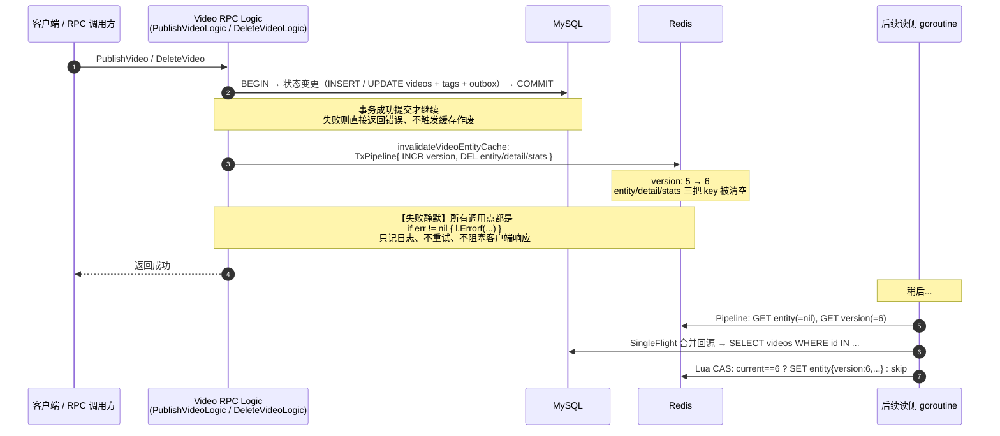

**"失败静默"设计的三重兜底**：

`PublishVideoLogic:257,293` 和 `DeleteVideoLogic:175` 都是同一种写法——`if err := invalidateVideoEntityCache(...); err != nil { l.Errorf(...) }`——**只打日志、不返回错误给客户端**。这在别处看起来像是"偷懒"、但在这里是**刻意的架构设计**、因为缓存作废失败不影响正确性：

| 兜底层 | 保护什么 | 具体机制 |
|---|---|---|
| **① 版本号本身是幂等的** | 即使这次 `INCR` 失败、下一次任何写操作（发布/删除/关注/取关）成功执行 `INCR` 都能修复 —— 版本号只单调递增、不需要精确对应每个业务事件 | Redis `INCR` 命令语义天然幂等（对不存在的 key = 从 0 递增到 1） |
| **② 缓存 TTL 到期自然一致** | 即使 `INCR + DEL` 完全失败、Redis 里留着旧 `entity`（v=5）+ 旧 version（=5）——**最坏后果只是持续读到 v=5 直到 TTL 过期**（`VideoEntityCacheTTL=10min + videoID%300s` 抖动） | `entity` key 有 10min ± 5min TTL、`Missing` 有 30s TTL |
| **③ Redis 全挂时降级** | 若 Redis 直接不可用、读侧的 `redisCli.Ping` 会失败、`cacheAvailable=false`——**所有读请求跳过缓存直接查 MySQL**、写侧的 `INCR + DEL` 无处可写但也不影响 DB 主流程 | `loadVideoEntitiesFromCache` 开头就检查 `cacheAvailable`、`cacheVideoEntityMisses` 里所有 Redis 错误只记日志 |

**这就是版本化缓存"轻量、鲁棒、自愈"的关键——把缓存视为"可以随时全丢"的加速层、任何单点失败都能通过 TTL 或下次写入自愈。**

**统一视角：一句话总结**

**Account 和 Video 两个模块用完全不同的落地形态实现了完全相同的一致性契约**：

- **相同点**：① 读侧永不写脏数据（回填前二次校验版本、不匹配即放弃写入）；② 版本号只由写侧 `INCR` 单调递增（读侧永远只 GET）；③ 发布/删除类事件在 MySQL 事务提交后作废对应缓存；④ 短暂窗口内可能读到过时数据、但绝不会读到"版本不一致的混合数据"；⑤ Redis 全挂时统一走 DB 降级、TTL 到期自然一致；⑥ 缓存作废失败仅记日志不重试、依靠版本号幂等和 TTL 兜底自愈。
- **不同点**：Account 侧重**读多写极少**（用户资料几周才改一次）+ 对一致性要求较高（改完立刻可见），所以选**多版本 Key 短暂共存 + 两段 Pipeline 二次校验**——用旧 Key 的临时内存和一次多余 Pipeline 换严格一致；Video 侧重**读多写较多**（点赞/评论/发布/删除都要 bump version）+ 允许毫秒最终一致，所以选**单版本 Key 覆盖 + Lua CAS 原子回写**——用写侧 Lua 复杂度和一次可能的脏窗口换低内存和一半的读侧 RTT。**没有优劣，只是场景匹配。**

**这两套方案共同构成了项目“版本号 + 惰性重算”的实践模板**——后续任何需要“高读并发、允许最终一致”的模块（如 `notification` 未读数）都可以按需选择“Account 型”或“Video 型”的落地形态。

---

### 8.3 Interaction 互动模块

**职责**：点赞、评论、点赞状态查询、批量计数。

**核心 RPC**：

| Rpc | 说明 |
|---|---|
| `LikeVideo` / `UnlikeVideo` | 事务：INSERT/UPDATE likes + INSERT outbox_events(like.created/deleted) |
| `PublishComment` | `(user_id, request_id)` 幂等；事务写 comments + outbox |
| `DeleteComment` | 软删除，事务写 outbox |
| `ListComments` | 游标分页（`created_at DESC, id DESC`） |
| `BatchGetVideoStats` | Feed 卡片拉齐 likes_count / is_liked / comments_count |

**统计数据的三层职责**：

1. `likes / comments` 明细表是业务事实真相。
2. `videos.likes_count / comments_count / popularity / stats_version` 是可持久恢复的聚合快照。
3. `fsz:video:stats:auth:{videoID}` 是面向高并发读的 Redis 服务投影，Hash 内同时保存三个计数和 `stats_version`。

读侧优先 `HGETALL` Redis。Hash miss、字段损坏或 Redis 故障时，`BatchGetVideoStats` 一次 SQL 批量读取最多 50 个 MySQL 快照，再通过一条 Redis Pipeline 批量执行冷启动 Lua；Pipeline 失败则直接返回 DB 快照，不按视频串行重试。命中 Hash 会刷新 7 天滑动 TTL。

在线写路径仍用 `bumpVideoStatsAuthScript` 乐观更新 Redis，让点赞/评论结果立即可见；但最终恢复能力不再依赖这次事务后写 Redis 一定成功。完整链路如下：

1. RPC 事务写 `likes/comments` 明细和 `outbox_events`，两者同成同败。
2. 事务提交后，Lua 乐观叠加 Redis 统计；同一 Pipeline 更新点赞状态、列表版本、评论版本或实时热度。
3. `interaction_sync` 按 `topic+partition` 组内保序、组间并发，最多 500 条调用 Flush RPC。
4. Flush 事务先插入 `processed_events`，只聚合首次消费事件；再按 `video_id` 升序更新 MySQL 聚合快照，并执行 `stats_version = stats_version + 1`。
5. DB 提交后批量读取涉及视频的最新快照，通过 `projectVideoStatsScript` 写 Redis。Lua 只允许 `incoming_version >= current_version` 的快照覆盖，防止并发 Consumer 发生旧版本回写。
6. Redis 投影失败时 Flush 返回错误，Kafka 不提交 offset。重放时 `processed_events` 会跳过 DB 增量，但 Flush 仍读取并再次投影最新快照，因此既不重复计数，也能修复失写。

相同版本允许重复投影是有意设计：它让重放可以修复部分 Hash 或运维误改；低版本则一定被 CAS 拒绝。滚动升级遇到旧三字段 Hash 时，读写 Lua 只补 `stats_version`，不覆盖其中可能尚未消费的在线增量。
#### 8.3.1 架构演进与当前结论

互动统计经历过两个已经淘汰的阶段：早期采用“MySQL 基准 + Redis delta”，需要 pending/acked/pending_count、增量抵消和重建租约来处理跨存储对账；随后短暂尝试过“Redis Hash 唯一权威 + MySQL 冷备”，虽然删除了抵消流程，却无法主动修复“DB 已提交、事务后 Redis 更新失败”的窗口。

当前版本保留两次演进中真正有价值的部分，并把最终模型收敛为**明细事实 + MySQL 版本化聚合快照 + Redis 服务投影**。这样做的原因是：

1. 正常读只访问一个 Redis Hash，不再执行“MySQL 基准 + Redis 增量”的跨存储加法。
2. Redis 不是唯一恢复来源；Hash 丢失、损坏或写失败时，可以从 MySQL 的带版本快照恢复。
3. Consumer 重放既不会重复增加 DB 计数，又能再次投影同版本快照，主动修复 Redis 失写。
4. 不再需要旧 delta 的抵消、事件级 pending/acked key、统计变更共享租约和全局重建锁，在线点赞不会因为对账任务而被冻结。

旧 key 和 Lua 已从运行路径删除；历史 delta/pending key 仅在压测验收中检查“应为 0”，不再参与正确性协议。

#### 8.3.2 持久快照版本 + Consumer 投影（当前设计）

2026-08-13 增加 `videos.stats_version`，把模型收敛为“明细事实 + MySQL 版本化聚合快照 + Redis 服务投影”：

- Consumer 更新视频聚合字段时在同一事务内递增 `stats_version`。
- 提交后使用 Lua CAS 投影四字段 Hash；低版本不能覆盖高版本。
- Redis 写失败会令 Kafka 批次重试。重放事件被 `processed_events` 判为已处理，不会再改 DB，但仍会再次投影，从而自动恢复失写。
- `BatchGetVideoStats` 的冷启动由最多 50 次串行 Eval 改为“一次 SQL + 一条 Redis Pipeline”，Redis 故障时直接返回 DB 快照。
- `RebuildVideoInteractionStats` 的观测读取改为纯 `HGETALL`，不会因 miss 写入零值；缺失或版本落后的 Redis 投影可以从 MySQL 安全修复。它不会直接用事实 COUNT 覆盖 DB，因为在途 Kafka 事件可能造成重复累计。
- 独立 `event_cleanup` Job 小批次清理 sent Outbox 和过期 `processed_events`。死信默认永久保留，只有配置归档保留期后才自动清理。

在线 Like/Unlike/PublishComment/DeleteComment 还统一接入 `runInteractionWriteTransaction`。它只识别 MySQL `1213` 与 `1205`，最多重试 3 次，退避从 20ms 指数增长到 200ms 并加入最多 50% 抖动；业务校验、唯一键、外键和普通应用错误不会盲目重试。业务 eventID、事件时间和序列化 payload 在事务外生成并跨重试保持不变，每轮只重置 GORM 自增 ID、时间戳等可能被上一次尝试回填的瞬时字段，因此一次 HTTP 请求无论重试几次都只有一个稳定的事件身份。

#### 8.3.3 点赞完整流程、Lua 原子性与版本化 Hash TTL

这一节把“用户点一次赞”的服务端全链路、三段核心 Lua 脚本和版本化 Hash 的过期机制讲透。

##### 一、点赞的完整服务端流程（LikeVideo RPC）

代码位置：`apps/interaction/internal/logic/likevideologic.go`。

1. **参数校验与视频存在性检查**：`user_id`、`video_id` 均不能为 0；从 MySQL 读取正常 `videos` 记录，拿到三个聚合字段和 `StatsVersion` 作为 Lua 冷启动种子。
2. **点击级短锁**：`SETNX fsz:like:action:lock:{video_id}:{user_id} = 随机 token EX 3s`。防止用户短时间内连点或客户端重试导致的重复写入。锁释放走 `if get==token then del` 的 Lua 兜底，避免误删别人的锁。
3. **点赞状态预判（幂等）**：
   - 先查 Redis `LikeStateKey`：命中 `1` → 直接返回"已点赞"（幂等），本次操作不落库；
   - Redis miss → 兜底查 MySQL `likes` 表，若有 `status=1` 记录也直接返回"已点赞"，并顺手把状态回填 Redis；
   - 只有"Redis 与 MySQL 都确认未点赞"时，才继续执行真正的写入。
4. **提前计算 fallback**：在事务开始前用当前 Redis 服务投影 +1 记住预估返回值，作为事务后 Redis 乐观写失败时的接口降级值。
5. **MySQL 事务（一次 COMMIT 完成 4 件事）**：事务通过 `runInteractionWriteTransaction` 执行，只对 MySQL `1213` 死锁和 `1205` 锁等待超时进行最多 3 次指数退避重试；eventID 和 Outbox payload 在事务外生成并跨重试复用，GORM 自增 ID 等瞬时字段则在每轮重置。
   - `INSERT likes ON DUPLICATE KEY UPDATE status=1, deleted_at=NULL`：写点赞关系；
   - `INSERT interaction_events`：事件溯源留痕；
   - `INSERT outbox_events(topic=interaction.like.events)`：供 outbox dispatcher 投递 Kafka；
   - 若点赞对象不是自己，再 `INSERT outbox_events(topic=notification.events)`：驱动通知模块。
   - 4 张表一个事务，MySQL 层保证"要么全成、要么全败"，杜绝"点赞关系已经存在但事件没发出"这种半状态。
6. **Redis 在线投影（Lua `bumpVideoStatsAuthScript`）**：事务提交成功后调用 `applyRedisLikeState`：
   - Lua 原子执行"若 Hash 不存在则用 DB 快照与版本建立基准 → `HINCRBY likes_count +1` → `HINCRBY popularity +likeWeight` → `EXPIRE 7d`"；
   - 同一个 pipeline 内再更新：`LikeStateKey=1`、`LikeVideoUsersKey` SAdd、`LikeUserVideosKey` SAdd、`HotVideoRealtimeKey` ZIncrBy（热榜）、`LikeUserVideosListVersionKey` INCR（"我点赞的视频"列表失效）。
7. **响应组装**：
   - Lua 成功 → `likes_count = Lua 返回的实时投影值`；
   - Lua 失败 → 使用第 4 步预算好的 `fallbackLikesCount` 返回，MySQL 已提交 + Kafka 事件会保证最终一致；
   - 无论走哪条路径，接口对前端的语义都是"点赞成功 + 一个合理的 likes_count"。
8. **异步持久化与修复**：outbox dispatcher 投递 Kafka；interaction_sync 每批先幂等更新 `videos` 聚合和 `stats_version`，提交后再用 `projectVideoStatsScript` CAS 投影 Redis。Redis 失败会触发 Kafka 重放，同一事件不会重复改 DB，但会重新投影。

> 关键取舍：`fallbackLikesCount` 只保护“MySQL 已提交后，事务后 Redis 投影恰好失败”的响应窗口。若 Redis 在获取点击锁或读取点赞状态时已经整体不可用，当前实现会在进入事务前返回错误。用户界面另有乐观更新，两层职责相互独立。

##### 二、为什么必须用 Lua 脚本？——防竞态的底层原因

互动统计涉及三段核心 Lua 脚本，全部位于 `apps/interaction/internal/logic/interactionhelper.go`：

以下为省略滚动升级和损坏字段分支后的核心伪代码；完整实现以源码为准。

**写侧 `bumpVideoStatsAuthScript`**（点赞/取消赞/发/删评论共用）：

```lua
if redis.call("EXISTS", KEYS[1]) == 0 then
    redis.call("HSET", KEYS[1],
        "likes_count", ARGV[1],
        "comments_count", ARGV[2],
        "popularity", ARGV[3],
        "stats_version", ARGV[4])
end
local likes    = redis.call("HINCRBY", KEYS[1], "likes_count", ARGV[5])
local comments = redis.call("HINCRBY", KEYS[1], "comments_count", ARGV[6])
local pop      = redis.call("HINCRBY", KEYS[1], "popularity", ARGV[7])
redis.call("EXPIRE", KEYS[1], ARGV[8])
return {likes, comments, pop, redis.call("HGET", KEYS[1], "stats_version")}
```

**读侧 `readVideoStatsAuthScript`**（冷启动兜底）：

```lua
local values = redis.call("HMGET", KEYS[1],
    "likes_count", "comments_count", "popularity", "stats_version")
local current_version = tonumber(values[4])
if not current_version or current_version < tonumber(ARGV[4]) then
    redis.call("HSET", KEYS[1],
        "likes_count", ARGV[1],
        "comments_count", ARGV[2],
        "popularity", ARGV[3],
        "stats_version", ARGV[4])
end
redis.call("EXPIRE", KEYS[1], ARGV[5])
return redis.call("HMGET", KEYS[1],
    "likes_count", "comments_count", "popularity", "stats_version")
```

**Consumer 投影 `projectVideoStatsScript`**：比较 `incoming stats_version` 与 Hash 当前版本；只有新版本不小于当前版本才整体覆盖四个字段并续期。相同版本允许重放修复，低版本直接返回、不覆盖。

**为什么必须封装成 Lua、而不是在 Go 代码里分几次调用 Redis？** Lua 脚本在 Redis 里是**单线程原子执行**的——一段脚本从开始到 `return` 期间，Redis 不会插入执行任何其他命令。这一属性精确解决了以下三种若拆成多命令必然出现的竞态：

1. **冷启动竞态（多个协程同时给同一个视频初始化基准值）**

   假设 Go 侧拆成 `EXISTS → HSET 基准 → HINCRBY`：
   ```
   线程 A（第一个点赞）              线程 B（第二个点赞）
   EXISTS=0（Hash 不存在）
                                     EXISTS=0（也认为不存在）
   HSET likes=100                    HSET likes=100（覆盖了 A 的初始化）
   HINCRBY +1 → 101                  HINCRBY +1 → 102 ❌ 本该是 102 没错，但是……
   ```
   看起来正确，但更糟的场景是：
   ```
   线程 A：EXISTS=0 → HSET likes=100 → HINCRBY +1 → 101
   线程 B：EXISTS=1（已经存在）→ HINCRBY +1 → 102 ✓

   线程 A：EXISTS=0
                                     线程 B：EXISTS=0
                                     HSET likes=100
                                     HINCRBY +1 → 101
   HSET likes=100 ❌ 把 B 的 101 冲回 100
   HINCRBY +1 → 101 ❌ 最终结果 101，本该 102，丢了 B 的增量
   ```
   用 Lua 把"EXISTS + HSET + HINCRBY"锁在一个原子块里，就杜绝了后一种情况。

2. **读写混合竞态（读侧冷启动 vs 写侧点赞并发）**

   ```
   读线程 A（第一次读）              写线程 B（同时点赞）
   EXISTS=0
                                     bumpVideoStatsAuth（Lua）：EXISTS=0 → HSET 100 → HINCRBY +1 → 101
   HSET likes=100 ❌ 把 B 已完成的 101 冲回 100
   HMGET → 返回 100（漏了 B 的赞）
   ```
   把"EXISTS + HSET + HMGET"打包成 Lua，读侧的初始化就不可能穿插进任何写侧命令中间。

3. **多字段一致性竞态（likes_count 与 popularity 必须一起变）**

   点赞同时影响 `likes_count +1` 与 `popularity +likeWeight`（当前 `likeWeight=3`）。如果分成两条 `HINCRBY` 命令发到 Redis，中间可能被其他命令穿插，导致“某一瞬间的 HGETALL 看到 likes 已加、popularity 未加”的不一致中间态。Lua 把多字段修改一次执行完，从外部观察永远只有“操作前”或“操作后”两种状态。

**为什么不用 MULTI/EXEC 或 WATCH？**

- `MULTI/EXEC` 只提供"命令批量提交"，中间不能读取上一步的结果做条件判断（比如"EXISTS==0 才 HSET"），做不到"检测 + 分支"；
- `WATCH` 是乐观锁，冲突时要求客户端重试，热门视频高并发下重试次数指数上升，性能反而更差；
- Lua 是"服务端事务 + 服务端脚本"的组合，一次 RTT 完成"检测 + 分支 + 多命令"，既原子又高效——这是 Redis 官方文档明确推荐的"读改写"模式。

##### 三、服务投影 Hash 会不会过期？TTL 语义详解

**答：会。`VideoStatsAuthKey` 有一个 7 天的 TTL（`common/rediskey/video.go` 中定义的 `VideoStatsAuthTTL = 7 * 24 * time.Hour`），但设计成"活跃视频自动续期、冷视频自然淘汰"。**

**TTL 触发规则表**：

| 事件 | 对 TTL 的影响 | 说明 |
|---|---|---|
| 视频第一次被点赞/评论 | Lua 内 EXISTS=0 → HSET 基准 → `EXPIRE 7d` | 冷启动时初始化 TTL |
| 视频后续被点赞/取消赞/发/删评论 | Lua 内 `EXPIRE 7d`（无条件重置） | **每次写入都续期**，热门视频永远不过期 |
| 视频第一次被读（BatchGetVideoStats 命中 miss） | Lua 内 EXISTS=0 → HSET 基准 → `EXPIRE 7d` | 冷启动时初始化 TTL |
| 视频后续被读（命中 HGETALL） | Pipeline 同时 `EXPIRE 7d` | 热点读投影持续驻留 |
| 视频被 UP 主删除 / 状态改下架 | 视频服务侧 `invalidateVideoEntityCache` 主动 `DEL` 该 key | 立刻清空，避免读到已删除视频的旧统计 |
| 7 天内既无写入也无 miss 读 | 到期自动淘汰 | 冷门视频自动腾内存 |

**为什么读命中也续期？**

当前 Hash 是视频详情和 Feed 卡片的服务投影。活跃读取的视频继续驻留可以避免频繁冷启动；连续 7 天既没有读取也没有互动的视频才会淘汰。容量上限应由 Redis `maxmemory`、淘汰策略和业务监控共同约束，而不是让仍有稳定访问的 key 周期性失效。

**为什么过期不会导致数据丢失？**

`videos` 表保存版本化持久快照。Hash 过期后可以立即用该快照冷启动；若 Kafka 仍有在途事件，Consumer 随后更新更高 `stats_version` 并主动覆盖 Redis。版本比较保证晚到的旧批次不能把新投影回滚。

**万一 Redis 整体宕机？**

- 在线读侧：批量 Redis 操作失败后一次查询 MySQL 快照并直接降级返回，不逐视频重试 Redis；
- 在线写侧：若 MySQL 事实与 outbox 已经提交，事务后 Redis 乐观写失败时返回 fallback；Redis 在点击锁阶段整体不可用则请求会提前失败；
- 异步链路：interaction_sync 可以先提交 DB 快照，但 Redis 投影失败会阻止 Kafka offset 前推。Redis 恢复后重放事件跳过 DB 增量并再次投影，自动收敛。

##### 四、和其它两段热点 Lua 脚本的对比

| Lua 脚本 | 位置 | 保护的竞态 |
|---|---|---|
| `bumpVideoStatsAuthScript` | interactionhelper.go | 冷启动 + 多字段 HINCRBY + EXPIRE 续期 |
| `readVideoStatsAuthScript` | interactionhelper.go | 版本比较 + 冷启动/损坏修复 + HMGET + 续期 |
| `projectVideoStatsScript` | interactionhelper.go | Consumer 快照按 stats_version CAS 覆盖，支持重放修复 |
| `setVideoEntityCacheIfMatch`（§8.2.5） | batchgetvideoslogic.go | GET version + 比较 + SET entity（防旧快照覆盖新版本） |
| `applyBumpUnreadVersion`（§8.6） | common/notificationcache | 未读数版本号 INCR + TTL 续期 |

**共同点**：全部都是"读一下 → 判断一下 → 写一下"的模式；都靠 Redis 单线程原子性消除并发穿插。互动统计当前使用 3 段职责分离的 Lua：在线 bump、读侧冷启动、Consumer 版本投影。

**点赞流程（新架构）**：

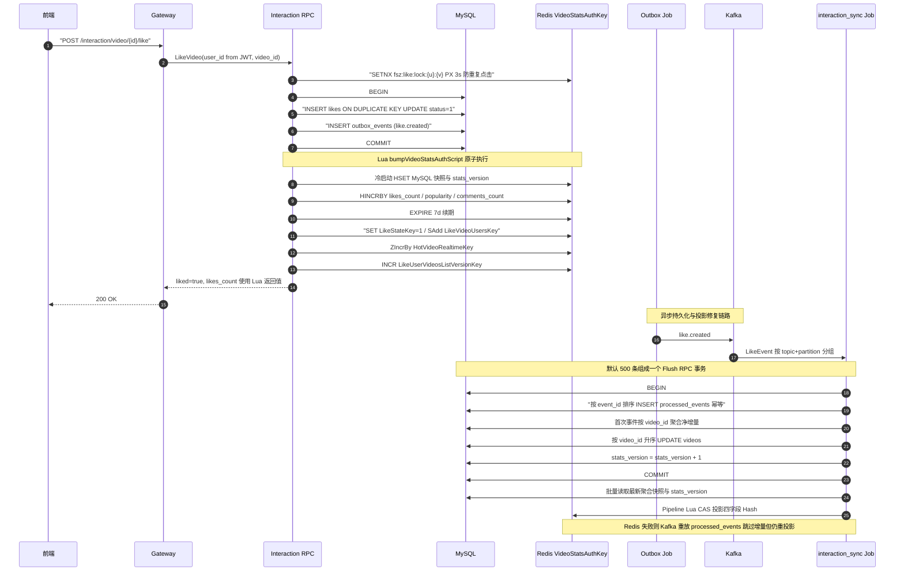

##### 五、`stats_version` 到底是什么？以及批处理时序抖动为何被接受

前面几节反复出现的 `stats_version` 字段是这套双写体系的“新旧仲裁锚”。这里把常见的误解和临界时序一次讲透。

###### 5.1 版本号只有一份，MySQL 是唯一生产者

一个很容易踩的误解：“Redis 里存了一份 Redis 自己的版本号，MySQL 里存了另一份 MySQL 自己的版本号，两边各自 +1”。

**实际上 `stats_version` 只是同一个逻辑版本号在两个存储里的两份镜像**：

| 存储 | 字段 | 谁写它 | 何时变化 |
|---|---|---|---|
| MySQL `videos` 表 | `stats_version` | interaction_sync Consumer 的 Flush 事务：`stats_version = stats_version + 1` | **每次 Flush 事务提交时 +1** |
| Redis `VideoStatsAuthKey` Hash | `stats_version` 字段 | Consumer 的 `projectVideoStatsScript` 用 MySQL 的新版本号覆盖过来 | 只在 Consumer 投影时被写入；**用户同步点赞的 `HINCRBY` 不改这个字段** |

也就是说：

- **用户点赞 → Redis `HINCRBY likes_count +1`**，此时 Redis 的 `stats_version` **保持不变**；
- **Kafka Consumer Flush → MySQL 事务里 `stats_version += 1` → 用新版本号投影 Redis**，此时 Redis 的 `stats_version` 才会推进到新值。

把版本号理解成“MySQL 快照的时间戳”——它标记的是“Redis 里这份数据最近一次被哪一版 MySQL 快照覆盖过”。

###### 5.2 每次 Flush 都会覆盖 Redis，这是设计意图

按 §5.1 的定义，任意一次 Flush 之后必然满足 `new_mysql_version > current_redis_version`，所以 `projectVideoStatsScript` 的版本比较总是通过的：**每一次 Flush 都会覆盖 Redis 的四个字段**。

这一点乍看反直觉——“既然每次都覆盖，那版本号还有什么用？”

关键在于：**在正常路径下，MySQL Flush 完的 `likes_count` 值就等于 Redis 已经通过 HINCRBY 增到的值**，覆盖前后 Redis 的字段值不变，动作幂等无害。举例：

```
初始:  MySQL.likes=100, MySQL.version=5, Redis.likes=100, Redis.version=5

用户 A~E 5 人点赞：
  同步 HINCRBY：Redis.likes = 105, Redis.version 保持 5
  5 条 outbox 事件排队

Consumer Flush（拿到这 5 条）：
  MySQL.likes = 100 + 5 = 105，MySQL.version = 5 + 1 = 6
  投影 Redis：new_version=6 ≥ 5，覆盖
  Redis.likes = 105（值没变），Redis.version = 6
```

版本号真正防的是**下面三种异常路径**，而不是正常覆盖：

| 异常场景 | 版本号的作用 |
|---|---|
| Kafka 消息重试/延迟送达一份旧 Flush 快照 | 旧 batch 携带的版本号 < Redis 现有版本号，Lua 直接返回 0，不覆盖 |
| Consumer 多实例、rebalance 后进度乱序 | 落后实例的快照版本旧于 Redis 现有版本，被拦下 |
| Redis 权威 Hash 意外过期后被冷启动重建 | 后续更高版本的 Flush 快照能顺利覆盖冷启动占位，保证收敛 |

一句话：**版本号不是用来阻止 Consumer 正常覆盖 Redis 的，而是给覆盖动作排序、防止“过期快照回滚新数据”。**

###### 5.3 临界时序：Flush 窗口内的新点赞会造成短暂负向抖动

现在到了最微妙的一个场景。考虑下面这一串时间线：

```
初始:  MySQL.likes=100 / version=5，Redis.likes=100 / version=5
       outbox 排队 100 条 pending 点赞事件

t=0    Consumer 开始 Flush：
       SELECT outbox WHERE status=pending → 拿到这 100 条
       （此瞬间 outbox 里还没有更多新事件）

t=1    ⚡ 用户 X 发起一次新的点赞：
       MySQL 事务：INSERT likes、INSERT outbox_events(第 101 条)、COMMIT ✓
       同步 HINCRBY：Redis.likes = 201

t=2    Consumer 完成 MySQL Flush（本批只含前 100 条）：
       UPDATE videos SET likes_count = 100 + 100 = 200,
                         stats_version = 5 + 1 = 6
       事务提交 ✓                                      ← ⚠️ 少了用户 X 的 +1

t=3    Consumer 投影 Redis：
       new_version=6 ≥ Redis.version=5，覆盖
       Redis.likes = 200，Redis.version = 6           ← ⚠️ 从 201 短暂回退到 200
```

**用户 X 会看到自己刚点的赞在 1~3 秒内被“抹掉一次”，然后又回来。** 这不是 bug，是本架构明确接受的一次抖动，原因如下：

- **窗口极短**：outbox dispatcher 轮询 + Consumer Flush 攒批，抖动窗口大约 `1~3 秒`；
- **幅度极小**：抖动幅度等于“错过本班车的那几条点赞事件”，通常 ±几，不会出现从 1000 掉回 500 这种视觉灾难；
- **自愈收敛**：用户 X 的 outbox 事件仍是 `pending`，会随下一批 Flush 更新 MySQL 到 201、`stats_version = 7`，再次覆盖 Redis 到 201，永久保持正确；
- **前端可屏蔽**：客户端只需实现“显示值只增不减、以本次会话内的最大值为准”即可屏蔽这段抖动；
- **替代方案代价高**：任何试图消除这段抖动的方案（在 Flush 上加 `SELECT ... FOR UPDATE` 阻塞新点赞、放弃批量 Flush、Redis 侧再分“base / delta”双字段等）都会显著牺牲吞吐或提升系统复杂度。

用心智模型看得更清楚：

```
Redis.likes  =  MySQL_last_flushed_snapshot  +  pending_hincrby_delta
                （前半：Consumer 投影覆盖）    （后半：同步 HINCRBY 累加）
```

Consumer 投影本质上是“刷新前半、把后半清零”。多数时候 pending_hincrby_delta ≈ 0，覆盖无感；只有恰好在 Flush 窗口内产生的新点赞会被“临时清零”，随后由下一批 Flush 补回。

###### 5.4 什么错误版本号也救不了？——反过来说明它的边界

版本号只保证“Redis 的四字段快照单调按版本推进”。它**不保证**：

- Redis 里的实时值总是等于 MySQL 里的持久值（异步链路必然有秒级窗口偏差）；
- 单次 Consumer 投影“无漏地包含所有已发生的点赞”（Flush 窗口内的新事件会推迟到下一批）；
- 客户端每次刷新看到的数字单调递增（前端需自行做“只增不减”策略）。

它**保证**：

- 相同或更新版本可以覆盖 Redis，旧版本永远不能回滚 Redis 快照；
- Kafka 重放/Consumer 乱序不会把 Redis 已推进的快照踩回旧值；
- Redis 冷启动或过期重建后能被更新版本的 Flush 快照顺利收敛；
- 从长期看，Redis `likes_count = MySQL.likes_count = Σ 所有已消费 like 事件的 delta`，最终一致。

**版本号 + Lua CAS + outbox at-least-once + processed_events 幂等**，共同构成“允许短暂抖动、绝不永久错位”的最终一致语义。

###### 5.5 用户点赞后拿到的返回值是什么？——Lua 原子性与并发排队

前面几节回答的是"Redis 里存的值怎么演化"。这一节回答的是"每一次 `LikeVideo` RPC 具体返回给客户端一个什么数字"。

回顾 `bumpVideoStatsAuthScript` 的核心 4 行：

```lua
local likes    = redis.call("HINCRBY", KEYS[1], "likes_count", ARGV[5])
local comments = redis.call("HINCRBY", KEYS[1], "comments_count", ARGV[6])
local pop      = redis.call("HINCRBY", KEYS[1], "popularity",   ARGV[7])
redis.call("EXPIRE", KEYS[1], ARGV[8])
return {likes, comments, pop, redis.call("HGET", KEYS[1], "stats_version")}
```

**`HINCRBY` 返回的是"执行完本次自增之后的最新值"**，所以 `likes` 变量拿到的就是：

> 从冷启动基准建立起、到本次 `+1` 原子落地那一瞬间为止，Redis 权威 Hash 里 `likes_count` 字段的**实时累计总和**。

拆开看这个总和的组成：

```
返回值 = 冷启动基准（首次从 MySQL 快照 HSET 进来的 likes_count）
       + 从冷启动到现在，之前所有同步点赞 HINCRBY 的累加
       + 期间 Consumer projectVideoStatsScript CAS 覆盖过的 MySQL 快照增量
       + 本次调用的 +1
```

**并发点赞的排队语义**：Redis 单线程 + Lua 原子块共同保证——即使两个协程同一微秒调用 `EVAL`，Redis 也会串行执行两次脚本，绝不并行。举例：

```
Redis 内部串行执行序列：
  用户 A 的 Lua：HINCRBY likes +1 → 101，返回给 A
  用户 B 的 Lua：HINCRBY likes +1 → 102，返回给 B
  用户 C 的 Lua：HINCRBY likes +1 → 103，返回给 C
```

结论：**任何两个并发用户都不可能拿到同一个返回值，也不会出现"我 +1 却读回旧值"的 lost update**——这正是 Lua/`HINCRBY` 取代"客户端 `GET → +1 → SET`"的核心价值。

**几个需要留意的边界情况**：

- **返回值可能领先 MySQL**：你此刻拿到 205，MySQL 里可能还是 100，Kafka 消息还没消费到——这是正常的，Redis 是实时视图、MySQL 是最终一致视图。
- **返回值不承诺全局单调**：参见 §5.3，Consumer 用旧 batch 快照覆盖 Redis 时，**其他观察者**接下来读到的值可能一次性回退 1~几；但**你自己这次调用返回给客户端的数字永远是准确的**，抖动只影响后续观察者。
- **冷启动 + 首次点赞**：如果 Hash 不存在，Lua 会先用 MySQL `videos` 表中的 `likes_count` 快照建立基准，再在此基础上 `+1`——所以第一个点赞的用户拿到的是"MySQL 已存快照 + 1"，不会漏也不会重（详见 §5.6）。

**为什么 `HINCRBY`/`Lua` 是必要的、而不是 Go 层 `GET → +1 → SET`**：

| 方案 | 高并发下的行为 |
|---|---|
| Go 层 `GET → +1 → SET` | 两个协程都 GET=100 → 各自算成 101 → 各自 SET=101，**丢失一次点赞**（经典 lost update） |
| Redis `INCR` / `HINCRBY` | 命令内部原子，两次调用必然拿到不同的返回值 |
| Lua 脚本封装 | 在 `HINCRBY` 之上再叠加"冷启动 + 多字段 + EXPIRE"的整体原子性，杜绝跨字段中间态与冷启动竞态 |

###### 5.6 冷启动详解：为什么需要冷启动、以及冷启动是怎么做的

**"冷启动"** 特指：`VideoStatsAuthKey` 权威 Hash 在 Redis 中**不存在**时，第一次触碰它的那次调用必须先把 MySQL 快照"拉起"，在此基础上执行本次读或写。

**为什么会出现 Hash 不存在的场景？**

| 触发原因 | 举例 |
|---|---|
| 视频从未被互动过 | 刚发布的新视频，`videos` 表已经落了初始快照（可能为 0，也可能是历史迁移进来的非零值），但没人点赞/评论过，Redis 里从来没写过这个 key |
| Hash 到期自动淘汰 | 参照 §8.3.3 三节的 TTL 规则，`VideoStatsAuthTTL = 7 天`，7 天内既没读也没写就会自动过期，冷门视频会自然掉出 Redis |
| Redis `maxmemory` 触发 LRU 淘汰 | 内存紧张时 Redis 主动逐出旧 key，即使 TTL 未到也可能失踪 |
| Redis 实例重启/主从切换 | 若持久化配置不足，重启后大量 key 消失，属于批量冷启动场景 |
| 视频被 UP 主删除后主动 `DEL` 又意外恢复 | 边界情况，一般不会发生 |

**为什么冷启动必须小心？**

如果 Hash 不存在时不做任何基准初始化，而是**直接** `HINCRBY likes_count +1`，Redis 会把不存在的字段视为 0，得到 `likes_count = 1`——这**把 MySQL 已经积累的历史点赞数（可能是 500、1000、10000）全部丢失**。用户看到的就是"这个视频点赞数从几千瞬间掉到 1"，且这个错误值还会被下一次 Consumer 投影覆盖修正，中间造成明显闪烁。

**冷启动怎么做？——写侧路径（`bumpVideoStatsAuthScript`）**

看代码：

```lua
if redis.call("EXISTS", KEYS[1]) == 0 then
    redis.call("HSET", KEYS[1],
        "likes_count",    ARGV[1],   -- DB 快照 likes_count
        "comments_count", ARGV[2],   -- DB 快照 comments_count
        "popularity",     ARGV[3],   -- DB 快照 popularity
        "stats_version",  ARGV[4])   -- DB 快照 stats_version
elseif not tonumber(redis.call("HGET", KEYS[1], "stats_version")) then
    -- 兼容滚动升级：老版本只有三字段没有 stats_version
    redis.call("HSET", KEYS[1], "stats_version", ARGV[4])
end
local likes    = redis.call("HINCRBY", KEYS[1], "likes_count",    ARGV[5])
local comments = redis.call("HINCRBY", KEYS[1], "comments_count", ARGV[6])
local pop      = redis.call("HINCRBY", KEYS[1], "popularity",     ARGV[7])
redis.call("EXPIRE", KEYS[1], ARGV[8])
return {likes, comments, pop, redis.call("HGET", KEYS[1], "stats_version")}
```

三条关键规则：

1. **基准值来源是调用方从 MySQL 读取的 `videos` 行**。调用侧 `applyRedisLikeState` → `bumpVideoStatsAuth(..., baseStats)` 会在进入 Lua 之前先 `SELECT id, likes_count, comments_count, popularity, stats_version FROM videos WHERE id=?`，把这四个值原样传进 `ARGV[1..4]`。这是"权威 Hash 的种子"。
2. **`EXISTS` 判断和 `HSET` 基准、`HINCRBY` 增量必须在同一个 Lua 里**。如果拆开成"Go 侧 `EXISTS` → `HSET` → `HINCRBY`" 三步，两个并发线程都可能判为不存在→各自 `HSET` 覆盖对方增量→丢失点赞。Lua 的整体原子性把这个竞态彻底关掉（`interactionhelper.go` 里的三条注释也明确说明了这一点）。
3. **`ARGV[4]` 是 DB 快照的 `stats_version`，不是 0**。这样冷启动写入 Redis 的基准和 MySQL 完全对齐；后续 Consumer 只有携带更高版本号的 Flush 才会覆盖 Redis，符合 §5.2 的版本单调推进语义。

冷启动 + 本次 `+1` 的结果：

```
Redis 冷启动前:  key 不存在
MySQL 当前值:    likes=500, comments=30, popularity=1550, version=42

Lua 原子执行:
  EXISTS=0 → HSET (500, 30, 1550, 42)
  HINCRBY likes +1 → 501
  HINCRBY comments +0 → 30
  HINCRBY popularity +3 → 1553  （likeWeight=3）
  EXPIRE 7d
  return (501, 30, 1553, 42)

用户拿到:        likes_count = 501  ✓ 不会漏掉历史 500 次点赞
```

**冷启动怎么做？——读侧路径（`readVideoStatsAuthScript`）**

读侧场景（如 `BatchGetVideoStats`）同样会遇到冷启动，但不涉及增量、只做基准建立：

```lua
local values = redis.call("HMGET", KEYS[1],
    "likes_count", "comments_count", "popularity", "stats_version")
local current_version = tonumber(values[4])
if not current_version or current_version < tonumber(ARGV[4]) then
    -- key 不存在、字段损坏、或 Redis 版本落后于 DB 快照 → 用 DB 快照覆盖
    redis.call("HSET", KEYS[1],
        "likes_count",    ARGV[1],
        "comments_count", ARGV[2],
        "popularity",     ARGV[3],
        "stats_version",  ARGV[4])
end
redis.call("EXPIRE", KEYS[1], ARGV[5])
return redis.call("HMGET", KEYS[1],
    "likes_count", "comments_count", "popularity", "stats_version")
```

读侧比写侧多一层版本比较：只有"Redis 里没有版本号 或 Redis 版本 < DB 快照版本"时才覆盖，避免用一个滞后的 DB 快照踩掉 Redis 中已经通过 Consumer 投影推进过的更新版本。

**批量冷启动的优化**：`BatchGetVideoStats` 一次要读几十个视频卡片的统计。当前实现是**一次批量 SQL 拿到所有 miss 视频的 DB 快照 + 一条 Redis Pipeline 批量下发 `readVideoStatsAuthScript`**，把冷启动 RTT 从"最多 50 次串行 Eval"压缩到"1 次 SQL + 1 条 Pipeline"，这是 §17 changelog 2026-08-13 条目里记录过的一次专门优化。

**冷启动为什么是安全的（不会重复计数）**

关键在于："DB 快照本身就已经吸收了所有此前已 Kafka 消费的点赞事件"。举例：

- 视频历史有 500 次点赞，其中前 495 次已经被 Consumer Flush 消费掉，写入 `videos.likes_count = 495`，剩 5 条 outbox 事件正在 Kafka 里排队。
- 冷启动那一刻 Redis 用 DB 快照建立基准 → `likes_count = 495`。
- 剩下 5 条 Kafka 消息被 Consumer 消费时，`processed_events` 唯一键会保证它们**只更新 MySQL 一次**（幂等去重），然后再次投影 Redis。
- 若 Redis 已经通过后续同步 `HINCRBY` 达到了 500（新用户点赞），那 Consumer 投影带的版本号一定 > 冷启动种子版本，覆盖时值一致（500 vs 500）或值相符（详见 §5.2）。

**总结冷启动的三条原则**：

1. **Hash 缺失时用 MySQL 快照 + `stats_version` 建立基准**（永不用 0 起步），保证不丢历史累计。
2. **基准建立与后续操作打包成一个 Lua**（用 `EXISTS` + `HSET` + `HINCRBY` 或 `HSET` + `HMGET`），杜绝并发穿插造成的"基准值丢增量"。
3. **`processed_events` 幂等 + Consumer 版本 CAS**，保证冷启动后 Kafka 里可能重复到达的旧事件不会重复累计 MySQL，也不会用滞后快照回滚 Redis。

###### 5.7 三条链路对同一个 Hash 的动作矩阵，以及 `>=` 而不是 `>` 的理由

前面 5.1~5.6 是按"时间/场景"讲的。这里换一个视角，把**同一个 `VideoStatsAuthKey` Hash**上并存的三条链路对四个字段的动作**并排列出来**，作为落地时最直接的对照表。

###### 5.7.1 三条链路 × 四字段的动作矩阵

`fsz:video:stats:auth:{videoID}` 这个 Hash 同时被三条链路操作：

| 链路 | 触发方 | 用的 Lua | `likes_count / comments_count / popularity` | `stats_version` |
|---|---|---|---|---|
| **写侧** | `LikeVideo` / `UnlikeVideo` / `PublishComment` / `DeleteComment`（MySQL 事务提交后）| `bumpVideoStatsAuthScript` | `HINCRBY ±delta` 原子叠加 | **不动**（仅在 Hash 冷启动或旧三字段兼容分支时用 DB 值填一次基准）|
| **读侧** | `BatchGetVideoStats`（Hash miss 或字段残缺时）| `readVideoStatsAuthScript` | 冷启动 / 追赶落后版本时整体覆盖为 DB 快照；命中时**只读不写** | 只在"Redis 版本 < DB 版本"或"版本缺失"时把它拉齐到 DB 版本 |
| **投影侧** | `interaction_sync` Job（Flush 事务提交后）| `projectVideoStatsScript` | 与 `stats_version` 一起**整体覆盖**为 MySQL 落盘后的最新快照 | **每次 Flush 由 MySQL 事务 +1**，投影时用 `>=` 单调覆盖到 Redis |

三句话概括三条链路的分工：

- **写侧管快**：只做 `HINCRBY`，让用户立刻看到点赞数变化，不碰版本号；
- **投影侧管准**：把 MySQL 落盘后的完整快照（含 `stats_version+1`）用 `>=` 单调地覆盖 Redis，是长期漂移的唯一修正源；
- **读侧管兜底**：命中直接返回；miss 时用 DB 快照冷启动或追赶到最新版本，从不主动 `HINCRBY`、也不主动 `+1` 版本号。

**只有投影侧（Consumer）会 +1 版本号**——写侧和读侧永远不会主动递增它。这是理解 §5.1 "版本号只有一份、MySQL 是唯一生产者"最直观的落点。

###### 5.7.2 `projectVideoStatsScript` 为什么是 `>=` 而不是 `>`

`projectVideoStatsScript` 的核心判断是：

```lua
if not current_version_number or tonumber(ARGV[1]) >= current_version_number then
    -- 覆盖
end
```

用 `>=` 而不是 `>` 是刻意为之，两者的差异只在"同版本重复投影"这一种情况下：

| 运算符 | 同版本重放（`ARGV[1] == current`）| 低版本重放（`ARGV[1] < current`）| 高版本正常前进 |
|---|---|---|---|
| `>` | **拒绝**——同一 batch 若 Redis 那一步失败重试就永远修不好 | 拒绝 ✓ | 覆盖 ✓ |
| `>=`（当前实现）| **允许幂等重写**——Kafka 重放同一 batch 时可以补写 Redis | 拒绝 ✓ | 覆盖 ✓ |

关键场景：

- **Flush 事务已提交 → 投影 Redis 那一步失败**（Redis 抖动 / Pipeline 报错），Consumer 直接返回错误让 Kafka 重投；
- Kafka 重投后，`processed_events` 唯一键会让 MySQL Flush 事务里的 `UPDATE videos` **跳过已入库的事件**——`stats_version` **不再 +1**（MySQL 已经是 `v=6`）；
- Consumer 再次读到 `stats_version=6` 的快照并 EVAL 投影脚本；
- 若判断用 `>`，`6 > 6` 为假 → **永远补写不上 Redis**，Redis 卡在 `v=5` 直到 TTL 过期；
- 用 `>=`，`6 >= 6` 为真 → 幂等地把同一份 `v=6` 快照再刷一次到 Redis，写失败被修复。

这与 §5.4 "版本号保证 Redis 快照单调按版本推进"并不冲突：`>=` 允许"同版本再写一次相同数据"，仍然满足**Redis 版本号只增不减**的约束，也不会造成数据回滚。

###### 5.7.3 读侧 `readVideoStatsAuthScript` 追赶分支的真正触发场景

`readVideoStatsAuthScript` 里的追赶分支（`current_version_number < tonumber(ARGV[4])`）在什么时候被真正触发？很多人会以为"Job 每次投影完，读侧就会用这个分支追赶"——**这个理解是错的**。

正常路径下：Job 投影成功 → Redis 已经是最新版本 → 读侧走 `loadAuthStats` 直接 `HGetAll` **命中**返回，`readVideoStatsAuthScript` **根本不会被 EVAL**。

它真正生效的场景只有一条：**Step 3 因为 Hash 缺失或字段残缺而判定为 miss**，导致 `coldStartAuthStats` 被触发，才会进入这段 Lua，此时可能遇到：

| 分支 | 触发原因 |
|---|---|
| key 不存在 | 视频首次被访问，或 Hash TTL 过期，或 Redis LRU 淘汰 |
| 字段缺 `stats_version` | 滚动升级前的旧三字段 Hash（此分支只补 `stats_version`，**不覆盖计数**）|
| `stats_version < DB.version` | **Job 已 UPDATE MySQL 但投影 Redis 那一步失败**（Redis 抖动导致 `projectVideoStatsScript` 返回错误）→ 恰好这时 Hash 又因 TTL/LRU 被逐出 → 读侧 miss → 用 DB 的新快照冷启动 |

第三种场景就是"Job 投影失败 + Hash 被淘汰"的复合兜底，非常罕见但不是不可能。**读侧不会因为"命中一个滞后的 Hash"而主动更新它**——只有走到冷启动路径时才有机会追赶。这解释了 §5.4 里"从长期看最终一致"的具体保障机制来自哪里：**投影侧的 `>=` 幂等重写 + 读侧的 miss 兜底冷启动**，两条路径叠加才能覆盖所有边界。

###### 5.7.4 心智模型总结

把三条链路和 Hash 的关系压缩成一张脑图：

```
                ┌─────────────────────────────────────────┐
                │  fsz:video:stats:auth:{videoID}  TTL=7d │
                │  ┌──────────────┐  ┌────────────────┐   │
                │  │ likes_count  │  │ stats_version  │   │
                │  │ comments_count │  │  (仲裁字段)   │   │
                │  │ popularity   │  │                │   │
                │  └──────┬───────┘  └────────┬───────┘   │
                └─────────┼──────────────────┼───────────┘
                          │                  │
     ┌────────────────────┤                  ├─────────────────┐
     │                    │                  │                 │
   HINCRBY              整体覆盖            +1（仅一处）      追赶到最新
     │                    │                  │                 │
┌────┴─────┐        ┌────┴─────┐       ┌───┴──────┐      ┌────┴─────┐
│ 写侧      │        │ 投影侧    │       │ 投影侧    │      │ 读侧     │
│ bump...  │        │ project. │       │ project. │      │ read...  │
│ (LikeVi.)│        │ (Job)    │       │ (Job)    │      │ (miss 时)│
└──────────┘        └──────────┘       └──────────┘      └──────────┘

  管快                管准                管仲裁              管兜底
```

**如果你只能记住一件事**：`stats_version` 是"MySQL 持久快照的世代号"，写侧完全不动它，投影侧每 Flush +1 并 `>=` 单调覆盖 Redis，读侧只在 miss 时用它判断"是否要追赶到最新版本"。三条链路共享一个 Hash，靠这个版本号做仲裁——**写快、Job 准、读兜底**。

#### 8.3.4 点赞抗压分析：削峰、批量聚合与可持续吞吐

朴素方案在每次点赞请求中直接更新 `videos.likes_count`，热门视频会形成单行锁热点。当前实现把用户关系事实与派生计数拆开：在线事务只完成 `likes / interaction_events / outbox_events` 等事实写入，Redis 立即维护用户可见增量；Kafka 消费端再批量更新 `videos` 聚合字段。

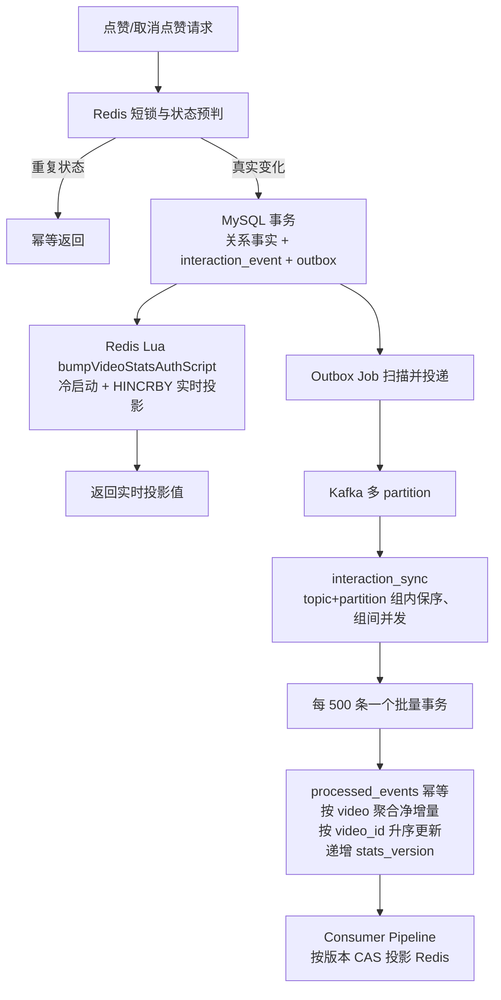

| 层次 | 机制 | 解决的问题 |
|---|---|---|
| 请求入口 | 用户+视频短锁、Redis 状态缓存 | 连点与重复状态不进入 MySQL |
| 在线事务 | 关系事实与 Outbox 同事务 | 不丢事件，避免直接争抢视频计数行 |
| 实时读侧 | Redis 版本化服务投影，miss 时用 DB 快照批量冷启动 | 命中一次 HGETALL；故障时可降级 |
| Kafka | 6 partition、at-least-once | 削峰、重放、横向扩展 |
| Consumer | partition 内保序、最多 4 worker 并发 | 保序与吞吐兼顾 |
| Flush RPC | 500 事件/事务、按视频聚合 | 显著减少事务提交和热点行 UPDATE 次数 |
| 版本投影 | DB stats_version + Redis Lua CAS | 防旧快照覆盖；Kafka 重放修复 Redis 失写 |
| 幂等与恢复 | `processed_events` 唯一键 | 重复消费不重复更新 DB；同版本重放修复 Redis 失写 |
**不要笼统宣称“单机所有接口都支持万级 QPS”**。本项目的可信结论来自 §14.6 的本机压测：正式数据集为 10000 用户、5000 视频；点赞场景最终达到约 `318.0 次业务循环/s`，每个循环包含 Like+Unlike 两个写请求，即约 `636 HTTP 写请求/s`，最终 Kafka lag、Redis 残留和 MySQL 对账差异均收敛为 0。匿名非空热榜依靠 2 秒成品缓存达到约 8.5K QPS，这是特定读缓存场景的吞吐，不能外推为所有写接口或生产集群上限。

#### 8.3.5 批量聚合详解：从 N 条点赞事件到 M 条 UPDATE

用户经常担心的问题：**“是不是每一次点赞都要单独 UPDATE 一次 MySQL？”**

答：**不是**。如果真是每点赞都单独 `UPDATE videos SET likes_count = likes_count + 1 WHERE id = ?`，同一个热门视频的所有点赞会串行争抢同一行的 InnoDB 行锁，单行 QPS 上限只有几百，高并发场景直接崩溃。

本项目采用 **event-driven write-behind + batch aggregation（事件驱动写回 + 批量聚合）**，将 N 条互动事件压缩为 M 条 UPDATE（M ≤ 去重后的视频数，通常 M ≪ N），下面把整条数据通路完整讲清楚。

##### 一、整体数据流

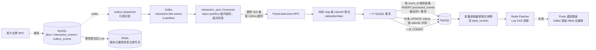

##### 二、关键参数与代码位置

| 参数 / 常量 | 值 | 位置 | 作用 |
|---|---|---|---|
| `FlushMs` | 100 | `apps/interaction/etc/interaction.yaml` | Consumer 累积多久强制 Flush 一次 |
| `maxFlushInteractionEvents` | 500 | `apps/interaction/internal/logic/jobhelper.go` | 单个 RPC 批次最多多少条事件 |
| Kafka partition 数 | 6 | `deploy/kafka/` | Consumer 端并发上限 |
| `deltasByVideo` map | — | `applyInteractionFlushBatch` in `jobhelper.go` | 按 videoID 在内存里合并 delta |
| `sortedVideoStatDeltaIDs` | — | 同上 | UPDATE 前按 videoID 升序，防止死锁 |

##### 三、聚合核心代码（`applyInteractionFlushBatch`）

```go
return db.WithContext(ctx).Transaction(func(tx *gorm.DB) error {
    deltasByVideo := make(map[uint64]videoStatDelta)      // ★ 按 videoID 聚合
    for _, event := range orderedEvents {
        inserted, err := insertProcessedEvent(ctx, tx, event.EventID, ...)
        if err != nil { return err }
        if !inserted { continue }                          // 幂等：已处理过则跳过
        deltasByVideo[event.VideoID] = mergeVideoStatDelta( // ★ 内存合并
            deltasByVideo[event.VideoID], event.Delta)
    }
    for _, videoID := range sortedVideoStatDeltaIDs(deltasByVideo) {
        delta := deltasByVideo[videoID]
        if delta == (videoStatDelta{}) { continue }
        // ★ 每个视频只发一条 UPDATE：likes/comments/popularity 合并到一条
        if err := applyVideoStatDelta(ctx, tx, videoID, delta); err != nil {
            if errors.Is(err, gorm.ErrRecordNotFound) { continue } // 视频已删除也提交 processed_events，防永久重试
            return err
        }
    }
    return nil
})
```

##### 四、对比示例：热门视频 1 秒 1000 次点赞

**❌ 假想的糟糕方案：每条单独 UPDATE**

```text
1000 次 UPDATE videos SET likes_count = likes_count + 1 WHERE id = V1

后果：
- 1000 次网络往返、1000 次事务提交、1000 次 fsync
- 全部串行化在同一行行锁上，单行 QPS 上限 ≈ 几百
- 主从复制延迟激增
```

**✅ 当前实际方案：Consumer 累积 + 内存聚合**

```text
Consumer 累积 100ms 或 500 条事件（先到者触发），假设一批全是 V1：

FlushLikeEvents(batch=500):
  ├─ deltasByVideo[V1] = { LikeDelta: 500, PopularityDelta: 1500 }
  └─ 事务内：
       INSERT INTO processed_events VALUES (...500 条 ...) -- batch INSERT
       UPDATE videos SET likes_count  = likes_count + 500,
                         popularity   = popularity + 1500,
                         stats_version = stats_version + 1
             WHERE id = V1  ← ★ 只有一条 UPDATE ★
       COMMIT

结果：
- 最多 500 次有序幂等 INSERT 和 1 次视频 UPDATE 共享同一个事务、只提交一次，而不是 500 个独立事务
- 行锁只 acquire 一次，持有时间毫秒级
- 500 条事件的行锁竞争压缩为 1 次
```

##### 五、多视频批次的聚合示例

一批 500 条事件如果覆盖 3 个不同视频：

```text
V1: 300 次点赞
V2: 150 次点赞
V3:  50 次点赞

事务内按 videoID 升序执行：
  UPDATE videos SET likes_count = likes_count + 300 WHERE id = V1
  UPDATE videos SET likes_count = likes_count + 150 WHERE id = V2
  UPDATE videos SET likes_count = likes_count + 50  WHERE id = V3
  COMMIT
```

**为什么必须升序**：并发 Consumer 对多视频行使用相同加锁顺序，可以消除这组 UPDATE 自身的锁序反转。唯一索引、其他表写入等仍可能触发 `1213/1205`，因此事务层还保留有限重试。

##### 六、聚合放大倍数与吞吐估算

| 环节 | 单次开销 | 相对原始事件的压缩比 |
|---|---|---|
| 用户点赞 RPC 事务 | MySQL 事实事务 + 事务后 1 次统计 Lua 与状态 Pipeline | 无聚合（1:1） |
| Kafka 消费 | 一次 poll 拉 500 条 | 500:1 |
| MySQL 事务提交 | 1 次 batch INSERT + M 次 UPDATE（M ≤ 视频数） | 视频重复率越高压缩比越大 |
| MySQL 行锁持有时间 | 毫秒级 | 同一热点视频的锁竞争几乎消失 |

**在热点视频场景下，压缩比接近批次里同一视频的重复次数**。最终上限仍受单行更新、数据库连接池、Kafka 消费能力和硬件资源共同约束，应以实际压测与 lag 监控为准。

##### 七、读写分离带来的高并发保护

缓存命中的用户读路径**不访问 MySQL**：

```text
realtimeLikesCount(videoID)
  = HGET VideoStatsAuthKey(videoID) likes_count（Redis 版本化服务投影）

  ├─ 命中       → Redis O(1) 返回（高频运营路径）
  └─ miss（冷启动/EXPIRE） → Lua readVideoStatsAuthScript 以
     videos 持久快照 + stats_version 为基准原子建立 Hash，同时 EXPIRE 7d
```

**MySQL 写路径**：500 条事件一批、按视频聚合后更新持久快照，事务提交后才做 Redis CAS 投影。
**Redis 读路径**：命中 Hash 时 HGETALL O(1)；miss 最多 50 个视频一次批量回源。

这就是"持久事实与高性能服务投影分离"：正常读路径不打 MySQL，同时保留可恢复、可对账的持久快照。
##### 八、架构模式定位

这套实现可以概括为 Transactional Outbox + Event-driven Write-Behind + Idempotent Batch Aggregation + Versioned Cache Projection。文档只描述本仓库能够由代码和测试验证的行为，不把本机结果等同于任何外部平台的内部实现。

**共同特征**（本项目全部具备）：

1. **写入**：先提交 MySQL 关系事实与事务性事件，再在事务后乐观更新 Redis 以便立即可见
2. **异步聚合**：Consumer 批量拉取事件，按业务主键（`videoID`）内存聚合
3. **批量落库**：一个事务处理 500 条事件，只发 M 条 UPDATE（M = 去重后的视频数）
4. **幂等**：`processed_events` 唯一索引兜底重复消费（同一 event_id + consumer_name 只落一次）
5. **降级**：统计读在 Redis 故障时批量回源 MySQL；Consumer 在 MySQL 故障时不提交 Kafka offset，恢复后重放

##### 九、总结要点

- ❌ **不是**每个点赞单独 UPDATE MySQL
- ✅ Kafka Consumer 每 `FlushMs=100` 毫秒或每 `maxFlushInteractionEvents=500` 条触发一次批处理（先到者为准）
- ✅ 一个事务内通过 `deltasByVideo` map **按 videoID 内存聚合**，每个视频只发一条 UPDATE
- ✅ UPDATE 按 **videoID 升序**执行，杜绝多 worker 死锁
- ✅ 事务内先 `INSERT processed_events` 做幂等，冲突则跳过对应 delta，防止重复消费
- ✅ 读路径优先走带 `stats_version` 的 Redis 服务投影，miss/损坏时批量回源 MySQL 持久快照
- ✅ 这是常见的事件驱动 write-behind + batch aggregation，实际容量以压测、Kafka lag 和数据库锁等待共同判断

---

#### 8.3.6 评论完整流程：发布、删除与"撤通知"语义

评论侧和点赞共用同一套 outbox + 版本化 Redis + Consumer 投影骨架，但比点赞多出一条**独立的通知链路**：一条评论会同时触发两条 Kafka 事件——一条业务事件（用于聚合计数、热榜），另一条通知事件（进入被评论者的收件箱）。因此评论的"撤销"不是简单地把评论表软删，还必须把**当初已经写进对方收件箱那条通知**同步作废，这就是本小节要讲清楚的"撤通知"。

##### 一、PublishComment 完整流程

入口 [publishcommentlogic.go](../apps/interaction/internal/logic/publishcommentlogic.go)。

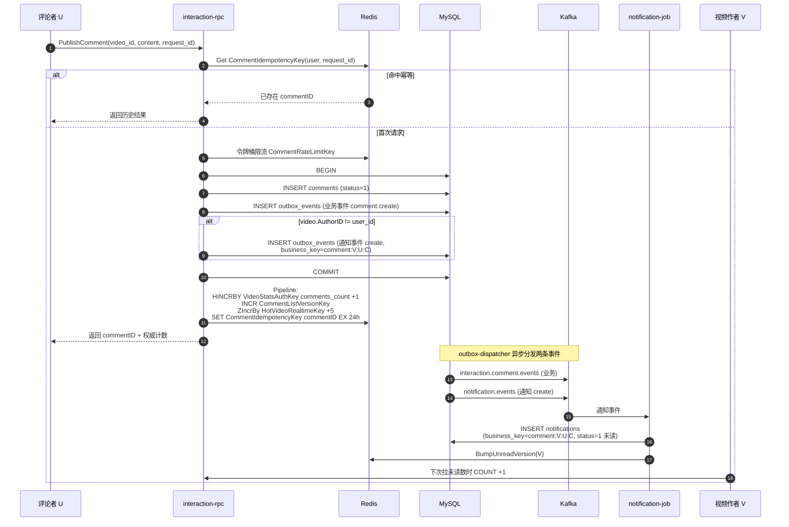

**关键点**：

1. **事务内一次落三张表**：`comments` + 业务 outbox + 通知 outbox（自评自视频除外），保证"评论存在"和"通知会送达"要么全成、要么全无；
2. **通知事件的 business_key 在事务落库时就已经算好**：拼法为 `comment:{视频作者ID}:{评论作者ID}:{评论ID}`，见 [common/eventx/notification.go](../common/eventx/notification.go) 的 `NotificationBusinessKey`；这个 key 既是 `notifications.uk_notification_business` 的唯一约束，也是撤回时的匹配依据；
3. **自评自视频不发通知**：`ValidateNotificationEvent` 里硬编码 `ReceiverID == ActorID → error`，因此 `video.AuthorID == user_id` 的分支根本不构造通知 outbox；
4. **Redis 写在事务外**：评论列表版本号 `INCR`、权威计数 `HINCRBY`、热度 `ZIncrBy`、幂等键 `SET` 全部在 Pipeline 里一次完成，MySQL 提交成功才执行——这里 Redis 挂了也不影响持久性，Consumer 投影和 TTL 兜底会最终收敛。

##### 二、DeleteComment 完整流程

入口 [deletecommentlogic.go](../apps/interaction/internal/logic/deletecommentlogic.go)。

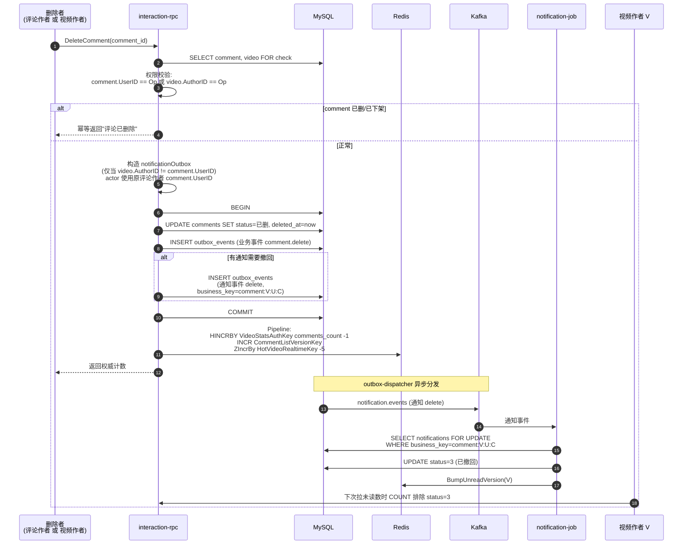

**权限模型**：只有两类人能删——**评论作者本人**、**视频作者（管理员语义）**。判定见 `deletecommentlogic.go` L51。

##### 三、"撤通知"到底在撤什么

这是评论删除和点赞取消最容易被误解的地方。**撤通知不是"阻止推送发出"，而是"把已经落到收件人邮箱里的那条通知记录标记为已撤回，并让未读数回落"**。

一个类比：

> **发评论 = 发一封邮件**："U 评论了你的视频"；
> **删评论 = 发一封撤回请求邮件**："请把我上一封邮件从收件人的收件箱撤回"；
> **notification-job = 收件人的邮件服务器**：负责把撤回请求应用到已经落地的邮件上——推送出去的弹窗收不回来，但至少能让"未读列表"里那条消失、badge 数字回落。

具体到时机：

| 时机 | V 的收件箱列表 | V 的未读数 badge | V 是否弹过 push |
|---|---|---|---|
| V 一直没开 App | 打开后**看不到**这条通知（列表过滤 `status=1`） | 不会 +1 | 若 APNs/FCM 已送达，锁屏可能闪过 |
| V 恰好在评论存在的窗口内刷新过收件箱 | 曾看到"U 评论了你" | 短暂 +1，之后回落 | 可能收到过 |
| 删除完成后 V 才打开 | 那条通知不再展示 | 无变化 | —— |

**保证的是最终一致性**：评论没了 → 收件箱里那条也没了、未读数扣回来。至于弹窗是否已经打扰过用户，业务层管不了那么远。

##### 四、为什么 Delete 事件的 actor 必须使用"原评论作者"

见 `deletecommentlogic.go` L70-71 的注释：

```go
// 删除动作的 actor 必须使用原评论作者，而不是当前执行删除的人。
// 视频作者代删他人评论时，才能准确撤回原评论通知的 business_key。
```

原因串起来看：

1. 发评论时通知 business_key = `comment:{V}:{U}:{C}`，其中 `U` 是评论作者；
2. Consumer 撤回时靠 `WHERE business_key = ?` 精确匹配 [consumer.go](../apps/job/notification/internal/logic/consumer.go) L377；
3. 如果 `V` 代删 `U` 的评论时 actor 传成当前 `userID`（即 `V` 自己），delete 事件的 business_key 会变成 `comment:{V}:{V}:{C}`，**与当年落库的 `comment:{V}:{U}:{C}` 对不上**，Consumer 查不到记录，撤回失败，`V` 收件箱里那条通知永远撤不掉、未读数也降不回来。

因此 `actorID` 在通知语义里代表**业务身份**（这条通知是"谁"引起的），而不是**动作发起者**（谁按了删除按钮）——Create 和 Delete 必须指向同一条业务通知，`(receiver, actor, target)` 三元组必须字节级一致。

##### 五、为什么不能"删的时候干脆不发通知"

看上去省事：如果发布评论 → notification-job 消费 Create 前，评论就被删了，能不能干脆不发 Delete，让 Create 也不落库？

答案：**不能**，理由：

1. **写侧不知道读侧状态**：interaction-rpc 提交事务时，notification-job 可能已经消费完 Create 并落库，也可能还在 Kafka 里排队；写侧无从判断，只能"我发出撤回意图，你负责收敛"；
2. **Kafka 无法回收在途消息**：Create 一旦进入 Kafka，就算 job 层还没消费，删除操作也没有任何手段把它抽出来；
3. **顺序容忍**：同 `business_key` 走同一 partition 有序，但 job 处理有延迟、可能重试；必须让 Consumer 自己拿 business_key + status 做收敛，任意顺序都能正确落地（Create 先到→INSERT status=1；Delete 后到→UPDATE status=3；哪怕 Delete 先到 Create 后到，也有 6 种状态转移表兜底，见 8.5 通知模块 [[memory:9l16e7mx]]）；
4. **跨服务无共享事务**：interaction 的 MySQL 事务和 notification-job 的 MySQL 事务是两个独立事务，只能靠"发件箱 + 幂等消费者"这套模式做到"评论存在 ↔ 通知存在"的最终一致。

##### 六、Redis 缓存变更点（写侧速览）

| 场景 | Redis 动作 | Key |
|---|---|---|
| PublishComment | `HINCRBY comments_count +1` | `VideoStatsAuthKey(videoID)` |
| PublishComment | `INCR` 评论列表版本号 | `CommentListVersionKey(videoID)` |
| PublishComment | `ZIncrBy +5` 实时热度 | `HotVideoRealtimeKey` |
| PublishComment | `SET commentID EX 24h` 幂等 | `CommentIdempotencyKey(userID, requestID)` |
| DeleteComment | `HINCRBY comments_count -1`（GREATEST 防负） | `VideoStatsAuthKey(videoID)` |
| DeleteComment | `INCR` 评论列表版本号（作废首页缓存） | `CommentListVersionKey(videoID)` |
| DeleteComment | `ZIncrBy -5` 实时热度 | `HotVideoRealtimeKey` |
| 两者共有 | 事务提交后 Consumer 侧 `BumpUnreadVersion(V)` | `fsz:notification:unread:version:{V}` |

##### 七、一句话总结

评论发布/删除采用**双 outbox**（业务 + 通知）在同一 MySQL 事务里落库，写侧原子、读侧最终一致。所谓"撤通知"不是拦截推送，而是通过 delete 事件让 notification-job 把 `notifications` 表里对应 `business_key` 的那行状态改为已撤回、并 bump 未读数版本号——**评论没了，收件箱里那条也会跟着消失，未读数最终会回到正确值**。而实现这一切的关键，是 delete 事件的 `(receiver, actor, target)` 三元组必须与 create 时完全一致，所以 actor 永远回填**原评论作者**，与"谁触发这次删除"无关。

---

### 8.4 Social 社交模块

**职责**：关注关系、粉丝/关注列表、粉丝数维护、大 V 升级。

**核心 RPC**：

| Rpc | 说明 |
|---|---|
| `Follow` | 事务：`INSERT follows ON DUPLICATE KEY UPDATE` + accounts 双向计数 +1 + **大 V 升级判定** + 双 outbox 事件（业务 + 通知） |
| `Unfollow` | 事务：软删 follows + accounts 双向计数 -1（GREATEST 防负）+ 双 outbox |
| `IsFollowing` | Redis `fsz:social:following:{f}:{t}` |
| `BatchIsFollowing` | 视频列表页批量查关注状态 |
| `ListFollowers` / `ListFollowings` | 首页 Redis 缓存 + 构建锁 + 分页兜底 MySQL |

**Follow 关键事务**（包含防死锁双侧行锁）：

为防止 A↔B 同时互相关注时两个事务分别先锁对方行形成锁序反转，事务开始先按 `MIN(followerID, followingID)` → `MAX(followerID, followingID)` 顺序对 accounts 表双行 `SELECT FOR UPDATE`（见 `lockFollowAccounts`），再读写 follows / 计数字段。

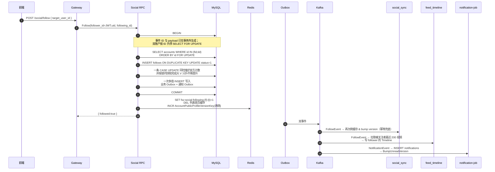

**大 V 判定详解**：见 [8.6 Feed 推拉分离](#86-feed-推拉分离模块)。

#### 8.4.1 设计取舍与并发保护

**为什么 accounts 双行 `FOR UPDATE` 要按 ID 升序？**

经典死锁场景：A 关注 B 的同时 B 关注 A：
- 事务 X（A→B）：先锁 A 行，再锁 B 行
- 事务 Y（B→A）：先锁 B 行，再锁 A 行
- 两个事务互等对方持有的锁 → **死锁**

`lockFollowAccounts` 强制按 `MIN(followerID, followingID) → MAX(...)` 顺序上锁，任何两个并发事务的加锁序列都相同，从根本上消除锁序反转。

**为什么 `is_big_v` 是"只升不降"的标志位，而不是按实时 follower_count 判断？**

如果按实时粉丝数判断大 V：
- 大 V 掉粉一瞬间被判为小 V → feed_timeline 会把他的新视频**写扩散到所有粉丝 inbox**
- 粉丝一多，一次写扩散几百万条 ZADD → **瞬间打爆 Redis**
- 而且此时如果他又涨粉回到大 V，历史视频依然留在粉丝 inbox 里，读侧再去 outbox 合并会**重复出现**

采用 `WHERE is_big_v=0 → SET is_big_v=1` 的幂等升级，且**永不回退**，从根源消除"抖动型写扩散"。

**为什么 Follow 事务里同时写"业务 outbox"+"通知 outbox"？**

同一次 Follow 触发的下游包括：
- 关注关系缓存 `social_sync`
- 关注流写扩散 `feed_timeline`
- 关注通知落库 `notification`

如果只发一条通用事件让所有消费者共享，每个消费者都要判断"这条事件跟我有没有关系"，**耦合度高、演进困难**。

拆成两条 outbox 之后：
- `social.follow.events` → social_sync + feed_timeline 消费（业务事件）
- `notification.events` → notification-job 消费（通知事件）
- 两条 outbox 都在**同一个 MySQL 事务里**写入，天然一致

**Follow 抗压分析**：

| 环节 | 是否是瓶颈 | 说明 |
|---|---|---|
| accounts 双行 FOR UPDATE | **关注同一目标时会串行维护该目标计数** | 这是强一致计数的明确热点；通过短事务、一次 CASE UPDATE、有限重试降低持锁时间，容量仍应以压测为准 |
| follows INSERT ON DUPLICATE KEY | 不是 | 唯一键 `(follower, following)` 每对都不同 |
| outbox_events 多值 INSERT | 不是 | 业务事件和通知事件一次数据库往返写入 |
| 双向 profile 版本号 INCR | 不是 | Redis 原子操作 |

**为什么 ListFollowers/ListFollowings 首页缓存需要构建锁？**

粉丝/关注列表首页缓存 miss 时要 `SELECT` 拉一批（几百条）+ 组装 JSON，如果一位大 V 首页缓存刚失效，几百个粉丝同时刷新会**并发触发几百次 MySQL 查询** → 缓存击穿。

`fsz:social:followers:build_lock:{user}` SETNX 5s 保证同一时刻**只有一个请求去回源 MySQL**，其他请求短暂等待并重读缓存。

#### 8.4.2 Follow/Unfollow 事务级死锁重试与预检移除

即便 accounts 双行 `FOR UPDATE` 已经消除锁序反转，InnoDB 在高并发下仍可能因为唯一索引、插入意向锁或其他事务同时访问多张表而返回 `1213/1205`。当前实现不假设“固定锁顺序等于永不死锁”，而是再加一层有限事务重试：

- `runSocialWriteTransaction`（见 `apps/social/internal/logic/socialhelper.go`）将整个 Follow/Unfollow 事务包裹在重试循环里，仅对 `mysql.MySQLError.Number` 为 `1213 / 1205` 的错误进行有限重试，其余错误（包括唯一键、外键、业务参数错误）直接向上抛。
- 默认重试 3 次（`socialDBMaxRetries`），退避基准 20ms，封顶 200ms，**附加最多 50% 拖抽**（`socialDBRetryDelay`），避免同一批被回滚事务同时重试再次同步争锁。
- **重试安全前提**：领域事件 ID、时间和 Outbox payload 在进入事务前一次性生成，所有重试复用同一组业务标识；事务内只重置 `stateChanged` 等瞬时状态。批量写 Outbox 前复制结构体并把 GORM 自增 ID 清零，避免上一轮已回滚事务的回填值污染下一轮。

**事务内数据库往返也做了压缩**：

- `lockFollowAccounts` 一次查询按主键升序锁住两行，并顺带返回被关注者的 `follower_count/is_big_v` 快照，不再额外回读账户。
- `updateFollowAccountCounters` 用一条 CASE UPDATE 同时维护关注者 `following_count` 和被关注者 `follower_count`；取关使用 `GREATEST(CAST(... AS SIGNED)-1, 0)` 防无符号下溢。
- Follow 根据锁内快照计算是否首次达到大 V 阈值，并在同一 CASE UPDATE 中只升不降；Unfollow 不回退 `is_big_v`。
- `createSocialOutboxEvents` 把业务事件和通知事件合并为一次多值 INSERT，减少账户行锁持有期间的数据库往返。

**同时移除了两个不必要的预检锁**：

- 旧实现在事务中先调 `AccountRpc.GetProfile` 预检目标用户是否存在，既多一次 RPC 往返，又在事务完成前可能造成长时间持锁。当前实现已删除预检，直接在 INSERT 命中外键/唯一键错误时把错误归一到 `codes.NotFound`。
- 旧实现一开始就 `SELECT ... FOR UPDATE` 拉 follows 行，对不存在的唯一键会产生 **gap lock**，后续 `INSERT` 又升级为插入意向锁，导致高并发下频发 1213。当前实现改为**普通 `Take`**（不加锁）预读已存在关系，依靠 accounts 双行 FOR UPDATE 充当构件互斥。若不存在，使用 `INSERT ... ON DUPLICATE KEY DO NOTHING`，并在并发冲突的反馈（`RowsAffected == 0`）后才回读加锁处理。

**关于“目标用户不存在”的错误反馈**：尽管写事务不再预检 `GetProfile`，Follow 接口末端仍然能识别目标不存在——INSERT 时会命中 follows 表的外键约束（`follows.following_id → accounts.id`）而直接报错，`Follow` 把它归一为 `codes.NotFound` “目标用户不存在”返回给上游。

---

### 8.5 Notification 通知模块

**职责**：接收 `notification.events`（关注/点赞/评论触发），维护 `notifications` 表，提供未读数 & 通知列表。

**核心 RPC**（`apps/notification/internal/logic/`）：

| Rpc | 说明 |
|---|---|
| `ListNotifications` | `(occurred_at DESC, id DESC)` 复合游标分页；`receiver_id` 兜底校验 |
| `GetUnreadCount` | 走 `notificationcache.LoadUnreadCount` 版本号缓存，miss 时 `SELECT COUNT(*) WHERE status=1`，Redis 挂了直接回源 |
| `MarkNotificationRead` | UPDATE 单条为已读；`rowsAffected>0` 时 `BumpUnreadVersion` |
| `MarkAllNotificationsRead` | 批量 UPDATE 所有未读为已读；`changed>0` 时 `BumpUnreadVersion` |

**未读数缓存（版本号 + 惰性重算）**：

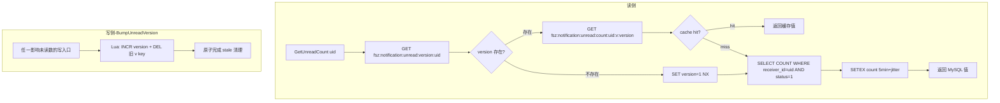

**Notification Job 6 种情况判定**：

Job 消费 `notification.events` 时，需要精确判断"这次事件是否真的影响未读数"，只在影响时 `BumpUnreadVersion`：

| # | 场景 | MySQL 动作 | 未读数变化 | bump? |
|---|---|---|---|---|
| 1 | 全新通知 (business_key 不存在) + create | INSERT (status=1) | +1 | ✅ |
| 2 | 已撤回通知 (status=3) + create（复活） | UPDATE 3→1 | +1 | ✅ |
| 3 | 旧事件（OccurredAt < 现有 record） | 什么都不做 | 不变 | ❌ |
| 4 | 未读通知 + delete | UPDATE 1→3 | -1 | ✅ |
| 5 | 已读通知 + delete | UPDATE 2→3 | 不变 | ❌ |
| 6 | 已撤回通知 + 重复 delete | UPDATE 3→3 (无变化) | 不变 | ❌ |

`applyNotificationEvent` 返回 `bumpReceiverID uint64`（0 表示不需要 bump），事务 COMMIT 成功后再统一调 `BumpUnreadVersion`。

**通知流程**：

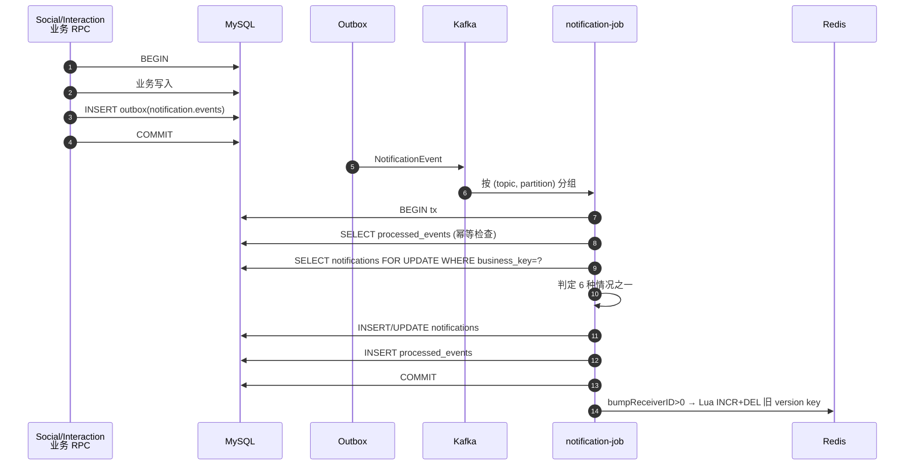

#### 8.5.1 设计取舍：为什么用"版本号 + 惰性重算"？

最直觉的做法是 **"读一次 → SETEX 缓存，写一次 → DEL 缓存"**，但它有三个问题——本项目正是为了绕开这三个问题才最终选择"版本号 + 惰性重算"：

- 问题 1：**并发写导致缓存穿透** —— 大量写事件同时 DEL 后，读会集中回源到 MySQL COUNT
- 问题 2：**缓存与 MySQL 之间的不一致窗口** —— DEL 之后、下一次读回填之前，会短暂读到旧值
- 问题 3：**Redis 宕机重启后所有缓存丢失** —— 大量用户同时 miss → 打爆 MySQL

**本项目采用的做法（版本号 + 惰性重算）如何解决这三个问题**：

- 写路径不 DEL 缓存，只 **INCR version + 一次性 DEL 旧版本 key**（Lua 原子）
- 读路径 `GET version → GET count:v:{version}` 组合 key，miss 时 SELECT COUNT
- **Redis 挂了**：`LoadUnreadCount` 直接降级 `SELECT COUNT WHERE status=1`，业务不中断
- **写扩散**：只写一个 version key，一次 INCR 是原子的，即使 1000 个并发 bump 也只是最后 version 变化，**不会产生缓存击穿**

**核心不变式**：
- 任一次 `MarkRead` / `INSERT notifications` 之后，version 必然递增
- 下一次读用最新 version 组合 key，一定是 miss → **强制回源** MySQL，读到最新值
- 旧 version 的 count key 用 5 分钟 TTL + Lua DEL 兜底，不会长期占内存

**bump 时机的自愈机制（`attemptBumpReceivers` 每轮独立）**：

`notification-job` 的事务体 `applyNotificationEvent` 会返回本条事件是否需要 bump 未读版本号。在 `apps/job/notification/internal/logic/consumer.go` 中，事务重试循环为**每一次尝试都新建一个 `attemptBumpReceivers` 局部集合**：

```
for attempt := 0; ; attempt++ {
    attemptBumpReceivers := make(map[uint64]struct{})
    txErr := c.svcCtx.GormDB.Transaction(func(tx *gorm.DB) error {
        // ...accumulate bumpReceiverID into attemptBumpReceivers...
    })
    if txErr == nil { bumpReceivers = attemptBumpReceivers; break }
    if !isRetryableNotificationDBError(txErr) { return txErr }
    ...
}
```

这样即使前一轮事务因 1213/1205 被完整回滚，也**不会**把已回滚事务里收集的 receiver 带到后续成功提交后去 bump——避免“数据库回滚了但未读版本号却乱 bump”的脏数据。`isRetryableNotificationDBError` 只对 MySQL 1213（死锁）/ 1205（锁等待超时）返回 true，其他错误直接上抛不重试，避免把约束错误伪装成瞬时故障。

**重试参数可配置**（`Notification.DBMaxRetries / DBRetryBaseMs / DBRetryMaxMs`，默认 3/20/200 ms，上限 8），重试间隔指数退避 + 抵抗0.5 倍拖抽（`c.dbRetryDelay`），避免同一批被回滚事务同时重试再次撞锁。

#### 8.5.2 为什么 6 种情况的 bump 判定要精确？

如果无脑 bump（不管事件是否真影响未读数），会导致：
- 幂等重放的旧事件 → 缓存 miss → 触发 SELECT COUNT → **性能浪费**
- "已撤回通知的重复 delete"这种无效事件也 bump → 频繁失效缓存

`applyNotificationEvent` 返回 `bumpReceiverID uint64`（0 表示不 bump），配合 6 种情况精确判定，只在**真的可能影响 status=1 计数**时才 INCR version，最大化缓存命中率。

**为什么 `BumpUnreadVersion` 在事务 COMMIT 后调用而不是事务内？**

- **在事务内调用 Redis 违反了"事务边界内不应有外部副作用"** —— 事务回滚时 Redis 已经改了，回不去
- **事务 COMMIT 失败** → 事件会重试 → 重试成功时才 bump，Redis 状态和 MySQL 一致
- **Redis bump 失败** → 只 log 不重试；下一次读会因为**版本号不匹配（读到的还是旧版本 key）** miss 回源，天然自愈

---

### 8.6 Feed 推拉分离模块

**职责**：关注流（GetFollowingFeed）、热榜（GetHotFeed）、推荐流（GetRecommendFeed）。

Feed RPC **只返回 video_id 和排序信息**，具体视频详情、作者昵称、点赞数由 Gateway 分别通过三个 Batch 接口聚合，避免 Feed 服务越权访问其他领域数据。

#### 8.6.1 推拉分离核心思想

|  | 小 V (is_big_v=0) | 大 V (is_big_v=1) |
|---|---|---|
| 写路径 | 发视频时 fanout 到所有粉丝的 inbox ZSet | 只写自己的 author outbox ZSet |
| 读路径 | 直接读 inbox | 拉取关注列表中的大 V outbox 合并 |
| 优点 | 读快 | 写快，不放大 |
| 缺点 | 写放大 | 读时多几次 ZRANGE |

**大 V 判定采用 `is_big_v` 标志位而非实时 `follower_count`**：

- 一旦升为大 V 就永久保留（`WHERE is_big_v=0` 幂等升级）。
- 避免大 V 掉粉后再涨粉的"反向穿越"：如果按粉丝数实时判定，掉粉那一瞬间历史视频从粉丝的 inbox 里 fanout 走了，反向穿越时再涨回来也拿不回来。

#### 8.6.2 GetFollowingFeed 流程

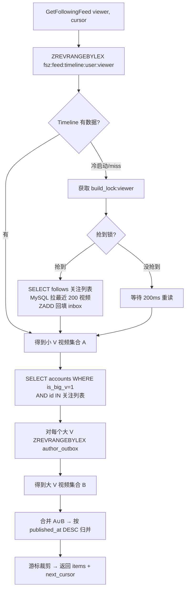

#### 8.6.3 feed_timeline Job 事件驱动

- **video.published**：查作者 `is_big_v`。小 V → fanout 到所有活跃粉丝 inbox；大 V → 只 ZADD 作者 outbox。
- **video.deleted**：从相应 ZSet 中移除（回读 MySQL 事实状态兜底）。
- **follow.created**：拉取被关注者最近 200 视频，写 follower inbox（如果被关注者是大 V，跳过，直接依赖读侧合并 outbox）。
- **follow.deleted**：从 follower inbox 中移除被关注者的所有视频。

**Global Timeline ready 禁不可丢**：全局最新流 ZSet `fsz:feed:global_timeline` 需要配套一个 `ready` 标记才可以接受写入，防止尚未初始化时写了一半的数据。一旦指标丢失（例如 Redis flush），writer 会返回 `errGlobalTimelineNotReady`；旧方案靠 Kafka 无限重试无人恢复。新方案：**consumer 层捕获该错误后调用 `BootstrapGlobalTimeline`（带分布式锁）完成一次重建，再重试当前事件**，避免 Kafka 原地重试风暴。

**Timeline 冷启动保护**：
- `fsz:feed:timeline:build_lock:{viewer}` 5-10s 锁，避免同一用户多个请求并发触发 MySQL 全量回填。
- `fsz:feed:timeline:user:{viewer}` 使用 `EXPIRE 7d`，长期不活跃用户自动淘汰。
#### 8.6.4 Timeline ZSet 编码

来自 `common/feedx/timeline.go`：

- 所有元素 `score=0`，实际顺序由 member 字典序决定。
- Member 格式：`{publishedAt:19位}:{videoID:20位}`，前 0 补齐，保证 lex 排序等价于数值排序。
- 使用 `ZREVRANGEBYLEX` 分页，游标格式 `(member` 实现排他上界，无重复无遗漏。

#### 8.6.5 设计取舍与抗压分析

**为什么用推拉分离而不是纯推 / 纯拉？**

| 方案 | 写路径 | 读路径 | 致命缺陷 |
|---|---|---|---|
| **纯推（写扩散）** | 发视频 → 写到所有粉丝 inbox | 直接 ZREVRANGE | 大 V 一次写扩散上千万条 ZADD → **打爆 Redis** |
| **纯拉（读扩散）** | 发视频 → 只写作者 outbox | 拉关注列表 N 个 outbox 归并 | 关注了几千人的用户每次拉 Feed 都要拉几千个 ZSet → **读放大灾难** |
| **推拉分离**（当前） | 小 V 写扩散 / 大 V 只写自己 outbox | inbox（小 V 已扇入）+ 关注的大 V outbox 合并 | 兼顾读写，大 V 数量有限 → 读侧合并可控 |

**读侧成本估算**：假设用户关注 500 人，其中大 V 20 人（`is_big_v=1`）：
- 480 个小 V 的最近视频**已经在 inbox**里（feed_timeline 写扩散过） → 1 次 ZREVRANGEBYLEX
- 20 个大 V 分别拉 outbox → 20 次 ZREVRANGEBYLEX（可以 pipeline 并发）
- 合并归并 → O(K log K)，K 是 pagesize 200

**写侧成本估算**：
- 小 V 发视频（假设 1000 粉丝）→ 1000 次 ZADD，几十毫秒，可接受
- 大 V 发视频（假设 100 万粉丝）→ **1 次 ZADD**（只写自己 outbox） → 常数时间

**Timeline 冷启动的三层保护**：

1. **build_lock 分布式锁**：`fsz:feed:timeline:build_lock:{viewer}` SETNX 10s，同一用户多个并发请求只让**一个**去回源 MySQL
2. **7 天 TTL**：不活跃用户的 inbox 自动淘汰，避免亿级用户全量常驻 Redis
3. **懒加载**：冷用户第一次拉 Feed 才触发构建（`SELECT follows` + 拉每个关注对象最近 200 视频）

**Global Timeline ready 自愈**：`fsz:feed:global_timeline` 需要 `ready` 标记才允许写入，防止半初始化状态。旧方案在 `errGlobalTimelineNotReady` 时靠 Kafka 无限重试等人恢复。新方案：consumer 层捕获后调用 `BootstrapGlobalTimeline`（内部分布式锁，避免多实例重复重建）完成一次重建，再重试当前事件，**自愈无人工介入**。

**为什么 feed_timeline job 用回读 MySQL 事实状态而不是靠事件 OccurredAt 排序？**

事件流可能存在：
- Kafka 重试导致乱序（例如先收到 delete 再收到 create）
- 消费者宕机重启后重放（重复处理旧事件）

如果单纯靠 `OccurredAt.Before(existing)` 跳过旧事件，任何一次 ZSet 数据丢失都无法通过重放恢复。改成**每次都回读 MySQL 的 status/is_big_v 事实状态**决定 add/remove，**天然幂等**、天然自愈。代价是每个事件多一次 SELECT，但比数据错乱强得多。

---

### 8.7 HotRank 热榜模块

**职责**：以独立 Consumer Group 直接消费 `interaction.like.events` 和 `interaction.comment.events`，将每条互动按发生时间写入 UTC 单分钟热度窗口；Feed 读侧把最近 N 个窗口按时间衰减合并成稳定分页快照。

**核心机制**：

- 点赞权重为 `3`，评论权重为 `5`；取消点赞/删除评论写入对应负分。
- 每分钟一个 ZSET：`fsz:hot:window:{yyyyMMddHHmm}`，member=videoID，score=该分钟净热度。
- Redis Lua 在同一原子块中写 `ProcessedEventKey(eventID, hotrank)` 与 `ZINCRBY`，Kafka 重放不会重复计分。
- 消息按 `topic+partition` 分组，组内保序、组间默认 4 worker 并发；坏消息进入 `dead_letter_events`。
- 分钟窗口默认保留 2 小时；超过保留期的旧消息只写幂等标记，不复活过期窗口。
- `GetHotFeed` 默认聚合最近 60 个分钟窗口，按 30 分钟半衰期加权，通过临时 ZSET + Lua 校验锁 + `RENAME` 原子发布快照。
- 快照 key 为 `fsz:hot:merge:{asOf}`，`ready` key 即使值为 0 也表示“已成功构建空榜”，避免缓存穿透。

```mermaid
flowchart LR
    I[Interaction RPC<br/>Outbox] --> K[Kafka<br/>like/comment events]
    K --> H[hotrank Job<br/>独立 Consumer Group]
    H --> L[Redis Lua<br/>事件幂等 + ZINCRBY]
    L --> W[UTC 单分钟窗口 ZSET]

    F[Feed.GetHotFeed] --> C{snapshot ready?}
    C -->|是| S[读取固定 merge 快照]
    C -->|否| SF[本地 SingleFlight]
    SF --> DL[Redis 分布式构建锁]
    DL --> ZU[ZUNIONSTORE<br/>最近 60 分钟 + 衰减权重]
    ZU --> TMP[临时 ZSET 只保留 Top K]
    TMP --> P[Lua 校验锁并原子发布<br/>merge + ready]
    P --> S
```

#### 8.7.1 为什么使用分钟窗口 + 固定快照

直接按 `videos.popularity` 全表排序无法表达时间窗口，而且数据量增长后排序成本高。分钟窗口让写入只做一次 `ZINCRBY`，读侧再通过 `ZUNIONSTORE` 合并有限窗口；同一个 `snapshot_at` 只构建一次并缓存 30 分钟，后续分页始终读取同一份榜单，不会因新互动导致翻页重复或遗漏。

缓存命中与冷构建的本机实测见 §14.6：匿名非空热榜在 Gateway 2 秒成品缓存命中时，50 并发三轮中位数为 8468.8 QPS、P99 15ms；显式删除当前分钟 merge、ready 和 Gateway 成品缓存后，三次单请求冷构建平均 11.77ms、最大 15.86ms，且每次都返回 20 条视频。这里必须区分“持续缓存命中吞吐”和“单次冷构建耗时”，不能再用持续 30 秒压测的 QPS 代表一次快照构建成本。

---

### 8.8 Gateway 网关

**职责**：HTTP → gRPC 转换、JWT 鉴权、请求参数校验、**跨模块 Batch 聚合**。

**核心中间件**：

- `TokenAuth`：解析 `Authorization: Bearer <jwt>` → 校验 → 把 `user_id` 放进 `context`。
- `OptionalTokenAuth`：有 token 就解析，没有就放行（用于游客可见的 `/feed/hot`、`/video/{id}` 等接口）。

**聚合层职责**：

Feed / 通知列表 / 评论列表等场景，Gateway logic 层负责：
1. 从 RPC 拿到 ID 列表。
2. 按 RPC 上限切片调用 `BatchGetVideos` / `BatchGetProfiles` / `BatchGetVideoStats` / `BatchIsFollowing`。
3. 组装成前端友好的 DTO。

视频卡片聚合采用“两阶段并发”：先通过 Video RPC 批量取得基础视频，这是后续补充字段的共同输入；随后 Account `BatchGetProfiles` 与 Interaction `BatchGetVideoStats` 并发执行。两个补充 RPC 彼此独立，任意一路失败都会保留基础视频和另一路已经成功的结果，不因作者昵称或互动统计的短暂故障让整页不可用。`BatchGetVideos` 每批最多 100 个，互动统计每批最多 50 个，避免超出 RPC 的输入限制。

```mermaid
flowchart LR
    IDs[Feed 返回 video_ids] --> V[BatchGetVideos<br/>基础视频]
    V --> A[Account BatchGetProfiles]
    V --> I[Interaction BatchGetVideoStats]
    A --> M[合并作者最新资料]
    I --> M2[合并计数与 is_liked]
    M --> DTO[HTTP 视频卡片]
    M2 --> DTO
```

**匿名热榜完整响应缓存**：

- `viewerID=0` 且配置启用时，缓存最终 `GetHotFeedResp` JSON，而不是只缓存 videoID。key 包含分钟级 `snapshot_at`、`offset` 和归一化后的 `page_size`，不同快照和分页不会串数据。
- 默认 TTL 仅 2 秒，目的是吸收首页突发读流量，而不是长期保存业务状态。匿名响应没有个性化字段，因此可以跨用户共享。
- 单实例使用 go-zero `SingleFlight` 合并相同 key；多实例再使用 Redis `SETNX` 构建锁。锁值是随机 token，释放时通过 Lua 校验 token 后删除，避免旧请求误删新锁。
- 未持锁请求最多等待 250ms，并每 25ms 重读缓存；超时后直接构建当前请求但不写共享缓存。Redis 不可用、缓存 JSON 损坏或锁竞争超时都只损失缓存收益，不阻断热榜读取。
- 登录用户必须实时计算 `is_liked`，因此绕过完整响应缓存，只使用上面的 Account/Interaction 并行聚合。否则匿名用户构建的 `is_liked=false` 会污染登录用户结果。

这层缓存与 Feed RPC 的 `fsz:hot:merge:{asOf}` 排名快照职责不同：Feed 快照保证固定榜单和稳定翻页，Gateway 缓存的是已经补全作者和互动字段的最终 HTTP DTO。两者分别减少“热榜合并”和“跨 RPC 聚合”开销。

**作者昵称/评论作者回填**（commit 687d0ab 强化）：`GetVideo` / `ListUserVideos` / `ListComments` 三个页面另外调用一次 `enrichHTTPVideoAuthors` 或 `loadSocialUserInfoMap`，把 Video / Comment 表内冗余的旧“作者快照用户名”替换为 Account RPC 里的最新昵称；RPC 失败时降级返回快照，保证列表仍可用。

**禁止 N+1**：所有 RPC 的批量接口存在就是为了这一点。最终压测中，真实非空匿名热榜的三轮中位数从优化前 1325.3 QPS 提升到 8468.8 QPS，P99 从 53ms 降到 15ms；该结果只代表匿名短 TTL 缓存命中场景，不能外推为登录用户或写接口吞吐。

---

## 九、关键异步 Job 详解

### 9.1 Outbox Dispatcher

#### 9.1.0 通俗版：Outbox 到底在做什么？

先抛开代码看**业务问题**。以点赞为例，一次成功的点赞要做两件事：

1. 在 MySQL 的 `likes` 表插入一条记录（这是权威事实）。
2. 通知下游：更新 `videos.likes_count`、刷新 Redis 缓存、给作者发通知、推热榜、进个人页流水……（这些是派生状态）

如果直接在 RPC 里"先写 MySQL 再发 Kafka"，就会出现 4 类不一致：

- MySQL 写成功、Kafka 发失败 → 派生状态永远追不上。
- Kafka 发成功、MySQL 事务回滚 → 下游算了一次不存在的点赞。
- Kafka 发成功、RPC 返回超时给客户端，客户端重试一次 → 下游算了两次。
- 网络抖动导致 Kafka 消息发出去了但业务不知道 → 无法排障。

**Outbox 事务发件箱模式**把"通知下游"变成"往同一个 MySQL 事务里插一行事件"。业务 RPC 只需保证 `likes 表 INSERT` 和 `outbox_events INSERT` 在**同一个本地事务**里成功，事务提交 = 消息一定会被投递（哪怕现在 Kafka 宕机也没关系，事件躺在 MySQL 里等着，稍后重投）。真正把消息发到 Kafka 的活儿，交给一个独立的后台任务 —— 也就是 `outbox-job` 的 `Dispatcher`：

1. **定时轮询**：每 1 秒扫 `outbox_events` 表，捞出到期未投递的事件。
2. **认领**：把这批事件从 `pending` 改成 `processing`，打上"我在处理"的标记。
3. **投递**：把消息 `PublishBatch` 到对应 topic。
4. **回写**：如果 Kafka 确认收到就改成 `sent`；如果失败就 `retry_count+1` 并安排下次重试；重试到上限就转 `dead` 等人工处理。

Outbox Dispatcher 是非阻塞的定时拉取 + 分片并发投递。完整实现在 `apps/job/outbox/internal/logic/dispatcher.go`，涉及三个关键机制：**同业务聚合保序**、**分片并发投递**、**批量回写 lock_token 验证**。

**主循环与并发限制**：

- `Run` 按 `Outbox.PollIntervalMs`（默认 1s）制造 tick；每个 tick 尝试启动一轮 `DispatchOnce`。
- 使用 `inFlight := make(chan struct{}, 1)` 令牌：**同时只会有 1 轮 `DispatchOnce` 运行**，上一轮未完时后续 tick 直接 skip 并记录 warn，避免堆积时无限创建 goroutine。
- 单轮任何失败只记录日志，下一轮自然重试（后台常驻任务不能因一时错误退出）。

**Claim 阶段（`claimDueOutboxEvents`）**：

一个显式使用 `READ COMMITTED` 的短事务内完成“拉一批 + 标记 processing + 写入 lock_token”：

```sql
-- 当前时间为 now，staleBefore = now - Outbox.ClaimTimeoutSeconds (默认 60s)
SELECT * FROM outbox_events
WHERE (
    (status IN (pending, failed) AND (next_retry_at IS NULL OR next_retry_at <= now))
    OR (status = processing AND locked_at IS NOT NULL AND locked_at <= staleBefore)
) AND NOT EXISTS (
    -- 关键保序约束：同聚合同时仅允许最早一条未完成事件被 claim
    SELECT 1 FROM outbox_events AS predecessor
    WHERE predecessor.aggregate_type = outbox_events.aggregate_type
      AND predecessor.aggregate_id   = outbox_events.aggregate_id
      AND predecessor.id             < outbox_events.id
      AND predecessor.status IN (pending, failed, dead, processing)
)
ORDER BY id ASC LIMIT :batch
FOR UPDATE SKIP LOCKED;
```

紧接着在**同一事务内**把选中行 UPDATE 为 `status=processing, lock_token=<本轮 16 字节随机值>, locked_by=<实例 ID>, locked_at=now`。

关键设计：

- **`FOR UPDATE SKIP LOCKED`**：多实例并发 claim 时互不阻塞，已被其他实例锁住的行直接跳过。

  > **SKIP LOCKED 到底是什么锁？** 它**不是**一种"新的锁类型"，而是 InnoDB `SELECT ... FOR UPDATE` 语句的一个**修饰符**，控制"遇到已被别人锁住的行时的行为"。
  >
  > 三种可选行为对比（想象 outbox 表里有 100 条待投递事件，两个 dispatcher 实例同时来 claim）：
  >
  > | 修饰符 | 行为 | 用在 outbox 会怎么样 |
  > |---|---|---|
  > | 默认（不加） | 等待前面的锁释放，最多等 `innodb_lock_wait_timeout`（50s） | 实例 B 会阻塞 50 秒直到实例 A 提交，吞吐掉到冰点 |
  > | `NOWAIT` | 立刻报错 `ER_LOCK_NOWAIT` | 实例 B 直接崩，需要业务层重试 |
  > | **`SKIP LOCKED`** | **跳过已锁行，只返回没被锁的行** | 实例 A 拿走前 50 条并锁定，实例 B **一次查询就直接拿到剩下的 50 条**，两边完全并行 |
  >
  > 换句话说，`SKIP LOCKED` = "别人在处理的我不碰，我只拿空闲的"。这正好匹配"多个 dispatcher 实例并发消费队列"这种典型的**任务队列**场景：MySQL 从 8.0 开始原生支持，配合 `SELECT ... FOR UPDATE SKIP LOCKED` 可以把关系表当轻量级消息队列用，不需要引入 Redis Stream 或专门的 MQ 就能做到多实例安全并发。
  >
  > 此外，为什么 outbox 需要 FOR UPDATE 加锁而不是普通 SELECT？—— 因为紧接着还要在**同一事务里** UPDATE 这批行的 `status/lock_token/locked_by`；如果不加锁，另一个实例可能在中间也 SELECT 到同一批行然后一起 UPDATE，就会出现两个实例都以为自己"独占"了这批消息，从而重复投递。加了 `FOR UPDATE`，行级 X 锁会一直持有到事务提交，其他事务想读同一行时只能选择等待或 `SKIP LOCKED` 跳过。

- **为什么显式用 `READ COMMITTED`**：Outbox claim 是任务队列扫描，不需要在同一事务里保持可重复读快照。相较 MySQL 默认 `REPEATABLE READ`，`READ COMMITTED` 让每条语句读取已提交数据，并减少范围扫描长期保留快照和 next-key/gap lock 的机会；配合短事务和 `SKIP LOCKED`，更适合多实例高频认领。这里的隔离级别只覆盖 claim 事务，Kafka 发布仍在提交后执行，不会把数据库锁带到网络 I/O 阶段。详细分析（gap lock 如何损害 `SKIP LOCKED` 精度、与业务侧 INSERT 的死锁风险、以及降级为 RC 为什么安全）见 §9.1.3 末尾"claim 事务的隔离级别"。

- **`NOT EXISTS` 前序子句**：同一 aggregate 必须等前序事件 `sent` 之后才能进入下一轮 claim，"同一视频先删后投递 create"、"同一用户先 unlike 后投递 like" 这类反序从根源不会发生。`dead` 事件也会阻塞后续，强迫人工补偿，不静默跨过。
- **专用索引 `idx_aggregate_status_id(aggregate_type, aggregate_id, status, id)`**（`016_outbox_aggregate_status_index.sql`）让 NOT EXISTS 只扫四种未完成状态，不会回扫同聚合已 sent 的历史事件。
- **本轮 `lock_token`**：同一批 claim 共享一个随机 token，后续投递失败 / 成功回写时都带 `WHERE id IN ... AND status = processing AND lock_token = :token`，因此“旧实例 claim 了一批 → 卡死→ 新实例 claim 同一批’’ 不会互相覆盖彼此的投递结果。

**Dispatch 阶段（`dispatchClaimedEvents` + `dispatchClaimedBatch`）**：

1. 认领到的一批事件通过 `splitOutboxBatches(events, workerCount)` 均匀分片；worker 上限默认 4（`normalizeOutboxWorkerCount`），上限 32，并且 worker 数不会超过事件总数。
2. **同一批 claim 内同一 aggregate 最多只有 1 条事件**（NOT EXISTS 保证），因此不同分片内部无需保序，可以安全地并发发包。
3. 每个分片一次性构造 `[]kafkax.Message` 调用 `Producer.PublishBatch`，只产生一次 Kafka 同步写往返（避免旧实现里“逐条发送”持续受到 `BatchTimeout` 影响）。消息 Header 携带 `event_id / event_type / aggregate_type / aggregate_id`，供 consumer 直接读取而不必反序列化 payload。

**投递后回写（`markSentBatch` / `markFailed`）—— Kafka Publish 失败会发生什么？**

先看正常路径：

- **全部成功**：一条 UPDATE 把本分片 `id IN (…)` 同时改为 `status=sent, sent_at=now, lock_token=""`，并卡 `WHERE status=processing AND lock_token=:token`；影响行数不等于分片大小会以 `claim_lost` 日志报错（意味着租约超时后被其他实例重抢，旧实例不能覆盖新结果）。事件从此不再参与投递，但仍在 MySQL 保留 7 天供审计，之后由 `event_cleanup` 小批删除。

再看失败路径。发布 Kafka 时可能出现：网络抖动 / broker 拒绝 / 请求超时 / broker 收到但 ack 丢失 / topic partition 不可用……代码统一走 `markFailed`：

1. **`retry_count + 1`**：直接用 `gorm.Expr("retry_count + 1")` 累加，事务外并发场景也不会丢计数。
2. **阶梯退避**：`nextRetryDelay(retryCount)` 走**指数退避**——第一次失败 `RetryBaseMs`（默认 1s），之后每失败一次翻倍，封顶 `RetryMaxMs`（默认 60s）。即 1s → 2s → 4s → 8s → 16s → 32s → 60s → 60s…… 避免瞬时抖动打满 Kafka；退避期间事件 `next_retry_at` 落在未来，`dueOutboxScope` 会自动跳过它。
3. **`last_error` 写入原因**：截断到 1024 rune，防止某些 Kafka 客户端错误消息动辄几 KB 把 `last_error` 撑爆导致 `Row size too large`。这条错误信息可以直接 `SELECT` 出来排障，不需要翻日志。
4. **`status = failed`**：让下一轮 `dueOutboxScope` 依然能扫到它（`status IN (pending, failed)`）。
5. **`lock_token / locked_by / locked_at` 全部清空**：这批 claim 的租约已经释放，任何实例都能重新认领它。
6. **超过 `MaxRetry` → `dead`**：默认最多重试到某个上限（配置项 `MaxRetry`）后，`status` 改为 `dead` 且 `next_retry_at=NULL`。**dead 事件不会再被自动重试**，需要人工干预（改代码修复 bug、清理坏数据、手动改回 `pending` 让它重投）——这是**故意的设计**，避免"坏事件"无限占用 Dispatcher 资源，同时因为 §9.1 里 `NOT EXISTS` 子查询把 `dead` 也算作"前序未完成"，它会**阻塞同一 aggregate 的后续事件**，逼迫运维必须处理，绝不静默跨越。

一个容易被忽略的边界：**Kafka 已经收到消息，但 DB 回写失败**（比如网络分区、DB 短暂 unavailable）。这时事件仍是 `processing`，`locked_at` 超时后会被下一轮 `dueOutboxScope` 重新捞出——**会导致同一条消息被投递第二次**。这不是 bug，而是 Outbox 模式的**天然属性**：at-least-once。因此下游 consumer **必须**用 `processed_events` 做业务幂等，见下面 §9.1.5。

**可观测性与配置**（`OutboxConf`）：`PollIntervalMs / BatchSize (上限 500) / WorkerCount (上限 32) / MaxRetry / RetryBaseMs / RetryMaxMs / PublishTimeoutMs / EventTimeoutMs / ClaimTimeoutSeconds`，均在 `dispatcher.go` 有默认值归一化。运维排障最常用的 SQL：

```sql
-- 卡在 pending/failed 太久的事件（可能上游一直失败）
SELECT id, topic, event_type, retry_count, last_error, next_retry_at
FROM outbox_events
WHERE status IN (1, 3)  -- pending, failed
  AND created_at < NOW() - INTERVAL 5 MINUTE
ORDER BY id ASC LIMIT 50;

-- 已经进入死信、等人工处理的事件
SELECT id, topic, event_type, aggregate_type, aggregate_id, retry_count, last_error, updated_at
FROM outbox_events WHERE status = 4  -- dead
ORDER BY updated_at DESC LIMIT 50;

-- 修复完 bug 后把 dead 事件复活重投
UPDATE outbox_events
SET status = 1, retry_count = 0, next_retry_at = NULL, last_error = ''
WHERE id IN (:id_list);
```

#### 9.1.1 三层并发单位模型：集群 / 进程 / 单轮

Outbox Dispatcher 在生产环境里其实存在**三层不同粒度的并发**，理解它们的边界是读懂 `dispatcher.go` 的前提：

```text
Kubernetes 集群
  ├─ 实例 A (Pod / 进程)          ← 第 ① 层：多实例
  │    └─ Run 主循环
  │         └─ inFlight(cap=1)     ← 第 ② 层：进程内串行
  │              └─ DispatchOnce
  │                   └─ worker × N ← 第 ③ 层：单轮内并发发 Kafka
  ├─ 实例 B ...同上...
  └─ 实例 C ...同上...
```

| 层级 | 并发单位 | 数量控制 | 隔离机制 | 目的 |
|---|---|---|---|---|
| ① 集群层 | dispatcher 实例（Pod） | K8s 副本数 | MySQL `SELECT ... FOR UPDATE SKIP LOCKED` + `lock_token` | 横向扩展 + 高可用；一个实例挂了 60s 后其他实例接管 |
| ② 进程层 | 单进程内的 `DispatchOnce` | `inFlight := make(chan struct{}, 1)`（信号量容量 1） | Go channel + `select default` 非阻塞尝试 | 避免同进程自我惊群、tick 堆积无限起 goroutine |
| ③ 单轮层 | 发 Kafka 的 worker goroutine | `WorkerCount`（默认 4，上限 32） | `splitOutboxBatches` 按 aggregate 分片 | 利用 Kafka Producer 的 IO 并发提升吞吐 |

**为什么第 ② 层限制为 1，第 ③ 层却允许多个？** 因为二者要解决的问题不同：

- 第 ② 层"每个进程同时只跑一轮 DispatchOnce"：如果允许并发 DispatchOnce，两个 DispatchOnce 都会去 `SELECT ... FOR UPDATE SKIP LOCKED` 同一张表，虽然 SKIP LOCKED 不会真的冲突（会跳过对方锁住的行），但空转扫描完全没必要，还会让日志、指标、错误处理复杂化。加上 `inFlight` 容量 1，上一轮没跑完时 tick 直接 skip 记录 warn（"dispatch 跑不动了"），运维一眼能看出问题。
- 第 ③ 层"单轮内多 worker 并发发 Kafka"：Kafka `PublishBatch` 的网络往返有几十毫秒延迟，如果串行发 100 条要几秒钟；用 4~8 个 worker 并发发就把耗时压到 1/N。**并发发不会乱序**，因为同一批 claim 内**每个 aggregate 最多只有 1 条事件**（`NOT EXISTS` 保证），任意分片方式都不会把同 aggregate 的多个事件拆到并发 worker 里。

**为什么第 ① 层允许多实例？** 因为业务量增长时单机 Producer 会成瓶颈，加机器就能线性扩展；同时一台机器崩溃后其他机器 60s 内自动接管它留下的 `processing` 事件（详见 9.1.3），比"只有一个实例、崩了业务就阻塞"要健壮得多。

**"skip" 日志的观测意义**：第 ② 层 skip 日志不是"丢消息"的表现——事件本身还静静躺在表里，下一轮 tick 依然会扫到。它的价值是**金丝雀信号**：一旦看到 skip 频繁出现，就说明 DispatchOnce 跑得比 `PollIntervalMs`（默认 1s）还慢，需要看是不是 Kafka broker 抖动、DB 变慢或者 batch 突然爆增。`time.Ticker` 天然会丢弃积压 tick 不排队，加上 `inFlight` 容量 1，两层防抖同时指向同一理念：**恢复期不惊群、跑不动就报警**。

#### 9.1.2 生命周期同步：`inFlight` 与 `WaitGroup` 的分工

`Run` 主循环里同时用了 `inFlight`（channel）和 `wg`（`sync.WaitGroup`），这两个东西**职责完全不同**：

```go
inFlight := make(chan struct{}, 1)   // 决定"能不能启动"
var wg sync.WaitGroup                // 决定"能不能安全退出"
startDispatch := func() {
    select {
    case inFlight <- struct{}{}:
        wg.Add(1)                    // 只有真的启动 goroutine 才 Add
        go func() {
            defer wg.Done()           // goroutine 结束才 Done
            defer func() { <-inFlight }()   // 释放令牌
            _ = d.DispatchOnce(ctx)
        }()
    default:
        d.Errorf("skip outbox dispatch tick: previous dispatch is still running")
    }
}
for {
    select {
    case <-ctx.Done():
        wg.Wait()                    // 等最后那 1 个 DispatchOnce 收尾
        return ctx.Err()
    case <-ticker.C:
        startDispatch()
    }
}
```

| 组件 | 职责 | 何时增加 | 何时减少 |
|---|---|---|---|
| `inFlight`（cap=1） | 并发限制 —— 同一时刻最多允许 1 个 DispatchOnce | 每次成功启动 goroutine | goroutine 结束时（`defer <-inFlight`） |
| `wg` | 生命周期同步 —— 确保关机时等 goroutine 收尾 | `wg.Add(1)` 与令牌配对 | goroutine 完全结束时 `wg.Done()` |

**为什么最多只有 1 个 goroutine 还需要 `sync.WaitGroup`？** 因为 `DispatchOnce` 是 `go func(){...}()` 派生出的**子 goroutine**，跟 `Run` 主循环不是同一个 goroutine。当 K8s 发 SIGTERM 让 `ctx.Done()` 触发时，如果不 `wg.Wait()`：

1. 主循环立刻 `return ctx.Err()`
2. `Run` 函数返回，上层调用者关闭 GORM 连接池、Kafka Producer
3. 那个 DispatchOnce 子 goroutine 可能正卡在"Kafka 发到一半"或"markSentBatch 回写到一半"，被强杀

后果：
- Kafka 已发但 DB 未回写 → 事件保留 `processing`，60s 后 `staleBefore` 重投（可容忍，靠 consumer 幂等去重）
- DB 连接被拉走一半 → GORM 错误日志刷屏
- 半开状态的 socket 让 Kafka broker 端出现"发了一半的消息"

加上 `wg.Wait()` 后是**优雅关闭**：
1. `ctx.Done()` 触发，主循环停派新一轮
2. `wg.Wait()` 阻塞直到当前那一轮 DispatchOnce 内部所有 `WithContext(ctx)` 调用都返回（Kafka 请求会被 ctx 打断，DB 语句会被 ctx 打断）
3. 该轮 goroutine `defer wg.Done()` 触发，主循环解除阻塞，正常返回 `ctx.Err()` 让上层放心回收连接池

**关键区分**：`inFlight` 管"进程内不允许并发"，`wg` 管"关机时不允许强杀"。哪怕 wg 计数最多只到 1，"等 1 个"和"不等"仍然是**优雅收尾**与**强制中断**的本质区别。同一个进程里另一个 `wg` 是 `dispatchClaimedEvents` 内部的—— 等待 N 个 Kafka worker 全部发完，这两个 wg 变量同名但作用范围截然不同。

#### 9.1.3 X 锁 vs 业务层租约：outbox 里的两种"独占"

这是理解 Outbox 自愈机制的**最容易被混淆点**。`outbox_events` 表里的一行事件实际上被**两种完全独立的"锁"**保护：

| | ① MySQL 行锁（X 锁） | ② 业务层租约 |
|---|---|---|
| 载体 | InnoDB 内存里的锁结构 | 表字段 `status / lock_token / locked_by / locked_at` |
| 加锁时机 | `SELECT ... FOR UPDATE` 语句执行 | UPDATE 写入 `status=processing, lock_token=xxx` |
| 释放时机 | **事务 COMMIT / ROLLBACK 那一瞬间**（几毫秒） | 直到 `markSent` / `markFailed` 改写，或 `locked_at` 超过 `staleBefore` 被其他实例覆盖 |
| 谁能观察到 | 只有 MySQL 自己（通过 `performance_schema.data_locks`） | 任何进程 SELECT 出来都能看到这几个字段值 |
| 谁能绕过 | 别的事务 `SELECT ... FOR UPDATE SKIP LOCKED` 能跳过 | 靠 `dueOutboxScope` 的 WHERE 条件识别与覆盖 |

**时间轴还原**（一条事件从被 claim 到崩溃再到被其他实例接管）：

```text
时间 →

t=0ms     ┌ claim 事务 BEGIN
          │  SELECT ... FOR UPDATE SKIP LOCKED   ← 加 X 锁到 InnoDB 内存
          │  UPDATE status=processing, lock_token=AAA, locked_at=t0
t=5ms     └ COMMIT                                ← X 锁立刻释放！！

          （此后行上没有任何 MySQL 锁保护）

t=5ms     ┌ dispatchClaimedEvents 开始
          │  Kafka PublishBatch 中……
          │  💥 t=200ms 时进程 A 崩溃 / 断网 / 卡死
          │  行的字段值凝固在：status=processing, lock_token=AAA, locked_at=t0

t=60s     ┌ 实例 B tick，跑 claimDueOutboxEvents
          │  now = t0+60s, staleBefore = t0
          │  dueOutboxScope 第 2 个 OR 分支命中：
          │    status=processing AND locked_at <= staleBefore
          │  B 直接对这一行加 X 锁（此时没别人锁着，SKIP LOCKED 无需跳）
          │  UPDATE lock_token=BBB, locked_at=t0+60s
          └ COMMIT
```

**核心事实**：从 t=5ms 到 t=60s 这**整整一分钟**里，事件行**根本没有任何 MySQL 行锁**在保护。X 锁只在 claim 事务的几毫秒里存在，事务 COMMIT 后立刻消失。保护"这批事件不被其他实例乱抢"的，是 `dueOutboxScope` 里的 WHERE 条件 —— 只要 `status=processing` 且 `locked_at > staleBefore`（还在租约期内），别的实例的 `SELECT` 就压根不会把它选出来。

**`lock_token` 到底防谁？** 它防的是"A 崩而未死"的诡异中间态。假设：

```text
t=0s     A claim 事件 42 → lock_token=AAA, locked_at=0s
t=1s     A 发 Kafka 卡住（网络卡顿，但进程没死）
t=60s    B 发现 locked_at 过期，抢过来 → lock_token=BBB, locked_at=60s
t=61s    B 发 Kafka 成功，markSent：
         UPDATE ... SET status=sent
                    WHERE id=42 AND status=processing AND lock_token='BBB'
         → RowsAffected=1 ✅
t=62s    A 突然恢复了（网络通了、GC 停顿结束了）
         A 以为自己还持有事件 42，尝试 markSent：
         UPDATE ... SET status=sent
                    WHERE id=42 AND status=processing AND lock_token='AAA'
         → RowsAffected=0（status 已经是 sent，lock_token 也变了）
         → A 日志打 "claim_lost"，放弃这条事件，不覆写 B 的成果
```

`lock_token` **不是锁，是"防伪印章"**：A 手里的章号 AAA，B 手里的 BBB，事件表里现在盖着 BBB 的章。A 想在事件上盖章，SQL WHERE 会说"这里已经不是你的章了"，A 就放弃。有了 `lock_token`，"实例 A 卡死复活 + 实例 B 已经接管"这种中间态里 A 绝不会覆写 B 的正确结果。

**术语澄清**：outbox 里所谓的"独占"其实是**租约模型（lease）** 而不是**锁模型（lock）**。租约有明确的到期时间（`ClaimTimeoutSeconds`，默认 60s），到期后自动流转给下一个愿意接手的实例；锁则要求持有者显式释放，持有者崩溃后需要外部干预。租约是**为分布式系统里"节点可能随时挂"这个现实**而生的设计——你永远不能相信另一台机器一定还活着，只能相信它答应的租约到期时间。

**claim 事务的隔离级别：为什么显式设为 `READ COMMITTED`**

上文的 X 锁描述有一个隐藏前提——"`FOR UPDATE` 只加记录锁"。这个前提**在 MySQL 默认隔离级别 `REPEATABLE READ` 下并不成立**，因此 `claimDueOutboxEvents` 在 `gorm.Transaction(...)` 第二参数显式覆盖：

```go
err = d.svcCtx.GormDB.WithContext(ctx).Transaction(func(tx *gorm.DB) error {
    // 1) SELECT ... FOR UPDATE SKIP LOCKED
    // 2) UPDATE status=processing, lock_token=xxx, locked_by=xxx, locked_at=now
    return nil
}, &sql.TxOptions{Isolation: sql.LevelReadCommitted})
```

`sql.TxOptions{Isolation: sql.LevelReadCommitted}` 只作用于本次短事务，不改数据库全局配置、不影响连接池里其他事务；事务结束连接归还时驱动会自动重置隔离级别。

**为什么必须显式改（MySQL 默认是 `REPEATABLE READ`）**：

| 维度 | RR（MySQL 默认） | RC（本事务显式设置） |
|---|---|---|
| 锁模型 | `FOR UPDATE` 走 **next-key lock** = 记录锁 + 间隙锁 | **只加记录锁**，不加间隙锁（唯一索引/外键冲突场景除外） |
| `SKIP LOCKED` 精度 | 间隙锁可能覆盖到 id 附近**并未真正命中**的行 → 其他 dispatcher 实例误跳过、白白等一轮 | 只锁真正 UPDATE 的行，其他实例能干净地跳过并领到剩下的 pending 行 |
| 与业务侧高频 INSERT 的冲突 | 间隙锁 vs INSERT 的 insert intention lock 容易死锁 | 无间隙锁，业务插入与 dispatcher 认领彼此不干扰 |
| SELECT 语义 | 事务级 read view，可重复读、防幻读 | 每条 SELECT 各自建 read view，读到最新已提交数据 |

**为什么降到 RC 是安全的**：

- 本事务只做**一次** SELECT + **一次** UPDATE，不存在事务内多次读，用不到 RR 的"可重复读"保证。
- 不需要"防幻读"——**其他事务新插入的 pending 事件本来就应该被下一轮 claim 认领**，把它视为幻影反而是错误行为。
- "两个 dispatcher 实例不认领到同一行"的互斥性由 `FOR UPDATE` 记录锁 + `SKIP LOCKED` 保证，**跟隔离级别无关**，RC 一样能保证。

**由此形成的完整四层防线**（结合 9.1.3 上文的租约模型一起看）：

```text
┌───────────────────────────────────────────────────────────────┐
│ 短事务 T（Isolation = READ COMMITTED）                         │
│   只加记录锁、不加间隙锁：SKIP LOCKED 精确、避免死锁            │
│                                                                │
│  ① SELECT ... FOR UPDATE SKIP LOCKED    ← 并发抢占互斥         │
│      + dueOutboxScope(NOT EXISTS 前序检查) ← 同 aggregate 保序 │
│  ② UPDATE status=processing, lock_token=随机 hex,              │
│              locked_by=instance, locked_at=now                 │
│  ③ COMMIT（记录锁立即释放）                                    │
├───────────────────────────────────────────────────────────────┤
│  ④ Kafka Produce（事务外，可能耗时数百 ms）                    │
├───────────────────────────────────────────────────────────────┤
│  ⑤ UPDATE ... WHERE lock_token=? AND status=processing         │
│      ← 乐观校验，token 不匹配则静默放弃，防止旧实例覆盖新接管者 │
│                                                                │
│  过期回收：dueOutboxScope 的 locked_at <= staleBefore 条件      │
│      让崩溃/卡死实例认领的事件在下一轮被别人重新捞出            │
└───────────────────────────────────────────────────────────────┘
```

一句话总结：**RC 让 `FOR UPDATE SKIP LOCKED` 的"跳过"语义更精确，同时降低与业务侧 INSERT 的死锁概率**；claim 短事务的正确性由记录锁 + `lock_token` + `locked_at` 超时机制共同保证，与是否可重复读无关。

#### 9.1.4 两阶段独立 ctx 与失败路径的原子处理

`dispatchClaimedBatch` 是单个 batch 的完整处理单元。它有两处精细设计值得记录：

**设计 1：Kafka 阶段和 DB 回写阶段各自独立 timeout**

```go
// 第一段 ctx：只给 Kafka 用，10s 超时
eventCtx, cancel := context.WithTimeout(ctx, outboxEventTimeout(...))
publishErr := d.publishEvents(eventCtx, events)
cancel()   // 用完立即回收，不用 defer

// 第二段 ctx：只给 DB 回写用，10s 超时
markCtx, markCancel := context.WithTimeout(ctx, outboxEventTimeout(...))
defer markCancel()
```

如果两个阶段共用一个 ctx，Kafka 慢用掉 9.9s 后 markSent 只剩 0.1s → 大概率超时失败，事件白发了还得再重投。**独立预算**保证 Kafka 慢不吃 DB 的预算。同时第一段用 `cancel()` 而非 `defer cancel()`——Kafka 阶段结束立刻回收 eventCtx，避免它跟 markCtx 一起活到函数结束浪费 goroutine。父 ctx 被上层取消时（K8s SIGTERM），两个子 ctx 都会立刻被打断。

**设计 2：Kafka 失败时"整批重试 + 逐条 markFailed + 只记首错"**

```go
if publishErr != nil {
    var firstMarkErr error
    for _, event := range events {
        if err := d.markFailed(markCtx, event, publishErr, now); err != nil && firstMarkErr == nil {
            firstMarkErr = err   // 只记第一个
        }
    }
    if firstMarkErr != nil {
        return fmt.Errorf("publish outbox batch failed: %v; mark failed: %w", publishErr, firstMarkErr)
    }
    d.Errorf("publish outbox batch failed and scheduled retry, size: %d, first_id: %d, error: %v",
             len(events), events[0].ID, publishErr)
    return nil   // 预期内失败，返回 nil 不打扰上层
}
```

三个细节：

- **为什么整批重试？** kafka-go 的批量写在超时或部分失败时**可能已经写入了一部分消息**（比如 13 条里前 7 条 broker 收下、后 6 条超时），但返回的 error 不告诉你哪些成了。保守做法：全部重试。会造成 7 条重复投递，但 consumer 用 `processed_events` 幂等去重能兜住 —— **宁可重投不可漏投**是 at-least-once 的底线。
- **为什么逐条 `markFailed` 而不是批量？** 因为每条事件的 `retry_count` 可能不同，进而 `next_retry_at` 的退避时间也不同（1s / 2s / 4s / 8s…），甚至有些达到 `MaxRetry` 要转 `dead`。批量 UPDATE 无法表达"每行不同处理"。而成功路径 `markSentBatch` 所有字段值都一样（`sent + sent_at=now + lock_token=""`），才能一条 SQL 批量搞定。
- **为什么错误只记第一个？** 循环不 break 是为了让能回写的都回写（最大化容错），但 13 条同时失败多半是同根因（DB 挂了/连接池爆了），列出 13 条错误纯属日志噪音。用 `firstMarkErr` 标志保证记的是**第一个**（更接近事发时刻）而不是最后一个。返回值也讲究：Kafka 失败 + 全部 markFailed 成功 = 返回 nil（预期内的重试，运转正常）；Kafka 失败 + markFailed 也失败 = 返回 wrapped error（双重故障，需要 Errorf 报警，事件靠 `staleBefore` 60s 后重领兜底自愈）。

**设计 3：`dispatchClaimedEvents` 里无缓冲 channel + 双 case select**

```go
jobs := make(chan []model.OutboxEvent)   // 无缓冲
// … 启 N 个 worker: for batch := range jobs { … } …
for _, batch := range batches {
    select {
    case <-ctx.Done():
        close(jobs)         // 通知 worker 立刻停止取新活
        wg.Wait()           // 等已经拿到 batch 的 worker 收尾
        return ctx.Err()
    case jobs <- batch:     // 无缓冲 → 只有 worker 空闲时才能塞进去，天然背压
    }
}
close(jobs)
wg.Wait()
```

无缓冲 channel 是"天然背压"—— 主 goroutine 塞不进去时说明所有 worker 都在忙，主 goroutine 就阻塞，绝不会预分发一堆积压任务。ctx 取消时 `close(jobs)` 立刻通知所有 worker 停止取新 batch，剩余没塞进去的 batch **直接丢弃** —— 这些事件仍在 DB 里 `status=processing`，60s 后其他实例（或本实例重启后）通过 `staleBefore` 兜底重领，**不丢消息**。

#### 9.1.5 消费者侧失败处理：消息消费不下去了怎么办？

Outbox 只解决"上游一定发出去"，消息成功进入 Kafka 之后就归下游 consumer 管。所有 job（`interaction_sync / social_sync / notification / feed_timeline / hotrank`）都遵循**同一套失败处理骨架**，实现分散在各自的 `internal/logic/*consumer.go`：

**第一层：解码失败 → 直接进死信，不重试**

消息拉下来先做 `eventx.DecodeEnvelope + json.Unmarshal(payload)`。如果 envelope 缺字段、payload JSON 语法错、`aggregate_id` 不是合法数字，说明**这条消息本身是坏消息**，重试 100 次也是坏消息。代码路径是 `decodeGroupMessages → decodeMessage → 返回 (event, deadLetter, ok=false)`，然后累进 `deadLetters` 切片，一批结束后统一走 `recordDeadLetters` 落到 `dead_letter_events` 表（携带 `consumer_name / topic / partition / offset / payload / headers / reason` 全量证据），Kafka offset 正常前移，**不会卡分区**。

**第二层：处理失败 → 有限重试**

解码成功但业务处理失败（比如下游 RPC 短暂 unavailable、数据库死锁、CAS 冲突）分两种：

- **临时基础设施错误**（grpc `Aborted / Unavailable / DeadlineExceeded / ResourceExhausted`）：这类错误重试就能恢复，代码用 `callFlushRPCWithRetry`（`interaction_sync/logic/syncconsumer.go`）在**当前 partition worker 内**做指数退避重试，`shouldLogFlushRPCRetry` 只在第 1 次和每第 10 次打日志避免刷屏。**关键**：这层重试是"进程内 goroutine sleep"，不涉及 Kafka offset，其他 partition 的 worker 不受影响；如果直接把错误抛给 `RunBatch`，已经成功的分区就会跟着整批被 Kafka 重发一遍，offset 永远无法前推。
- **业务级失败**（比如 FlushRPC 返回 `FailedEventIds` 列表）：说明部分事件确实有问题（比如 CAS 版本号冲突、乐观锁失败）。走"有限重试子集"策略——在 `flushLikeEvents / flushCommentEvents` 里循环 `flushLikeEventsOnce`，成功的从下一轮剔除，失败子集再退避重试，最多重试 `Sync.MaxEventRetry` 次。

**第三层：重试到上限 → 死信 + 继续推进 offset**

处理若达到最大重试次数，代码走 `c.recordDeadLetters(ctx, c.deadLettersFromDecodedEvents(failed, reason))` 把仍然失败的事件写入 `dead_letter_events`，然后**当前批次视为处理完成**，Kafka offset 前移。这样做的原因是：**同一个 partition 里绝不能被一条坏事件卡死**，否则整个分区的所有后续消息都会积压，比"少处理一条"的代价大得多。死信表 `uk_consumer_message(consumer_name, topic, partition_no, offset_no)` 保证同一条 Kafka 消息即便被消费多次也只落一条死信记录。

**第四层：业务幂等 → 兜住 at-least-once 的重复**

即便前三层完全顺利，Kafka 本身也是 at-least-once（比如上面提到的 "Outbox 已投递但 DB 回写失败" 会重投）。因此每个 consumer 在**副作用完成的同一事务里**插入 `processed_events(event_id, consumer_name)` 唯一键：

```sql
UNIQUE KEY uk_event_consumer (event_id, consumer_name)
```

- 第一次消费成功：副作用 + INSERT processed_events 一起提交。
- 第二次重复投递到同一个 consumer：INSERT 命中唯一键冲突 → 事务回滚 → 副作用相当于**天然幂等**。
- 不同 consumer 消费同一个 event_id 互不影响（`consumer_name` 区分），点赞事件既可以进 `interaction_sync` 也可以进 `notification`。

`processed_events` 会设置 `expire_at` 用来定期清理超过保留期的历史记录，避免表无限增长。

**总结一句话**：Outbox 保证消息一定进 Kafka（可能重复），consumer 用 `processed_events` 兜住重复，遇到永远失败的坏消息用 `dead_letter_events` 隔离，任何分区都不会被单条消息卡死。整套机制之所以能做到高吞吐同时不丢不重，前提就是本节开头那一条：**RPC 里的业务写入和 outbox 事件写入必须在同一个本地事务内**。

### 9.2 Consumer 通用模式

所有消费者都遵循：

```mermaid
flowchart TD
    A[Kafka Message] --> B[按 topic:partition 分组]
    B --> C[顺序处理该 partition]
    C --> D{格式正确?}
    D -->|否| E[INSERT dead_letter_events → 继续下一条]
    D -->|是| F[BEGIN tx]
    F --> G[SELECT processed_events WHERE event_id+consumer_name]
    G --> H{已处理?}
    H -->|是| I[跳过 → COMMIT]
    H -->|否| J[业务写入]
    J --> K[INSERT processed_events]
    K --> L{COMMIT 成功?}
    L -->|是| M[事务后副作用:<br/>Redis / 二次 Produce]
    L -->|失败| N[retry_count++ → 死信旁路]
```

`interaction_sync` 在此通用模型上做了专门的吞吐优化：

1. 一批 Kafka 消息先按 `topic+partition` 分组；同一组内严格顺序执行，不同组最多由 4 个 worker 并发。
2. 默认收集 500 条事件后调用 Flush RPC；Flush RPC 不是逐事件开事务，而是一个批次一个事务。
3. 事务内按 `event_id` 固定幂等表加锁顺序，再按 `video_id` 聚合净增量并升序更新视频行。
4. `Aborted / Unavailable / DeadlineExceeded / ResourceExhausted` 属于基础设施临时错误，在当前 partition worker 内退避重试；格式错误和业务坏消息有限重试后进入死信。
5. Flush RPC 的批量请求体不写入普通访问日志，避免数百条事件反复序列化并占满日志磁盘；统计、慢调用和错误日志仍保留。

### 9.3 feed_timeline Job 特殊设计

**旧事件保护**：不采用 `OccurredAt.Before` 跳过旧事件，而是**回读 MySQL 事实状态**：

- `applyVideoEvent`：`loadVideoFinalState` 从 MySQL 拿 status/deleted_at 决定 add/remove。
- `applyFollowEvent`：`loadFollowFinalState` 从 MySQL 拿 status 决定 add/remove。
- `dispatchAuthorTimeline`：`loadAuthorBigVFlag` 拿 is_big_v（只升不降）。

这样即使消费到 stale 事件也能正确重放到最新状态，天然幂等。

**Global Timeline ready 丢失自愈**：`errGlobalTimelineNotReady` 不再靠 Kafka 无限重试；`HandleBatch` 层包裹 `applyEventWithTimelineRecovery`，捕获后主动调用 `BootstrapGlobalTimeline`（内部带分布式锁，避免多实例重复重建）后重试当前事件。

### 9.4 notification Job 特殊设计

- 采用 `OccurredAt.Before` 跳过旧事件（简单场景足够）。
- 精准的 6 种情况 bump 判定（见 8.5）。
- 事务 COMMIT 后才 `BumpUnreadVersion`，Redis 失败只 log 不重试（下次读时回源兜底）。

### 9.5 asset_cleanup Job（文件资产物理清理）

**定位**：一个无 Kafka 依赖的定时扫库 Job。它一方面默认每 30s 处理 `PendingDelete/Cleaning` 资产的延迟物理删除，另一方面按主键游标默认每 60s 巡检一批 Active 资产，持续校准 MySQL 引用计数与磁盘状态。

**流程**：

```
1. 每 30s 扫描：选中
     status = PendingDelete AND ref_count = 0 AND deleted_at <= now - GraceSeconds
   或 status = Cleaning   AND ref_count = 0 AND updated_at <= now - ClaimTimeoutSeconds（超时重抢）
2. 逐条 claimAsset（事务内先 SELECT FOR UPDATE）：
     • 若发现 videos 仍有 play_url/cover_url = asset.URL 的 status=1 记录 → activeRefs>0 →
       ref_count 回填真实值、状态→ Active、deleted_at → NULL（引用复活兜底）；
     • 否则 UPDATE → Cleaning、抢到物理清理权。
3. removeAssetFile：严格限定在 Upload.Dir 子目录内，拒绝删除非普通文件/目录，
   删除失败 → 将状态回退 PendingDelete 供下一轮重试。
4. 成功后：UPDATE Cleaning → Deleted + DEL `fsz:chunkupload:hash:global:{fileHash}`
   （使 gateway 秒传全局缓存失效，数据库才是权威来源）。
```

**Active 资产巡检**：

```
1. 按 id 游标读取一批 Active 资产（默认 200，最大 500），避免反复扫描表头。
2. 逐条在 SELECT FOR UPDATE 行锁内统计正常 videos 的 play_url + cover_url 真实逻辑引用数。
3. ref_count 不一致 → 原子回填真实值。
4. 磁盘文件缺失且真实引用为 0 → 标记 Deleted，并删除全局秒传缓存。
5. 磁盘文件缺失但仍有真实引用 → 保留 Active 元数据、删除全局秒传缓存并记录高优先级错误，
   防止继续秒传或发布，同时保留故障证据供人工/存储修复。
```

**一致性保障**：
- `GraceSeconds`（默认 300s）：避免刚刚软删、尚未成功返回的写路径与清理时长上碰撞。
- `ClaimTimeoutSeconds`（默认 300s）：旧 Cleaning 抢占者崩溃后自动释放。
- 发布、删除、引用复活和 Active 巡检都锁定同一 `file_assets` 行，避免巡检用旧计数覆盖刚提交的新引用。
- Gateway 秒传 `upsertFileAsset` 遇到 Cleaning 必须轮询等待，**绝不会同时存在“Gateway 把 Cleaning 改回 Active” + “Job 正在 Cleaning 删除”的双写**。
- Redis 删除失败不回滚已完成的物理删除，Gateway 秒传会以 DB 状态二次校验（`lookupInstantUploadedFile` 发现 asset 不存在会主动清 Redis）。

配置项 `AssetCleanupConf`（`apps/job/asset_cleanup/etc/asset_cleanup.yaml`）：BatchSize / PollIntervalSeconds / GraceSeconds / ClaimTimeoutSeconds / DeleteTimeoutMs / ReconcileBatchSize / ReconcileIntervalSeconds。

### 9.6 event_cleanup Job（事件表生命周期治理）

**定位**：独立轮询 MySQL 的数据保留 Job，避免 Outbox 和消费幂等表随业务量无限增长。它不参与消息投递，也不会删除 pending/failed/processing/dead Outbox。

旧实现没有独立生命周期治理，压测历史数据会持续堆积；直接执行 `DELETE ... WHERE ... ORDER BY ... LIMIT` 时，即使每批只有 100 行，也可能因范围扫描、排序和删除写放大耗时约 3 秒，并反复触发慢 SQL 或单轮超时。当前实现改为“覆盖索引选主键 + 主键小批删除”，把昂贵扫描与实际删除范围拆开，既便于限时，也避免一次长事务持续抢占业务库。

- `outbox_events`：仅删除 `status=sent` 且 `sent_at` 超过保留期的记录，默认保留 7 天。
- `processed_events`：按每条记录已有的 `expire_at` 删除，默认由事件写入时设置 14 天有效期。
- `dead_letter_events`：默认不自动删除，便于审计和重放；只有 `DeadLetterRetentionHours > 0` 时才按配置清理。
- 每批先通过覆盖索引只取最多 100 个 ID，再按主键删除，避免 `DELETE ... ORDER BY` 自己做范围扫描和排序；批间暂停 200ms、每轮最多 20 批且总运行预算 30 秒，每批还有 5 秒超时。历史积压留给后续 5 分钟轮询周期渐进清理，日志中的 `deleted:2000` 表示本轮达到上限，并非 Job 卡死。多实例选中相同 ID 时少删或删不到都属于幂等成功。
- `017_stats_projection_and_event_cleanup.sql` 提供 `(status, sent_at, id)`、`(expire_at, id)`、`(created_at, id)` 索引，保证清理按时间和主键稳定向前扫描。

---

## 十、跨模块端到端流程图

以"用户发布视频 → 粉丝在关注流看到 → 点赞 → 视频作者收到通知 → 视频进入热榜"为例：

```mermaid
sequenceDiagram
    autonumber
    participant U1 as 作者
    participant U2 as 粉丝
    participant G as Gateway
    participant V as Video RPC
    participant I as Interaction RPC
    participant F as Feed RPC
    participant N as Notification RPC
    participant A as Account RPC
    participant DB as MySQL
    participant OB as Outbox
    participant K as Kafka
    participant JT as feed_timeline
    participant JI as interaction_sync
    participant JH as hotrank
    participant JN as notification-job
    participant R as Redis

    Note over U1: 1) 作者发布视频
    U1->>G: POST /video/publish
    G->>V: PublishVideo
    V->>DB: 事务:INSERT videos + outbox(video.published)
    OB->>K: video.published
    K->>JT: FeedVideoEvent
    JT->>DB: 查作者 is_big_v
    JT->>R: 小 V→ZADD 全部粉丝 inbox / 大 V→ZADD 作者 outbox

    Note over U2: 2) 粉丝拉取关注流
    U2->>G: GET /feed/following
    G->>F: GetFollowingFeed
    F->>R: ZREVRANGEBYLEX inbox + 关注的大 V outbox 合并
    F-->>G: video_ids
    G->>V: BatchGetVideos
    G->>N: (可选) 未读数
    G-->>U2: 视频列表

    Note over U2: 3) 粉丝点赞
    U2->>G: POST /interaction/like
    G->>I: LikeVideo
    I->>DB: 事务:INSERT likes + outbox(like.created) + outbox(notification.events)
    I->>R: 事务后 Lua 乐观更新统计服务投影与点赞状态
    OB->>K: 双事件
    K->>JI: LikeEvent → 批量聚合更新 videos + stats_version
    JI->>R: DB 提交后按版本 CAS 投影互动统计
    K->>JH: LikeEvent → 幂等 ZINCRBY hot:window:*
    K->>JN: NotificationEvent → INSERT notifications → BumpUnreadVersion

    Note over U1: 4) 作者查看通知
    U1->>G: GET /notification/unread-count
    G->>N: GetUnreadCount
    N->>R: 读 version → 读 count → hit or miss
    alt miss
        N->>DB: SELECT COUNT WHERE status=1
        N->>R: SETEX 回填
    end
    N-->>U1: 未读数

    U1->>G: GET /notification/
    G->>N: ListNotifications
    N->>DB: 游标分页
    G->>V: BatchGetVideos (缩略图)
    G->>A: BatchGetProfiles (actor 昵称)
    G-->>U1: 通知列表
```

---

## 十一、Redis Key 命名空间

统一 `fsz:` 前缀，按模块拆分在 `common/rediskey/*.go`：

| 文件 | 模块 |
|---|---|
| `rediskey.go` | 通用原语 |
| `account.go` | Account 相关 |
| `video.go` | Video 相关 |
| `social.go` | Social 相关 |
| `feed.go` | Feed / Timeline 相关 |
| `hotrank.go` | 热榜相关 |
| `notification.go` | 通知未读数相关 |
| `chunkupload.go` | 分片上传相关 |

**关键 key 一览**：

| 类别 | Key 格式 | 用途 | TTL |
|---|---|---|---|
| **Account** | `fsz:account:profile:{userID}:version` | 公开资料缓存版本号 | 永久 |
| | `fsz:account:profile:{userID}:v:{version}` | 公开资料 JSON | 15 分钟±抖动 |
| | `fsz:token:{userID}` | 当前 access token | JWT 过期时间 |
| | `fsz:verify:{email}` | 邮箱验证码 | 5 分钟 |
| **Social** | `fsz:social:following:{follower}:{following}` | 单条关注状态 `1/0` | 10 分钟 |
| | `fsz:social:followers:list:{user}:page1` | 粉丝列表首页缓存 | 1 分钟 |
| | `fsz:social:followers:build_lock:{user}` | 首页构建锁 | 5 秒 |
| **Video** | `fsz:video:entity:{videoID}` | 视频实体缓存 | 10 分钟±抖动 |
| | `fsz:video:entity:{videoID}:version` | 视频实体缓存版本号（发布/删除成功后递增） | 永久 |
| | `fsz:video:stats:auth:{videoID}` | 视频互动统计服务投影（3 个计数 + `stats_version`） | 7 天滑动续期 |
| **Interaction** | `fsz:like:video:{videoID}:users` / `fsz:like:user:{userID}:videos` | 点赞双向带集合 | 长期 |
| | `fsz:like:state:{videoID}:{userID}` | 点赞状态覆盖缓存 `1/0` | 7 天 |
| | `fsz:like:user:{userID}:videos:list:version` | “我的喜欢”列表版本号 | 永久 |
| | `fsz:comment:list:version:{videoID}` | 评论列表版本号 | 长期 |
| | `fsz:comment:first:{videoID}:{version}` | 评论首页固定窗口缓存 | 短 |
| | `fsz:comment:idempotency:{userID}:{requestID}` | 评论发布幂等键，value=commentID | 24 小时 |
| **Feed** | `fsz:feed:timeline:user:{userID}` | 用户 inbox ZSet | 7 天 |
| | `fsz:feed:author_outbox:{authorID}` | 大 V outbox ZSet | 30 天 |
| | `fsz:feed:global_timeline` | 全局最新视频 ZSet | 长期 |
| | `fsz:feed:timeline:build_lock:{userID}` | 冷启动构建锁 | 10 秒 |
| **HotRank** | `fsz:hot:video:realtime` | Interaction 在线路径维护的累计实时热度 | 长期 |
| | `fsz:hot:window:{yyyyMMddHHmm}` | HotRank Consumer 维护的 UTC 单分钟净热度 ZSet | 默认 2 小时 |
| | `fsz:hot:merge:{asOf}` / `:ready` | Feed 合并最近窗口得到的固定分页快照及完成标记 | 默认 30 分钟 |
| | `fsz:gateway:hot:anonymous:v1:{snapshot}:{offset}:{pageSize}` | 匿名热榜最终 HTTP DTO 成品缓存；登录用户不使用 | 默认 2 秒 |
| | 上述 key + `:lock` | 跨 Gateway 实例合并同一匿名热榜页回源 | 默认 2 秒 |
| **Notification** | `fsz:notification:unread:version:{userID}` | 未读数缓存版本号 | 永久 |
| | `fsz:notification:unread:count:{userID}:v:{version}` | 未读数值缓存 | 5 分钟±抖动 |
| **ChunkUpload** | `fsz:chunkupload:meta:{uploadID}` / `set:{uploadID}` | 分片会话元数据/已上传分片集合 | 24 小时 |
| | `fsz:chunkupload:hash:global:{fileHash}` | 全局秒传缓存（asset_cleanup 删除后会主动 DEL） | 7 天 |

---

## 十二、一致性 / 并发 / 幂等设计原则

### 12.1 三种缓存策略

```mermaid
flowchart TD
    A[资源类型] --> B{变更频率?}
    B -->|低频<br/>profile/video 元数据| C[版本号 + 长 TTL<br/>写路径 INCR 版本号<br/>读时用当前版本组合 key]
    B -->|高频统计<br/>点赞/评论/热度| D[版本化服务投影<br/>在线 Lua 乐观更新<br/>Consumer CAS 修复]
    B -->|派生数据<br/>Timeline / 未读数 / 热榜| E[事件驱动<br/>Kafka 扇出维护<br/>按模块降级或重建]

    C --> F[代表: AccountPublicProfileKey]
    D --> G[代表: VideoStatsAuthKey]
    E --> H[代表: feed:timeline:* / notification:unread:*]
```

#### 12.1.1 分页/列表类缓存的击穿保护：本地 SingleFlight + Redis 分布式锁

上面表格中的三种缓存策略各自适用于不同资源，但在 **"缓存 miss 时如何组织回源"** 这一步，全项目并存两种不同的防击穿方案：

| 方案 | 适用场景 | 使用位置 |
|---|---|---|
| **仅本地 SingleFlight** | 批量单实体查询（miss 集合可稀释、DB 查询是主键 IN） | `account.BatchGetProfiles`、`video.BatchGetVideos`、`video.BatchGetVideoStats` |
| **本地 SingleFlight + Redis 分布式锁 + 短轮询兜底** | 用户/资源维度的**分页列表 / Timeline / 匿名热榜成品缓存** | `interaction.ListMyLikedVideos`、`interaction.ListComments`、`social.ListFollowers / ListFollowings`、`feed.GetFollowingFeed`（Timeline 冷启动）、`gateway` 匿名热榜成品缓存 |

也就是说——**interaction、social、feed 三个模块的列表类缓存均是"本地 SingleFlight + Redis 分布式锁"双层组合**，而 account、video 的单实体批量缓存只用了 SingleFlight。这一节把"为什么要分两套"、"锁怎么运作、超时后怎么办"讲清楚。

##### ① 为什么分页列表必须额外加 Redis 分布式锁

单纯用 `syncx.SingleFlight` 已经能把**单进程内**的并发合并成一次 DB 查询，但列表类缓存有三个特征让"进程内合并"不够用，必须再加一层**跨实例的**分布式锁：

**特征 1：miss 一次就是一次全量重查询，DB 成本远高于主键 IN**

以 `ListMyLikedVideos` 为例，回源函数是：

```sql
SELECT likes.* FROM likes
  JOIN videos ON videos.id = likes.video_id
             AND videos.status = 1 AND videos.deleted_at IS NULL
 WHERE likes.user_id = ? AND likes.status = 1 AND likes.deleted_at IS NULL
   AND (likes.updated_at < ? OR (likes.updated_at = ? AND likes.id < ?))
 ORDER BY likes.updated_at DESC, likes.id DESC
 LIMIT 21;
```

带 JOIN、带过滤、带排序、带游标，成本远高于 `WHERE id IN (...)`。ListFollowers / ListFollowings / ListComments / GetFollowingFeed 也是同一类"过滤+排序"重查询。

**特征 2：SingleFlight key 天然难以合并**

`BatchGetVideos` 的 SingleFlight key 是"排序后的 ID 组合"（`"3,7,12,88,..."`），只要两个并发请求 miss 集合相同就能合并；而分页列表的 key 里带着**游标时间戳**：

```go
// listmylikedvideoslogic.go
func likedVideosListDBLoadKey(userID uint64, cursorCreatedAt int64, cursorLikeID uint64, pageSize int64) string {
    return fmt.Sprintf("user:%d:cursor_created_at:%d:cursor_like_id:%d:size:%d", ...)
}
```

两次点击点赞列表的时间戳几乎不会撞在同一毫秒，**同一进程内的合并率都很低**，更别提跨实例。

**特征 3：版本 INCR / 短 TTL 会引起集中失效**

- 用户 U 新点赞一个视频 → `INCR LikeUserVideosListVersionKey(U)` → U 的**所有**分页缓存瞬间作废；
- `likedVideosListCacheTTL = 30s`、`commentListCacheTTL`、Timeline `TTL` 都不长——TTL 到期会造成集中 miss；
- 生产环境每个 rpc 服务通常起 4~8 个副本，进程内 `SingleFlight` 只能把"每副本的多次并发"合并成 1 次 DB 查询，但**多副本之间不合并**——冷启动瞬间还是会产生 N 倍打库。

对比 `BatchGetVideos`：一批 100 个 ID 里往往 90+ 个命中缓存，miss 掉的少数冷门 ID 走一次 `WHERE id IN (...)` 主键索引扫描，代价几乎可忽略，且不同请求的 miss 集合天然重叠，`SingleFlight` 就够挡了。

综合这三个特征，**分页列表 / Timeline 的 miss 是"少数几个 key 集中失效 + 单次回源代价高 + 跨实例同时来抢"**——这是分布式锁最合适的场景。

##### ② 两层防击穿的完整流程

三大模块统一遵循下面的读路径（以 `ListMyLikedVideos` 为最完整版本，其余模块结构相同、参数不同）：

```mermaid
flowchart TD
    A[RPC 进入] --> B[读版本号<br/>Get *ListVersionKey]
    B -->|Redis 挂了| Z[cacheKey=&quot;&quot; 降级<br/>纯 MySQL + 本地 SingleFlight]
    B -->|OK 或 Nil→0| C[拼 cacheKey<br/>带 userID/version/cursor/pageSize]
    C --> D{GET cacheKey}
    D -->|命中| R1[直接返回]
    D -->|miss| E{SETNX buildLockKey<br/>token=randomHex EX=lockTTL}
    E -->|抢到锁| F[进入回源分支<br/>defer 释放锁]
    E -->|没抢到| G[短轮询等其他协程写完缓存<br/>3 次 × 50ms]
    G -->|等到了| R2[读缓存返回]
    G -->|等超时| F2[退化：自己也去查 DB 兜底]
    F --> H[localLoadGroup.Do<br/>同进程相同参数合并成 1 次]
    F2 --> H
    H --> I[MySQL JOIN+ORDER+LIMIT]
    I --> J[写回缓存 SET TTL=30s]
    J --> R3[返回]
    Z --> H2[localLoadGroup.Do]
    H2 --> I2[MySQL] --> R4[返回 不回填]
```

关键点分层解释：

1. **本地 `syncx.SingleFlight`（或等价 `localLoadGroup`）——进程内合并**
   - `likedVideosListLoadGroup`（interaction）、`followListLoadGroup`（social，见 `socialhelper.go`）、`timelineBuildGroup / hotRankSnapshotBuildGroup`（feed）都是包级单例；
   - 同一 rpc 进程内、相同参数的并发请求**只执行 1 次 DB 查询**，其余请求等 `chan` 关闭后共享结果；
   - 作用：抵御"单实例内部瞬间涌入几百个协程"的场景，几乎零成本。

2. **Redis `SETNX` 分布式锁——跨实例互斥**
   - `lockKey` 用 `rediskey.LikeUserVideosFirstPageCacheBuildLockKey(cacheKey)` / `CommentFirstPageCacheBuildLockKey` / `FeedTimelineBuildLockKey` 等；
   - `lockToken = randomHex(8/16)` 是**当前协程独有的随机串**，`SetNX(lockKey, token, EX=lockTTL)`；
   - `lockTTL` 都设得很短：`likedVideosListCacheLockTTL = 2s`、评论列表 5s、Timeline 10s。作用是防止持锁协程崩溃后锁永远不释放；
   - 释放时**必须走 Lua 校验 token**（`releaseRedisLock`，见 `interactionhelper.go:104`）——`GET lockKey == myToken then DEL`，避免"我持锁 → 我卡住 → TTL 到期锁被别人拿去 → 我最后再删把别人的锁误删了"这种经典 bug。

3. **短轮询兜底——防"抢锁失败者永远拿不到数据"**
   - 抢锁失败 = 有其他协程正在回源，那我等它写完就好；
   - 每 50ms 重读一次 cacheKey，最多 3 次共 150ms（`likedVideosListCacheRetryDelay × likedVideosListCacheRetryAttempts`）；
   - 命中就直接返回，比自己去打 DB 快得多。

4. **超时兜底路径——防"回源者卡死拖垮所有请求"**

   这是分布式锁最容易踩坑的地方。如果持锁协程因为 DB 慢查询卡在 MySQL 侧，其它协程短轮询 150ms 后**必须能自救**——否则一次慢查询会把所有等锁的请求全部拖成慢请求。三个模块的兜底完全一致：
   - **短轮询 3 次仍然没命中 → 不 return，继续往下走**，自己也调用 `localLoadGroup.Do(...)` 去查 DB；
   - 但因为进程内 `localLoadGroup` 会做二次合并，同参数的多个"兜底协程"仍然只会打 1 次 DB；
   - 加上 `lockTTL` 是硬性上限（2~10s），持锁协程即便真的卡死，锁最多存活 `lockTTL` 时长就自动过期，下一轮请求可以正常抢锁；
   - **最坏结果**：这段时间内每个副本各自打 1 次 DB，退化到"无锁但有 SingleFlight"的水位——**恰好等于 account/video 的默认水位**，不会更差。

5. **Redis 挂掉的极端降级路径**
   - 读版本号那一步就会失败 → `cacheKey = ""` → 后续所有"读缓存 / 抢锁 / 回填缓存"分支**全部短路**；
   - 每个请求直接走 `localLoadGroup.Do` + MySQL 查询，不 SET 缓存不刷新版本；
   - 保证 **"Redis 挂了别把 MySQL 也拖垮"**——单实例内相同参数仍然合并成 1 次 DB 查询。

##### ③ 三个模块的落地位置对照

| 模块 | 缓存 Key | 版本号 Key | 构建锁 Key | Lock TTL | 短轮询参数 | 本地 SingleFlight |
|---|---|---|---|---|---|---|
| `interaction.ListMyLikedVideos` | `LikeUserVideosFirstPageCacheKey`（固定 20 条首页窗口，小页从窗口截取） | `LikeUserVideosListVersionKey` | `LikeUserVideosFirstPageCacheBuildLockKey` | 2s | 3×50ms | `likedVideosListLoadGroup`（sync.Mutex 版） |
| `interaction.ListComments` | `CommentFirstPageCacheKey`（固定 20 条首页窗口，小页从窗口截取） | `CommentListVersionKey` | `CommentFirstPageCacheBuildLockKey` | 5s | 3×50ms | `syncx.SingleFlight` |
| `social.ListFollowers` | `FollowerListPageKey` | `FollowerListVersionKey` | `FollowerListBuildLockKey` | 3s | 3×50ms | `followListLoadGroup` |
| `social.ListFollowings` | `FollowingListPageKey` | `FollowingListVersionKey` | `FollowingListBuildLockKey` | 3s | 3×50ms | `followListLoadGroup`（分命名空间） |
| `feed.GetFollowingFeed`（Timeline 冷启动） | `FeedTimelineKey` | — | `fsz:feed:timeline:build_lock:{viewer}` | 10s | 200ms 轮询 | `timelineBuildGroup` |
| `gateway` 匿名热榜成品缓存 | 匿名 hot feed page cache | — | 匿名 hot feed build lock | 短 TTL | 短轮询 | `anonymousHotFeedPageBuildGroup` |

##### ④ 为什么不改成"全项目统一都加分布式锁"

反过来想：为什么不把 `BatchGetVideos` / `BatchGetProfiles` 也套上 Redis 锁？

- **打库成本天然低**：主键 IN 查询是 B+ 树点查，几十条 ID 也只在毫秒级，跨实例并发 8 次也无感；
- **Redis 锁本身有成本**：`SetNX + Lua 释放` 至少多两次 Redis RTT，读路径每次都要付出；
- **SingleFlight key 已有天然合并率**：批量 ID 排序后拼 key，热点 ID 集合的重叠概率很高，SingleFlight 单层就压得住；
- **热点资料早已被 Redis 缓存吸收**：真正会引起击穿的是"极少数冷门 ID"，本身 QPS 很低。

所以规则可以精炼为：

> **"单次回源是重查询 或 缓存失效呈集中式 或 miss key 天然难合并"**——三条中命中任何一条，就加 Redis 分布式锁；否则只用 SingleFlight。

这条规则同时解释了：为什么 interaction 的**点赞写路径**（`LikeVideo` / `UnlikeVideo`）也用了 `SetNX` 短锁，但那把锁的作用是"**点击互斥**"（防同一用户 500ms 内狂点重复入库），与本节讨论的"**读侧缓存击穿**"锁是**两个完全不同的锁**，分别落在 `rediskey.LikeVideoLockKey` 和 `rediskey.LikeUserVideosFirstPageCacheBuildLockKey`——不要混淆。

#### 12.1.2 ListMyLikedVideos：端到端击穿保护实录

`interaction.ListMyLikedVideos` 是本项目"分页列表 + 版本号 + 分布式锁 + 短轮询 + SingleFlight"五件套用得最完整的一处，本小节按代码走一遍它是如何抵御缓存击穿的。所有代码引用来自 [listmylikedvideoslogic.go](d:\feedsystem-zero-main-git\apps\interaction\internal\logic\listmylikedvideoslogic.go)。

##### ① 缓存对象与三个关键常量

```go
const (
    likedVideosFirstPageWindowSize    int64 = 20      // 缓存里永远只存首页 20 条固定窗口
    likedVideosListCacheTTL                 = 30 * time.Second
    likedVideosListCacheLockTTL             = 2 * time.Second
    likedVideosListCacheRetryDelay          = 50 * time.Millisecond
    likedVideosListCacheRetryAttempts       = 3     // 短轮询 3 × 50ms = 150ms
)
```

一份缓存 = 一位用户 + 一个版本号，值是 JSON：

```go
type likedVideosListCache struct {
    Version            int64                 // 与 LikeUserVideosListVersionKey 对齐
    LikedVideos        []likedVideoItemCache // 最多 20 条
    HasMoreAfterWindow bool                  // 20 条之外是否还有历史
}
```

**关键设计：Redis 里存的是"固定 20 条首页窗口"，而不是按用户请求的 pageSize 存。** 用户若只要 5 条，从这 20 条里截前 5 条返回；用户若要 20 条则整份返回；用户 pageSize > 20 或带游标则**根本不走缓存**（`isLikedVideosFirstPageCacheable` 判定为 false，直接查 DB）。这样做的收益是：一份缓存能同时服务"首页任意小 pageSize"的所有请求，命中率显著高于"按 pageSize 分桶存"。

##### ② 缓存 miss 后的四种身份

缓存 miss 后请求会走这段代码：

```go
lockKey, lockToken, locked, lockErr = l.tryLockLikedVideosListCache(cacheKey)
switch {
case lockErr != nil:               // 身份 A：Redis 挂了
    cacheKey = ""
case locked:                       // 身份 B：我抢到锁，我是构建者
    useFixedWindow = true
    cacheWriteAllowed = true
default:                           // 身份 C/D：没抢到锁，别人在构建
    if resp, hit := l.waitAndReloadLikedVideosFirstPageCache(...); hit {
        return resp, nil           // 身份 C：等到了 → 直接返回
    }
    useFixedWindow = true          // 身份 D：等超时 → 允许查 DB 但不允许写缓存
}
```

两个状态位 `useFixedWindow` / `cacheWriteAllowed` 是**决定当前请求角色**的核心开关：

| 身份 | 触发条件 | `useFixedWindow` | `cacheWriteAllowed` | DB 查询大小 | 会写缓存 |
|---|---|:-:|:-:|---|:-:|
| A：Redis 挂 | `SETNX` 报错 | false | false | 用户 pageSize | ✗ |
| B：构建者 | `SETNX` 成功 | true | true | **20 条固定窗口** | ✓ |
| C：等待成功 | `SETNX` 失败 + 短轮询命中 | — | — | 不查 DB | ✗ |
| D：等待超时 | `SETNX` 失败 + 短轮询 150ms 都没等到 | true | false | **20 条固定窗口** | ✗（可能二次抢锁后转 ✓） |

四条分支合起来覆盖了所有异常路径：
- **A 保 MySQL**：Redis 一旦异常直接降级为"纯 MySQL + 本地 SingleFlight"，绝不因为拿不到锁就阻塞用户；
- **B 保命中率**：只让唯一一个构建者写缓存，避免多人并发 SET 相互覆盖；
- **C 保 QPS**：跨实例的等待者复用构建者的成果，把 N 次 DB 查询合并成 1 次；
- **D 保尾延迟**：构建者若卡在慢查询上，等待者最多阻塞 150ms 就自救查 DB，绝不无限等。

##### ③ `useFixedWindow` 的深意：为什么构建者要多查用户不需要的数据

用户可能只请求了 5 条，但如果构建者也只查 5 条，那**缓存里就只有 5 条**——下一个请求 pageSize=20 就会再次 miss。因此**构建者一定要把这份缓存"建满 20 条"**，才能让后续任意 ≤20 条的请求都命中：

```go
dbPageSize := pageSize
if useFixedWindow {
    dbPageSize = likedVideosFirstPageWindowSize   // 强制 20
}
```

对身份 D 也生效——D 虽然不会写缓存，但仍然按 20 条查，一方面因为后面要"事后二次抢锁"接管写入（见 ④），另一方面方便本地 SingleFlight 与 B/其他 D 请求合并（同一个 `dbLoadKey`）。

##### ④ 二次抢锁：构建者失联的接管机制

身份 D（等待超时者）查完 DB 之后，还有一段"接管逻辑"：

```go
if useFixedWindow && cacheKey != "" && !cacheWriteAllowed {
    // 先看看构建者是不是刚好在这一刻写完了
    if resp, hit := l.loadLikedVideosFirstPageCache(...); hit {
        return resp, nil
    }
    // 构建者还是没写好，说明它可能挂了或锁过期了，我来接管
    secondLockKey, secondLockToken, locked, lockErr := l.tryLockLikedVideosListCache(cacheKey)
    if lockErr == nil && locked {
        cacheWriteAllowed = true
        defer l.releaseLikedVideosListCacheLock(secondLockKey, secondLockToken)
    }
}
```

这段代码解决的问题：
- 原构建者进程崩溃 → 锁 2s 后自动过期 → 一直没人写缓存 → 后续所有请求都 miss，退化成"每人查一次 DB"；
- 有了二次抢锁，超时者查完 DB 后**再抢一次锁**，谁抢到谁负责补写缓存，把系统重新拉回到"只有一份缓存"的稳态。

##### ⑤ Lua 双重校验：写回缓存时同时锁定"锁 token"和"版本号"

即使拿到了 `cacheWriteAllowed = true`，写缓存这一步仍然可能踩坑：
- 从"抢到锁"到"查完 DB 准备 SET"这段时间里，可能已经有 `INCR LikeUserVideosListVersionKey` 打过来（有新的点赞 / 取消点赞发生）——我手上的数据**已经是旧版本**，不能写；
- 我的锁也可能因为 DB 慢查询已经超过 2s TTL 被自动释放、被别人抢走——**我不再是构建者**，不能写。

所以 `saveLikedVideosFirstPageCache` 的 SET 动作走的是 Lua 脚本：

```lua
-- KEYS[1]=版本号 key, KEYS[2]=缓存 key, KEYS[3]=锁 key
-- ARGV[1]=我记住的 version, ARGV[2]=JSON 数据, ARGV[3]=TTL, ARGV[4]=我的 lockToken
if redis.call("GET", KEYS[3]) ~= ARGV[4] then
    return -1        -- 我已经不持有锁，放弃写入
end
local current_version = redis.call("GET", KEYS[1])
if not current_version then
    redis.call("SET", KEYS[1], "0"); current_version = "0"
end
if current_version ~= ARGV[1] then
    return 0         -- 版本已经变化，我的数据过期了，放弃写入
end
redis.call("SET", KEYS[2], ARGV[2], "PX", ARGV[3])
return 1
```

三种返回值对应三种结果：`1` = 正常写入；`0` = 版本过期跳过；`-1` = 锁已易主跳过。这一步是**保证缓存里从不出现"旧数据覆盖新数据"**的最后一道闸门。

##### ⑥ 完整流程图

```mermaid
flowchart TD
    A[ListMyLikedVideos 进入] --> A1{参数校验<br/>cursor / pageSize}
    A1 --> B{isLikedVideosFirstPageCacheable<br/>cursor=0 且 pageSize≤20}
    B -->|否| Z0[dbPageSize = pageSize<br/>SingleFlight → DB<br/>直接返回 不涉及缓存]
    B -->|是| C[GET LikeUserVideosListVersionKey → version]
    C -->|Redis 报错| Z1[cacheKey=&quot;&quot; 降级<br/>SingleFlight+DB 按 pageSize]
    C -->|ok / Nil→0| D[cacheKey = LikeUserVideosFirstPageCacheKey uid,ver]
    D --> E{GET cacheKey}
    E -->|命中且版本匹配| R1[从 20 条窗口截前 pageSize 条返回]
    E -->|miss| F{SETNX buildLockKey EX=2s}
    F -->|Redis 报错| Z1
    F -->|抢到锁 B| G1[useFixedWindow=true<br/>cacheWriteAllowed=true<br/>defer 释放锁]
    F -->|没抢到| H[短轮询 3×50ms<br/>期间读 cacheKey]
    H -->|命中 C| R2[直接返回]
    H -->|超时 D| G2[useFixedWindow=true<br/>cacheWriteAllowed=false]
    G1 --> I[localLoadGroup.Do<br/>相同参数进程内合并]
    G2 --> I
    I --> J[MySQL JOIN+ORDER+LIMIT 21<br/>返回 ≤20 条 + hasMore]
    J --> K{cacheWriteAllowed?}
    K -->|B: 是| L[Lua 校验 token+version<br/>SET cacheKey PX=30s]
    K -->|D: 否| M[再读一次缓存构建者可能刚写完]
    M -->|命中| R3[返回]
    M -->|仍 miss| N[二次 SETNX 抢锁]
    N -->|抢到| L
    N -->|没抢到| R4[按 pageSize 截取返回 不写缓存]
    L --> R5[按 pageSize 截取返回]
```

##### ⑦ 这套方案挡住了哪些具体故障

| 故障场景 | 保护机制 |
|---|---|
| 首页缓存 TTL 到期，某热门用户被上百个粉丝同时刷"我点赞的视频" | Redis 分布式锁只放 1 个构建者过；其余等 150ms 复用结果 |
| 构建者所在 rpc 进程崩溃 | 锁 2s TTL 自动过期 + 等待超时者二次抢锁接管 |
| 构建者 DB 慢查询卡 5s | 等待者 150ms 后自救查 DB（每副本最多 1 次），退化到"无锁但有 SingleFlight"的水位 |
| 构建者在查 DB 期间发生新点赞导致 `INCR` 版本号 | Lua 脚本检查 `current_version != ARGV[1]` → 拒绝写入，保护缓存不倒退 |
| A 拿锁 → A 卡住 2s → 锁自动释放 → B 拿锁 → A 醒来 | Lua `GET==token then DEL` 释放 + 写入前 `GET==token` 校验，A 不会误删 / 误写 B 的锁与缓存 |
| Redis 整个宕机 | 版本号读失败即 `cacheKey=""`，全链路走 MySQL + 本地 SingleFlight，MySQL 单副本 QPS 有上限但不至于击穿 |
| 用户高频翻页导致缓存 key 爆炸 | 只有 `cursor=0 && pageSize≤20` 的首页请求走缓存；历史页直接查 DB 且带 `updated_at DESC, id DESC` 索引 |

这套模板同样被 `ListComments`（评论列表）和 `ListFollowers / ListFollowings`（社交列表）复用，只是常量和 key 前缀不同，整体结构一致——如需扩展新的分页列表缓存，直接照搬本节的 7 个要素即可。

### 12.2 幂等的三层防护

| 层 | 手段 |
|---|---|
| RPC 层 | `request_id` 幂等键：视频发布 `(author_id, request_id)`、评论 `(user_id, request_id)` |
| Outbox 层 | `event_id` 唯一键 |
| Consumer 层 | `processed_events (event_id, consumer_name)` 唯一键 |

### 12.3 并发保护

| 场景 | 手段 |
|---|---|
| 并发关注同一目标 | 一次 `SELECT ... ORDER BY id FOR UPDATE` 锁双方账户，随后一条 CASE UPDATE 维护双向计数 |
| 并发 A↔B 互相关注 | `lockFollowAccounts` 按 `MIN(a,b), MAX(a,b)` 顺序双行锁；`1213/1205` 再做有限退避重试 |
| 并发写同一 notification business_key | `notifications.uk_notification_business` 唯一索引兜底，冲突时事务回滚重试 |
| 并发大 V 升级 | `UPDATE ... WHERE is_big_v=0` 天然幂等 |
| 并发 outbox dispatch | `SELECT ... FOR UPDATE SKIP LOCKED` + `lock_token` |
| 并发 Timeline 冷启动 | `fsz:feed:timeline:build_lock:{viewer}` 分布式锁 |
| 并发列表缓存回源（interaction / social） | `LikeUserVideosFirstPageCacheBuildLockKey` / `CommentFirstPageCacheBuildLockKey` / `FollowerListBuildLockKey` / `FollowingListBuildLockKey` 分布式锁 + 本地 SingleFlight，抢锁失败短轮询 3×50ms，超时后本地兜底查 DB（详见 §12.1.1） |
| 并发匿名热榜成品缓存回源 | `anonymousHotFeedPageBuildGroup` 本地 SingleFlight + Redis 构建锁（详见 §12.1.1） |
| 并发 profile 更新 | `INCR version` 原子 |
| 并发未读数 bump | Lua 脚本 `INCR + DEL 旧 v key` 原子 |
| 并发互动写入 | MySQL 事实行唯一键/行锁保证业务幂等；`1213/1205` 有限事务重试；Redis Lua 原子更新在线投影 |
| 在线互动与 interaction_sync flush | 在线写乐观更新 Redis；Consumer 更新 DB `stats_version` 后用 Lua CAS 投影，旧版本不能覆盖新版本 |
| 并发 asset_cleanup 与秒传 | `Cleaning` 状态 + 行锁、Gateway 遇 Cleaning 必须等待，不允许直接回改 |
| 并发 asset_cleanup 实例运行 | `ClaimTimeoutSeconds` + 事务内 `SELECT FOR UPDATE`，旧抢占者崩溃后自动释放 |
| MySQL 连接风暴 | `common/gormx` 默认 `MaxIdle=5 / MaxOpen=10`，可通过 `FSZ_MYSQL_*` 环境变量覆盖 |

### 12.4 计数更新与非负展示

- 关注数等强同步计数仍使用 `GREATEST(x-1, 0)`，避免重复取关把字段减成负数。
- 点赞、评论明细是事实源；`videos` 聚合字段是持久快照；Redis `VideoStatsAuthKey` 是低延迟服务投影。
- interaction_sync 把有符号净增量落到 `videos`，同事务递增 `stats_version`，提交后主动 CAS 投影 Redis。
- 用户读侧统一通过 `nonNegative` 截断展示值；`RebuildVideoInteractionStats` 对比三层数据，只安全修复缺失/落后的 Redis 投影，不直接用事实 COUNT 覆盖可能仍有在途事件的 DB 快照。

### 12.5 事务后 Redis 失败的兜底路径

写路径采用「MySQL 事务 COMMIT → 事务后乐观更新 Redis 投影与状态缓存」模式。Redis 失败不回滚已经提交的业务事实；Outbox + Kafka Consumer 会更新持久快照并再次投影 Redis。

#### 12.5.1 三类 Redis 操作与失败后果

| 类别 | 代表操作 | 失败后果 | 自愈路径 |
|---|---|---|---|
| **统计投影写入** | 点赞/评论 `bumpVideoStatsAuthScript`：冷启动 + HINCRBY + EXPIRE | 本次响应退化到 fallback；Redis 暂时停留在旧投影 | interaction_sync 更新 DB 快照和 `stats_version` 后主动 CAS 投影；投影失败则 Kafka 重放再次投影 |
| **版本号 INCR 类** | `INCR LikeUserVideosListVersionKey / CommentListVersionKey` | 短时看到旧列表（版本号没涨，旧 key 仍命中） | key 本身有 TTL 自动过期；下一次任何点赞/评论成功 INCR 都会自然作废旧缓存 |
| **状态 SET 类** | `SET LikeStateKey`、`SAdd LikeUserVideosKey` | 用户本人看到的"是否点赞过"短时不同步；点了赞的视频没进"我的点赞列表" | ① 各 key 有 `likeStateTTL` 过期后回源 MySQL 事实表；② 重复点赞时事务开头 `SELECT likes` 走幂等分支，不会导致重复计数 |

#### 12.5.2 为什么"Redis 失败不阻塞"是安全的？

**三层安全网**，一层比一层慢，一层比一层可靠：

```mermaid
flowchart TD
    A[MySQL 事务 COMMIT<br/>权威事实（likes/comments 行 + outbox）已落地] --> B{事务后 Redis 操作}
    B -->|成功| C[用户立刻看到 Redis 服务投影 +1]
    B -->|失败, 只 log 不阻塞| D[核心业务已成功<br/>返回 fallbackLikesCount 给客户端]
    D --> E1[路径①: Kafka Consumer 秒级<br/>更新 videos 持久快照 + stats_version]
    E1 --> E2[路径②: Consumer Lua CAS<br/>主动投影 Redis]
    E2 -->|失败| E3[Kafka 不提交 offset<br/>幂等重放再次投影]
    E2 -->|成功| F[最终收敛到持久快照]
```

1. **MySQL 事实表是最终真相**：无论 Redis 投影处于何种状态，`likes` / `comments` 明细表的 COUNT 才是绝对真相。videos 聚合快照与 Hash 都是派生视图。
2. **Kafka Consumer 是主动修复者**：Outbox 保证 at-least-once 投递，Consumer 更新 DB 快照后立即投影 Redis；重放不会重复累计 DB，却会重复投影。
3. **版本 CAS + TTL 是最后防线**：低版本不能覆盖高版本，Hash 过期或损坏时还可从 DB 冷启动。

#### 12.5.3 写侧 `fallbackLikesCount` 兜底

对**用户本人这一次请求**的返回值，做了单独兜底。看 `LikeVideo`：

```go
// 事务前先读一次 MySQL 得到基准 likes_count，算出"操作后应该显示的最小值"
fallbackLikesCount := nonNegative(video.LikesCount) + 1

// 事务 COMMIT 后尝试写 Redis 在线投影
likesCount := fallbackLikesCount
if authLikes, err := applyRedisLikeState(...); err != nil {
    l.Errorf("apply redis stats auth failed after mysql committed, ...")
    // Redis 失败：返回 fallbackLikesCount = 事务前值 + 1
} else {
    likesCount = authLikes   // Redis 成功：直接返回 Lua 脚本的实时投影值
}
return &LikeVideoResp{Liked: true, LikesCount: likesCount}
```

**保证**：客户端收到的点赞数**永远不小于"我点赞前看到的数 + 1"**，杜绝"点了赞但显示的数还变小了"这种反直觉体验。

#### 12.5.4 Redis 集群整体宕机的极端场景

- **读侧**：`BatchGetVideoStats` 会批量回源 MySQL 持久快照，功能可降级但吞吐下降；Profile、列表、Timeline 等模块按各自实现回源或返回可重试错误。
- **互动写侧当前不是完全无 Redis 依赖**：Like/Unlike 使用 Redis 点击短锁和状态缓存，Redis 整体不可用时会在进入 MySQL 事务前返回错误，避免失去并发互斥后放大重复写。已经提交的 MySQL 事实和 Outbox 不会因为事务后投影失败而回滚。
- **恢复后**：interaction_sync 对尚未提交 offset 的事件重放，`processed_events` 阻止 DB 重复累计，并重新执行同版本 Redis 投影；冷 key 也可在下一次读取时从 DB 快照重建。
- 因此当前承诺是“已提交写入不丢、投影可恢复”，而不是“Redis 全挂时所有写接口仍然可用”。若要做到后者，需要把点击互斥迁移到数据库条件写或提供显式降级分支，并重新做并发验收。
### 12.6 一致性模型演进：从 delta 对账到版本化投影
旧架构采用“MySQL 基准 + Redis delta pending/ack”：在线路径写 delta，Consumer 落库后再抵消 delta。为了让两步在崩溃和重放下收敛，需要 pending/acked/pending_count、两段对账 Lua、共享变更租约和重建锁。它能够工作，但读侧要跨两个存储做加法，事件级 key 数量随流量增长，恢复路径也难以推理。

中间版本曾把 Redis Hash 直接当作唯一权威，MySQL 只保存冷备。它删掉了抵消流程，却没有解决“DB 事务已提交、Redis 事务后写失败”的主动修复问题。

**当前架构取消抵消动作，并引入持久版本投影**：

- `likes/comments` 明细表保存业务事实；
- `videos` 聚合字段接收 Kafka 净增量，并在同一事务递增 `stats_version`；
- Redis Hash 负责低延迟服务，不承担唯一恢复责任；
- Consumer 提交 DB 后按版本 CAS 投影 Redis，Kafka 重放可以修复失写；
- `BatchGetVideoStats` miss 时批量读取 DB 快照并冷启动，Redis 故障时直接返回 DB 结果。

**关键不变量对比**：

| 维度 | 旧架构 | 新架构 |
|---|---|---|
| 权威源 | MySQL `videos` 冗余字段 | 明细事实 + MySQL 版本快照；Redis 为服务投影 |
| 读侧公式 | `MySQL基准 + Redis delta`（跨两存储加法） | `HGET auth_key`（单存储一次读取） |
| Consumer 完成后动作 | 减 delta、SET acked、清 pending、DEL stats cache、INCR 版本号 | 更新 videos + stats_version，再 CAS 投影 Redis |
| 需要 Lua 原子性保护的动作 | `apply` 和 `acknowledge` 两段对账 Lua | 在线 `bump`、读侧 `read`、Consumer `project` 三段职责分离的 Lua |
| "恰好一次"如何保证 | pending/acked 双标记 + Redis Lua 单线程 + processed_events UK | processed_events 保证 DB 增量幂等；同版本投影可安全重放 |
| 重建/对账机制 | `RebuildVideoInteractionStats` 覆盖写 + mutation lease + rebuild lock | 三源对账；只修复缺失/落后的 Redis 投影 |
| 重建期间用户体验 | mutation lease 可能拒绝互动写入 | Rebuild 不再冻结在线写，只对账并修复安全的 Redis 投影 |
| 相关 Redis key 数量 | 9 个（3 个 delta + pending/acked/pending_count/stats_cache + 2 个锁） | 1 个（auth Hash） |
| 相关 Lua 脚本数量 | 7 段 | 3 段（在线 bump、冷启动 read、Consumer project） |

**为什么最终采用当前模型**：

1. 正常读取一次 HGETALL 即可获得三项统计和版本，不再做跨存储加法。
2. 事件级 pending/acked key 与全局重建互斥全部退出运行路径，状态空间显著缩小。
3. MySQL 快照提供可持久恢复点，Redis Hash 丢失不等于统计丢失。
4. `stats_version` 明确给出新旧顺序；低版本不能覆盖高版本，同版本允许重放修复，恢复行为可测试、可观测。

**新架构的原子性保证仍然依赖 Redis Lua 单线程模型**：

- Redis 主线程单线程执行命令，Lua 脚本视为一个原子命令；
- `bumpVideoStatsAuthScript` 内部的"EXISTS 判断 → HSET 冷启动 → HINCRBY 叠加 → EXPIRE 续期"四步在同一段 Lua 里执行，中间不会被其他客户端的命令打断；
- 并发多个 `bump` 调用只会串行叠加，永远不会出现"两个线程同时发现 Hash 不存在 → 都用冷备值 HSET → 各覆盖对方"的竞态。

当前模型的正确性依赖四个边界共同成立：MySQL 事实与 Outbox 同事务、`processed_events` 保证 DB 增量幂等、`stats_version` 单调递增、Redis Lua 原子比较版本并整体更新多字段。任何一层都不应被单独描述为“唯一权威”。

### 12.7 版本号（Version Key）总览：为什么每个 Key 都需要它

项目里散落着 **9 个 `*VersionKey`**，形态、粒度、失效范围各不相同，但底层解决的都是同一类问题——**"读侧回源写入"与"写侧数据变更"之间的时序竞态**。本节把每个版本号的**存在原因**串起来讲清楚，作为整个项目缓存一致性设计的总索引。

#### 12.7.1 版本号解决的核心问题

不带版本号的经典 `DEL + 回填` 模式存在如下时序竞态：

```
T0  写线程 W: UPDATE / INSERT / DELETE MySQL 完成
T1  读线程 R: 缓存 miss，SELECT MySQL → 拿到"W 变更前"的旧数据
             （原因：主从延迟、事务隔离、慢查询、SELECT 早于 T0 抓到快照）
T2  写线程 W: DEL cacheKey
T3  读线程 R: SET cacheKey = 旧数据            ← ❌ 脏缓存永久驻留（直到 TTL）
```

关键在于 **T3 那个 SET 发生在 T2 之后**——单纯的 `DEL` 挡不住"晚到的回填"。版本号的作用就是让 T3 变成有条件写入：

```
T0'  W: INCR version → v(n) → v(n+1)
T1'  R: GET version = v(n) 之前，记住 versionSnapshot = v(n)
T2'  W: DEL cacheKey（可选，取决于策略）
T3'  R: Lua CAS: if GET version == v(n) then SET cacheKey ← ❌ v(n) ≠ v(n+1)，写入被拒绝
```

这就是"**版本号 = 数据时代戳，回填只允许发生在同一时代内**"这条不变量的完整含义。

#### 12.7.2 项目内 9 个版本号一览

| # | Version Key | 粒度 | INCR 触发点 | 保护什么缓存 | 存在原因 |
|---|---|---|---|---|---|
| 1 | `fsz:account:profile:{uid}:version` | 单用户 | Account 侧任何 profile 字段更新（`UpdateProfile`）+ 关注/取关时双方 profile 因 follower/following 计数变化而 INCR（social_sync job） | `fsz:account:profile:{uid}:v:{n}` 多版本快照 | 保护 profile 长 TTL 快照。用户改名、改头像、被关注/取关都会改变对外可见字段，必须让所有已缓存客户端立即感知新版本，同时避免"改名瞬间正在回源的读者把旧名字 SET 回缓存"造成脏读 |
| 2 | `fsz:video:entity:{videoID}:version` | 单视频 | 只在 `PublishVideo`（首次 + 幂等回读）和 `DeleteVideo` 事务成功后由 `invalidateVideoEntityCache` 调用（[videohelper.go:164](d:\feedsystem-zero-main-git\apps\video\internal\logic\videohelper.go)） | `fsz:video:entity:{vid}` 单版本 JSON 快照（含元数据，不含实时计数） | 保护视频元数据快照。**核心场景是删除瞬间**：热门视频删除时可能有数百个并发读者卡在"MySQL 已 DELETE 但 SELECT 还没回来"的窗口，若无版本号 CAS，任何一个失败的 SELECT 都可能把旧数据 SET 回缓存驻留 15 分钟；发布路径的 INCR 是防御性对称设计（为未来加"编辑视频"预留统一入口） |
| 3 | `fsz:video:comment:list:{videoID}:version` | 单视频 | 评论创建（`CreateComment`）、删除（`DeleteComment`）在事务提交后通过 `bumpCommentListVersionScript` 更新（[interactionhelper.go:138](d:\feedsystem-zero-main-git\apps\interaction\internal\logic\interactionhelper.go)） | 评论首页 ZSet/List 缓存 `fsz:video:comment:list:{vid}:v:{ver}` | 评论列表是**分页缓存**，删除或新增会导致翻页错位。用版本号把整棵旧列表快照作废、下次读侧重建，避免用户遇到"我删除的评论仍显示、下一页却重复"这种视觉错乱 |
| 4 | `fsz:like:user:videos:list:{userID}:version` | 单用户 | 用户点赞/取消点赞（`LikeVideo` / `UnlikeVideo`）在 Redis pipeline 中一起 INCR（[interactionhelper.go:440,463](d:\feedsystem-zero-main-git\apps\interaction\internal\logic\interactionhelper.go)） | "我点过赞的视频"列表首页缓存（[listmylikedvideoslogic.go:213](d:\feedsystem-zero-main-git\apps\interaction\internal\logic\listmylikedvideoslogic.go)） | 与 CommentListVersion 同理：点赞/取消点赞会改变列表内容和顺序，用户期望"我刚点的赞立刻出现在我的点赞列表"，靠版本号让旧首页快照瞬间失效 |
| 5 | `fsz:social:followers:list:{userID}:version` | 单用户 | `Follow` / `Unfollow` 事务提交后（[socialhelper.go:480](d:\feedsystem-zero-main-git\apps\social\internal\logic\socialhelper.go)）+ social_sync job 消费 Kafka 时二次 INCR（[syncconsumer.go:395](d:\feedsystem-zero-main-git\apps\job\social_sync\internal\logic\syncconsumer.go)） | 粉丝列表首页缓存 | 粉丝关系变化必须让"我的粉丝列表""TA 的粉丝列表"立即翻新，防止"刚关注了我却看不到"的直觉不符 |
| 6 | `fsz:social:followings:list:{userID}:version` | 单用户 | 同上 | 关注列表首页缓存 | 同上，对称设计 |
| 7 | `fsz:feed:timeline:global:version` | 全局 | feed_timeline job 完成一次全量重建（[timelinewriter.go:450](d:\feedsystem-zero-main-git\apps\job\feed_timeline\internal\logic\timelinewriter.go)）后 INCR | 全局热榜/发现流 Timeline ZSet | job 重建 Timeline 是"整块替换"式，需要一个全局版本号让读侧感知"新一轮 Timeline 已上线"、避免在切换瞬间读到半新半旧的混合数据 |
| 8 | `fsz:feed:timeline:{userID}:version` | 单用户 | 用户 Timeline 冷启动重建完成后 INCR + 定期 EXPIRE 续期 | 用户个人 Timeline ZSet 与快照缓存 | 单用户 Timeline 有"懒重建"逻辑（inbox + 关注的大 V outbox 合并），版本号用来判定"我这次读到的 ZSet 是否属于当前一致性纪元"，冷启动重建期间旧读者不会污染新缓存 |
| 9 | `fsz:feed:author:outbox:{authorID}:version` | 单作者 | 大 V 发布视频后 feed_timeline job 追加 outbox 时 INCR（[timelinewriter.go:529](d:\feedsystem-zero-main-git\apps\job\feed_timeline\internal\logic\timelinewriter.go)） | 大 V outbox ZSet | 大 V 在"推拉分离"下只写自己的 outbox，粉丝读侧懒加载合并；版本号保证"我拉到的 outbox 内容与当时那次拉取时快照一致"，避免粉丝读到半推半拉的空档 |
| 10 | `fsz:notification:unread:{userID}:version` | 单用户 | 任何影响未读数的入口（新建通知、标记已读、标记全部已读、删除未读通知）事务提交后通过 `BumpUnreadVersion` INCR（[notificationcache/unread.go](d:\feedsystem-zero-main-git\common\notificationcache\unread.go)） | `fsz:notification:unread:{uid}:v:{n}` 未读数 int 缓存 | 未读数是**极高频读、中低频写**的典型场景，版本号让"写侧只 INCR、读侧发现新版本就 miss 回源 COUNT"，读多写少下几乎所有读都命中缓存；Redis 挂了直接降级 COUNT，无脏数据风险 |

> 注：#5 和 #6 之所以 **INCR 两次**（socialhelper 一次 + social_sync job 一次），是因为在线路径先本地更新缓存并 INCR，Kafka 消费者再兜底 INCR 一次，保证在线 pipeline 失败时列表缓存仍能被作废——是"两次都 INCR"而不是"两次都 SET"，得益于版本号本身是**单调递增**的、多 INCR 一次只是"跳一版"、不会破坏正确性。

#### 12.7.3 两种版本号落地形态

按 Key 命名的不同，可分成两大流派：

**形态 A：多版本 Key（版本号编入 Key 名）**  
代表：#1 profile、#3 comment list、#4 liked videos list、#5/#6 social lists、#7/#8/#9 feed、#10 notification unread。

- 数据 Key 长这样：`fsz:xxx:{id}:v:{ver}`
- 不同 version 是完全独立的 Redis Key，彼此不覆盖
- 写侧只需 `INCR version` + `DEL` 旧版本 Key（可选、由 Lua 顺带清理）
- 读侧：`GET version → 拼 v:{ver} → GET data`，miss 就回源写入 `v:{ver}` 快照
- 优点：**读写完全无锁**，旧版本 Key 靠 TTL 自然淘汰
- 缺点：Redis 会短时存在多份版本（新老版本共存到 TTL 到期）

**形态 B：单版本 Key + JSON 内嵌版本号**  
代表：#2 video entity。

- 数据 Key 只有一份：`fsz:video:entity:{vid}`
- JSON 里带 `version` 字段
- 写侧：`INCR version` + `DEL` 实体 Key（同一 TxPipeline 原子）
- 读侧：先 `GET version` 记录 `versionSnapshot`，回源后走 Lua CAS：`if GET version == versionSnapshot then SET entity else NOOP`
- 优点：Redis 内存占用小，永远只有一份数据
- 缺点：需要 Lua CAS 脚本，回填代码稍复杂

**为什么 profile 用形态 A、video entity 用形态 B？**  
- profile 的字段数少（`author_username / avatar / bio / follower_count / following_count`），一份 v 快照几百字节，多版本共存到 TTL 不心疼；
- video entity 单份可能上 KB（含描述、标签、多路 URL），高频发布/删除下多版本共存会显著推高 Redis 内存，选形态 B 更划算。

#### 12.7.4 版本号能否被"其他机制"替代？

| 替代方案 | 缺陷 | 为什么最终没选 |
|---|---|---|
| **只 DEL、不做 CAS** | 挡不住"T3 晚到的回填 SET"，脏缓存驻留一个 TTL | 热门数据 TTL 通常 15 分钟，用户体验和排障成本都不可接受 |
| **短 TTL（10 秒）+ 只 DEL** | 一致性上限就是 TTL，无法做到"改完立即生效" | Feed / 未读数场景要求秒级一致 |
| **给回填加锁** | 需要引入分布式锁，读路径性能崩溃 | 高读并发场景（Feed / Profile / Video 详情）根本承受不起 |
| **Kafka 广播失效消息** | 复杂度爆炸，还要考虑消息乱序 | 不划算，况且 Redis 单机场景连消息中间件都没意义 |
| **数据库触发器** | MySQL 无法感知 Redis 状态，且引入 DB → Redis 依赖倒置 | 违反架构分层 |

**版本号是**"用一个 8 字节 STRING 换全局一致性不变量"**的极简方案，代价小、覆盖广、可推理性强，是当前项目所有缓存架构的公共基石。**

#### 12.7.5 版本号自身的一致性保证

版本号 Key 本身也是 Redis 数据，会不会"版本号丢了导致所有缓存失效判断都乱套"？——不会，靠三条不变量兜底：

1. **写侧独占 INCR，读侧永远只 GET**：这是所有 9 个版本号的铁律，绝无例外。任何一处对 version key 的 SET / DEL 都会破坏单调性、被视为架构 bug。
2. **兜底为 0**：读侧 GET 时如果 Key 不存在，一律当作 `version = 0`。第一次写侧 INCR 会把它变成 1，后续单调递增。即使 Redis 集群完全 flush，重启后所有 version 都从 0 开始重来，**每个数据 Key 的 v:{ver} 名字也会重新对应新时代，不会与遗留旧快照冲突**（因为旧快照 v:{n} 会被 TTL 自然淘汰或被形态 B 的 DEL 清掉）。
3. **INCR 本身是幂等的**：即使某次 pipeline 部分失败、多做一次 INCR 只是让版本号多跳一个数，不影响正确性；漏做一次 INCR 会导致短时脏缓存，但下次任何写入的 INCR 都会自然修复。

**因此项目中使用“版本号 + 惰性重算”的模块（profile / video entity / notification unread / feed timeline / social lists）共享同一条原则：写侧推进版本，读侧只读取并在版本匹配时回填。各模块仍需结合自己的持久事实、TTL 和降级路径，不能只依赖 Redis 单点。**

---

### 12.8 各模块写侧 / 读侧缓存改动清单

前面各章从"策略"、"版本号"、"幂等"等维度横向讲清了机制。本节把视角切回到**每个业务模块**，把"写入口做了哪些 Redis 副作用"、"读入口读了哪些 Redis Key"逐一列出来，方便代码维护时对照定位：任何一次线上问题都可以先按模块查这张表，判断是"写侧漏了 INCR"还是"读侧误信了脏缓存"。

约定：
- **写侧**：接口/事件在事务提交成功后对 Redis 做的**主动**变更；未列出的 Key 意味着该入口不会碰它。
- **读侧**：接口在处理过程中主动读取（可能带回填/失效重建）的 Redis Key。
- **消费侧（Kafka）**：如果对应模块有 job 消费者，会额外说明消费者对 Redis 的投影动作，这类动作不是同步链路，但同样属于"该模块的缓存改动"。
- 所有 Key 都省略 `fsz:` 前缀以突出语义；完整常量见 `common/rediskey/*.go`。

---

#### 12.8.1 Account 账号模块

代码位置：`apps/account/internal/logic/`

| 入口 | 类型 | 缓存改动 |
|---|---|---|
| `RegisterLogic` | 写 | `GET VerificationCodeKey(email)` 校验邮箱验证码，通过后 `DEL` 掉；不写任何 profile / version key。 |
| `SendVerificationLogic` | 写 | `SET VerificationCodeKey(email) = code` 附 5min TTL。 |
| `LoginLogic` | 写 | `SET TokenKey(userID) = refresh_token` 附 TTL（服务端保存 refresh_token 以便强制下线/刷新校验）。 |
| `RefreshTokenLogic` | 写 | 校验并 `SET TokenKey(userID)` 更新为新的 refresh_token。 |
| `LogoutLogic` | 写 | `DEL TokenKey(userID)`。 |
| `UpdateProfileLogic` | 写 | **事务提交后** `INCR AccountPublicProfileVersionKey(userID)`——让所有 `AccountPublicProfileKey(uid, v)` 分片瞬间对不上号，读侧自然失效重建。 |
| `BatchGetProfilesLogic` | 读 | 分三步走：<br>① 用一次 Pipeline `GET AccountPublicProfileVersionKey(uid)` 拿版本；<br>② 用一次 Pipeline 同时 `GET AccountPublicProfileKey(uid, ver)` + 二次 `GET version`（"读-读-读"版本对齐，防止读期间版本被 bump）；<br>③ MISS 组走 SingleFlight 回 DB，回填时 `SET AccountPublicProfileKey(uid, expectedVersion)`，命中占位 TTL 也会写入 `AccountPublicProfileMissingTTL` 防击穿。<br>如果二次 version 校验发现版本变了，会 `DEL AccountPublicProfileKey(uid, oldVer)` 主动清除刚刚可能污染的分片。 |

要点：Account 的 profile 缓存是**版本号 + 分片 Key**（形态 B），写侧的唯一动作就是 INCR 版本；不 DEL 具体 profile key，靠版本号变化让 v:{old} 那一份自然过 TTL。

---

#### 12.8.2 Video 视频模块

代码位置：`apps/video/internal/logic/`

| 入口 | 类型 | 缓存改动 |
|---|---|---|
| `PublishVideoLogic` / `DeleteVideoLogic` | 写 | 事务提交后调用 `videohelper.invalidateVideoCache(pipe, videoID)`：<br>① `INCR VideoEntityVersionKey(videoID)`；<br>② `DEL VideoEntityKey(videoID)`、`VideoDetailKey(videoID)`、`VideoStatsAuthKey(videoID)`——三把辅助缓存直接清空，等待下一次读侧惰性重建。 |
| `BatchGetVideosLogic` | 读 | 类似 Account 的三步走：<br>① Pipeline `GET VideoEntityKey(videoID)` + `GET VideoEntityVersionKey(videoID)`；<br>② 二次校验版本号，若不一致则 `DEL VideoEntityKey(videoID)` 清脏；<br>③ MISS 组走 SingleFlight 回 DB，回填用 Lua 脚本 `KEYS = [VideoEntityVersionKey, VideoEntityKey]`——脚本内部先读版本再写 payload，保证"回填时的版本"和 cacheKey 中的版本严格对齐；<br>不存在的视频写 `VideoEntityMissingTTL` 短占位防击穿。 |

要点：写侧动作比 Account 更狠——除了 INCR 版本，还额外 DEL 了 `VideoStatsAuthKey` 权威 Hash，因为视频发布/删除会让统计基线跟着变。互动模块下一次读会用 DB 冷备重新冷启动权威 Hash。

---

#### 12.8.3 Interaction 互动模块（重点：点赞 / 评论）

代码位置：`apps/interaction/internal/logic/`

写侧较多，按入口分列：

##### （1）`LikeVideoLogic`（点赞）

| 阶段 | 缓存改动 |
|---|---|
| 入口 | `SET NX LikeActionLockKey(videoID, userID)` 短 TTL 互斥锁，防用户连点。 |
| 事务成功后 `applyRedisLikeState` | ① Lua 原子 `bumpVideoStatsAuth`：`HINCRBY VideoStatsAuthKey(videoID) likes_count +1, popularity +likeWeight`，冷启动时用 DB 冷备重建。<br>② Pipeline 一次性写入：`SAdd LikeVideoUsersKey(videoID) userID`、`SAdd LikeUserVideosKey(userID) videoID`、`SET LikeStateKey(videoID, userID)=1`、`ZIncrBy HotVideoRealtimeKey +likeWeight`、`INCR LikeUserVideosListVersionKey(userID)`。 |

##### （2）`UnlikeVideoLogic`（取消点赞）

对称：`SRem` 两个集合、`SET LikeStateKey=0`、`HINCRBY -1`、`ZIncrBy -likeWeight`、`INCR LikeUserVideosListVersionKey(userID)`。

##### （3）`PublishCommentLogic`（发布评论）

| 阶段 | 缓存改动 |
|---|---|
| 入口 | `INCR CommentRateLimitKey(userID, videoID)` 做每分钟限流；`GET CommentIdempotencyKey(userID, requestID)` 走请求级幂等。 |
| 事务成功后 `applyRedisCommentCreatedState` | ① Lua 原子 `bumpVideoStatsAuth`：`comments_count +1, popularity +commentWeight`。<br>② Pipeline：`Eval bumpCommentListVersionScript` 对 `CommentListVersionKey(videoID)` 首次 SET 时间戳 / 已存在 INCR、`ZIncrBy HotVideoRealtimeKey +commentWeight`、`SET CommentIdempotencyKey(userID, requestID) = commentID` 24h TTL。 |

##### （4）`DeleteCommentLogic`（删除评论）

对称：`HINCRBY -1`、`INCR CommentListVersionKey(videoID)`、`ZIncrBy -commentWeight`、`DEL CommentIdempotencyKey`。

##### （5）读入口

| 入口 | 缓存动作 |
|---|---|
| `BatchGetVideoStatsLogic` | Pipeline `HGetAll VideoStatsAuthKey(videoID)` 拿权威计数；MISS 走 Lua `videoStatsAuthCold*` 从 DB 冷备重建并 `EXPIRE VideoStatsAuthTTL`。 |
| `ListCommentsLogic` | ① `GET CommentListVersionKey(videoID)` 得到版本 v；<br>② 拼 `CommentFirstPageCacheKey(videoID, v)` 查缓存；<br>③ MISS 时 `SET NX CommentFirstPageCacheBuildLockKey(cacheKey)` 分布式锁 + SingleFlight，回源 DB；<br>④ 回填用 Lua `KEYS = [CommentListVersionKey, cacheKey]`，脚本内部校验版本一致才写入，防止回填期间 bump 造成脏缓存。 |
| `ListMyLikedVideosLogic` | ① `GET LikeUserVideosListVersionKey(userID)` → v；<br>② 仅当 `cursor_created_at=0 && cursor_like_id=0 && page_size≤20`（首页且 ≤ 窗口大小）时命中缓存：`GET LikeUserVideosFirstPageCacheKey(userID, v)`；历史页 / 大页直接查 MySQL 跳过缓存；<br>③ MISS 时 `SET NX LikeUserVideosFirstPageCacheBuildLockKey(cacheKey)` 抢锁 + SingleFlight，用 `page_size=20` 拉一份固定首页窗口；<br>④ 回填走 Lua 脚本 `KEYS = [LikeUserVideosListVersionKey, cacheKey, lockKey]`，同时校验版本一致 + `lockToken` 仍归自己所有才写入，防止陈旧版本 / 锁过期后被抢占者错写；<br>⑤ 小首页请求（page_size<20）从首页窗口截取 N 条返回，`has_more` 由窗口末条与 `HasMoreAfterWindow` 联合决定。 |
| `IsLikedBatchLogic`（辅助） | Pipeline `GET LikeStateKey(videoID, userID)`；MISS 兜底查 MySQL 后 `SET LikeStateKey`。 |

##### （6）Kafka 消费侧：`job/interaction_sync`

从 `interaction_events` topic 消费，批量 Flush MySQL 后调用 `projectVideoStatsBatch`：用 Lua 脚本 `KEYS = [VideoStatsAuthKey]` 做**版本 CAS 投影**——只有当 DB 的 `stats_version > Redis stats_version` 时才覆盖 Redis 权威 Hash，否则跳过。**这一步永远不会覆盖读侧看到的 like/comment 集合、LikeState、CommentListVersion 等派生 Key**，那些 Key 只由写入口维护。

要点：Interaction 是全项目缓存动作最重的模块，同时用了"权威 Hash+版本"、"分页 Key+版本"、"状态 Key"、"集合"、"ZSet 热榜"、"幂等 Key"六种缓存形态；写侧对每种形态都严格对称维护。

---

#### 12.8.4 Social 社交模块

代码位置：`apps/social/internal/logic/`

| 入口 | 类型 | 缓存改动 |
|---|---|---|
| `FollowLogic` / `UnfollowLogic` 事务成功后 `applyRedisFollowState` | 写 | Pipeline：<br>① `SET SocialFollowingStateKey(followerID, followingID) = 1/0` 附 TTL——`IsFollowing` 的正/负缓存；<br>② `INCR AccountPublicProfileVersionKey(followerID)` 和 `INCR AccountPublicProfileVersionKey(followingID)`——粉丝数/关注数变了，profile 缓存需要失效；<br>③ `INCR SocialFollowersListVersionKey(followingID)`——目标用户的"粉丝列表"缓存失效；<br>④ `INCR SocialFollowingsListVersionKey(followerID)`——当前用户的"关注列表"缓存失效。 |
| `IsFollowingLogic` | 读 | `GET SocialFollowingStateKey`，MISS 查 MySQL 后 `SETNX` 回填（用 NX 避免覆盖已有正/负缓存）。 |
| `BatchIsFollowingLogic` | 读 | Pipeline `GET SocialFollowingStateKey(viewer, target_i)`，MISS 组统一查 MySQL 后 Pipeline `SET`/`SETNX` 回填。 |
| `ListFollowersLogic` | 读 | ① `GET SocialFollowersListVersionKey(userID)` → v；<br>② `GET SocialFollowersFirstPageCacheKey(userID, v)`；<br>③ MISS 时 `SET NX SocialFollowersFirstPageCacheBuildLockKey` + SingleFlight 回源；<br>④ Lua 脚本版本对齐后写入。 |
| `ListFollowingsLogic` | 读 | 与上对称，Key 前缀换成 `SocialFollowings*`。 |

要点：Social 模块的"跨模块联动"最典型——Follow/Unfollow 事件会同时 INCR **Account 模块的** `AccountPublicProfileVersionKey`，让粉丝数/关注数展示能自然自愈；这也是版本号方案跨模块协作的经典案例。

---

#### 12.8.5 Notification 通知模块

代码位置：`apps/notification/internal/logic/` + `common/notificationcache/`

| 入口 | 类型 | 缓存改动 |
|---|---|---|
| `MarkNotificationReadLogic` / `MarkAllNotificationsReadLogic` | 写 | 事务提交后调用 `notificationcache.BumpUnreadVersion(userID)`：`INCR UnreadCountVersionKey(userID)`，让 `UnreadCountKey(uid, v)` 立刻失效。 |
| `GetUnreadCountLogic` | 读 | `notificationcache.LoadUnreadCount`：<br>① `GET UnreadCountVersionKey(uid)` → v；<br>② `GET UnreadCountKey(uid, v)`；<br>③ MISS 时调用 counter（回落 MySQL `COUNT(*)`）并 `SET UnreadCountKey(uid, v)` 短 TTL；<br>④ Redis 不可用时降级直查 MySQL，不阻塞业务。 |
| 消费侧：`job/notification` | 消费 `notification_events` 后 INSERT `notifications` 表并 `BumpUnreadVersion(receiverID)`——写扩散源来自这里，不是 RPC 入口。 |

要点：通知未读数走的是"惰性重算方案 B"——Redis 不存正确的 count，只存"某个版本下的最近一次快照"，任何一次影响未读数的事件都会 INCR 版本让快照失效。

---

#### 12.8.6 Feed 推拉分离模块

代码位置：`apps/feed/internal/logic/`

| 入口 | 类型 | 缓存改动 |
|---|---|---|
| `GetFollowingFeedLogic` | 读 | 用 `feedhelper.buildOrLoadCache`：`GET FeedTimelineReadyKey(uid)` 判就绪 → `GET FeedTimelineKey(uid)` ZSet 拿分页 → MISS 时 `SET NX FeedTimelineBuildLockKey(uid)` 抢锁、把 ZSet 从 `FeedAuthorOutboxKey(authorID)`（大 V 拉）合并 `FeedTimelineKey(uid)`（小 V 推）合并写到 `FeedTimelineTempKey(uid, token)` 临时 ZSet，最后 RENAME 到 `FeedTimelineKey(uid)` 原子替换，`EXPIRE` 三件套 `FeedTimelineKey / ReadyKey / VersionKey` 同一 TTL。 |
| `GetHotFeedLogic` | 读 | 相似骨架，操作 `HotVideoMergeKey/ReadyKey/BuildLockKey/TempKey(asOf)`；数据源是 `HotVideoWindowKey(minute)` 一组滑窗 ZSet。 |
| `GetRecommendFeedLogic` | 读 | 直接 `ZRevRange FeedGlobalTimelineKey()` 读全局推荐 ZSet；MISS 走类似 lock+rename 的重建流程。 |
| 消费侧：`job/feed_timeline` | 消费 `video_events`（发布/删除）后做**推拉分离**：<br>① 小 V → 遍历粉丝 `ZAdd FeedTimelineKey(followerID) video`，`INCR FeedTimelineVersionKey(followerID)`；<br>② 大 V → `ZAdd FeedAuthorOutboxKey(authorID) video`，`INCR FeedAuthorOutboxVersionKey(authorID)`；<br>③ 视频删除时 `ZRem FeedTimelineKey(viewerID) videoID` / `ZRem FeedAuthorOutboxKey(authorID) videoID` 精确剔除。 |
| 消费侧：`job/hotrank` | 定期 `ZUnionStore HotVideoMergeKey(asOf)` 把最近 N 分钟的 `HotVideoWindowKey(minute)` 合并成榜单快照。 |

要点：Feed 是全项目**最重的读侧 + 最异步的写侧**。RPC 层几乎不主动写任何 timeline 缓存，写侧全都发生在 Kafka 消费者里；RPC 只做"抢锁 + 读构建"的懒重建。这也是为什么 `feedhelper.go` 有大量 `ReadyKey / VersionKey / BuildLockKey / TempKey` 四件套——每一份合并结果都要能原子替换、可探测就绪、可去重构建。

---

#### 12.8.7 HotRank 热榜模块（Job）

代码位置：`apps/job/hotrank`

不是 RPC 模块，只有**写侧**：
- 消费 `interaction_events` 的每次点赞/评论 delta 后，`ZIncrBy HotVideoWindowKey(currentMinute) videoID +weight`——滑窗写入。
- Merge 定时任务把最近若干分钟 `ZUnionStore` 到 `HotVideoMergeKey(asOf)` 并写 `HotVideoMergeReadyKey`。
- 同时，RPC 侧的点赞/评论/取消都会实时 `ZIncrBy HotVideoRealtimeKey`——热榜有"实时增量榜"和"分钟聚合榜"两套，读侧根据场景选择。

---

#### 12.8.8 Gateway 分片上传相关

代码位置：`apps/gateway/internal/logic/completevideouploadlogic.go`

| 入口 | 缓存动作 |
|---|---|
| `CompleteVideoUploadLogic` | 读 `ChunkUploadMetaKey(uploadID)` 拿分片元信息、`SET NX ChunkUploadLockKey(uploadID)` 抢合并锁；成功后 `SET ChunkUploadHashKey(userID, fileHash) = url` 与 `SET ChunkUploadGlobalHashKey(fileHash) = url` 附 TTL，作为"下次秒传"的用户级/全局哈希索引。 |

---

#### 12.8.9 全景速查表

| 模块 | 写侧改的 Key（简写） | 读侧读的 Key（简写） |
|---|---|---|
| Account | `TokenKey` / `VerificationCodeKey` / **INCR** `AccountPublicProfileVersionKey` | `AccountPublicProfileKey(uid, v)` + `AccountPublicProfileVersionKey` |
| Video | **INCR** `VideoEntityVersionKey` + **DEL** `VideoEntityKey / VideoDetailKey / VideoStatsAuthKey` | `VideoEntityKey(v)` + `VideoEntityVersionKey` |
| Interaction 点赞 | `HINCRBY VideoStatsAuthKey` + `LikeState / LikeVideoUsers / LikeUserVideos` + `ZIncrBy HotVideoRealtimeKey` + **INCR** `LikeUserVideosListVersionKey` | `LikeState / LikeVideoUsers / LikeUserVideos` + `LikeUserVideosFirstPageCacheKey(uid, v)`（仅首页 ≤20 条窗口） + `LikeUserVideosListVersionKey` + `VideoStatsAuthKey` |
| Interaction 评论 | `HINCRBY VideoStatsAuthKey` + **INCR** `CommentListVersionKey` + `ZIncrBy HotVideoRealtimeKey` + `CommentIdempotencyKey` | `CommentFirstPageCacheKey(v)` + `CommentListVersionKey` + `VideoStatsAuthKey` + `CommentRateLimitKey` |
| Social | `SocialFollowingStateKey` + **INCR** `AccountPublicProfileVersionKey`（双向） + **INCR** `SocialFollowersListVersionKey / SocialFollowingsListVersionKey` | `SocialFollowingStateKey` + `SocialFollowers/FollowingsFirstPageCacheKey(v)` + 对应 `ListVersionKey` |
| Notification | **INCR** `UnreadCountVersionKey` | `UnreadCountKey(uid, v)` + `UnreadCountVersionKey` |
| Feed（RPC） | 仅重建时写 `FeedTimelineKey / TempKey / ReadyKey` | `FeedTimelineKey / ReadyKey / VersionKey / BuildLockKey` + `FeedAuthorOutboxKey` |
| Feed（Job） | `ZAdd FeedTimelineKey`（小 V 推） + `ZAdd FeedAuthorOutboxKey`（大 V 拉） + **INCR** `FeedTimelineVersionKey / FeedAuthorOutboxVersionKey` | — |
| HotRank（Job） | `ZIncrBy HotVideoWindowKey` + `ZUnionStore HotVideoMergeKey` + `HotVideoMergeReadyKey` | `HotVideoWindowKey(minute)`（多分钟 union） |

阅读建议：
- 遇到"某个数据没更新"→ 定位写入口那一行，检查对应的 **INCR / SET / DEL** 有没有全部执行；
- 遇到"某个数据脏了"→ 定位读入口，检查是不是漏了 version 二次校验、或读侧写回时 Lua 版本对齐脚本失效；
- 遇到"读放大 / 击穿"→ 检查读入口是否用了 SingleFlight + BuildLockKey，以及回填是否有 TTL 抖动。

---

### 12.9 连接池与运行时资源治理

一致性和幂等只能保证"写对"，连接池才决定"能撑住多少 QPS 又不把下游打爆"。项目里真正落在代码里的"池"分四层：**MySQL / Redis / Kafka / gRPC**。这一节把每一层的默认值、写在哪、以及为什么选这个数说清楚——排查"接口偶发 200ms 尖刺""DB `too many connections`""Redis pool exhausted"时先来这里查。

#### 12.9.1 全局连接池一览

```
每个 RPC / Job 进程启动后持有的资源：
┌────────────────────────────────────────────────────────────────────────┐
│ MySQL  (common/gormx.NewDB)                                            │
│   ├─ MaxOpenConns    = 10        ← FSZ_MYSQL_MAX_OPEN_CONNS            │
│   ├─ MaxIdleConns    = 5         ← FSZ_MYSQL_MAX_IDLE_CONNS            │
│   ├─ ConnMaxLifetime = 1h        ← FSZ_MYSQL_CONN_MAX_LIFETIME_SECONDS │
│   └─ ConnMaxIdleTime = 10m       ← FSZ_MYSQL_CONN_MAX_IDLE_SECONDS     │
├────────────────────────────────────────────────────────────────────────┤
│ Redis  (每个 svc/servicecontext 单独 redis.NewClient)                  │
│   ├─ interaction : PoolSize=100  MinIdleConns=10  R/W=500ms  Pool=1s   │
│   └─ 其他模块    : go-redis v9 默认（PoolSize=10×GOMAXPROCS，其余默认）│
├────────────────────────────────────────────────────────────────────────┤
│ Kafka  (common/kafkax)                                                 │
│   ├─ Producer : BatchSize=100  BatchBytes=1MiB  FlushMs=20~100  Ack=1  │
│   └─ Consumer : MinBytes=1  MaxBytes=10MiB  MaxWaitMs=1000  Worker=4   │
├────────────────────────────────────────────────────────────────────────┤
│ gRPC   (zrpc.MustNewClient)                                            │
│   └─ 单 ClientConn + HTTP/2 多路复用 + go-zero p2c 负载均衡（无自定义）│
└────────────────────────────────────────────────────────────────────────┘
```

#### 12.9.2 MySQL 池：为什么"故意"设成 10

**唯一配置点**：[common/gormx/gormx.go](../common/gormx/gormx.go)。所有 RPC/Job 都通过 `gormx.NewDB(dsn)` 建库，不允许在 svc 里手工 `SetMaxOpenConns`。

```go
const (
    defaultMaxIdleConns    = 5
    defaultMaxOpenConns    = 10
    defaultConnMaxLifetime = time.Hour
    defaultConnMaxIdleTime = 10 * time.Minute
)

maxIdleConns := positiveIntFromEnv("FSZ_MYSQL_MAX_IDLE_CONNS", defaultMaxIdleConns)
maxOpenConns := positiveIntFromEnv("FSZ_MYSQL_MAX_OPEN_CONNS", defaultMaxOpenConns)
if maxIdleConns > maxOpenConns {
    maxIdleConns = maxOpenConns  // 兜底夹紧，避免 GORM/database/sql 报错
}
```

**为什么默认 `MaxOpen=10`？**

1. **算数上先算够**。本项目一次完整部署会同时跑 **6 个 RPC 进程 + 8 个 Job 进程 = 14 个进程**：

   | 进程组 | 数量 | 每进程 `MaxOpen` | 合计 |
   |---|---|---|---|
   | RPC（account/video/interaction/social/feed/notification）| 6 | 10 | 60 |
   | Job（outbox/interaction_sync/social_sync/feed_timeline/hotrank/notification/asset_cleanup/event_cleanup）| 8 | 10 | 80 |
   | Gateway | 1 | 10 | 10 |
   | **总计** | | | **150** |

   MySQL 8 默认 `max_connections=151`，再加上 DBA/监控/binlog dumper 的连接，用 `MaxOpen=100` 那种"看起来豪爽"的默认值会**在服务全量启动瞬间就把 MySQL 打满**，任何一个业务写入都会得到 `ERROR 1040 (HY000): Too many connections`。

2. **业务侧根本用不到 100**。每个 RPC 请求打 DB 的模式基本是"事务里 1~3 条 SQL"，且事务提交在毫秒级；Job 的批处理都用了 `FlushBatchSize=500` 的单条批量语句。**单进程 QPS 上千也很难同时占用超过 10 条连接**——瓶颈会先出现在 Redis pool 或 Kafka worker，而不是 MySQL 池。

3. **每进程可按需覆盖**。压测里发现某个进程（典型是 `job/outbox` 16 worker、`job/interaction_sync` 4 worker × 500 batch）确实排队，就单独设环境变量 `FSZ_MYSQL_MAX_OPEN_CONNS=30~50`，而**不改默认值**——避免把开发环境或 CI 上跑一遍脚本就把 MySQL 打爆。

**为什么再配 `Lifetime=1h` + `IdleTime=10m`？**

- MySQL 主动 kill 空闲连接的默认阈值是 `wait_timeout=8h`；如果 Go 侧完全不管，可能持有已被 MySQL 单方面关闭的 stale 连接，下次 `Exec` 就会拿到 `invalid connection` 错误（database/sql 会重试一次，但仍会打日志抖动）。
- 用 `ConnMaxLifetime=1h` 保证连接一小时内必轮换一次；`ConnMaxIdleTime=10m` 保证低峰期主动缩池，把空闲配额还给其他进程。

**例外**：[tests/internal/seed/seed.go](../tests/internal/seed/seed.go) 里种子脚本单独设了 `MaxOpen=20, MaxIdle=10`。它是短生命周期的一次性批量写工具，不走 gormx，也不参与 MySQL 全局配额分配。

#### 12.9.3 Redis 池：为什么只有 interaction 显式放大

**默认策略**：其他所有模块都是最朴素的三行——

```go
rdb := redis.NewClient(&redis.Options{
    Addr:     c.BizRedis.Addr,
    Password: c.BizRedis.Password,
    DB:       c.BizRedis.DB,
})
```

用 go-redis v9 的默认：`PoolSize = 10 × GOMAXPROCS(0)`（4C 机器 = 40）、`MinIdleConns=0`、`DialTimeout=5s`、`ReadTimeout=WriteTimeout=3s`、`PoolTimeout=ReadTimeout+1s`。这对读放大不大的模块（account/video/social/notification/feed/gateway）够用——单请求打 1~3 次 Redis，40 条池够扛 4C 机器上千 QPS。

**唯一被显式调大的：interaction**（见 [apps/interaction/internal/svc/servicecontext.go](../apps/interaction/internal/svc/servicecontext.go)）：

```go
rdb := redis.NewClient(&redis.Options{
    Addr:         c.BizRedis.Addr,
    Password:     c.BizRedis.Password,
    DB:           c.BizRedis.DB,
    DialTimeout:  2 * time.Second,       // 建连快超时，防止启动阶段 Redis 慢导致进程卡住
    ReadTimeout:  500 * time.Millisecond,// 单次读写都必须 ≤500ms，超时就走 DB 回源
    WriteTimeout: 500 * time.Millisecond,
    PoolTimeout:  1 * time.Second,       // 等池 >1s 直接返回错误，让上层降级而不是拖垮请求
    PoolSize:     100,                   // 4C 默认 40 → 显式抬到 100
    MinIdleConns: 10,                    // 保留 10 条热连接，避免冷启动第一个请求握手
})
```

**为什么单独放大到 100？**因为**互动模块是全项目 Redis 打得最密的**。一次点赞/评论请求在 [interactionhelper.go](../apps/interaction/internal/logic/interactionhelper.go) 里要串起：

1. `EVAL` 分布式锁 `SET NX PX` + LockToken；
2. `EVAL` Lua CAS：读版本 → `HINCRBY` VideoStatsAuthKey → 写回；
3. `SADD` LikeState / `ZAdd` LikeUserVideos / LikeVideoUsers；
4. `ZIncrBy` HotVideoRealtimeKey（热榜实时权重）；
5. `INCR` LikeUserVideosListVersionKey（列表版本号 bump）；
6. `DEL` LikeUserVideosFirstPageCacheKey（首页 20 条窗口失效）；
7. `EVAL` 释放锁（校验 LockToken）。

**单请求 5~8 次 Redis round-trip**——用默认 40 池，5000 QPS 峰值会立刻打满，PoolTimeout 触发→请求 500。抬到 100 就有约 2.5× 的余量顶住毛刺。

**为什么再压短 R/W 超时到 500ms？**

- Redis 慢查询是雪崩的第一信号。如果保留 3s 默认，一个 `KEYS *` 或 slot rebalance 会让 100 条连接全部卡在等 reply，pool 反而更快耗尽。
- 500ms 命中 SLA 后走**兜底路径**（§12.5）：SingleFlight 打 DB + 回写缓存，业务侧宁可慢一次，也不允许连锁阻塞。

**为什么显式配 `MinIdleConns=10`？**避免半夜低峰期池收缩到 0，早高峰第一波流量全部要走 TCP 3 次握手 + AUTH，冷启动就把 P99 顶到几百 ms。

#### 12.9.4 Kafka：不是"连接池"而是"批处理与并发"

Kafka 底层用 `segmentio/kafka-go`，每 topic-partition 一条 TCP，走 broker 侧多路复用，本身**不需要"连接池"概念**。真正决定吞吐的是三个参数（都在 [common/kafkax](../common/kafkax) + 各模块 yaml）：

- **Producer** 侧（`interaction`, `job/outbox`）：`BatchSize=100`（100 条或达阈值就发） + `BatchBytes=1MiB` + `FlushMs=20~100`（outbox 用 20ms 追求低延迟，interaction 用 100ms 追求批量效率）。
  - `RequiredAcks=1`：只等 leader 落盘 ack，不等 ISR 全同步——搭配 Outbox 模式保证不丢，牺牲这一点的持久性换 5~10× 吞吐。
  - `RetryMax=3`：重试超过 3 次仍失败，事件由 Outbox 表的 `retry_count` 继续兜住，交给 event_cleanup 转 dead_letter_events。
- **Consumer** 侧（所有 sync-job）：`MinBytes=1` + `MaxBytes=10MiB` + `MaxWaitMs=1000` 决定"一次 Fetch 最多攒多久 / 攒多少"；上层再叠 `Sync.WorkerCount=4` 做业务并发。
  - `WorkerCount=4` 是"分区数 × 消费者数 = 分区数"策略下的经验值——单分区消费带宽约 30MB/s，4 worker 足够跟得上写侧峰值，且不会让同一 partition key 的事件乱序（有 §9.2 的 `normalizeSyncWorkerCount` 兜底夹紧到不超过实际 group 数）。

#### 12.9.5 gRPC：为什么没有"池"

所有 zrpc 客户端（`gateway`, `social`, `job/interaction_sync`）都是最简的 `zrpc.MustNewClient(cfg)`，**全部使用 go-zero + gRPC 默认值**：

- 每个 target etcd key 对应 **1 个 `grpc.ClientConn`**——HTTP/2 天然支持一条连接上并发多个 stream（默认 `MaxConcurrentStreams=100`），根本不需要传统意义的"连接池"。
- 多后端实例由 go-zero 的 **p2c**（power-of-two-choices）负载均衡在 sub-conn 间分发，动态感知延迟做加权。
- **超时统一在调用侧用 `context.WithTimeout` 控制**：`interaction_sync.SyncConf.RpcTimeoutMs=10000`、`Timeline.RedisOpTimeoutMs=1000` 等，都是 per-call 的显式超时；不再叠 dial-level 的额外池设置，避免多层超时冲突。

#### 12.9.6 常见排查路径

| 现象 | 先看这里 |
|---|---|
| `Error 1040: Too many connections` | 数一下当前 K8s 上跑了几个 pod × `FSZ_MYSQL_MAX_OPEN_CONNS`，对齐 MySQL 的 `max_connections` |
| DB 请求排队 / 事务等锁超时 | 单进程压测：`FSZ_MYSQL_MAX_OPEN_CONNS=30` 起步，看 P99 是否下降；配合 slow log 排除是慢 SQL |
| Redis `pool exhausted` | 只可能出在 interaction；先看 Redis 慢查询是不是真的慢，再考虑把 PoolSize 拉到 200 |
| Redis P99 > 500ms 报警 | ReadTimeout 是 500ms，说明 Redis 真的卡了，走 §12.5 兜底路径，DB 端能扛住即可，不用改超时 |
| Kafka 消费滞后 | 先看 job 的 `WorkerCount` 是否等于 topic 分区数；不够就先扩分区再扩 worker |
| gRPC 偶发 200ms 尖刺 | 大概率是 p2c 探活时踩到了刚起的实例；`context.WithTimeout` 保底后重试即可 |

**核心原则**：**默认值都朝小配、按进程可覆盖**。宁可在某个高压进程单独调大 3~5×，也不要给所有进程发一份"看着舒服"的大默认——那才是真正的雪崩起点。

---

## 十三、Gateway HTTP API 汇总

来自 `apps/gateway/gateway.api`：

| 分组 | 路径 | 方法 | 需要鉴权 | 目标 RPC |
|---|---|---|---|---|
| **账号** | `/account/register` | POST | ❌ | Account.Register |
| | `/account/login` | POST | ❌ | Account.Login |
| | `/account/logout` | POST | ✅ | Account.Logout |
| | `/account/refresh` | POST | ❌ | Account.RefreshToken |
| | `/account/verify-code` | POST | ❌ | Account.SendVerifyCode |
| | `/account/profile` | GET | ✅ | Account.GetProfile |
| | `/account/profile` | PUT | ✅ | Account.UpdateProfile |
| **视频** | `/video/upload/init` | POST | ✅ | (Gateway 逻辑) |
| | `/video/upload/complete` | POST | ✅ | (Gateway 逻辑) |
| | `/video/publish` | POST | ✅ | Video.PublishVideo |
| | `/video/{id}` | GET | 🟡可选 | Video.GetVideo |
| | `/video/{id}` | DELETE | ✅ | Video.DeleteVideo |
| | `/video/user/{userID}` | GET | 🟡可选 | Video.ListUserVideos |
| **互动** | `/interaction/like` | POST | ✅ | Interaction.LikeVideo |
| | `/interaction/unlike` | POST | ✅ | Interaction.UnlikeVideo |
| | `/interaction/comment` | POST | ✅ | Interaction.PublishComment |
| | `/interaction/comment/{id}` | DELETE | ✅ | Interaction.DeleteComment |
| | `/interaction/comment/list` | GET | 🟡可选 | Interaction.ListComments |
| **社交** | `/social/follow` | POST | ✅ | Social.Follow |
| | `/social/unfollow` | POST | ✅ | Social.Unfollow |
| | `/social/is-following` | GET | ✅ | Social.IsFollowing |
| | `/social/users/following/batch` | POST | ✅ | Social.BatchIsFollowing |
| | `/social/followers` | GET | ✅ | Social.ListFollowers |
| | `/social/followings` | GET | ✅ | Social.ListFollowings |
| **通知** | `/notification/` | GET | ✅ | Notification.ListNotifications |
| | `/notification/unread-count` | GET | ✅ | Notification.GetUnreadCount |
| | `/notification/{id}/read` | POST | ✅ | Notification.MarkNotificationRead |
| | `/notification/read-all` | POST | ✅ | Notification.MarkAllNotificationsRead |
| **Feed** | `/feed/following` | GET | ✅ | Feed.GetFollowingFeed |
| | `/feed/recommend` | GET | 🟡可选 | Feed.GetRecommendFeed |
| | `/feed/hot` | GET | 🟡可选 | Feed.GetHotFeed |

**Handler 命名规则**：每个接口对应 `apps/gateway/internal/handler/{name}handler.go` + `apps/gateway/internal/logic/{name}logic.go`。

---

## 十四、开发与部署

### 14.1 本地一键启动依赖

```bash
cd deploy
docker-compose up -d
# MySQL: localhost:3308  (root/123456, db=feedsystem_zero, TZ=Asia/Shanghai)
# Redis: localhost:6380  (password=123456)
# etcd:  localhost:23790
# Kafka: localhost:9094
```

### 14.2 建库与建表

```bash
# SQL 通过 docker-entrypoint-initdb.d 首次启动自动执行 001~017
# 手动重跑单条：
docker exec -i feedsystem-zero-mysql mysql -uroot -p123456 feedsystem_zero < deploy/sql/017_stats_projection_and_event_cleanup.sql
```

### 14.3 建 Kafka Topic

```bash
bash deploy/kafka/create_topics.sh
```

### 14.4 启动所有服务

```bash
# RPC
go run apps/account/account.go             -f apps/account/etc/account.yaml
go run apps/video/video.go                 -f apps/video/etc/video.yaml
go run apps/interaction/interaction.go     -f apps/interaction/etc/interaction.yaml
go run apps/social/social.go               -f apps/social/etc/social.yaml
go run apps/notification/notification.go   -f apps/notification/etc/notification.yaml
go run apps/feed/feed.go                   -f apps/feed/etc/feed.yaml

# Gateway
go run apps/gateway/gateway.go             -f apps/gateway/etc/gateway.yaml

# Jobs
go run apps/job/outbox/outbox.go                     -f apps/job/outbox/etc/outbox.yaml
go run apps/job/interaction_sync/interaction_sync.go -f apps/job/interaction_sync/etc/interaction_sync.yaml
go run apps/job/social_sync/social_sync.go           -f apps/job/social_sync/etc/social_sync.yaml
go run apps/job/feed_timeline/feed_timeline.go       -f apps/job/feed_timeline/etc/feed_timeline.yaml
go run apps/job/hotrank/hotrank.go                   -f apps/job/hotrank/etc/hotrank.yaml
go run apps/job/notification/notification.go        -f apps/job/notification/etc/notification.yaml
go run apps/job/asset_cleanup/asset_cleanup.go       -f apps/job/asset_cleanup/etc/asset_cleanup.yaml
go run apps/job/event_cleanup/event_cleanup.go       -f apps/job/event_cleanup/etc/event_cleanup.yaml
```

### 14.5 常用命令

```bash
go build ./...       # 全量编译
go vet ./...         # 静态检查
go test ./...        # 单元测试

# 重新生成 RPC 代码（改了 proto 后）
cd apps/account
goctl rpc protoc account.proto --go_out=. --go-grpc_out=. --zrpc_out=. --style=goZero
# 注意：goctl 1.10.1 生成的 client 包名会是驼峰，
# 需手动改 accountclient/account.go 的 package 为全小写

# 重新生成 API 代码（改了 gateway.api 后）
cd apps/gateway
goctl api go -api gateway.api -dir . --style=goZero
```

### 14.6 测试、压测与一致性验收（2026-08-13 最终回归）

#### 14.6.1 验证范围与结论

本轮验证覆盖 Gateway → RPC → MySQL/Redis → Outbox → Kafka → Job → MySQL/Redis 的后端闭环，包括：

- 发布视频、点赞/取消点赞、关注、关注流、热榜五个 HTTP 压测场景；
- Outbox 全部投递、关键 Kafka Consumer Group lag、互动 Redis 版本化投影收敛以及旧 delta/pending 无残留；
- 视频互动聚合、社交冗余计数、文件资产引用计数三类 MySQL 对账；
- 互动同步批量事务、版本化 Redis 投影、临时 RPC 重试、Gateway 并行聚合与匿名热榜缓存的单元测试、`-race` 与 `go vet`。

**结论**：当前后端压测集已按最终代码完成回归。发布、点赞、关注、关注流、非空热榜缓存命中和热榜冷构建均为 100% 成功；异步链路排空后没有未投递 Outbox、互动死信、Kafka lag、Redis 残留或 MySQL 对账差异。严格意义上的全项目 E2E 尚有一个环境型例外：`tests/e2e/TestSmoke` 使用 `@loadtest.local` 虚构邮箱，真实 163 SMTP 会拒绝发送验证码；业务包测试不受影响。要让该用例全绿，需要给测试环境注入假邮件发送器，或使用可接收邮件的测试账号。

#### 14.6.2 构造正式规模数据

```bash
# 只清理 seed/loadtest 数据和 fsz:* 派生缓存，不删除真实用户上传文件
go run ./tests/cmd/seed \
  -reset \
  -reset-redis \
  -users 10000 \
  -videos 5000 \
  -file-buckets 100
```

正式测试数据为 **10000 个用户 + 5000 个视频**。seed 还会在 gateway 的 `Upload.Dir` 下创建 `uploads/seed` 稀疏占位文件，并把绝对路径写入 `file_assets.storage_path`，因此 `publish_video` 不会绕过 video-rpc 的磁盘存在性校验；若不是从仓库根目录启动，可用 `-upload-dir` 指向 gateway 实际上传目录。压测工具从这些数据中抽取登录池和目标池，不把造数耗时计入请求指标。

#### 14.6.3 HTTP 场景压测结果

以下结果来自同一台本地开发机，所有依赖和服务都运行在单机，数据用于版本内回归和架构瓶颈分析，不能直接等同于生产集群容量。

| 场景 | 参数 | 成功率 | QPS | P50 | P95 | P99 | Max |
|---|---|---:|---:|---:|---:|---:|---:|
| 发布视频（3 轮中位数） | `c=5,d=10s,login=20` | 100% | **294.2** | 16ms | 22ms | 26ms | 33ms |
| 发布视频（并发回归） | `c=20,d=30s,login=100` | 100% | **543.8** | 35ms | 51ms | 62ms | 93ms |
| 发布视频（饱和压力） | `c=50,d=60s,login=500` | 100% | **572.9** | 81ms | 145ms | 182ms | 303ms |
| 点赞冒烟 | `c=10,d=10s,login=50,target=200` | 100% | **254.7** | 37ms | 57ms | 67ms | 83ms |
| 点赞正式规模（业务循环） | `c=50,d=60s,login=500,target=2000` | 100% | **318.0** | 147ms | 261ms | 325ms | 551ms |
| 关注（3 轮中位数） | `c=10,d=10s,login=20,target=100` | 100% | **316.4** | 30ms | 45ms | 54ms | 78ms |
| 关注流（3 轮中位数） | `c=20,d=30s,login=50,target=100` | 100% | **1160.8** | 16ms | 23ms | 28ms | 46ms |
| 非空匿名热榜缓存命中（3 轮中位数） | `c=50,d=30s,page=20` | 100% | **8468.8** | 5ms | 11ms | 15ms | 34ms |

多轮场景的 QPS 和各延迟指标分别取三轮中位数，避免把偶发峰值当作稳定能力；单轮场景保留该轮原始值。`like` 的一次业务循环包含一次 Like 和一次 Unlike，因此正式规模的 318.0 循环/s 约等于 636 HTTP 写请求/s。`hot_feed` 会在 Setup 阶段预热快照，计时阶段约 70% 请求首页、30% 请求同一快照的下一页；两类分页都使用短 TTL 成品缓存，因此该行表示真实非空匿名读缓存吞吐，不是空列表快速返回。

**三轮原始结果**：

| 场景 | 三轮 QPS | 三轮 P99 | 中位数 |
|---|---|---|---|
| 发布视频 `c=5` | `293.4 / 294.2 / 296.6` | `27 / 26 / 26ms` | 294.2 QPS，P99 26ms |
| 关注 `c=10` | `316.4 / 324.9 / 315.7` | `54 / 51 / 55ms` | 316.4 QPS，P99 54ms |
| 关注流 `c=20` | `1203.1 / 1121.3 / 1160.8` | `26 / 30 / 28ms` | 1160.8 QPS，P99 28ms |
| 非空匿名热榜 `c=50` | `8448.9 / 8468.8 / 8576.8` | `15 / 15 / 15ms` | 8468.8 QPS，P99 15ms |

**热榜冷快照构建**单独使用单请求耗时衡量。每轮都显式删除当前 UTC 分钟对应的 `fsz:hot:merge:{asOf}`、ready、build lock 和 Gateway 匿名成品缓存，然后携带固定 `snapshot_at` 请求首页：

| 轮次 | HTTP | 返回视频数 | 总耗时 |
|---|---:|---:|---:|
| 1 | 200 | 20 | 15.856ms |
| 2 | 200 | 20 | 8.799ms |
| 3 | 200 | 20 | 10.646ms |

三轮平均 **11.77ms**，中位数 **10.65ms**，最大 **15.86ms**。旧的“删除 merge 后继续跑 30 秒并统计 QPS”会把一次冷构建和随后大量缓存命中混在一起，不能准确表达冷启动成本，因此不再作为最终结果。

**发布链路一致性与性能优化对比**（相同参数：`c=5,d=10s,warmup=2s,login=20`）：

| 阶段 | 资产处理方式 | QPS | P99 | 相对无校验基线 |
|---|---|---:|---:|---:|
| 无物理文件校验基线 | 事务内条件更新引用 | 318.7 | 24ms | 基线 |
| 强一致初版 | `SELECT FOR UPDATE` 后锁内 `os.Stat` | 288.2 | 25ms | **-9.6%** |
| 当前最终回归 | 事务外批量预检 + 事务内条件原子更新 | **294.2** | 26ms | **-7.7%** |

当前代码把正常的幂等预检 miss 从 GORM `Take` 改为 `Find + RowsAffected`，并在发布前校验物理文件、事务内按固定顺序条件更新资产引用。最终 `c=5` 三轮 QPS 为 `293.4 / 294.2 / 296.6`，中位数 294.2。由于当前回归时数据库规模、后台 Job 和代码版本都已变化，历史基线只用于解释一致性校验的成本，不能当作严格 A/B 结果。

`c=20` 当前回归为 543.8 QPS、P99 62ms；`c=50` 为 572.9 QPS、P99 182ms，均为 100% 成功。与上一轮同参数的 50 并发结果（568.2 QPS、P99 286ms）相比，吞吐基本持平而尾延迟降低约 36.4%。回归排空后未投递 Outbox 为 0、`feed-timeline-job` 全 partition lag 为 0、`asset_ref_mismatches=0`。

**Feed 与热榜优化效果**：Gateway 对视频卡片的 Account/Interaction 聚合由串行改为并行；匿名热榜增加 2 秒完整响应缓存，并用本地 SingleFlight + Redis 分布式锁合并同页回源。关注流中位 QPS 从旧文档的 1076.8 提升至 1160.8（约 +7.8%），P99 从 30ms 降至 28ms。真实非空匿名热榜在优化前的三轮中位数为 1325.3 QPS、P99 53ms，优化后为 8468.8 QPS、P99 15ms，即吞吐约为原来的 **6.39 倍**，P99 降低约 **71.7%**。登录用户为保证 `is_liked` 实时准确，不使用完整响应缓存，只享受并行聚合优化。

#### 14.6.4 点赞链路正式规模优化前后对比

复现命令：

```bash
go run ./tests/cmd/loadtest \
  -scenario like \
  -c 50 \
  -d 60s \
  -warmup 5s \
  -login-pool 500 \
  -target-pool 2000 \
  -v
```

`like` 场景的一次统计循环包含一次 Like 和一次 Unlike，因此 `循环 QPS × 2` 才接近 HTTP 写请求数和互动事件生产速率。

| 指标 | 历史版本：逐事件事务 + Flush 全局串行 | 上一版：500 条批量事务 + partition 并发 | 当前最终实现：批量事务 + stats_version 投影 |
|---|---:|---:|---:|
| 总循环数 | 19955 | 15663 | **19110** |
| 成功率 | 100% | 100% | **100%** |
| 业务循环 QPS | 332.0 | 260.4 | **318.0** |
| 约合 HTTP 写请求/事件生产速率 | 约 664/s | 约 520.8/s | **约 636/s** |
| P50 / P95 / P99 | 143 / 236 / 291ms | 182 / 307 / 374ms | **147 / 261 / 325ms** |
| Max | 443ms | 570ms | **551ms** |
| 压测结束后 Kafka 表现 | 积压超过 3 万，需数分钟排空 | 约 7 秒排空 | 最终全 partition lag=0 |
| 最终 Kafka lag | 0 | 0 | **0** |

历史 332.0 循环/s 的在线接口把大量未完成工作堆入 Kafka，不能视为可持续闭环吞吐。当前实现相较上一版，业务循环 QPS 从 260.4 提升至 318.0（约 **+22.1%**），P99 从 374ms 降至 325ms（约 **-13.1%**）；同时最终 Outbox、Kafka、Redis 投影和 MySQL 事实表全部收敛。这里既观察在线接口吞吐，也检查异步积压能否归零，避免只把压力转移到 Kafka 就宣称优化成功。

这次优化的关键点：

1. 从每事件一个事务改为每 500 事件一个事务，大幅减少事务提交次数。
2. `processed_events` 按 eventID 固定顺序写入，视频计数按 videoID 聚合并升序更新，降低死锁概率。
3. 移除 Flush 全局串行锁；当前统计投影使用 MySQL `stats_version` + Redis Lua CAS，低版本重放不能覆盖新投影。
4. Consumer 按 topic+partition 分组，组内保序、组间最多 4 worker 并发。
5. DB 失败让对应 partition 批次重试；格式/业务坏消息有限重试后进死信；DB COMMIT 后再投影 Redis，投影失败由 Kafka 重放按同版本修复。

#### 14.6.5 最终一致性检查

压测停止并等待 Consumer 排空后，验收结果如下：

| 检查项 | 最终值 | 判定 |
|---|---:|---|
| `outbox_events WHERE status <> 2` | 0 | 全部投递成功 |
| interaction `dead_letter_events` | 0 | 无互动坏消息/永久失败 |
| `interaction-sync-job` Kafka lag | 0 | 点赞事件全部消费 |
| `feed-timeline-job` Kafka lag | 0 | Feed 事件全部消费 |
| `hotrank-job` Kafka lag | 0 | 热榜事件全部消费 |
| `notification-job` Kafka lag | 0 | 通知事件全部消费 |
| Redis 版本化投影 `fsz:video:stats:auth:*` 与 MySQL 持久快照差异 | 0 | Consumer 的版本 CAS 投影已收敛 |
| MySQL `videos` 聚合快照与 `likes/comments` 事实表 COUNT 差异 | 0 | Consumer 已把增量完全落地 |
| Redis pending / pending_count key 数 | 0 / 0 | 无未确认事件 |
| `video_stats_mismatches` | 0 | videos 聚合值与 likes/comments 事实表一致 |
| `social_counter_mismatches` | 0 | accounts 粉丝/关注冗余计数一致 |
| `asset_ref_mismatches` | 0 | file_assets 引用计数一致 |
| 活跃互动统计写入连接 | 新架构不再依赖租约 | 不适用（旧架构旧字段保留） |

常用运行态检查：

```bash
# Outbox 是否仍有未投递记录；无输出即通过
sudo docker exec feedsystem-zero-mysql \
  mysql -uroot -p123456 feedsystem_zero \
  -e "SELECT topic,status,COUNT(*) count FROM outbox_events WHERE status<>2 GROUP BY topic,status;"

# interaction_sync 各 partition 的 CURRENT-OFFSET 应等于 LOG-END-OFFSET，LAG=0
sudo docker exec feedsystem-zero-kafka kafka-consumer-groups \
  --bootstrap-server 127.0.0.1:9092 \
  --group interaction-sync-job --describe

# Redis 版本化投影应与 MySQL 聚合快照同步；Rebuild RPC 会对账并修复缺失/落后的投影
sudo docker exec feedsystem-zero-redis redis-cli -a 123456 --scan --pattern 'fsz:video:stats:auth:*' | head
sudo docker exec feedsystem-zero-redis redis-cli -a 123456 HMGET fsz:video:stats:auth:1 likes_count comments_count popularity
```

#### 14.6.6 代码质量验证

```bash
go test -race -count=1 \
  ./apps/gateway/internal/logic \
  ./apps/interaction/internal/logic \
  ./apps/job/outbox/internal/logic \
  ./apps/job/interaction_sync/internal/logic \
  ./apps/job/hotrank/internal/logic \
  ./apps/job/notification/internal/logic \
  ./apps/job/feed_timeline/internal/logic \
  ./apps/job/event_cleanup/internal/logic \
  ./apps/social/internal/logic \
  ./apps/video/internal/logic \
  ./apps/feed/internal/logic \
  ./tests/internal/loadgen

go vet ./apps/... ./common/... ./tests/...
```

上述 `-race` 包全部通过，静态检查无输出。针对本次改动的 interaction / interaction_sync / Gateway 热榜成品缓存 / 视频卡片并行聚合 / rediskey 测试也已单独重复执行并通过。

---

## 十五、约定与最佳实践

1. **身份识别**：所有需要 `user_id` 的 RPC 参数**必须**由 Gateway 从 JWT 提取后填入，不接收前端传值。
2. **幂等键**：视频发布用 `(author_id, request_id)`；评论用 `(user_id, request_id)`；事件处理用 `(event_id, consumer_name)`；通知去重用 `business_key`。
3. **软删除**：`videos`、`likes`、`comments`、`follows`、`notifications` 全部软删除，配合 `status` + `deleted_at` 字段做状态机。
4. **游标分页**：所有列表接口用"排序字段 + 主键"双游标（如 `(occurred_at, id)`），永不重复不遗漏，**禁止 offset 分页**。
5. **批量接口**：Gateway 聚合层禁止 N+1，必须使用 `BatchGetProfiles` / `BatchGetVideos` / `BatchGetVideoStats` / `BatchIsFollowing`。
6. **Redis Key**：一律通过 `rediskey.*Key(...)` 生成，禁止在业务代码里手写字符串拼接。
7. **Kafka 消息**：一律通过 outbox 发布，禁止业务代码直接调 `kafkax.Producer`。
8. **事务边界**：跨服务不共享事务；单服务内业务表 + outbox_events 必须同一事务。
9. **时区一致**：MySQL 用 `Asia/Shanghai`，Go 用 `time.Local`，写入时 UTC→Local，读取时 Local→UTC 只在必要时转换。
10. **大 V 判定**：只能读 `is_big_v` 标志位，禁止在读路径实时判断 `follower_count > threshold`。
11. **失败即降级**：Redis 报错继续走 MySQL 回源，不 return error；死信隔离，绝不阻塞 partition。
12. **禁止在 consumer 事务外做副作用**：所有 Redis 写入必须在 MySQL COMMIT 之后。

---

## 十六、附录：核心代码文件索引

| 主题 | 关键文件 |
|---|---|
| **Timeline 编码** | `common/feedx/timeline.go` |
| **大 V 判定** | `common/feedx/bigv.go` |
| **Redis Key & TTL** | `common/rediskey/{rediskey,account,video,social,feed,hotrank,notification,chunkupload}.go` |
| **未读数缓存** | `common/notificationcache/unread.go` |
| **Kafka Topics** | `common/eventx/topics.go` |
| **Event Envelope** | `common/eventx/events.go` |
| **JWT 签发/解析** | `common/jwtx/jwtx.go` |
| **关注事务** | `apps/social/internal/logic/followlogic.go` |
| **取关事务** | `apps/social/internal/logic/unfollowlogic.go` |
| **社交缓存辅助** | `apps/social/internal/logic/socialhelper.go` |
| **Profile 批量查** | `apps/account/internal/logic/batchgetprofileslogic.go` |
| **视频发布** | `apps/video/internal/logic/publishvideologic.go` |
| **点赞与在线互动事务重试** | `apps/interaction/internal/logic/likevideologic.go`、`interactiontransaction.go` |
| **通知列表** | `apps/notification/internal/logic/listnotificationslogic.go` |
| **未读数** | `apps/notification/internal/logic/getunreadcountlogic.go` |
| **标记已读** | `apps/notification/internal/logic/marknotificationreadlogic.go` / `markallnotificationsreadlogic.go` |
| **Feed 冷启动 & 大 V 合并** | `apps/feed/internal/logic/feedhelper.go` |
| **Feed 三个 Rpc** | `apps/feed/internal/logic/{getfollowingfeed,gethotfeed,getrecommendfeed}logic.go` |
| **Outbox Dispatcher** | `apps/job/outbox/internal/logic/dispatcher.go` |
| **推拉分离扇出** | `apps/job/feed_timeline/internal/logic/timelinewriter.go` |
| **feed_timeline Consumer** | `apps/job/feed_timeline/internal/logic/consumer.go` |
| **互动同步 Consumer** | `apps/job/interaction_sync/internal/logic/syncconsumer.go` |
| **互动批量刷库与安全对账** | `apps/interaction/internal/logic/jobhelper.go`、`flushlikeeventslogic.go`、`flushcommenteventslogic.go`、`rebuildvideointeractionstatslogic.go` |
| **互动统计版本化 Redis 投影** | `apps/interaction/internal/logic/interactionhelper.go`（`bumpVideoStatsAuthScript` / `readVideoStatsAuthScript` / `projectVideoStatsScript`） |
| **关注同步 Consumer** | `apps/job/social_sync/internal/logic/syncconsumer.go` |
| **热榜 Consumer** | `apps/job/hotrank/internal/logic/consumer.go` |
| **通知 Consumer** | `apps/job/notification/internal/logic/consumer.go` |
| **文件资产清理 Job** | `apps/job/asset_cleanup/internal/logic/cleaner.go` |
| **事件表清理 Job** | `apps/job/event_cleanup/internal/logic/cleaner.go` |
| **Gateway 视频卡片并行聚合** | `apps/gateway/internal/logic/videohelper.go`（`enrichHTTPVideoCardsConcurrently`） |
| **Gateway 匿名热榜成品缓存** | `apps/gateway/internal/logic/hotfeedcache.go` |
| **秒传与资产登记** | `apps/gateway/internal/logic/fileassethelper.go`（`upsertFileAsset`）、`apps/gateway/internal/logic/videohelper.go`（`lookupInstantUploadedFile`） |
| **Gateway 路由契约** | `apps/gateway/gateway.api` |
| **Gateway JWT 中间件** | `apps/gateway/internal/middleware/tokenauthmiddleware.go` |
| **Gateway 通知聚合** | `apps/gateway/internal/logic/notificationhelper.go` |
| **造数与 HTTP 压测** | `tests/cmd/seed/main.go`、`tests/cmd/loadtest/main.go`、`tests/internal/{seed,scenario,loadgen}` |

---

## 十七、最近更新（Changelog）

### 2026-08-13（互动统计版本投影、失写恢复与事件数据生命周期）

- `videos` 增加 `stats_version`；interaction_sync 在更新持久聚合快照的同一事务内递增版本。
- 新增 `projectVideoStatsScript`：Consumer 提交 DB 后批量 CAS 投影 Redis，拒绝低版本覆盖；同版本 Kafka 重放可修复 Redis 失写且不重复累计 DB。
- `BatchGetVideoStats` 冷启动改为一次批量 SQL + 一条 Redis Pipeline，并增加 Redis 故障、并发乱序版本、同版本修复和旧 Hash 滚动升级测试。
- `RebuildVideoInteractionStats` 改为纯 HGETALL 观测；不会因 miss 创建零值 Hash，只修复缺失或版本落后的 Redis 投影。
- 新增 `runInteractionWriteTransaction`：Like/Unlike/PublishComment/DeleteComment 只对 MySQL `1213/1205` 做最多 3 次指数退避重试，业务 eventID 跨重试保持不变。
- Follow/Unfollow 将事件构造移到事务外；锁内使用一条 CASE UPDATE 维护双方计数和大 V 晋升，并用一次多值 INSERT 写业务/通知 Outbox，减少数据库往返和锁持有时间。
- Outbox claim 事务显式使用 `READ COMMITTED`，继续配合 `FOR UPDATE SKIP LOCKED`、随机 `lock_token` 和超时租约支持多实例并发认领。
- 新增 `event_cleanup` Job：通过覆盖索引先选 ID、再按主键小批删除 sent Outbox 和过期 `processed_events`；带批间节流、单批超时与单轮时间预算，死信默认保留。
- 新增可重复执行迁移 `017_stats_projection_and_event_cleanup.sql` 和相应清理索引。
- Gateway 视频卡片的作者资料与互动统计改为并行批量聚合；匿名热榜增加 2 秒成品缓存、本地 SingleFlight 和 Redis 构建锁。
- 完成 10000 用户、5000 视频最终回归：发布视频 50 并发为 572.9 QPS/P99 182ms，关注流三轮中位数 1160.8 QPS/P99 28ms，非空匿名热榜三轮中位数 8468.8 QPS/P99 15ms，点赞正式规模 318.0 循环/s/P99 325ms；所有场景成功率 100%。
- 热榜三次冷快照单请求构建平均 11.77ms、最大 15.86ms；最终 Outbox、关键 Kafka Consumer Group lag、Redis 残留和三类 MySQL 对账差异均为 0。
- 文档：在 §8.3.3 新增"五、`stats_version` 到底是什么？以及批处理时序抖动为何被接受"，澄清版本号只由 MySQL Flush 生产、Redis 中的版本字段只是投影副本、同步 `HINCRBY` 不改版本；用一段临界时序图说明"Flush 窗口内的新点赞会造成 1~3 秒的短暂负向抖动"并解释为何自愈、为何接受、前端如何屏蔽。追加 §5.5「用户点赞后拿到的返回值是什么？」和 §5.6「冷启动详解：为什么需要冷启动、以及冷启动是怎么做的」，说明 `HINCRBY` 返回值即"截止本次 `+1` 原子落地为止的实时累计总和"、并发用户被 Redis 单线程串行化不会拿到重复值、以及 Hash 缺失时如何用 MySQL 快照 + `stats_version` 建立基准（写侧 `bumpVideoStatsAuthScript` 与读侧 `readVideoStatsAuthScript` 两条冷启动路径）。

### 2026-08-12（互动统计中间架构，已被 2026-08-13 最终方案替代）

这一版删除了“MySQL 基准 + Redis delta pending/ack”的抵消协议，首次引入 `VideoStatsAuthKey`，并短暂把 Redis Hash 视为唯一权威、MySQL 聚合字段视为冷备。它显著降低了旧方案的 key 与 Lua 数量，也取消了重建期间冻结互动写入的问题；但“业务事务已提交、事务后 Redis 更新失败”没有主动恢复路径，缓存损坏也只能等待 TTL 或人工对账。因此下一版增加 `videos.stats_version` 和 Consumer CAS 投影，形成当前的三层最终模型。旧方案详情只作为架构演进背景保留，当前运行路径以 §8.3 和 §12.6 为准。

### 2026-08-05（文档：批量聚合详解补充）

**PROJECT_OVERVIEW 新增章节「批量聚合详解：从 N 条点赞事件到 M 条 UPDATE」**：

- 澄清"是不是每次点赞都单独 UPDATE MySQL"这个高频疑问，明确本项目采用业界标准的 write-behind + batch aggregation 方案。
- 当时文档记录了旧 delta/ack 流程；当前章节已经更新为“在线 Redis 投影 → Outbox/Kafka → 500 条批量聚合 → MySQL `stats_version` → Consumer CAS 投影”。
- 列出关键参数与代码位置：`FlushMs=100`、`maxFlushInteractionEvents=500`、`applyInteractionFlushBatch`、`sortedVideoStatDeltaIDs`（升序 UPDATE 防死锁）。
- 用对比示例说明"1000 次单条 UPDATE" vs "1 次聚合 UPDATE" 的性能差异，量化聚合放大倍数与吞吐估算。
- 说明读写分离带来的高并发保护，以及批量聚合、固定锁顺序和幂等消费的具体落地点。
### 2026-08-04（Outbox 保序 + 全链路死锁加固）

- Outbox 增加同 aggregate 前序约束、批量 claim、`SKIP LOCKED`、租约 token、分片并发发布和失败退避，解决多实例重复认领与同业务事件反序。2026-08-13 又补充 `READ COMMITTED` 和事件保留期清理，当前实现见 §9.1、§9.6。
- Social 移除事务内远程预检和不存在关系上的 gap lock，并加入 `1213/1205` 有限重试。随后进一步压缩为一次双账户锁查询、一条 CASE UPDATE 和一次 Outbox 多值 INSERT，当前实现见 §8.4。
- Interaction Consumer 改为 topic+partition 组内保序、组间并发，临时 RPC 错误在分区内退避，坏消息进死信；旧 delta/ack 相关内容已由 `stats_version` 版本投影替代。
- PublishVideo 将资产预检移到事务外，事务内按稳定顺序执行条件原子更新，降低文件 I/O 占锁和资产锁序反转风险。
### 2026-08-03（互动同步吞吐优化与正式规模验收）

- Interaction Flush 从逐事件事务改为最多 500 条一个批量事务，先按 eventID 幂等，再按 videoID 聚合并升序更新；Consumer 改为 topic+partition 组内保序、组间并发。
- 当时用于收敛的 mutation lease 和 pending_count 属于旧 delta/ack 架构，已在后续版本删除；当前恢复机制是 MySQL `stats_version` + Redis CAS 投影。
- 首次完成 10000 用户、5000 视频正式规模验收，并建立“在线吞吐 + Kafka 排空 + Redis/MySQL 对账”同时通过才算成功的测试口径。最终数值以 §14.6 的 2026-08-13 回归为准。
### 2026-07-30（commit 687d0ab · 完善后端一致性与文件资产清理）

- 新增 `asset_cleanup`，以 Active/PendingDelete/Cleaning/Deleted 状态机、Grace 期、抢占超时和引用复活完成共享物理文件的延迟清理；当前实现见 §9.5。
- Social 引入固定顺序双账户行锁，Feed Timeline 增加 ready 丢失自愈，视频上传增加 Cleaning 等待、canonical URL 和文件魔数校验。
- 当时新增的互动 delta pending/ack key 已被最终版本投影架构删除，不再属于当前 Redis 命名空间；保留这条记录仅用于说明演进原因。
- Gateway 增加作者最新资料回填，`common/gormx` 增加可配置连接池上限。

---

**文档结束**。这份文档反映的是当前 main 分支的真实状态。修改代码后如果关键流程发生变化，请同步更新对应章节的 Mermaid 图、Changelog 和索引表。
