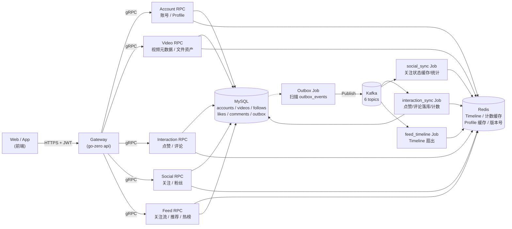
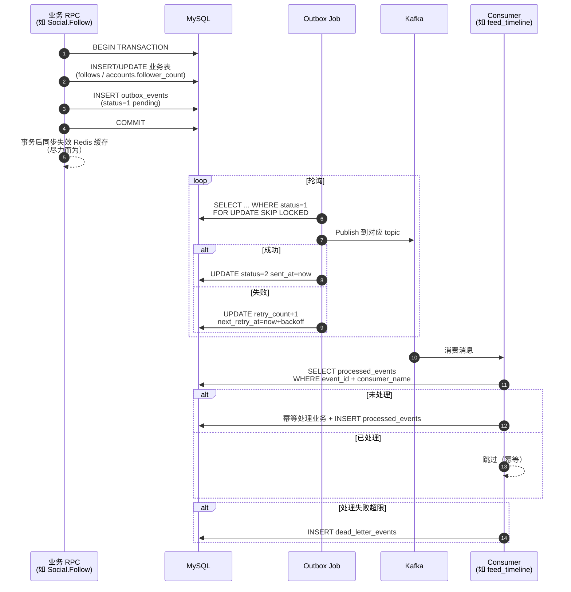
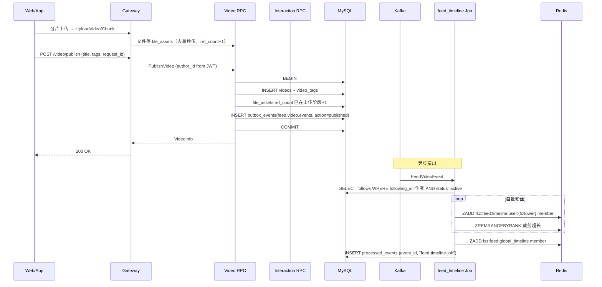
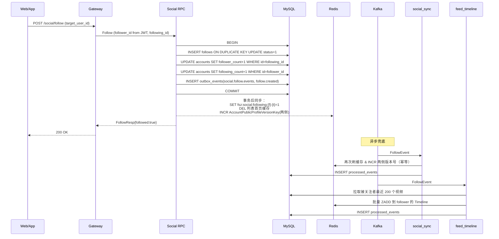
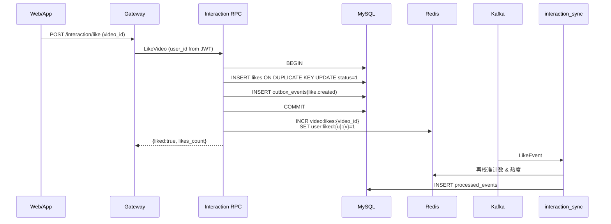
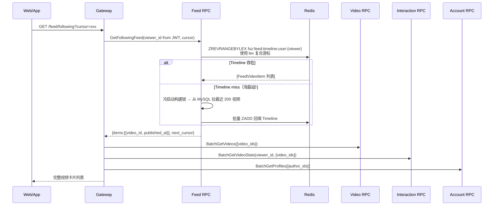

# feedsystem-zero 项目说明文档

> 生成时间：2026-07-28  
> 适用版本：main 分支（含 013_account_follow_counters.sql）  
> 说明：本文档基于当前仓库真实代码生成，作为项目结构、数据模型、事件流转和一致性策略的完整索引。

---

## 一、项目定位

`feedsystem-zero` 是一个**从零重建的短视频信息流后端**，参考抖音/B 站的读写分离架构：

- **同步侧**：账号、视频、社交、互动 RPC，负责用户可感知的写操作与读操作。
- **异步侧**：Kafka + Job Worker，负责派生数据（Timeline、计数、通知）的最终一致维护。
- **网关侧**：go-zero API 网关承担鉴权、参数校验、跨模块聚合，前端不直连 RPC。

技术栈：`Go 1.25` + `go-zero (api+rpc)` + `GORM` + `MySQL 8.0` + `Redis 7` + `Kafka` + `etcd`。

---

## 二、总体架构



**核心约束**：
- 所有写操作走"MySQL 事务 + outbox_events"，**禁止在业务代码里直接生产 Kafka 消息**。
- 所有跨模块的用户身份必须来自 Gateway 从 JWT 解析出的 `user_id`，**不信任前端传的 user_id**。
- 所有 Redis key 通过 `common/rediskey/rediskey.go` 集中生成，统一 `fsz:` 前缀。

---

## 三、目录结构

```
feedsystem-zero/
├── apps/
│   ├── gateway/              # API 网关（go-zero api）
│   │   ├── gateway.api       # 对外 HTTP 契约
│   │   └── internal/{handler, logic, middleware, svc, types, config}
│   ├── account/              # 账号 RPC（注册/登录/Profile）
│   │   ├── account.proto
│   │   └── internal/{logic, model, server, svc, config}
│   ├── video/                # 视频 RPC（发布/查询/去重秒传）
│   ├── interaction/          # 互动 RPC（点赞/评论/计数）
│   ├── social/               # 社交 RPC（关注/粉丝列表）
│   ├── feed/                 # Feed RPC（关注流/推荐/热榜）  ← 主逻辑待补
│   └── job/
│       ├── outbox/           # Outbox → Kafka 投递
│       ├── interaction_sync/ # 点赞/评论 Kafka 消费者
│       ├── social_sync/      # 关注 Kafka 消费者（缓存维护）
│       └── feed_timeline/    # Feed Timeline 扇出消费者
├── common/
│   ├── eventx/               # 事件 topic、envelope、payload schema
│   ├── feedx/                # Timeline member 编码/解码
│   ├── gormx/                # GORM 初始化
│   ├── jwtx/                 # JWT 签发/解析
│   ├── kafkax/               # Kafka producer/consumer 封装
│   ├── rediskey/             # 所有 Redis key 命名 & TTL 常量
│   └── emailx/               # 邮件（注册验证码）
├── deploy/
│   ├── docker-compose.yml    # MySQL/Redis/etcd/Kafka 一键起
│   ├── sql/001~013_*.sql     # 建表 & 迁移
│   └── kafka/create_topics.sh
├── model/                    # 事件模型和 GORM 共享表模型
├── docs/
└── web/                      # React 前端（Vite + TS + Tailwind）
```

---

## 四、微服务与职责

| 模块 | 类型 | 职责 | 状态 |
|---|---|---|---|
| **gateway** | api | 鉴权（JWT 中间件）、请求聚合、上传/文件资产、透传给 RPC | ✅ 已实现 |
| **account** | rpc | 注册、登录、登出、刷新 token、GetProfile、BatchGetProfiles、UpdateProfile | ✅ 已实现 |
| **video** | rpc | 发布视频、GetVideo、BatchGetVideos、ListUserVideos、DeleteVideo；file_assets 去重秒传 | ✅ 已实现 |
| **interaction** | rpc | LikeVideo、UnlikeVideo、PublishComment、DeleteComment、ListComments、BatchGetVideoStats | ✅ 已实现 |
| **social** | rpc | Follow、Unfollow、IsFollowing、BatchIsFollowing、ListFollowers、ListFollowings | ✅ 已实现 |
| **feed** | rpc | GetFollowingFeed、GetRecommendFeed、GetHotFeed | 🟡 骨架就位，主逻辑待写 |
| **job/outbox** | worker | 扫描 outbox_events 并投递 Kafka | ✅ 已实现 |
| **job/interaction_sync** | worker | 消费点赞/评论事件，维护 Redis 计数缓存 | ✅ 已实现 |
| **job/social_sync** | worker | 消费关注事件，维护关注状态缓存 + 版本号 | ✅ 已实现 |
| **job/feed_timeline** | worker | 消费视频发布/关注事件，扇出维护 Timeline ZSet | ✅ 已实现 |

---

## 五、数据模型（MySQL）

```mermaid
erDiagram
    accounts ||--o{ videos : "author_id"
    accounts ||--o{ likes : "user_id"
    accounts ||--o{ comments : "user_id"
    accounts ||--o{ follows : "follower_id / following_id"
    videos ||--o{ likes : "video_id"
    videos ||--o{ comments : "video_id"
    videos }o--|| file_assets : "play_url / cover_url"
    videos ||--o{ video_tags : "video_id"
    tags ||--o{ video_tags : "tag_id"

    accounts {
        BIGINT id PK
        VARCHAR username UK
        VARCHAR email UK
        VARCHAR password_hash
        VARCHAR avatar_url
        VARCHAR bio
        BIGINT follower_count "冗余,social维护"
        BIGINT following_count "冗余,social维护"
        DATETIME created_at
    }
    videos {
        BIGINT id PK
        BIGINT author_id
        VARCHAR title
        VARCHAR play_url
        VARCHAR cover_url
        VARCHAR request_id "幂等键"
        BIGINT likes_count
        BIGINT comments_count
        BIGINT popularity
        TINYINT status "1正常 2作者删 3审核下架"
        DATETIME deleted_at
    }
    file_assets {
        BIGINT id PK
        VARCHAR file_hash UK "秒传去重键"
        VARCHAR url UK
        BIGINT ref_count "引用计数"
        TINYINT status
    }
    follows {
        BIGINT id PK
        BIGINT follower_id
        BIGINT following_id
        TINYINT status "软删除"
        DATETIME updated_at
    }
    likes {
        BIGINT id PK
        BIGINT video_id
        BIGINT user_id
        TINYINT status
    }
    comments {
        BIGINT id PK
        BIGINT video_id
        BIGINT user_id
        TEXT content
        VARCHAR request_id
    }
    outbox_events {
        BIGINT id PK
        VARCHAR event_id UK
        VARCHAR topic
        JSON payload
        TINYINT status
        INT retry_count
    }
    processed_events {
        BIGINT id PK
        VARCHAR event_id
        VARCHAR consumer_name
        UK event_consumer "幂等键"
    }
    dead_letter_events {
        BIGINT id PK
        VARCHAR consumer_name
        VARCHAR topic
        MEDIUMTEXT payload
    }
```

**SQL 迁移文件时间线**：

| 文件 | 内容 |
|---|---|
| `001_schema.sql` | accounts / videos / file_assets / tags / video_tags / likes / comments / interaction_events / outbox_events / processed_events / dead_letter_events |
| `002_file_assets.sql` | 补齐文件资产索引 |
| `003_video_asset_indexes.sql` | 视频 play_url/cover_url 索引 |
| `004_interaction_job_infra.sql` | 互动 job 基础设施 |
| `005~006` | 点赞/评论列表索引 |
| `007_outbox_dispatcher_final.sql` | Outbox 分发锁字段 |
| `008` | dead letters 表 |
| `009_video_request_id.sql` | 视频发布幂等键 |
| `010_follows.sql` | follows 关注表 |
| `011_social_final_indexes.sql` | 社交最终索引 |
| `012_feed_timeline_indexes.sql` | Feed 冷启动索引 |
| `013_account_follow_counters.sql` | **accounts 增加 follower_count/following_count 冗余字段，含存量回填** |

---

## 六、事件契约（Kafka）

### 6.1 Topic 一览

来自 `common/eventx/topics.go`：

| Topic | Producer | Consumer | 用途 |
|---|---|---|---|
| `interaction.like.events` | interaction rpc（outbox） | interaction_sync | 点赞/取消点赞落 Redis 计数 |
| `interaction.comment.events` | interaction rpc（outbox） | interaction_sync | 评论创建/删除维护计数 |
| `video.stat.delta.events` | interaction_sync | hotrank-job（预留） | 视频热度增量 |
| `feed.video.events` | video rpc（outbox） | feed_timeline | 视频发布/删除 → Timeline 扇出 |
| `notification.events` | 多方 | notification-job（预留） | 系统通知 |
| `social.follow.events` | social rpc（outbox） | social_sync + feed_timeline | 关注/取关状态缓存 & Timeline 回填 |

### 6.2 事件类型

来自 `common/eventx/events.go`：

```
video.published / video.deleted        → FeedVideoEvent
like.created / like.deleted            → LikeEvent
comment.created / comment.deleted      → CommentEvent
video.stat.delta                       → VideoStatDeltaEvent
notification.create                    → NotificationEvent
follow.created / follow.deleted        → FollowEvent
```

统一封装在 `Envelope` 结构：`{event_id, event_type, aggregate_type, aggregate_id, occurred_at, payload}`。

---

## 七、Outbox 事务发件箱模式

这是本项目**跨服务一致性的基石**。业务写操作和事件发布不能分开落地，否则会出现"MySQL 写成功但事件丢了"或"事件发了但 MySQL 回滚了"。



**关键点**：
- `outbox_events` 使用 `SELECT ... FOR UPDATE SKIP LOCKED` 支持多实例并发调度。
- `processed_events` 的唯一键 `(event_id, consumer_name)` 保证每个消费者对同一事件只处理一次。
- 失败事件不阻塞主流程，进 `dead_letter_events` 供人工介入。

---

## 八、关键业务流程

### 8.1 用户发布视频



**幂等保证**：
- Video 侧：`(author_id, request_id)` 唯一键，重复请求回读已存在视频。
- Job 侧：`processed_events` 记录已处理事件。

### 8.2 用户关注他人



**强一致要点**：
- 关注表 + 粉丝数字段在**同一事务**内更新（选型：MySQL 冗余而非 Redis 计数器，避免用户点完关注刷不到新数字）。
- 缓存失效**双保险**：事务后同步 INCR 版本号（低延迟）+ Kafka 异步 INCR（防丢）。
- Unfollow 走对称路径，`follower_count > 0` 保护防止减到负数。

### 8.3 用户点赞视频



### 8.4 用户拉取关注流（当前 Feed 骨架）



**架构精髓**：Feed RPC **只返回 video_id 和排序信息**，具体的视频详情、作者昵称、点赞数由 Gateway 分别通过三个 Batch 接口拉齐，避免 Feed 服务越权访问其他领域数据。

---

## 九、Redis Key 命名空间

统一 `fsz:` 前缀，来自 `common/rediskey/rediskey.go`：

| 类别 | Key 格式 | 用途 | TTL |
|---|---|---|---|
| **Account** | `fsz:account:profile:{userID}:version` | 公开资料缓存版本号 | 永久 |
| | `fsz:account:profile:{userID}:v:{version}` | 公开资料 JSON | 15 分钟（含抖动） |
| | `fsz:token:{userID}` | 当前 access token | JWT 过期时间 |
| | `fsz:verify:{email}` | 邮箱验证码 | 5 分钟 |
| **Social** | `fsz:social:following:{follower}:{following}` | 单条关注状态 `1/0` | 10 分钟 |
| | `fsz:social:followers:list:{user}:page1` | 粉丝列表首页缓存 | 1 分钟 |
| | `fsz:social:followers:build_lock:{user}` | 首页构建锁 | 5 秒 |
| **Video** | `fsz:video:entity:{videoID}` | 视频详情缓存 | 10 分钟（含抖动） |
| **Interaction** | `fsz:video:likes:{videoID}` | 点赞计数缓存 | 长期 |
| | `fsz:user:liked:{userID}:{videoID}` | 用户是否点赞 | 长期 |
| **Feed** | `fsz:feed:timeline:user:{userID}` | 用户关注流 ZSet | 7 天 |
| | `fsz:feed:global_timeline` | 全局最新视频 ZSet | 长期 |
| | `fsz:feed:timeline:build_lock:{userID}` | 冷启动构建锁 | 10 秒 |

**Timeline ZSet 编码**（`common/feedx/timeline.go`）：
- 所有元素 `score=0`，实际顺序由 member 字典序决定。
- Member 格式：`{publishedAt:19位}:{videoID:20位}`，如 `1730000000000:00000000000000000123`。
- 使用 `ZREVRANGEBYLEX` 分页，游标格式 `(member` 实现排他上界，无重复无遗漏。

---

## 十、缓存一致性策略

不同资源根据"变更频率 vs 一致性要求"选用不同策略：

```mermaid
flowchart TD
    A[资源类型] --> B{变更频率?}
    B -->|低频<br/>(profile,video元数据)| C[版本号 + 长 TTL<br/>写路径 INCR 版本号<br/>读时用当前版本组合 key]
    B -->|高频<br/>(点赞计数)| D[定点更新 + 定期回源<br/>写时 INCR/DECR<br/>miss 时 COUNT(*) 回填]
    B -->|派生数据<br/>(Timeline)| E[事件驱动<br/>Kafka 扇出维护<br/>冷启动锁 + MySQL 兜底]

    C --> F[代表: AccountPublicProfileKey]
    D --> G[代表: video:likes:*]
    E --> H[代表: fsz:feed:timeline:*]
```

**账号资料缓存**是最典型的**版本号方案**：
- 更新资料时 `INCR version`（原子），旧版本 key 无需删除，TTL 到期自动淘汰。
- 读取时先 GET 当前 version，再组合出 `key:v:{version}` 读取。
- 粉丝数变化时，同时 INCR follower 和 following 两侧的 version（关键：不遗漏 BatchGetProfiles 场景）。

---

## 十一、Gateway API 汇总

来自 `apps/gateway/gateway.api`（部分展示）：

| 分组 | 路径 | 方法 | 需要鉴权 | 目标 RPC |
|---|---|---|---|---|
| 账号 | `/account/register` | POST | ❌ | Account.Register |
| | `/account/login` | POST | ❌ | Account.Login |
| | `/account/profile` | GET | ✅ | Account.GetProfile |
| | `/account/profile` | PUT | ✅ | Account.UpdateProfile |
| 视频 | `/video/upload/init` | POST | ✅ | Gateway 逻辑（文件资产） |
| | `/video/publish` | POST | ✅ | Video.PublishVideo |
| | `/video/{id}` | GET | ✅? | Video.GetVideo |
| | `/video/{id}` | DELETE | ✅ | Video.DeleteVideo |
| 互动 | `/interaction/like` | POST | ✅ | Interaction.LikeVideo |
| | `/interaction/comment` | POST | ✅ | Interaction.PublishComment |
| | `/interaction/comment/list` | GET | ✅ | Interaction.ListComments |
| 社交 | `/social/follow` | POST | ✅ | Social.Follow |
| | `/social/unfollow` | POST | ✅ | Social.Unfollow |
| | `/social/followers` | GET | ✅ | Social.ListFollowers |
| | `/social/followings` | GET | ✅ | Social.ListFollowings |
| Feed | `/feed/following` | GET | ✅ | Feed.GetFollowingFeed |
| | `/feed/recommend` | GET | ❌ | Feed.GetRecommendFeed |

**Handler 命名规则**：每个接口对应 `apps/gateway/internal/handler/{name}handler.go` + `apps/gateway/internal/logic/{name}logic.go`，Logic 内负责跨 RPC 聚合（如 Feed 后要调用 video/interaction/account 三个 batch）。

---

## 十二、当前进度速览

```mermaid
gantt
    title 模块完成度
    dateFormat X
    axisFormat %s

    section 完成
    Gateway(全部路由)     :done, 0, 1
    Account RPC          :done, 0, 1
    Video RPC + 秒传     :done, 0, 1
    Interaction RPC      :done, 0, 1
    Social RPC           :done, 0, 1
    Outbox Job           :done, 0, 1
    Interaction Sync Job :done, 0, 1
    Social Sync Job      :done, 0, 1
    Feed Timeline Job    :done, 0, 1
    accounts 冗余粉丝数   :done, 0, 1

    section 进行中
    Feed RPC 三个主接口   :active, 0, 1

    section 未开始
    Hot Rank Job         :0, 1
    Notification 模块     :0, 1
    大V/小V 推拉切换      :0, 1
```



**待办**（按优先级）：

1. 🔴 **Feed RPC 三个主逻辑**（`GetFollowingFeed`、`GetRecommendFeed`、`GetHotFeed`）
   - 骨架已就位（`apps/feed/internal/logic/`）。
   - 需实现：Timeline 分页读取、冷启动兜底、Redis miss 回源 MySQL。
2. 🟠 **大V/小V 推拉模型切换**（写路径改造）
   - 现状：`applyVideoEvent` 对所有作者纯推。
   - 目标：大V 写入 author 流由 follower 拉取，小V 保持推。
3. 🟠 **热榜 Job**（消费 `video.stat.delta.events`，维护分钟级快照）。
4. 🟡 **Notification 模块**（关注/点赞/评论触发通知）。

---

## 十三、开发与部署

### 13.1 本地一键启动依赖

```bash
cd deploy
docker-compose up -d
# MySQL: localhost:3308  (root/123456, db=feedsystem_zero)
# Redis: localhost:6380  (password=123456)
# etcd:  localhost:23790
# Kafka: localhost:9094
```

### 13.2 建库与建表

```bash
# SQL 会通过 docker-entrypoint-initdb.d 在 mysql 首次启动时自动执行
# 手工重跑：
docker exec -i feedsystem-zero-mysql mysql -uroot -p123456 feedsystem_zero < deploy/sql/001_schema.sql
# 依次跑 002 ~ 013
```

### 13.3 建 Kafka Topic

```bash
bash deploy/kafka/create_topics.sh
```

### 13.4 启动服务

每个 RPC/Job 独立进程：

```bash
go run apps/account/account.go       -f apps/account/etc/account.yaml
go run apps/video/video.go           -f apps/video/etc/video.yaml
go run apps/interaction/interaction.go -f apps/interaction/etc/interaction.yaml
go run apps/social/social.go         -f apps/social/etc/social.yaml
go run apps/feed/feed.go             -f apps/feed/etc/feed.yaml
go run apps/gateway/gateway.go       -f apps/gateway/etc/gateway.yaml
# Jobs
go run apps/job/outbox/outbox.go
go run apps/job/interaction_sync/interaction_sync.go
go run apps/job/social_sync/social_sync.go
go run apps/job/feed_timeline/feed_timeline.go
```

### 13.5 常用命令

```bash
# 编译全项目
go build ./...
# 静态检查
go vet ./...
# 单元测试
go test ./...
# 重新生成 RPC 代码（如改了 proto）
cd apps/account
goctl rpc protoc account.proto --go_out=. --go-grpc_out=. --zrpc_out=. --style=goZero
# 注意：goctl 1.10.1 生成的 client 包名首字母会是驼峰，
#      需要手动将 accountclient/account.go 和 socialclient/social.go 的 package 改为全小写
```

---

## 十四、约定与最佳实践

1. **身份识别**：所有需要 `user_id` 的 RPC 参数**必须**由 Gateway 从 JWT 提取后填入，不接收前端传值。
2. **幂等键**：视频发布用 `(author_id, request_id)`；评论用 `(user_id, request_id)`；事件处理用 `(event_id, consumer_name)`。
3. **软删除**：`videos`、`likes`、`comments`、`follows` 全部软删除，配合 `status` 字段做状态机。
4. **游标分页**：所有列表接口用"排序字段 + 主键"双游标，永不重复不遗漏，禁止 offset 分页。
5. **批量接口**：Gateway 聚合层禁止 N+1，必须使用 `BatchGetProfiles`、`BatchGetVideos`、`BatchGetVideoStats`、`BatchIsFollowing`。
6. **Redis Key**：一律通过 `rediskey.*Key(...)` 生成，禁止在业务代码里手写字符串拼接。
7. **Kafka 消息**：一律通过 outbox 发布，禁止业务代码直接调 `kafkax.Producer`。
8. **事务边界**：跨服务不共享事务；单服务内业务表 + outbox_events 必须同一事务。

---

## 十五、附录：核心代码文件索引

| 主题 | 关键文件 |
|---|---|
| Timeline 编码 | `common/feedx/timeline.go` |
| Redis Key & TTL | `common/rediskey/rediskey.go` |
| Kafka Topics | `common/eventx/topics.go` |
| Event Envelope | `common/eventx/events.go` |
| JWT 签发 | `common/jwtx/jwtx.go` |
| 关注事务 | `apps/social/internal/logic/followlogic.go` |
| 关注辅助/缓存 | `apps/social/internal/logic/socialhelper.go` |
| Profile 批量查 | `apps/account/internal/logic/batchgetprofileslogic.go` |
| 视频发布 | `apps/video/internal/logic/publishvideologic.go` |
| Feed Timeline 扇出 | `apps/job/feed_timeline/internal/logic/timelinewriter.go` |
| Feed 冷启动 | `apps/feed/internal/logic/feedhelper.go` |
| Outbox 分发 | `apps/job/outbox/internal/logic/*.go` |
| 关注 Kafka 消费 | `apps/job/social_sync/internal/logic/syncconsumer.go` |

---

**文档结束**。这份文档反映的是当前 main 分支的真实状态。修改代码后如果关键流程发生变化，请同步更新对应章节的 Mermaid 图和索引表。

