# feedsystem-zero 项目说明文档

> 更新时间：2026-08-04
> 适用版本：main 分支当前工作区（基于 commit `04095cc`，含 outbox 分片并发投递 + `NOT EXISTS` 聚合保序、Social/Notification 事务级 1213/1205 死锁重试、Video 发布多资产 URL 升序加锁）
> 说明：本文档基于当前仓库真实代码生成，作为项目结构、数据模型、事件流转、一致性策略、缓存闭环、并发保护的完整索引。**外部读者读完这一份文档即可理解整个系统**。

---

## 目录

1. [项目定位](#一项目定位)
2. [总体架构](#二总体架构)
3. [目录结构](#三目录结构)
4. [微服务与职责总览](#四微服务与职责总览)
5. [数据模型（MySQL）](#五数据模型mysql)
6. [事件契约（Kafka）](#六事件契约kafka)
7. [Outbox 事务发件箱模式](#七outbox-事务发件箱模式)
8. [各模块详解与流程图](#八各模块详解与流程图)
   - 8.1 [Account 账号模块](#81-account-账号模块)
   - 8.2 [Video 视频模块](#82-video-视频模块)
   - 8.3 [Interaction 互动模块](#83-interaction-互动模块)
   - 8.4 [Social 社交模块](#84-social-社交模块)
   - 8.5 [Notification 通知模块](#85-notification-通知模块)
   - 8.6 [Feed 推拉分离模块](#86-feed-推拉分离模块)
   - 8.7 [HotRank 热榜模块](#87-hotrank-热榜模块)
   - 8.8 [Gateway 网关](#88-gateway-网关)
9. [关键异步 Job 详解](#九关键异步-job-详解)
10. [跨模块端到端流程图](#十跨模块端到端流程图)
11. [Redis Key 命名空间](#十一redis-key-命名空间)
12. [一致性 / 并发 / 幂等设计原则](#十二一致性--并发--幂等设计原则)
13. [Gateway HTTP API 汇总](#十三gateway-http-api-汇总)
14. [开发与部署](#十四开发与部署)
   - 14.6 [测试、压测与一致性验收](#146-测试压测与一致性验收2026-08-03)
15. [约定与最佳实践](#十五约定与最佳实践)
16. [附录：核心代码文件索引](#十六附录核心代码文件索引)
17. [最近更新（Changelog）](#十七最近更新changelog)

---

## 一、项目定位

`feedsystem-zero` 是一个**从零重建的短视频信息流后端**，参考抖音/B 站的读写分离架构：

- **同步侧**：账号、视频、社交、互动、通知、Feed 六个 RPC，负责用户可感知的写操作与读操作。
- **异步侧**：Kafka + 七个 Job Worker，负责派生数据（Timeline、计数、通知、热榜、文件资产清理）的最终一致维护。
- **网关侧**：go-zero API 网关承担鉴权、参数校验、跨模块聚合，前端不直连 RPC。

技术栈：`Go 1.25` + `go-zero 1.10.2 (api+rpc)` + `gRPC 1.82.0` + `GORM 1.31.2` + `MySQL 8.0` + `Redis 7` + `Kafka` + `etcd`。

**核心设计目标**：

1. **强一致的写路径**：用户可感知的写操作与其派生事件在同一个 MySQL 事务里落地（outbox 发件箱）。
2. **最终一致的派生数据**：Timeline、通知、计数缓存通过 Kafka 事件驱动，允许秒级延迟但保证不丢、幂等。
3. **可控降级**：Redis 是加速层，任何时刻挂掉都必须能降级到 MySQL 直查。
4. **横向扩展**：outbox dispatcher 支持多实例并发（SKIP LOCKED），消费者按 partition 顺序处理。

---

## 二、总体架构

```mermaid
flowchart LR
    Client["Web / App<br/>(前端)"] -->|HTTPS + JWT| Gateway["Gateway<br/>(go-zero api)"]

    Gateway -->|gRPC| Account["Account RPC<br/>账号 / Profile"]
    Gateway -->|gRPC| Video["Video RPC<br/>视频元数据 / 文件资产"]
    Gateway -->|gRPC| Interaction["Interaction RPC<br/>点赞 / 评论"]
    Gateway -->|gRPC| Social["Social RPC<br/>关注 / 粉丝"]
    Gateway -->|gRPC| Notification["Notification RPC<br/>通知列表 / 未读数"]
    Gateway -->|gRPC| Feed["Feed RPC<br/>关注流 / 热榜 / 推荐"]

    Account --> MySQL[("MySQL<br/>accounts / videos / follows<br/>likes / comments / notifications<br/>file_assets / outbox / processed / dead_letter")]
    Video --> MySQL
    Interaction --> MySQL
    Social --> MySQL
    Notification --> MySQL

    Account --> Redis[("Redis<br/>Profile 版本号缓存<br/>点赞计数 / delta pending·acked<br/>Timeline ZSet / 热榜快照<br/>未读数 version / 秒传全局哈希"]
    Video --> Redis
    Interaction --> Redis
    Social --> Redis
    Notification --> Redis
    Feed --> Redis
    Feed --> MySQL

    Gateway --> Disk[("本地磁盘<br/>uploads/{yyyy/mm/dd}/<br/>file_hash.ext")]
    Video --> Disk

    MySQL -.outbox_events.-> Outbox["Outbox Job<br/>扫描 & 投递"]
    Outbox -->|Publish| Kafka[("Kafka<br/>6 topics")]

    Kafka --> InteractionSync["interaction_sync Job<br/>按 partition 并发<br/>批量幂等落库 + eventID ack"]
    Kafka --> SocialSync["social_sync Job<br/>关注缓存 & 版本号"]
    Kafka --> FeedTimeline["feed_timeline Job<br/>推拉分离扇出 + global ready 自愈"]
    Kafka --> HotRank["hotrank Job<br/>热度增量聚合"]
    Kafka --> NotifJob["notification Job<br/>写通知 & bump 未读数"]

    MySQL -.轮询扫库.-> AssetCleanup["asset_cleanup Job<br/>延迟物理清理 file_assets"]
    AssetCleanup -->|os.Remove| Disk
    AssetCleanup -->|DEL fsz:chunkupload:hash:global| Redis
    AssetCleanup --> MySQL

    InteractionSync --> Redis
    SocialSync --> Redis
    FeedTimeline --> Redis
    HotRank --> Redis
    NotifJob --> MySQL
    NotifJob --> Redis
```

**核心约束**：

- 所有写操作走 "MySQL 事务 + `outbox_events`"，**禁止在业务代码里直接生产 Kafka 消息**。
- 所有跨模块的用户身份必须来自 Gateway 从 JWT 解析出的 `user_id`，**不信任前端传的 user_id**。
- 所有 Redis key 通过 `common/rediskey/*.go` 集中生成，统一 `fsz:` 前缀。
- 消费者用 `processed_events` 唯一键做幂等，失败进 `dead_letter_events`，绝不阻塞 partition。

---

## 三、目录结构

```
feedsystem-zero/
├── apps/
│   ├── gateway/              # API 网关（go-zero api）
│   │   ├── gateway.api       # 对外 HTTP 契约
│   │   └── internal/{handler, logic, middleware, svc, types, config}
│   ├── account/              # 账号 RPC
│   ├── video/                # 视频 RPC
│   ├── interaction/          # 互动 RPC
│   ├── social/               # 社交 RPC
│   ├── notification/         # 通知 RPC
│   ├── feed/                 # Feed RPC
│   └── job/
│       ├── outbox/           # Outbox → Kafka 投递
│       ├── interaction_sync/ # 点赞/评论 Kafka 消费者
│       ├── social_sync/      # 关注 Kafka 消费者
│       ├── feed_timeline/    # 推拉分离 Timeline 扇出
│       ├── hotrank/          # 热榜聚合 Job
│       ├── notification/     # 通知落库 Job
│       └── asset_cleanup/    # 文件资产物理清理 Job（延迟删除 + 复活兜底）
├── common/
│   ├── eventx/               # 事件 topic、envelope、payload schema
│   ├── feedx/                # Timeline member 编码 & 大 V 判定
│   ├── gormx/                # GORM 初始化
│   ├── jwtx/                 # JWT 签发/解析
│   ├── kafkax/               # Kafka producer/consumer 封装
│   ├── rediskey/             # 按模块拆分的 8 个 Redis key 文件
│   ├── notificationcache/    # 未读数版本号缓存
│   └── emailx/               # 邮件（注册验证码）
├── deploy/
│   ├── docker-compose.yml    # MySQL/Redis/etcd/Kafka 一键起
│   ├── sql/001~016_*.sql     # 建表、索引与增量迁移
│   └── kafka/create_topics.sh
├── model/                    # 事件模型和 GORM 共享表模型
├── docs/                     # 本文档所在目录
├── tests/                    # 造数、HTTP 压测、E2E 冒烟与并发测试
└── web/                      # React 前端（Vite + TS + Tailwind）
```

---

## 四、微服务与职责总览

### 4.1 RPC 服务（6 个）

| 模块 | 端口位 | 主要能力 | 状态 |
|---|---|---|---|
| **account** | rpc | 注册 / 登录 / 登出 / 刷新 token / GetProfile / BatchGetProfiles / UpdateProfile | ✅ 已实现 |
| **video** | rpc | 分片上传 / PublishVideo / GetVideo / BatchGetVideos / ListUserVideos / DeleteVideo / 文件秒传去重 | ✅ 已实现 |
| **interaction** | rpc | LikeVideo / UnlikeVideo / PublishComment / DeleteComment / ListComments / BatchGetVideoStats | ✅ 已实现 |
| **social** | rpc | Follow / Unfollow / IsFollowing / BatchIsFollowing / ListFollowers / ListFollowings | ✅ 已实现 |
| **notification** | rpc | ListNotifications / GetUnreadCount / MarkNotificationRead / MarkAllNotificationsRead | ✅ 已实现 |
| **feed** | rpc | GetFollowingFeed / GetHotFeed / GetRecommendFeed | ✅ 已实现 |

### 4.2 Job 后台（7 个）

| Job | 消费 topic | 主要动作 | 状态 |
|---|---|---|---|
| **outbox** | — | 扫描 `outbox_events`，SKIP LOCKED 抢占，投递到 Kafka | ✅ |
| **interaction_sync** | `interaction.like.events` / `interaction.comment.events` | topic+partition 分组并发；500 条批量幂等事务 → 按 event_id 对 Redis 增量 ack | ✅ |
| **social_sync** | `social.follow.events` | 关注状态缓存 & Profile 版本号 bump | ✅ |
| **feed_timeline** | `feed.video.events` / `social.follow.events` | 推拉分离：小 V 写扩散、大 V author outbox；ready 丢失时主动 bootstrap | ✅ |
| **hotrank** | `interaction.like.events` / `interaction.comment.events` | 独立消费互动事件，维护 UTC 分钟窗口；Feed 按需构建衰减快照 | ✅ |
| **notification** | `notification.events` | 通知落库、未读数 version bump、死信旁路 | ✅ |
| **asset_cleanup** | 无（轮询扫库） | 延迟物理清理 `file_assets`；抢占超时兜底 + 引用复活；DEL 秒传全局缓存 | ✅ |

---

## 五、数据模型（MySQL）

```mermaid
erDiagram
    accounts ||--o{ videos : "author_id"
    accounts ||--o{ likes : "user_id"
    accounts ||--o{ comments : "user_id"
    accounts ||--o{ follows : "follower_id / following_id"
    accounts ||--o{ notifications : "receiver_id"
    videos ||--o{ likes : "video_id"
    videos ||--o{ comments : "video_id"
    videos }o--|| file_assets : "play_url / cover_url"
    videos ||--o{ video_tags : "video_id"
    tags ||--o{ video_tags : "tag_id"

    accounts {
        BIGINT id PK
        VARCHAR username UK
        VARCHAR email UK
        VARCHAR password_hash
        VARCHAR avatar_url
        VARCHAR bio
        BIGINT follower_count "冗余,social维护"
        BIGINT following_count "冗余,social维护"
        TINYINT is_big_v "大V标志,只升不降"
        DATETIME created_at
    }
    videos {
        BIGINT id PK
        BIGINT author_id
        VARCHAR title
        VARCHAR play_url
        VARCHAR cover_url
        VARCHAR request_id "幂等键"
        BIGINT likes_count
        BIGINT comments_count
        BIGINT popularity "热度"
        TINYINT status "1正常 2作者删 3审核下架"
        DATETIME deleted_at
    }
    file_assets {
        BIGINT id PK
        VARCHAR file_hash UK "秒传去重键"
        VARCHAR url UK
        BIGINT ref_count "引用计数"
        TINYINT status
    }
    follows {
        BIGINT id PK
        BIGINT follower_id
        BIGINT following_id
        TINYINT status "软删除"
        DATETIME updated_at
    }
    likes {
        BIGINT id PK
        BIGINT video_id
        BIGINT user_id
        TINYINT status
    }
    comments {
        BIGINT id PK
        BIGINT video_id
        BIGINT user_id
        TEXT content
        VARCHAR request_id
    }
    notifications {
        BIGINT id PK
        BIGINT receiver_id
        VARCHAR business_key UK "去重键"
        VARCHAR type "like/comment/follow"
        BIGINT actor_id
        JSON payload
        TINYINT status "1未读 2已读 3已撤回"
        DATETIME occurred_at
        DATETIME deleted_at
    }
    outbox_events {
        BIGINT id PK
        VARCHAR event_id UK
        VARCHAR topic
        JSON payload
        TINYINT status
        INT retry_count
        VARCHAR lock_token
        DATETIME next_retry_at
    }
    processed_events {
        BIGINT id PK
        VARCHAR event_id
        VARCHAR consumer_name
        UK event_consumer "幂等键"
    }
    dead_letter_events {
        BIGINT id PK
        VARCHAR consumer_name
        VARCHAR topic
        MEDIUMTEXT payload
        TEXT last_error
    }
```

### 5.1 SQL 迁移文件时间线

| 文件 | 内容摘要 |
|---|---|
| `001_schema.sql` | accounts / videos / file_assets / tags / video_tags / likes / comments / interaction_events / outbox_events / processed_events / dead_letter_events |
| `002_file_assets.sql` | 文件资产索引 |
| `003_video_asset_indexes.sql` | 视频 play_url/cover_url 索引 |
| `004_interaction_job_infra.sql` | 互动 job 基础设施 |
| `005~006` | 点赞/评论列表索引 |
| `007_outbox_dispatcher_final.sql` | Outbox 分发锁字段 `lock_token` / `next_retry_at` |
| `008_interaction_sync_dead_letters.sql` | 死信表 |
| `009_video_request_id.sql` | 视频发布幂等键 |
| `010_follows.sql` | follows 关注表 |
| `011_social_final_indexes.sql` | 社交最终索引 |
| `012_feed_timeline_indexes.sql` | Feed 冷启动索引 |
| `013_account_follow_counters.sql` | accounts 增加 follower_count / following_count 冗余字段 |
| `014_notifications.sql` | `notifications` 表（含 `uk_notification_business` 唯一键 + `(receiver_id, occurred_at, id)` 复合索引） |
| `015_account_big_v_flag.sql` | accounts.is_big_v 大 V 标志位 + 存量数据回填 |
| `016_outbox_aggregate_status_index.sql` | Outbox 按 topic/status 聚合检查与待投递扫描索引 |

---

## 六、事件契约（Kafka）

### 6.1 Topic 一览

来自 `common/eventx/topics.go`：

| Topic | Producer | Consumer | 用途 |
|---|---|---|---|
| `interaction.like.events` | interaction rpc (outbox) | interaction_sync + hotrank | 点赞/取消点赞聚合落库；独立热榜窗口计分 |
| `interaction.comment.events` | interaction rpc (outbox) | interaction_sync + hotrank | 评论创建/删除聚合落库；独立热榜窗口计分 |
| `video.stat.delta.events` | 当前仅保留契约 | 当前无在线 Producer/Consumer | 预留的视频统计增量 Topic，不属于当前运行主链路 |
| `feed.video.events` | video rpc (outbox) | feed_timeline | 视频发布/删除 → Timeline 扇出 |
| `social.follow.events` | social rpc (outbox) | social_sync + feed_timeline | 关注/取关缓存 & Timeline 回填 |
| `notification.events` | 多方 rpc (outbox) | **notification** | 系统通知（关注/点赞/评论） |

### 6.2 事件类型

来自 `common/eventx/events.go`：

```
video.published / video.deleted        → FeedVideoEvent
like.created / like.deleted            → LikeEvent
comment.created / comment.deleted      → CommentEvent
video.stat.delta                       → VideoStatDeltaEvent
follow.created / follow.deleted        → FollowEvent
notification.create / notification.delete → NotificationEvent
```

统一封装为 `Envelope`：`{event_id, event_type, aggregate_type, aggregate_id, occurred_at, payload}`。

---

## 七、Outbox 事务发件箱模式

这是本项目**跨服务一致性的基石**。业务写操作与事件发布必须原子，否则会出现"MySQL 写成功但事件丢了"或"事件发了但 MySQL 回滚了"。

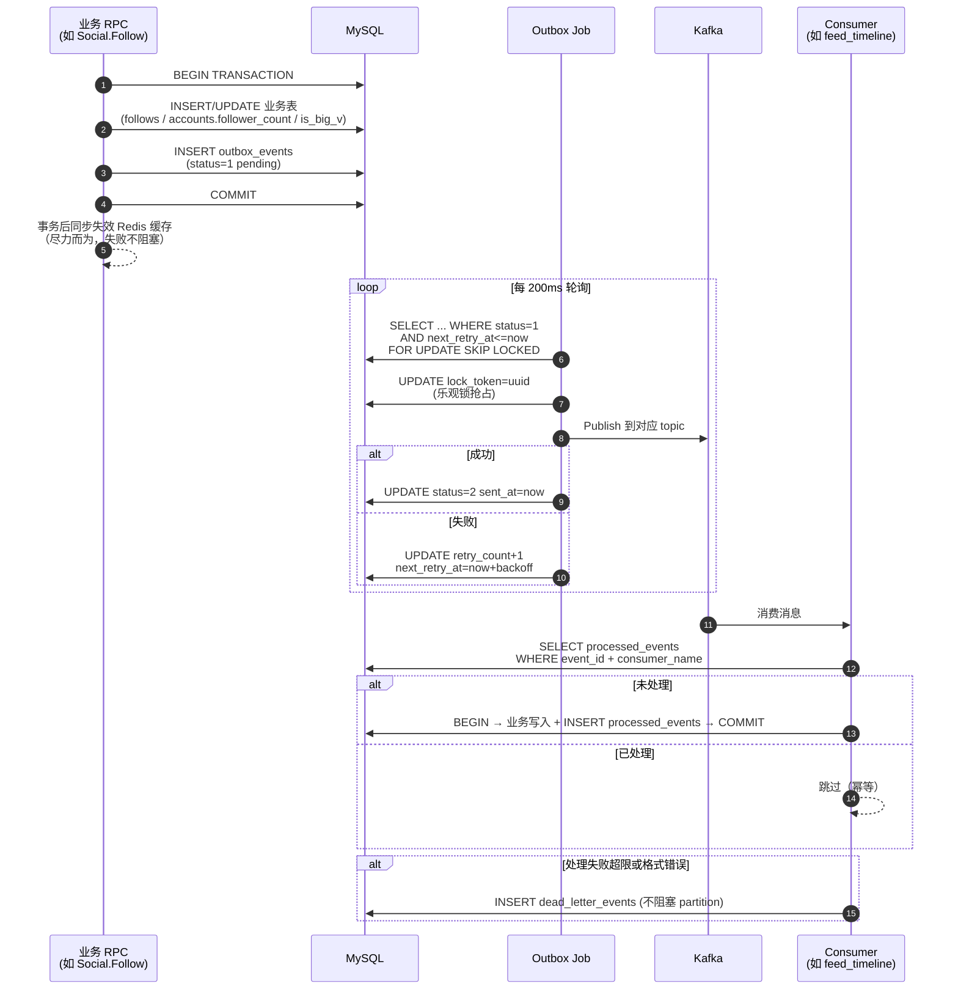

**关键点**：

- `outbox_events` 使用 `SELECT ... FOR UPDATE SKIP LOCKED` + `lock_token` 双保险，支持多实例并发调度。
- `processed_events` 的唯一键 `(event_id, consumer_name)` 保证每个消费者对同一事件只处理一次。
- 死信隔离：失败事件不阻塞主流程，进 `dead_letter_events` 供人工介入。
- 阶梯退避：`next_retry_at = now + backoff(retry_count)`。

---

## 八、各模块详解与流程图

### 8.1 Account 账号模块

**职责**：用户身份、Profile 数据、JWT 签发、邮箱验证码。

**核心 RPC**：

| Rpc | 说明 |
|---|---|
| `Register` | 邮箱 + 用户名 + 密码；先校验邮箱验证码 |
| `Login` | 邮箱 + 密码；签发 access token + refresh token |
| `Logout` | DEL `fsz:token:{userID}`，使 access token 立刻失效 |
| `RefreshToken` | 用 refresh token 换新的 access token |
| `GetProfile` | 版本号缓存：读 version → 组合 key 读 profile JSON → miss 回源 |
| `BatchGetProfiles` | Feed / 评论列表批量拉作者信息 |
| `UpdateProfile` | 更新头像 / bio；事务内 INCR profile version |

**Profile 版本号缓存流程**：

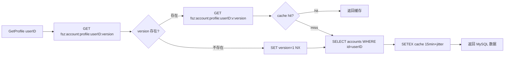

**关键点**：
- 更新时 `INCR version`（原子），旧版本 key 无需删除，TTL 到期自动淘汰。
- **粉丝数变化时也要 INCR 两侧的 version**（follower 和 following），否则 BatchGetProfiles 会读到旧的 follower_count。

---

### 8.2 Video 视频模块

**职责**：视频元数据管理、分片上传、文件秒传去重、软删除。

**核心 RPC**：

| Rpc | 说明 |
|---|---|
| `PublishVideo` | 事务：INSERT videos + INSERT video_tags + INSERT outbox_events(video.published)；`(author_id, request_id)` 幂等 |
| `GetVideo` | Redis entity cache + MySQL 回源 |
| `BatchGetVideos` | Feed 拉视频卡片时用 |
| `ListUserVideos` | 用户主页视频列表，游标分页 |
| `DeleteVideo` | 软删除：`status=2, deleted_at=now`，file_assets.ref_count-1，发 outbox(video.deleted) |

**文件秒传方案 B**：

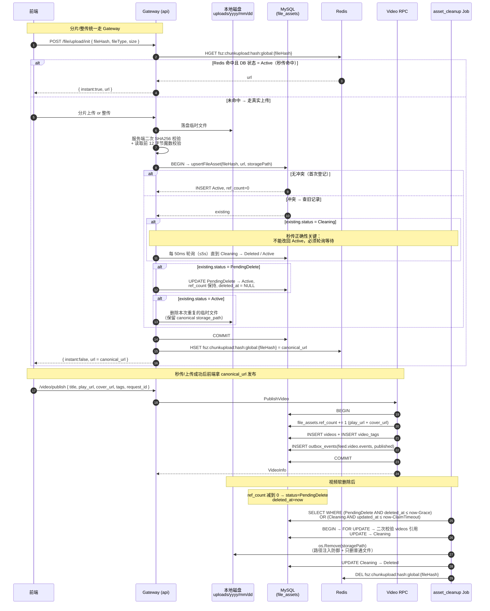

**关键点**：`ref_count` 调整与 `videos` 创建/软删除必须在 **video-rpc 同一事务内**。这样 file_assets 永远不会出现“孤儿引用”（视频删了但资产还在）或“悬空视频”（视频存在但资产没引用）。

#### 8.2.1 PublishVideo 多资产加锁保序（防死锁）

一条视频最多涉及两个 `file_assets` 行：`play_url` 与 `cover_url`。若两个并发的 `PublishVideo` 事务分别以 `A→B` 和 `B→A` 顺序对同两个资产 `SELECT ... FOR UPDATE`，会形成经典锁序反转死锁。

`apps/video/internal/logic/fileassethelper.go` 的 `orderedFileAssetURLs` 会**先去重、再对非空 URL 升序排序**，`publishvideologic.go` 的事务体统一按这个稳定顺序调用 `reserveFileAssetRefByURL(tx, url)`。任何两个并发发布事务的加锁序列都相同，从根源消除资产维度的锁序反转，与 §8.4 的 accounts 双行锁思路一致。

- 单元测试：`fileassethelper_test.go` 断言 `orderedFileAssetURLs` 对乱序、重复、空串的稳定输出。
- 引用调整仍在事务内完成；即便 `reserveFileAssetRefByURL` 命中 `Cleaning` 状态也会直接返回错误让事务回滚，绝不复活已删资产。

**file_assets 四状态机（commit 687d0ab 完善）**：

| 状态 | 含义 | 可秒传 | 可被 asset_cleanup 抢占 |
|---|---|---|---|
| `Active(1)` | 正常引用中（ref_count 可为 0 但仍在 grace 期） | ✅ | ref_count=0 且过了 GraceSeconds |
| `PendingDelete(2)` | 最后一个引用删除后标记待删 | ❌ | ✅ |
| `Cleaning(4)` | 已被 asset_cleanup 临时抢占，即将物理删除 | ❌（轮询等待） | 只能同一抢占者推进 |
| `Deleted(3)` | 已物理删除 | ❌ | ❌ |

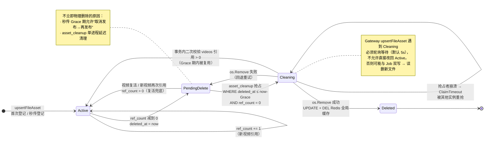

**秒传正确性保护**：`upsertFileAsset` 发现已存在相同 hash 的记录时，如果处于 `Cleaning` 则必须轮询等待（默认 5s），**绝不能直接将 Cleaning 改回 Active**——否则 asset_cleanup 可能在激活后删除新上传文件。若已处于 `PendingDelete/Deleted`，则以本次上传文件为准将其 UPDATE 回到 `Active`。

**文件魔数二次校验**：`saveMultipartUpload` 和分片合并时都会调用 `validateUploadedFileSignature`，根据扩展名预期校验前 12 字节魔数（jpg/png/webp/mp4/webm），防止伪造后缀或传输损坏。

**上传接口统一返回 canonical URL**：`upsertFileAsset` 返回数据库中的规范副本 URL，`UploadVideo` / `UploadCover` / `CompleteVideoUpload` 均使用 `canonicalAsset.URL` 返回，避免同一 hash 因建议路径不同导致视频 play_url 不一致。
---

### 8.3 Interaction 互动模块

**职责**：点赞、评论、点赞状态查询、批量计数。

**核心 RPC**：

| Rpc | 说明 |
|---|---|
| `LikeVideo` / `UnlikeVideo` | 事务：INSERT/UPDATE likes + INSERT outbox_events(like.created/deleted) |
| `PublishComment` | `(user_id, request_id)` 幂等；事务写 comments + outbox |
| `DeleteComment` | 软删除，事务写 outbox |
| `ListComments` | 游标分页（`created_at DESC, id DESC`） |
| `BatchGetVideoStats` | Feed 卡片拉齐 likes_count / is_liked / comments_count |

**点赞数读侧公式（前端看到的是什么）**：

所有返回给前端的 `likes_count`（点赞、取消点赞、批量查询、详情）都走同一个函数 `realtimeLikesCount`：

```
likes_count = MySQL videos.likes_count（基准值） + HGET fsz:video:like_delta {video_id}（Redis 未落库增量）
```

即**基准值 + 全局实时增量**，`pending / acked / pending_count` 不直接参与读侧求和，作用是让 Redis 里的 `like_delta` 无论乱序 / 重试都最终等于“已在 Redis 记账、还没被 MySQL 聚合走”的净增量。

**⚠️ 前端点完赞返回的是"当前视频总点赞数"，不是"旧值 + 1"**。举例：

| 时刻 | 事件 | DB 基准 | Redis delta | 请求返回 likes_count |
|---|---|---|---|---|
| t0 | 初始 | 100 | 0 | — |
| t1 | 用户 A 点赞（同一秒无其他人操作） | 100 | 1 | **101** |
| t2 | 同一瞬间 B、C 也点了赞（A 请求还没返回） | 100 | 3 | A 返回 **103** |
| t3 | A 刷新详情页（BatchGetVideoStats） | 100 | 3 | **103** |
| t4 | interaction_sync 把这批 event 聚合落库 | 103 | 0 | **103** |

这样做的原因：
- 如果只做"前端本地 +1"，A 看到 101，下次刷新突然跳到 103，会出现**闪跳/回退**；
- 直接返回全局实时值，虽然可能一次跳过 +1（因为同时有其他互动），但它和后续详情/列表接口使用同一套“基准 + delta”公式，不会因切换接口而重复加算。

**兜底**：若 MySQL 事务已提交但 Redis 写 delta 失败（Redis 抖动），走 `fallbackLikesCount = 提交前读到的值 + 1`，保证**永远不会返回一个比操作前更小的数字**（见 `LikeVideo` 第 120、244 行）。

**点赞/取消点赞写路径（eventID 驱动的 pending/ack 双标记）**：

1. RPC 事务：INSERT/UPDATE `likes` + INSERT `outbox_events(like.created/deleted)` + 生成 `eventID`。
2. 事务提交后，调用 `applyRedisLikeState(eventID, ...)`：
   - Lua 脚本 `applyInteractionDeltaScript` 一次性 SET `fsz:interaction:delta:pending:{eventID} NX EX`；若已存在 pending / ack 则跳过（自然幂等）。
   - 同一个 Lua 内 HINCRBY `video.like_delta / comment_delta / popularity_delta`，并 DEL `VideoStatsCacheKey`。
3. Kafka Consumer 按 `topic+partition` 分组，组内保序、组间最多 4 个 worker 并发；默认每 500 条调用一次 Flush RPC。
4. `FlushLikeEvents` / `FlushCommentEvents` 把一个 RPC 批次放进同一个 MySQL 事务：
   - 按 `event_id` 排序写 `processed_events`，唯一键保证 at-least-once 消费幂等；
   - 只累计首次插入的事件，按 `video_id` 合并净增量；
   - 按 `video_id` 升序更新 `videos`，减少多事务锁序反转和死锁；
   - 视频已经删除时仍提交 `processed_events`，避免无意义历史消息永久重试。
5. MySQL COMMIT 后按 eventID 批量 ack Redis：
   - Lua 脚本 `acknowledgeInteractionDeltaScript` ：若 ack 已存在→不重复；否则→若 pending 存在则 HINCRBY 回写 delta、DEL pending；SET ack EX、DEL `VideoStatsCacheKey`、INCR `LikeUserVideosListVersionKey` 或 `CommentListVersionKey`。

**Flush 与统计重建的并发关系**：普通在线互动写入和多个 Flush 批次使用 Redis ZSET 共享租约，可以并发执行；`RebuildVideoInteractionStats` 先取得独占重建锁，阻止新租约进入，再等待已有租约排空后重建。这样既消除了旧版 Flush 全局串行锁，又避免重建快照覆盖并发增量。

**为什么需要 pending/ack**？旧方案采用 “Job 参照 processed_events 判算重复，只对首次成功事件 ‘减回’ Redis delta”，一旦遇到 “DB 提交了但 Redis 减回失败” 的小概率中断窗口，重试时会因 processed_events 已存在而直接跳过 Redis，造成 delta 永久多算。pending/ack 双标记把“写进实时增量”与“确认实时增量已入库”拆成两步，无论在线请求与 Consumer 谁先 谁后、重试多少次，都能在 Lua 层自然幂等。

**pending/ack 双标记时序（三场景对照）**：

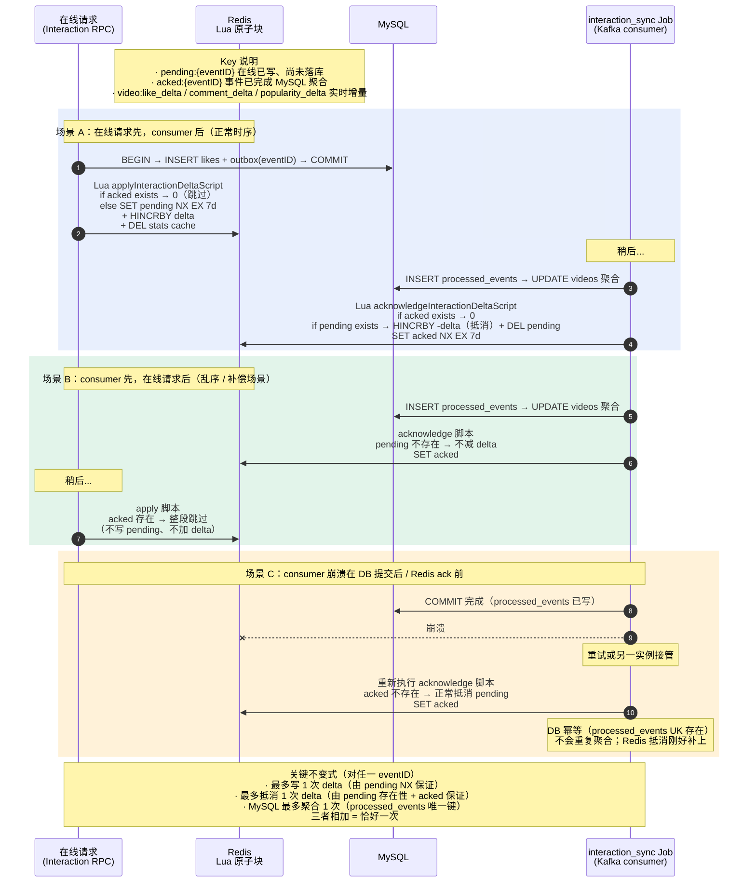

**点赞流程**：

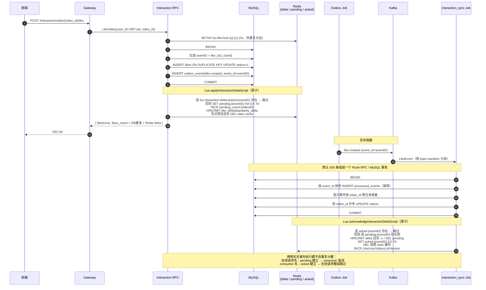

#### 8.3.1 点赞抗压分析：削峰、批量聚合与可持续吞吐

朴素方案在每次点赞请求中直接更新 `videos.likes_count`，热门视频会形成单行锁热点。当前实现把用户关系事实与派生计数拆开：在线事务只完成 `likes / interaction_events / outbox_events` 等事实写入，Redis 立即维护用户可见增量；Kafka 消费端再批量更新 `videos` 聚合字段。

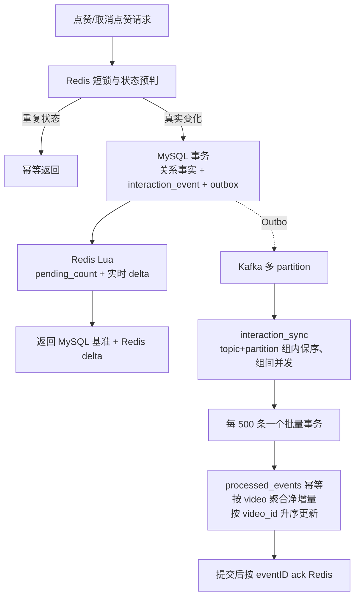

| 层次 | 机制 | 解决的问题 |
|---|---|---|
| 请求入口 | 用户+视频短锁、Redis 状态缓存 | 连点与重复状态不进入 MySQL |
| 在线事务 | 关系事实与 Outbox 同事务 | 不丢事件，避免直接争抢视频计数行 |
| 实时读侧 | MySQL 基准 + Redis 未落库净增量 | Consumer 有延迟时计数仍实时 |
| Kafka | 6 partition、at-least-once | 削峰、重放、横向扩展 |
| Consumer | partition 内保序、最多 4 worker 并发 | 保序与吞吐兼顾 |
| Flush RPC | 500 事件/事务、按视频聚合 | 显著减少事务提交和热点行 UPDATE 次数 |
| 幂等与恢复 | `processed_events` + pending/acked/pending_count | 重复消费与 DB 提交后 Redis ack 中断可恢复 |

**不要宣称“单机已经支持万级 QPS”**。本项目的可信结论来自 §14.6 的本机压测：正式数据集为 10000 用户、5000 视频；点赞场景最终达到约 `260.4 次业务循环/s`，每个循环包含 Like+Unlike 两个写请求，即约 `520.8 HTTP 写请求/s`，并在压测结束约 7 秒后把 Kafka lag 完全排空。该结果证明的是当前单机开发环境下约 500 事件/s 的可持续闭环，而不是生产集群上限。

---

### 8.4 Social 社交模块

**职责**：关注关系、粉丝/关注列表、粉丝数维护、大 V 升级。

**核心 RPC**：

| Rpc | 说明 |
|---|---|
| `Follow` | 事务：`INSERT follows ON DUPLICATE KEY UPDATE` + accounts 双向计数 +1 + **大 V 升级判定** + 双 outbox 事件（业务 + 通知） |
| `Unfollow` | 事务：软删 follows + accounts 双向计数 -1（GREATEST 防负）+ 双 outbox |
| `IsFollowing` | Redis `fsz:social:following:{f}:{t}` |
| `BatchIsFollowing` | 视频列表页批量查关注状态 |
| `ListFollowers` / `ListFollowings` | 首页 Redis 缓存 + 构建锁 + 分页兜底 MySQL |

**Follow 关键事务**（包含防死锁双侧行锁）：

为防止 A↔B 同时互相关注时两个事务分别先锁对方行形成锁序反转，事务开始先按 `MIN(followerID, followingID)` → `MAX(followerID, followingID)` 顺序对 accounts 表双行 `SELECT FOR UPDATE`（见 `lockFollowAccounts`），再读写 follows / 计数字段。

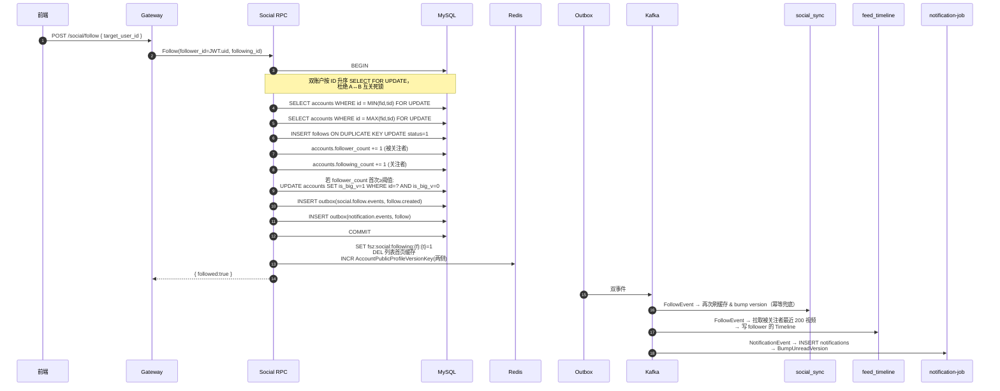

**大 V 判定详解**：见 [8.6 Feed 推拉分离](#86-feed-推拉分离模块)。

#### 8.4.1 设计取舍与并发保护

**为什么 accounts 双行 `FOR UPDATE` 要按 ID 升序？**

经典死锁场景：A 关注 B 的同时 B 关注 A：
- 事务 X（A→B）：先锁 A 行，再锁 B 行
- 事务 Y（B→A）：先锁 B 行，再锁 A 行
- 两个事务互等对方持有的锁 → **死锁**

`lockFollowAccounts` 强制按 `MIN(followerID, followingID) → MAX(...)` 顺序上锁，任何两个并发事务的加锁序列都相同，从根本上消除锁序反转。

**为什么 `is_big_v` 是"只升不降"的标志位，而不是按实时 follower_count 判断？**

如果按实时粉丝数判断大 V：
- 大 V 掉粉一瞬间被判为小 V → feed_timeline 会把他的新视频**写扩散到所有粉丝 inbox**
- 粉丝一多，一次写扩散几百万条 ZADD → **瞬间打爆 Redis**
- 而且此时如果他又涨粉回到大 V，历史视频依然留在粉丝 inbox 里，读侧再去 outbox 合并会**重复出现**

采用 `WHERE is_big_v=0 → SET is_big_v=1` 的幂等升级，且**永不回退**，从根源消除"抖动型写扩散"。

**为什么 Follow 事务里同时写"业务 outbox"+"通知 outbox"？**

同一次 Follow 触发的下游包括：
- 关注关系缓存 `social_sync`
- 关注流写扩散 `feed_timeline`
- 关注通知落库 `notification`

如果只发一条通用事件让所有消费者共享，每个消费者都要判断"这条事件跟我有没有关系"，**耦合度高、演进困难**。

拆成两条 outbox 之后：
- `social.follow.events` → social_sync + feed_timeline 消费（业务事件）
- `notification.events` → notification-job 消费（通知事件）
- 两条 outbox 都在**同一个 MySQL 事务里**写入，天然一致

**Follow 抗压分析**：

| 环节 | 是否是瓶颈 | 说明 |
|---|---|---|
| accounts 双行 FOR UPDATE | ⚠️ **关注同一大 V 时会抢同一被关注者行** | 头部大 V（千万粉级）新增关注每秒上百可能会有排队，但 MySQL 行锁的等待/唤醒非常快，通常不构成问题 |
| follows INSERT ON DUPLICATE KEY | 不是 | 唯一键 `(follower, following)` 每对都不同 |
| outbox_events INSERT × 2 | 不是 | 自增主键 |
| 双向 profile 版本号 INCR | 不是 | Redis 原子操作 |

**为什么 ListFollowers/ListFollowings 首页缓存需要构建锁？**

粉丝/关注列表首页缓存 miss 时要 `SELECT` 拉一批（几百条）+ 组装 JSON，如果一位大 V 首页缓存刚失效，几百个粉丝同时刷新会**并发触发几百次 MySQL 查询** → 缓存击穿。

`fsz:social:followers:build_lock:{user}` SETNX 5s 保证同一时刻**只有一个请求去回源 MySQL**，其他请求短暂等待并重读缓存。

#### 8.4.2 Follow/Unfollow 事务级死锁重试与预检移除

即便 accounts 双行 `FOR UPDATE` 已经消除了一部分锁序反转风险，在正式规模压测时仍发现 InnoDB 会在多个并发关注同一大 V 时偶发 1213 死锁（例如两个事务同时碰 outbox 自增主键末页上的插入意向锁）。针对这一点：

- `runSocialWriteTransaction`（见 `apps/social/internal/logic/socialhelper.go`）将整个 Follow/Unfollow 事务包裹在重试循环里，仅对 `mysql.MySQLError.Number` 为 `1213 / 1205` 的错误进行有限重试，其余错误（包括唯一键、外键、业务参数错误）直接向上抛。
- 默认重试 3 次（`socialDBMaxRetries`），退避基准 20ms，封顶 200ms，**附加最多 50% 拖抽**（`socialDBRetryDelay`），避免同一批被回滚事务同时重试再次同步争锁。
- **重试安全前提**：事务体内部的局部变量（如 `now`、`stateChanged`）在每一轮重试开头重新赋值，**不使用上一轮已回滚的局部状态**。写入 accounts 双向计数、follows、业务 outbox、通知 outbox 的全部上下文都在同一事务内重新构造，保证重试不会遗留半状态。

**同时移除了两个不必要的预检锁**：

- 旧实现在事务中先调 `AccountRpc.GetProfile` 预检目标用户是否存在，既多一次 RPC 往返，又在事务完成前可能造成长时间持锁。当前实现已删除预检，直接在 INSERT 命中外键/唯一键错误时把错误归一到 `codes.NotFound`。
- 旧实现一开始就 `SELECT ... FOR UPDATE` 拉 follows 行，对不存在的唯一键会产生 **gap lock**，后续 `INSERT` 又升级为插入意向锁，导致高并发下频发 1213。当前实现改为**普通 `Take`**（不加锁）预读已存在关系，依靠 accounts 双行 FOR UPDATE 充当构件互斥。若不存在，使用 `INSERT ... ON DUPLICATE KEY DO NOTHING`，并在并发冲突的反馈（`RowsAffected == 0`）后才回读加锁处理。

**关于“目标用户不存在”的错误反馈**：尽管写事务不再预检 `GetProfile`，Follow 接口末端仍然能识别目标不存在——INSERT 时会命中 follows 表的外键约束（`follows.following_id → accounts.id`）而直接报错，`Follow` 把它归一为 `codes.NotFound` “目标用户不存在”返回给上游。

---

### 8.5 Notification 通知模块

**职责**：接收 `notification.events`（关注/点赞/评论触发），维护 `notifications` 表，提供未读数 & 通知列表。

**核心 RPC**（`apps/notification/internal/logic/`）：

| Rpc | 说明 |
|---|---|
| `ListNotifications` | `(occurred_at DESC, id DESC)` 复合游标分页；`receiver_id` 兜底校验 |
| `GetUnreadCount` | 走 `notificationcache.LoadUnreadCount` 版本号缓存，miss 时 `SELECT COUNT(*) WHERE status=1`，Redis 挂了直接回源 |
| `MarkNotificationRead` | UPDATE 单条为已读；`rowsAffected>0` 时 `BumpUnreadVersion` |
| `MarkAllNotificationsRead` | 批量 UPDATE 所有未读为已读；`changed>0` 时 `BumpUnreadVersion` |

**未读数缓存方案 B（版本号 + 惰性重算）**：

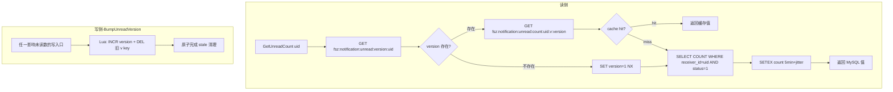

**Notification Job 6 种情况判定**：

Job 消费 `notification.events` 时，需要精确判断"这次事件是否真的影响未读数"，只在影响时 `BumpUnreadVersion`：

| # | 场景 | MySQL 动作 | 未读数变化 | bump? |
|---|---|---|---|---|
| 1 | 全新通知 (business_key 不存在) + create | INSERT (status=1) | +1 | ✅ |
| 2 | 已撤回通知 (status=3) + create（复活） | UPDATE 3→1 | +1 | ✅ |
| 3 | 旧事件（OccurredAt < 现有 record） | 什么都不做 | 不变 | ❌ |
| 4 | 未读通知 + delete | UPDATE 1→3 | -1 | ✅ |
| 5 | 已读通知 + delete | UPDATE 2→3 | 不变 | ❌ |
| 6 | 已撤回通知 + 重复 delete | UPDATE 3→3 (无变化) | 不变 | ❌ |

`applyNotificationEvent` 返回 `bumpReceiverID uint64`（0 表示不需要 bump），事务 COMMIT 成功后再统一调 `BumpUnreadVersion`。

**通知流程**：

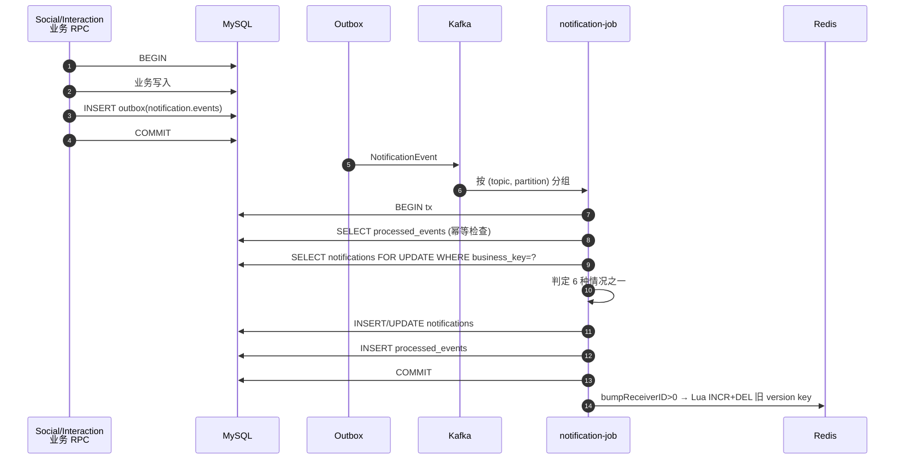

#### 8.5.1 设计取舍：为什么用"版本号 + 惰性重算"方案 B？

**朴素方案 A**：读一次 → SETEX 缓存，写一次 → DEL 缓存

- 问题 1：**并发写导致缓存穿透** —— 大量写事件同时 DEL 后，读会集中回源到 MySQL COUNT
- 问题 2：**缓存与 MySQL 之间的不一致窗口** —— DEL 之后、下一次读回填之前，会短暂读到旧值
- 问题 3：**Redis 宕机重启后所有缓存丢失** —— 大量用户同时 miss → 打爆 MySQL

**方案 B**：版本号 + 惰性重算

- 写路径不 DEL 缓存，只 **INCR version + 一次性 DEL 旧版本 key**（Lua 原子）
- 读路径 `GET version → GET count:v:{version}` 组合 key，miss 时 SELECT COUNT
- **Redis 挂了**：`LoadUnreadCount` 直接降级 `SELECT COUNT WHERE status=1`，业务不中断
- **写扩散**：只写一个 version key，一次 INCR 是原子的，即使 1000 个并发 bump 也只是最后 version 变化，**不会产生缓存击穿**

**核心不变式**：
- 任一次 `MarkRead` / `INSERT notifications` 之后，version 必然递增
- 下一次读用最新 version 组合 key，一定是 miss → **强制回源** MySQL，读到最新值
- 旧 version 的 count key 用 5 分钟 TTL + Lua DEL 兜底，不会长期占内存

**bump 时机的自愈机制（`attemptBumpReceivers` 每轮独立）**：

`notification-job` 的事务体 `applyNotificationEvent` 会返回本条事件是否需要 bump 未读版本号。在 `apps/job/notification/internal/logic/consumer.go` 中，事务重试循环为**每一次尝试都新建一个 `attemptBumpReceivers` 局部集合**：

```
for attempt := 0; ; attempt++ {
    attemptBumpReceivers := make(map[uint64]struct{})
    txErr := c.svcCtx.GormDB.Transaction(func(tx *gorm.DB) error {
        // ...accumulate bumpReceiverID into attemptBumpReceivers...
    })
    if txErr == nil { bumpReceivers = attemptBumpReceivers; break }
    if !isRetryableNotificationDBError(txErr) { return txErr }
    ...
}
```

这样即使前一轮事务因 1213/1205 被完整回滚，也**不会**把已回滚事务里收集的 receiver 带到后续成功提交后去 bump——避免“数据库回滚了但未读版本号却乱 bump”的脏数据。`isRetryableNotificationDBError` 只对 MySQL 1213（死锁）/ 1205（锁等待超时）返回 true，其他错误直接上抛不重试，避免把约束错误伪装成瞬时故障。

**重试参数可配置**（`Notification.DBMaxRetries / DBRetryBaseMs / DBRetryMaxMs`，默认 3/20/200 ms，上限 8），重试间隔指数退避 + 抵抗0.5 倍拖抽（`c.dbRetryDelay`），避免同一批被回滚事务同时重试再次撞锁。

#### 8.5.2 为什么 6 种情况的 bump 判定要精确？

如果无脑 bump（不管事件是否真影响未读数），会导致：
- 幂等重放的旧事件 → 缓存 miss → 触发 SELECT COUNT → **性能浪费**
- "已撤回通知的重复 delete"这种无效事件也 bump → 频繁失效缓存

`applyNotificationEvent` 返回 `bumpReceiverID uint64`（0 表示不 bump），配合 6 种情况精确判定，只在**真的可能影响 status=1 计数**时才 INCR version，最大化缓存命中率。

**为什么 `BumpUnreadVersion` 在事务 COMMIT 后调用而不是事务内？**

- **在事务内调用 Redis 违反了"事务边界内不应有外部副作用"** —— 事务回滚时 Redis 已经改了，回不去
- **事务 COMMIT 失败** → 事件会重试 → 重试成功时才 bump，Redis 状态和 MySQL 一致
- **Redis bump 失败** → 只 log 不重试；下一次读会因为**版本号不匹配（读到的还是旧版本 key）** miss 回源，天然自愈

---

### 8.6 Feed 推拉分离模块

**职责**：关注流（GetFollowingFeed）、热榜（GetHotFeed）、推荐流（GetRecommendFeed）。

Feed RPC **只返回 video_id 和排序信息**，具体视频详情、作者昵称、点赞数由 Gateway 分别通过三个 Batch 接口聚合，避免 Feed 服务越权访问其他领域数据。

#### 8.6.1 推拉分离核心思想

|  | 小 V (is_big_v=0) | 大 V (is_big_v=1) |
|---|---|---|
| 写路径 | 发视频时 fanout 到所有粉丝的 inbox ZSet | 只写自己的 author outbox ZSet |
| 读路径 | 直接读 inbox | 拉取关注列表中的大 V outbox 合并 |
| 优点 | 读快 | 写快，不放大 |
| 缺点 | 写放大 | 读时多几次 ZRANGE |

**大 V 判定采用 `is_big_v` 标志位而非实时 `follower_count`**：

- 一旦升为大 V 就永久保留（`WHERE is_big_v=0` 幂等升级）。
- 避免大 V 掉粉后再涨粉的"反向穿越"：如果按粉丝数实时判定，掉粉那一瞬间历史视频从粉丝的 inbox 里 fanout 走了，反向穿越时再涨回来也拿不回来。

#### 8.6.2 GetFollowingFeed 流程

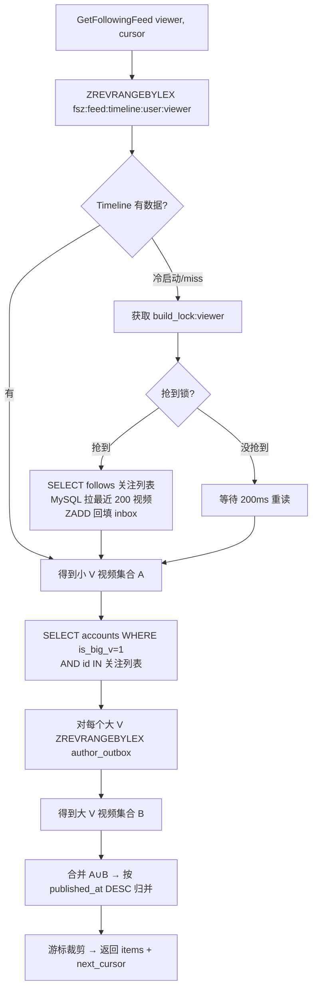

#### 8.6.3 feed_timeline Job 事件驱动

- **video.published**：查作者 `is_big_v`。小 V → fanout 到所有活跃粉丝 inbox；大 V → 只 ZADD 作者 outbox。
- **video.deleted**：从相应 ZSet 中移除（回读 MySQL 事实状态兜底）。
- **follow.created**：拉取被关注者最近 200 视频，写 follower inbox（如果被关注者是大 V，跳过，直接依赖读侧合并 outbox）。
- **follow.deleted**：从 follower inbox 中移除被关注者的所有视频。

**Global Timeline ready 禁不可丢**：全局最新流 ZSet `fsz:feed:global_timeline` 需要配套一个 `ready` 标记才可以接受写入，防止尚未初始化时写了一半的数据。一旦指标丢失（例如 Redis flush），writer 会返回 `errGlobalTimelineNotReady`；旧方案靠 Kafka 无限重试无人恢复。新方案：**consumer 层捕获该错误后调用 `BootstrapGlobalTimeline`（带分布式锁）完成一次重建，再重试当前事件**，避免 Kafka 原地重试风暴。

**Timeline 冷启动保护**：
- `fsz:feed:timeline:build_lock:{viewer}` 5-10s 锁，避免同一用户多个请求并发触发 MySQL 全量回填。
- `fsz:feed:timeline:user:{viewer}` 使用 `EXPIRE 7d`，长期不活跃用户自动淘汰。
#### 8.6.4 Timeline ZSet 编码

来自 `common/feedx/timeline.go`：

- 所有元素 `score=0`，实际顺序由 member 字典序决定。
- Member 格式：`{publishedAt:19位}:{videoID:20位}`，前 0 补齐，保证 lex 排序等价于数值排序。
- 使用 `ZREVRANGEBYLEX` 分页，游标格式 `(member` 实现排他上界，无重复无遗漏。

#### 8.6.5 设计取舍与抗压分析

**为什么用推拉分离而不是纯推 / 纯拉？**

| 方案 | 写路径 | 读路径 | 致命缺陷 |
|---|---|---|---|
| **纯推（写扩散）** | 发视频 → 写到所有粉丝 inbox | 直接 ZREVRANGE | 大 V 一次写扩散上千万条 ZADD → **打爆 Redis** |
| **纯拉（读扩散）** | 发视频 → 只写作者 outbox | 拉关注列表 N 个 outbox 归并 | 关注了几千人的用户每次拉 Feed 都要拉几千个 ZSet → **读放大灾难** |
| **推拉分离**（当前） | 小 V 写扩散 / 大 V 只写自己 outbox | inbox（小 V 已扇入）+ 关注的大 V outbox 合并 | 兼顾读写，大 V 数量有限 → 读侧合并可控 |

**读侧成本估算**：假设用户关注 500 人，其中大 V 20 人（`is_big_v=1`）：
- 480 个小 V 的最近视频**已经在 inbox**里（feed_timeline 写扩散过） → 1 次 ZREVRANGEBYLEX
- 20 个大 V 分别拉 outbox → 20 次 ZREVRANGEBYLEX（可以 pipeline 并发）
- 合并归并 → O(K log K)，K 是 pagesize 200

**写侧成本估算**：
- 小 V 发视频（假设 1000 粉丝）→ 1000 次 ZADD，几十毫秒，可接受
- 大 V 发视频（假设 100 万粉丝）→ **1 次 ZADD**（只写自己 outbox） → 常数时间

**Timeline 冷启动的三层保护**：

1. **build_lock 分布式锁**：`fsz:feed:timeline:build_lock:{viewer}` SETNX 10s，同一用户多个并发请求只让**一个**去回源 MySQL
2. **7 天 TTL**：不活跃用户的 inbox 自动淘汰，避免亿级用户全量常驻 Redis
3. **懒加载**：冷用户第一次拉 Feed 才触发构建（`SELECT follows` + 拉每个关注对象最近 200 视频）

**Global Timeline ready 自愈**：`fsz:feed:global_timeline` 需要 `ready` 标记才允许写入，防止半初始化状态。旧方案在 `errGlobalTimelineNotReady` 时靠 Kafka 无限重试等人恢复。新方案：consumer 层捕获后调用 `BootstrapGlobalTimeline`（内部分布式锁，避免多实例重复重建）完成一次重建，再重试当前事件，**自愈无人工介入**。

**为什么 feed_timeline job 用回读 MySQL 事实状态而不是靠事件 OccurredAt 排序？**

事件流可能存在：
- Kafka 重试导致乱序（例如先收到 delete 再收到 create）
- 消费者宕机重启后重放（重复处理旧事件）

如果单纯靠 `OccurredAt.Before(existing)` 跳过旧事件，任何一次 ZSet 数据丢失都无法通过重放恢复。改成**每次都回读 MySQL 的 status/is_big_v 事实状态**决定 add/remove，**天然幂等**、天然自愈。代价是每个事件多一次 SELECT，但比数据错乱强得多。

---

### 8.7 HotRank 热榜模块

**职责**：以独立 Consumer Group 直接消费 `interaction.like.events` 和 `interaction.comment.events`，将每条互动按发生时间写入 UTC 单分钟热度窗口；Feed 读侧把最近 N 个窗口按时间衰减合并成稳定分页快照。

**核心机制**：

- 点赞权重为 `3`，评论权重为 `5`；取消点赞/删除评论写入对应负分。
- 每分钟一个 ZSET：`fsz:hot:window:{yyyyMMddHHmm}`，member=videoID，score=该分钟净热度。
- Redis Lua 在同一原子块中写 `ProcessedEventKey(eventID, hotrank)` 与 `ZINCRBY`，Kafka 重放不会重复计分。
- 消息按 `topic+partition` 分组，组内保序、组间默认 4 worker 并发；坏消息进入 `dead_letter_events`。
- 分钟窗口默认保留 2 小时；超过保留期的旧消息只写幂等标记，不复活过期窗口。
- `GetHotFeed` 默认聚合最近 60 个分钟窗口，按 30 分钟半衰期加权，通过临时 ZSET + Lua 校验锁 + `RENAME` 原子发布快照。
- 快照 key 为 `fsz:hot:merge:{asOf}`，`ready` key 即使值为 0 也表示“已成功构建空榜”，避免缓存穿透。

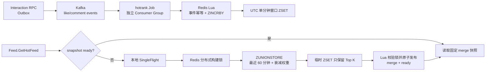

#### 8.7.1 为什么使用分钟窗口 + 固定快照

直接按 `videos.popularity` 全表排序无法表达时间窗口，而且数据量增长后排序成本高。分钟窗口让写入只做一次 `ZINCRBY`，读侧再通过 `ZUNIONSTORE` 合并有限窗口；同一个 `snapshot_at` 只构建一次并缓存 30 分钟，后续分页始终读取同一份榜单，不会因新互动导致翻页重复或遗漏。

缓存命中与冷构建的本机实测见 §14.6：50 并发下，已构建快照约 7503.4 QPS；删除 merge 快照后触发构建约 1428.1 QPS，构建结束 `ready=50` 且 `ZCARD=50`。这说明热榜读性能来自预聚合快照，同时冷启动路径也能正确闭环。

---

### 8.8 Gateway 网关

**职责**：HTTP → gRPC 转换、JWT 鉴权、请求参数校验、**跨模块 Batch 聚合**。

**核心中间件**：

- `TokenAuth`：解析 `Authorization: Bearer <jwt>` → 校验 → 把 `user_id` 放进 `context`。
- `OptionalTokenAuth`：有 token 就解析，没有就放行（用于游客可见的 `/feed/hot`、`/video/{id}` 等接口）。

**聚合层职责**：

Feed / 通知列表 / 评论列表等场景，Gateway logic 层负责：
1. 从 RPC 拿到 ID 列表。
2. 并发调用 `BatchGetVideos` / `BatchGetProfiles` / `BatchGetVideoStats` / `BatchIsFollowing`。
3. 组装成前端友好的 DTO。

**作者昵称/评论作者回填**（commit 687d0ab 强化）：`GetVideo` / `ListUserVideos` / `ListComments` 三个页面另外调用一次 `enrichHTTPVideoAuthors` 或 `loadSocialUserInfoMap`，把 Video / Comment 表内冗余的旧“作者快照用户名”替换为 Account RPC 里的最新昵称；RPC 失败时降级返回快照，保证列表仍可用。

**禁止 N+1**：所有 RPC 的批量接口存在就是为了这一点。

---

## 九、关键异步 Job 详解

### 9.1 Outbox Dispatcher

#### 9.1.0 通俗版：Outbox 到底在做什么？

先抛开代码看**业务问题**。以点赞为例，一次成功的点赞要做两件事：

1. 在 MySQL 的 `likes` 表插入一条记录（这是权威事实）。
2. 通知下游：更新 `videos.likes_count`、刷新 Redis 缓存、给作者发通知、推热榜、进个人页流水……（这些是派生状态）

如果直接在 RPC 里"先写 MySQL 再发 Kafka"，就会出现 4 类不一致：

- MySQL 写成功、Kafka 发失败 → 派生状态永远追不上。
- Kafka 发成功、MySQL 事务回滚 → 下游算了一次不存在的点赞。
- Kafka 发成功、RPC 返回超时给客户端，客户端重试一次 → 下游算了两次。
- 网络抖动导致 Kafka 消息发出去了但业务不知道 → 无法排障。

**Outbox 事务发件箱模式**把"通知下游"变成"往同一个 MySQL 事务里插一行事件"。业务 RPC 只需保证 `likes 表 INSERT` 和 `outbox_events INSERT` 在**同一个本地事务**里成功，事务提交 = 消息一定会被投递（哪怕现在 Kafka 宕机也没关系，事件躺在 MySQL 里等着，稍后重投）。真正把消息发到 Kafka 的活儿，交给一个独立的后台任务 —— 也就是 `outbox-job` 的 `Dispatcher`：

1. **定时轮询**：每 1 秒扫 `outbox_events` 表，捞出到期未投递的事件。
2. **认领**：把这批事件从 `pending` 改成 `processing`，打上"我在处理"的标记。
3. **投递**：把消息 `PublishBatch` 到对应 topic。
4. **回写**：如果 Kafka 确认收到就改成 `sent`；如果失败就 `retry_count+1` 并安排下次重试；重试到上限就转 `dead` 等人工处理。

Outbox Dispatcher 是非阻塞的定时拉取 + 分片并发投递。完整实现在 `apps/job/outbox/internal/logic/dispatcher.go`，涉及三个关键机制：**同业务聚合保序**、**分片并发投递**、**批量回写 lock_token 验证**。

**主循环与并发限制**：

- `Run` 按 `Outbox.PollIntervalMs`（默认 1s）制造 tick；每个 tick 尝试启动一轮 `DispatchOnce`。
- 使用 `inFlight := make(chan struct{}, 1)` 令牌：**同时只会有 1 轮 `DispatchOnce` 运行**，上一轮未完时后续 tick 直接 skip 并记录 warn，避免堆积时无限创建 goroutine。
- 单轮任何失败只记录日志，下一轮自然重试（后台常驻任务不能因一时错误退出）。

**Claim 阶段（`claimDueOutboxEvents`）**：

一个短事务内完成“拉一批 + 标记 processing + 写入 lock_token”：

```sql
-- 当前时间为 now，staleBefore = now - Outbox.ClaimTimeoutSeconds (默认 60s)
SELECT * FROM outbox_events
WHERE (
    (status IN (pending, failed) AND (next_retry_at IS NULL OR next_retry_at <= now))
    OR (status = processing AND locked_at IS NOT NULL AND locked_at <= staleBefore)
) AND NOT EXISTS (
    -- 关键保序约束：同聚合同时仅允许最早一条未完成事件被 claim
    SELECT 1 FROM outbox_events AS predecessor
    WHERE predecessor.aggregate_type = outbox_events.aggregate_type
      AND predecessor.aggregate_id   = outbox_events.aggregate_id
      AND predecessor.id             < outbox_events.id
      AND predecessor.status IN (pending, failed, dead, processing)
)
ORDER BY id ASC LIMIT :batch
FOR UPDATE SKIP LOCKED;
```

紧接着在**同一事务内**把选中行 UPDATE 为 `status=processing, lock_token=<本轮随机 32bit>, locked_by=<实例 ID>, locked_at=now`。

关键设计：

- **`FOR UPDATE SKIP LOCKED`**：多实例并发 claim 时互不阻塞，已被其他实例锁住的行直接跳过。

  > **SKIP LOCKED 到底是什么锁？** 它**不是**一种"新的锁类型"，而是 InnoDB `SELECT ... FOR UPDATE` 语句的一个**修饰符**，控制"遇到已被别人锁住的行时的行为"。
  >
  > 三种可选行为对比（想象 outbox 表里有 100 条待投递事件，两个 dispatcher 实例同时来 claim）：
  >
  > | 修饰符 | 行为 | 用在 outbox 会怎么样 |
  > |---|---|---|
  > | 默认（不加） | 等待前面的锁释放，最多等 `innodb_lock_wait_timeout`（50s） | 实例 B 会阻塞 50 秒直到实例 A 提交，吞吐掉到冰点 |
  > | `NOWAIT` | 立刻报错 `ER_LOCK_NOWAIT` | 实例 B 直接崩，需要业务层重试 |
  > | **`SKIP LOCKED`** | **跳过已锁行，只返回没被锁的行** | 实例 A 拿走前 50 条并锁定，实例 B **一次查询就直接拿到剩下的 50 条**，两边完全并行 |
  >
  > 换句话说，`SKIP LOCKED` = "别人在处理的我不碰，我只拿空闲的"。这正好匹配"多个 dispatcher 实例并发消费队列"这种典型的**任务队列**场景：MySQL 从 8.0 开始原生支持，配合 `SELECT ... FOR UPDATE SKIP LOCKED` 可以把关系表当轻量级消息队列用，不需要引入 Redis Stream 或专门的 MQ 就能做到多实例安全并发。
  >
  > 此外，为什么 outbox 需要 FOR UPDATE 加锁而不是普通 SELECT？—— 因为紧接着还要在**同一事务里** UPDATE 这批行的 `status/lock_token/locked_by`；如果不加锁，另一个实例可能在中间也 SELECT 到同一批行然后一起 UPDATE，就会出现两个实例都以为自己"独占"了这批消息，从而重复投递。加了 `FOR UPDATE`，行级 X 锁会一直持有到事务提交，其他事务想读同一行时只能选择等待或 `SKIP LOCKED` 跳过。

- **`NOT EXISTS` 前序子句**：同一 aggregate 必须等前序事件 `sent` 之后才能进入下一轮 claim，"同一视频先删后投递 create"、"同一用户先 unlike 后投递 like" 这类反序从根源不会发生。`dead` 事件也会阻塞后续，强迫人工补偿，不静默跨过。
- **专用索引 `idx_aggregate_status_id(aggregate_type, aggregate_id, status, id)`**（`016_outbox_aggregate_status_index.sql`）让 NOT EXISTS 只扫四种未完成状态，不会回扫同聚合已 sent 的历史事件。
- **本轮 `lock_token`**：同一批 claim 共享一个随机 token，后续投递失败 / 成功回写时都带 `WHERE id IN ... AND status = processing AND lock_token = :token`，因此“旧实例 claim 了一批 → 卡死→ 新实例 claim 同一批’’ 不会互相覆盖彼此的投递结果。

**Dispatch 阶段（`dispatchClaimedEvents` + `dispatchClaimedBatch`）**：

1. 认领到的一批事件通过 `splitOutboxBatches(events, workerCount)` 均匀分片；worker 上限默认 4（`normalizeOutboxWorkerCount`），上限 32，并且 worker 数不会超过事件总数。
2. **同一批 claim 内同一 aggregate 最多只有 1 条事件**（NOT EXISTS 保证），因此不同分片内部无需保序，可以安全地并发发包。
3. 每个分片一次性构造 `[]kafkax.Message` 调用 `Producer.PublishBatch`，只产生一次 Kafka 同步写往返（避免旧实现里“逐条发送”持续受到 `BatchTimeout` 影响）。消息 Header 携带 `event_id / event_type / aggregate_type / aggregate_id`，供 consumer 直接读取而不必反序列化 payload。

**投递后回写（`markSentBatch` / `markFailed`）—— Kafka Publish 失败会发生什么？**

先看正常路径：

- **全部成功**：一条 UPDATE 把本分片 `id IN (…)` 同时改为 `status=sent, sent_at=now, lock_token=""`，并卡 `WHERE status=processing AND lock_token=:token`；影响行数不等于分片大小会以 `claim_lost` 日志报错（意味着锁超时后被其他实例重抢，无事无失）。事件到此彻底"离开发件箱"。

再看失败路径。发布 Kafka 时可能出现：网络抖动 / broker 拒绝 / 请求超时 / broker 收到但 ack 丢失 / topic partition 不可用……代码统一走 `markFailed`：

1. **`retry_count + 1`**：直接用 `gorm.Expr("retry_count + 1")` 累加，事务外并发场景也不会丢计数。
2. **阶梯退避**：`nextRetryDelay(retryCount)` 走**指数退避**——第一次失败 `RetryBaseMs`（默认 1s），之后每失败一次翻倍，封顶 `RetryMaxMs`（默认 60s）。即 1s → 2s → 4s → 8s → 16s → 32s → 60s → 60s…… 避免瞬时抖动打满 Kafka；退避期间事件 `next_retry_at` 落在未来，`dueOutboxScope` 会自动跳过它。
3. **`last_error` 写入原因**：截断到 1024 rune，防止某些 Kafka 客户端错误消息动辄几 KB 把 `last_error` 撑爆导致 `Row size too large`。这条错误信息可以直接 `SELECT` 出来排障，不需要翻日志。
4. **`status = failed`**：让下一轮 `dueOutboxScope` 依然能扫到它（`status IN (pending, failed)`）。
5. **`lock_token / locked_by / locked_at` 全部清空**：这批 claim 的租约已经释放，任何实例都能重新认领它。
6. **超过 `MaxRetry` → `dead`**：默认最多重试到某个上限（配置项 `MaxRetry`）后，`status` 改为 `dead` 且 `next_retry_at=NULL`。**dead 事件不会再被自动重试**，需要人工干预（改代码修复 bug、清理坏数据、手动改回 `pending` 让它重投）——这是**故意的设计**，避免"坏事件"无限占用 Dispatcher 资源，同时因为 §9.1 里 `NOT EXISTS` 子查询把 `dead` 也算作"前序未完成"，它会**阻塞同一 aggregate 的后续事件**，逼迫运维必须处理，绝不静默跨越。

一个容易被忽略的边界：**Kafka 已经收到消息，但 DB 回写失败**（比如网络分区、DB 短暂 unavailable）。这时事件仍是 `processing`，`locked_at` 超时后会被下一轮 `dueOutboxScope` 重新捞出——**会导致同一条消息被投递第二次**。这不是 bug，而是 Outbox 模式的**天然属性**：at-least-once。因此下游 consumer **必须**用 `processed_events` 做业务幂等，见下面 §9.1.5。

**可观测性与配置**（`OutboxConf`）：`PollIntervalMs / BatchSize (上限 500) / WorkerCount (上限 32) / MaxRetry / RetryBaseMs / RetryMaxMs / PublishTimeoutMs / EventTimeoutMs / ClaimTimeoutSeconds`，均在 `dispatcher.go` 有默认值归一化。运维排障最常用的 SQL：

```sql
-- 卡在 pending/failed 太久的事件（可能上游一直失败）
SELECT id, topic, event_type, retry_count, last_error, next_retry_at
FROM outbox_events
WHERE status IN (1, 2)  -- pending, failed
  AND created_at < NOW() - INTERVAL 5 MINUTE
ORDER BY id ASC LIMIT 50;

-- 已经进入死信、等人工处理的事件
SELECT id, topic, event_type, aggregate_type, aggregate_id, retry_count, last_error, updated_at
FROM outbox_events WHERE status = 4  -- dead
ORDER BY updated_at DESC LIMIT 50;

-- 修复完 bug 后把 dead 事件复活重投
UPDATE outbox_events
SET status = 1, retry_count = 0, next_retry_at = NULL, last_error = ''
WHERE id IN (:id_list);
```

#### 9.1.1 三层并发单位模型：集群 / 进程 / 单轮

Outbox Dispatcher 在生产环境里其实存在**三层不同粒度的并发**，理解它们的边界是读懂 `dispatcher.go` 的前提：

```text
Kubernetes 集群
  ├─ 实例 A (Pod / 进程)          ← 第 ① 层：多实例
  │    └─ Run 主循环
  │         └─ inFlight(cap=1)     ← 第 ② 层：进程内串行
  │              └─ DispatchOnce
  │                   └─ worker × N ← 第 ③ 层：单轮内并发发 Kafka
  ├─ 实例 B ...同上...
  └─ 实例 C ...同上...
```

| 层级 | 并发单位 | 数量控制 | 隔离机制 | 目的 |
|---|---|---|---|---|
| ① 集群层 | dispatcher 实例（Pod） | K8s 副本数 | MySQL `SELECT ... FOR UPDATE SKIP LOCKED` + `lock_token` | 横向扩展 + 高可用；一个实例挂了 60s 后其他实例接管 |
| ② 进程层 | 单进程内的 `DispatchOnce` | `inFlight := make(chan struct{}, 1)`（信号量容量 1） | Go channel + `select default` 非阻塞尝试 | 避免同进程自我惊群、tick 堆积无限起 goroutine |
| ③ 单轮层 | 发 Kafka 的 worker goroutine | `WorkerCount`（默认 4，上限 32） | `splitOutboxBatches` 按 aggregate 分片 | 利用 Kafka Producer 的 IO 并发提升吞吐 |

**为什么第 ② 层限制为 1，第 ③ 层却允许多个？** 因为二者要解决的问题不同：

- 第 ② 层"每个进程同时只跑一轮 DispatchOnce"：如果允许并发 DispatchOnce，两个 DispatchOnce 都会去 `SELECT ... FOR UPDATE SKIP LOCKED` 同一张表，虽然 SKIP LOCKED 不会真的冲突（会跳过对方锁住的行），但空转扫描完全没必要，还会让日志、指标、错误处理复杂化。加上 `inFlight` 容量 1，上一轮没跑完时 tick 直接 skip 记录 warn（"dispatch 跑不动了"），运维一眼能看出问题。
- 第 ③ 层"单轮内多 worker 并发发 Kafka"：Kafka `PublishBatch` 的网络往返有几十毫秒延迟，如果串行发 100 条要几秒钟；用 4~8 个 worker 并发发就把耗时压到 1/N。**并发发不会乱序**，因为同一批 claim 内**每个 aggregate 最多只有 1 条事件**（`NOT EXISTS` 保证），任意分片方式都不会把同 aggregate 的多个事件拆到并发 worker 里。

**为什么第 ① 层允许多实例？** 因为业务量增长时单机 Producer 会成瓶颈，加机器就能线性扩展；同时一台机器崩溃后其他机器 60s 内自动接管它留下的 `processing` 事件（详见 9.1.3），比"只有一个实例、崩了业务就阻塞"要健壮得多。

**"skip" 日志的观测意义**：第 ② 层 skip 日志不是"丢消息"的表现——事件本身还静静躺在表里，下一轮 tick 依然会扫到。它的价值是**金丝雀信号**：一旦看到 skip 频繁出现，就说明 DispatchOnce 跑得比 `PollIntervalMs`（默认 1s）还慢，需要看是不是 Kafka broker 抖动、DB 变慢或者 batch 突然爆增。`time.Ticker` 天然会丢弃积压 tick 不排队，加上 `inFlight` 容量 1，两层防抖同时指向同一理念：**恢复期不惊群、跑不动就报警**。

#### 9.1.2 生命周期同步：`inFlight` 与 `WaitGroup` 的分工

`Run` 主循环里同时用了 `inFlight`（channel）和 `wg`（`sync.WaitGroup`），这两个东西**职责完全不同**：

```go
inFlight := make(chan struct{}, 1)   // 决定"能不能启动"
var wg sync.WaitGroup                // 决定"能不能安全退出"
startDispatch := func() {
    select {
    case inFlight <- struct{}{}:
        wg.Add(1)                    // 只有真的启动 goroutine 才 Add
        go func() {
            defer wg.Done()           // goroutine 结束才 Done
            defer func() { <-inFlight }()   // 释放令牌
            _ = d.DispatchOnce(ctx)
        }()
    default:
        d.Errorf("skip outbox dispatch tick: previous dispatch is still running")
    }
}
for {
    select {
    case <-ctx.Done():
        wg.Wait()                    // 等最后那 1 个 DispatchOnce 收尾
        return ctx.Err()
    case <-ticker.C:
        startDispatch()
    }
}
```

| 组件 | 职责 | 何时增加 | 何时减少 |
|---|---|---|---|
| `inFlight`（cap=1） | 并发限制 —— 同一时刻最多允许 1 个 DispatchOnce | 每次成功启动 goroutine | goroutine 结束时（`defer <-inFlight`） |
| `wg` | 生命周期同步 —— 确保关机时等 goroutine 收尾 | `wg.Add(1)` 与令牌配对 | goroutine 完全结束时 `wg.Done()` |

**为什么最多只有 1 个 goroutine 还需要 `sync.WaitGroup`？** 因为 `DispatchOnce` 是 `go func(){...}()` 派生出的**子 goroutine**，跟 `Run` 主循环不是同一个 goroutine。当 K8s 发 SIGTERM 让 `ctx.Done()` 触发时，如果不 `wg.Wait()`：

1. 主循环立刻 `return ctx.Err()`
2. `Run` 函数返回，上层调用者关闭 GORM 连接池、Kafka Producer
3. 那个 DispatchOnce 子 goroutine 可能正卡在"Kafka 发到一半"或"markSentBatch 回写到一半"，被强杀

后果：
- Kafka 已发但 DB 未回写 → 事件保留 `processing`，60s 后 `staleBefore` 重投（可容忍，靠 consumer 幂等去重）
- DB 连接被拉走一半 → GORM 错误日志刷屏
- 半开状态的 socket 让 Kafka broker 端出现"发了一半的消息"

加上 `wg.Wait()` 后是**优雅关闭**：
1. `ctx.Done()` 触发，主循环停派新一轮
2. `wg.Wait()` 阻塞直到当前那一轮 DispatchOnce 内部所有 `WithContext(ctx)` 调用都返回（Kafka 请求会被 ctx 打断，DB 语句会被 ctx 打断）
3. 该轮 goroutine `defer wg.Done()` 触发，主循环解除阻塞，正常返回 `ctx.Err()` 让上层放心回收连接池

**关键区分**：`inFlight` 管"进程内不允许并发"，`wg` 管"关机时不允许强杀"。哪怕 wg 计数最多只到 1，"等 1 个"和"不等"仍然是**优雅收尾**与**强制中断**的本质区别。同一个进程里另一个 `wg` 是 `dispatchClaimedEvents` 内部的—— 等待 N 个 Kafka worker 全部发完，这两个 wg 变量同名但作用范围截然不同。

#### 9.1.3 X 锁 vs 业务层租约：outbox 里的两种"独占"

这是理解 Outbox 自愈机制的**最容易被混淆点**。`outbox_events` 表里的一行事件实际上被**两种完全独立的"锁"**保护：

| | ① MySQL 行锁（X 锁） | ② 业务层租约 |
|---|---|---|
| 载体 | InnoDB 内存里的锁结构 | 表字段 `status / lock_token / locked_by / locked_at` |
| 加锁时机 | `SELECT ... FOR UPDATE` 语句执行 | UPDATE 写入 `status=processing, lock_token=xxx` |
| 释放时机 | **事务 COMMIT / ROLLBACK 那一瞬间**（几毫秒） | 直到 `markSent` / `markFailed` 改写，或 `locked_at` 超过 `staleBefore` 被其他实例覆盖 |
| 谁能观察到 | 只有 MySQL 自己（通过 `performance_schema.data_locks`） | 任何进程 SELECT 出来都能看到这几个字段值 |
| 谁能绕过 | 别的事务 `SELECT ... FOR UPDATE SKIP LOCKED` 能跳过 | 靠 `dueOutboxScope` 的 WHERE 条件识别与覆盖 |

**时间轴还原**（一条事件从被 claim 到崩溃再到被其他实例接管）：

```text
时间 →

t=0ms     ┌ claim 事务 BEGIN
          │  SELECT ... FOR UPDATE SKIP LOCKED   ← 加 X 锁到 InnoDB 内存
          │  UPDATE status=processing, lock_token=AAA, locked_at=t0
t=5ms     └ COMMIT                                ← X 锁立刻释放！！

          （此后行上没有任何 MySQL 锁保护）

t=5ms     ┌ dispatchClaimedEvents 开始
          │  Kafka PublishBatch 中……
          │  💥 t=200ms 时进程 A 崩溃 / 断网 / 卡死
          │  行的字段值凝固在：status=processing, lock_token=AAA, locked_at=t0

t=60s     ┌ 实例 B tick，跑 claimDueOutboxEvents
          │  now = t0+60s, staleBefore = t0
          │  dueOutboxScope 第 2 个 OR 分支命中：
          │    status=processing AND locked_at <= staleBefore
          │  B 直接对这一行加 X 锁（此时没别人锁着，SKIP LOCKED 无需跳）
          │  UPDATE lock_token=BBB, locked_at=t0+60s
          └ COMMIT
```

**核心事实**：从 t=5ms 到 t=60s 这**整整一分钟**里，事件行**根本没有任何 MySQL 行锁**在保护。X 锁只在 claim 事务的几毫秒里存在，事务 COMMIT 后立刻消失。保护"这批事件不被其他实例乱抢"的，是 `dueOutboxScope` 里的 WHERE 条件 —— 只要 `status=processing` 且 `locked_at > staleBefore`（还在租约期内），别的实例的 `SELECT` 就压根不会把它选出来。

**`lock_token` 到底防谁？** 它防的是"A 崩而未死"的诡异中间态。假设：

```text
t=0s     A claim 事件 42 → lock_token=AAA, locked_at=0s
t=1s     A 发 Kafka 卡住（网络卡顿，但进程没死）
t=60s    B 发现 locked_at 过期，抢过来 → lock_token=BBB, locked_at=60s
t=61s    B 发 Kafka 成功，markSent：
         UPDATE ... SET status=sent
                    WHERE id=42 AND status=processing AND lock_token='BBB'
         → RowsAffected=1 ✅
t=62s    A 突然恢复了（网络通了、GC 停顿结束了）
         A 以为自己还持有事件 42，尝试 markSent：
         UPDATE ... SET status=sent
                    WHERE id=42 AND status=processing AND lock_token='AAA'
         → RowsAffected=0（status 已经是 sent，lock_token 也变了）
         → A 日志打 "claim_lost"，放弃这条事件，不覆写 B 的成果
```

`lock_token` **不是锁，是"防伪印章"**：A 手里的章号 AAA，B 手里的 BBB，事件表里现在盖着 BBB 的章。A 想在事件上盖章，SQL WHERE 会说"这里已经不是你的章了"，A 就放弃。有了 `lock_token`，"实例 A 卡死复活 + 实例 B 已经接管"这种中间态里 A 绝不会覆写 B 的正确结果。

**术语澄清**：outbox 里所谓的"独占"其实是**租约模型（lease）** 而不是**锁模型（lock）**。租约有明确的到期时间（`ClaimTimeoutSeconds`，默认 60s），到期后自动流转给下一个愿意接手的实例；锁则要求持有者显式释放，持有者崩溃后需要外部干预。租约是**为分布式系统里"节点可能随时挂"这个现实**而生的设计——你永远不能相信另一台机器一定还活着，只能相信它答应的租约到期时间。

#### 9.1.4 两阶段独立 ctx 与失败路径的原子处理

`dispatchClaimedBatch` 是单个 batch 的完整处理单元。它有两处精细设计值得记录：

**设计 1：Kafka 阶段和 DB 回写阶段各自独立 timeout**

```go
// 第一段 ctx：只给 Kafka 用，10s 超时
eventCtx, cancel := context.WithTimeout(ctx, outboxEventTimeout(...))
publishErr := d.publishEvents(eventCtx, events)
cancel()   // 用完立即回收，不用 defer

// 第二段 ctx：只给 DB 回写用，10s 超时
markCtx, markCancel := context.WithTimeout(ctx, outboxEventTimeout(...))
defer markCancel()
```

如果两个阶段共用一个 ctx，Kafka 慢用掉 9.9s 后 markSent 只剩 0.1s → 大概率超时失败，事件白发了还得再重投。**独立预算**保证 Kafka 慢不吃 DB 的预算。同时第一段用 `cancel()` 而非 `defer cancel()`——Kafka 阶段结束立刻回收 eventCtx，避免它跟 markCtx 一起活到函数结束浪费 goroutine。父 ctx 被上层取消时（K8s SIGTERM），两个子 ctx 都会立刻被打断。

**设计 2：Kafka 失败时"整批重试 + 逐条 markFailed + 只记首错"**

```go
if publishErr != nil {
    var firstMarkErr error
    for _, event := range events {
        if err := d.markFailed(markCtx, event, publishErr, now); err != nil && firstMarkErr == nil {
            firstMarkErr = err   // 只记第一个
        }
    }
    if firstMarkErr != nil {
        return fmt.Errorf("publish outbox batch failed: %v; mark failed: %w", publishErr, firstMarkErr)
    }
    d.Errorf("publish outbox batch failed and scheduled retry, size: %d, first_id: %d, error: %v",
             len(events), events[0].ID, publishErr)
    return nil   // 预期内失败，返回 nil 不打扰上层
}
```

三个细节：

- **为什么整批重试？** kafka-go 的批量写在超时或部分失败时**可能已经写入了一部分消息**（比如 13 条里前 7 条 broker 收下、后 6 条超时），但返回的 error 不告诉你哪些成了。保守做法：全部重试。会造成 7 条重复投递，但 consumer 用 `processed_events` 幂等去重能兜住 —— **宁可重投不可漏投**是 at-least-once 的底线。
- **为什么逐条 `markFailed` 而不是批量？** 因为每条事件的 `retry_count` 可能不同，进而 `next_retry_at` 的退避时间也不同（1s / 2s / 4s / 8s…），甚至有些达到 `MaxRetry` 要转 `dead`。批量 UPDATE 无法表达"每行不同处理"。而成功路径 `markSentBatch` 所有字段值都一样（`sent + sent_at=now + lock_token=""`），才能一条 SQL 批量搞定。
- **为什么错误只记第一个？** 循环不 break 是为了让能回写的都回写（最大化容错），但 13 条同时失败多半是同根因（DB 挂了/连接池爆了），列出 13 条错误纯属日志噪音。用 `firstMarkErr` 标志保证记的是**第一个**（更接近事发时刻）而不是最后一个。返回值也讲究：Kafka 失败 + 全部 markFailed 成功 = 返回 nil（预期内的重试，运转正常）；Kafka 失败 + markFailed 也失败 = 返回 wrapped error（双重故障，需要 Errorf 报警，事件靠 `staleBefore` 60s 后重领兜底自愈）。

**设计 3：`dispatchClaimedEvents` 里无缓冲 channel + 双 case select**

```go
jobs := make(chan []model.OutboxEvent)   // 无缓冲
// … 启 N 个 worker: for batch := range jobs { … } …
for _, batch := range batches {
    select {
    case <-ctx.Done():
        close(jobs)         // 通知 worker 立刻停止取新活
        wg.Wait()           // 等已经拿到 batch 的 worker 收尾
        return ctx.Err()
    case jobs <- batch:     // 无缓冲 → 只有 worker 空闲时才能塞进去，天然背压
    }
}
close(jobs)
wg.Wait()
```

无缓冲 channel 是"天然背压"—— 主 goroutine 塞不进去时说明所有 worker 都在忙，主 goroutine 就阻塞，绝不会预分发一堆积压任务。ctx 取消时 `close(jobs)` 立刻通知所有 worker 停止取新 batch，剩余没塞进去的 batch **直接丢弃** —— 这些事件仍在 DB 里 `status=processing`，60s 后其他实例（或本实例重启后）通过 `staleBefore` 兜底重领，**不丢消息**。

#### 9.1.5 消费者侧失败处理：消息消费不下去了怎么办？

Outbox 只解决"上游一定发出去"，消息成功进入 Kafka 之后就归下游 consumer 管。所有 job（`interaction_sync / social_sync / notification / feed_timeline / hotrank`）都遵循**同一套失败处理骨架**，实现分散在各自的 `internal/logic/*consumer.go`：

**第一层：解码失败 → 直接进死信，不重试**

消息拉下来先做 `eventx.DecodeEnvelope + json.Unmarshal(payload)`。如果 envelope 缺字段、payload JSON 语法错、`aggregate_id` 不是合法数字，说明**这条消息本身是坏消息**，重试 100 次也是坏消息。代码路径是 `decodeGroupMessages → decodeMessage → 返回 (event, deadLetter, ok=false)`，然后累进 `deadLetters` 切片，一批结束后统一走 `recordDeadLetters` 落到 `dead_letter_events` 表（携带 `consumer_name / topic / partition / offset / payload / headers / reason` 全量证据），Kafka offset 正常前移，**不会卡分区**。

**第二层：处理失败 → 有限重试**

解码成功但业务处理失败（比如下游 RPC 短暂 unavailable、数据库死锁、CAS 冲突）分两种：

- **临时基础设施错误**（grpc `Aborted / Unavailable / DeadlineExceeded / ResourceExhausted`）：这类错误重试就能恢复，代码用 `callFlushRPCWithRetry`（`interaction_sync/logic/syncconsumer.go`）在**当前 partition worker 内**做指数退避重试，`shouldLogFlushRPCRetry` 只在第 1 次和每第 10 次打日志避免刷屏。**关键**：这层重试是"进程内 goroutine sleep"，不涉及 Kafka offset，其他 partition 的 worker 不受影响；如果直接把错误抛给 `RunBatch`，已经成功的分区就会跟着整批被 Kafka 重发一遍，offset 永远无法前推。
- **业务级失败**（比如 FlushRPC 返回 `FailedEventIds` 列表）：说明部分事件确实有问题（比如 CAS 版本号冲突、乐观锁失败）。走"有限重试子集"策略——在 `flushLikeEvents / flushCommentEvents` 里循环 `flushLikeEventsOnce`，成功的从下一轮剔除，失败子集再退避重试，最多重试 `Sync.MaxEventRetry` 次。

**第三层：重试到上限 → 死信 + 继续推进 offset**

处理若达到最大重试次数，代码走 `c.recordDeadLetters(ctx, c.deadLettersFromDecodedEvents(failed, reason))` 把仍然失败的事件写入 `dead_letter_events`，然后**当前批次视为处理完成**，Kafka offset 前移。这样做的原因是：**同一个 partition 里绝不能被一条坏事件卡死**，否则整个分区的所有后续消息都会积压，比"少处理一条"的代价大得多。死信表 `uk_consumer_message(consumer_name, topic, partition_no, offset_no)` 保证同一条 Kafka 消息即便被消费多次也只落一条死信记录。

**第四层：业务幂等 → 兜住 at-least-once 的重复**

即便前三层完全顺利，Kafka 本身也是 at-least-once（比如上面提到的 "Outbox 已投递但 DB 回写失败" 会重投）。因此每个 consumer 在**副作用完成的同一事务里**插入 `processed_events(event_id, consumer_name)` 唯一键：

```sql
UNIQUE KEY uk_event_consumer (event_id, consumer_name)
```

- 第一次消费成功：副作用 + INSERT processed_events 一起提交。
- 第二次重复投递到同一个 consumer：INSERT 命中唯一键冲突 → 事务回滚 → 副作用相当于**天然幂等**。
- 不同 consumer 消费同一个 event_id 互不影响（`consumer_name` 区分），点赞事件既可以进 `interaction_sync` 也可以进 `notification`。

`processed_events` 会设置 `expire_at` 用来定期清理超过保留期的历史记录，避免表无限增长。

**总结一句话**：Outbox 保证消息一定进 Kafka（可能重复），consumer 用 `processed_events` 兜住重复，遇到永远失败的坏消息用 `dead_letter_events` 隔离，任何分区都不会被单条消息卡死。整套机制之所以能做到高吞吐同时不丢不重，前提就是本节开头那一条：**RPC 里的业务写入和 outbox 事件写入必须在同一个本地事务内**。

### 9.2 Consumer 通用模式

所有消费者都遵循：

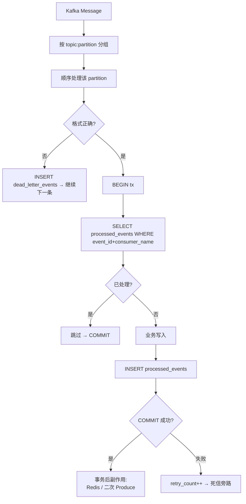

`interaction_sync` 在此通用模型上做了专门的吞吐优化：

1. 一批 Kafka 消息先按 `topic+partition` 分组；同一组内严格顺序执行，不同组最多由 4 个 worker 并发。
2. 默认收集 500 条事件后调用 Flush RPC；Flush RPC 不是逐事件开事务，而是一个批次一个事务。
3. 事务内按 `event_id` 固定幂等表加锁顺序，再按 `video_id` 聚合净增量并升序更新视频行。
4. `Aborted / Unavailable / DeadlineExceeded / ResourceExhausted` 属于基础设施临时错误，在当前 partition worker 内退避重试；格式错误和业务坏消息有限重试后进入死信。
5. Flush RPC 的批量请求体不写入普通访问日志，避免数百条事件反复序列化并占满日志磁盘；统计、慢调用和错误日志仍保留。

### 9.3 feed_timeline Job 特殊设计

**旧事件保护**：不采用 `OccurredAt.Before` 跳过旧事件，而是**回读 MySQL 事实状态**：

- `applyVideoEvent`：`loadVideoFinalState` 从 MySQL 拿 status/deleted_at 决定 add/remove。
- `applyFollowEvent`：`loadFollowFinalState` 从 MySQL 拿 status 决定 add/remove。
- `dispatchAuthorTimeline`：`loadAuthorBigVFlag` 拿 is_big_v（只升不降）。

这样即使消费到 stale 事件也能正确重放到最新状态，天然幂等。

**Global Timeline ready 丢失自愈**：`errGlobalTimelineNotReady` 不再靠 Kafka 无限重试；`HandleBatch` 层包裹 `applyEventWithTimelineRecovery`，捕获后主动调用 `BootstrapGlobalTimeline`（内部带分布式锁，避免多实例重复重建）后重试当前事件。

### 9.4 notification Job 特殊设计

- 采用 `OccurredAt.Before` 跳过旧事件（简单场景足够）。
- 精准的 6 种情况 bump 判定（见 8.5）。
- 事务 COMMIT 后才 `BumpUnreadVersion`，Redis 失败只 log 不重试（下次读时回源兜底）。

### 9.5 asset_cleanup Job（文件资产物理清理）

**定位**：一个单进程、无 Kafka 依赖的定时扫库 Job（默认 30s 一轮），把 video-rpc/gateway 已标记 `PendingDelete` 的 file_assets **延迟物理删除**，同时避免误删控制在中台上传一台删除的秒传竞争窗口。

**流程**：

```
1. 每 30s 扫描：选中
     status = PendingDelete AND ref_count = 0 AND deleted_at <= now - GraceSeconds
   或 status = Cleaning   AND ref_count = 0 AND updated_at <= now - ClaimTimeoutSeconds（超时重抢）
2. 逐条 claimAsset（事务内先 SELECT FOR UPDATE）：
     • 若发现 videos 仍有 play_url/cover_url = asset.URL 的 status=1 记录 → activeRefs>0 →
       ref_count 回填真实值、状态→ Active、deleted_at → NULL（引用复活兜底）；
     • 否则 UPDATE → Cleaning、抢到物理清理权。
3. removeAssetFile：严格限定在 Upload.Dir 子目录内，拒绝删除非普通文件/目录，
   删除失败 → 将状态回退 PendingDelete 供下一轮重试。
4. 成功后：UPDATE Cleaning → Deleted + DEL `fsz:chunkupload:hash:global:{fileHash}`
   （使 gateway 秒传全局缓存失效，数据库才是权威来源）。
```

**一致性保障**：
- `GraceSeconds`（默认 300s）：避免刚刚软删、尚未成功返回的写路径与清理时长上碰撞。
- `ClaimTimeoutSeconds`（默认 300s）：旧 Cleaning 抢占者崩溃后自动释放。
- Gateway 秒传 `upsertFileAsset` 遇到 Cleaning 必须轮询等待，**绝不会同时存在“Gateway 把 Cleaning 改回 Active” + “Job 正在 Cleaning 删除”的双写**。
- Redis 删除失败不回滚已完成的物理删除，Gateway 秒传会以 DB 状态二次校验（`lookupInstantUploadedFile` 发现 asset 不存在会主动清 Redis）。

新增配置项 `AssetCleanupConf`（`apps/job/asset_cleanup/etc/asset_cleanup.yaml`）：BatchSize / PollIntervalSeconds / GraceSeconds / ClaimTimeoutSeconds / DeleteTimeoutMs。

---

## 十、跨模块端到端流程图

以"用户发布视频 → 粉丝在关注流看到 → 点赞 → 视频作者收到通知 → 视频进入热榜"为例：

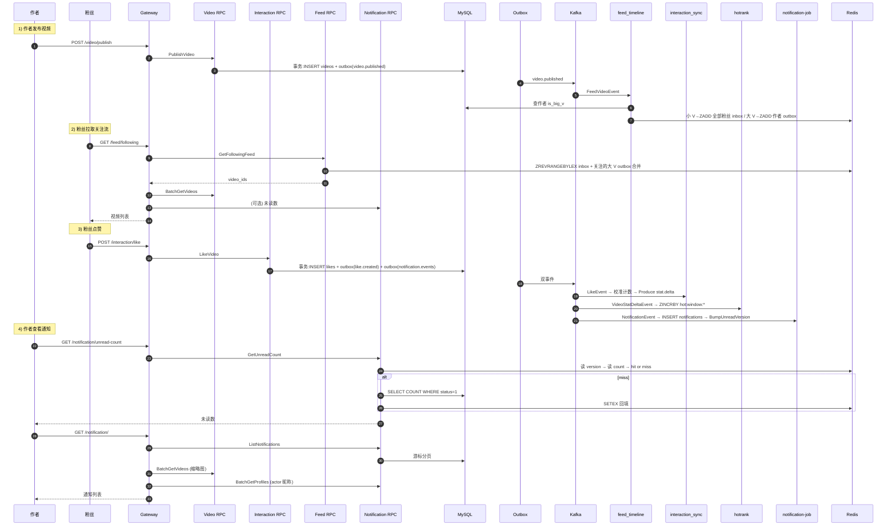

---

## 十一、Redis Key 命名空间

统一 `fsz:` 前缀，按模块拆分在 `common/rediskey/*.go`：

| 文件 | 模块 |
|---|---|
| `rediskey.go` | 通用原语 |
| `account.go` | Account 相关 |
| `video.go` | Video 相关 |
| `social.go` | Social 相关 |
| `feed.go` | Feed / Timeline 相关 |
| `hotrank.go` | 热榜相关 |
| `notification.go` | 通知未读数相关 |
| `chunkupload.go` | 分片上传相关 |

**关键 key 一览**：

| 类别 | Key 格式 | 用途 | TTL |
|---|---|---|---|
| **Account** | `fsz:account:profile:{userID}:version` | 公开资料缓存版本号 | 永久 |
| | `fsz:account:profile:{userID}:v:{version}` | 公开资料 JSON | 15 分钟±抖动 |
| | `fsz:token:{userID}` | 当前 access token | JWT 过期时间 |
| | `fsz:verify:{email}` | 邮箱验证码 | 5 分钟 |
| **Social** | `fsz:social:following:{follower}:{following}` | 单条关注状态 `1/0` | 10 分钟 |
| | `fsz:social:followers:list:{user}:page1` | 粉丝列表首页缓存 | 1 分钟 |
| | `fsz:social:followers:build_lock:{user}` | 首页构建锁 | 5 秒 |
| **Video** | `fsz:video:entity:{videoID}` | 视频实体缓存 | 10 分钟±抖动 |
| | `fsz:video:entity:{videoID}:version` | 视频实体缓存版本号（发布/删除成功后递增） | 永久 |
| | `fsz:video:stats:{videoID}` | 视频互动统计缓存 HASH | 短 |
| **Interaction** | `fsz:like:video:{videoID}:users` / `fsz:like:user:{userID}:videos` | 点赞双向带集合 | 长期 |
| | `fsz:like:state:{videoID}:{userID}` | 点赞状态覆盖缓存 `1/0` | 7 天 |
| | `fsz:like:user:{userID}:videos:list:version` | “我的喜欢”列表版本号 | 永久 |
| | `fsz:video:like_delta` / `comment_delta` / `popularity_delta` | 互动增量 HASH，field=videoID | 长期 |
| | `fsz:interaction:delta:pending:{eventID}` | 实时增量已写 Redis、尚未确认落库 | 7 天 |
| | `fsz:interaction:delta:acked:{eventID}` | 事件已完成 MySQL 聚合并处理过 delta | 7 天 |
| | `fsz:interaction:delta:pending_count:{videoID}` | 该视频尚未被 Consumer ack 的事件数；归零时清理残留 delta | 随 pending 收敛删除 |
| | `fsz:job:leases:interaction:stats_mutations` | 在线互动与 Flush 的共享租约 ZSET，和统计重建独占锁互斥 | 单租约 30 秒 |
| | `fsz:comment:list:version:{videoID}` | 评论列表版本号 | 长期 |
| | `fsz:comment:first:{videoID}:{version}` | 评论首页固定窗口缓存 | 短 |
| | `fsz:comment:idempotency:{userID}:{requestID}` | 评论发布幂等键，value=commentID | 24 小时 |
| **Feed** | `fsz:feed:timeline:user:{userID}` | 用户 inbox ZSet | 7 天 |
| | `fsz:feed:author_outbox:{authorID}` | 大 V outbox ZSet | 30 天 |
| | `fsz:feed:global_timeline` | 全局最新视频 ZSet | 长期 |
| | `fsz:feed:timeline:build_lock:{userID}` | 冷启动构建锁 | 10 秒 |
| **HotRank** | `fsz:hot:video:realtime` | Interaction 在线路径维护的累计实时热度 | 长期 |
| | `fsz:hot:window:{yyyyMMddHHmm}` | HotRank Consumer 维护的 UTC 单分钟净热度 ZSet | 默认 2 小时 |
| | `fsz:hot:merge:{asOf}` / `:ready` | Feed 合并最近窗口得到的固定分页快照及完成标记 | 默认 30 分钟 |
| **Notification** | `fsz:notification:unread:version:{userID}` | 未读数缓存版本号 | 永久 |
| | `fsz:notification:unread:count:{userID}:v:{version}` | 未读数值缓存 | 5 分钟±抖动 |
| **ChunkUpload** | `fsz:chunkupload:meta:{uploadID}` / `set:{uploadID}` | 分片会话元数据/已上传分片集合 | 24 小时 |
| | `fsz:chunkupload:hash:global:{fileHash}` | 全局秒传缓存（asset_cleanup 删除后会主动 DEL） | 7 天 |

---

## 十二、一致性 / 并发 / 幂等设计原则

### 12.1 三种缓存策略

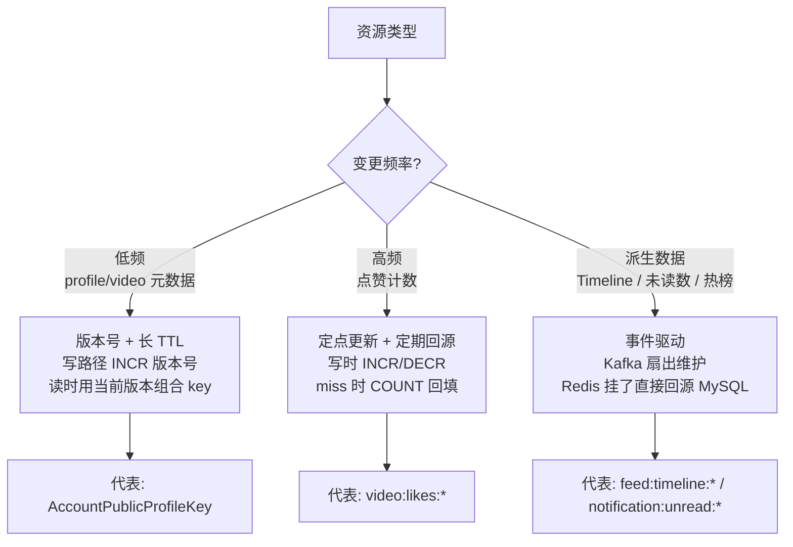

### 12.2 幂等的三层防护

| 层 | 手段 |
|---|---|
| RPC 层 | `request_id` 幂等键：视频发布 `(author_id, request_id)`、评论 `(user_id, request_id)` |
| Outbox 层 | `event_id` 唯一键 |
| Consumer 层 | `processed_events (event_id, consumer_name)` 唯一键 |

### 12.3 并发保护

| 场景 | 手段 |
|---|---|
| 并发关注同一目标 | 事务内 `SELECT ... FOR UPDATE` 锁被关注者行 |
| 并发 A↔B 互相关注 | `lockFollowAccounts` 按 `MIN(a,b), MAX(a,b)` 顺序双行锁，防锁序反转死锁 |
| 并发写同一 notification business_key | `notifications.uk_notification_business` 唯一索引兜底，冲突时事务回滚重试 |
| 并发大 V 升级 | `UPDATE ... WHERE is_big_v=0` 天然幂等 |
| 并发 outbox dispatch | `SELECT ... FOR UPDATE SKIP LOCKED` + `lock_token` |
| 并发 Timeline 冷启动 | `fsz:feed:timeline:build_lock:{viewer}` 分布式锁 |
| 并发 profile 更新 | `INCR version` 原子 |
| 并发未读数 bump | Lua 脚本 `INCR + DEL 旧 v key` 原子 |
| 并发互动 delta 与 Job 同时写 | Lua `applyInteractionDeltaScript` 判 pending/ack，同一 eventID 只入算一次 |
| 在线互动 / 多 Flush 与统计重建 | 普通写入登记共享 ZSET 租约；重建先关闭入口再等待租约排空，避免全局串行和快照覆盖 |
| 并发 asset_cleanup 与秒传 | `Cleaning` 状态 + 行锁、Gateway 遇 Cleaning 必须等待，不允许直接回改 |
| 并发 asset_cleanup 实例运行 | `ClaimTimeoutSeconds` + 事务内 `SELECT FOR UPDATE`，旧抢占者崩溃后自动释放 |
| MySQL 连接风暴 | `common/gormx` 默认 `MaxIdle=5 / MaxOpen=10`，可通过 `FSZ_MYSQL_*` 环境变量覆盖 |

### 12.4 计数更新与非负展示

- 关注数等强同步计数仍使用 `GREATEST(x-1, 0)`，避免重复取关把字段减成负数。
- 点赞数、评论数、热度的 Kafka 聚合必须保留**有符号增量**，使用普通 `column + delta`。原因是不同 partition、重试或人工重放可能让 `-1` 先于 `+1` 到达；若每一步都截断为 0，最终会错误收敛到 1。
- 用户读侧统一通过 `nonNegative` 截断展示值；定期/人工 `RebuildVideoInteractionStats` 从 `likes/comments` 事实表重建聚合字段，作为最终校准手段。

---

## 十三、Gateway HTTP API 汇总

来自 `apps/gateway/gateway.api`：

| 分组 | 路径 | 方法 | 需要鉴权 | 目标 RPC |
|---|---|---|---|---|
| **账号** | `/account/register` | POST | ❌ | Account.Register |
| | `/account/login` | POST | ❌ | Account.Login |
| | `/account/logout` | POST | ✅ | Account.Logout |
| | `/account/refresh` | POST | ❌ | Account.RefreshToken |
| | `/account/verify-code` | POST | ❌ | Account.SendVerifyCode |
| | `/account/profile` | GET | ✅ | Account.GetProfile |
| | `/account/profile` | PUT | ✅ | Account.UpdateProfile |
| **视频** | `/video/upload/init` | POST | ✅ | (Gateway 逻辑) |
| | `/video/upload/complete` | POST | ✅ | (Gateway 逻辑) |
| | `/video/publish` | POST | ✅ | Video.PublishVideo |
| | `/video/{id}` | GET | 🟡可选 | Video.GetVideo |
| | `/video/{id}` | DELETE | ✅ | Video.DeleteVideo |
| | `/video/user/{userID}` | GET | 🟡可选 | Video.ListUserVideos |
| **互动** | `/interaction/like` | POST | ✅ | Interaction.LikeVideo |
| | `/interaction/unlike` | POST | ✅ | Interaction.UnlikeVideo |
| | `/interaction/comment` | POST | ✅ | Interaction.PublishComment |
| | `/interaction/comment/{id}` | DELETE | ✅ | Interaction.DeleteComment |
| | `/interaction/comment/list` | GET | 🟡可选 | Interaction.ListComments |
| **社交** | `/social/follow` | POST | ✅ | Social.Follow |
| | `/social/unfollow` | POST | ✅ | Social.Unfollow |
| | `/social/is-following` | GET | ✅ | Social.IsFollowing |
| | `/social/users/following/batch` | POST | ✅ | Social.BatchIsFollowing |
| | `/social/followers` | GET | ✅ | Social.ListFollowers |
| | `/social/followings` | GET | ✅ | Social.ListFollowings |
| **通知** | `/notification/` | GET | ✅ | Notification.ListNotifications |
| | `/notification/unread-count` | GET | ✅ | Notification.GetUnreadCount |
| | `/notification/{id}/read` | POST | ✅ | Notification.MarkNotificationRead |
| | `/notification/read-all` | POST | ✅ | Notification.MarkAllNotificationsRead |
| **Feed** | `/feed/following` | GET | ✅ | Feed.GetFollowingFeed |
| | `/feed/recommend` | GET | 🟡可选 | Feed.GetRecommendFeed |
| | `/feed/hot` | GET | 🟡可选 | Feed.GetHotFeed |

**Handler 命名规则**：每个接口对应 `apps/gateway/internal/handler/{name}handler.go` + `apps/gateway/internal/logic/{name}logic.go`。

---

## 十四、开发与部署

### 14.1 本地一键启动依赖

```bash
cd deploy
docker-compose up -d
# MySQL: localhost:3308  (root/123456, db=feedsystem_zero, TZ=Asia/Shanghai)
# Redis: localhost:6380  (password=123456)
# etcd:  localhost:23790
# Kafka: localhost:9094
```

### 14.2 建库与建表

```bash
# SQL 通过 docker-entrypoint-initdb.d 首次启动自动执行 001~016
# 手动重跑单条：
docker exec -i feedsystem-zero-mysql mysql -uroot -p123456 feedsystem_zero < deploy/sql/016_outbox_aggregate_status_index.sql
```

### 14.3 建 Kafka Topic

```bash
bash deploy/kafka/create_topics.sh
```

### 14.4 启动所有服务

```bash
# RPC
go run apps/account/account.go             -f apps/account/etc/account.yaml
go run apps/video/video.go                 -f apps/video/etc/video.yaml
go run apps/interaction/interaction.go     -f apps/interaction/etc/interaction.yaml
go run apps/social/social.go               -f apps/social/etc/social.yaml
go run apps/notification/notification.go   -f apps/notification/etc/notification.yaml
go run apps/feed/feed.go                   -f apps/feed/etc/feed.yaml

# Gateway
go run apps/gateway/gateway.go             -f apps/gateway/etc/gateway.yaml

# Jobs
go run apps/job/outbox/outbox.go                     -f apps/job/outbox/etc/outbox.yaml
go run apps/job/interaction_sync/interaction_sync.go -f apps/job/interaction_sync/etc/interaction_sync.yaml
go run apps/job/social_sync/social_sync.go           -f apps/job/social_sync/etc/social_sync.yaml
go run apps/job/feed_timeline/feed_timeline.go       -f apps/job/feed_timeline/etc/feed_timeline.yaml
go run apps/job/hotrank/hotrank.go                   -f apps/job/hotrank/etc/hotrank.yaml
go run apps/job/notification/notification.go        -f apps/job/notification/etc/notification.yaml
go run apps/job/asset_cleanup/asset_cleanup.go       -f apps/job/asset_cleanup/etc/asset_cleanup.yaml
```

### 14.5 常用命令

```bash
go build ./...       # 全量编译
go vet ./...         # 静态检查
go test ./...        # 单元测试

# 重新生成 RPC 代码（改了 proto 后）
cd apps/account
goctl rpc protoc account.proto --go_out=. --go-grpc_out=. --zrpc_out=. --style=goZero
# 注意：goctl 1.10.1 生成的 client 包名会是驼峰，
# 需手动改 accountclient/account.go 的 package 为全小写

# 重新生成 API 代码（改了 gateway.api 后）
cd apps/gateway
goctl api go -api gateway.api -dir . --style=goZero
```

### 14.6 测试、压测与一致性验收（2026-08-03）

#### 14.6.1 验证范围与结论

本轮验证覆盖 Gateway → RPC → MySQL/Redis → Outbox → Kafka → Job → MySQL/Redis 的后端闭环，包括：

- 发布视频、点赞/取消点赞、关注、关注流、热榜五个 HTTP 压测场景；
- Outbox 全部投递、四类 Kafka Consumer Group lag、互动 Redis 增量收敛；
- 视频互动聚合、社交冗余计数、文件资产引用计数三类 MySQL 对账；
- 互动同步批量事务、并发租约和临时 RPC 重试的单元测试、`-race` 与 `go vet`。

**结论**：本次互动同步优化和现有后端压测集已经完成，最终没有未投递 Outbox、互动死信、Kafka lag、Redis 残留增量或 MySQL 聚合差异。严格意义上的全项目 E2E 尚有一个环境型例外：`tests/e2e/TestSmoke` 使用 `@loadtest.local` 虚构邮箱，真实 163 SMTP 会拒绝发送验证码；业务包测试不受影响。要让该用例全绿，需要给测试环境注入假邮件发送器，或使用可接收邮件的测试账号。

#### 14.6.2 构造正式规模数据

```bash
# 只清理 seed/loadtest 数据和 fsz:* 派生缓存，不删除真实用户上传文件
go run ./tests/cmd/seed \
  -reset \
  -reset-redis \
  -users 10000 \
  -videos 5000 \
  -file-buckets 100
```

正式测试数据为 **10000 个用户 + 5000 个视频**。压测工具从这些数据中抽取登录池和目标池，不把造数耗时计入请求指标。

#### 14.6.3 功能与读场景压测结果

以下结果来自同一台本地开发机，所有依赖和服务都运行在单机，数据用于版本内回归和架构瓶颈分析，不能直接等同于生产集群容量。

| 场景 | 参数 | 成功率 | QPS | P50 | P95 | P99 | Max |
|---|---|---:|---:|---:|---:|---:|---:|
| 发布视频 | `c=5,d=10s,login=20` | 100% | 318.7 | 15ms | 20ms | 24ms | 53ms |
| 点赞冒烟 | `c=10,d=10s,login=20,target=100` | 100% | 327.7 | 29ms | 40ms | 47ms | 60ms |
| 关注 | `c=10,d=10s,login=20,target=100` | 100% | 354.7 | 26ms | 43ms | 54ms | 101ms |
| 关注流 | `c=20,d=30s,login=50` | 100% | 1076.8 | 17ms | 25ms | 30ms | 49ms |
| 热榜（缓存命中） | `c=50,d=30s` | 100% | 7503.4 | 5ms | 13ms | 16ms | 32ms |
| 热榜（删除 merge 后重建） | `c=50,d=30s` | 100% | 1428.1 | 34ms | 46ms | 54ms | 82ms |

热榜冷构建压测结束后，`fsz:hot:merge:{minute}:ready=50` 且对应 ZSET `ZCARD=50`，证明低 QPS 不是空缓存错误，而是请求触发聚合构建后的真实成本。

#### 14.6.4 点赞链路正式规模优化前后对比

复现命令：

```bash
go run ./tests/cmd/loadtest \
  -scenario like \
  -c 50 \
  -d 60s \
  -warmup 5s \
  -login-pool 500 \
  -target-pool 2000 \
  -v
```

`like` 场景的一次统计循环包含一次 Like 和一次 Unlike，因此 `循环 QPS × 2` 才接近 HTTP 写请求数和互动事件生产速率。

| 指标 | 优化前：逐事件事务 + Flush 全局串行 | 优化后：500 条批量事务 + partition 并发 |
|---|---:|---:|
| 总循环数 | 19955 | 15663 |
| 成功率 | 100% | 100% |
| 业务循环 QPS | 332.0 | 260.4 |
| 约合 HTTP 写请求/事件生产速率 | 约 664/s | 约 520.8/s |
| P50 / P95 / P99 | 143 / 236 / 291ms | 182 / 307 / 374ms |
| Max | 443ms | 570ms |
| 压测结束时 Kafka 表现 | 积压超过 3 万，需数分钟排空 | 约 7 秒排空 |
| 最终 Kafka lag | 0 | 0 |

不能只看“优化前 332 QPS 高于优化后 260.4 QPS”就判断退化。优化前的在线接口把大量未完成工作堆进 Kafka，属于**不可持续的生产速度**；优化后 Consumer 在压测期间同时争用本机 MySQL/Redis 并持续完成约 470～500 事件/s，尾部仅约 7 秒。后者反映的是更真实的端到端可持续吞吐。

这次优化的关键点：

1. 从每事件一个事务改为每 500 事件一个事务，大幅减少事务提交次数。
2. `processed_events` 按 eventID 固定顺序写入，视频计数按 videoID 聚合并升序更新，降低死锁概率。
3. 移除 Flush 全局串行锁，改为普通写共享租约 + 统计重建独占锁。
4. Consumer 按 topic+partition 分组，组内保序、组间最多 4 worker 并发。
5. DB 失败让整个 Kafka 批次重试；格式/业务坏消息有限重试后进死信；DB COMMIT 后才 ack Redis。

#### 14.6.5 最终一致性检查

压测停止并等待 Consumer 排空后，验收结果如下：

| 检查项 | 最终值 | 判定 |
|---|---:|---|
| `outbox_events WHERE status <> 2` | 0 | 全部投递成功 |
| interaction `dead_letter_events` | 0 | 无互动坏消息/永久失败 |
| `interaction-sync-job` Kafka lag | 0 | 点赞事件全部消费 |
| `feed-timeline-job` Kafka lag | 0 | Feed 事件全部消费 |
| `hotrank-job` Kafka lag | 0 | 热榜事件全部消费 |
| `notification-job` Kafka lag | 0 | 通知事件全部消费 |
| Redis like/comment/popularity delta HLEN | 0 / 0 / 0 | 实时增量已全部落库并抵消 |
| Redis pending / pending_count key 数 | 0 / 0 | 无未确认事件 |
| `video_stats_mismatches` | 0 | videos 聚合值与 likes/comments 事实表一致 |
| `social_counter_mismatches` | 0 | accounts 粉丝/关注冗余计数一致 |
| `asset_ref_mismatches` | 0 | file_assets 引用计数一致 |
| 活跃互动统计租约 | 0 | 无泄漏的并发租约 |

常用运行态检查：

```bash
# Outbox 是否仍有未投递记录；无输出即通过
sudo docker exec feedsystem-zero-mysql \
  mysql -uroot -p123456 feedsystem_zero \
  -e "SELECT topic,status,COUNT(*) count FROM outbox_events WHERE status<>2 GROUP BY topic,status;"

# interaction_sync 各 partition 的 CURRENT-OFFSET 应等于 LOG-END-OFFSET，LAG=0
sudo docker exec feedsystem-zero-kafka kafka-consumer-groups \
  --bootstrap-server 127.0.0.1:9092 \
  --group interaction-sync-job --describe

# 三个 HLEN 和两类 SCAN 计数最终都应为 0
sudo docker exec feedsystem-zero-redis redis-cli -a 123456 HLEN fsz:video:like_delta
sudo docker exec feedsystem-zero-redis redis-cli -a 123456 HLEN fsz:video:comment_delta
sudo docker exec feedsystem-zero-redis redis-cli -a 123456 HLEN fsz:video:popularity_delta
```

#### 14.6.6 代码质量验证

```bash
go test -race -count=1 \
  ./apps/interaction/internal/logic \
  ./apps/job/outbox/internal/logic \
  ./apps/job/interaction_sync/internal/logic \
  ./apps/job/hotrank/internal/logic \
  ./apps/job/notification/internal/logic \
  ./apps/job/feed_timeline/internal/logic \
  ./apps/social/internal/logic \
  ./apps/video/internal/logic \
  ./apps/feed/internal/logic \
  ./tests/internal/loadgen

go vet ./apps/... ./common/... ./tests/...
```

上述 `-race` 包全部通过，静态检查无输出。针对本次改动的 interaction / interaction_sync / rediskey 测试也已单独重复执行并通过。

---

## 十五、约定与最佳实践

1. **身份识别**：所有需要 `user_id` 的 RPC 参数**必须**由 Gateway 从 JWT 提取后填入，不接收前端传值。
2. **幂等键**：视频发布用 `(author_id, request_id)`；评论用 `(user_id, request_id)`；事件处理用 `(event_id, consumer_name)`；通知去重用 `business_key`。
3. **软删除**：`videos`、`likes`、`comments`、`follows`、`notifications` 全部软删除，配合 `status` + `deleted_at` 字段做状态机。
4. **游标分页**：所有列表接口用"排序字段 + 主键"双游标（如 `(occurred_at, id)`），永不重复不遗漏，**禁止 offset 分页**。
5. **批量接口**：Gateway 聚合层禁止 N+1，必须使用 `BatchGetProfiles` / `BatchGetVideos` / `BatchGetVideoStats` / `BatchIsFollowing`。
6. **Redis Key**：一律通过 `rediskey.*Key(...)` 生成，禁止在业务代码里手写字符串拼接。
7. **Kafka 消息**：一律通过 outbox 发布，禁止业务代码直接调 `kafkax.Producer`。
8. **事务边界**：跨服务不共享事务；单服务内业务表 + outbox_events 必须同一事务。
9. **时区一致**：MySQL 用 `Asia/Shanghai`，Go 用 `time.Local`，写入时 UTC→Local，读取时 Local→UTC 只在必要时转换。
10. **大 V 判定**：只能读 `is_big_v` 标志位，禁止在读路径实时判断 `follower_count > threshold`。
11. **失败即降级**：Redis 报错继续走 MySQL 回源，不 return error；死信隔离，绝不阻塞 partition。
12. **禁止在 consumer 事务外做副作用**：所有 Redis 写入必须在 MySQL COMMIT 之后。

---

## 十六、附录：核心代码文件索引

| 主题 | 关键文件 |
|---|---|
| **Timeline 编码** | `common/feedx/timeline.go` |
| **大 V 判定** | `common/feedx/bigv.go` |
| **Redis Key & TTL** | `common/rediskey/{rediskey,account,video,social,feed,hotrank,notification,chunkupload}.go` |
| **未读数缓存** | `common/notificationcache/unread.go` |
| **Kafka Topics** | `common/eventx/topics.go` |
| **Event Envelope** | `common/eventx/events.go` |
| **JWT 签发/解析** | `common/jwtx/jwtx.go` |
| **关注事务** | `apps/social/internal/logic/followlogic.go` |
| **取关事务** | `apps/social/internal/logic/unfollowlogic.go` |
| **社交缓存辅助** | `apps/social/internal/logic/socialhelper.go` |
| **Profile 批量查** | `apps/account/internal/logic/batchgetprofileslogic.go` |
| **视频发布** | `apps/video/internal/logic/publishvideologic.go` |
| **点赞** | `apps/interaction/internal/logic/likevideologic.go` |
| **通知列表** | `apps/notification/internal/logic/listnotificationslogic.go` |
| **未读数** | `apps/notification/internal/logic/getunreadcountlogic.go` |
| **标记已读** | `apps/notification/internal/logic/marknotificationreadlogic.go` / `markallnotificationsreadlogic.go` |
| **Feed 冷启动 & 大 V 合并** | `apps/feed/internal/logic/feedhelper.go` |
| **Feed 三个 Rpc** | `apps/feed/internal/logic/{getfollowingfeed,gethotfeed,getrecommendfeed}logic.go` |
| **Outbox Dispatcher** | `apps/job/outbox/internal/logic/dispatcher.go` |
| **推拉分离扇出** | `apps/job/feed_timeline/internal/logic/timelinewriter.go` |
| **feed_timeline Consumer** | `apps/job/feed_timeline/internal/logic/consumer.go` |
| **互动同步 Consumer** | `apps/job/interaction_sync/internal/logic/syncconsumer.go` |
| **互动批量刷库与并发租约** | `apps/interaction/internal/logic/jobhelper.go`、`flushlikeeventslogic.go`、`flushcommenteventslogic.go`、`rebuildvideointeractionstatslogic.go` |
| **互动 delta pending/ack** | `apps/interaction/internal/logic/interactionhelper.go`、`apps/interaction/internal/logic/jobhelper.go`（`applyInteractionDeltaScript` / `acknowledgeInteractionDeltaScript`） |
| **关注同步 Consumer** | `apps/job/social_sync/internal/logic/syncconsumer.go` |
| **热榜 Consumer** | `apps/job/hotrank/internal/logic/consumer.go` |
| **通知 Consumer** | `apps/job/notification/internal/logic/consumer.go` |
| **文件资产清理 Job** | `apps/job/asset_cleanup/internal/logic/cleaner.go` |
| **秒传与资产登记** | `apps/gateway/internal/logic/fileassethelper.go`（`upsertFileAsset`）、`apps/gateway/internal/logic/videohelper.go`（`lookupInstantUploadedFile`） |
| **Gateway 路由契约** | `apps/gateway/gateway.api` |
| **Gateway JWT 中间件** | `apps/gateway/internal/middleware/tokenauthmiddleware.go` |
| **Gateway 通知聚合** | `apps/gateway/internal/logic/notificationhelper.go` |
| **造数与 HTTP 压测** | `tests/cmd/seed/main.go`、`tests/cmd/loadtest/main.go`、`tests/internal/{seed,scenario,loadgen}` |

---

## 十七、最近更新（Changelog）

### 2026-08-04（Outbox 保序 + 全链路死锁加固）

**Outbox Dispatcher（`apps/job/outbox/internal/logic/dispatcher.go` + `deploy/sql/016_outbox_aggregate_status_index.sql`）**：

- 认领 SQL 增加 `NOT EXISTS ... predecessor.status IN (pending, failed, dead, processing)` 子句：同一 aggregate 必须等前序事件 `sent` 后才允许下一条投递，从源头杜绝 `create/delete`、`like/unlike`、`follow/unfollow` 反序。
- 认领改为短事务一次性拉一批 + 共享 `lock_token`；投递阶段用 `splitOutboxBatches` 按 worker 数（默认 4，上限 32）均匀分片，每分片一次性调用 `Producer.PublishBatch` 避免逐条投递耢同 BatchTimeout。
- 主循环使用 `inFlight` 1-位令牌旺，匆匆 tick 时自动 skip 并报 warn，防止堆积时无限创建 goroutine。
- 成功路径一条 `UPDATE ... WHERE id IN (...) AND status=processing AND lock_token=:token` 批量回写 `sent`，失败路径逐条 `markFailed` 阶梯退避，超 `MaxRetry` 后转 `dead` 需人工干预。日志错误文本上限 1024 rune 防止日志盘爆盘。

**Social 事务（`apps/social/internal/logic/{followlogic,unfollowlogic,socialhelper}.go`）**：

- Follow/Unfollow 整个事务包裹在 `runSocialWriteTransaction` 里，对 MySQL 1213/1205 有限重试（默认 3 次，指数退避 20ms→200ms 上限，附 50% 拖抽），其余错误不重试。
- 移除 Follow 事务里的 `AccountRpc.GetProfile` 预检，直接依靠 follows 外键在 INSERT 时失败并映射为 `codes.NotFound`，减少一次 RPC + 一段长持锁时间。
- 移除 follows 开头对不存在唯一键的 `SELECT ... FOR UPDATE`（旧实现会产生 gap lock 以至于 INSERT 时升级为插入意向锁并引发死锁），改为普通 `Take` 预读 + `ON DUPLICATE KEY DO NOTHING` + 冲突后回读加锁。

**Notification Job（`apps/job/notification/internal/logic/consumer.go`）**：

- 事务重试循环对 1213/1205 有限重试（默认 3，上限 8，依 `DBRetryBase/MaxMs` 退避）。
- 每轮重试**新建 `attemptBumpReceivers` 局部集合**，已回滚事务里的 receiver 不会被带到后续成功提交后交 bump，涻除“MySQL 回滚但未读版本号已递增”的脏数据。

**Video PublishVideo（`apps/video/internal/logic/{publishvideologic,fileassethelper}.go`）**：

- `orderedFileAssetURLs` 对 `play_url / cover_url` **去重后升序**排列，事务内同顺序调用 `reserveFileAssetRefByURL`。任何两个并发发布事务的资产行加锁序一致，从根源消除资产维度锁序反转。

**Interaction Sync（`apps/job/interaction_sync/internal/logic/syncconsumer.go`）**：

- 提取 `callFlushRPCWithRetry` 泛型包裹 Flush RPC，对 `Aborted/Unavailable/DeadlineExceeded/ResourceExhausted` 在当前 partition worker 内退避重试。成功分区不会因其他分区报错而被重新消费，offset 仍可前推。
- `shouldLogFlushRPCRetry` 只在首次与每 10 次重试时写 error 日志，避免长时下游故障后日志洪水。
- 默认 batch 与 flush 均为 **500**（`syncconsumer.go` 常量 + `interaction_sync.yaml`），上限 500；`Kafka.BatchSize` 先于 `Sync.BatchSize` 只在 Sync 未配时作为兑底。

**Interaction 域内**：

- `videoStatDeltaUpdates` 不再以 `GREATEST(..., 0)` 封顶（防止 Kafka 乱序下“先处理 -1 再处理 +1”错误收敛为 0），仅在读路径 `realtimeLikesCount / batchGetVideoStats` 完成回带 delta 后才用 `nonNegative` 兑底。
- `InteractionDeltaPendingCountKey(videoID)` 作为独立收敛不变量：最后一个 pending 事件 ack 后强制删除该视频三类增量字段，消除并发交错遗留的“孤立 delta”。

**测试**：

- 新增/更新单元测试：`dispatcher_test.go`（claim SQL 包含 NOT EXISTS 与 splitOutboxBatches）、`syncconsumer_test.go`（callFlushRPCWithRetry / shouldLogFlushRPCRetry / normalizeSyncBatchSize）、`consumer_test.go`（isRetryableNotificationDBError 覆盖 1213/1205 与 wrapped error）、`fileassethelper_test.go`（orderedFileAssetURLs 去重升序）、`jobhelper_test.go`（videoStatDeltaUpdates 去 GREATEST）。`go test ./...` / `go vet ./...` 均零告警零失败。

**文档补充**（`docs/PROJECT_OVERVIEW.md` §9.1）：新增 4 个小节沉淀 Outbox 深度概念——`9.1.1 三层并发单位模型`（集群 / 进程 / 单轮）、`9.1.2 生命周期同步：inFlight 与 WaitGroup 的分工`（并发限制 vs 优雅关闭）、`9.1.3 X 锁 vs 业务层租约`（区分 MySQL 行锁 & lock_token 印章，明确 outbox 是租约模型）、`9.1.4 两阶段独立 ctx 与失败路径的原子处理`（Kafka/DB 各自超时预算、整批重试逐条 markFailed 首错记录、无缓冲 channel + 双 case select 优雅退出）。原 9.1.5 消费者失败处理小节保持不变。

### 2026-08-03（互动同步吞吐优化与正式规模验收）

**Interaction / interaction_sync**：

- Flush 从“每事件一个事务”改为“最多 500 事件一个批量事务”；`processed_events` 按 eventID 排序，首次事件按 videoID 聚合净增量并升序更新。
- Consumer 按 `topic+partition` 分组，组内保序、组间 4 worker 并发；临时 RPC 错误在分区 worker 内退避重试，避免成功分区被整批重复消费。
- 删除点赞/评论 Flush 的全局串行锁，增加 `fsz:job:leases:interaction:stats_mutations` 共享租约；统计重建采用独占入口锁并等待已有租约排空。
- `pending_count:{videoID}` 成为独立收敛不变量：最后一个事件 ack 后清理对应视频残留 delta，修复高并发交错或历史中断遗留字段。
- Flush 批量 RPC 忽略普通请求体访问日志，保留指标、慢调用和错误日志，避免大批次日志放大。

**测试与文档**：

- 完成 10000 用户、5000 视频正式规模压测；优化后点赞链路 100% 成功，约 520.8 HTTP 写请求/s，Kafka 在压测结束约 7 秒后排空。
- Outbox 未投递、互动死信、Kafka lag、Redis delta/pending、视频统计差异、社交计数差异、文件引用差异最终全部为 0。
- 关键包通过 `go test -race`，静态检查无输出；新增批量边界、重试、租约脚本和 Redis 收敛不变量测试。
- §8.3、§9.2、§11、§12、§14.6 已同步当前代码与实测结果，删除“单消费者逐条更新”和“单机万级 QPS”等无法由实测支持的旧结论。

### 2026-07-30（commit 687d0ab · 完善后端一致性与文件资产清理）

**新增模块**：

- 新增第 7 个 Job **asset_cleanup**：延迟物理清理 `file_assets`。四状态机 `Active(1)/PendingDelete(2)/Cleaning(4)/Deleted(3)`，Grace 期 + 抢占超时兜底 + 引用复活兜底 + 上传目录路径注入防御。详情见 §9.5。

**一致性与并发**：

- **互动 delta pending/ack 双标记**：`fsz:interaction:delta:pending/acked:{eventID}` + Lua `applyInteractionDeltaScript` / `acknowledgeInteractionDeltaScript`。彻底根除"在线路径写 Redis delta"与"Job 消费后再扣一次"的重复计数窗口。详情见 §8.3、§11。
- **Social Follow/Unfollow 账户行双锁**：`lockFollowAccounts` 按 `MIN(a,b), MAX(a,b)` 顺序 `SELECT FOR UPDATE`，杜绝 A↔B 互相关注的锁顺序反转死锁。详情见 §8.4、§12.3。
- **feed_timeline global ready 自愈**：`errGlobalTimelineNotReady` 由 consumer 层主动调 `BootstrapGlobalTimeline` 恢复后重试，不再靠 Kafka 无限重试。详情见 §9.3。
- **视频秒传状态机对齐**：`upsertFileAsset` 遇 `Cleaning` 必须轮询等待，禁止直接改回 `Active`；成功后返回 canonical URL；上传接口统一使用 canonical URL。详情见 §8.2。
- **文件魔数二次校验**：`validateUploadedFilePathSignature` 对整传与分片合并结果双重校验，防伪造扩展名/传输损坏。

**Gateway 强化**：

- `GetVideo` / `ListUserVideos` / `ListComments` 增加作者昵称回填，用最新 Account RPC 数据替换视频/评论表内的旧快照，RPC 失败降级返回快照。

**基础设施**：

- `common/gormx` 加入 MaxIdle=5 / MaxOpen=10 默认连接池配置，可通过 `FSZ_MYSQL_*` 环境变量覆盖，避免多进程耗尽 MySQL 全局连接。
- 修正 `social_sync` / `notification` Job 的 Redis 端口和密码（`127.0.0.1:6380` / `123456`）。

**新增 Redis Key**：

- `fsz:interaction:delta:pending:{eventID}` / `fsz:interaction:delta:acked:{eventID}`
- `fsz:video:entity:{videoID}:version`
- `fsz:like:user:{userID}:videos:list:version`
- `fsz:comment:list:version:{videoID}` / `fsz:comment:first:{videoID}:{version}` / `fsz:comment:idempotency:{userID}:{requestID}`

---

**文档结束**。这份文档反映的是当前 main 分支的真实状态。修改代码后如果关键流程发生变化，请同步更新对应章节的 Mermaid 图、Changelog 和索引表。
